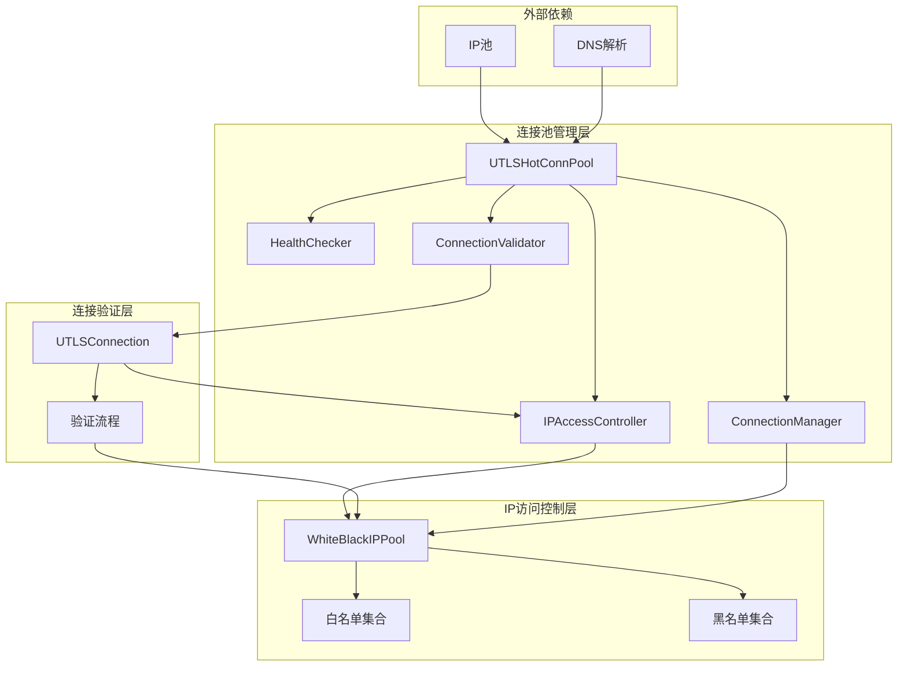
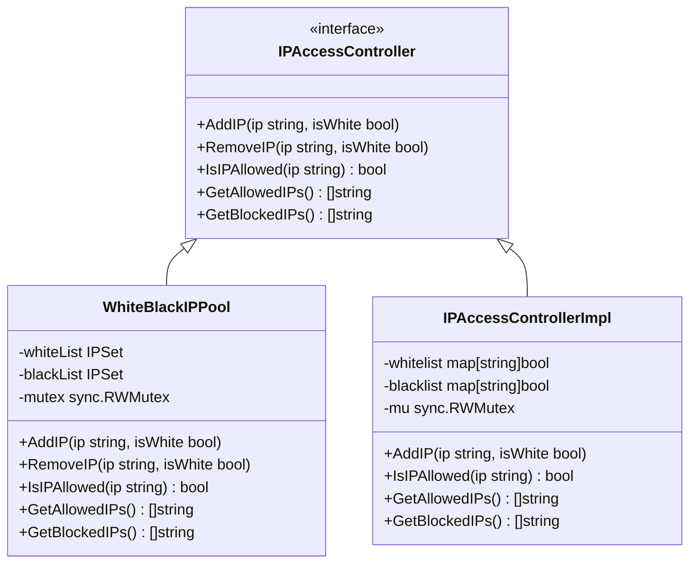
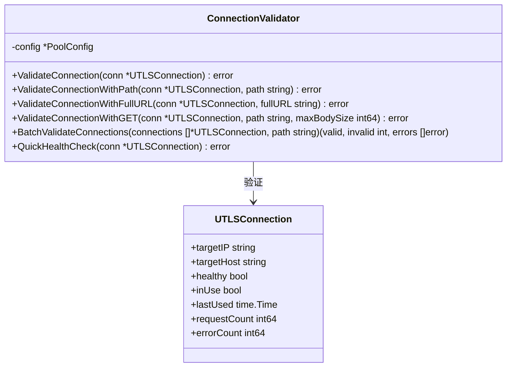
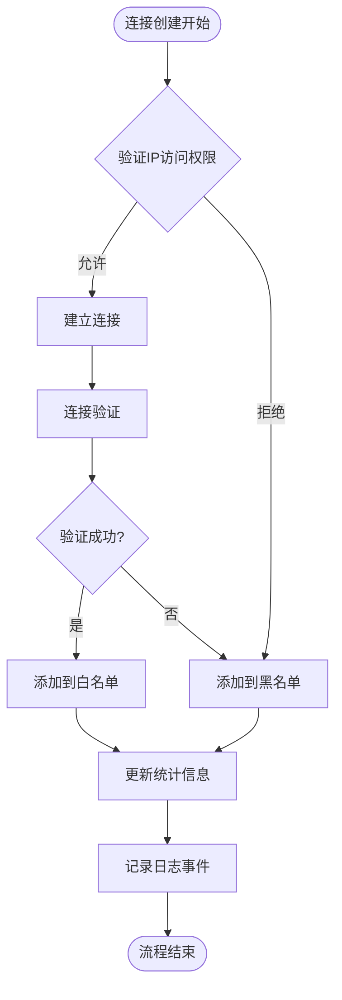
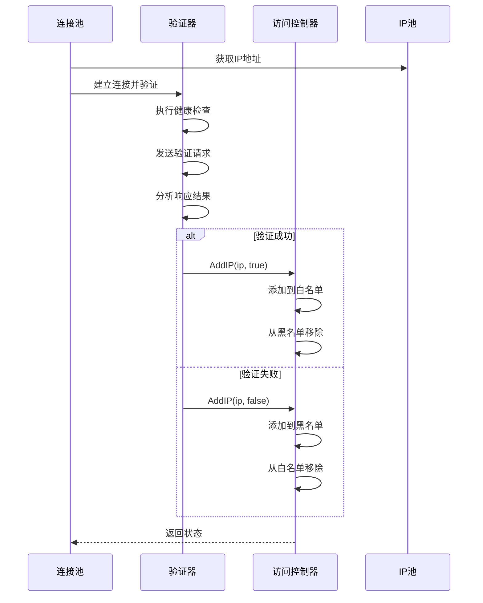
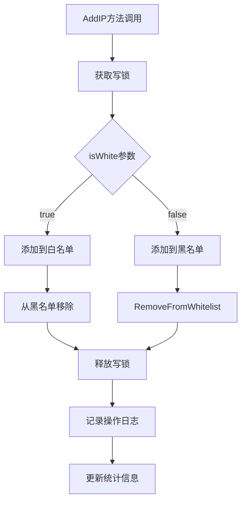
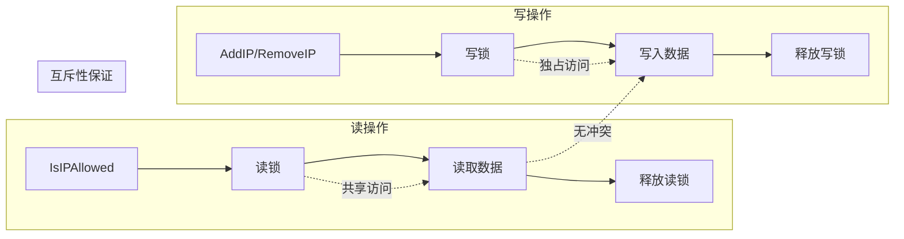
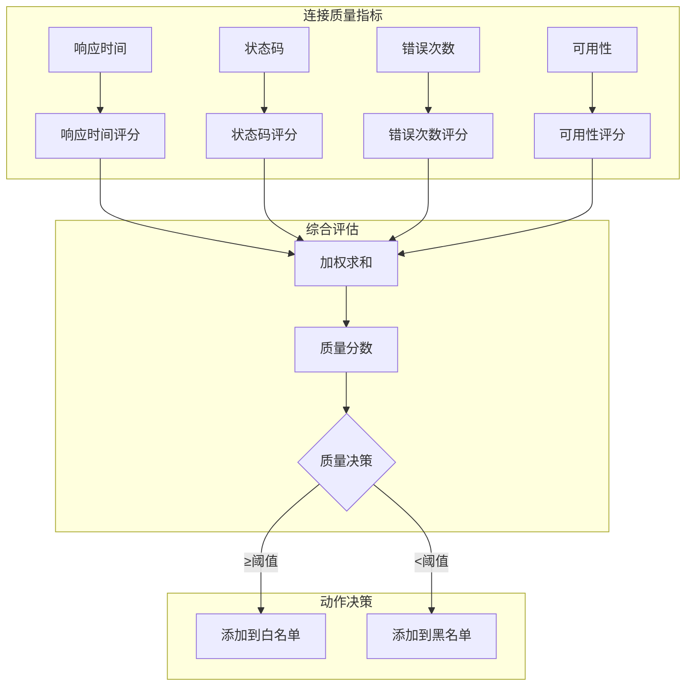
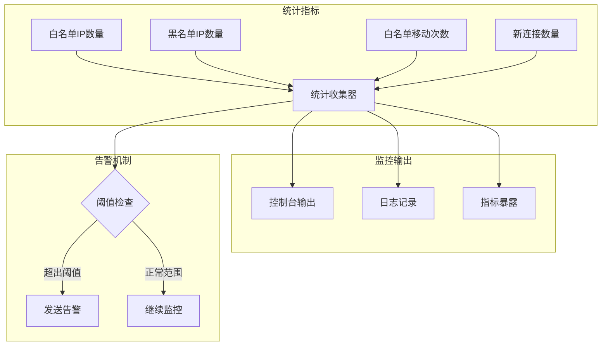
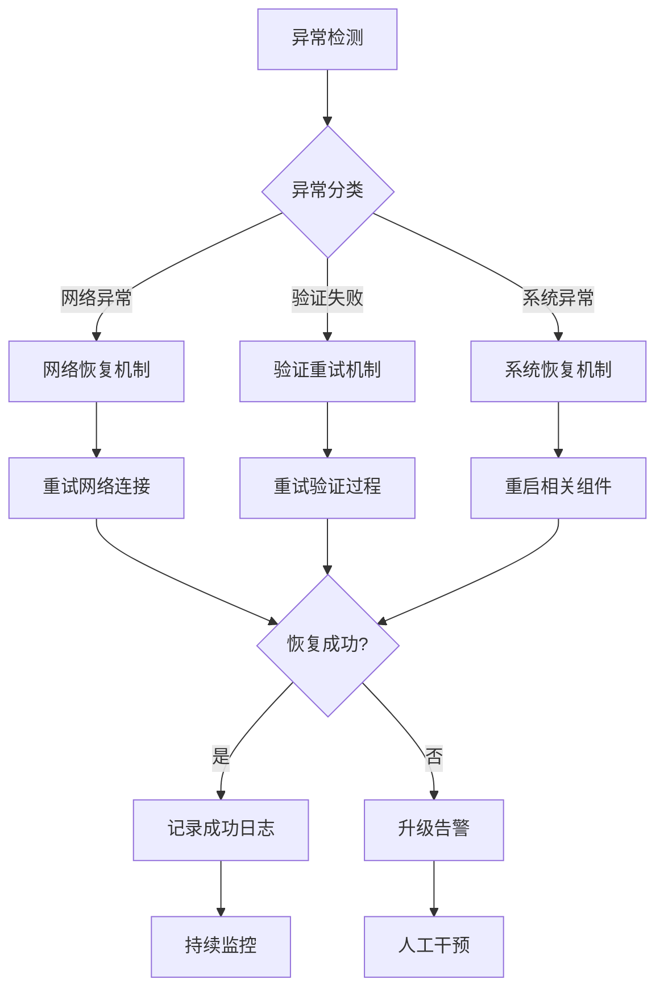

# 黑白名单更新机制

<cite>
**本文档引用的文件**
- [remotedomainippool/whiteblackippool.go](file://remotedomainippool/whiteblackippool.go)
- [utlsclient/ip_access_controller.go](file://utlsclient/ip_access_controller.go)
- [utlsclient/connection_validator.go](file://utlsclient/connection_validator.go)
- [utlsclient/connection_manager.go](file://utlsclient/connection_manager.go)
- [utlsclient/utlshotconnpool.go](file://utlsclient/utlshotconnpool.go)
- [utlsclient/connection_helpers.go](file://utlsclient/connection_helpers.go)
- [test/utlsclient/ip_access_controller_test.go](file://test/utlsclient/ip_access_controller_test.go)
</cite>

## 目录
1. [概述](#概述)
2. [系统架构](#系统架构)
3. [核心组件分析](#核心组件分析)
4. [黑白名单更新流程](#黑白名单更新流程)
5. [连接验证与状态变更](#连接验证与状态变更)
6. [互斥性保证机制](#互斥性保证机制)
7. [自动化IP质量筛选](#自动化ip质量筛选)
8. [监控与统计](#监控与统计)
9. [故障处理与恢复](#故障处理与恢复)
10. [最佳实践建议](#最佳实践建议)

## 概述

黑白名单更新机制是爬虫平台连接池系统的核心安全控制功能，通过自动化的IP访问控制实现智能的网络质量筛选。该机制基于连接验证结果动态调整IP的白名单和黑名单状态，确保只有高质量、可访问的IP地址能够参与连接池的运营。

系统采用分层架构设计，包含IP访问控制器、连接验证器、连接管理器等多个核心组件，通过并发安全的设计保证大规模场景下的稳定运行。

## 系统架构

**图表来源**
- [utlsclient/utlshotconnpool.go](file://utlsclient/utlshotconnpool.go#L237-L258)
- [remotedomainippool/whiteblackippool.go](file://remotedomainippool/whiteblackippool.go#L31-L35)

## 核心组件分析

### IP访问控制器接口

系统定义了统一的IP访问控制器接口，支持多种实现方式：

**图表来源**
- [remotedomainippool/whiteblackippool.go](file://remotedomainippool/whiteblackippool.go#L7-L25)
- [utlsclient/ip_access_controller.go](file://utlsclient/ip_access_controller.go#L8-L12)

### 连接验证器

连接验证器负责执行各种级别的连接有效性检查：

**图表来源**
- [utlsclient/connection_validator.go](file://utlsclient/connection_validator.go#L11-L14)

**章节来源**
- [remotedomainippool/whiteblackippool.go](file://remotedomainippool/whiteblackippool.go#L1-L127)
- [utlsclient/ip_access_controller.go](file://utlsclient/ip_access_controller.go#L1-L184)
- [utlsclient/connection_validator.go](file://utlsclient/connection_validator.go#L1-L263)

## 黑白名单更新流程

### AddIP方法调用逻辑

系统通过多个入口点触发IP状态更新，主要分为以下几种情况：

**图表来源**
- [utlsclient/connection_helpers.go](file://utlsclient/connection_helpers.go#L64-L181)

### 不同验证结果下的处理逻辑

系统根据连接验证的不同结果采取相应的IP状态更新策略：

| 验证结果 | IP状态变更 | 操作描述 | 日志级别 |
|---------|-----------|----------|----------|
| 连接成功 | 白名单 | 添加到白名单，移除黑名单 | INFO |
| 连接失败 | 黑名单 | 添加到黑名单，移除白名单 | ERROR |
| 验证超时 | 黑名单 | 添加到黑名单，移除白名单 | WARN |
| 状态码异常 | 黑名单 | 添加到黑名单，移除白名单 | ERROR |
| 主机名不匹配 | 黑名单 | 添加到黑名单，移除白名单 | ERROR |

**章节来源**
- [utlsclient/connection_helpers.go](file://utlsclient/connection_helpers.go#L64-L181)

## 连接验证与状态变更

### 连接验证流程

连接验证是黑白名单更新的核心驱动力，系统提供多层次的验证机制：

**图表来源**
- [utlsclient/connection_validator.go](file://utlsclient/connection_validator.go#L23-L96)
- [utlsclient/connection_helpers.go](file://utlsclient/connection_helpers.go#L64-L181)

### IP访问控制器状态变更

IP访问控制器通过AddIP方法实现状态变更，确保操作的原子性和一致性：

**图表来源**
- [utlsclient/ip_access_controller.go](file://utlsclient/ip_access_controller.go#L45-L59)
- [remotedomainippool/whiteblackippool.go](file://remotedomainippool/whiteblackippool.go#L47-L59)

**章节来源**
- [utlsclient/connection_validator.go](file://utlsclient/connection_validator.go#L23-L263)
- [utlsclient/connection_helpers.go](file://utlsclient/connection_helpers.go#L44-L181)

## 互斥性保证机制

### 并发安全设计

系统采用读写锁机制确保黑白名单操作的并发安全性：

**图表来源**
- [utlsclient/ip_access_controller.go](file://utlsclient/ip_access_controller.go#L23-L41)
- [remotedomainippool/whiteblackippool.go](file://remotedomainippool/whiteblackippool.go#L85-L99)

### 黑白名单互斥性

系统通过AddIP方法的内部逻辑确保IP只能存在于一个名单中：

| 操作类型 | 当前状态 | 结果状态 | 互斥性保证 |
|---------|---------|---------|-----------|
| 添加到白名单 | 在黑名单 | 白名单+移除黑名单 | 自动互斥 |
| 添加到白名单 | 已在白名单 | 保持白名单 | 重复操作安全 |
| 添加到黑名单 | 在白名单 | 黑名单+移除白名单 | 强制互斥 |
| 添加到黑名单 | 已在黑名单 | 保持黑名单 | 重复操作安全 |

**章节来源**
- [utlsclient/ip_access_controller.go](file://utlsclient/ip_access_controller.go#L45-L59)
- [remotedomainippool/whiteblackippool.go](file://remotedomainippool/whiteblackippool.go#L47-L59)

## 自动化IP质量筛选

### IP质量评估指标

系统通过多维度指标自动评估IP的质量等级：

### 自动化筛选规则

系统根据连接验证结果自动执行IP状态更新：

| 触发条件 | 筛选动作 | 更新目标 | 时间延迟 |
|---------|---------|---------|----------|
| 连接成功 | 白名单更新 | 新增白名单IP | 实时 |
| 连接失败 | 黑名单更新 | 新增黑名单IP | 实时 |
| 频繁失败 | 黑名单升级 | 提升黑名单优先级 | 实时 |
| 间歇性失败 | 质量监控 | 持续观察状态 | 定期检查 |
| DNS变更 | IP验证 | 验证新IP可用性 | DNS更新周期 |

**章节来源**
- [utlsclient/utlshotconnpool.go](file://utlsclient/utlshotconnpool.go#L908-L926)
- [utlsclient/connection_helpers.go](file://utlsclient/connection_helpers.go#L64-L181)

## 监控与统计

### 统计信息收集

系统实时收集黑白名单相关的统计信息：

**图表来源**
- [utlsclient/utlshotconnpool.go](file://utlsclient/utlshotconnpool.go#L261-L277)

### 日志记录策略

系统采用分级日志记录机制，确保关键操作的可追溯性：

| 日志级别 | 记录内容 | 触发条件 | 存储位置 |
|---------|---------|---------|----------|
| DEBUG | 详细操作日志 | IP状态变更详情 | 开发环境 |
| INFO | 关键操作日志 | 白名单添加操作 | 生产环境 |
| WARN | 警告信息 | 连接超时等异常 | 所有环境 |
| ERROR | 错误信息 | 连接失败等严重错误 | 所有环境 |

**章节来源**
- [utlsclient/ip_access_controller.go](file://utlsclient/ip_access_controller.go#L45-L59)
- [utlsclient/utlshotconnpool.go](file://utlsclient/utlshotconnpool.go#L261-L277)

## 故障处理与恢复

### 异常处理机制

系统具备完善的异常处理和恢复能力：

### 数据一致性保证

系统通过多种机制确保黑白名单数据的一致性：

| 一致性保证机制 | 实现方式 | 适用场景 | 恢复策略 |
|---------------|---------|---------|----------|
| 事务性操作 | 原子锁操作 | 单一IP状态变更 | 自动回滚 |
| 检查点机制 | 定期状态快照 | 批量操作 | 快照恢复 |
| 仲裁机制 | 多实例协调 | 分布式部署 | 主从切换 |
| 校验和验证 | 数据完整性检查 | 数据恢复 | 重新计算 |

**章节来源**
- [utlsclient/ip_access_controller.go](file://utlsclient/ip_access_controller.go#L45-L59)
- [remotedomainippool/whiteblackippool.go](file://remotedomainippool/whiteblackippool.go#L47-L59)

## 最佳实践建议

### 配置优化建议

1. **验证路径选择**：优先使用轻量级的HEAD请求进行验证
2. **超时设置**：合理设置连接和验证超时时间
3. **重试策略**：配置适当的重试次数和间隔
4. **监控频率**：平衡监控精度和系统开销

### 运维管理建议

1. **定期审计**：定期检查黑白名单的有效性
2. **容量规划**：根据业务需求调整名单容量
3. **备份策略**：重要名单的定期备份
4. **性能监控**：监控系统性能指标

### 安全考虑

1. **访问控制**：限制对黑白名单的直接修改权限
2. **审计追踪**：记录所有状态变更操作
3. **数据加密**：敏感名单数据的加密存储
4. **隔离机制**：生产环境与测试环境的隔离

通过以上机制的协同工作，系统能够实现智能化的IP质量筛选，确保连接池的稳定性和可靠性，为上层业务提供高质量的网络连接服务。