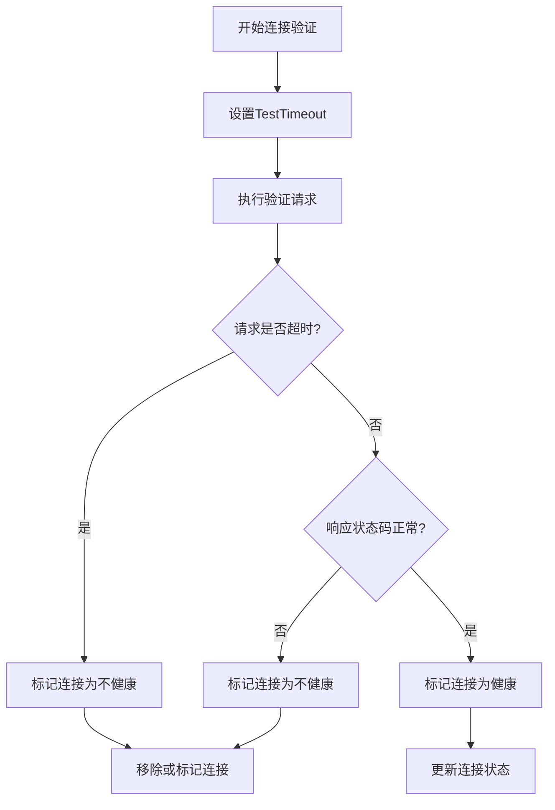
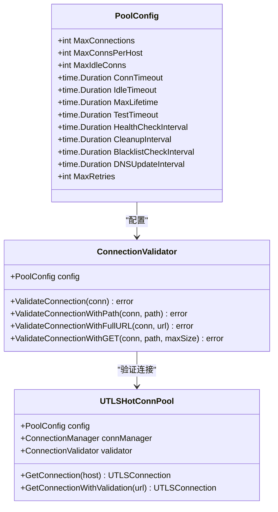
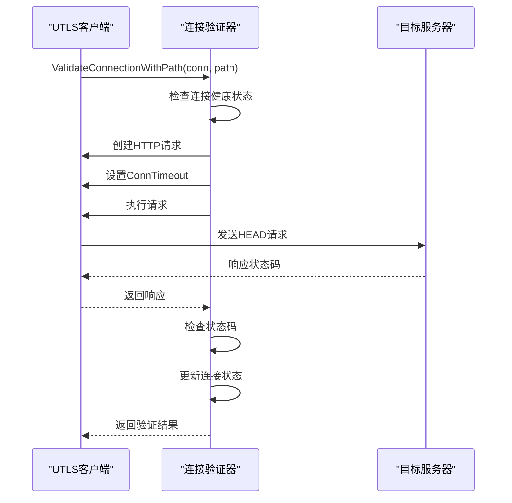
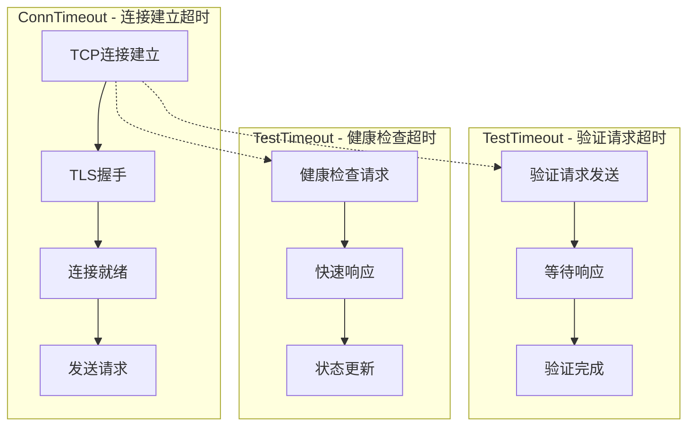
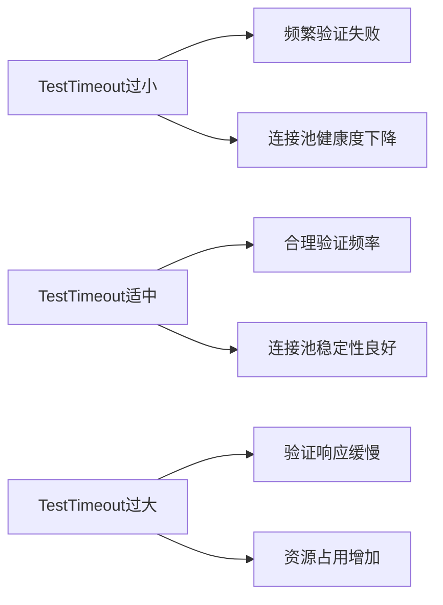
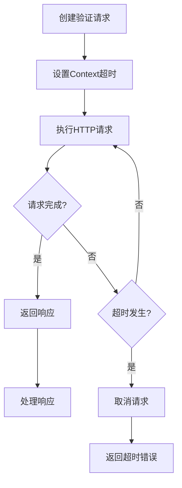

# 验证配置与超时

<cite>
**本文档引用的文件**
- [connection_validator.go](file://utlsclient/connection_validator.go)
- [utlshotconnpool.go](file://utlsclient/utlshotconnpool.go)
- [connection_manager.go](file://utlsclient/connection_manager.go)
- [health_checker.go](file://utlsclient/health_checker.go)
- [interfaces.go](file://utlsclient/interfaces.go)
- [config.go](file://config/config.go)
- [config.toml](file://config/config.toml)
- [GoogleEarthClient/config/config.toml](file://GoogleEarthClient/config/config.toml)
- [utlsclient.go](file://utlsclient/utlsclient.go)
</cite>

## 目录
1. [简介](#简介)
2. [TestTimeout配置详解](#testtimeout配置详解)
3. [PoolConfig结构体分析](#poolconfig结构体分析)
4. [连接验证流程](#连接验证流程)
5. [超时机制对比](#超时机制对比)
6. [性能影响分析](#性能影响分析)
7. [配置推荐值](#配置推荐值)
8. [内部实现机制](#内部实现机制)
9. [配置示例](#配置示例)
10. [故障排除指南](#故障排除指南)

## 简介

连接验证配置是爬虫平台中确保连接质量和系统稳定性的关键组件。本文档深入探讨TestTimeout配置项在连接验证过程中的作用机制，以及如何通过PoolConfig结构体传递超时设置。我们将详细分析验证超时时间对爬虫性能和成功率的影响，提供不同网络环境下的推荐配置值，并阐述ConnTimeout与TestTimeout的区别和协同工作方式。

## TestTimeout配置详解

### TestTimeout的作用机制

TestTimeout是连接池配置中的一个重要参数，专门用于控制连接验证请求的超时时间。它决定了在验证连接有效性时，系统愿意等待的最大时间。



**图表来源**
- [connection_validator.go](file://utlsclient/connection_validator.go#L42-L96)
- [connection_validator.go](file://utlsclient/connection_validator.go#L100-L158)

### TestTimeout在验证过程中的应用

TestTimeout主要应用于以下几种验证场景：

1. **基础路径验证**：验证连接到根路径"/"的可用性
2. **指定路径验证**：验证连接到特定路径的可用性
3. **完整URL验证**：验证完整URL的连通性
4. **GET请求验证**：使用GET请求进行更严格的验证

**章节来源**
- [connection_validator.go](file://utlsclient/connection_validator.go#L23-L96)
- [connection_validator.go](file://utlsclient/connection_validator.go#L99-L158)
- [connection_validator.go](file://utlsclient/connection_validator.go#L161-L222)

## PoolConfig结构体分析

### 结构体定义

PoolConfig结构体包含了连接池的所有配置参数，其中TestTimeout字段专门用于连接验证超时控制：



**图表来源**
- [utlshotconnpool.go](file://utlsclient/utlshotconnpool.go#L170-L184)
- [connection_validator.go](file://utlsclient/connection_validator.go#L10-L14)
- [utlshotconnpool.go](file://utlsclient/utlshotconnpool.go#L237-L258)

### TestTimeout的配置方式

TestTimeout可以通过多种方式进行配置：

1. **默认配置**：使用DefaultPoolConfig()提供默认值
2. **文件配置**：通过config.toml文件配置
3. **动态配置**：运行时更新配置

**章节来源**
- [utlshotconnpool.go](file://utlsclient/utlshotconnpool.go#L186-L225)
- [utlshotconnpool.go](file://utlsclient/utlshotconnpool.go#L137-L168)

## 连接验证流程

### 验证流程架构

连接验证采用分层架构，确保不同级别的验证需求得到满足：



**图表来源**
- [connection_validator.go](file://utlsclient/connection_validator.go#L42-L96)
- [connection_validator.go](file://utlsclient/connection_validator.go#L100-L158)

### 验证方法对比

不同验证方法具有不同的特点和适用场景：

| 验证方法 | 请求类型 | 超时设置 | 验证强度 | 性能开销 |
|---------|---------|---------|---------|---------|
| ValidateConnection | HEAD | ConnTimeout | 基础 | 低 |
| ValidateConnectionWithPath | HEAD | ConnTimeout | 中等 | 中等 |
| ValidateConnectionWithFullURL | HEAD | ConnTimeout | 中等 | 中等 |
| ValidateConnectionWithGET | GET | ConnTimeout | 高 | 高 |

**章节来源**
- [connection_validator.go](file://utlsclient/connection_validator.go#L23-L96)
- [connection_validator.go](file://utlsclient/connection_validator.go#L99-L158)
- [connection_validator.go](file://utlsclient/connection_validator.go#L161-L222)

## 超时机制对比

### ConnTimeout vs TestTimeout

ConnTimeout和TestTimeout虽然都涉及超时控制，但在连接池中的作用和应用场景存在显著差异：



**图表来源**
- [utlshotconnpool.go](file://utlsclient/utlshotconnpool.go#L573-L590)
- [connection_validator.go](file://utlsclient/connection_validator.go#L69-L82)
- [health_checker.go](file://utlsclient/health_checker.go#L73-L87)

### 协同工作机制

两种超时机制协同工作，形成完整的连接生命周期管理：

1. **连接建立阶段**：ConnTimeout控制连接建立时间
2. **验证阶段**：TestTimeout控制验证请求时间
3. **健康检查阶段**：TestTimeout控制健康检查时间
4. **请求执行阶段**：ConnTimeout控制请求执行时间

**章节来源**
- [utlshotconnpool.go](file://utlsclient/utlshotconnpool.go#L573-L590)
- [connection_validator.go](file://utlsclient/connection_validator.go#L69-L82)
- [health_checker.go](file://utlsclient/health_checker.go#L73-L87)

## 性能影响分析

### TestTimeout对性能的影响

TestTimeout的设置直接影响连接池的性能表现：



### 性能指标监控

关键性能指标包括：

- **连接验证成功率**：验证成功的连接比例
- **平均验证时间**：每次验证的平均耗时
- **连接池健康度**：可用连接的比例
- **错误率**：验证过程中出现错误的频率

**章节来源**
- [utlshotconnpool.go](file://utlsclient/utlshotconnpool.go#L261-L277)

## 配置推荐值

### 不同网络环境的推荐配置

根据网络环境的不同，推荐的TestTimeout配置值如下：

| 网络环境 | 推荐TestTimeout | 推荐ConnTimeout | 说明 |
|---------|----------------|----------------|------|
| 局域网 | 5-10秒 | 10-15秒 | 网络延迟低，验证速度快 |
| 城域网 | 10-20秒 | 15-30秒 | 中等延迟，需要适当放宽 |
| 国际网络 | 20-30秒 | 30-60秒 | 高延迟，需要更大容忍度 |
| 不稳定网络 | 30-60秒 | 60-120秒 | 高丢包率，需要更强健性 |

### 配置平衡策略

在配置TestTimeout时需要考虑以下平衡：

1. **严格性vs性能**：较短的超时提高性能但可能误判
2. **可靠性vs响应性**：较长的超时提高可靠性但降低响应速度
3. **网络稳定性**：根据网络状况调整超时设置
4. **业务需求**：根据具体业务要求权衡配置

**章节来源**
- [utlshotconnpool.go](file://utlsclient/utlshotconnpool.go#L186-L225)

## 内部实现机制

### context.WithTimeout的应用

系统内部广泛使用context.WithTimeout来控制验证请求的生命周期：



**图表来源**
- [utlsclient.go](file://utlsclient/utlsclient.go#L104-L156)

### 超时处理机制

超时处理采用多层次的保护机制：

1. **请求级超时**：每个验证请求都有独立的超时控制
2. **连接级超时**：连接本身的超时限制
3. **全局超时**：整个验证过程的总时间限制
4. **优雅降级**：超时后的处理策略

**章节来源**
- [utlsclient.go](file://utlsclient/utlsclient.go#L104-L156)
- [connection_validator.go](file://utlsclient/connection_validator.go#L69-L82)

## 配置示例

### config.toml配置示例

以下是典型的TestTimeout配置示例：

```toml
# 连接池配置
[pool]
# 最大连接数
max_connections = 100
# 每个主机最大连接数  
max_conns_per_host = 10
# 最大空闲连接数
max_idle_conns = 20
# 连接超时时间 (秒)
conn_timeout = 30
# 空闲超时时间 (秒) 
idle_timeout = 60
# 连接最大生命周期 (秒)
max_lifetime = 300
# 测试请求超时时间 (秒)
test_timeout = 10
# 健康检查间隔 (秒)
health_check_interval = 30
# 清理间隔 (秒)
cleanup_interval = 60
# 黑名单检查间隔 (秒)
blacklist_check_interval = 300
# DNS更新间隔 (秒)
dns_update_interval = 1800
# 最大重试次数
max_retries = 3
```

### GoogleEarthClient配置示例

GoogleEarthClient中的相关配置：

```toml
# UtlsClient连接池配置
[UtlsClient.connection_pool]
# 最大连接数
max_connections = 100
# 连接超时时间（秒）
connection_timeout_seconds = 10
# 空闲连接保持时间（秒）
idle_timeout_seconds = 90
```

**章节来源**
- [config.toml](file://config/config.toml#L1-L38)
- [GoogleEarthClient/config/config.toml](file://GoogleEarthClient/config/config.toml#L86-L96)

## 故障排除指南

### 常见问题及解决方案

1. **验证频繁失败**
   - 检查TestTimeout设置是否过短
   - 分析网络延迟情况
   - 调整验证频率配置

2. **连接池效率低下**
   - 优化ConnTimeout和TestTimeout比例
   - 调整健康检查间隔
   - 监控连接池统计信息

3. **超时错误过多**
   - 增加TestTimeout值
   - 检查网络稳定性
   - 优化验证策略

### 监控和诊断

建议监控的关键指标：

- 连接验证成功率趋势
- 平均验证响应时间
- 连接池健康度变化
- 错误类型分布

**章节来源**
- [health_checker.go](file://utlsclient/health_checker.go#L23-L61)
- [connection_manager.go](file://utlsclient/connection_manager.go#L141-L178)

## 结论

TestTimeout配置是连接池性能优化的重要环节。通过合理设置TestTimeout，可以在保证连接质量的同时最大化系统性能。建议根据具体的网络环境和业务需求，结合实际监控数据，动态调整超时配置，以达到最佳的系统性能和稳定性平衡。

正确理解和配置TestTimeout不仅能够提高爬虫系统的可靠性，还能显著提升整体性能表现。在实际部署中，建议采用渐进式的配置策略，通过持续监控和调优，找到最适合特定环境的最佳配置组合。