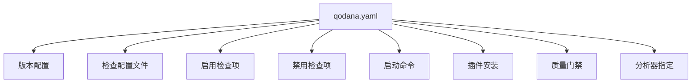

# Qodana 静态分析

<cite>
**本文档引用的文件**   
- [qodana.yaml](file://qodana.yaml)
- [go.mod](file://go.mod)
- [version.go](file://version.go)
- [README.md](file://README.md)
- [config.toml](file://config/config.toml)
- [ARCHITECTURE.md](file://docs/ARCHITECTURE.md)
- [QUICKSTART.md](file://docs/QUICKSTART.md)
- [config-reference.md](file://docs/configuration/config-reference.md)
</cite>

## 目录
1. [简介](#简介)
2. [Qodana 配置分析](#qodana-配置分析)
3. [项目结构与依赖](#项目结构与依赖)
4. [静态分析与质量门禁](#静态分析与质量门禁)
5. [配置最佳实践](#配置最佳实践)
6. [结论](#结论)

## 简介

本项目是一个基于uTLS的高性能爬虫平台，专注于反爬虫场景下的网络请求。项目通过TLS指纹伪装和热连接池技术，提供接近真实浏览器的网络访问能力。Qodana作为静态代码分析工具，被集成到CI/CD流程中，用于确保代码质量和一致性。

项目核心特性包括：
- **热连接池**: 预建立TLS连接并复用，性能提升3-6倍
- **TLS指纹伪装**: 支持33种真实浏览器指纹，模拟Chrome、Firefox、Safari、Edge等
- **多语言支持**: 随机生成Accept-Language头，从90种语言中组合，97.8%独特性
- **双协议支持**: 自动检测HTTP/1.1和HTTP/2，完美支持h2连接复用
- **双栈网络**: 完整支持IPv4和IPv6地址

**Section sources**
- [README.md](file://README.md#L1-L476)

## Qodana 配置分析

### Qodana 配置文件结构

Qodana的分析配置通过`qodana.yaml`文件进行管理。该文件定义了代码分析的各个方面，包括检查配置文件、启用/禁用检查项、CI/CD流水线中的执行命令、插件安装以及质量门禁等。



**Diagram sources**
- [qodana.yaml](file://qodana.yaml#L1-L46)

### 检查配置文件

项目使用`qodana.starter`作为检查配置文件，这是一个适合Go项目的起始配置，包含了基本的代码质量检查规则。

```yaml
profile:
  name: qodana.starter
```

此配置文件为项目提供了基础的代码质量保障，涵盖了常见的代码异味、潜在错误和最佳实践检查。

**Section sources**
- [qodana.yaml](file://qodana.yaml#L13-L14)

### 分析器指定

项目指定了特定版本的Qodana Go分析器：

```yaml
linter: jetbrains/qodana-go:2025.2
```

这确保了在不同环境中使用一致的分析器版本，避免因分析器版本差异导致的检查结果不一致。

**Section sources**
- [qodana.yaml](file://qodana.yaml#L45-L46)

## 项目结构与依赖

### 项目基本信息

项目基本信息通过多个文件共同维护：

- **版本信息**: 在`version.go`中定义
  ```go
  const Version = "0.0.24"
  ```

- **模块信息**: 在`go.mod`中定义
  ```go
  module crawler-platform
  go 1.25
  ```

- **文档信息**: 在`README.md`中展示
  ```
  **Version: v0.0.24**
  ```

这种多点维护版本信息的方式需要通过脚本保持同步，项目提供了`bump-version.sh`和`release.sh`脚本来自动化版本更新和发布流程。

**Section sources**
- [version.go](file://version.go#L1-L5)
- [go.mod](file://go.mod#L1-L3)
- [README.md](file://README.md#L3)

### 项目依赖

项目依赖通过`go.mod`文件管理，主要依赖包括：

- **uTLS库**: `github.com/refraction-networking/utls v1.8.1` - 用于TLS指纹伪装
- **TOML解析**: `github.com/BurntSushi/toml v1.5.0` - 用于配置文件解析
- **SQLite驱动**: `github.com/mattn/go-sqlite3 v1.14.32` - 用于数据存储
- **DNS库**: `github.com/miekg/dns v1.1.68` - 用于DNS解析
- **BBolt**: `go.etcd.io/bbolt v1.4.3` - 用于嵌入式KV存储
- **Protobuf**: `google.golang.org/protobuf v1.36.10` - 用于Google Earth数据处理

这些依赖支持了项目的核心功能，包括网络请求、配置管理、数据存储和协议处理。

**Section sources**
- [go.mod](file://go.mod#L1-L31)

## 静态分析与质量门禁

### 质量门禁配置

虽然当前`qodana.yaml`文件中的质量门禁配置被注释掉了，但其设计意图清晰地展示了项目对代码质量的要求：

```yaml
#failureConditions:
#  severityThresholds:
#    any: 15
#    critical: 5
#  testCoverageThresholds:
#    fresh: 70
#    total: 50
```

质量门禁包含两个主要部分：

1. **严重性阈值**: 
   - `any`: 任何严重性级别的问题数量阈值
   - `critical`: 关键问题数量阈值

2. **测试覆盖率阈值**:
   - `fresh`: 新增代码的测试覆盖率
   - `total`: 整个项目代码的测试覆盖率

这些阈值将在CI/CD流水线中作为质量门禁，如果任何条件未满足，流水线将失败，从而确保代码质量。

**Section sources**
- [qodana.yaml](file://qodana.yaml#L37-L43)

### CI/CD集成

Qodana配置中包含了CI/CD流水线集成的相关配置：

```yaml
#bootstrap: sh ./prepare-qodana.sh
#plugins:
#  - id: <plugin.id>
```

虽然这些配置当前被注释，但它们展示了项目计划中的CI/CD集成方式：

- **启动命令**: 可以在Qodana执行前运行shell命令，用于准备分析环境
- **插件安装**: 可以在分析前安装IDE插件，扩展分析能力

这种设计允许项目在CI/CD环境中灵活地配置分析环境，确保分析的一致性和可重复性。

**Section sources**
- [qodana.yaml](file://qodana.yaml#L26-L32)

## 配置最佳实践

### 配置文件管理

项目采用了多层级的配置文件管理策略：

1. **默认配置**: `config/config.toml`
2. **项目配置**: 根目录下的`config.toml`

配置加载时会合并这两个文件，优先级从高到低。这种设计允许项目既有默认配置，又可以被项目特定配置覆盖。

```toml
[pool]
max_connections = 100
max_conns_per_host = 10
max_idle_conns = 20
conn_timeout = 30
idle_timeout = 60
max_lifetime = 300
test_timeout = 10
health_check_interval = 30
cleanup_interval = 60
blacklist_check_interval = 300
dns_update_interval = 1800
max_retries = 3
```

**Section sources**
- [config.toml](file://config/config.toml#L1-L38)

### 版本管理自动化

项目通过脚本实现了版本管理的自动化：

- **bump-version.sh**: 自动递增版本号
- **release.sh**: 自动化版本发布流程

这些脚本确保了版本号在多个文件中的同步更新，包括：
- `cmd/utlsclient/main.go`
- `version.go`
- `README.md`

自动化版本管理减少了人为错误，提高了发布效率。

**Section sources**
- [bump-version.sh](file://scripts/bump-version.sh#L1-L45)
- [release.sh](file://scripts/release.sh#L1-L82)

## 结论

Qodana静态分析配置为项目提供了代码质量保障的基础框架。通过`qodana.yaml`文件，项目定义了分析器、检查配置文件和潜在的质量门禁。虽然当前的质量门禁和CI/CD集成配置被注释，但其结构清晰地展示了项目对代码质量的重视。

项目结构合理，依赖管理清晰，配置文件设计考虑了灵活性和可维护性。自动化版本管理脚本进一步提高了开发效率和发布可靠性。建议逐步启用Qodana的质量门禁和CI/CD集成，以持续提升代码质量和开发流程的自动化水平。