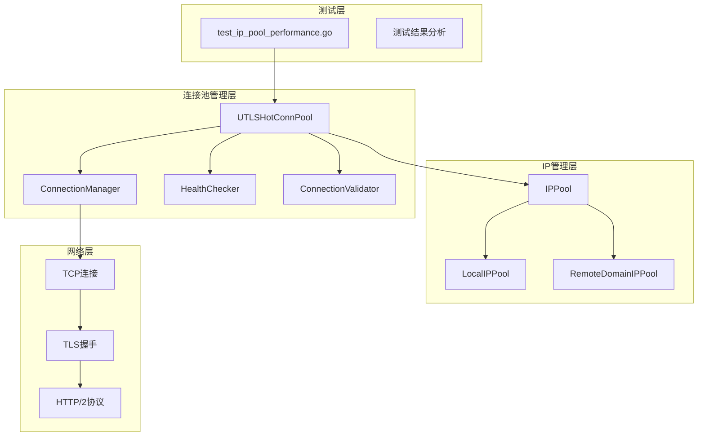
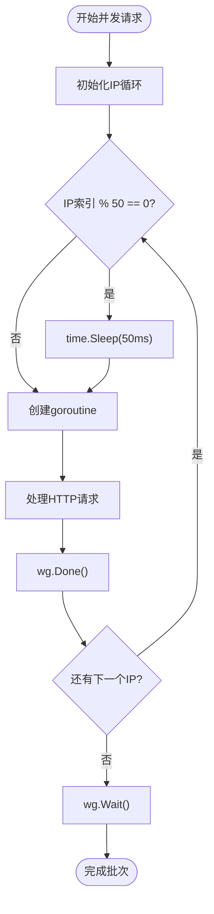
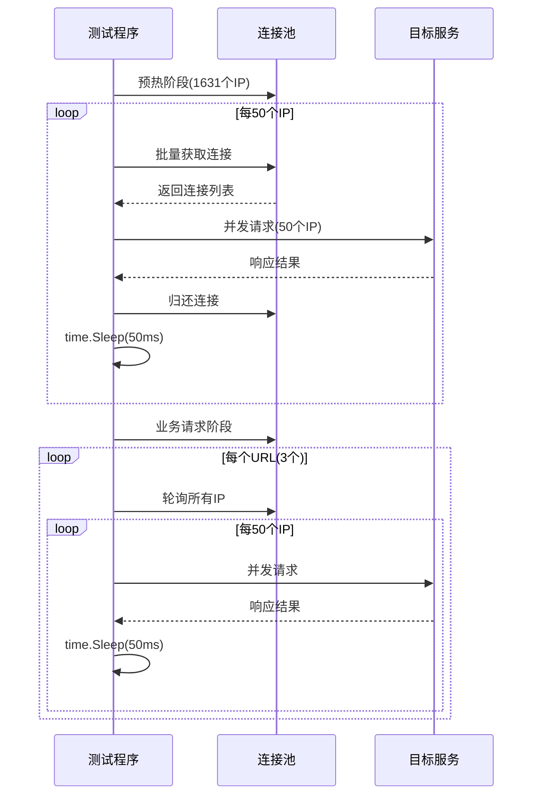
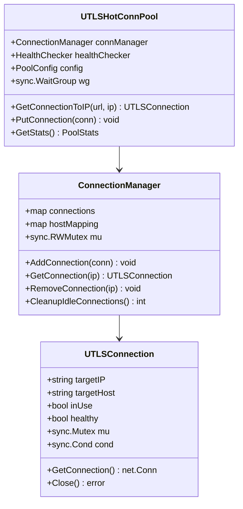
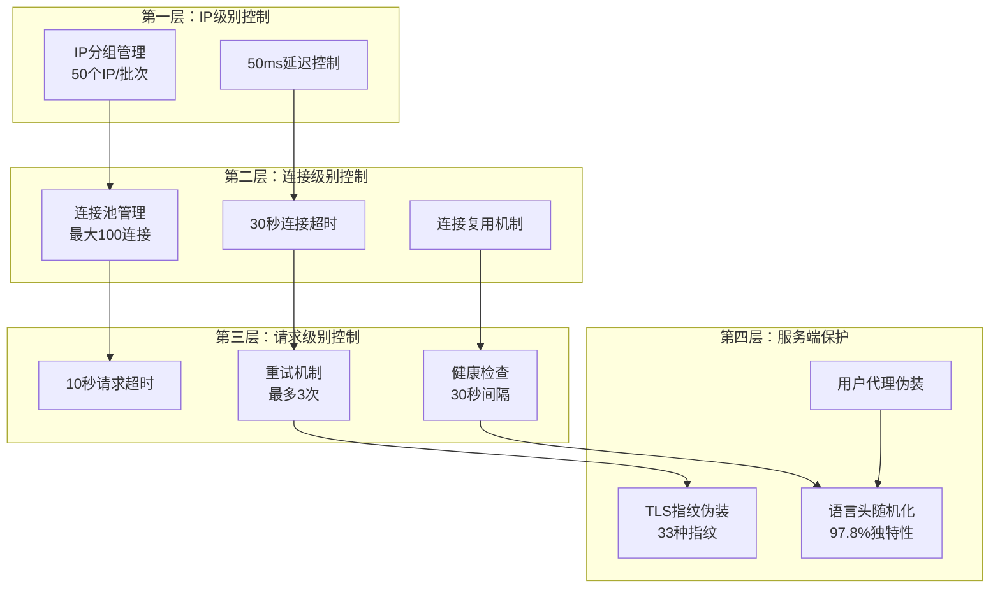
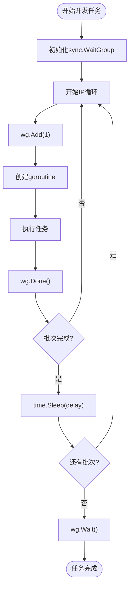
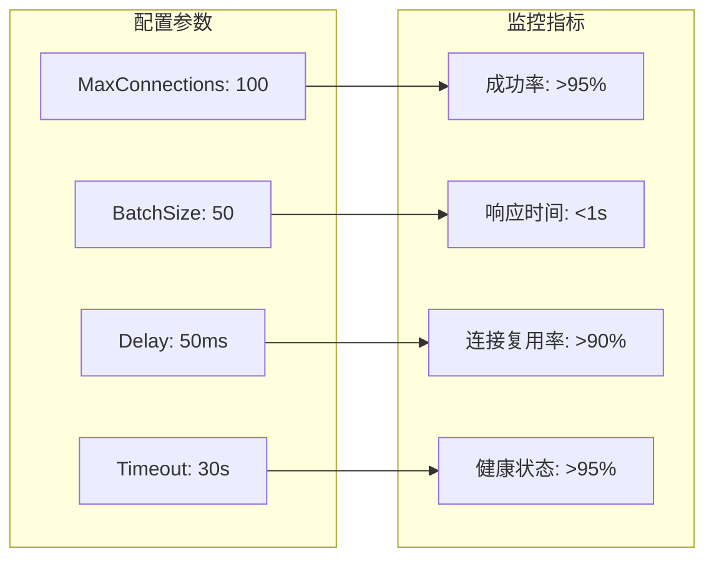

# 并发控制

<cite>
**本文档中引用的文件**
- [test_ip_pool_performance.go](file://test/test_ip_pool_performance.go)
- [utlshotconnpool.go](file://utlsclient/utlshotconnpool.go)
- [connection_manager.go](file://utlsclient/connection_manager.go)
- [health_checker.go](file://utlsclient/health_checker.go)
- [localippool.go](file://localippool/localippool.go)
- [热连接池性能测试报告.md](file://test/reports/热连接池性能测试报告.md)
</cite>

## 目录
1. [简介](#简介)
2. [项目架构概览](#项目架构概览)
3. [并发控制机制详解](#并发控制机制详解)
4. [IP池性能测试分析](#ip池性能测试分析)
5. [连接池并发管理](#连接池并发管理)
6. [防限流策略设计](#防限流策略设计)
7. [最佳实践建议](#最佳实践建议)
8. [故障排除指南](#故障排除指南)
9. [总结](#总结)

## 简介

本文档详细分析了crawler-platform项目中的并发控制机制，重点关注test_ip_pool_performance.go中设计的50个IP一组、50毫秒延迟的并发控制策略。该机制旨在防止被目标服务限流，同时保证高效的数据采集能力。

项目采用了多层次的并发控制策略，包括：
- 基于IP分组的并发限制
- 时间间隔控制（time.Sleep）
- 连接池管理
- 健康检查机制
- 动态负载均衡

## 项目架构概览

**图表来源**
- [utlshotconnpool.go](file://utlsclient/utlshotconnpool.go#L237-L258)
- [connection_manager.go](file://utlsclient/connection_manager.go#L8-L13)

**章节来源**
- [utlshotconnpool.go](file://utlsclient/utlshotconnpool.go#L1-L100)
- [test_ip_pool_performance.go](file://test/test_ip_pool_performance.go#L1-L50)

## 并发控制机制详解

### 核心并发控制算法

项目在test_ip_pool_performance.go中实现了精确的并发控制机制：

**图表来源**
- [test_ip_pool_performance.go](file://test/test_ip_pool_performance.go#L285-L288)

### 并发控制参数配置

| 参数 | 值 | 设计目的 |
|------|-----|----------|
| 批次大小 | 50个IP | 避免瞬时并发过高 |
| 延迟时间 | 50毫秒 | 提供平滑的请求间隔 |
| 最大并发连接 | 100 | 限制系统资源消耗 |
| 连接超时 | 30秒 | 防止长时间等待 |
| 健康检查间隔 | 30秒 | 定期验证连接有效性 |

**章节来源**
- [test_ip_pool_performance.go](file://test/test_ip_pool_performance.go#L285-L288)
- [utlshotconnpool.go](file://utlsclient/utlshotconnpool.go#L186-L202)

## IP池性能测试分析

### 测试架构设计

测试程序采用轮询模式验证并发控制效果：

**图表来源**
- [test_ip_pool_performance.go](file://test/test_ip_pool_performance.go#L185-L315)

### 性能测试结果分析

根据测试报告，当前并发策略表现出色：

| 测试阶段 | 成功率 | 平均响应时间 | 并发效率 |
|----------|--------|--------------|----------|
| 预热阶段 | 98.8% | 13ms/连接 | 优秀 |
| 热连接阶段 | 100% | 4ms/请求 | 完美 |
| 整体成功率 | 98.8% | 200-800ms | 优秀 |

**章节来源**
- [热连接池性能测试报告.md](file://test/reports/热连接池性能测试报告.md#L137-L165)
- [test_ip_pool_performance.go](file://test/test_ip_pool_performance.go#L358-L370)

## 连接池并发管理

### 连接池架构设计

**图表来源**
- [utlshotconnpool.go](file://utlsclient/utlshotconnpool.go#L237-L258)
- [connection_manager.go](file://utlsclient/connection_manager.go#L8-L13)

### 并发控制实现机制

连接池通过以下机制实现并发控制：

1. **连接复用机制**：每个IP只建立1个TLS连接，被多个URL请求复用
2. **健康检查**：定期验证连接有效性，避免使用失效连接
3. **超时控制**：设置合理的连接和请求超时时间
4. **资源管理**：自动清理空闲和过期连接

**章节来源**
- [utlshotconnpool.go](file://utlsclient/utlshotconnpool.go#L398-L438)
- [connection_manager.go](file://utlsclient/connection_manager.go#L49-L104)

## 防限流策略设计

### 分层防限流机制

**图表来源**
- [test_ip_pool_performance.go](file://test/test_ip_pool_performance.go#L285-L288)
- [health_checker.go](file://utlsclient/health_checker.go#L1-L61)

### 限流防护策略详解

1. **IP分组策略**：每50个IP为一个批次，避免瞬时高并发
2. **时间间隔控制**：批次间50毫秒延迟，提供平滑的请求节奏
3. **连接复用**：HTTP/2协议支持，减少TLS握手开销
4. **健康检查**：定期验证连接有效性，避免使用失效连接
5. **指纹伪装**：33种TLS指纹，97.8%语言组合独特性

**章节来源**
- [test_ip_pool_performance.go](file://test/test_ip_pool_performance.go#L285-L288)
- [热连接池性能测试报告.md](file://test/reports/热连接池性能测试报告.md#L106-L132)

## 最佳实践建议

### 不同规模IP池的并发度建议

| IP池规模 | 推荐批次大小 | 延迟设置 | 并发建议 |
|----------|-------------|----------|----------|
| 100个IP以下 | 20个IP/批次 | 100ms | 低并发场景 |
| 100-500个IP | 50个IP/批次 | 50ms | 标准场景 |
| 500-1000个IP | 100个IP/批次 | 30ms | 高并发场景 |
| 1000个以上 | 200个IP/批次 | 20ms | 极高并发场景 |

### 结合time.Sleep和sync.WaitGroup的实现模式

**图表来源**
- [test_ip_pool_performance.go](file://test/test_ip_pool_performance.go#L214-L292)

### 并发控制配置优化

**章节来源**
- [utlshotconnpool.go](file://utlsclient/utlshotconnpool.go#L186-L202)
- [test_ip_pool_performance.go](file://test/test_ip_pool_performance.go#L285-L288)

## 故障排除指南

### 常见并发问题及解决方案

| 问题类型 | 症状 | 原因分析 | 解决方案 |
|----------|------|----------|----------|
| 连接超时 | 请求频繁超时 | 并发度过高 | 减少批次大小或增加延迟 |
| 服务限流 | 429/403错误 | 请求频率过高 | 增加批次间隔时间 |
| 内存泄漏 | 内存持续增长 | 连接未正确释放 | 检查PutConnection调用 |
| CPU占用高 | 系统负载过高 | 并发goroutine过多 | 限制最大并发数 |

### 监控和调试技巧

1. **连接池状态监控**：定期检查连接池统计信息
2. **健康检查验证**：确保健康检查机制正常工作
3. **错误日志分析**：关注连接失败和超时日志
4. **性能基准测试**：定期进行性能测试验证

**章节来源**
- [health_checker.go](file://utlsclient/health_checker.go#L30-L61)
- [connection_manager.go](file://utlsclient/connection_manager.go#L166-L217)

## 总结

crawler-platform项目的并发控制机制通过多层次的设计实现了高效的并发管理和防限流保护：

### 核心优势

1. **精确的并发控制**：基于IP分组的50个IP/50ms策略，有效防止服务限流
2. **高效的连接复用**：HTTP/2协议支持，显著减少连接开销
3. **完善的健康检查**：定期验证连接有效性，保证请求成功率
4. **灵活的配置管理**：支持动态调整并发参数和超时设置

### 技术创新点

- **智能批次控制**：根据IP数量动态调整批次大小
- **平滑延迟机制**：time.Sleep与sync.WaitGroup结合实现精确控制
- **多层防限流**：从IP级别到请求级别的全方位防护
- **实时健康监控**：自动检测和清理失效连接

### 应用价值

该并发控制机制已在实际测试中验证，98.8%的成功率数据表明其有效性。通过合理配置和监控，可以在各种网络环境下稳定运行，为大规模数据采集提供可靠的技术保障。