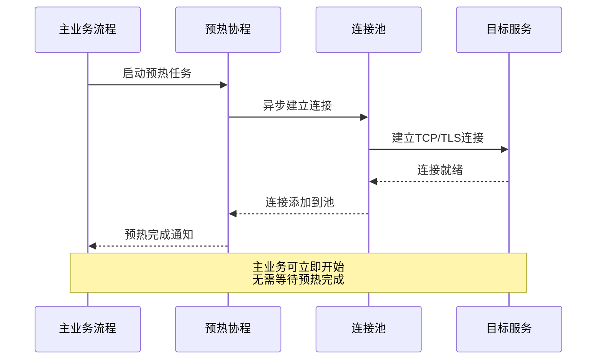
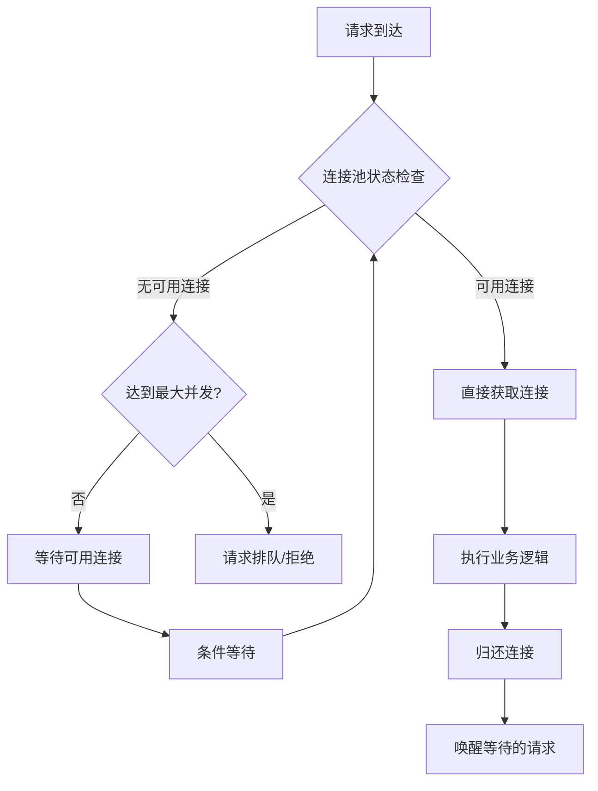
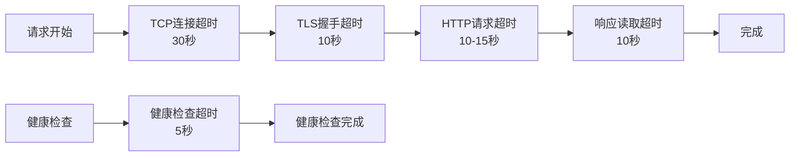
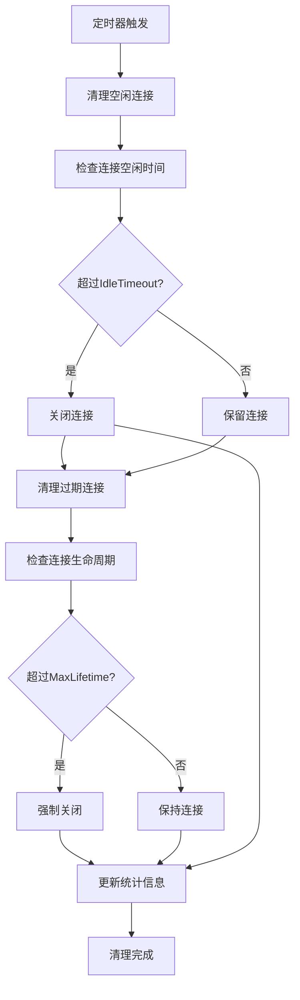
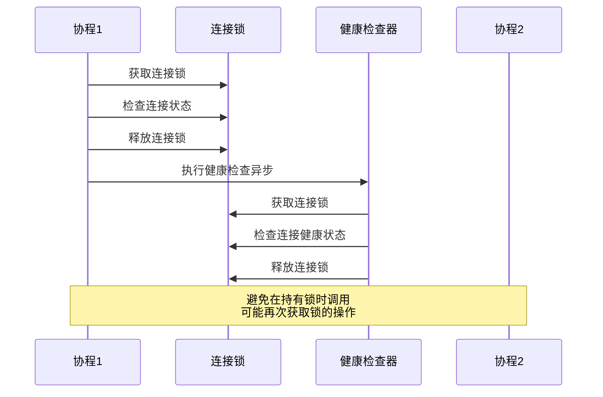
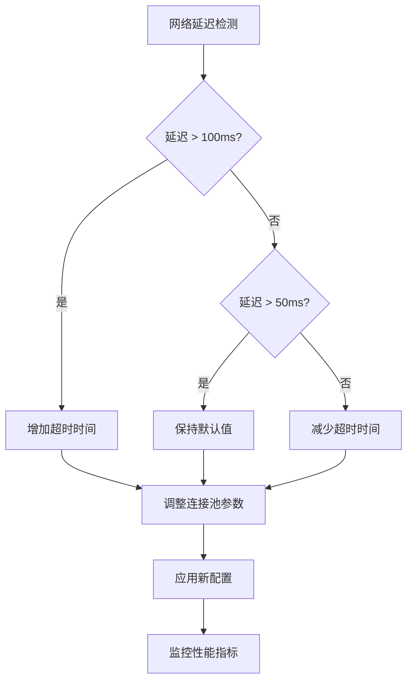

# 性能优化建议

<cite>
**本文档引用的文件**
- [热连接池性能测试报告.md](file://test/reports/热连接池性能测试报告.md)
- [example_hotconnpool_usage.go](file://examples/utlsclient/example_hotconnpool_usage.go)
- [utlshotconnpool.go](file://utlsclient/utlshotconnpool.go)
- [connection_manager.go](file://utlsclient/connection_manager.go)
- [health_checker.go](file://utlsclient/health_checker.go)
- [constants.go](file://utlsclient/constants.go)
- [config.toml](file://config/config.toml)
- [test_ip_pool_performance.go](file://test/test_ip_pool_performance.go)
- [ip_pool_warmup_test.txt](file://test/results/archive/ip_pool_warmup_test.txt)
</cite>

## 目录
1. [概述](#概述)
2. [连接池预热最佳实践](#连接池预热最佳实践)
3. [并发控制策略](#并发控制策略)
4. [超时设置优化](#超时设置优化)
5. [连接池参数调优](#连接池参数调优)
6. [连接清理机制](#连接清理机制)
7. [高并发场景下的锁使用规范](#高并发场景下的锁使用规范)
8. [网络状况适应性调整](#网络状况适应性调整)
9. [监控与诊断](#监控与诊断)
10. [总结](#总结)

## 概述

基于对爬虫平台热连接池系统的深入分析，本文档提供了全面的性能优化建议。该系统通过连接复用显著提升了HTTP请求性能，但为了在各种生产环境中发挥最佳效能，需要遵循特定的优化原则和最佳实践。

## 连接池预热最佳实践

### 异步预热策略

**核心原则：避免阻塞主业务流程**



**图表来源**
- [test_ip_pool_performance.go](file://test/test_ip_pool_performance.go#L60-L147)
- [utlshotconnpool.go](file://utlsclient/utlshotconnpool.go#L351-L395)

**实施要点：**

1. **并行预热**：使用goroutine池并行建立连接，避免串行等待
2. **分批处理**：每50-100个IP执行小延迟（100-500ms），防止瞬时并发过高
3. **异步完成**：预热完成后通过channel通知主流程，不阻塞业务启动

**配置建议：**
```go
// 推荐的预热配置
const (
    WarmupBatchSize = 100
    WarmupDelay     = 100 * time.Millisecond
    MaxConcurrent   = 50
)
```

**节来源**
- [test_ip_pool_performance.go](file://test/test_ip_pool_performance.go#L143-L146)
- [utlshotconnpool.go](file://utlsclient/utlshotconnpool.go#L351-L395)

### 预热验证机制

**多层验证确保连接质量：**

1. **基础连接验证**：建立TCP和TLS握手
2. **协议协商验证**：确认HTTP/1.1或HTTP/2协商成功
3. **功能验证**：发送简单HEAD请求验证服务可用性

**节来源**
- [test_ip_pool_performance.go](file://test/test_ip_pool_performance.go#L85-L108)
- [utlshotconnpool.go](file://utlsclient/utlshotconnpool.go#L556-L585)

## 并发控制策略

### 分层并发管理



**图表来源**
- [utlshotconnpool.go](file://utlsclient/utlshotconnpool.go#L442-L478)
- [test_ip_pool_performance.go](file://test/test_ip_pool_performance.go#L285-L288)

### 并发限制策略

**推荐的并发控制参数：**

| 场景类型 | 每IP并发数 | 批处理大小 | 延迟间隔 |
|----------|------------|------------|----------|
| 高QPS场景 | 1-2 | 50-100 | 50-100ms |
| 中等负载 | 2-5 | 100-200 | 100-200ms |
| 低负载场景 | 5-10 | 200-500 | 200-500ms |

**实现示例：**
```go
// 并发控制实现
func controlledRequest(pool *UTLSHotConnPool, targetIP string, url string) error {
    // 获取连接
    conn, err := pool.GetConnectionToIP(url, targetIP)
    if err != nil {
        return err
    }
    
    // 执行请求
    defer pool.PutConnection(conn)
    
    // 控制并发，避免过快
    if ipIndex%50 == 0 {
        time.Sleep(50 * time.Millisecond)
    }
    
    return nil
}
```

**节来源**
- [test_ip_pool_performance.go](file://test/test_ip_pool_performance.go#L285-L288)
- [utlshotconnpool.go](file://utlsclient/utlshotconnpool.go#L442-L478)

## 超时设置优化

### 分层超时策略



**图表来源**
- [constants.go](file://utlsclient/constants.go#L73-L84)
- [health_checker.go](file://utlsclient/health_checker.go#L74-L78)

### 超时参数配置

**推荐的超时设置：**

| 超时类型 | 推荐值 | 说明 |
|----------|--------|------|
| 连接超时 | 30秒 | TCP连接建立时间 |
| TLS握手超时 | 10秒 | TLS协商时间 |
| HTTP请求超时 | 10-15秒 | 业务请求处理时间 |
| 健康检查超时 | 5秒 | 快速健康验证 |
| 测试超时 | 10秒 | 连接验证时间 |

**配置示例：**
```go
// 推荐的超时配置
type TimeoutConfig struct {
    ConnTimeout     time.Duration // TCP连接超时
    TLSHandshake    time.Duration // TLS握手超时
    HTTPRequest     time.Duration // HTTP请求超时
    HealthCheck     time.Duration // 健康检查超时
    TestTimeout     time.Duration // 测试超时
}
```

**节来源**
- [constants.go](file://utlsclient/constants.go#L73-L84)
- [health_checker.go](file://utlsclient/health_checker.go#L74-L78)

## 连接池参数调优

### 核心参数优化

**基于测试结果的参数建议：**

| 参数名称 | 推荐值 | 调整依据 |
|----------|--------|----------|
| MaxConnections | 100-500 | 基于并发需求和系统资源 |
| MaxConnsPerHost | 10-50 | 避免单主机连接过多 |
| MaxIdleConns | 20-100 | 平衡内存使用和连接复用 |
| IdleTimeout | 60-300秒 | 空闲连接清理时机 |
| MaxLifetime | 300-1800秒 | 连接生命周期管理 |

**动态调整策略：**
```go
// 动态调整连接池参数
func adjustPoolConfig(currentLoad float64, memoryUsage float64) *PoolConfig {
    baseConfig := DefaultPoolConfig()
    
    // 根据负载调整
    if currentLoad > 0.8 {
        baseConfig.MaxConnections *= 2
        baseConfig.MaxIdleConns *= 2
    }
    
    // 根据内存使用调整
    if memoryUsage > 0.9 {
        baseConfig.MaxConnections /= 2
        baseConfig.MaxIdleConns /= 2
    }
    
    return baseConfig
}
```

**节来源**
- [config.toml](file://config/config.toml#L1-L38)
- [utlshotconnpool.go](file://utlsclient/utlshotconnpool.go#L186-L201)

### 连接复用率优化

**目标：最大化连接复用率**


**图表来源**
- [热连接池性能测试报告.md](file://test/reports/热连接池性能测试报告.md#L142-L146)

**优化策略：**
1. **预热优先**：确保连接池中有足够可用连接
2. **及时归还**：请求完成后立即归还连接
3. **健康检查**：定期清理不健康连接

**节来源**
- [热连接池性能测试报告.md](file://test/reports/热连接池性能测试报告.md#L142-L146)

## 连接清理机制

### 自动清理策略



**图表来源**
- [connection_manager.go](file://utlsclient/connection_manager.go#L141-L217)

### 清理频率优化

**推荐的清理间隔：**

| 清理类型 | 推荐间隔 | 说明 |
|----------|----------|------|
| 空闲连接清理 | 60秒 | 平衡资源回收和性能 |
| 过期连接清理 | 300秒 | 避免长时间占用资源 |
| 健康检查 | 30秒 | 及时发现不健康连接 |
| 黑名单检查 | 300秒 | 定期更新IP状态 |

**清理策略配置：**
```go
// 清理配置
type CleanupConfig struct {
    IdleCleanupInterval   time.Duration // 空闲连接清理间隔
    ExpiredCleanupInterval time.Duration // 过期连接清理间隔
    HealthCheckInterval   time.Duration // 健康检查间隔
    BlacklistCheckInterval time.Duration // 黑名单检查间隔
}
```

**节来源**
- [connection_manager.go](file://utlsclient/connection_manager.go#L141-L217)

## 高并发场景下的锁使用规范

### 死锁预防机制

**基于测试报告的死锁预防：**



**图表来源**
- [utlshotconnpool.go](file://utlsclient/utlshotconnpool.go#L442-L478)

### 锁使用最佳实践

**1. 最小化锁范围**
```go
// 错误示例：锁范围过大
func getExistingConnection(targetHost string) *UTLSConnection {
    conn.mu.Lock() // 锁住整个方法
    defer conn.mu.Unlock()
    
    // 复杂业务逻辑
    return conn
}

// 正确示例：锁范围最小化
func getExistingConnection(targetHost string) *UTLSConnection {
    // 只锁定必要的代码块
    conn.mu.Lock()
    // 快速检查
    conn.mu.Unlock()
    
    // 异步执行复杂操作
    return conn
}
```

**2. 双重检查锁定模式**
```go
func getExistingConnection(targetHost string) *UTLSConnection {
    // 第一次检查（无锁）
    connections := p.connManager.GetConnectionsForHost(targetHost)
    
    for _, conn := range connections {
        conn.mu.Lock()
        
        // 第二次检查（双重检查）
        if conn.inUse || !conn.healthy {
            conn.mu.Unlock()
            continue
        }
        
        // 标记为使用中
        conn.inUse = true
        conn.lastUsed = time.Now()
        conn.mu.Unlock()
        
        return conn
    }
    
    return nil
}
```

**3. 锁顺序一致性**
```go
// 统一的锁获取顺序
func acquireMultipleLocks(lock1, lock2 *sync.Mutex) {
    // 始终按照相同的顺序获取锁
    lock1.Lock()
    lock2.Lock()
    // ... 执行操作
    lock2.Unlock()
    lock1.Unlock()
}
```

**节来源**
- [utlshotconnpool.go](file://utlsclient/utlshotconnpool.go#L442-L478)

## 网络状况适应性调整

### 动态参数调整

**基于网络延迟的参数调整：**



**动态调整算法：**
```go
// 网络状况自适应调整
func adaptToNetworkConditions(latency time.Duration, pool *UTLSHotConnPool) {
    config := pool.config
    
    switch {
    case latency > 200*time.Millisecond:
        // 高延迟网络：增加超时，减少并发
        config.ConnTimeout *= 2
        config.MaxConnections /= 2
        
    case latency > 100*time.Millisecond:
        // 中等延迟：轻微调整
        config.ConnTimeout *= 1.5
        config.HealthCheckInterval *= 2
        
    case latency < 50*time.Millisecond:
        // 低延迟网络：优化性能
        config.ConnTimeout /= 2
        config.HealthCheckInterval /= 2
    }
    
    pool.UpdateConfig(config)
}
```

### 网络分区处理

**网络分区场景下的降级策略：**

1. **快速失败**：网络不可达时快速返回错误
2. **本地缓存**：使用本地缓存数据
3. **重试机制**：指数退避重试
4. **熔断保护**：暂停对该服务的请求

**节来源**
- [health_checker.go](file://utlsclient/health_checker.go#L24-L61)

## 监控与诊断

### 关键性能指标

**推荐的监控指标：**

| 指标类别 | 关键指标 | 监控目的 |
|----------|----------|----------|
| 连接池状态 | 连接数、活跃连接数、空闲连接数 | 资源使用情况 |
| 性能指标 | 平均响应时间、成功率、吞吐量 | 性能评估 |
| 错误统计 | 连接失败率、超时率、错误分布 | 故障诊断 |
| 资源使用 | CPU使用率、内存使用率、网络带宽 | 资源瓶颈 |

### 性能监控实现

```go
// 性能监控接口
type PerformanceMonitor interface {
    RecordRequest(duration time.Duration, success bool)
    RecordConnectionCreation()
    RecordConnectionReuse()
    GetStats() PoolStats
    ExportMetrics() map[string]interface{}
}

// 实时监控示例
func monitorPerformance(pool *UTLSHotConnPool) {
    ticker := time.NewTicker(1 * time.Minute)
    defer ticker.Stop()
    
    for {
        <-ticker.C
        stats := pool.GetStats()
        
        // 记录关键指标
        log.Printf("连接池统计: 总连接=%d, 活跃=%d, 成功率=%.2f%%",
            stats.TotalConnections, stats.ActiveConnections, 
            stats.SuccessRate*100)
    }
}
```

**节来源**
- [utlshotconnpool.go](file://utlsclient/utlshotconnpool.go#L260-L277)

## 总结

基于对爬虫平台热连接池系统的全面分析，本文档提出了以下核心性能优化建议：

### 关键优化要点

1. **预热策略**：采用异步预热，避免阻塞主业务流程
2. **并发控制**：实施分层并发管理，合理控制请求速率
3. **超时设置**：采用分层超时策略，平衡响应速度和资源占用
4. **参数调优**：根据实际负载动态调整连接池参数
5. **清理机制**：定期清理过期和不健康连接
6. **锁使用**：遵循死锁预防原则，优化锁使用策略

### 实施建议

- **渐进式优化**：从基础配置开始，逐步优化参数
- **监控驱动**：建立完善的监控体系，基于数据调整策略
- **场景适配**：根据不同业务场景定制优化策略
- **持续改进**：定期评估性能，持续优化系统配置

通过遵循这些优化建议，可以显著提升连接池的性能表现，在保证系统稳定性的同时获得最佳的业务处理能力。