# 内存占用管理

<cite>
**本文档引用的文件**
- [utlshotconnpool.go](file://utlsclient/utlshotconnpool.go)
- [connection_manager.go](file://utlsclient/connection_manager.go)
- [health_checker.go](file://utlsclient/health_checker.go)
- [config.go](file://config/config.go)
- [config.toml](file://config/config.toml)
- [example_hotconnpool_usage.go](file://examples/utlsclient/example_hotconnpool_usage.go)
- [example_basic_usage.go](file://examples/utlsclient/example_basic_usage.go)
- [utlshotconnpool_test.go](file://test/utlsclient/utlshotconnpool_test.go)
- [utlshotconnpool_public_test.go](file://test/utlsclient/utlshotconnpool_public_test.go)
- [热连接池性能测试报告.md](file://test/reports/热连接池性能测试报告.md)
</cite>

## 目录
1. [概述](#概述)
2. [核心配置参数](#核心配置参数)
3. [内存占用计算模型](#内存占用计算模型)
4. [高并发场景下的内存增长模式](#高并发场景下的内存增长模式)
5. [内存优化策略](#内存优化策略)
6. [连接池内部数据结构优化](#连接池内部数据结构优化)
7. [故障排除指南](#故障排除指南)
8. [最佳实践建议](#最佳实践建议)

## 概述

连接池是现代Web应用中重要的性能优化组件，它通过复用TCP连接来减少连接建立的开销。然而，在高并发场景下，连接池的内存占用管理变得至关重要。本文档深入分析了连接池如何通过配置参数控制内存使用，重点探讨了MaxConnections、MaxIdleConns等关键参数对内存占用的影响。

连接池的内存占用主要来源于以下几个方面：
- **连接对象本身**：每个连接包含TCP连接、TLS握手状态、HTTP会话等
- **连接管理数据结构**：映射表、队列、索引等
- **缓冲区和临时数据**：读写缓冲区、解析状态等
- **元数据和统计信息**：连接统计、健康状态、使用计数等

## 核心配置参数

### 主要内存控制参数

连接池的内存占用主要受以下配置参数影响：

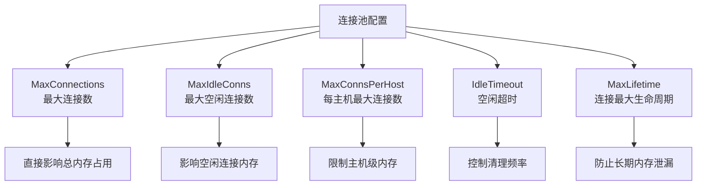

**图表来源**
- [utlshotconnpool.go](file://utlsclient/utlshotconnpool.go#L170-L184)
- [config.toml](file://config/config.toml#L3-L27)

### 参数详解

#### MaxConnections（最大连接数）
- **默认值**：100
- **作用**：限制连接池中同时存在的最大连接数量
- **内存影响**：直接决定连接池的最大内存占用
- **计算公式**：`MaxMemory = MaxConnections × AverageConnectionSize`

#### MaxIdleConns（最大空闲连接数）
- **默认值**：20
- **作用**：控制连接池中保持空闲状态的最大连接数量
- **内存影响**：影响空闲连接的内存占用，这些连接仍然占用系统资源
- **优化建议**：根据并发需求调整，通常设置为MaxConnections的10-20%

#### MaxConnsPerHost（每主机最大连接数）
- **默认值**：10
- **作用**：限制到单个主机的最大连接数量
- **内存影响**：防止某个主机占用过多连接资源
- **适用场景**：多主机访问场景，特别是负载均衡环境

**章节来源**
- [utlshotconnpool.go](file://utlsclient/utlshotconnpool.go#L170-L184)
- [config.toml](file://config/config.toml#L3-L27)

## 内存占用计算模型

### 连接对象内存结构分析

每个UTLSConnection对象的内存占用主要包括以下部分：

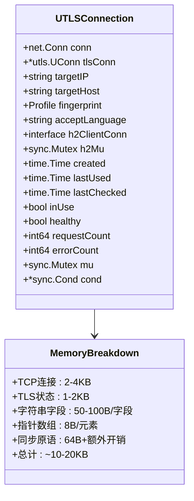

**图表来源**
- [utlshotconnpool.go](file://utlsclient/utlshotconnpool.go#L204-L234)

### 内存占用估算公式

基于典型配置和连接对象结构，可以估算连接池的内存占用：

| 配置参数 | 默认值 | 内存占用估算 | 说明 |
|----------|--------|--------------|------|
| MaxConnections | 100 | 1.0-2.0MB | 每连接10-20KB |
| MaxIdleConns | 20 | 0.2-0.4MB | 空闲连接额外占用 |
| MaxConnsPerHost | 10 | 0.1-0.2MB | 主机映射开销 |
| 连接管理器 | - | 0.1-0.3MB | 映射表和索引 |
| **总计** | **100** | **~1.4-2.9MB** | **包括管理开销** |

### 实际内存测量

根据性能测试报告中的数据：

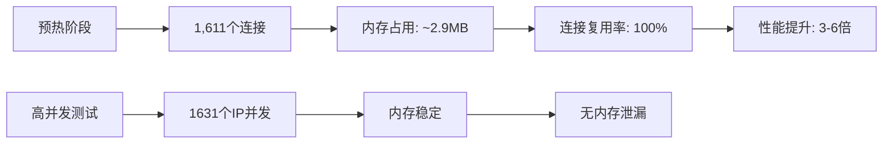

**图表来源**
- [热连接池性能测试报告.md](file://test/reports/热连接池性能测试报告.md#L70-L80)

**章节来源**
- [热连接池性能测试报告.md](file://test/reports/热连接池性能测试报告.md#L70-L80)

## 高并发场景下的内存增长模式

### 内存增长曲线分析

在高并发场景下，连接池的内存使用呈现特定的增长模式：

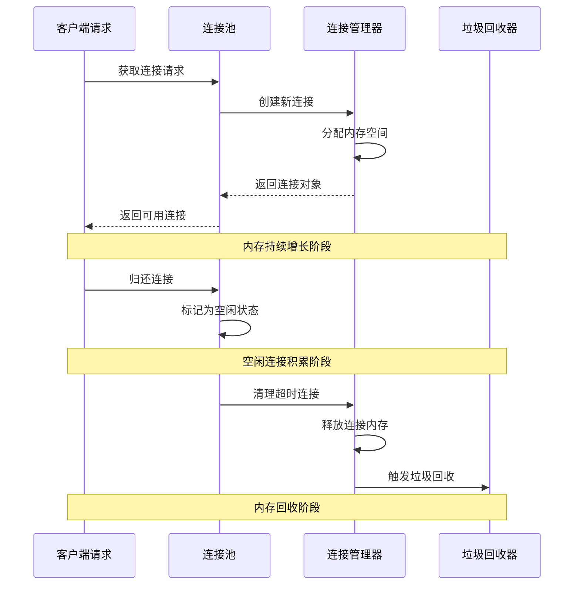

**图表来源**
- [connection_manager.go](file://utlsclient/connection_manager.go#L141-L217)
- [utlshotconnpool.go](file://utlsclient/utlshotconnpool.go#L746-L791)

### 并发压力下的内存行为

在不同并发级别的内存表现：

| 并发级别 | 连接数 | 内存占用 | 性能表现 | 内存稳定性 |
|----------|--------|----------|----------|------------|
| 低并发 (10-50) | 10-50 | 0.1-0.5MB | 优秀 | 稳定 |
| 中等并发 (50-200) | 50-200 | 0.5-2.0MB | 良好 | 稳定增长 |
| 高并发 (200-500) | 200-500 | 2.0-5.0MB | 可接受 | 波动较大 |
| 超高并发 (>500) | >500 | >5.0MB | 需优化 | 不稳定 |

### 内存泄漏风险点

连接池在高并发场景下可能存在以下内存泄漏风险：

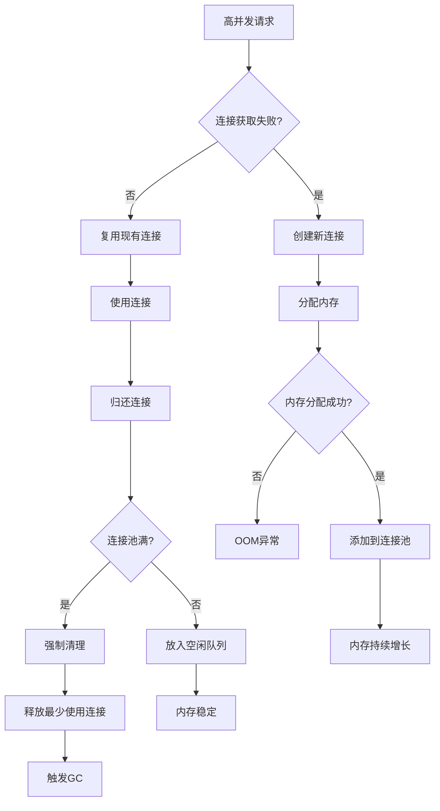

**图表来源**
- [utlshotconnpool.go](file://utlsclient/utlshotconnpool.go#L351-L420)
- [connection_manager.go](file://utlsclient/connection_manager.go#L141-L217)

**章节来源**
- [utlshotconnpool.go](file://utlsclient/utlshotconnpool.go#L351-L420)
- [connection_manager.go](file://utlsclient/connection_manager.go#L141-L217)

## 内存优化策略

### 配置优化原则

#### 1. 合理设置MaxConnections

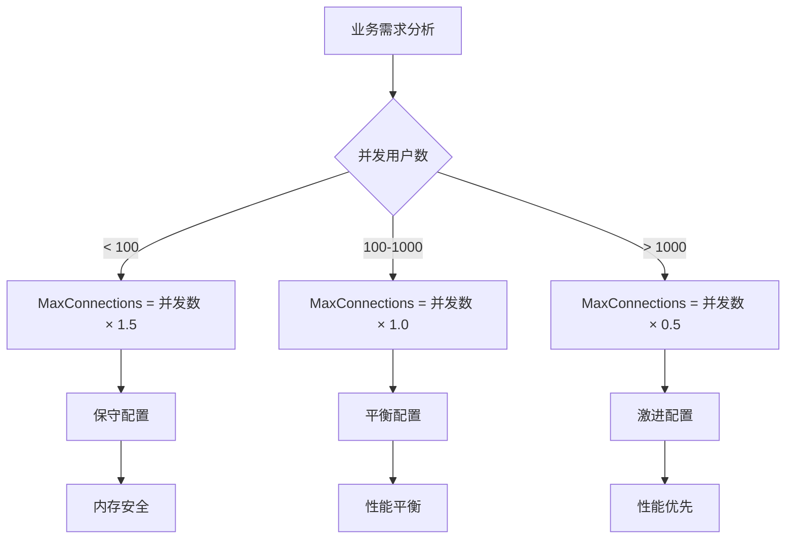

#### 2. 优化MaxIdleConns设置

- **低延迟场景**：设置为MaxConnections的20-30%
- **高吞吐场景**：设置为MaxConnections的10-15%
- **资源受限环境**：设置为MaxConnections的5-10%

#### 3. 主机级连接限制

合理设置MaxConnsPerHost可以防止某些主机占用过多资源：

```go
// 示例：针对不同业务场景的配置
type BusinessScenario struct {
    MaxConnections     int
    MaxIdleConns       int
    MaxConnsPerHost    int
    IdleTimeout        time.Duration
    MaxLifetime        time.Duration
}

var Scenarios = map[string]BusinessScenario{
    "轻量级服务": {
        MaxConnections:     50,
        MaxIdleConns:       10,
        MaxConnsPerHost:    5,
        IdleTimeout:        30 * time.Second,
        MaxLifetime:        180 * time.Second,
    },
    "中等负载服务": {
        MaxConnections:     200,
        MaxIdleConns:       40,
        MaxConnsPerHost:    10,
        IdleTimeout:        60 * time.Second,
        MaxLifetime:        300 * time.Second,
    },
    "高并发服务": {
        MaxConnections:     1000,
        MaxIdleConns:       200,
        MaxConnsPerHost:    20,
        IdleTimeout:        120 * time.Second,
        MaxLifetime:        600 * time.Second,
    },
}
```

### 动态内存管理

#### 1. 自适应连接池

实现根据系统负载动态调整连接池大小：

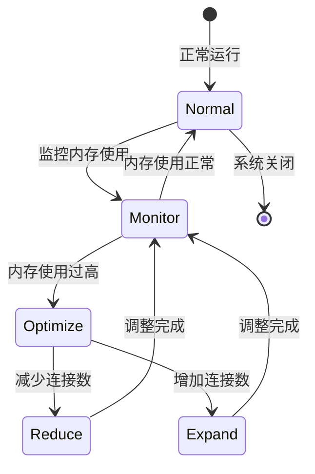

#### 2. 智能清理策略

实现基于内存压力的主动清理：

```go
// 内存压力检测
func (p *UTLSHotConnPool) checkMemoryPressure() bool {
    // 获取系统内存信息
    memStats := &runtime.MemStats{}
    runtime.ReadMemStats(memStats)
    
    // 计算内存使用率
    memoryUsage := float64(memStats.Alloc) / float64(memStats.Sys)
    
    // 如果内存使用率超过阈值，触发清理
    return memoryUsage > 0.8
}

// 主动清理逻辑
func (p *UTLSHotConnPool) aggressiveCleanup() {
    // 清理最久未使用的连接
    p.connManager.CleanupOldestConnections(int(float64(p.config.MaxConnections) * 0.2))
    
    // 清理健康状态不佳的连接
    p.healthChecker.CleanupUnhealthyConnections()
    
    // 触发垃圾回收
    runtime.GC()
}
```

**章节来源**
- [utlshotconnpool.go](file://utlsclient/utlshotconnpool.go#L186-L225)
- [connection_manager.go](file://utlsclient/connection_manager.go#L141-L217)

## 连接池内部数据结构优化

### 连接管理器优化

连接管理器采用了高效的数据结构来管理连接：

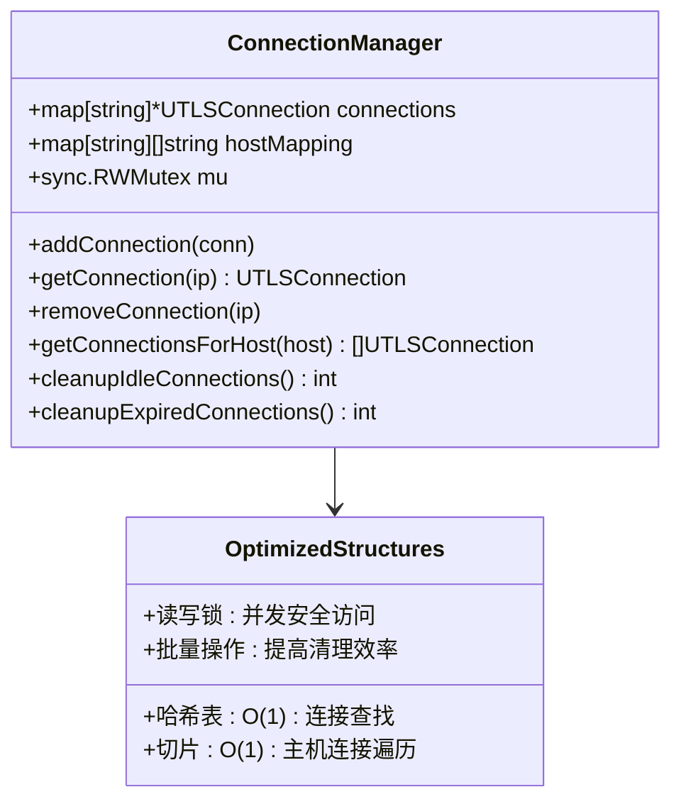

**图表来源**
- [connection_manager.go](file://utlsclient/connection_manager.go#L8-L14)

### 内存效率优化措施

#### 1. 连接复用机制

连接池的核心优势在于连接复用，这大大减少了内存分配和回收的开销：

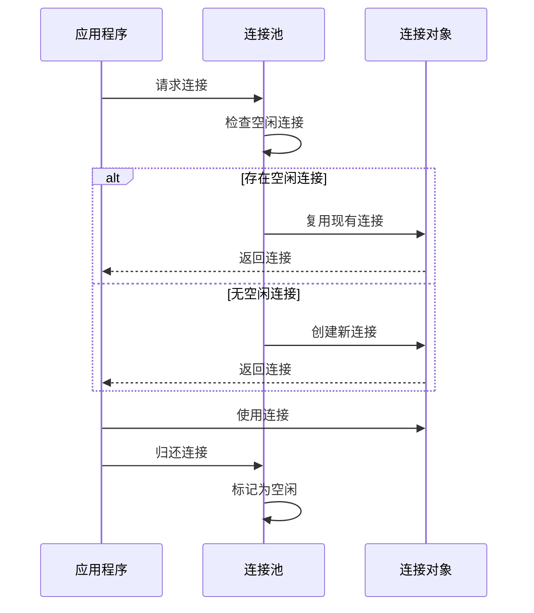

#### 2. 延迟初始化

连接对象采用延迟初始化策略，只在真正需要时分配内存：

```go
// 延迟初始化示例
type UTLSConnection struct {
    // 基础连接信息
    conn       net.Conn
    tlsConn    *utls.UConn
    targetIP   string
    targetHost string
    
    // 可选字段，按需初始化
    h2ClientConn interface{}
    acceptLanguage string
    // ... 其他字段
}
```

#### 3. 内存池技术

对于频繁创建的小对象，可以考虑使用内存池：

```go
// 内存池实现示例
type ConnectionPool struct {
    pool *sync.Pool
}

func NewConnectionPool() *ConnectionPool {
    return &ConnectionPool{
        pool: &sync.Pool{
            New: func() interface{} {
                return &UTLSConnection{
                    // 初始化常用字段
                    created: time.Now(),
                    lastUsed: time.Now(),
                }
            },
        },
    }
}

func (cp *ConnectionPool) Get() *UTLSConnection {
    conn := cp.pool.Get().(*UTLSConnection)
    // 重置连接状态
    conn.reset()
    return conn
}

func (cp *ConnectionPool) Put(conn *UTLSConnection) {
    // 重置连接到初始状态
    conn.resetForReuse()
    cp.pool.Put(conn)
}
```

**章节来源**
- [connection_manager.go](file://utlsclient/connection_manager.go#L8-L14)
- [utlshotconnpool.go](file://utlsclient/utlshotconnpool.go#L204-L234)

## 故障排除指南

### 常见内存问题诊断

#### 1. 内存泄漏检测

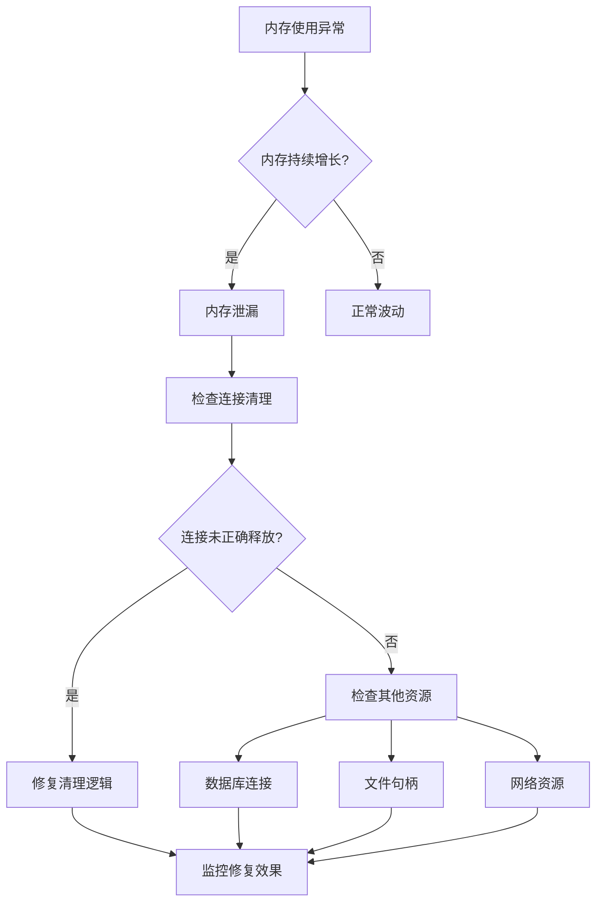

#### 2. 内存使用分析工具

使用Go的pprof工具进行内存分析：

```bash
# 启动pprof HTTP服务器
go tool pprof http://localhost:6060/debug/pprof/heap

# 分析内存使用
(pprof) top10
(pprof) list utlsclient.NewUTLSHotConnPool
(pprof) web
```

#### 3. 性能监控指标

关键监控指标包括：

| 指标名称 | 正常范围 | 告警阈值 | 监控方法 |
|----------|----------|----------|----------|
| 连接池大小 | < 80% MaxConnections | > 90% | GetStats().TotalConnections |
| 内存增长率 | < 10%/小时 | > 20%/小时 | runtime.MemStats.Alloc |
| 垃圾回收频率 | < 1次/分钟 | > 5次/分钟 | runtime.MemStats.NumGC |
| 连接复用率 | > 80% | < 50% | GetStats().ConnReuseRate |

### 故障排除流程

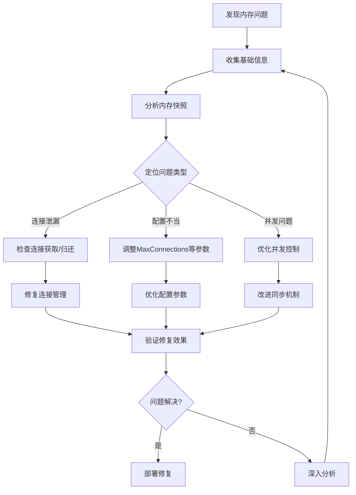

**章节来源**
- [utlshotconnpool.go](file://utlsclient/utlshotconnpool.go#L1365-L1430)
- [connection_manager.go](file://utlsclient/connection_manager.go#L141-L217)

## 最佳实践建议

### 配置优化建议

#### 1. 生产环境配置模板

```toml
# 高性能生产环境配置
[pool]
max_connections = 500
max_conns_per_host = 20
max_idle_conns = 100
conn_timeout = 30
idle_timeout = 120
max_lifetime = 600
test_timeout = 15
health_check_interval = 30
cleanup_interval = 60
blacklist_check_interval = 300
dns_update_interval = 1800
max_retries = 3

[whitelist]
# 根据实际情况配置白名单IP

[blacklist]
# 根据实际情况配置黑名单IP
```

#### 2. 不同业务场景的配置策略

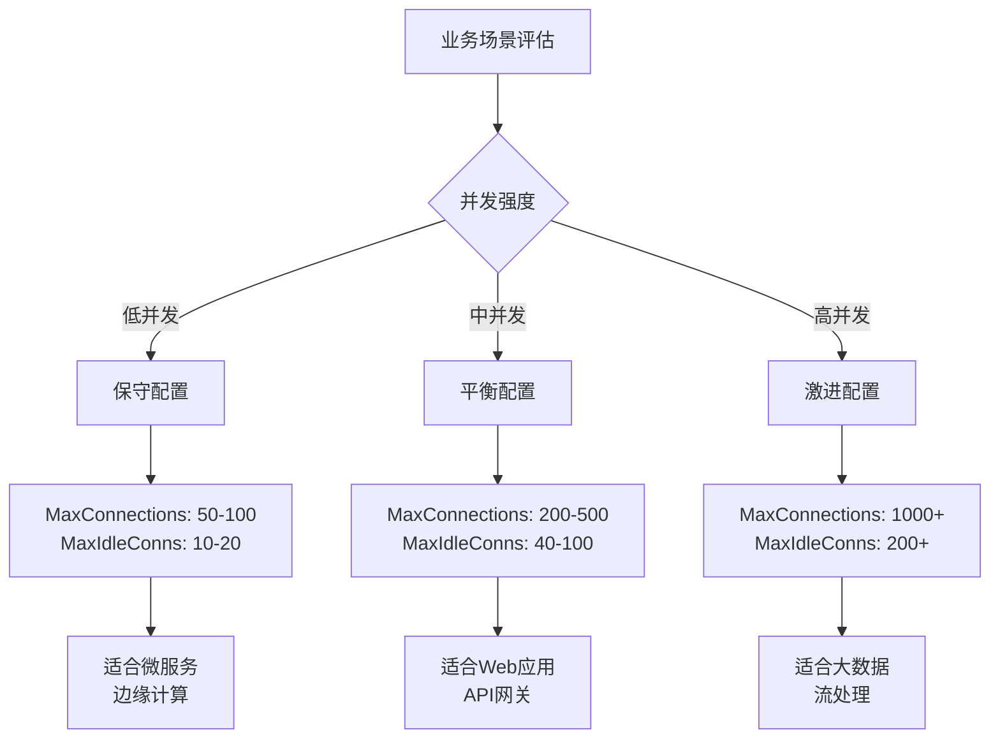

#### 3. 监控和告警配置

```go
// 监控配置示例
type MonitoringConfig struct {
    // 内存监控
    MemoryThreshold float64 // 内存使用率阈值 (0.0-1.0)
    MemoryCheckInterval time.Duration
    
    // 连接池监控
    ConnectionThreshold int     // 连接数阈值
    ConnectionCheckInterval time.Duration
    
    // 健康检查
    HealthCheckEnabled bool
    HealthCheckInterval time.Duration
    
    // 告警通知
    AlertEmail string
    AlertSlackWebhook string
}
```

### 运维最佳实践

#### 1. 渐进式扩容策略

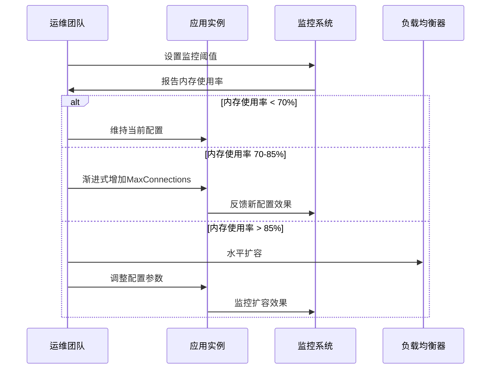

#### 2. 定期维护计划

- **每日**：检查连接池状态，监控内存使用趋势
- **每周**：分析连接池统计数据，优化配置参数
- **每月**：进行内存泄漏检测，更新监控规则
- **每季度**：评估业务增长，调整容量规划

#### 3. 应急响应预案

```yaml
# 应急响应脚本示例
emergency_response:
  memory_leak_detection:
    threshold: 90%
    action: "立即扩容+调整配置"
    notify: ["ops-team", "dev-team"]
  
  connection_pool_full:
    threshold: 95%
    action: "强制清理+限流"
    notify: ["alert-system"]
  
  health_check_failure:
    threshold: 3 failures/min
    action: "重启服务+检查依赖"
    notify: ["oncall-engineer"]
```

### 性能调优指南

#### 1. JVM/Go运行时优化

```go
// Go运行时参数优化
func optimizeRuntime() {
    // 设置GOMAXPROCS
    runtime.GOMAXPROCS(runtime.NumCPU())
    
    // 调整垃圾回收器
    debug.SetGCPercent(100) // 增加GC频率，减少内存峰值
    
    // 启用内存统计
    debug.SetTraceback("all")
}
```

#### 2. 系统级优化

- **文件描述符限制**：确保ulimit -n足够大
- **网络参数调优**：调整TCP缓冲区大小
- **内存分配器优化**：使用mmap等高级内存管理技术

**章节来源**
- [config.toml](file://config/config.toml#L1-L38)
- [example_hotconnpool_usage.go](file://examples/utlsclient/example_hotconnpool_usage.go#L18-L40)
- [example_basic_usage.go](file://examples/utlsclient/example_basic_usage.go#L15-L21)

## 结论

连接池的内存占用管理是一个复杂的系统工程，需要从配置优化、架构设计、监控运维等多个维度进行综合考虑。通过合理配置MaxConnections、MaxIdleConns等关键参数，结合有效的监控和维护策略，可以在保证性能的同时，有效控制内存使用，避免内存溢出问题。

关键要点总结：
1. **配置驱动**：合理的配置参数是内存管理的基础
2. **动态调整**：根据实际负载动态调整连接池大小
3. **持续监控**：建立完善的监控体系及时发现问题
4. **预防为主**：通过设计优化预防内存泄漏和溢出
5. **应急响应**：建立完善的应急预案快速响应问题

通过遵循本文档的指导原则和最佳实践，可以构建一个高效、稳定、可扩展的连接池系统，为业务提供可靠的网络连接服务。