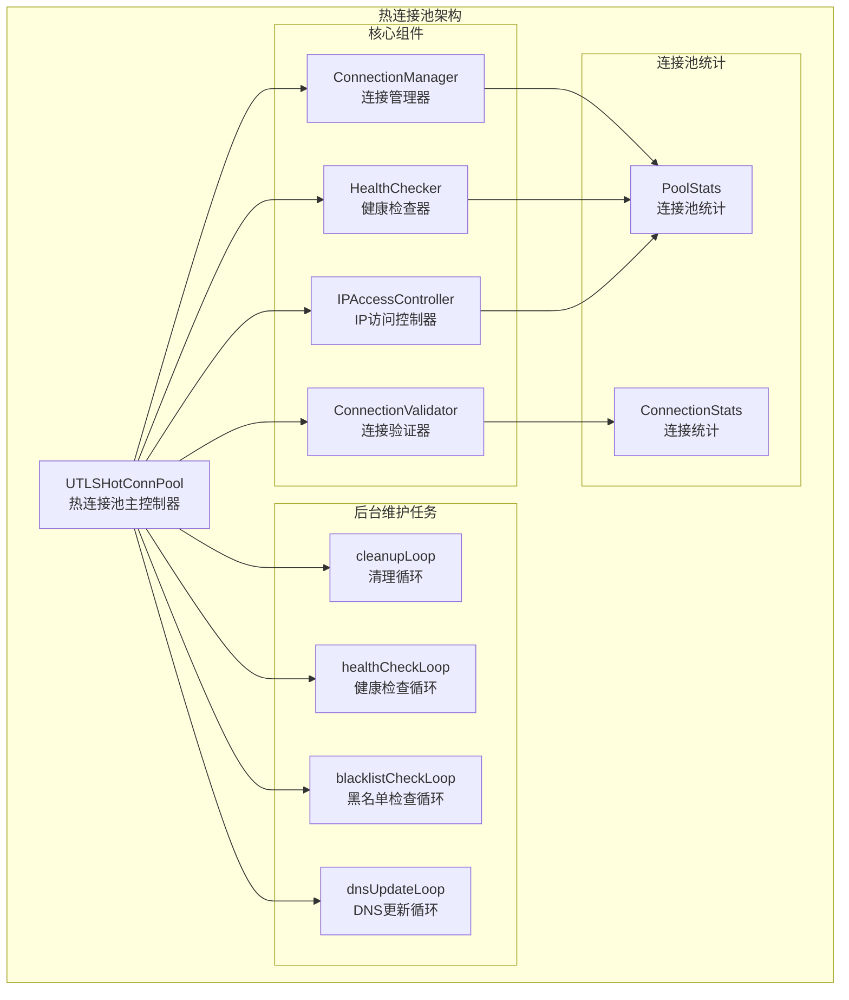
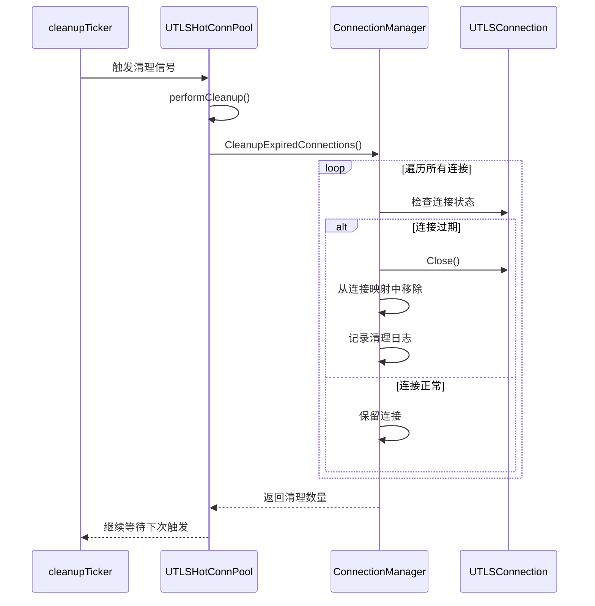
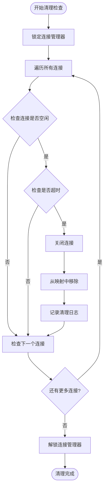
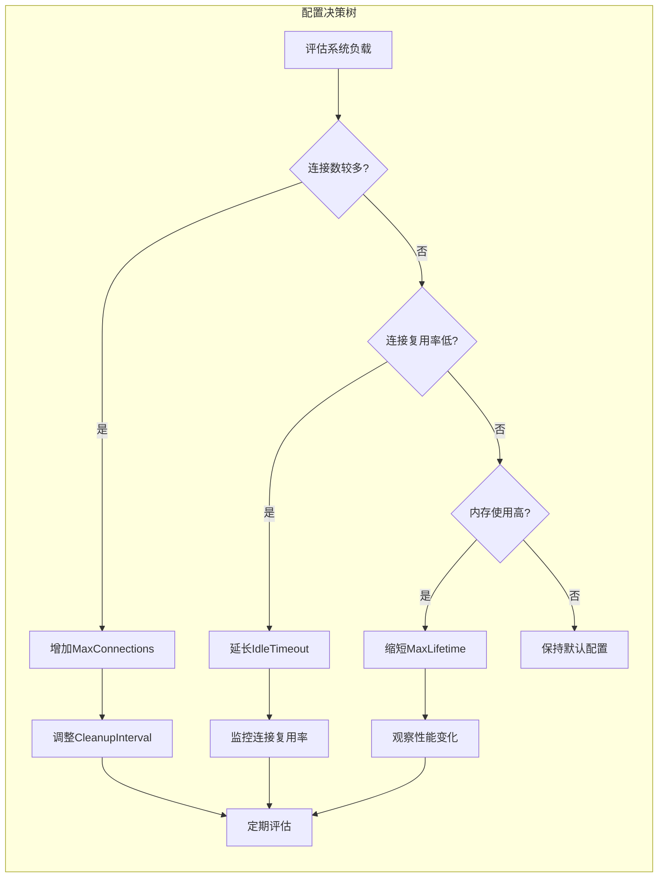
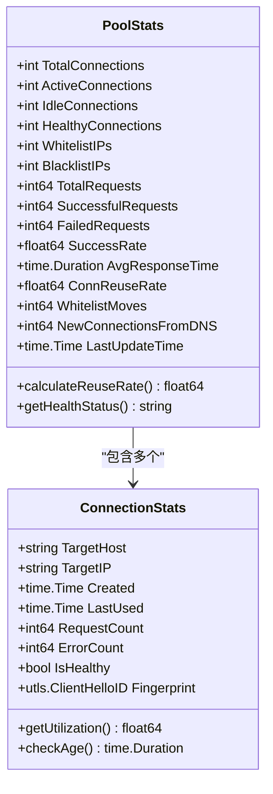
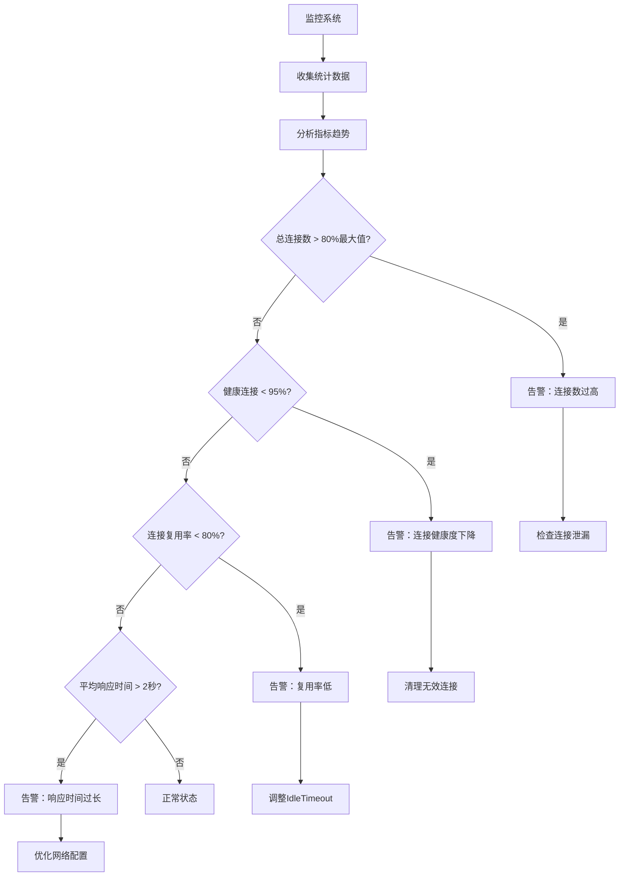
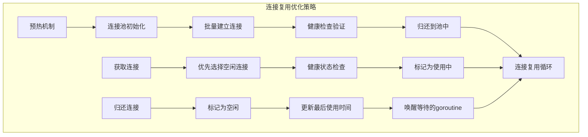
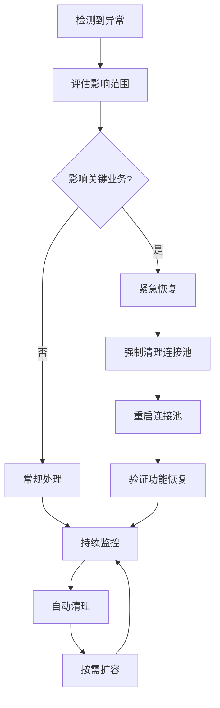

# 资源管理

<cite>
**本文档引用的文件**
- [utlshotconnpool.go](file://utlsclient/utlshotconnpool.go)
- [connection_manager.go](file://utlsclient/connection_manager.go)
- [health_checker.go](file://utlsclient/health_checker.go)
- [热连接池性能测试报告.md](file://test/reports/热连接池性能测试报告.md)
- [connection_manager_test.go](file://test/utlsclient/connection_manager_test.go)
</cite>

## 目录
1. [简介](#简介)
2. [连接池架构概览](#连接池架构概览)
3. [清理机制详解](#清理机制详解)
4. [配置参数分析](#配置参数分析)
5. [监控与统计](#监控与统计)
6. [性能优化策略](#性能优化策略)
7. [故障排除指南](#故障排除指南)
8. [最佳实践建议](#最佳实践建议)

## 简介

热连接池（Hot Connection Pool）是爬虫平台的核心资源管理系统，通过智能的连接复用机制和完善的清理策略，确保高性能的网络通信。本文档重点阐述连接池内部的清理机制如何防止无效连接积累，以及如何通过合理的配置参数控制连接生命周期，从而维持系统的高性能运行。

## 连接池架构概览

热连接池采用分层架构设计，包含连接管理器、健康检查器、连接验证器和IP访问控制器四个核心组件。



**图表来源**
- [utlshotconnpool.go](file://utlsclient/utlshotconnpool.go#L237-L258)
- [connection_manager.go](file://utlsclient/connection_manager.go#L8-L15)

**章节来源**
- [utlshotconnpool.go](file://utlsclient/utlshotconnpool.go#L237-L258)
- [connection_manager.go](file://utlsclient/connection_manager.go#L8-L15)

## 清理机制详解

### cleanupTicker工作机制

连接池通过后台维护任务实现自动清理，其中cleanupTicker负责定期执行清理操作。



**图表来源**
- [utlshotconnpool.go](file://utlsclient/utlshotconnpool.go#L845-L860)
- [connection_manager.go](file://utlsclient/connection_manager.go#L180-L217)

### 空闲超时清理

空闲超时清理机制确保长时间未使用的连接能够及时释放资源。



**图表来源**
- [connection_manager.go](file://utlsclient/connection_manager.go#L141-L177)

### 过期连接清理

过期连接清理机制防止连接超出最大生命周期而成为无效资源。

**章节来源**
- [utlshotconnpool.go](file://utlsclient/utlshotconnpool.go#L845-L890)
- [connection_manager.go](file://utlsclient/connection_manager.go#L141-L217)

## 配置参数分析

### 关键配置参数表

| 参数名称 | 默认值 | 说明 | 性能影响 |
|---------|--------|------|----------|
| CleanupInterval | 60秒 | 清理任务执行间隔 | 更短的间隔能更快清理无效连接，但增加CPU开销 |
| IdleTimeout | 60秒 | 连接空闲超时时间 | 较长的超时时间提高复用率，较短的超时时间释放资源更快 |
| MaxLifetime | 300秒 | 连接最大生命周期 | 控制连接的总体存活时间，平衡性能和稳定性 |
| MaxConnections | 100 | 最大连接总数 | 限制整体资源占用，防止内存溢出 |
| MaxIdleConns | 20 | 最大空闲连接数 | 控制空闲连接数量，平衡内存使用和复用效率 |

### 配置优化建议



**章节来源**
- [utlshotconnpool.go](file://utlsclient/utlshotconnpool.go#L60-L88)
- [utlshotconnpool.go](file://utlsclient/utlshotconnpool.go#L170-L202)

## 监控与统计

### 连接池状态监控

连接池提供全面的统计信息，帮助运维人员实时掌握连接池状态。



**图表来源**
- [utlshotconnpool.go](file://utlsclient/utlshotconnpool.go#L261-L277)
- [utlshotconnpool.go](file://utlsclient/utlshotconnpool.go#L279-L289)

### 关键监控指标

| 指标类别 | 监控指标 | 告警阈值建议 | 处理措施 |
|---------|----------|-------------|----------|
| 连接数量 | 总连接数/最大连接数 | > 80% | 检查连接泄漏，考虑扩容 |
| 连接状态 | 活跃连接比例 | > 70% | 监控请求队列，优化并发 |
| 连接健康 | 健康连接比例 | < 95% | 检查网络状况，清理无效连接 |
| 连接复用 | 连接复用率 | < 80% | 优化IdleTimeout配置 |
| 性能指标 | 平均响应时间 | > 2秒 | 检查网络延迟，优化路由 |

### 监控告警配置



**章节来源**
- [utlshotconnpool.go](file://utlsclient/utlshotconnpool.go#L1122-L1174)
- [connection_manager.go](file://utlsclient/connection_manager.go#L141-L217)

## 性能优化策略

### 连接复用率优化

根据测试报告显示，连接池实现了100%的连接复用率，这是通过以下策略实现的：



**图表来源**
- [热连接池性能测试报告.md](file://test/reports/热连接池性能测试报告.md#L137-L171)

### 资源管理最佳实践

1. **合理设置超时参数**
   - IdleTimeout应根据业务特点设置，通常为30-120秒
   - MaxLifetime应设置为IdleTimeout的2-5倍
   - CleanupInterval设置为IdleTimeout的1/10左右

2. **监控关键指标**
   - 持续监控连接复用率，理想值应>90%
   - 关注健康连接比例，确保>95%
   - 监控平均响应时间，保持在合理范围内

3. **定期维护**
   - 定期执行ForceCleanup清理异常连接
   - 监控内存使用情况，防止连接泄漏
   - 根据业务需求调整连接池大小

**章节来源**
- [热连接池性能测试报告.md](file://test/reports/热连接池性能测试报告.md#L295-L304)

## 故障排除指南

### 常见问题诊断

| 问题症状 | 可能原因 | 排查方法 | 解决方案 |
|---------|----------|----------|----------|
| 连接复用率低 | IdleTimeout设置过短 | 检查配置参数，查看连接使用统计 | 延长IdleTimeout |
| 连接泄漏 | 归还连接失败 | 检查PutConnection调用 | 确保正确归还连接 |
| 健康连接不足 | 网络不稳定 | 检查网络连通性，查看健康检查日志 | 调整健康检查频率 |
| 性能下降 | 连接池过载 | 监控连接数和响应时间 | 增加MaxConnections或优化并发 |

### 故障恢复流程



**章节来源**
- [utlshotconnpool.go](file://utlsclient/utlshotconnpool.go#L1365-L1380)

## 最佳实践建议

### 配置优化建议

1. **生产环境配置**
   ```go
   // 生产环境推荐配置
   config := &PoolConfig{
       MaxConnections:         200,      // 根据服务器资源调整
       MaxConnsPerHost:        20,       // 每主机最大连接数
       MaxIdleConns:           50,       // 最大空闲连接
       ConnTimeout:            30 * time.Second,
       IdleTimeout:            120 * time.Second,  // 适中的空闲超时
       MaxLifetime:            600 * time.Second,  // 较长的生命周期
       CleanupInterval:        30 * time.Second,   // 频繁的清理
       HealthCheckInterval:    60 * time.Second,   // 健康检查
   }
   ```

2. **监控告警设置**
   - 连接池使用率 > 80% 时发送告警
   - 健康连接比例 < 90% 时触发检查
   - 平均响应时间 > 1秒 时记录性能问题

3. **维护策略**
   - 每日检查连接池统计信息
   - 每周执行ForceCleanup清理
   - 根据业务增长定期调整配置参数

### 开发注意事项

1. **连接使用规范**
   - 确保每次获取的连接都能正确归还
   - 处理连接获取失败的情况
   - 避免长时间持有连接不归还

2. **错误处理**
   - 实现重试机制处理临时连接失败
   - 记录详细的连接状态信息
   - 提供连接池状态查询接口

通过遵循这些最佳实践，可以确保连接池的稳定运行，最大化资源利用效率，同时保持系统的高性能和可靠性。