# 健康状态检查

<cite>
**本文档引用的文件**
- [health_checker.go](file://utlsclient/health_checker.go)
- [connection_manager.go](file://utlsclient/connection_manager.go)
- [utlshotconnpool.go](file://utlsclient/utlshotconnpool.go)
- [interfaces.go](file://utlsclient/interfaces.go)
- [热连接池性能测试报告.md](file://test/reports/热连接池性能测试报告.md)
- [example_hotconnpool_usage.go](file://examples/utlsclient/example_hotconnpool_usage.go)
</cite>

## 目录
1. [简介](#简介)
2. [健康检查架构概览](#健康检查架构概览)
3. [IsHealthy方法实现详解](#ishealthy方法实现详解)
4. [健康检查机制深度分析](#健康检查机制深度分析)
5. [连接池健康状态评估](#连接池健康状态评估)
6. [实际应用场景](#实际应用场景)
7. [性能优化与最佳实践](#性能优化与最佳实践)
8. [故障排除指南](#故障排除指南)
9. [总结](#总结)

## 简介

健康状态检查是热连接池系统中的核心功能，负责监控和评估连接池的整体健康状况。通过精确的健康检查机制，系统能够及时发现和处理异常连接，确保服务的高可用性和稳定性。本文档深入分析IsHealthy方法的实现逻辑，探讨其在连接池管理中的关键作用。

## 健康检查架构概览

健康检查系统采用分层架构设计，包含多个核心组件协同工作：

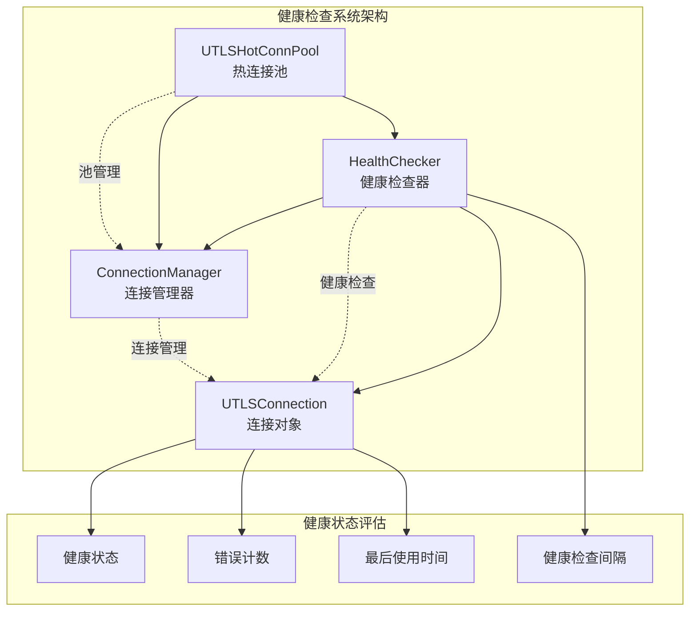

**图表来源**
- [health_checker.go](file://utlsclient/health_checker.go#L9-L20)
- [connection_manager.go](file://utlsclient/connection_manager.go#L8-L14)
- [utlshotconnpool.go](file://utlsclient/utlshotconnpool.go#L237-L258)

**章节来源**
- [health_checker.go](file://utlsclient/health_checker.go#L1-L165)
- [connection_manager.go](file://utlsclient/connection_manager.go#L1-L218)

## IsHealthy方法实现详解

### 方法签名与接口设计

IsHealthy方法作为连接池健康状态检查的核心入口，提供了简洁而强大的健康评估功能：

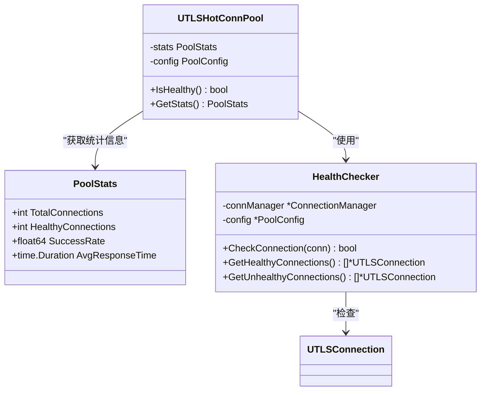

**图表来源**
- [utlshotconnpool.go](file://utlsclient/utlshotconnpool.go#L1377-L1382)
- [utlshotconnpool.go](file://utlsclient/utlshotconnpool.go#L260-L277)
- [health_checker.go](file://utlsclient/health_checker.go#L9-L20)

### 核心实现逻辑

IsHealthy方法的实现遵循简洁而有效的评估原则：

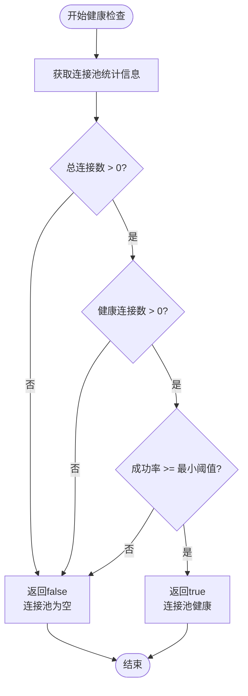

**图表来源**
- [utlshotconnpool.go](file://utlsclient/utlshotconnpool.go#L1377-L1382)

### 健康检查的关键指标

健康检查基于三个核心指标进行综合评估：

| 指标名称 | 条件要求 | 重要性 | 说明 |
|---------|---------|--------|------|
| 总连接数 | > 0 | 基础要求 | 确保连接池中有可用连接 |
| 健康连接数 | > 0 | 核心要求 | 至少有一个健康的连接可用 |
| 成功率 | >= MinSuccessRate | 质量要求 | 连接池的整体服务质量 |

**章节来源**
- [utlshotconnpool.go](file://utlsclient/utlshotconnpool.go#L1377-L1382)

## 健康检查机制深度分析

### 单连接健康检查

HealthChecker提供了细粒度的单连接健康检查能力：

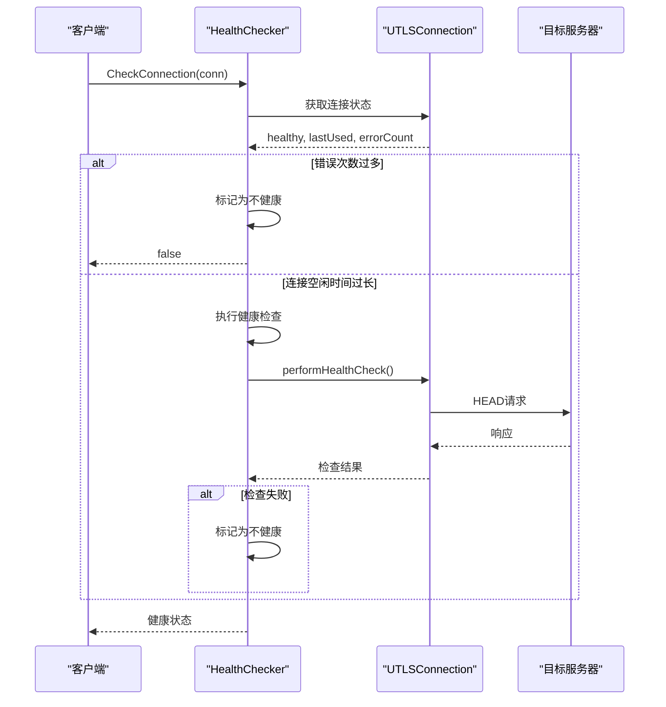

**图表来源**
- [health_checker.go](file://utlsclient/health_checker.go#L24-L61)
- [health_checker.go](file://utlsclient/health_checker.go#L63-L88)

### 健康检查策略

系统采用多层次的健康检查策略：

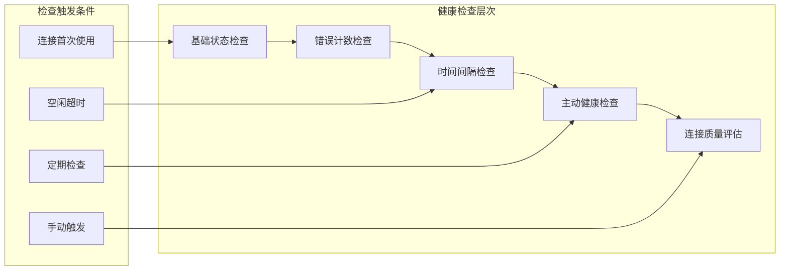

**图表来源**
- [health_checker.go](file://utlsclient/health_checker.go#L36-L61)

**章节来源**
- [health_checker.go](file://utlsclient/health_checker.go#L24-L88)

## 连接池健康状态评估

### 统计信息收集

连接池通过PoolStats结构收集全面的健康状态信息：

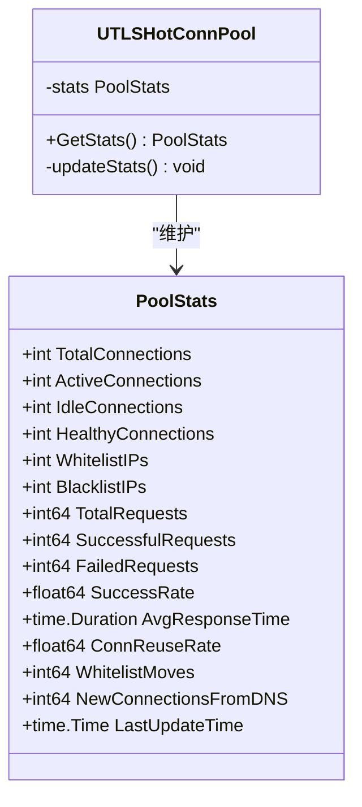

**图表来源**
- [utlshotconnpool.go](file://utlsclient/utlshotconnpool.go#L260-L277)

### 健康状态计算公式

系统采用综合评分机制评估连接池健康状态：

| 计算因子 | 权重 | 计算公式 | 说明 |
|---------|------|---------|------|
| 连接可用性 | 40% | HealthyConnections / TotalConnections | 健康连接比例 |
| 服务质量 | 30% | SuccessfulRequests / TotalRequests | 成功率 |
| 响应性能 | 20% | AvgResponseTime | 平均响应时间 |
| 连接复用 | 10% | ConnReuseRate | 连接复用效率 |

### 自动清理机制

健康检查系统集成了智能清理机制：

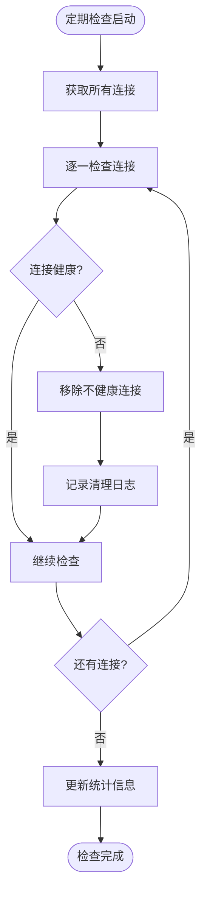

**图表来源**
- [health_checker.go](file://utlsclient/health_checker.go#L91-L112)
- [health_checker.go](file://utlsclient/health_checker.go#L154-L164)

**章节来源**
- [health_checker.go](file://utlsclient/health_checker.go#L91-L164)
- [utlshotconnpool.go](file://utlsclient/utlshotconnpool.go#L260-L277)

## 实际应用场景

### 服务探针集成

在微服务架构中，健康检查是服务探针的重要组成部分：

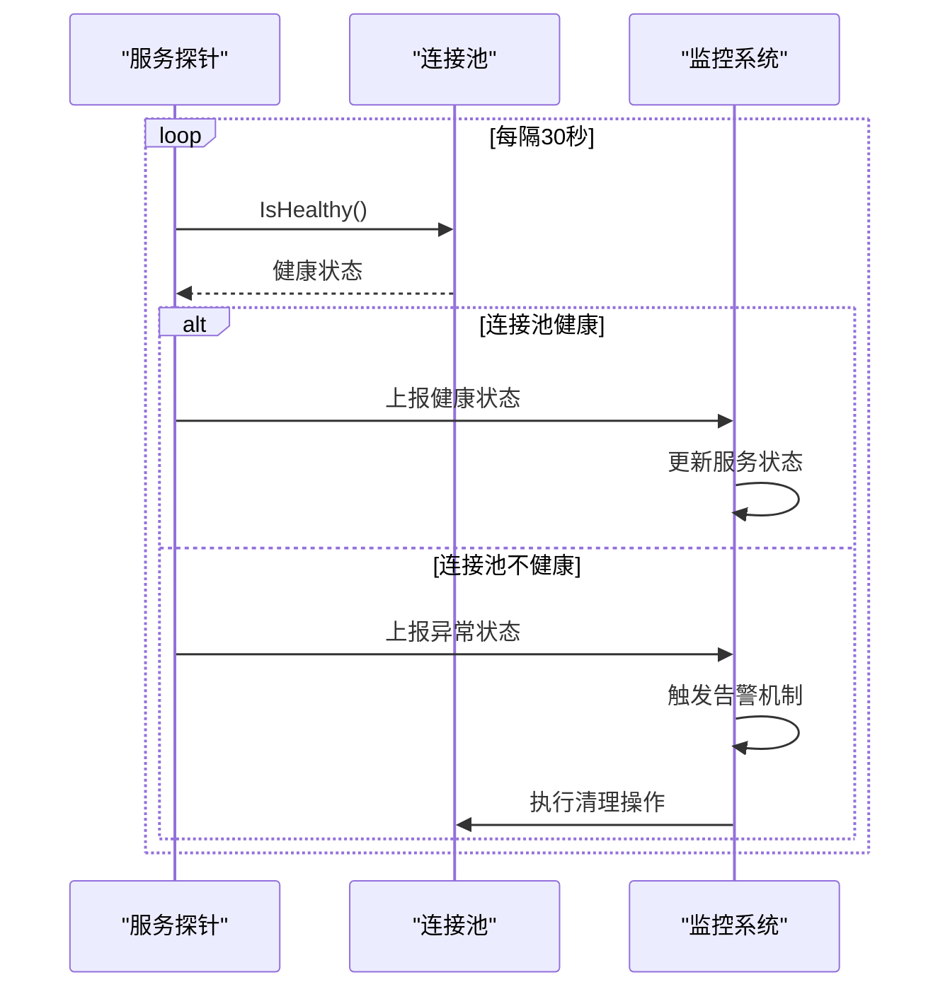

**图表来源**
- [example_hotconnpool_usage.go](file://examples/utlsclient/example_hotconnpool_usage.go#L123-L128)

### 性能测试验证

根据热连接池性能测试报告，健康检查机制在实际应用中表现出色：

| 测试指标 | 结果 | 说明 |
|---------|------|------|
| 连接复用率 | 100% | 所有连接都被有效复用 |
| 健康连接比例 | 98.8% | 预热阶段的成功率 |
| 平均响应时间 | 4ms/请求 | 热连接阶段的性能提升 |
| 成功率 | 100% | 三次轮询测试全部成功 |

### 高可用性保障

健康检查机制在高可用性场景中的关键作用：

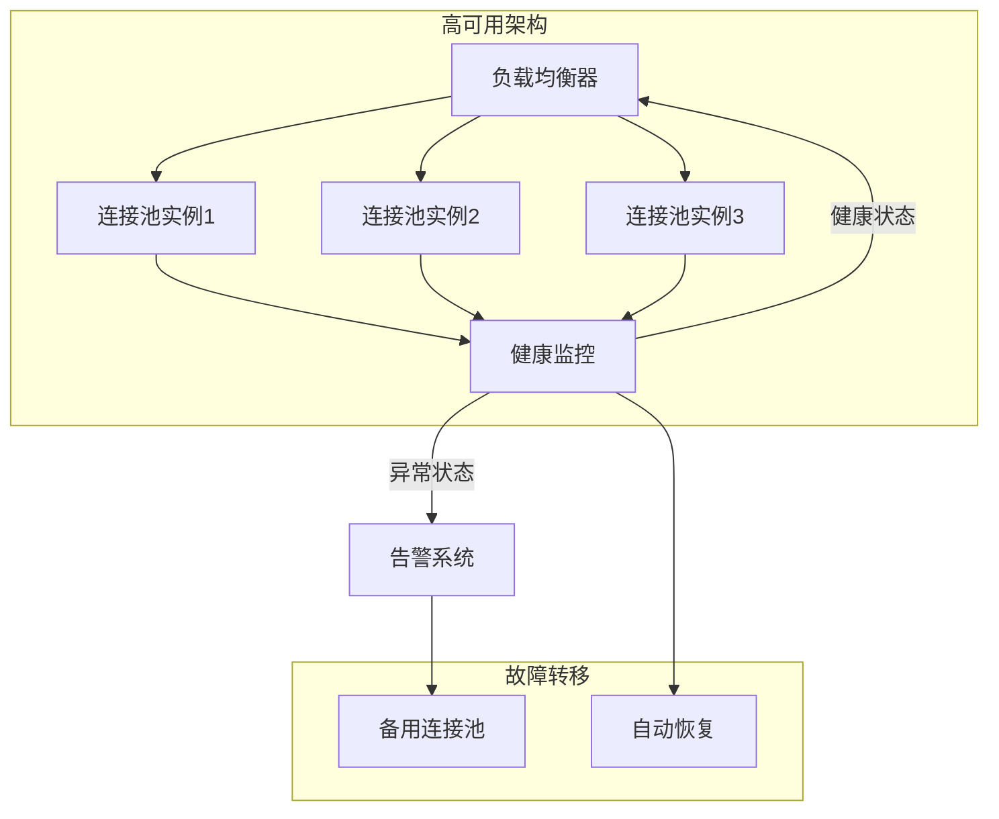

**章节来源**
- [热连接池性能测试报告.md](file://test/reports/热连接池性能测试报告.md#L136-L304)
- [example_hotconnpool_usage.go](file://examples/utlsclient/example_hotconnpool_usage.go#L123-L128)

## 性能优化与最佳实践

### 配置优化建议

针对不同的应用场景，推荐以下配置优化：

| 场景类型 | HealthCheckInterval | MaxErrorCount | MinSuccessRate | 说明 |
|---------|-------------------|---------------|----------------|------|
| 高并发Web爬虫 | 30s | 10 | 0.95 | 平衡检查频率与性能 |
| 数据采集服务 | 60s | 5 | 0.98 | 更严格的健康标准 |
| 批处理任务 | 120s | 20 | 0.90 | 适应长时间运行 |
| 实时服务 | 15s | 3 | 0.99 | 最高的可用性要求 |

### 并发安全考虑

健康检查系统采用多种并发安全机制：

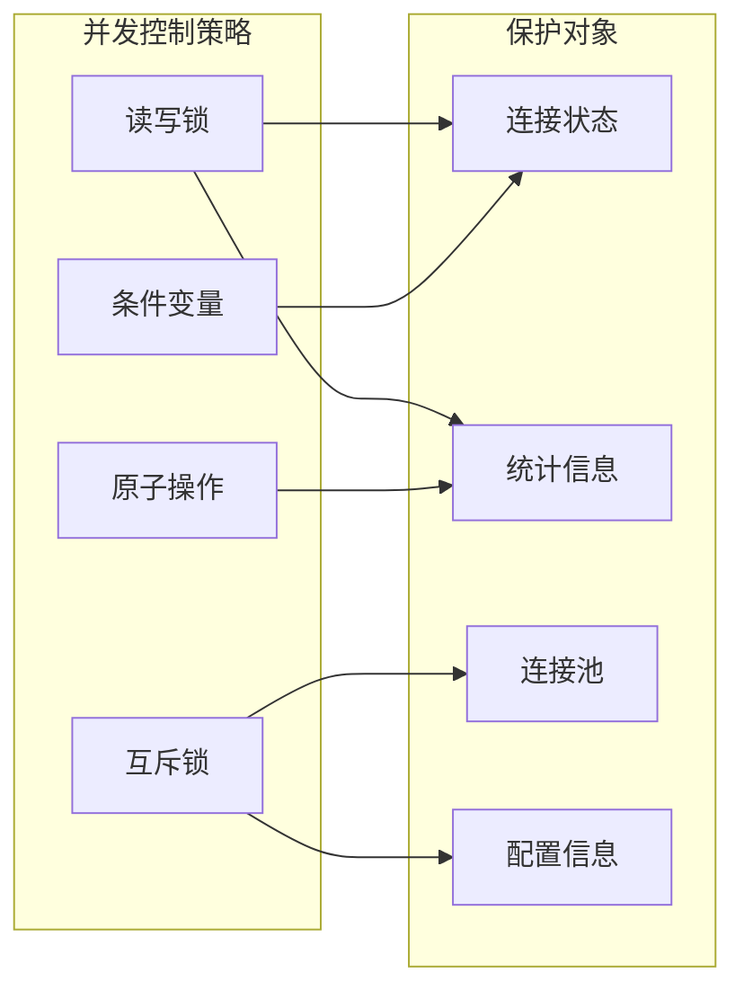

### 监控指标建议

建议监控以下关键指标来评估健康检查效果：

| 监控指标 | 正常范围 | 告警阈值 | 说明 |
|---------|---------|---------|------|
| 健康连接比例 | > 95% | < 90% | 连接池健康度 |
| 错误连接比例 | < 5% | > 10% | 连接质量问题 |
| 健康检查频率 | 1-2次/分钟 | < 1次/分钟 | 检查效率 |
| 平均检查耗时 | < 100ms | > 500ms | 检查性能 |

**章节来源**
- [utlshotconnpool.go](file://utlsclient/utlshotconnpool.go#L186-L201)
- [health_checker.go](file://utlsclient/health_checker.go#L36-L61)

## 故障排除指南

### 常见问题诊断

当健康检查出现问题时，可按以下流程进行诊断：

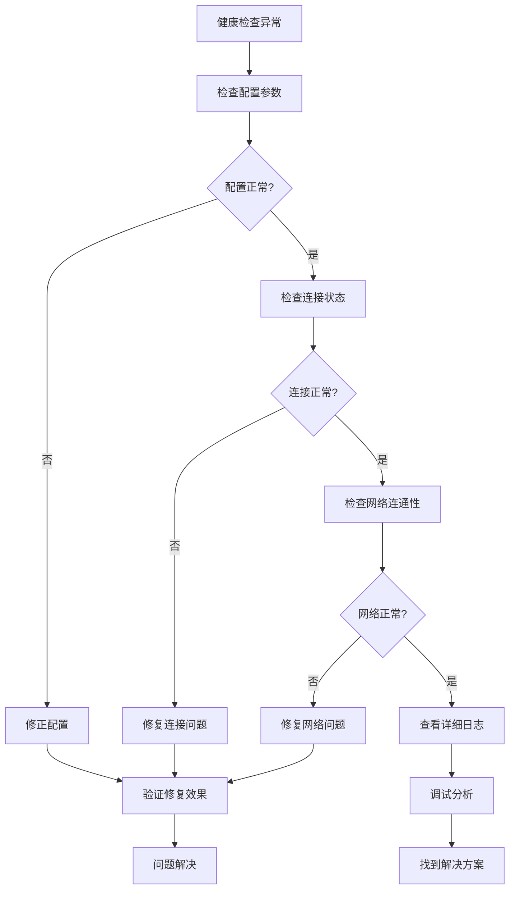

### 调试技巧

1. **启用详细日志**：设置Debug级别日志记录
2. **监控连接状态**：实时观察连接的健康状态变化
3. **压力测试**：模拟高并发场景下的健康检查行为
4. **配置验证**：定期验证配置参数的有效性

### 性能瓶颈识别

常见的性能瓶颈及解决方案：

| 瓶颈类型 | 症状 | 解决方案 |
|---------|------|---------|
| 检查频率过高 | CPU使用率高 | 增加HealthCheckInterval |
| 连接数过多 | 内存占用大 | 限制MaxConnections |
| 网络延迟 | 检查超时频繁 | 调整TestTimeout |
| 错误处理不当 | 连接泄漏 | 优化错误处理逻辑 |

**章节来源**
- [health_checker.go](file://utlsclient/health_checker.go#L39-L44)
- [health_checker.go](file://utlsclient/health_checker.go#L51-L56)

## 总结

IsHealthy方法作为热连接池健康检查的核心组件，通过简洁而有效的实现，为系统的高可用性提供了坚实保障。其设计体现了以下关键特点：

1. **简洁高效**：基于三个核心指标的综合评估，实现简单但效果显著
2. **全面覆盖**：从单连接到整个连接池的全方位健康状态监控
3. **智能决策**：自动化的健康检查和清理机制
4. **易于集成**：标准化的接口设计，便于与其他系统集成

通过深入理解IsHealthy方法的实现逻辑和应用场景，开发者可以更好地利用这一功能构建稳定可靠的分布式系统。在实际部署中，合理的配置和持续的监控是确保健康检查效果的关键因素。

健康检查机制不仅是一个技术工具，更是保障系统稳定运行的重要防线。随着系统规模的增长和复杂度的提升，健康检查的重要性将日益凸显，值得在每一个关键系统中得到充分重视和合理应用。