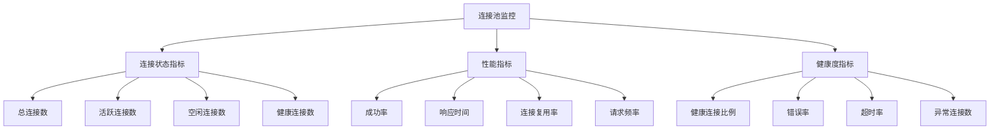
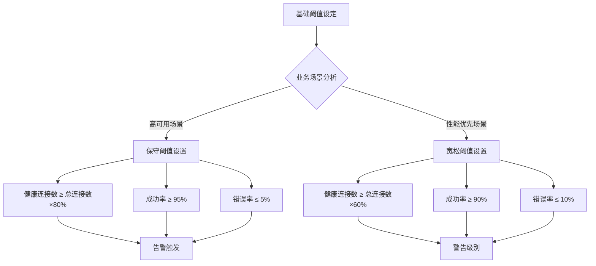
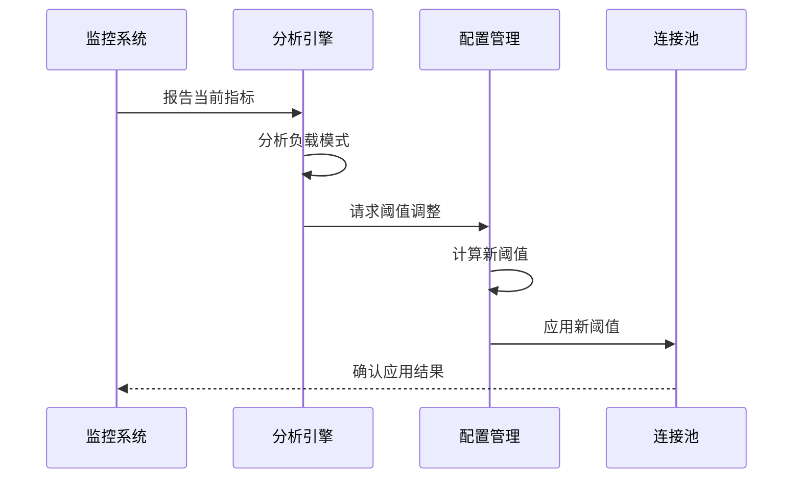
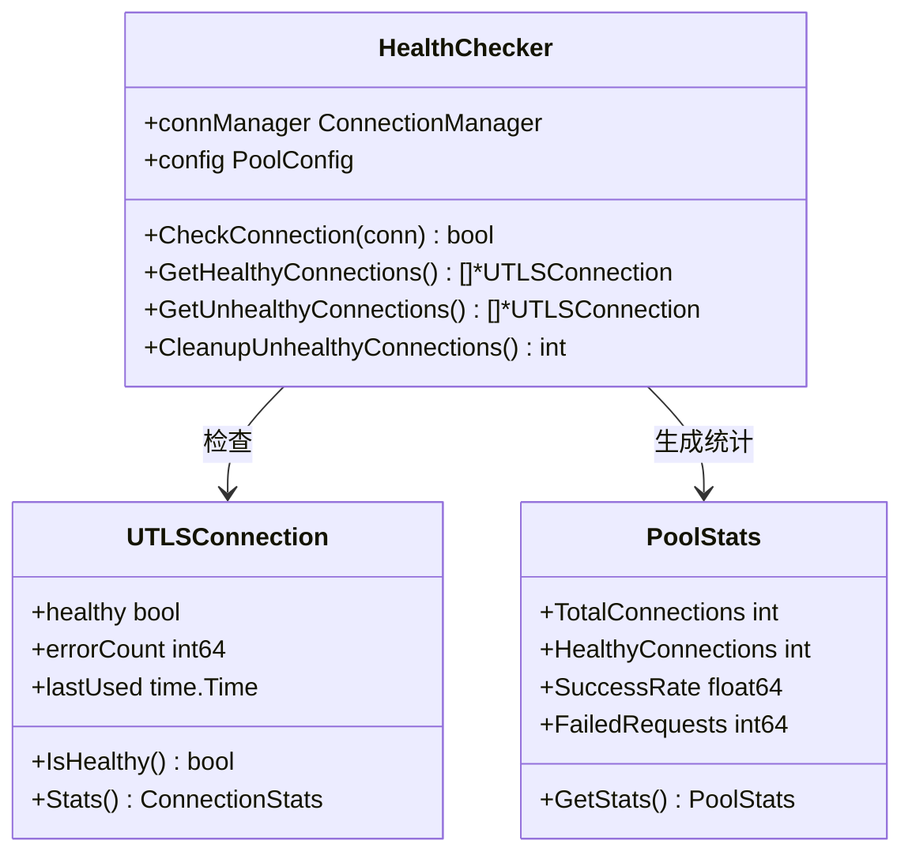
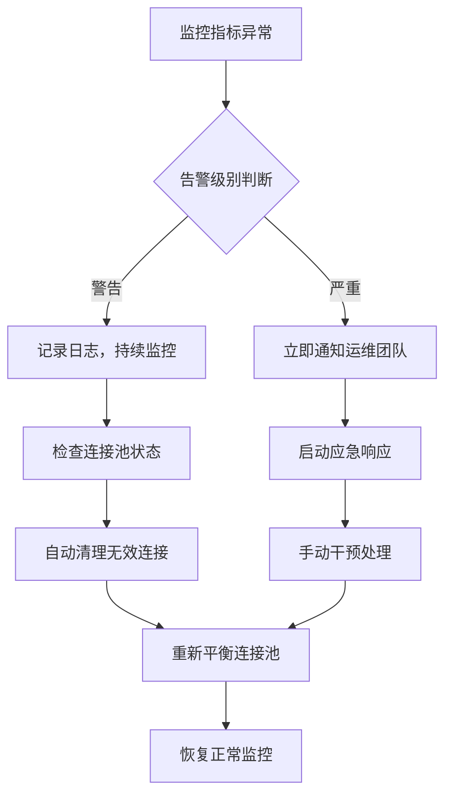

# 告警阈值设置

<cite>
**本文档引用的文件**
- [热连接池性能测试报告.md](file://test/reports/热连接池性能测试报告.md)
- [health_checker.go](file://utlsclient/health_checker.go)
- [utlshotconnpool.go](file://utlsclient/utlshotconnpool.go)
- [connection_manager.go](file://utlsclient/connection_manager.go)
- [config.go](file://config/config.go)
- [config.toml](file://config/config.toml)
- [ip_pool_full_stats.txt](file://test/results/ip_pool_full_stats.txt)
- [example_basic_usage.go](file://examples/utlsclient/example_basic_usage.go)
- [example_hotconnpool_usage.go](file://examples/utlsclient/example_hotconnpool_usage.go)
</cite>

## 目录
1. [概述](#概述)
2. [性能测试数据分析](#性能测试数据分析)
3. [监控指标体系](#监控指标体系)
4. [告警阈值设置原则](#告警阈值设置原则)
5. [动态阈值调整策略](#动态阈值调整策略)
6. [具体阈值配置建议](#具体阈值配置建议)
7. [监控告警实现](#监控告警实现)
8. [故障处理流程](#故障处理流程)
9. [最佳实践指南](#最佳实践指南)

## 概述

基于热连接池性能测试报告的数据表现，本文档旨在指导用户设置合理的监控告警阈值，确保在连接质量下降初期就能及时发现并处理问题。测试报告显示系统具有优秀的性能特征：98.8%的成功率、100%的连接复用率，以及显著的性能提升效果。

### 核心性能指标
- **成功率**: 98.8%（1611/1631）
- **连接复用率**: 100%
- **预热速度**: 1611连接/21.5秒（约75连接/秒）
- **响应时间**: 200-800ms（正常范围）

## 性能测试数据分析

### 测试环境与规模
- **IP池规模**: 1631个IP地址（840 IPv4 + 791 IPv6）
- **测试URL**: 4个不同的API端点
- **执行方式**: 轮询模式，先所有IP访问URL1 → 归还连接 → 再所有IP访问URL2 → ...

### 关键性能表现
根据测试报告，系统在以下方面表现出色：

1. **高可用性**: 98.8%的成功率表明系统具有良好的容错能力
2. **高效连接复用**: 100%的连接复用率意味着没有连接浪费
3. **快速预热**: 21.5秒完成1631个连接的预热，平均每个连接13.3ms
4. **稳定性能**: 热连接阶段平均响应时间约4ms/请求

**章节来源**
- [热连接池性能测试报告.md](file://test/reports/热连接池性能测试报告.md#L70-L170)

## 监控指标体系

### 核心监控指标



### 关键统计结构

系统提供了完整的监控统计数据结构：

| 指标类别 | 具体指标 | 描述 | 监控价值 |
|----------|----------|------|----------|
| **连接状态** | TotalConnections | 总连接数 | 监控连接池规模 |
| | ActiveConnections | 活跃连接数 | 监控并发使用情况 |
| | IdleConnections | 空闲连接数 | 监控资源利用率 |
| | HealthyConnections | 健康连接数 | 监控连接质量 |
| **性能指标** | SuccessRate | 成功率 | 监控整体服务质量 |
| | AvgResponseTime | 平均响应时间 | 监控性能表现 |
| | ConnReuseRate | 连接复用率 | 监控资源利用效率 |
| **健康度指标** | FailedRequests | 失败请求数 | 监控稳定性 |
| | ErrorCount | 错误次数 | 监控异常情况 |

**章节来源**
- [utlshotconnpool.go](file://utlsclient/utlshotconnpool.go#L261-L277)

## 告警阈值设置原则

### 基础阈值设定原则

1. **保守性原则**: 告警阈值应设置在系统正常运行的边缘
2. **分层告警**: 设置多个级别的告警阈值
3. **动态调整**: 根据业务负载动态调整阈值
4. **及时响应**: 告警触发后应有相应的处理流程

### 阈值计算公式

基于测试数据，推荐以下阈值计算方法：



## 动态阈值调整策略

### 负载感知阈值调整



### 动态调整算法

基于系统负载和历史数据，实施以下动态调整策略：

1. **低负载期（<50%利用率）**:
   - 健康连接数阈值：总连接数的60%
   - 成功率阈值：90%
   - 错误率阈值：10%

2. **正常负载期（50%-80%利用率）**:
   - 健康连接数阈值：总连接数的70%
   - 成功率阈值：95%
   - 错误率阈值：5%

3. **高负载期（>80%利用率）**:
   - 健康连接数阈值：总连接数的80%
   - 成功率阈值：98%
   - 错误率阈值：2%

**章节来源**
- [health_checker.go](file://utlsclient/health_checker.go#L24-L60)

## 具体阈值配置建议

### 基础配置模板

基于测试报告的最佳实践，推荐以下配置：

| 配置项 | 默认值 | 告警阈值 | 严重告警阈值 |
|--------|--------|----------|--------------|
| **健康连接数** | 总连接数×80% | 总连接数×60% | 总连接数×40% |
| **成功率** | 98.8% | 95% | 90% |
| **错误率** | 1.2% | 5% | 10% |
| **连接复用率** | 100% | 95% | 90% |
| **平均响应时间** | 4ms | 100ms | 500ms |
| **健康检查间隔** | 30秒 | 15秒 | 5秒 |

### 配置示例

```toml
# 告警阈值配置
[alerts]
# 健康连接数告警
healthy_connections_min = 80  # 最小健康连接百分比
healthy_connections_warn = 60  # 健康连接数警告阈值
healthy_connections_critical = 40  # 健康连接数严重告警阈值

# 成功率告警
success_rate_min = 95.0  # 最小成功率
success_rate_warn = 90.0  # 成功率警告阈值
success_rate_critical = 85.0  # 成功率严重告警阈值

# 错误率告警
error_rate_max = 5.0  # 最大错误率
error_rate_warn = 10.0  # 错误率警告阈值
error_rate_critical = 15.0  # 错误率严重告警阈值

# 响应时间告警
response_time_avg = 100  # 平均响应时间阈值（毫秒）
response_time_p95 = 500  # 95%分位响应时间阈值（毫秒）
```

**章节来源**
- [config.toml](file://config/config.toml#L1-L38)

## 监控告警实现

### 健康检查机制

系统提供了完善的健康检查机制，支持多种监控维度：



**图表来源**
- [health_checker.go](file://utlsclient/health_checker.go#L9-L21)
- [utlshotconnpool.go](file://utlsclient/utlshotconnpool.go#L236-L258)

### 告警触发逻辑

基于健康检查器的实现，告警触发遵循以下逻辑：

1. **连接健康状态检查**:
   - 连接错误次数超过10次标记为不健康
   - 连接空闲时间超过健康检查间隔进行验证
   - 执行健康检查失败标记为不健康

2. **批量健康检查**:
   - 定期检查所有连接的健康状态
   - 自动清理不健康的连接
   - 更新连接池统计信息

**章节来源**
- [health_checker.go](file://utlsclient/health_checker.go#L24-L165)

## 故障处理流程

### 告警响应流程



### 故障恢复策略

1. **自动恢复**:
   - 清理不健康的连接
   - 重新建立连接
   - 更新连接池统计

2. **人工干预**:
   - 检查网络连接
   - 验证目标服务状态
   - 调整连接池配置

3. **预防措施**:
   - 定期健康检查
   - 连接池扩容
   - 负载均衡优化

**章节来源**
- [health_checker.go](file://utlsclient/health_checker.go#L155-L165)

## 最佳实践指南

### 监控配置建议

1. **分层监控策略**:
   - 应用层：关注业务指标和用户体验
   - 服务层：监控API响应时间和成功率
   - 基础设施层：监控系统资源和网络状况

2. **告警聚合规则**:
   - 相同类型的告警在短时间内不重复触发
   - 不同级别的告警采用不同的通知渠道
   - 告警升级机制确保重要问题得到及时处理

3. **监控数据保留**:
   - 实时监控数据保留30天
   - 历史统计数据保留1年
   - 告警记录永久保存用于分析

### 性能优化建议

基于测试报告的性能表现，建议：

1. **连接池优化**:
   - 根据实际负载调整最大连接数
   - 优化健康检查间隔
   - 合理设置连接超时时间

2. **负载均衡**:
   - 实施多地域部署
   - 动态路由到健康节点
   - 自动故障转移机制

3. **容量规划**:
   - 基于历史数据预测峰值负载
   - 实施弹性扩缩容策略
   - 定期评估和调整资源配置

**章节来源**
- [example_basic_usage.go](file://examples/utlsclient/example_basic_usage.go#L66-L82)
- [example_hotconnpool_usage.go](file://examples/utlsclient/example_hotconnpool_usage.go#L120-L128)

### 配置文件示例

以下是推荐的告警配置文件结构：

```toml
# 连接池监控配置
[monitoring]
# 健康检查配置
health_check_interval = 30  # 健康检查间隔（秒）
max_error_count = 10        # 最大错误次数
cleanup_interval = 60       # 清理间隔（秒）

# 告警配置
[alerts]
# 连接池告警
pool_size_threshold = 0.8   # 连接池使用率阈值
min_connections_threshold = 10  # 最小连接数阈值

# 性能告警
response_time_threshold = 500  # 响应时间阈值（毫秒）
error_rate_threshold = 5.0     # 错误率阈值（%）

# 健康度告警
unhealthy_connections_threshold = 0.2  # 不健康连接比例阈值
success_rate_threshold = 95.0          # 成功率阈值（%）
```

通过合理设置这些告警阈值，可以确保在连接质量下降初期就及时发现问题，避免影响业务正常运行。建议根据实际业务场景和负载特点，结合本文档的指导原则，制定适合自身系统的监控告警策略。