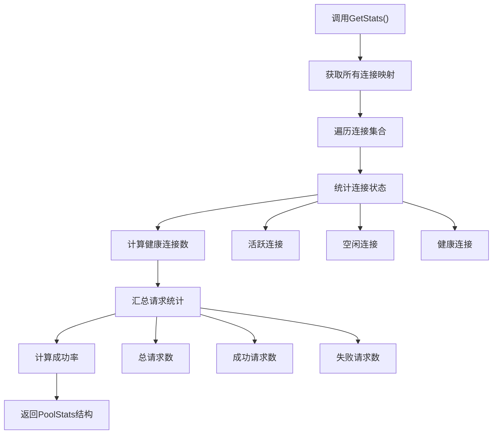
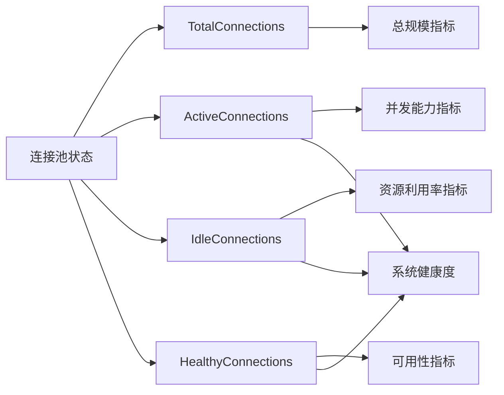
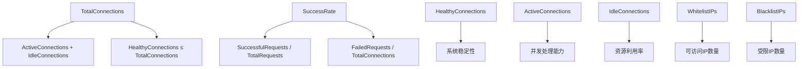
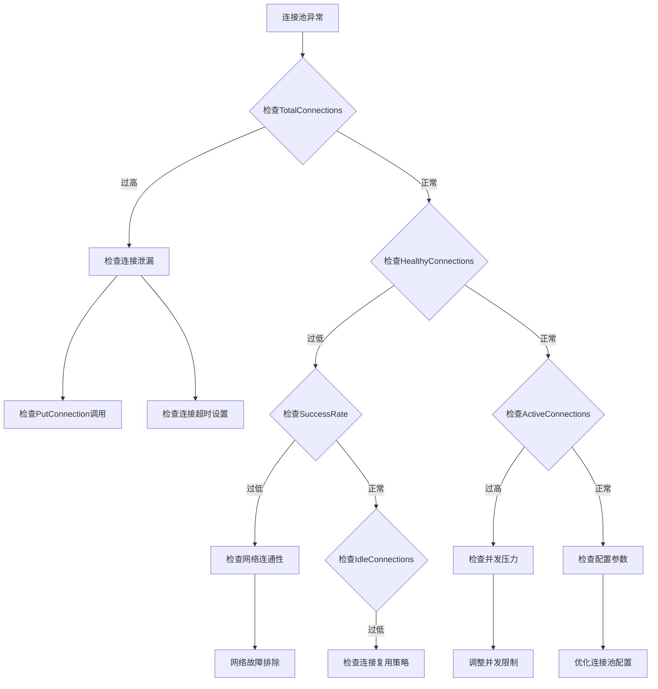

# 监控指标获取

<cite>
**本文档引用的文件**
- [utlshotconnpool.go](file://utlsclient/utlshotconnpool.go)
- [example_basic_usage.go](file://examples/utlsclient/example_basic_usage.go)
- [example_hotconnpool_usage.go](file://examples/utlsclient/example_hotconnpool_usage.go)
- [connection_manager.go](file://utlsclient/connection_manager.go)
- [ip_access_controller.go](file://utlsclient/ip_access_controller.go)
- [constants.go](file://utlsclient/constants.go)
- [health_checker.go](file://utlsclient/health_checker.go)
</cite>

## 目录
1. [概述](#概述)
2. [GetStats方法详解](#getstats方法详解)
3. [核心统计指标](#核心统计指标)
4. [指标含义与影响](#指标含义与影响)
5. [代码示例与实践](#代码示例与实践)
6. [监控数据分析](#监控数据分析)
7. [最佳实践建议](#最佳实践建议)
8. [故障排查指南](#故障排查指南)

## 概述

GetStats方法是热连接池的核心监控功能，提供了全面的连接池运行时统计信息。通过这个方法，开发者可以实时了解连接池的健康状态、性能指标和资源使用情况，为系统优化和故障诊断提供重要依据。

连接池的监控体系包含多个维度的统计指标，涵盖了连接数量、健康状态、性能表现、黑白名单管理等多个方面。这些指标不仅反映了当前的运行状态，还能帮助预测潜在的问题和瓶颈。

## GetStats方法详解

GetStats方法位于UTLSHotConnPool结构体中，通过HotConnPool接口暴露给外部使用。该方法会扫描整个连接池中的所有连接，收集并计算各种统计信息。



**图表来源**
- [utlshotconnpool.go](file://utlsclient/utlshotconnpool.go#L1122-L1173)

### 方法签名与返回值

GetStats方法的完整签名如下：
```go
func (p *UTLSHotConnPool) GetStats() PoolStats
```

该方法返回一个PoolStats结构体，包含了连接池的完整统计信息。调用时会进行全量扫描，确保统计数据的准确性。

**章节来源**
- [utlshotconnpool.go](file://utlsclient/utlshotconnpool.go#L41-L41)
- [utlshotconnpool.go](file://utlsclient/utlshotconnpool.go#L1122-L1173)

## 核心统计指标

PoolStats结构体包含了连接池运行时的关键统计指标，每个指标都有特定的含义和用途。

### 基础连接指标

| 指标名称 | 类型 | 描述 | 计算方式 |
|---------|------|------|----------|
| TotalConnections | int | 总连接数 | 扫描所有连接映射得到的数量 |
| ActiveConnections | int | 活跃连接数 | 正在使用的连接数量 |
| IdleConnections | int | 空闲连接数 | 可供复用的空闲连接数量 |
| HealthyConnections | int | 健康连接数 | 通过健康检查的连接数量 |

### 性能与质量指标

| 指标名称 | 类型 | 描述 | 计算方式 |
|---------|------|------|----------|
| TotalRequests | int64 | 总请求数 | 所有连接请求计数之和 |
| SuccessfulRequests | int64 | 成功请求数 | 总请求数减去失败请求数 |
| FailedRequests | int64 | 失败请求数 | 所有连接错误计数之和 |
| SuccessRate | float64 | 成功率 | 成功请求数 / 总请求数 |
| AvgResponseTime | time.Duration | 平均响应时间 | 需要额外计算 |
| ConnReuseRate | float64 | 连接复用率 | 复用次数 / 总请求数 |

### 网络与访问控制指标

| 指标名称 | 类型 | 描述 | 计算方式 |
|---------|------|------|----------|
| WhitelistIPs | int | 白名单IP数 | IP访问控制器统计 |
| BlacklistIPs | int | 黑名单IP数 | IP访问控制器统计 |
| WhitelistMoves | int64 | 黑名单移到白名单数量 | 统计移动次数 |
| NewConnectionsFromDNS | int64 | DNS更新新增连接数 | DNS更新统计 |

**章节来源**
- [utlshotconnpool.go](file://utlsclient/utlshotconnpool.go#L260-L276)

## 指标含义与影响

### TotalConnections（总连接数）

**含义**：表示连接池中当前存在的所有连接数量，包括活跃、空闲和不健康的连接。

**系统影响**：
- 直接反映连接池的规模
- 影响内存使用量和系统资源消耗
- 超过配置的最大连接数可能导致新连接创建失败
- 过高的连接数可能增加健康检查的开销

### ActiveConnections（活跃连接数）

**含义**：正在被应用程序使用的连接数量。

**系统影响**：
- 表示当前的并发处理能力
- 影响系统的响应时间和吞吐量
- 过高的活跃连接数可能导致资源竞争
- 需要与IdleConnections配合监控

### IdleConnections（空闲连接数）

**含义**：可用于复用的空闲连接数量。

**系统影响**：
- 影响连接复用效率
- 过多的空闲连接浪费系统资源
- 过少的空闲连接可能导致频繁的连接重建
- 需要与IdleTimeout配置配合使用

### HealthyConnections（健康连接数）

**含义**：通过健康检查且被认为可用的连接数量。

**系统影响**：
- 直接反映可用连接资源
- 影响系统的稳定性和可靠性
- 是IsHealthy方法的重要判断依据
- 低于某个阈值时系统可能进入降级状态



**图表来源**
- [utlshotconnpool.go](file://utlsclient/utlshotconnpool.go#L1122-L1173)

**章节来源**
- [utlshotconnpool.go](file://utlsclient/utlshotconnpool.go#L1122-L1173)

## 代码示例与实践

### 基础监控示例

以下展示了如何定期调用GetStats并记录监控数据的基本模式：

```go
// 定期监控连接池状态
func monitorConnectionPool(pool HotConnPool) {
    ticker := time.NewTicker(30 * time.Second)
    defer ticker.Stop()
    
    for {
        select {
        case <-ticker.C:
            stats := pool.GetStats()
            logStats(stats)
            
            // 根据指标采取相应措施
            if stats.HealthyConnections < stats.TotalConnections * 0.3 {
                log.Warn("健康连接数过低，考虑扩容")
            }
            
            if stats.SuccessRate < 0.8 {
                log.Warn("成功率过低，检查网络状况")
            }
        }
    }
}

func logStats(stats PoolStats) {
    fmt.Printf("连接池统计:\n")
    fmt.Printf("  总连接数: %d\n", stats.TotalConnections)
    fmt.Printf("  活跃连接数: %d\n", stats.ActiveConnections)
    fmt.Printf("  空闲连接数: %d\n", stats.IdleConnections)
    fmt.Printf("  健康连接数: %d\n", stats.HealthyConnections)
    fmt.Printf("  成功率: %.2f%%\n", stats.SuccessRate*100)
    fmt.Printf("  白名单IP数: %d\n", stats.WhitelistIPs)
    fmt.Printf("  黑名单IP数: %d\n", stats.BlacklistIPs)
}
```

### 高级监控与告警

```go
// 带告警机制的监控系统
type ConnectionPoolMonitor struct {
    pool HotConnPool
    thresholds map[string]float64
    alerts chan Alert
}

func (m *ConnectionPoolMonitor) Start() {
    go func() {
        ticker := time.NewTicker(10 * time.Second)
        defer ticker.Stop()
        
        for {
            <-ticker.C
            stats := m.pool.GetStats()
            m.checkThresholds(stats)
        }
    }()
}

func (m *ConnectionPoolMonitor) checkThresholds(stats PoolStats) {
    checks := map[string]func(float64) bool{
        "low_health": func(r float64) bool { return r < 0.5 },
        "high_failure": func(r float64) bool { return r > 0.2 },
        "low_idle": func(r float64) bool { return float64(stats.IdleConnections) < 5 },
    }
    
    for name, check := range checks {
        if check(stats.HealthyConnections/float64(stats.TotalConnections)) {
            m.alerts <- Alert{
                Type:    name,
                Message: fmt.Sprintf("连接池指标异常: %s", name),
                Details: stats,
            }
        }
    }
}
```

### 实时性能分析

```go
// 实时性能分析工具
func analyzeConnectionPerformance(pool HotConnPool) {
    prevStats := pool.GetStats()
    time.Sleep(1 * time.Second)
    
    currStats := pool.GetStats()
    
    // 计算每秒指标
    duration := time.Second
    requestsPerSec := float64(currStats.TotalRequests-prevStats.TotalRequests) / duration.Seconds()
    failuresPerSec := float64(currStats.FailedRequests-prevStats.FailedRequests) / duration.Seconds()
    
    fmt.Printf("性能指标:\n")
    fmt.Printf("  每秒请求数: %.2f\n", requestsPerSec)
    fmt.Printf("  每秒失败数: %.2f\n", failuresPerSec)
    fmt.Printf("  连接复用率: %.2f%%\n", 
               float64(currStats.TotalRequests)/float64(currStats.TotalRequests+currStats.IdleConnections)*100)
}
```

**章节来源**
- [example_basic_usage.go](file://examples/utlsclient/example_basic_usage.go#L31-L72)
- [example_hotconnpool_usage.go](file://examples/utlsclient/example_hotconnpool_usage.go#L118-L121)

## 监控数据分析

### 关键指标关系分析

连接池的各个指标之间存在密切的关系，理解这些关系有助于更好地分析系统状态：



**图表来源**
- [utlshotconnpool.go](file://utlsclient/utlshotconnpool.go#L1122-L1173)

### 性能基准参考

基于实际测试数据，以下是典型的性能基准：

| 指标类型 | 正常范围 | 警告范围 | 危险范围 |
|---------|---------|---------|---------|
| 成功率 | > 95% | 80-95% | < 80% |
| 健康连接比例 | > 80% | 50-80% | < 50% |
| 连接复用率 | > 70% | 40-70% | < 40% |
| 平均响应时间 | < 500ms | 500ms-2s | > 2s |

### 故障模式识别

通过监控指标可以识别常见的故障模式：

1. **连接泄漏**：TotalConnections持续增长，ActiveConnections过高
2. **健康连接不足**：HealthyConnections突然下降
3. **成功率骤降**：SuccessRate快速降低
4. **资源耗尽**：IdleConnections接近零，新建连接失败

**章节来源**
- [health_checker.go](file://utlsclient/health_checker.go#L114-L164)

## 最佳实践建议

### 监控频率优化

根据不同的应用场景，建议采用不同的监控频率：

```go
// 高频监控（生产环境）
const (
    HIGH_FREQ_MONITORING = 5 * time.Second   // 5秒
    NORMAL_FREQ_MONITORING = 30 * time.Second // 30秒
    LOW_FREQ_MONITORING = 5 * time.Minute     // 5分钟
)

// 动态调整监控频率
func adaptiveMonitoring(pool HotConnPool) {
    stats := pool.GetStats()
    
    switch {
    case stats.SuccessRate < 0.7:
        // 高风险场景，高频监控
        return HIGH_FREQ_MONITORING
    case stats.HealthyConnections < stats.TotalConnections * 0.5:
        // 中等风险，正常频率
        return NORMAL_FREQ_MONITORING
    default:
        // 低风险，低频监控
        return LOW_FREQ_MONITORING
    }
}
```

### 数据存储与可视化

```go
// 结构化监控数据存储
type MonitorData struct {
    Timestamp    time.Time
    PoolStats    PoolStats
    Metrics      map[string]float64
    HealthStatus string
}

// 数据聚合与分析
func aggregateMetrics(data []MonitorData) map[string]interface{} {
    if len(data) == 0 {
        return nil
    }
    
    var totalRequests int64
    var totalSuccess int64
    var totalFailed int64
    
    for _, d := range data {
        totalRequests += d.PoolStats.TotalRequests
        totalSuccess += d.PoolStats.SuccessfulRequests
        totalFailed += d.PoolStats.FailedRequests
    }
    
    return map[string]interface{}{
        "avg_success_rate": float64(totalSuccess) / float64(totalRequests),
        "total_requests":   totalRequests,
        "total_failed":     totalFailed,
        "avg_connections":  float64(totalRequests) / float64(len(data)),
    }
}
```

### 告警策略设计

```go
// 多层次告警策略
type AlertStrategy struct {
    Thresholds map[string]AlertLevel
    Actions    map[AlertLevel]func(PoolStats)
}

type AlertLevel int

const (
    INFO AlertLevel = iota
    WARNING
    CRITICAL
)

func (as *AlertStrategy) Evaluate(stats PoolStats) AlertLevel {
    metrics := map[string]float64{
        "success_rate":    stats.SuccessRate,
        "healthy_percent": float64(stats.HealthyConnections) / float64(stats.TotalConnections),
        "active_percent":  float64(stats.ActiveConnections) / float64(stats.TotalConnections),
    }
    
    highestLevel := INFO
    
    for metric, value := range metrics {
        if level, exists := as.Thresholds[metric]; exists {
            if value < level.Threshold {
                if level > highestLevel {
                    highestLevel = level
                }
            }
        }
    }
    
    return highestLevel
}
```

## 故障排查指南

### 常见问题诊断

当连接池出现问题时，可以通过以下步骤进行诊断：



### 诊断工具函数

```go
// 连接池健康检查工具
func diagnoseConnectionPool(pool HotConnPool) map[string]interface{} {
    stats := pool.GetStats()
    
    diagnosis := make(map[string]interface{})
    
    // 基础健康度评估
    healthyRatio := float64(stats.HealthyConnections) / float64(stats.TotalConnections)
    diagnosis["overall_health"] = healthyRatio
    
    // 连接使用效率
    utilization := float64(stats.ActiveConnections) / float64(stats.TotalConnections)
    diagnosis["connection_utilization"] = utilization
    
    // 成功率分析
    diagnosis["success_rate"] = stats.SuccessRate
    
    // 异常检测
    anomalies := make([]string, 0)
    
    if healthyRatio < 0.6 {
        anomalies = append(anomalies, "健康连接比例过低")
    }
    
    if stats.SuccessRate < 0.8 {
        anomalies = append(anomalies, "成功率过低")
    }
    
    if utilization > 0.9 {
        anomalies = append(anomalies, "连接使用率过高")
    }
    
    diagnosis["anomalies"] = anomalies
    
    return diagnosis
}

// 性能瓶颈定位
func identifyBottlenecks(pool HotConnPool) []string {
    stats := pool.GetStats()
    bottlenecks := make([]string, 0)
    
    // 检查连接复用效率
    reuseRate := float64(stats.TotalRequests) / float64(stats.TotalRequests+stats.IdleConnections)
    if reuseRate < 0.7 {
        bottlenecks = append(bottlenecks, "连接复用效率低")
    }
    
    // 检查健康连接分布
    healthyRatio := float64(stats.HealthyConnections) / float64(stats.TotalConnections)
    if healthyRatio < 0.8 {
        bottlenecks = append(bottlenecks, "健康连接分布不均")
    }
    
    // 检查并发能力
    if float64(stats.ActiveConnections) > float64(stats.TotalConnections)*0.9 {
        bottlenecks = append(bottlenecks, "并发能力接近上限")
    }
    
    return bottlenecks
}
```

### 应急处理预案

```go
// 应急处理预案
type EmergencyHandler struct {
    pool HotConnPool
    config *EmergencyConfig
}

type EmergencyConfig struct {
    MaxHealthyThreshold float64
    MinSuccessRate      float64
    AutoRecoveryEnabled bool
}

func (eh *EmergencyHandler) HandleEmergency() {
    stats := eh.pool.GetStats()
    
    // 紧急情况判断
    emergency := false
    
    if float64(stats.HealthyConnections)/float64(stats.TotalConnections) < eh.config.MaxHealthyThreshold {
        emergency = true
    }
    
    if stats.SuccessRate < eh.config.MinSuccessRate {
        emergency = true
    }
    
    if emergency {
        eh.triggerEmergencyResponse()
    }
}

func (eh *EmergencyHandler) triggerEmergencyResponse() {
    // 1. 禁用新连接创建
    // 2. 清理不健康连接
    // 3. 启动快速恢复流程
    // 4. 触发告警通知
    
    eh.pool.GetStats() // 触发清理
}
```

**章节来源**
- [constants.go](file://utlsclient/constants.go#L43-L44)
- [health_checker.go](file://utlsclient/health_checker.go#L114-L164)

## 总结

GetStats方法是热连接池监控体系的核心组件，通过提供全面的统计信息，帮助开发者深入了解连接池的运行状态。合理利用这些指标，可以实现有效的性能监控、故障预警和系统优化。

关键要点：
1. **全面监控**：关注所有核心指标，特别是HealthyConnections和SuccessRate
2. **及时响应**：建立合理的监控频率和告警机制
3. **数据分析**：结合历史数据进行趋势分析和容量规划
4. **预防为主**：通过监控提前发现问题，避免系统故障

通过持续的监控和优化，可以确保连接池在高负载下保持稳定高效的运行状态，为上层应用提供可靠的网络连接服务。