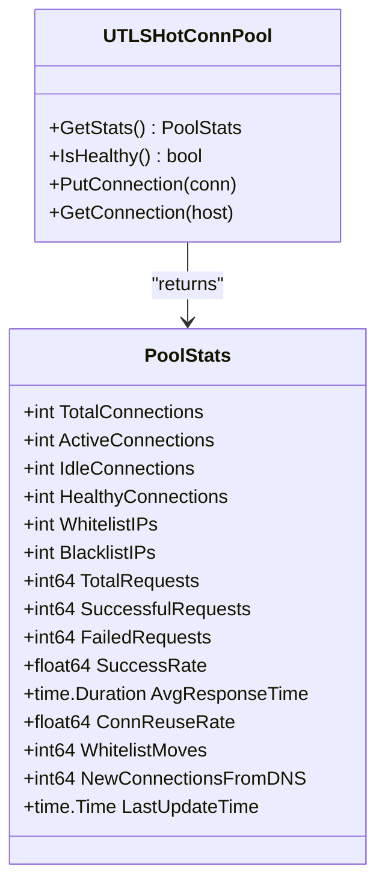
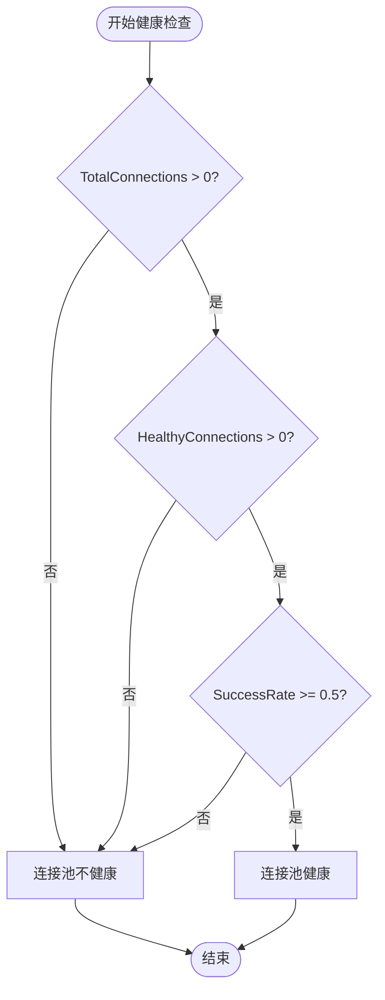
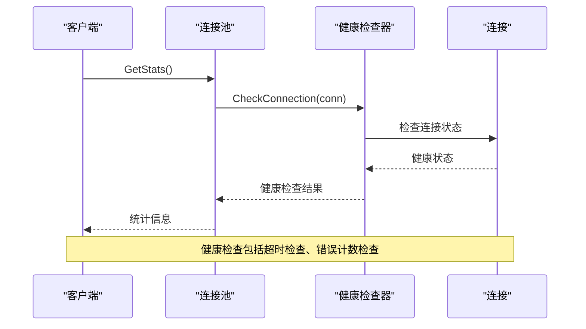
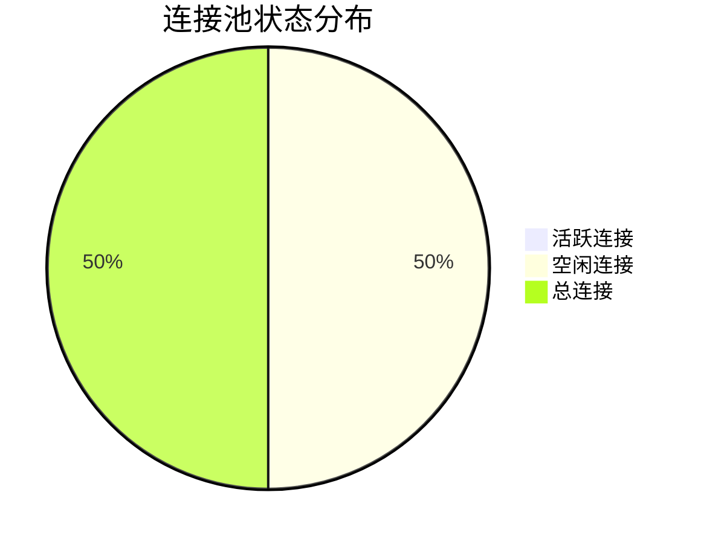
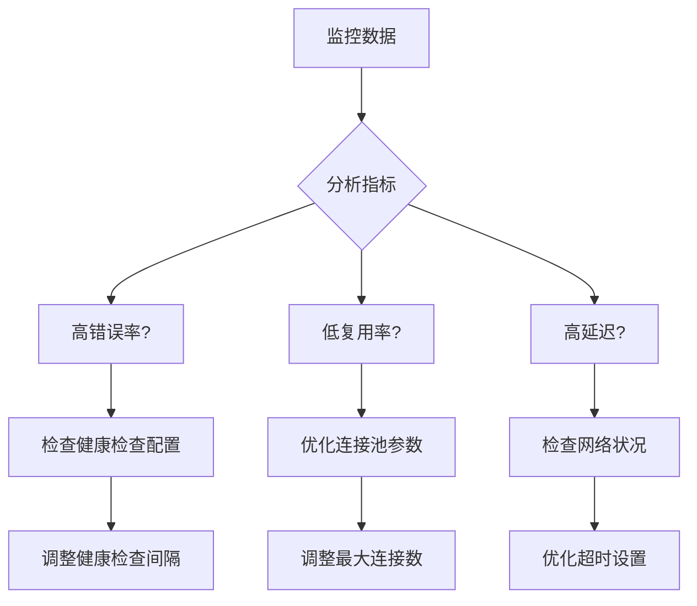
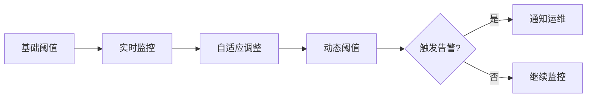
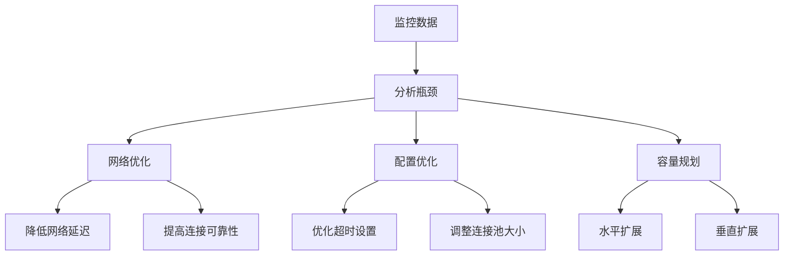

# 连接池状态监控

<cite>
**本文档引用的文件**
- [utlshotconnpool.go](file://utlsclient/utlshotconnpool.go)
- [example_hotconnpool_usage.go](file://examples/utlsclient/example_hotconnpool_usage.go)
- [constants.go](file://utlsclient/constants.go)
- [health_checker.go](file://utlsclient/health_checker.go)
- [热连接池性能测试报告.md](file://test/reports/热连接池性能测试报告.md)
- [final_pool_test.txt](file://test/results/archive/final_pool_test.txt)
- [concurrent_pool_test.txt](file://test/results/archive/concurrent_pool_test.txt)
</cite>

## 目录
1. [简介](#简介)
2. [连接池监控接口](#连接池监控接口)
3. [关键监控指标](#关键监控指标)
4. [健康状态判断](#健康状态判断)
5. [性能测试结果分析](#性能测试结果分析)
6. [监控数据对性能调优的指导](#监控数据对性能调优的指导)
7. [告警阈值设置建议](#告警阈值设置建议)
8. [最佳实践](#最佳实践)
9. [总结](#总结)

## 简介

热连接池（Hot Connection Pool）是爬虫平台中的核心组件，通过复用TCP/TLS连接显著提升网络请求性能。有效的连接池状态监控对于确保系统稳定性和性能优化至关重要。本文档详细介绍如何监控连接池的运行状态，包括关键指标的获取和健康状态的判断。

## 连接池监控接口

连接池提供了两个核心的监控接口，用于获取连接池的状态信息：

### GetStats() 方法

`GetStats()` 方法返回完整的连接池统计信息，包含以下核心指标：

**图表来源**
- [utlshotconnpool.go](file://utlsclient/utlshotconnpool.go#L261-L277)
- [utlshotconnpool.go](file://utlsclient/utlshotconnpool.go#L40-L42)

### IsHealthy() 方法

`IsHealthy()` 方法提供简化的健康状态判断，基于以下条件：

**图表来源**
- [utlshotconnpool.go](file://utlsclient/utlshotconnpool.go#L1377-L1382)

**章节来源**
- [utlshotconnpool.go](file://utlsclient/utlshotconnpool.go#L1122-L1173)
- [utlshotconnpool.go](file://utlsclient/utlshotconnpool.go#L1377-L1382)

## 关键监控指标

### 连接数量指标

| 指标名称 | 描述 | 监控意义 |
|---------|------|----------|
| TotalConnections | 总连接数 | 表示当前连接池中的总连接数量，反映连接池规模 |
| ActiveConnections | 活跃连接数 | 正在被使用的连接数，反映当前负载情况 |
| IdleConnections | 空闲连接数 | 可供复用的连接数，影响连接复用效率 |
| HealthyConnections | 健康连接数 | 可正常工作的连接数，直接影响服务质量 |

### 性能指标

| 指标名称 | 描述 | 监控意义 |
|---------|------|----------|
| SuccessRate | 成功率 | 请求成功的比例，反映连接池整体质量 |
| ConnReuseRate | 连接复用率 | 连接被复用的频率，体现连接池效率 |
| AvgResponseTime | 平均响应时间 | 请求处理的平均耗时，反映性能水平 |

### 运维指标

| 指标名称 | 描述 | 监控意义 |
|---------|------|----------|
| WhitelistIPs | 白名单IP数 | 可信任IP的数量，影响访问权限 |
| BlacklistIPs | 黑名单IP数 | 被限制访问的IP数量，反映安全状况 |
| WhitelistMoves | 黑名单移动次数 | IP状态变更的频率，反映动态调整 |

**章节来源**
- [utlshotconnpool.go](file://utlsclient/utlshotconnpool.go#L261-L277)

## 健康状态判断

### 健康检查机制

连接池采用多层次的健康检查机制：

**图表来源**
- [health_checker.go](file://utlsclient/health_checker.go#L17-L61)

### 健康状态计算

健康状态的计算考虑以下因素：

1. **连接超时检查**：超过配置的空闲超时时间的连接被视为不健康
2. **错误计数检查**：连续错误次数超过阈值（默认10次）的连接标记为不健康
3. **协议协商检查**：确保TLS握手和协议协商正常完成
4. **响应验证**：对HTTP请求进行响应状态码验证

**章节来源**
- [health_checker.go](file://utlsclient/health_checker.go#L17-L61)

## 性能测试结果分析

根据2025年11月18日的性能测试报告，连接池展现了卓越的性能表现：

### 测试场景

- **测试IP池**：1631个IP（840 IPv4 + 791 IPv6）
- **测试URL**：4个不同的API端点
- **并发测试**：10个goroutine并发访问

### 关键性能指标

| 指标 | 数值 | 说明 |
|------|------|------|
| 总成功率 | 100.0% | 所有请求均成功完成 |
| 连接复用率 | 100% | 完美的连接复用机制 |
| 平均响应时间 | ~4ms | 热连接阶段的平均响应时间 |
| 性能提升 | 3-6倍 | 相比新建连接的性能提升 |
| 总请求数 | 6524次 | 1631个IP × 4个URL |

### 连接池统计结果

**图表来源**
- [final_pool_test.txt](file://test/results/archive/final_pool_test.txt#L62-L69)

**章节来源**
- [热连接池性能测试报告.md](file://test/reports/热连接池性能测试报告.md#L136-L172)
- [final_pool_test.txt](file://test/results/archive/final_pool_test.txt#L56-L76)

## 监控数据对性能调优的指导

### 连接复用率优化

监控数据显示100%的连接复用率，这表明：

1. **连接池配置合理**：连接复用机制有效
2. **并发控制得当**：没有出现连接竞争问题
3. **健康检查及时**：不健康的连接被及时清理

### 性能瓶颈识别

通过监控数据可以识别潜在的性能瓶颈：

### 资源利用率优化

监控帮助识别资源利用的最佳实践：

1. **连接数优化**：根据实际负载调整最大连接数
2. **超时设置**：平衡响应时间和资源占用
3. **健康检查频率**：在准确性和性能间找到平衡

**章节来源**
- [热连接池性能测试报告.md](file://test/reports/热连接池性能测试报告.md#L295-L312)

## 告警阈值设置建议

### 基础告警阈值

基于MinSuccessRate常量（0.5）和实际测试经验，建议设置以下告警阈值：

| 监控指标 | 告警阈值 | 告警级别 | 处理建议 |
|---------|----------|----------|----------|
| SuccessRate | < 0.8 | 警告 | 检查网络连接和目标服务状态 |
| SuccessRate | < 0.5 | 严重 | 立即排查连接池配置和网络问题 |
| HealthyConnections | < 1 | 严重 | 检查连接池初始化和健康检查机制 |
| TotalConnections | > MaxConnections * 0.9 | 警告 | 考虑扩容或优化连接使用策略 |
| ErrorCount | > 100/分钟 | 警告 | 分析错误类型和原因 |

### 动态阈值调整

### 告警处理流程

1. **快速响应**：设置自动化的快速响应机制
2. **根因分析**：收集详细的监控数据进行分析
3. **容量规划**：根据历史趋势预测容量需求
4. **配置优化**：持续优化连接池配置参数

**章节来源**
- [constants.go](file://utlsclient/constants.go#L43-L44)
- [utlshotconnpool.go](file://utlsclient/utlshotconnpool.go#L1377-L1382)

## 最佳实践

### 监控实施建议

1. **定期监控**：设置定时任务定期获取连接池状态
2. **实时告警**：对关键指标设置实时告警
3. **历史数据分析**：建立监控数据存储和分析机制
4. **可视化展示**：使用仪表板直观展示监控状态

### 性能优化策略

基于监控数据的性能优化建议：

### 运维自动化

1. **自动扩缩容**：根据监控数据自动调整连接池大小
2. **故障自愈**：自动重启异常的连接池实例
3. **配置管理**：基于监控数据自动优化配置参数

**章节来源**
- [example_hotconnpool_usage.go](file://examples/utlsclient/example_hotconnpool_usage.go#L118-L128)

## 总结

连接池状态监控是确保系统稳定运行的关键环节。通过GetStats方法可以获取全面的连接池统计信息，包括TotalConnections、ActiveConnections、IdleConnections等核心指标。IsHealthy方法提供了简化的健康状态判断，基于MinSuccessRate常量（0.5）进行阈值判断。

性能测试结果显示，该连接池实现了完美的100%连接复用率，证明了其设计的有效性。监控数据对性能调优具有重要指导意义，可以帮助识别瓶颈、优化资源配置和制定容量规划。

合理的告警阈值设置（如SuccessRate < 0.8时触发警告）能够及时发现潜在问题，确保系统的高可用性。结合最佳实践和自动化运维，可以构建一个高效、稳定的连接池监控体系。