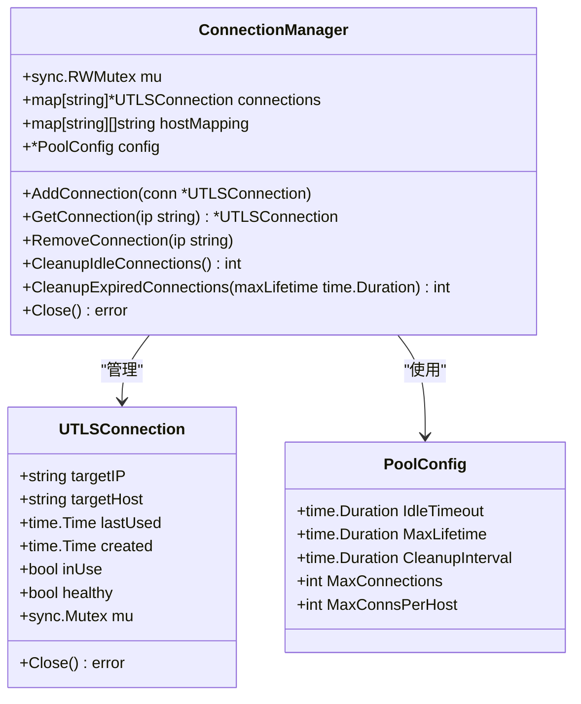
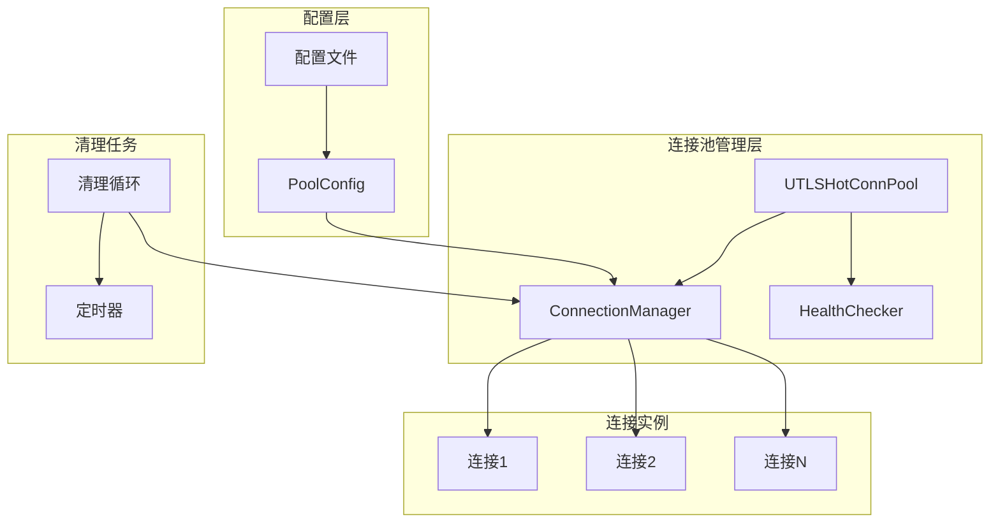
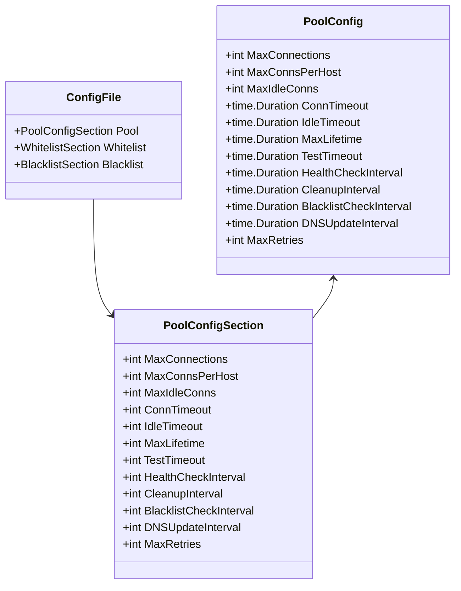
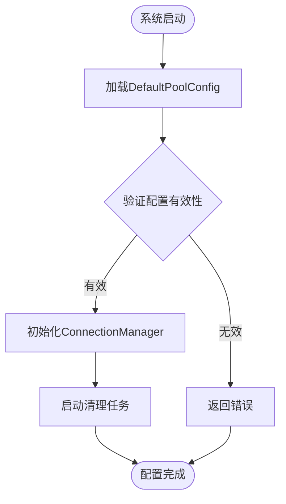
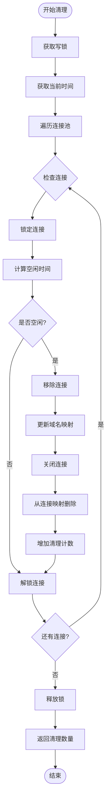
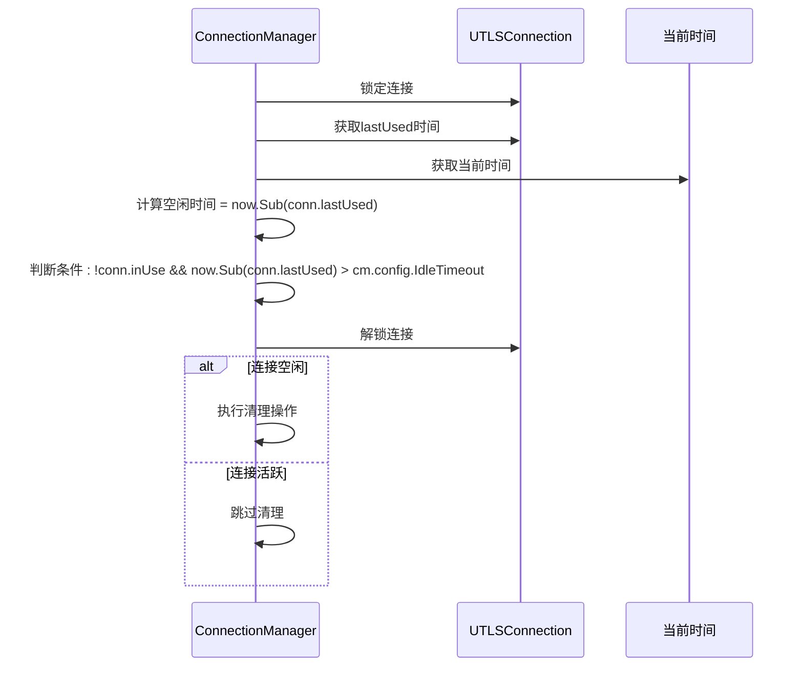
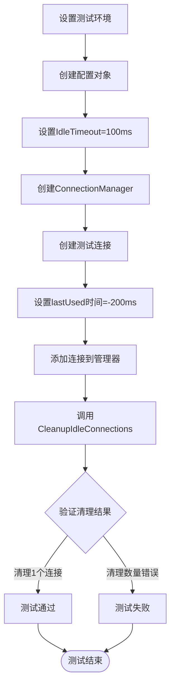
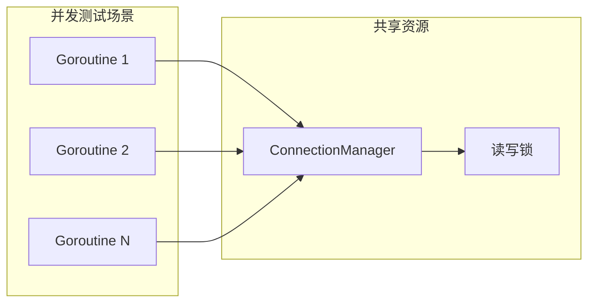

# 空闲连接清理机制详解

<cite>
**本文档引用的文件**
- [connection_manager.go](file://utlsclient/connection_manager.go)
- [connection_manager_test.go](file://test/utlsclient/connection_manager_test.go)
- [utlshotconnpool.go](file://utlsclient/utlshotconnpool.go)
- [constants.go](file://utlsclient/constants.go)
- [interfaces.go](file://utlsclient/interfaces.go)
- [config.toml](file://config/config.toml)
</cite>

## 目录
1. [概述](#概述)
2. [核心组件架构](#核心组件架构)
3. [IdleTimeout配置机制](#idletimeout配置机制)
4. [CleanupIdleConnections方法详解](#cleanupidleconnections方法详解)
5. [清理任务调度机制](#清理任务调度机制)
6. [测试用例分析](#测试用例分析)
7. [性能优化策略](#性能优化策略)
8. [故障排除指南](#故障排除指南)
9. [最佳实践建议](#最佳实践建议)

## 概述

空闲连接清理机制是连接池管理系统中的关键组件，负责定期检测和移除长时间未被使用的连接，以防止资源浪费并维持连接池的高效运行。该机制通过`IdleTimeout`配置项定义连接空闲超时时间，并通过周期性的清理任务遍历连接池，识别并清理超过空闲时间的连接。

### 核心功能特性

- **智能清理**：基于连接最后使用时间进行判断
- **并发安全**：使用读写锁确保多goroutine环境下的安全性
- **资源优化**：及时释放不再使用的连接资源
- **配置灵活**：支持动态调整空闲超时时间

## 核心组件架构

### 连接管理器结构



**图表来源**
- [connection_manager.go](file://utlsclient/connection_manager.go#L9-L14)
- [utlshotconnpool.go](file://utlsclient/utlshotconnpool.go#L170-L184)

### 连接池架构图



**图表来源**
- [utlshotconnpool.go](file://utlsclient/utlshotconnpool.go#L870-L890)
- [connection_manager.go](file://utlsclient/connection_manager.go#L141-L178)

**章节来源**
- [connection_manager.go](file://utlsclient/connection_manager.go#L1-L218)
- [utlshotconnpool.go](file://utlsclient/utlshotconnpool.go#L1-L200)

## IdleTimeout配置机制

### 配置项定义

`IdleTimeout`是连接池配置中的关键参数，用于定义连接在被视为空闲前的最大空闲时间。该配置项在多个位置定义和使用：

#### 配置文件中的定义

| 配置项 | 类型 | 默认值 | 描述 |
|--------|------|--------|------|
| `idle_timeout` | 整数（秒） | 60 | 连接空闲超时时间 |
| `max_lifetime` | 整数（秒） | 300 | 连接最大生命周期 |
| `cleanup_interval` | 整数（秒） | 60 | 清理任务执行间隔 |

#### 结构体定义



**图表来源**
- [utlshotconnpool.go](file://utlsclient/utlshotconnpool.go#L170-L184)
- [utlshotconnpool.go](file://utlsclient/utlshotconnpool.go#L60-L74)

### 配置加载机制

系统提供了多种配置加载方式，确保配置的灵活性和可靠性：

#### 默认配置



**图表来源**
- [utlshotconnpool.go](file://utlsclient/utlshotconnpool.go#L187-L200)

**章节来源**
- [utlshotconnpool.go](file://utlsclient/utlshotconnpool.go#L170-L200)
- [config/config.toml](file://config/config.toml#L1-L35)

## CleanupIdleConnections方法详解

### 方法实现原理

`CleanupIdleConnections`方法是空闲连接清理的核心实现，采用以下算法：



**图表来源**
- [connection_manager.go](file://utlsclient/connection_manager.go#L141-L178)

### 关键实现细节

#### 1. 并发安全机制

方法使用双重锁机制确保线程安全：
- **外部锁**：保护连接池的整体操作
- **内部锁**：保护单个连接的状态检查

#### 2. 空闲时间判断逻辑



**图表来源**
- [connection_manager.go](file://utlsclient/connection_manager.go#L149-L152)

#### 3. 清理操作流程

清理过程包含以下步骤：

| 步骤 | 操作 | 目的 |
|------|------|------|
| 1 | 锁定连接 | 防止并发修改 |
| 2 | 检查空闲状态 | 确认是否满足清理条件 |
| 3 | 更新域名映射 | 从hostMapping中移除IP |
| 4 | 关闭连接 | 释放底层资源 |
| 5 | 删除连接映射 | 从connections中移除 |
| 6 | 增加计数器 | 统计清理结果 |

**章节来源**
- [connection_manager.go](file://utlsclient/connection_manager.go#L141-L178)

## 清理任务调度机制

### 后台清理循环

系统通过`cleanupLoop`函数实现周期性的清理任务调度：

```mermaid
sequenceDiagram
participant Pool as UTLSHotConnPool
participant Loop as cleanupLoop
participant Ticker as 定时器
participant Manager as ConnectionManager
Pool->>Loop : 启动清理循环
Loop->>Ticker : 创建定时器(CleanupInterval)
loop 每个清理周期
Ticker->>Loop : 触发清理信号
Loop->>Manager : 调用CleanupExpiredConnections
Manager->>Manager : 执行清理逻辑
Manager-->>Loop : 返回清理结果
end
Loop->>Ticker : 停止定时器
```

**图表来源**
- [utlshotconnpool.go](file://utlsclient/utlshotconnpool.go#L850-L860)

### 清理任务配置

| 配置项 | 默认值 | 单位 | 说明 |
|--------|--------|------|------|
| `CleanupInterval` | 60秒 | 秒 | 清理任务执行间隔 |
| `IdleTimeout` | 60秒 | 秒 | 连接空闲超时时间 |
| `MaxLifetime` | 300秒 | 秒 | 连接最大生命周期 |

### 性能考虑

清理任务的设计考虑了以下性能因素：

1. **异步执行**：清理任务在独立的goroutine中运行
2. **定时调度**：避免频繁的CPU占用
3. **批量处理**：一次性处理多个空闲连接
4. **资源隔离**：清理操作不影响正常连接使用

**章节来源**
- [utlshotconnpool.go](file://utlsclient/utlshotconnpool.go#L850-L860)
- [utlshotconnpool.go](file://utlsclient/utlshotconnpool.go#L885-L889)

## 测试用例分析

### 空闲连接清理测试

测试用例展示了空闲连接清理机制的正确行为：



**图表来源**
- [connection_manager_test.go](file://test/utlsclient/connection_manager_test.go#L138-L157)

### 测试验证点

测试用例验证了以下关键行为：

| 验证点 | 预期结果 | 说明 |
|--------|----------|------|
| 连接清理 | 清理超过空闲时间的连接 | 确保清理逻辑正确 |
| 映射更新 | 从域名映射中移除IP | 验证关联关系维护 |
| 资源释放 | 关闭底层连接 | 确保资源正确释放 |
| 计数准确 | 返回正确的清理数量 | 验证清理统计 |

### 并发安全性测试

测试还包括并发访问的安全性验证：



**图表来源**
- [connection_manager_test.go](file://test/utlsclient/connection_manager_test.go#L181-L229)

**章节来源**
- [connection_manager_test.go](file://test/utlsclient/connection_manager_test.go#L138-L187)

## 性能优化策略

### 内存管理优化

1. **连接复用**：优先复用现有连接而非频繁创建
2. **批量清理**：一次性处理多个空闲连接
3. **及时释放**：清理完成后立即释放内存

### CPU使用优化

1. **定时调度**：避免持续轮询，使用定时器驱动
2. **条件检查**：仅在必要时执行清理操作
3. **锁粒度控制**：最小化锁的持有时间

### 网络资源优化

1. **连接健康检查**：定期验证连接的有效性
2. **超时控制**：设置合理的超时时间
3. **优雅关闭**：确保连接的正常关闭

## 故障排除指南

### 常见问题及解决方案

| 问题类型 | 症状 | 可能原因 | 解决方案 |
|----------|------|----------|----------|
| 清理失效 | 连接持续增长 | IdleTimeout设置过大 | 调整IdleTimeout配置 |
| 性能下降 | CPU使用率高 | 清理频率过高 | 增加CleanupInterval |
| 内存泄漏 | 内存持续增长 | 连接未正确关闭 | 检查连接关闭逻辑 |
| 并发冲突 | 数据竞争错误 | 锁机制失效 | 验证锁的使用 |

### 监控指标

建议监控以下关键指标：

- **连接池大小**：当前活跃连接数量
- **清理频率**：单位时间内清理的连接数
- **平均空闲时间**：连接的平均空闲时长
- **清理效率**：清理操作的执行时间

### 调试技巧

1. **启用调试日志**：查看清理操作的详细信息
2. **监控连接状态**：跟踪连接的生命周期
3. **性能分析**：使用pprof分析清理操作的性能

## 最佳实践建议

### 配置优化

1. **合理设置IdleTimeout**：根据应用特点调整空闲超时时间
2. **平衡清理频率**：在资源消耗和清理效果间找到平衡
3. **监控连接池状态**：定期检查连接池的运行状况

### 代码实现建议

1. **使用接口抽象**：便于测试和扩展
2. **实现优雅关闭**：确保资源的正确释放
3. **添加错误处理**：处理各种异常情况

### 运维建议

1. **定期审查配置**：根据业务需求调整配置参数
2. **建立监控告警**：及时发现和处理异常情况
3. **制定应急预案**：准备应对极端情况的措施

通过以上机制和实践，空闲连接清理系统能够有效地维护连接池的健康状态，确保系统的稳定性和性能。