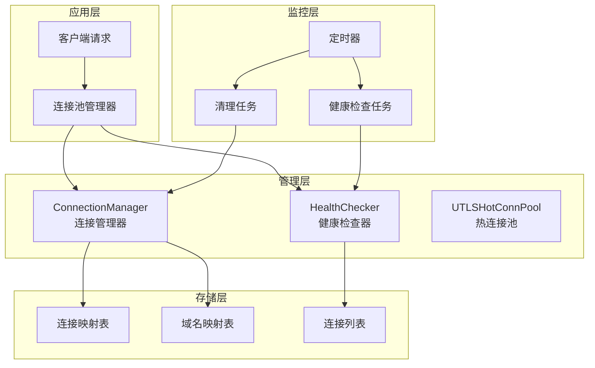
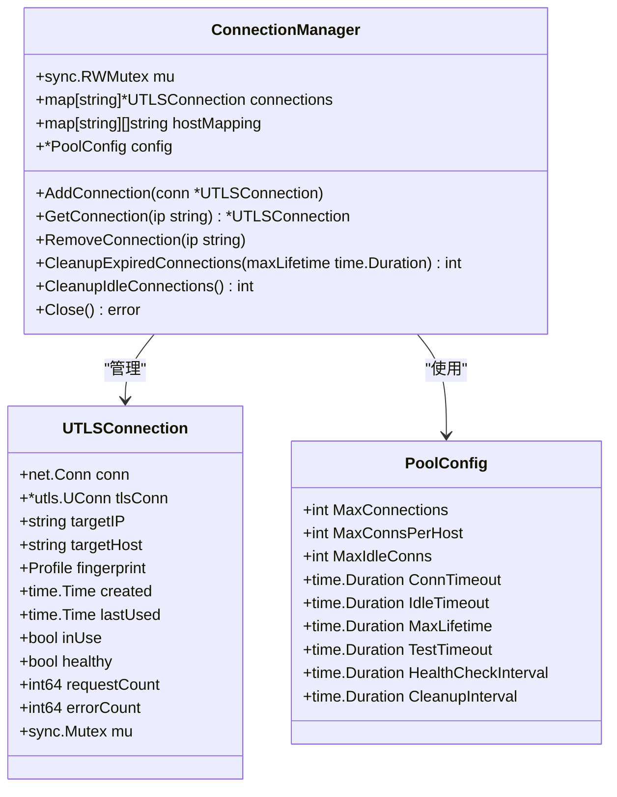
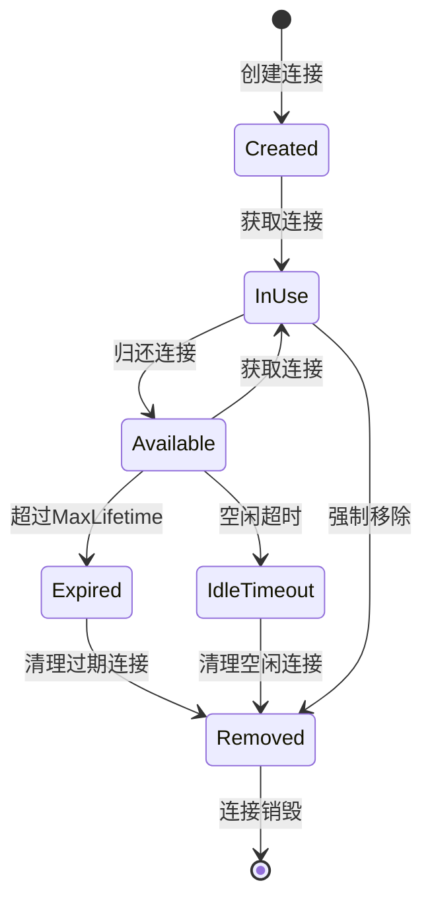
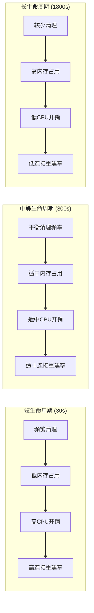
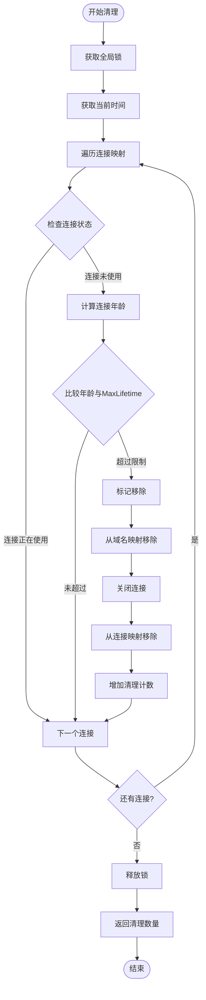
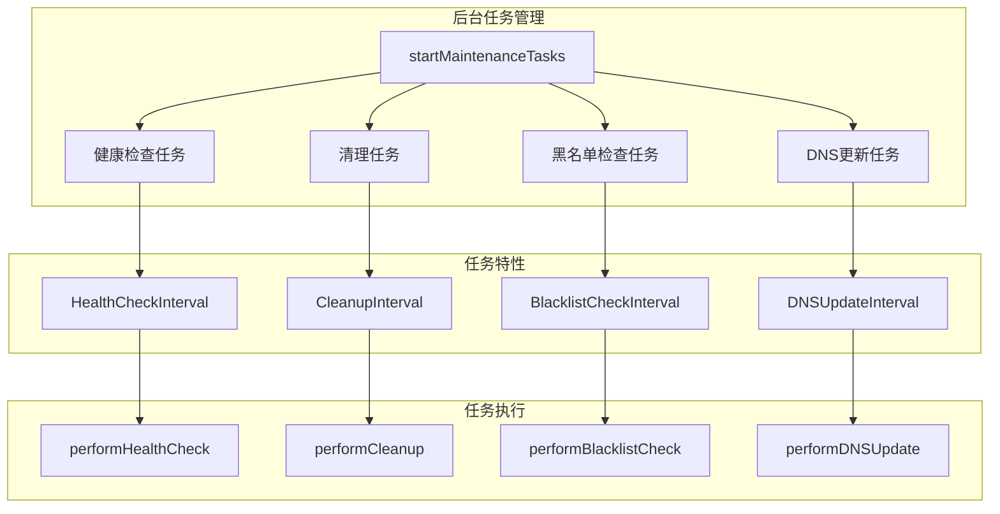
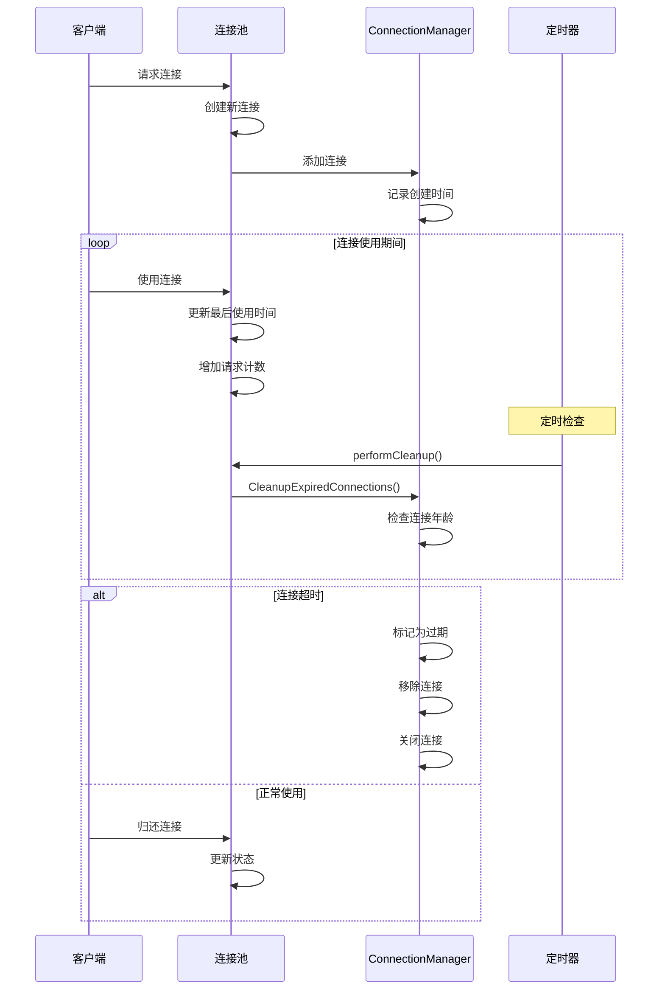
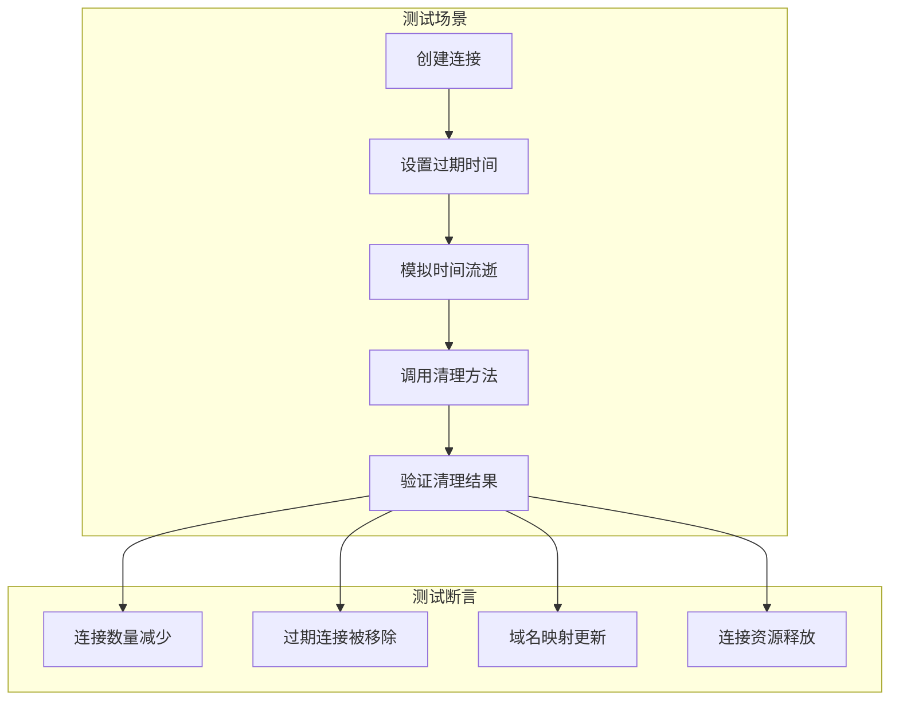
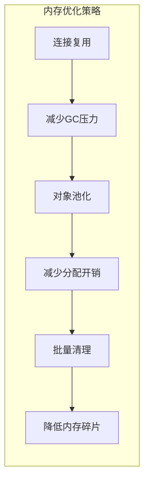

# 过期连接清理机制深度解析

<cite>
**本文档引用的文件**
- [connection_manager.go](file://utlsclient/connection_manager.go)
- [connection_manager_test.go](file://test/utlsclient/connection_manager_test.go)
- [utlshotconnpool.go](file://utlsclient/utlshotconnpool.go)
- [constants.go](file://utlsclient/constants.go)
- [config.toml](file://config/config.toml)
- [constants_test.go](file://test/utlsclient/constants_test.go)
</cite>

## 目录
1. [引言](#引言)
2. [系统架构概览](#系统架构概览)
3. [核心组件分析](#核心组件分析)
4. [MaxLifetime配置机制](#maxlifetime配置机制)
5. [CleanupExpiredConnections方法详解](#cleanupexpiredconnections方法详解)
6. [清理任务调度机制](#清理任务调度机制)
7. [连接生命周期管理](#连接生命周期管理)
8. [测试用例分析](#测试用例分析)
9. [性能优化策略](#性能优化策略)
10. [故障排除指南](#故障排除指南)
11. [总结](#总结)

## 引言

在高并发网络应用中，连接池管理是确保系统稳定性和性能的关键组件。过期连接清理机制作为连接池的重要组成部分，负责定期检测并移除超出最大生命周期的连接，防止陈旧连接导致的请求失败和资源浪费。本文档将深入解析`ConnectionManager`中的`CleanupExpiredConnections`方法，探讨其工作机制、配置策略以及在整个系统中的作用。

## 系统架构概览

连接池管理系统采用分层架构设计，主要包含以下核心层次：



**图表来源**
- [utlshotconnpool.go](file://utlsclient/utlshotconnpool.go#L810-L826)
- [connection_manager.go](file://utlsclient/connection_manager.go#L8-L22)

## 核心组件分析

### ConnectionManager结构体

`ConnectionManager`是连接池的核心管理组件，负责连接的全生命周期管理：



**图表来源**
- [connection_manager.go](file://utlsclient/connection_manager.go#L8-L22)
- [utlshotconnpool.go](file://utlsclient/utlshotconnpool.go#L170-L184)
- [utlshotconnpool.go](file://utlsclient/utlshotconnpool.go#L204-L233)

**章节来源**
- [connection_manager.go](file://utlsclient/connection_manager.go#L8-L22)
- [utlshotconnpool.go](file://utlsclient/utlshotconnpool.go#L170-L233)

### 连接状态管理

连接在其生命周期中会经历多种状态转换：



## MaxLifetime配置机制

### 配置参数详解

`MaxLifetime`是连接池配置中的关键参数，用于控制连接的最大生命周期：

| 配置项 | 类型 | 默认值 | 描述 |
|--------|------|--------|------|
| MaxConnections | int | 100 | 连接池最大连接数 |
| MaxConnsPerHost | int | 10 | 每个主机最大连接数 |
| MaxLifetime | time.Duration | 300s | 连接最大生命周期 |
| IdleTimeout | time.Duration | 60s | 连接空闲超时时间 |
| CleanupInterval | time.Duration | 60s | 清理任务执行间隔 |

**章节来源**
- [utlshotconnpool.go](file://utlsclient/utlshotconnpool.go#L186-L201)
- [config.toml](file://config/config.toml#L10-L12)

### 配置值的影响

不同的`MaxLifetime`配置值对系统行为产生显著影响：



## CleanupExpiredConnections方法详解

### 方法实现原理

`CleanupExpiredConnections`方法是过期连接清理的核心实现：



**图表来源**
- [connection_manager.go](file://utlsclient/connection_manager.go#L180-L217)

### 关键算法逻辑

方法的核心算法包含以下步骤：

1. **并发安全保护**：使用互斥锁确保线程安全
2. **时间计算**：获取当前时间并与连接创建时间比较
3. **状态检查**：确认连接未被使用且超过最大生命周期
4. **资源清理**：依次清理域名映射、关闭连接、移除映射关系
5. **统计更新**：记录清理的连接数量

**章节来源**
- [connection_manager.go](file://utlsclient/connection_manager.go#L180-L217)

### 性能特征分析

该方法具有以下性能特征：

- **时间复杂度**：O(n)，其中n为连接池中的连接数量
- **空间复杂度**：O(1)，仅使用固定数量的临时变量
- **并发性能**：通过锁机制保证线程安全，但可能影响并发性能

## 清理任务调度机制

### 定时任务架构

系统采用基于时间轮的定时任务调度机制：

```mermaid
sequenceDiagram
participant Timer as 定时器
participant Loop as cleanupLoop
participant Manager as ConnectionManager
participant Pool as UTLHotConnPool
Timer->>Loop : 触发清理间隔
Loop->>Manager : 调用CleanupExpiredConnections
Manager->>Manager : 遍历连接池
Manager->>Manager : 检查连接状态
Manager->>Manager : 清理过期连接
Manager-->>Loop : 返回清理数量
Loop-->>Timer : 等待下次触发
Note over Timer,Pool : CleanupInterval = 60s
```

**图表来源**
- [utlshotconnpool.go](file://utlsclient/utlshotconnpool.go#L845-L859)

### 后台任务管理

系统启动时会初始化多个后台维护任务：



**图表来源**
- [utlshotconnpool.go](file://utlsclient/utlshotconnpool.go#L810-L826)
- [utlshotconnpool.go](file://utlsclient/utlshotconnpool.go#L845-L859)

**章节来源**
- [utlshotconnpool.go](file://utlsclient/utlshotconnpool.go#L810-L826)
- [utlshotconnpool.go](file://utlsclient/utlshotconnpool.go#L845-L859)

## 连接生命周期管理

### 完整生命周期流程

连接从创建到最终清理的完整生命周期：



**图表来源**
- [utlshotconnpool.go](file://utlsclient/utlshotconnpool.go#L630-L643)
- [utlshotconnpool.go](file://utlsclient/utlshotconnpool.go#L886-L888)

### 连接状态监控

系统通过多个维度监控连接状态：

| 监控指标 | 检查方式 | 阈值 | 动作 |
|----------|----------|------|------|
| 生命周期 | created时间差 | MaxLifetime | 清理过期连接 |
| 空闲时间 | lastUsed时间差 | IdleTimeout | 清理空闲连接 |
| 健康状态 | 连接验证 | HTTP状态码 | 移除不健康连接 |
| 使用状态 | inUse标志 | true/false | 避免清理中连接 |

**章节来源**
- [utlshotconnpool.go](file://utlsclient/utlshotconnpool.go#L630-L643)
- [utlshotconnpool.go](file://utlsclient/utlshotconnpool.go#L886-L888)

## 测试用例分析

### 单元测试覆盖

测试用例全面验证了过期连接清理功能：



**图表来源**
- [connection_manager_test.go](file://test/utlsclient/connection_manager_test.go#L158-L187)

### 测试配置分析

测试用例使用了特定的配置参数：

```go
// 测试配置示例
config := utlsclient.DefaultPoolConfig()
config.MaxLifetime = 100 * time.Millisecond
```

这种配置允许快速验证清理逻辑，同时避免长时间等待。

**章节来源**
- [connection_manager_test.go](file://test/utlsclient/connection_manager_test.go#L158-L187)

## 性能优化策略

### 清理策略优化

为了提高清理效率，系统采用了以下优化策略：

1. **批量处理**：一次性处理所有过期连接，减少锁竞争
2. **状态过滤**：优先清理未使用连接，避免影响正在进行的操作
3. **资源回收**：及时释放连接相关的系统资源
4. **日志优化**：使用条件日志，避免过多调试信息

### 内存管理优化

连接池实现了多层次的内存管理：



## 故障排除指南

### 常见问题诊断

| 问题症状 | 可能原因 | 解决方案 |
|----------|----------|----------|
| 连接泄漏 | 清理任务未启动 | 检查后台任务启动状态 |
| 清理频率过高 | MaxLifetime设置过短 | 调整MaxLifetime配置 |
| 清理频率过低 | CleanupInterval设置过大 | 减小清理间隔 |
| CPU使用率高 | 清理任务过于频繁 | 平衡清理频率和资源消耗 |

### 监控指标建议

建议监控以下关键指标：

- 连接池大小变化趋势
- 清理任务执行频率
- 过期连接清理数量
- 连接创建和销毁速率
- 系统资源使用情况

## 总结

过期连接清理机制是连接池管理系统的重要组成部分，通过`CleanupExpiredConnections`方法实现了对连接生命周期的有效管理。该机制具有以下特点：

1. **可靠性**：通过多层检查确保只有真正过期的连接才会被清理
2. **性能**：采用批量处理和状态过滤优化清理效率
3. **可配置**：提供灵活的配置选项适应不同应用场景
4. **自动化**：基于定时器的自动清理机制减少人工干预

合理的`MaxLifetime`配置和清理任务调度对于维持连接池的健康状态至关重要。通过监控关键指标和及时调整配置参数，可以确保系统在高并发场景下的稳定运行。