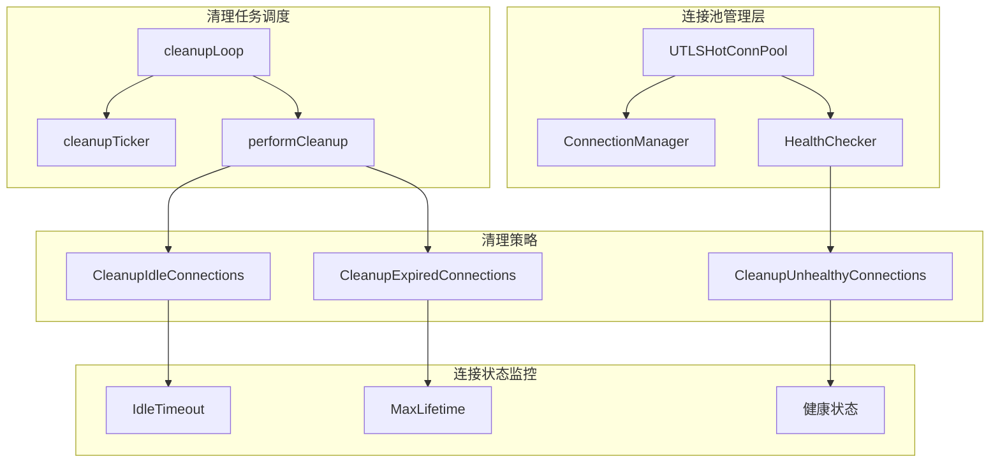
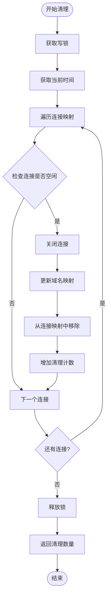
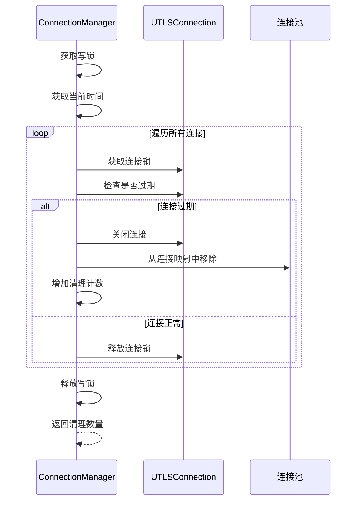
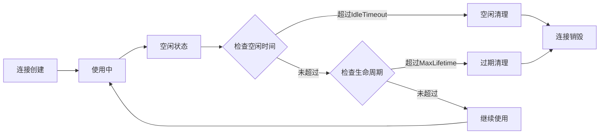
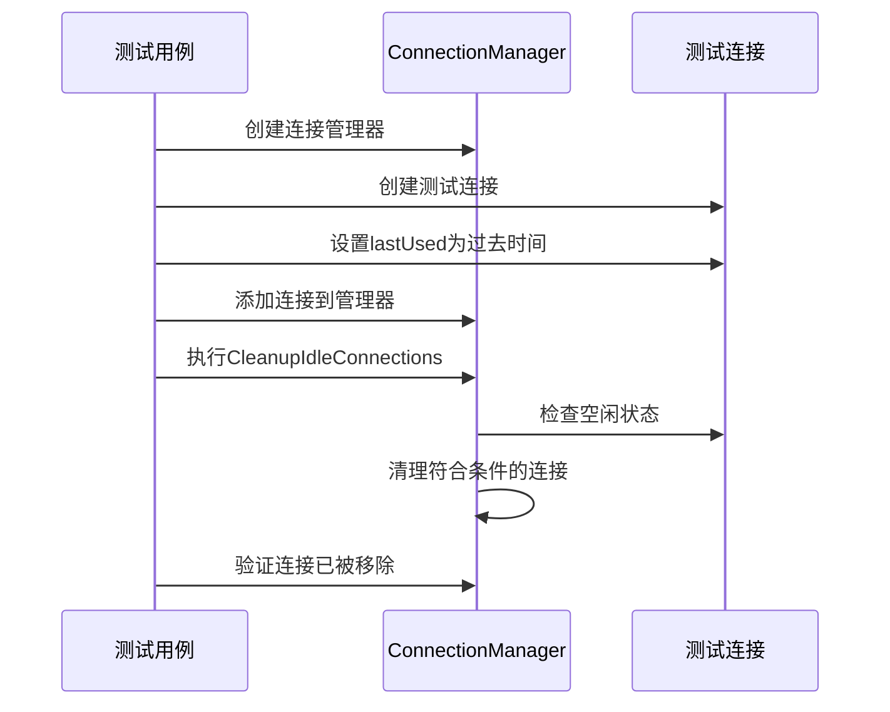
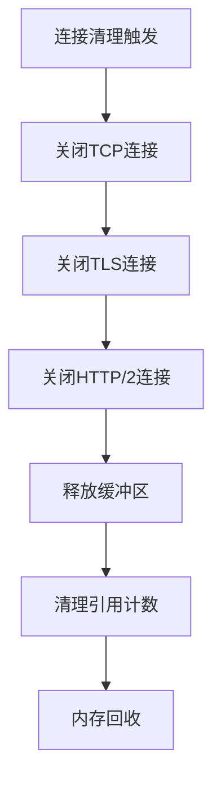

# 连接池清理机制

<cite>
**本文档引用的文件**
- [connection_manager.go](file://utlsclient/connection_manager.go)
- [connection_manager_test.go](file://test/utlsclient/connection_manager_test.go)
- [utlshotconnpool.go](file://utlsclient/utlshotconnpool.go)
- [test_helpers.go](file://utlsclient/test_helpers.go)
- [health_checker.go](file://utlsclient/health_checker.go)
</cite>

## 目录
1. [概述](#概述)
2. [清理机制架构](#清理机制架构)
3. [空闲连接清理](#空闲连接清理)
4. [过期连接清理](#过期连接清理)
5. [cleanupTicker定时器机制](#cleantickticker定时器机制)
6. [清理策略对比](#清理策略对比)
7. [测试用例分析](#测试用例分析)
8. [资源泄漏防护](#资源泄漏防护)
9. [最佳实践建议](#最佳实践建议)

## 概述

连接池清理机制是热连接池（UTLSHotConnPool）的重要组成部分，负责维护连接池的健康状态，防止资源泄漏和内存占用过多。该机制通过两个主要的清理策略：空闲连接清理和过期连接清理，确保连接池始终处于最优状态。

清理机制的核心特点：
- **双重保护**：同时监控连接的空闲时间和生命周期
- **定时触发**：通过cleanupTicker定期执行清理任务
- **线程安全**：使用读写锁保证并发安全性
- **智能判断**：基于连接状态和时间阈值进行清理决策

## 清理机制架构

连接池清理机制采用分层架构设计，包含以下核心组件：



**图表来源**
- [utlshotconnpool.go](file://utlsclient/utlshotconnpool.go#L849-L856)
- [connection_manager.go](file://utlsclient/connection_manager.go#L141-L217)

**章节来源**
- [utlshotconnpool.go](file://utlsclient/utlshotconnpool.go#L279-L329)
- [connection_manager.go](file://utlsclient/connection_manager.go#L8-L14)

## 空闲连接清理

空闲连接清理机制专门处理长时间未使用的连接，防止连接池中积累大量无用连接。

### 清理逻辑实现

空闲连接清理通过`CleanupIdleConnections`方法实现：



**图表来源**
- [connection_manager.go](file://utlsclient/connection_manager.go#L141-L177)

### 空闲检测算法

空闲连接检测的核心逻辑基于以下条件：

1. **连接状态检查**：`!conn.inUse` - 连接必须处于空闲状态
2. **时间阈值比较**：`now.Sub(conn.lastUsed) > cm.config.IdleTimeout` - 超过空闲超时时间
3. **双重验证**：同时检查连接状态和时间条件

### 配置参数

空闲连接清理的关键配置参数：

| 参数 | 类型 | 默认值 | 描述 |
|------|------|--------|------|
| IdleTimeout | time.Duration | 60秒 | 连接空闲超时时间 |
| MaxIdleConns | int | 20 | 最大空闲连接数 |

**章节来源**
- [connection_manager.go](file://utlsclient/connection_manager.go#L141-L177)
- [connection_manager_test.go](file://test/utlsclient/connection_manager_test.go#L138-L157)

## 过期连接清理

过期连接清理机制处理超过生命周期限制的连接，确保连接不会因长期存在而产生问题。

### 清理逻辑实现

过期连接清理通过`CleanupExpiredConnections`方法实现：



**图表来源**
- [connection_manager.go](file://utlsclient/connection_manager.go#L180-L217)

### 过期检测算法

过期连接检测的核心逻辑：

1. **连接状态检查**：`!conn.inUse` - 连接必须处于空闲状态
2. **生命周期计算**：`now.Sub(conn.created) > maxLifetime` - 超过最大生命周期
3. **时间基准**：基于连接创建时间而非最后使用时间

### 配置参数

过期连接清理的关键配置参数：

| 参数 | 类型 | 默认值 | 描述 |
|------|------|--------|------|
| MaxLifetime | time.Duration | 300秒 | 连接最大生命周期 |
| CleanupInterval | time.Duration | 60秒 | 清理任务执行间隔 |

**章节来源**
- [connection_manager.go](file://utlsclient/connection_manager.go#L180-L217)
- [connection_manager_test.go](file://test/utlsclient/connection_manager_test.go#L159-L178)

## cleanupTicker定时器机制

cleanupTicker是连接池清理机制的核心调度器，负责定期触发各种清理任务。

### 定时器启动流程

```mermaid
sequenceDiagram
participant Pool as UTLSHotConnPool
participant Loop as cleanupLoop
participant Ticker as cleanupTicker
participant Task as performCleanup
Pool->>Loop : 启动后台维护任务
Loop->>Ticker : 创建定时器 (CleanupInterval)
loop 定时循环
Ticker->>Task : 触发清理任务
Task->>Task : 执行过期连接清理
Task-->>Loop : 清理完成
end
```

**图表来源**
- [utlshotconnpool.go](file://utlsclient/utlshotconnpool.go#L849-L856)

### 定时器配置

cleanupTicker的配置参数：

```go
// 默认配置示例
CleanupInterval: 60 * time.Second  // 每60秒执行一次清理
```

### 定时器生命周期管理

cleanupTicker的生命周期管理包括：

1. **启动阶段**：在`startMaintenanceTasks`中启动
2. **运行阶段**：持续运行直到连接池关闭
3. **停止阶段**：通过`done`通道优雅关闭

**章节来源**
- [utlshotconnpool.go](file://utlsclient/utlshotconnpool.go#L849-L856)
- [utlshotconnpool.go](file://utlsclient/utlshotconnpool.go#L779-L800)

## 清理策略对比

两种清理策略各有侧重，共同维护连接池健康：

| 特征 | 空闲连接清理 | 过期连接清理 |
|------|-------------|-------------|
| **触发条件** | 超过IdleTimeout | 超过MaxLifetime |
| **检查基准** | lastUsed时间 | created时间 |
| **清理时机** | 连接长时间未使用 | 连接生命周期到期 |
| **适用场景** | 缓解连接池膨胀 | 防止资源长期占用 |
| **性能影响** | 较小 | 中等 |
| **资源回收** | 空闲连接 | 超龄连接 |

### 清理优先级

在实际运行中，两种清理策略可能同时触发：



**图表来源**
- [utlshotconnpool.go](file://utlsclient/utlshotconnpool.go#L779-L800)

**章节来源**
- [connection_manager.go](file://utlsclient/connection_manager.go#L141-L217)

## 测试用例分析

测试用例充分验证了清理机制的正确性和鲁棒性。

### 空闲连接清理测试

测试验证了空闲连接清理的核心功能：



**图表来源**
- [connection_manager_test.go](file://test/utlsclient/connection_manager_test.go#L138-L157)

### 过期连接清理测试

测试验证了过期连接清理的准确性：

1. **时间设置**：使用`SetTestConnectionCreated`设置连接创建时间
2. **状态设置**：使用`SetTestConnectionInUse`设置连接状态
3. **清理验证**：验证连接被正确清理

### 并发安全性测试

测试用例验证了清理机制的并发安全性：

- **多goroutine并发**：测试多个goroutine同时操作连接池
- **数据竞争防护**：验证读写锁的有效性
- **状态一致性**：确保清理过程中数据的一致性

**章节来源**
- [connection_manager_test.go](file://test/utlsclient/connection_manager_test.go#L138-L178)
- [test_helpers.go](file://utlsclient/test_helpers.go#L1-L60)

## 资源泄漏防护

清理机制在防止资源泄漏方面发挥关键作用：

### 内存泄漏防护

1. **及时释放**：空闲连接超过阈值立即释放
2. **生命周期管理**：过期连接强制清理
3. **连接池大小控制**：防止连接池无限增长

### 文件描述符泄漏防护

清理机制确保TCP连接和TLS连接得到正确关闭：



**图表来源**
- [connection_manager.go](file://utlsclient/connection_manager.go#L141-L177)

### 网络资源泄漏防护

1. **连接复用优化**：避免频繁建立新连接
2. **超时控制**：防止连接长时间挂起
3. **健康检查**：及时发现并清理失效连接

**章节来源**
- [connection_manager.go](file://utlsclient/connection_manager.go#L141-L217)
- [health_checker.go](file://utlsclient/health_checker.go#L114-L164)

## 最佳实践建议

基于清理机制的设计和实现，提出以下最佳实践建议：

### 配置优化

1. **合理设置超时参数**
   - IdleTimeout：根据业务特点设置合适的空闲超时
   - MaxLifetime：平衡连接质量和资源消耗

2. **监控清理效果**
   - 定期检查清理频率和数量
   - 分析连接池健康状态指标

### 性能调优

1. **清理频率优化**
   - 根据连接池规模调整CleanupInterval
   - 在高负载情况下适当增加清理频率

2. **内存使用优化**
   - 监控连接池内存占用
   - 及时清理无用连接

### 故障排查

1. **常见问题诊断**
   - 连接池大小异常：检查清理机制是否正常工作
   - 内存持续增长：确认过期连接清理是否及时

2. **调试技巧**
   - 启用详细日志记录
   - 使用测试工具验证清理效果

### 扩展考虑

1. **自定义清理策略**
   - 根据业务需求实现特殊清理逻辑
   - 集成外部监控系统

2. **集群环境部署**
   - 考虑分布式环境下的清理协调
   - 实现跨节点的连接池管理

通过合理配置和使用连接池清理机制，可以显著提升系统的稳定性和资源利用效率，为构建高性能的网络应用提供坚实基础。