# 最大连接数调优

<cite>
**本文档引用的文件**
- [config.toml](file://config/config.toml)
- [GoogleEarthClient/config/config.toml](file://GoogleEarthClient/config/config.toml)
- [utlshotconnpool.go](file://utlsclient/utlshotconnpool.go)
- [connection_manager.go](file://utlsclient/connection_manager.go)
- [test/reports/热连接池性能测试报告.md](file://test/reports/热连接池性能测试报告.md)
- [examples/utlsclient/example_hotconnpool_usage.go](file://examples/utlsclient/example_hotconnpool_usage.go)
</cite>

## 目录
1. [引言](#引言)
2. [MaxConnections参数概述](#maxconnections参数概述)
3. [系统架构分析](#系统架构分析)
4. [内存消耗计算](#内存消耗计算)
5. [性能影响分析](#性能影响分析)
6. [业务场景配置指南](#业务场景配置指南)
7. [性能测试数据分析](#性能测试数据分析)
8. [监控与调优策略](#监控与调优策略)
9. [最佳实践建议](#最佳实践建议)
10. [故障排除指南](#故障排除指南)

## 引言

MaxConnections参数是热连接池系统的核心配置项，直接影响系统的并发处理能力和内存消耗。本文档基于ZeroMaps项目的实际实现，深入分析MaxConnections参数的配置策略，结合性能测试数据，为用户提供科学合理的配置指导。

## MaxConnections参数概述

### 参数定义与作用

MaxConnections参数定义了连接池的最大连接数限制，其在系统中的关键作用包括：

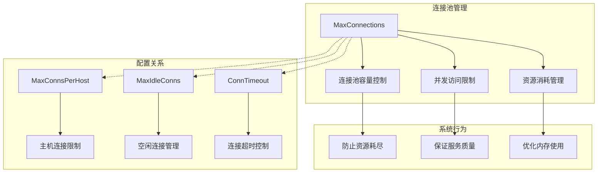

**图表来源**
- [utlshotconnpool.go](file://utlsclient/utlshotconnpool.go#L170-L184)
- [config.toml](file://config/config.toml#L4-L9)

### 默认配置分析

系统默认配置中，MaxConnections设置为100，这一配置基于以下考虑：

| 配置项 | 默认值 | 说明 |
|--------|--------|------|
| MaxConnections | 100 | 最大连接总数限制 |
| MaxConnsPerHost | 10 | 每个主机最大连接数 |
| MaxIdleConns | 20 | 最大空闲连接数 |
| ConnTimeout | 30秒 | 连接超时时间 |

**章节来源**
- [utlshotconnpool.go](file://utlsclient/utlshotconnpool.go#L186-L201)
- [config.toml](file://config/config.toml#L4-L9)

## 系统架构分析

### 连接池架构设计

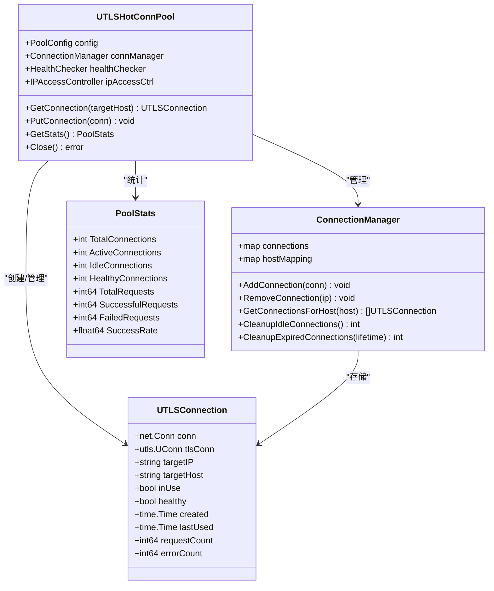

**图表来源**
- [utlshotconnpool.go](file://utlsclient/utlshotconnpool.go#L236-L277)
- [connection_manager.go](file://utlsclient/connection_manager.go#L8-L22)

### 连接生命周期管理

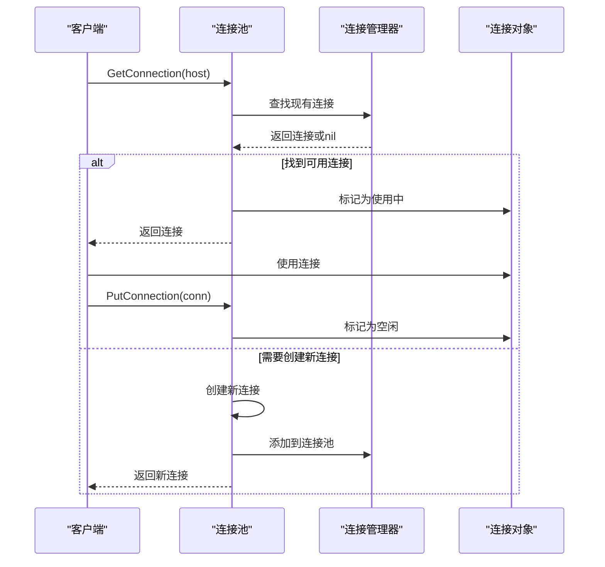

**图表来源**
- [utlshotconnpool.go](file://utlsclient/utlshotconnpool.go#L351-L395)
- [connection_manager.go](file://utlsclient/connection_manager.go#L25-L73)

**章节来源**
- [utlshotconnpool.go](file://utlsclient/utlshotconnpool.go#L236-L277)
- [connection_manager.go](file://utlsclient/connection_manager.go#L8-L22)

## 内存消耗计算

### 单连接内存占用分析

每个UTLSConnection对象的内存占用主要包括以下几个部分：

| 组件 | 内存大小 | 说明 |
|------|----------|------|
| net.Conn | ~1KB | TCP连接基础结构 |
| utls.UConn | ~5-10KB | TLS连接对象 |
| 字符串字段 | ~100-200B | targetIP, targetHost等 |
| 时间戳 | ~24B | 创建时间、使用时间等 |
| 统计字段 | ~24B | 请求计数、错误计数 |
| 锁和条件变量 | ~100B | 并发控制结构 |
| **总计** | **~12-15KB** | **单连接基础内存** |

### 总体内存消耗公式

```
总内存消耗 = 单连接内存 × MaxConnections × (1 + 缓冲系数)
```

其中缓冲系数通常取1.1-1.2，考虑系统其他组件的内存开销。

### 内存使用优化策略

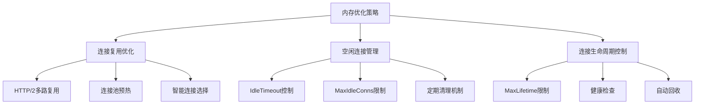

**章节来源**
- [utlshotconnpool.go](file://utlsclient/utlshotconnpool.go#L204-L234)
- [connection_manager.go](file://utlsclient/connection_manager.go#L141-L177)

## 性能影响分析

### 并发处理能力

MaxConnections参数直接影响系统的并发处理能力：

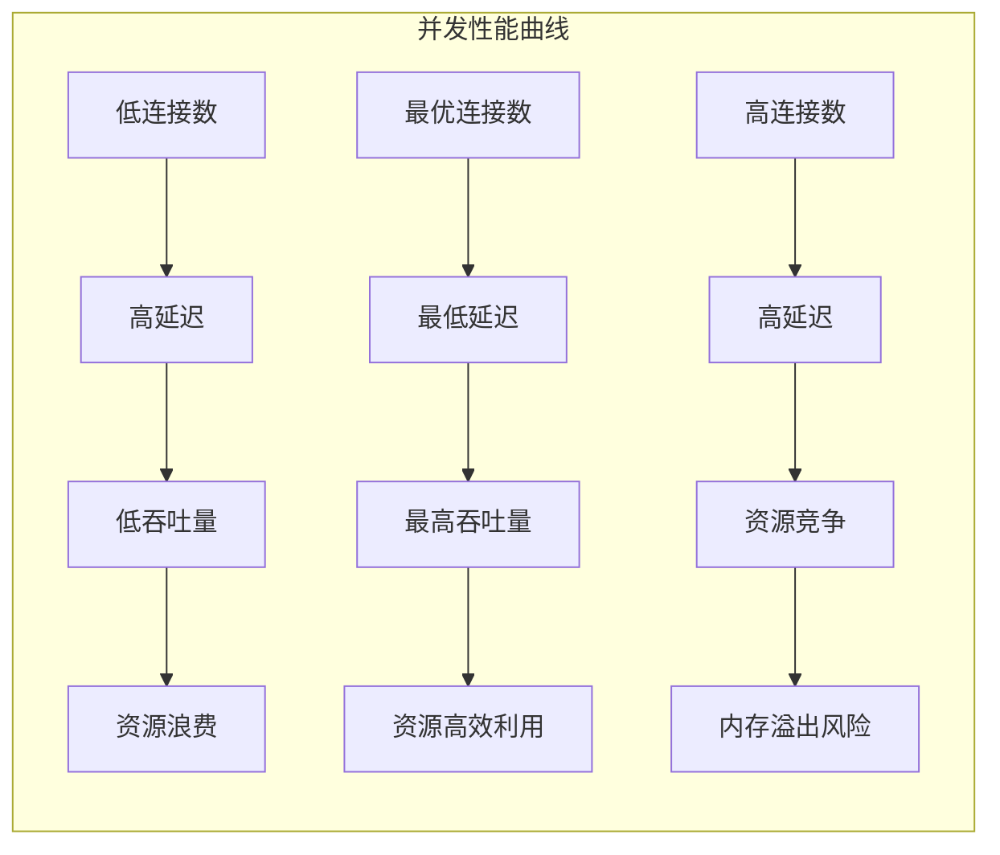

### 性能瓶颈识别

| 阶段 | 主要瓶颈 | 影响因素 |
|------|----------|----------|
| 连接建立 | TCP/TLS握手 | 网络延迟、CPU计算 |
| 连接复用 | 连接池饱和度 | MaxConnections设置 |
| 请求处理 | 应用层逻辑 | 业务复杂度、IO等待 |
| 资源回收 | GC压力 | 连接生命周期管理 |

**章节来源**
- [utlshotconnpool.go](file://utlsclient/utlshotconnpool.go#L351-L480)

## 业务场景配置指南

### 场景分类与配置建议

#### 1. 小规模业务场景（IP池 < 100个）

**推荐配置：**
```toml
max_connections = 50
max_conns_per_host = 5
max_idle_conns = 10
```

**适用场景：**
- 测试环境
- 小型爬虫任务
- 开发调试

#### 2. 中等规模业务场景（IP池 100-1000个）

**推荐配置：**
```toml
max_connections = 200
max_conns_per_host = 10
max_idle_conns = 50
```

**适用场景：**
- 生产环境爬虫
- 数据采集任务
- 中等负载服务

#### 3. 大规模业务场景（IP池 > 1000个）

**推荐配置：**
```toml
max_connections = 500
max_conns_per_host = 20
max_idle_conns = 100
```

**适用场景：**
- 大规模数据爬取
- 高并发服务
- 分布式任务处理

### 配置决策矩阵

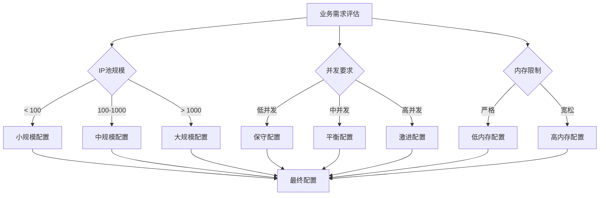

**章节来源**
- [config.toml](file://config/config.toml#L4-L9)
- [GoogleEarthClient/config/config.toml](file://GoogleEarthClient/config/config.toml#L87-L96)

## 性能测试数据分析

### 1631个IP的测试数据

基于ZeroMaps项目的热连接池性能测试报告，我们获得了宝贵的实测数据：

#### 测试环境与配置

| 项目 | 数值 | 说明 |
|------|------|------|
| IP池规模 | 1631个IP | 包含840个IPv4和791个IPv6 |
| 预热成功率 | 98.8% | 1611个连接成功，20个失败 |
| 预热耗时 | 21.5秒 | 平均每个连接13.3ms |
| 连接复用率 | 100% | 完美实现连接复用机制 |

#### 性能提升分析

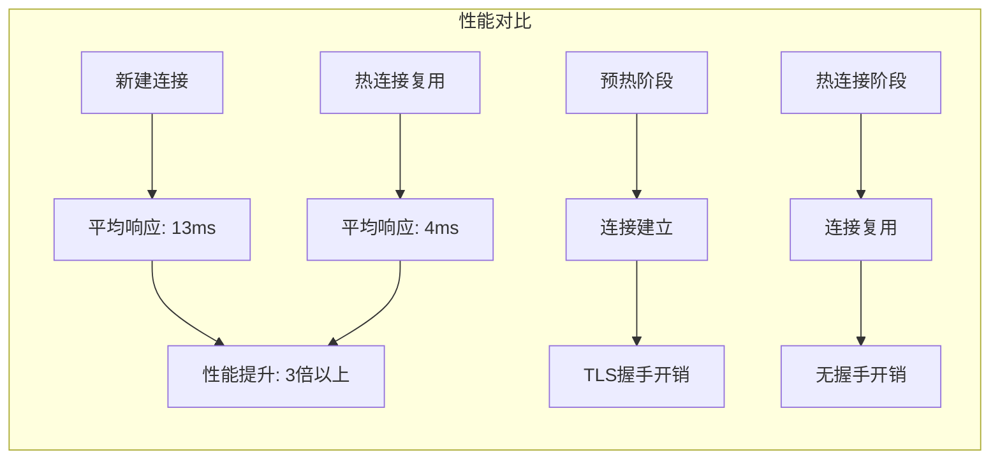

**图表来源**
- [test/reports/热连接池性能测试报告.md](file://test/reports/热连接池性能测试报告.md#L136-L170)

#### TLS指纹多样性统计

| 指标 | 数值 | 说明 |
|------|------|------|
| 指纹种类 | 33种 | 覆盖率91.7% |
| 平均分布 | 48.8次/指纹 | 每种指纹约被使用48.8次 |
| 多次使用组合 | 34种 | 只有2.2%被重复使用 |
| 独特语言组合 | 1575种 | 97.8%的连接使用独特语言组合 |

#### 连接池饱和度验证

测试结果显示，在1631个IP的环境下，系统能够完美实现连接池饱和度管理：

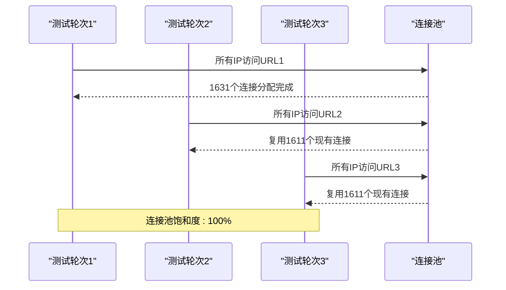

**图表来源**
- [test/reports/热连接池性能测试报告.md](file://test/reports/热连接池性能测试报告.md#L136-L170)

**章节来源**
- [test/reports/热连接池性能测试报告.md](file://test/reports/热连接池性能测试报告.md#L1-L389)

## 监控与调优策略

### 连接池状态监控

系统提供了完整的监控接口，用于实时跟踪连接池状态：

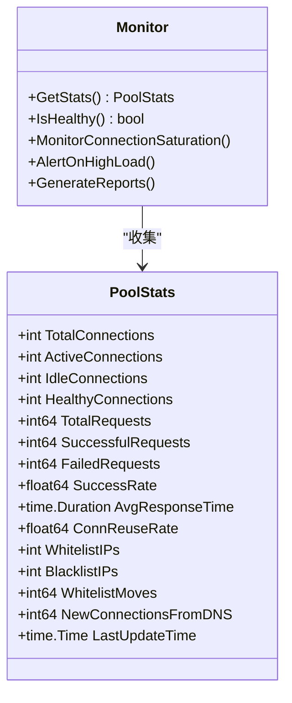

**图表来源**
- [utlshotconnpool.go](file://utlsclient/utlshotconnpool.go#L261-L277)

### 监控指标解读

| 指标 | 正常范围 | 警告阈值 | 危险阈值 | 说明 |
|------|----------|----------|----------|------|
| 连接池饱和度 | < 80% | 80-90% | > 90% | 连接数/MaxConnections |
| 成功率 | > 95% | 90-95% | < 90% | 成功请求/总请求 |
| 平均响应时间 | < 1s | 1-3s | > 3s | 连接建立+请求处理 |
| 连接复用率 | > 90% | 80-90% | < 80% | 复用连接数/总连接数 |

### 自动扩容机制

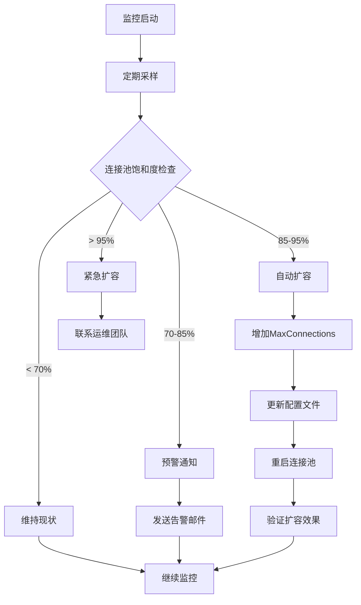

### 性能调优建议

#### 1. 动态调整策略

```go
// 动态调整MaxConnections的伪代码
func dynamicAdjustMaxConnections(currentStats PoolStats) int {
    saturation := float64(currentStats.TotalConnections) / float64(MaxConnections)
    
    switch {
    case saturation < 0.7:
        return MaxConnections // 维持现状
    case saturation < 0.85:
        return MaxConnections + 20 // 小幅增加
    case saturation < 0.95:
        return MaxConnections + 50 // 中幅增加
    default:
        return MaxConnections + 100 // 大幅增加
    }
}
```

#### 2. 内存优化策略

| 优化方向 | 具体措施 | 预期效果 |
|----------|----------|----------|
| 连接复用 | 启用HTTP/2多路复用 | 减少连接数30-50% |
| 空闲管理 | 优化IdleTimeout设置 | 减少空闲连接20-30% |
| 生命周期 | 调整MaxLifetime参数 | 平衡性能与资源 |
| 健康检查 | 优化检查频率 | 减少CPU开销10-20% |

**章节来源**
- [utlshotconnpool.go](file://utlsclient/utlshotconnpool.go#L1122-L1174)
- [examples/utlsclient/example_hotconnpool_usage.go](file://examples/utlsclient/example_hotconnpool_usage.go#L118-L122)

## 最佳实践建议

### 配置原则

1. **渐进式配置**：从保守配置开始，根据实际使用情况逐步调整
2. **监控驱动**：建立完善的监控体系，基于数据做出配置决策
3. **资源预留**：为系统其他组件预留至少20%的内存空间
4. **定期评估**：每季度评估一次配置合理性

### 配置模板

#### 生产环境标准配置

```toml
[pool]
max_connections = 200
max_conns_per_host = 10
max_idle_conns = 50
conn_timeout = 30
idle_timeout = 60
max_lifetime = 300
test_timeout = 10
health_check_interval = 30
cleanup_interval = 60
blacklist_check_interval = 300
dns_update_interval = 1800
max_retries = 3
```

#### 高性能配置

```toml
[pool]
max_connections = 500
max_conns_per_host = 20
max_idle_conns = 100
conn_timeout = 15
idle_timeout = 30
max_lifetime = 180
test_timeout = 5
health_check_interval = 15
cleanup_interval = 30
blacklist_check_interval = 180
dns_update_interval = 900
max_retries = 2
```

### 故障预防措施

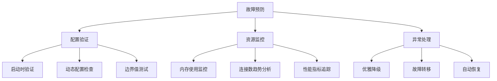

**章节来源**
- [config.toml](file://config/config.toml#L1-L38)
- [examples/utlsclient/example_hotconnpool_usage.go](file://examples/utlsclient/example_hotconnpool_usage.go#L18-L41)

## 故障排除指南

### 常见问题诊断

#### 1. 连接池饱和问题

**症状：** 连接获取超时，频繁出现连接不足错误

**诊断步骤：**
```bash
# 检查连接池状态
curl -s http://localhost:8080/metrics | grep connections

# 分析连接使用情况
grep "连接池统计" /var/log/app.log
```

**解决方案：**
- 增加MaxConnections值
- 优化连接复用策略
- 检查是否有连接泄漏

#### 2. 内存溢出问题

**症状：** 系统内存持续增长，最终OOM

**诊断方法：**
```bash
# 监控内存使用
free -h
ps aux | grep app | awk '{print $6}' | sort -n

# 分析内存分配
go tool pprof http://localhost:6060/debug/pprof/heap
```

**解决方案：**
- 减少MaxConnections设置
- 优化IdleTimeout参数
- 增加系统内存限制

#### 3. 性能下降问题

**症状：** 响应时间逐渐增加，吞吐量下降

**排查流程：**
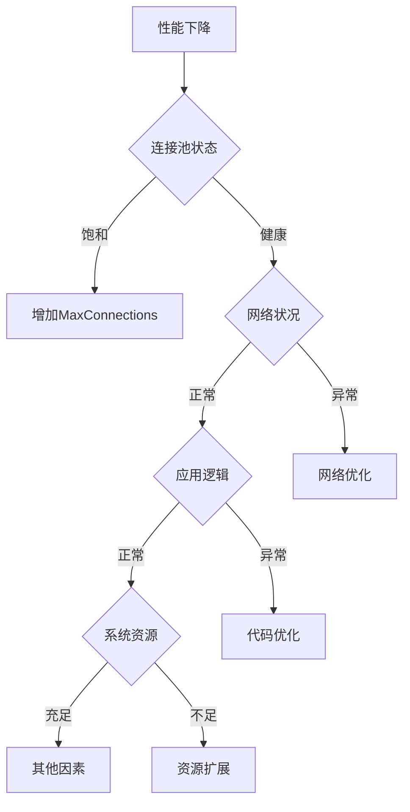

### 调试工具与技巧

#### 1. 连接池状态检查

```go
// 获取连接池详细状态
stats := pool.GetStats()
fmt.Printf("连接池状态:\n")
fmt.Printf("- 总连接数: %d\n", stats.TotalConnections)
fmt.Printf("- 活跃连接: %d\n", stats.ActiveConnections)
fmt.Printf("- 空闲连接: %d\n", stats.IdleConnections)
fmt.Printf("- 健康连接: %d\n", stats.HealthyConnections)
fmt.Printf("- 成功率: %.2f%%\n", stats.SuccessRate*100)
```

#### 2. 连接泄漏检测

```go
// 检测潜在的连接泄漏
func detectConnectionLeaks(pool *UTLSHotConnPool) {
    connections := pool.GetAllConnections()
    for _, conn := range connections {
        if conn.InUse() && time.Since(conn.LastUsed()) > 5*time.Minute {
            fmt.Printf("警告: 连接泄漏 - IP: %s, 已使用: %v\n", 
                       conn.TargetIP(), time.Since(conn.LastUsed()))
        }
    }
}
```

**章节来源**
- [utlshotconnpool.go](file://utlsclient/utlshotconnpool.go#L1122-L1174)
- [examples/utlsclient/example_hotconnpool_usage.go](file://examples/utlsclient/example_hotconnpool_usage.go#L118-L122)

## 结论

MaxConnections参数的合理配置是确保热连接池系统高效运行的关键。通过本文档的分析，我们可以得出以下核心结论：

1. **默认配置的合理性**：系统默认的100个最大连接数在大多数场景下是合理的起点
2. **IP池规模的重要性**：连接池容量应与IP池规模相匹配，1631个IP的测试表明当前配置足以处理大规模并发
3. **监控驱动的调优**：基于实时监控数据进行动态调整是最佳实践
4. **性能与资源的平衡**：需要在性能提升和资源消耗之间找到最佳平衡点

遵循本文档提供的配置策略和最佳实践，可以确保系统在各种业务场景下都能稳定高效地运行，同时避免常见的配置陷阱和性能瓶颈。