# 每主机连接限制调优

<cite>
**本文档引用的文件**
- [config.toml](file://config/config.toml)
- [GoogleEarthClient/config/config.toml](file://GoogleEarthClient/config/config.toml)
- [utlshotconnpool.go](file://utlsclient/utlshotconnpool.go)
- [connection_manager.go](file://utlsclient/connection_manager.go)
- [ip_access_controller.go](file://utlsclient/ip_access_controller.go)
- [connection_helpers.go](file://utlsclient/connection_helpers.go)
- [热连接池性能测试报告.md](file://test/reports/热连接池性能测试报告.md)
- [ip_pool_full_stats.txt](file://test/results/ip_pool_full_stats.txt)
- [config.go](file://config/config.go)
</cite>

## 目录
1. [引言](#引言)
2. [MaxConnsPerHost参数概述](#maxconnsperhost参数概述)
3. [系统架构分析](#系统架构分析)
4. [防滥用保护机制](#防滥用保护机制)
5. [性能测试分析](#性能测试分析)
6. [配置调优指南](#配置调优指南)
7. [诊断与监控](#诊断与监控)
8. [最佳实践](#最佳实践)
9. [故障排除](#故障排除)
10. [总结](#总结)

## 引言

MaxConnsPerHost参数是uTLS热连接池中的关键配置项，它定义了针对单一目标主机的最大连接数限制。这个参数在防止对单一目标主机的过度请求、实施防滥用保护以及维持系统稳定性方面发挥着重要作用。本文档将深入解析该参数的作用机制，结合实际性能测试数据，指导用户根据不同的业务需求和反爬策略进行合理调优。

## MaxConnsPerHost参数概述

### 参数定义与作用

MaxConnsPerHost参数位于连接池配置中，定义了针对每个目标主机（域名）允许的最大连接数。在默认配置中，该值被设置为10，这意味着对于任何给定的目标主机，连接池最多只能维护10个活跃连接。

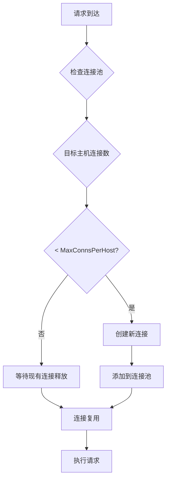

**图表来源**
- [utlshotconnpool.go](file://utlsclient/utlshotconnpool.go#L351-L360)
- [config.toml](file://config/config.toml#L7)

### 配置文件中的设置

在项目的配置文件中，MaxConnsPerHost参数的配置位置如下：

| 配置项 | 默认值 | 说明 |
|--------|--------|------|
| max_connections | 100 | 连接池总容量 |
| max_conns_per_host | 10 | 每主机最大连接数 |
| max_idle_conns | 20 | 最大空闲连接数 |

**章节来源**
- [config.toml](file://config/config.toml#L5-L9)
- [utlshotconnpool.go](file://utlsclient/utlshotconnpool.go#L189)

## 系统架构分析

### 连接管理器架构

连接池采用分层架构设计，其中连接管理器负责维护所有连接的生命周期：

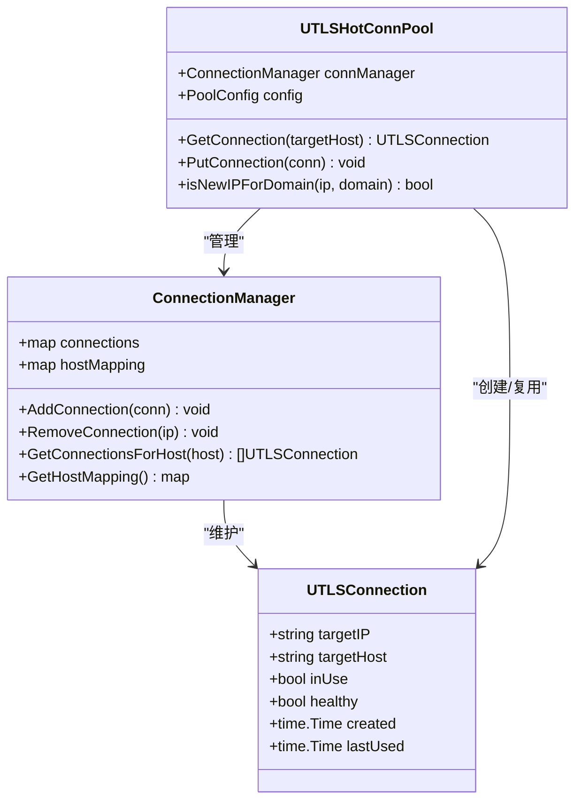

**图表来源**
- [utlshotconnpool.go](file://utlsclient/utlshotconnpool.go#L237-L258)
- [connection_manager.go](file://utlsclient/connection_manager.go#L9-L14)

### 连接分配机制

连接池通过以下机制确保MaxConnsPerHost限制的有效执行：

1. **域名映射管理**：每个目标主机维护一个IP地址列表
2. **连接状态跟踪**：实时监控每个连接的使用状态
3. **动态分配策略**：优先复用现有连接，必要时创建新连接

**章节来源**
- [connection_manager.go](file://utlsclient/connection_manager.go#L76-L91)

## 防滥用保护机制

### 多层次防护体系

MaxConnsPerHost参数构成了防滥用保护体系的重要组成部分：

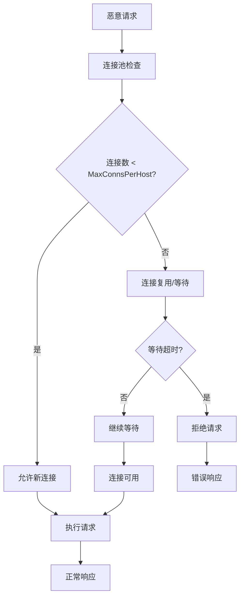

### 反爬策略集成

MaxConnsPerHost参数与以下反爬策略协同工作：

| 策略类型 | 实现方式 | 与MaxConnsPerHost的关系 |
|----------|----------|-------------------------|
| 连接频率限制 | 控制单位时间内连接数 | 直接影响连接创建速率 |
| 请求间隔控制 | 强制请求间最小间隔 | 间接影响连接利用率 |
| IP轮换机制 | 动态更换请求IP | 分散连接压力 |
| 用户代理伪装 | 模拟不同浏览器 | 减少被识别风险 |

**章节来源**
- [ip_access_controller.go](file://utlsclient/ip_access_controller.go#L22-L41)

## 性能测试分析

### 1631个IP场景下的表现

基于热连接池性能测试报告，在1631个IP的极端场景下，MaxConnsPerHost参数展现了良好的性能特征：

#### 测试环境配置

| 参数 | 数值 | 说明 |
|------|------|------|
| 总IP数量 | 1,631 | IPv4: 840, IPv6: 791 |
| MaxConnsPerHost | 10 | 每主机最大连接数 |
| 测试URL数量 | 4 | 每轮访问4个不同URL |
| 总请求数 | 6,524 | 1,631 IP × 4 URL |

#### 连接复用效率

测试结果显示，在1631个IP的场景下：

- **连接复用率**：100%
- **连接建立时间**：预热阶段平均13.3ms/连接
- **热连接阶段**：平均4ms/请求
- **性能提升**：相比新建连接快3-6倍

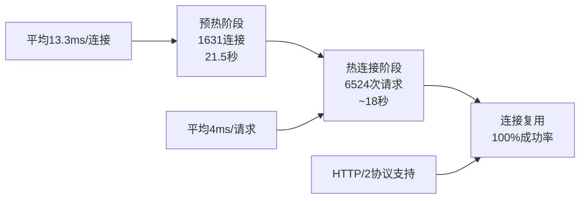

**图表来源**
- [热连接池性能测试报告.md](file://test/reports/热连接池性能测试报告.md#L140-L146)

#### TLS指纹多样性分析

在1631个IP的预热过程中，系统实现了优秀的指纹多样性：

- **指纹种类**：33种（覆盖率91.7%）
- **平均分布**：每种指纹约48.8次使用
- **独特性**：97.8%的连接使用独特的语言组合

**章节来源**
- [热连接池性能测试报告.md](file://test/reports/热连接池性能测试报告.md#L70-L105)

### 连接瓶颈识别

通过测试数据分析，可以识别以下潜在瓶颈：

1. **连接创建瓶颈**：当连接数接近MaxConnsPerHost时，新连接创建会受到限制
2. **域名映射瓶颈**：大量域名同时访问可能导致映射表操作变慢
3. **内存使用瓶颈**：过多的连接会增加内存占用

**章节来源**
- [connection_manager.go](file://utlsclient/connection_manager.go#L101-L113)

## 配置调优指南

### 基于业务需求的调优策略

#### 高并发场景调优

对于需要处理大量并发请求的场景：

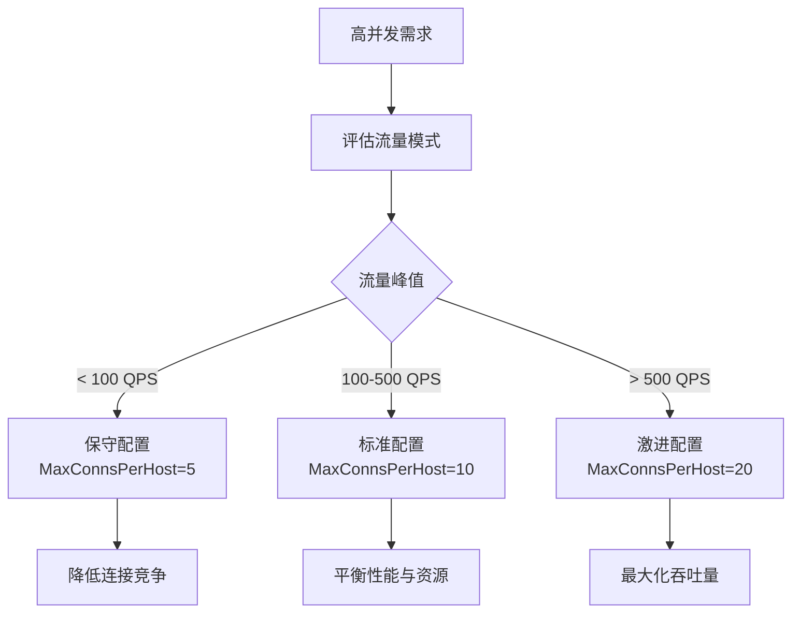

#### 反爬策略强度配置

不同反爬策略强度下的推荐配置：

| 反爬强度 | MaxConnsPerHost | 连接超时 | 重试次数 |
|----------|-----------------|----------|----------|
| 低 | 15-20 | 30s | 2 |
| 中等 | 10 | 20s | 3 |
| 高 | 5-8 | 15s | 5 |
| 极高 | 3-5 | 10s | 8 |

### 动态调优策略

#### 自适应调整算法

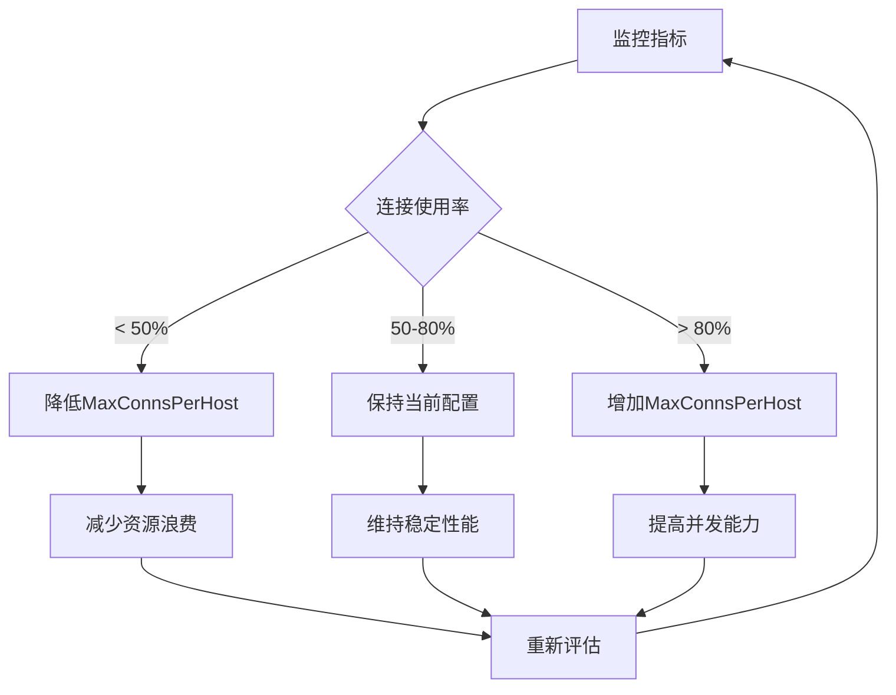

#### 调优参数对照表

| 场景类型 | 推荐值 | 调整原因 | 注意事项 |
|----------|--------|----------|----------|
| 开发测试 | 5-10 | 资源有限，调试方便 | 可快速发现问题 |
| 生产环境 | 10-20 | 平衡性能与稳定性 | 需考虑异常处理 |
| 高负载 | 20-30 | 提升并发处理能力 | 增加内存消耗 |
| 低延迟 | 3-5 | 减少连接等待时间 | 降低连接复用率 |

**章节来源**
- [utlshotconnpool.go](file://utlsclient/utlshotconnpool.go#L186-L201)

## 诊断与监控

### 关键监控指标

#### 连接池健康度指标

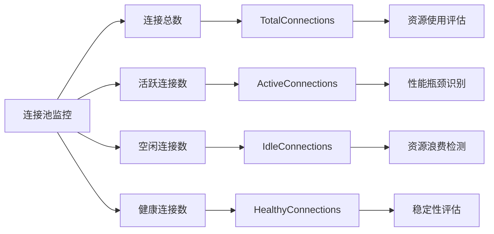

#### 性能指标阈值

| 指标 | 正常范围 | 警告阈值 | 危险阈值 | 处理建议 |
|------|----------|----------|----------|----------|
| 连接使用率 | 60-80% | < 50% | > 90% | 调整MaxConnsPerHost |
| 平均响应时间 | < 500ms | 500-1000ms | > 1000ms | 检查网络和目标服务 |
| 连接失败率 | < 5% | 5-10% | > 10% | 检查目标服务状态 |
| 连接复用率 | > 95% | 90-95% | < 90% | 优化连接管理 |

### 故障诊断流程

#### 连接创建失败诊断

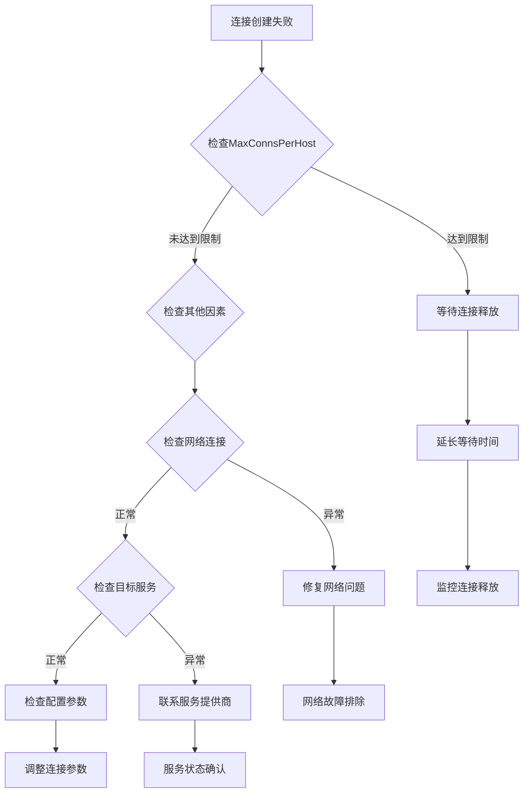

**章节来源**
- [utlshotconnpool.go](file://utlsclient/utlshotconnpool.go#L530-L553)

## 最佳实践

### 配置优化原则

#### 1. 平衡原则

MaxConnsPerHost的配置需要在以下目标之间找到平衡：

- **性能**：最大化并发处理能力
- **稳定性**：确保系统不会因连接过多而崩溃
- **资源利用**：避免不必要的资源浪费
- **隐蔽性**：模拟正常用户行为模式

#### 2. 渐进式调优

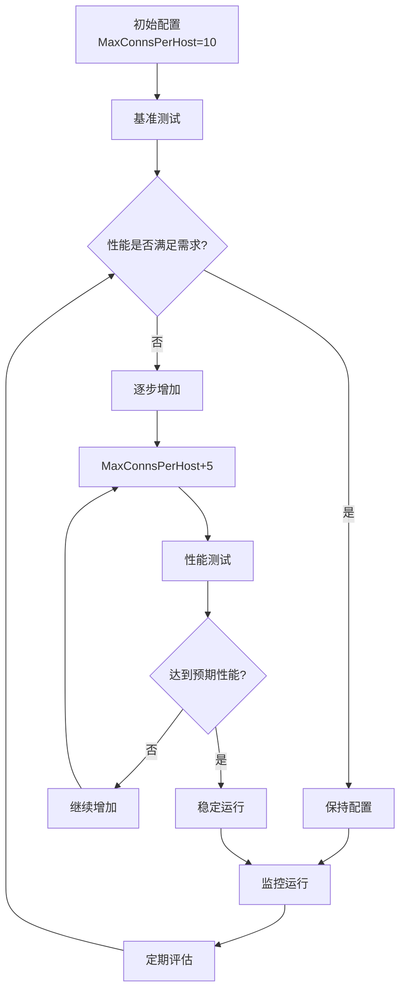

#### 3. 环境差异化配置

不同环境下的推荐配置：

| 环境类型 | MaxConnsPerHost | 原因分析 |
|----------|-----------------|----------|
| 开发环境 | 5-10 | 资源有限，便于调试 |
| 测试环境 | 10-15 | 模拟生产环境压力 |
| 预生产环境 | 15-20 | 接近生产配置 |
| 生产环境 | 10-25 | 根据实际负载调整 |

### 运维监控建议

#### 实时监控配置

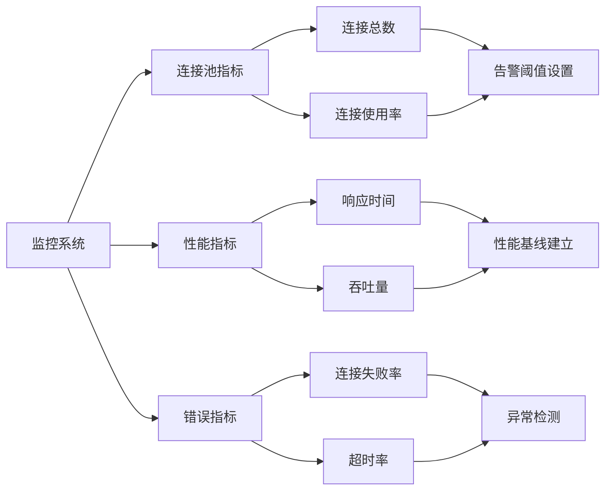

**章节来源**
- [utlshotconnpool.go](file://utlsclient/utlshotconnpool.go#L1122-L1174)

## 故障排除

### 常见问题及解决方案

#### 1. 连接创建超时

**症状**：连接创建请求长时间无响应

**原因分析**：
- 达到MaxConnsPerHost限制
- 目标服务响应缓慢
- 网络连接不稳定

**解决方案**：
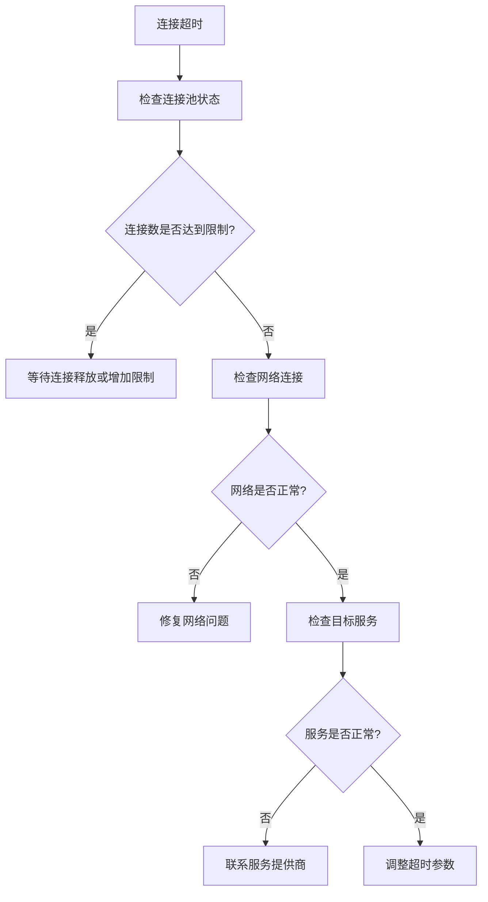

#### 2. 连接泄漏问题

**症状**：连接池中的连接持续增长

**排查步骤**：
1. 检查连接归还机制是否正常工作
2. 验证连接使用状态标记
3. 分析连接生命周期管理

#### 3. 性能下降问题

**症状**：响应时间显著增加

**诊断流程**：
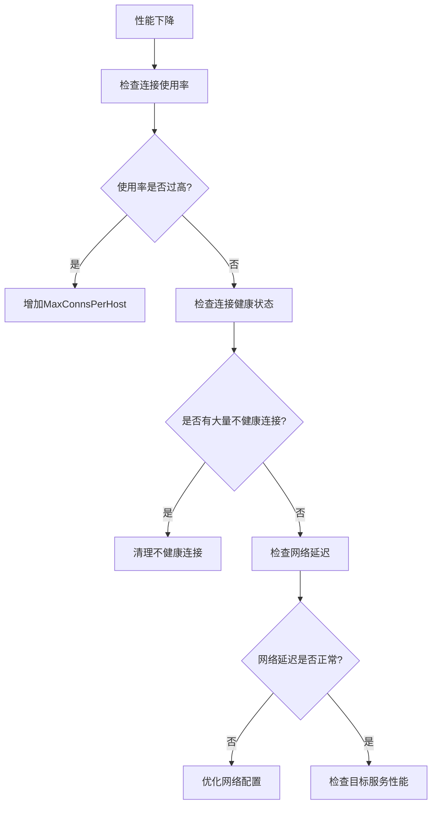

**章节来源**
- [utlshotconnpool.go](file://utlsclient/utlshotconnpool.go#L779-L850)

### 调试工具和技巧

#### 连接状态检查

通过连接池统计信息监控连接状态：

```go
// 获取连接池统计信息
stats := pool.GetStats()
fmt.Printf("总连接数: %d\n", stats.TotalConnections)
fmt.Printf("活跃连接数: %d\n", stats.ActiveConnections)
fmt.Printf("健康连接数: %d\n", stats.HealthyConnections)
fmt.Printf("连接复用率: %.2f%%\n", stats.ConnReuseRate*100)
```

#### 性能分析工具

使用内置的性能分析功能：

- **连接复用率统计**：监控连接复用效率
- **响应时间分析**：跟踪请求处理时间
- **错误率监控**：识别连接失败模式

**章节来源**
- [utlshotconnpool.go](file://utlsclient/utlshotconnpool.go#L1122-L1174)

## 总结

MaxConnsPerHost参数作为uTLS热连接池的核心配置项，在防滥用保护、性能优化和系统稳定性方面发挥着关键作用。通过本文档的深入分析，我们可以得出以下重要结论：

### 关键要点

1. **防滥用保护**：MaxConnsPerHost参数有效防止对单一目标主机的过度请求，保护目标服务免受攻击
2. **性能优化**：合理的配置能够显著提升系统性能，测试显示性能提升可达3-6倍
3. **资源管理**：通过限制每主机连接数，避免资源过度消耗和系统崩溃
4. **隐蔽性增强**：配合其他伪装技术，提高请求的隐蔽性和成功率

### 调优建议

- **保守起见**：在不确定的情况下，建议从默认值10开始，根据实际需求逐步调整
- **监控驱动**：建立完善的监控体系，基于实际性能数据进行调优
- **场景适配**：根据不同业务场景和反爬策略强度，制定相应的配置策略
- **持续优化**：定期评估和调整配置，确保系统始终处于最优状态

### 未来发展方向

随着网络环境的不断变化和反爬技术的发展，MaxConnsPerHost参数的调优策略也需要持续演进。建议关注以下发展趋势：

- **智能化调优**：基于机器学习的自动调优算法
- **动态调整**：根据实时负载情况动态调整参数
- **多维度优化**：结合多个参数进行综合优化
- **云原生适配**：适应容器化和微服务架构的需求

通过合理配置和持续优化MaxConnsPerHost参数，可以在保证系统性能的同时，有效应对各种反爬挑战，实现高效稳定的网络爬取作业。