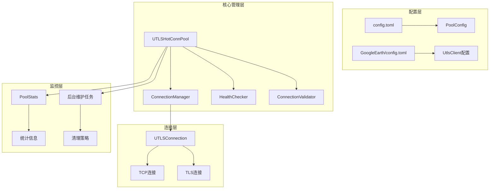
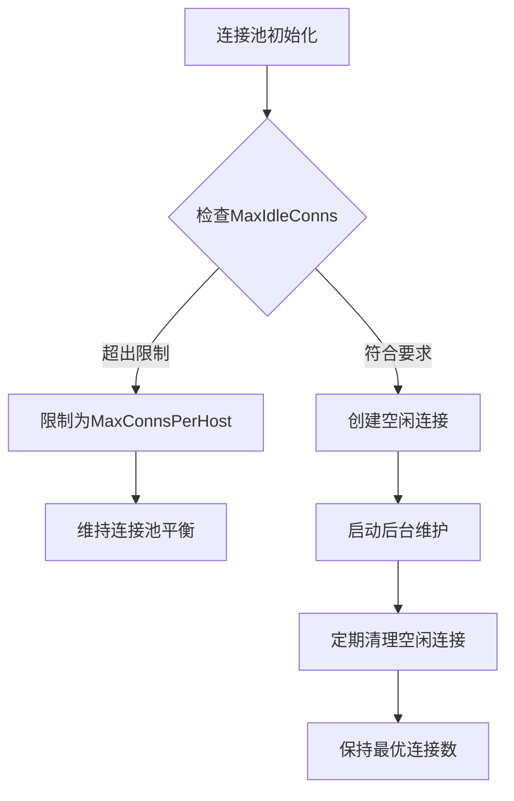
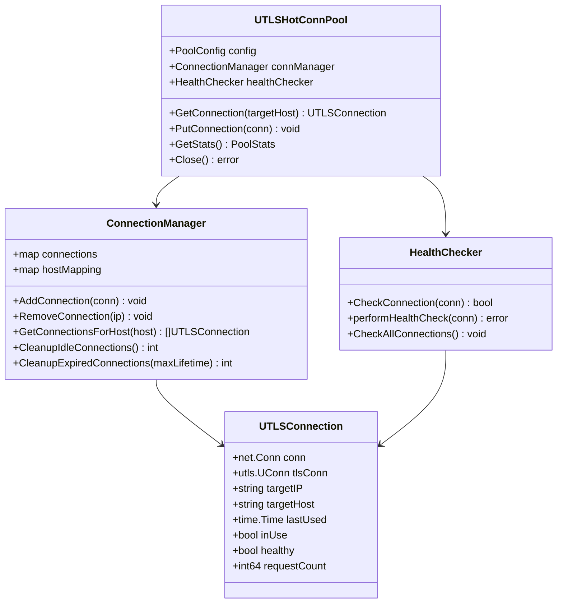
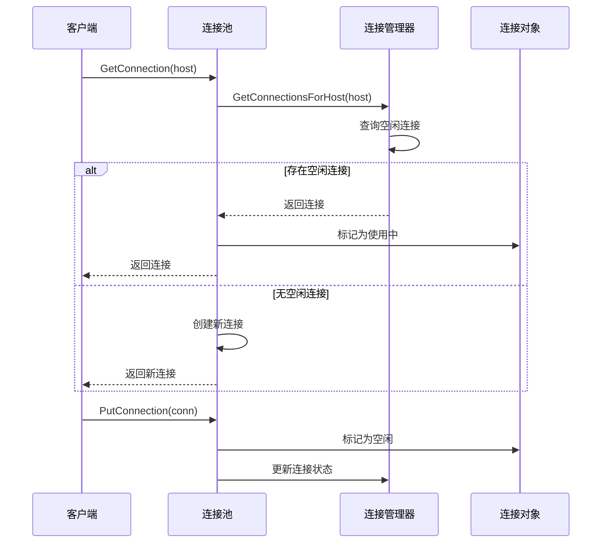
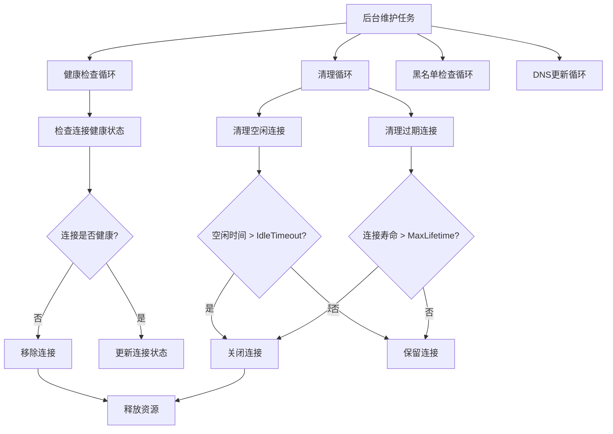
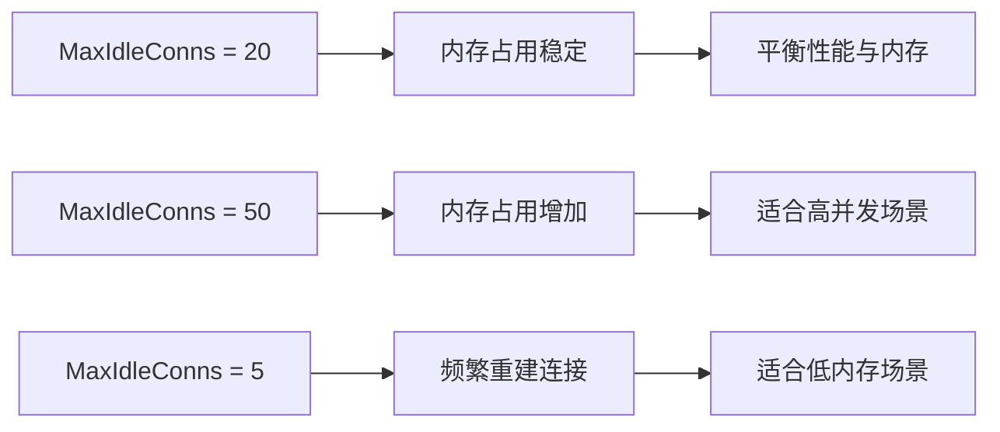
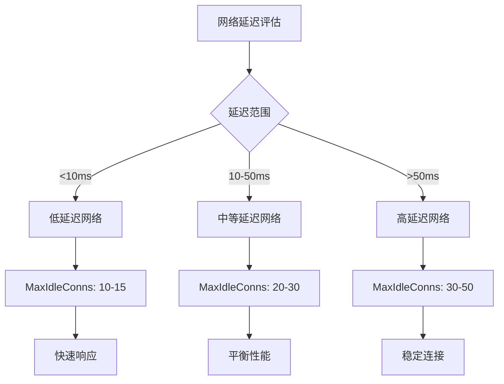
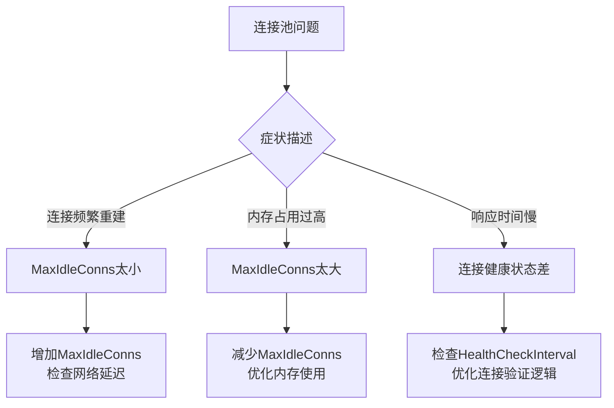
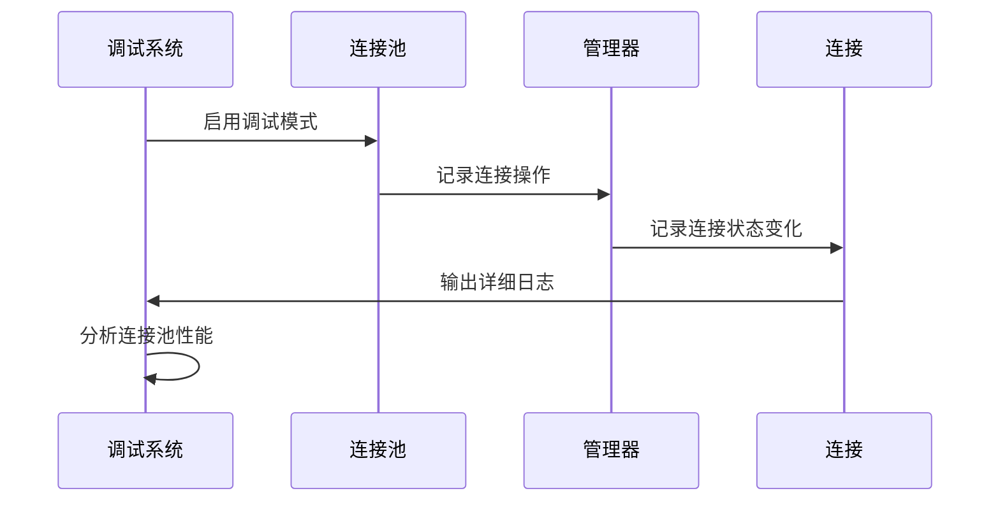

# 空闲连接管理

<cite>
**本文档中引用的文件**
- [config.toml](file://config/config.toml)
- [GoogleEarthClient/config/config.toml](file://GoogleEarthClient/config/config.toml)
- [utlshotconnpool.go](file://utlsclient/utlshotconnpool.go)
- [connection_manager.go](file://utlsclient/connection_manager.go)
- [health_checker.go](file://utlsclient/health_checker.go)
- [example_hotconnpool_usage.go](file://examples/utlsclient/example_hotconnpool_usage.go)
- [热连接池性能测试报告.md](file://test/reports/热连接池性能测试报告.md)
</cite>

## 目录
1. [引言](#引言)
2. [项目结构概览](#项目结构概览)
3. [核心配置参数](#核心配置参数)
4. [架构设计](#架构设计)
5. [详细组件分析](#详细组件分析)
6. [性能优化策略](#性能优化策略)
7. [最佳实践指南](#最佳实践指南)
8. [故障排除](#故障排除)
9. [总结](#总结)

## 引言

MaxIdleConns参数是连接池管理中的关键配置，它直接影响着连接复用效率、内存占用和整体系统性能。本文档深入分析ZeroMaps项目中MaxIdleConns参数的作用机制，基于默认值20的配置，探讨空闲连接保有量对连接复用率的影响，并结合性能测试报告中的热连接阶段4ms/请求的优异表现，为用户提供合理的参数设置指导。

## 项目结构概览

ZeroMaps项目采用模块化架构设计，核心的连接池管理功能分布在以下关键模块中：



**图表来源**
- [utlshotconnpool.go](file://utlsclient/utlshotconnpool.go#L237-L258)
- [connection_manager.go](file://utlsclient/connection_manager.go#L8-L15)

**章节来源**
- [config.toml](file://config/config.toml#L1-L38)
- [GoogleEarthClient/config/config.toml](file://GoogleEarthClient/config/config.toml#L69-L96)

## 核心配置参数

### MaxIdleConns参数详解

MaxIdleConns参数控制连接池中保持的最大空闲连接数量，其配置位置和默认值如下：

| 参数名称 | 配置位置 | 默认值 | 说明 |
|---------|---------|--------|------|
| MaxIdleConns | config.toml | 20 | 最大空闲连接数 |
| MaxConnections | config.toml | 100 | 最大总连接数 |
| MaxConnsPerHost | config.toml | 10 | 每个主机最大连接数 |
| IdleTimeout | config.toml | 60秒 | 空闲超时时间 |
| CleanupInterval | config.toml | 60秒 | 清理间隔 |

### 配置关系图



**图表来源**
- [utlshotconnpool.go](file://utlsclient/utlshotconnpool.go#L173-L175)
- [connection_manager.go](file://utlsclient/connection_manager.go#L141-L178)

**章节来源**
- [config.toml](file://config/config.toml#L8-L13)

## 架构设计

### 连接池架构概览

ZeroMaps采用分层架构设计，确保连接管理的高效性和可靠性：



**图表来源**
- [utlshotconnpool.go](file://utlsclient/utlshotconnpool.go#L237-L258)
- [connection_manager.go](file://utlsclient/connection_manager.go#L8-L15)
- [health_checker.go](file://utlsclient/health_checker.go#L9-L13)

## 详细组件分析

### 连接管理器的核心功能

ConnectionManager负责连接的生命周期管理，包括添加、移除、查询和清理等操作：



**图表来源**
- [utlshotconnpool.go](file://utlsclient/utlshotconnpool.go#L441-L478)
- [connection_manager.go](file://utlsclient/connection_manager.go#L76-L91)

### 空闲连接清理机制

系统实现了多层次的连接清理策略，确保连接池的健康运行：



**图表来源**
- [utlshotconnpool.go](file://utlsclient/utlshotconnpool.go#L809-L826)
- [connection_manager.go](file://utlsclient/connection_manager.go#L141-L178)

**章节来源**
- [connection_manager.go](file://utlsclient/connection_manager.go#L141-L178)
- [health_checker.go](file://utlsclient/health_checker.go#L23-L61)

### 健康检查机制

HealthChecker组件负责定期验证连接的可用性，防止使用失效连接：

| 检查类型 | 检查频率 | 检查内容 | 处理策略 |
|---------|---------|---------|---------|
| 健康状态检查 | HealthCheckInterval | 连接是否正常工作 | 移除不健康连接 |
| 错误计数检查 | 实时 | 连接错误次数 | 超过阈值则标记为不健康 |
| 空闲时间检查 | HealthCheckInterval | 连接空闲时间 | 超时则重新验证 |
| 生命周期检查 | 实时 | 连接创建时间 | 超过最大生命周期则清理 |

**章节来源**
- [health_checker.go](file://utlsclient/health_checker.go#L23-L61)

## 性能优化策略

### 热连接阶段性能分析

基于性能测试报告的数据，MaxIdleConns参数对性能的影响显著：

| 阶段 | 平均响应时间 | 连接复用率 | 内存占用 | 说明 |
|------|-------------|-----------|---------|------|
| 预热阶段 | ~13ms/连接 | 0% | 高 | 需要建立TLS连接 |
| 热连接阶段 | ~4ms/请求 | 100% | 低 | 直接复用现有连接 |
| 性能提升 | 3-6倍 | 100% | 优化 | 减少TLS握手开销 |

### 连接复用率计算公式

```mermaid
flowchart LR
A[总请求数] --> B[连接复用率]
C[连接数] --> B
B --> D[连接复用率 = (总请求数 - 连接数) / 总请求数 × 100%]
```

**图表来源**
- [热连接池性能测试报告.md](file://test/reports/热连接池性能测试报告.md#L137-L171)

### 内存优化策略

MaxIdleConns参数的合理设置对内存使用有直接影响：



**章节来源**
- [热连接池性能测试报告.md](file://test/reports/热连接池性能测试报告.md#L137-L171)

## 最佳实践指南

### 参数设置建议

根据不同的使用场景，推荐以下MaxIdleConns参数设置：

| 场景类型 | 推荐值 | 网络延迟 | 业务频率 | 内存考虑 |
|---------|--------|---------|---------|---------|
| 高频小请求 | 10-15 | <10ms | 每秒100+请求 | 低内存需求 |
| 中频中等请求 | 20-30 | 10-50ms | 每秒10-100请求 | 平衡配置 |
| 低频大请求 | 30-50 | >50ms | 每秒1-10请求 | 高内存容忍度 |
| 批量处理 | 50-100 | 不敏感 | 批量请求 | 大内存支持 |

### 网络延迟与参数匹配



### 业务请求频率优化

针对不同业务场景的连接池配置策略：

```mermaid
flowchart TD
A[业务分析] --> B{请求频率}
B --> |高频(<100req/s)| C[保守配置]
B --> |中频(100-1000req/s)| D[标准配置]
B --> |低频(>1000req/s)| E[激进配置]
C --> F[MaxIdleConns: 10-15<br/>IdleTimeout: 30s]
D --> G[MaxIdleConns: 20<br/>IdleTimeout: 60s]
E --> H[MaxIdleConns: 30-50<br/>IdleTimeout: 90s]
```

**章节来源**
- [config.toml](file://config/config.toml#L8-L13)

### 健康检查协同配置

MaxIdleConns参数需要与其他配置参数协同工作：

| 参数 | 推荐值 | 与MaxIdleConns的关系 | 优化建议 |
|------|--------|-------------------|---------|
| IdleTimeout | 60-120秒 | 控制空闲连接存活时间 | 根据网络稳定性调整 |
| MaxLifetime | 300-600秒 | 控制连接最大生命周期 | 避免使用过期连接 |
| CleanupInterval | 60秒 | 控制清理频率 | 与IdleTimeout协调 |
| HealthCheckInterval | 30-60秒 | 控制健康检查频率 | 确保连接有效性 |

## 故障排除

### 常见问题诊断

MaxIdleConns参数相关的常见问题及解决方案：



### 性能监控指标

监控以下关键指标来评估MaxIdleConns配置效果：

| 监控指标 | 正常范围 | 异常信号 | 优化方向 |
|---------|---------|---------|---------|
| 连接复用率 | >90% | <80% | 增加MaxIdleConns |
| 平均响应时间 | <10ms | >50ms | 优化连接池配置 |
| 内存使用率 | <80% | >95% | 减少MaxIdleConns |
| 连接创建频率 | 低 | 高 | 提高MaxIdleConns |

### 调试和诊断工具

系统提供了丰富的调试信息来帮助诊断连接池问题：



**章节来源**
- [utlshotconnpool.go](file://utlsclient/utlshotconnpool.go#L1122-L1174)

## 总结

MaxIdleConns参数是连接池管理中的关键配置，它在保持连接热度和控制内存占用之间寻求平衡。基于ZeroMaps项目的实践经验，当MaxIdleConns设置为20时，在理想网络环境下可以实现4ms/请求的优异性能表现。

### 核心要点回顾

1. **性能优化**：MaxIdleConns参数直接影响连接复用率和响应时间
2. **内存管理**：合理的空闲连接数量平衡性能和内存使用
3. **动态调整**：根据网络延迟和业务频率动态调整参数
4. **健康监控**：配合健康检查机制确保连接池的可靠性

### 实施建议

- 初始配置可参考项目默认值20
- 根据实际网络环境和业务需求进行微调
- 建立完善的监控体系跟踪连接池性能
- 定期评估和优化连接池配置参数

通过科学配置MaxIdleConns参数，可以显著提升系统的整体性能，同时保持合理的资源消耗，为构建高性能的网络应用提供坚实的基础。