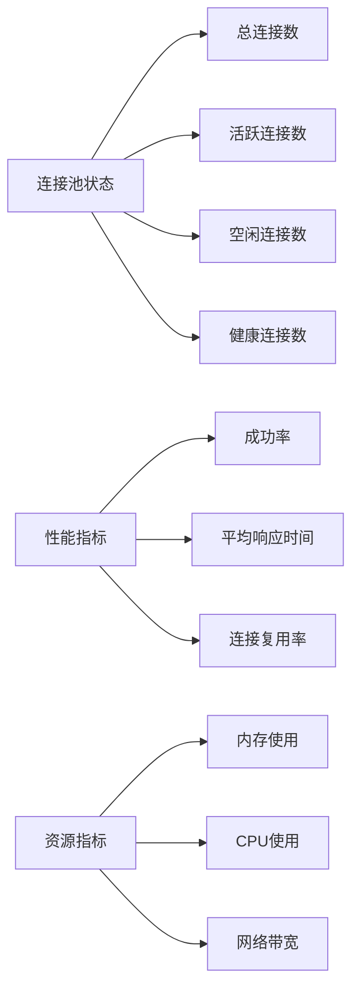

# 连接池容量配置指南

<cite>
**本文档引用的文件**
- [config.toml](file://config/config.toml)
- [GoogleEarthClient/config/config.toml](file://GoogleEarthClient/config/config.toml)
- [utlshotconnpool.go](file://utlsclient/utlshotconnpool.go)
- [connection_manager.go](file://utlsclient/connection_manager.go)
- [constants.go](file://utlsclient/constants.go)
- [热连接池性能测试报告.md](file://test/reports/热连接池性能测试报告.md)
- [test_ip_pool_performance.go](file://test/test_ip_pool_performance.go)
- [example_hotconnpool_usage.go](file://examples/utlsclient/example_hotconnpool_usage.go)
</cite>

## 目录
1. [概述](#概述)
2. [核心参数详解](#核心参数详解)
3. [默认配置分析](#默认配置分析)
4. [性能测试结果](#性能测试结果)
5. [容量调优策略](#容量调优策略)
6. [监控与预警](#监控与预警)
7. [最佳实践](#最佳实践)
8. [故障排除](#故障排除)

## 概述

连接池容量配置是影响系统性能和资源利用率的关键因素。本文档基于ZeroMaps项目的热连接池实现，提供详细的容量参数调优指南，帮助用户根据业务需求合理配置连接池参数。

## 核心参数详解

### MaxConnections（最大连接数）

**定义**: 连接池允许的最大连接总数。

**作用机制**:
- 控制整个连接池的容量上限
- 防止因连接过多导致系统资源耗尽
- 影响内存占用和并发处理能力

**计算公式**:
```
内存占用 ≈ 连接数 × 每连接平均内存消耗
```

**影响因素**:
- 目标服务的响应延迟
- 并发请求数量
- 系统可用内存
- 连接复用效率

### MaxConnsPerHost（每个主机最大连接数）

**定义**: 对单个目标主机允许的最大连接数。

**作用机制**:
- 防止单个主机占用过多连接资源
- 平衡不同主机间的连接分配
- 避免因某个主机故障影响整体性能

**配置原则**:
- 通常设置为1-10个连接
- 根据目标服务的并发能力和响应特性调整
- 考虑HTTP/2多路复用的优势

### MaxIdleConns（最大空闲连接数）

**定义**: 连接池中允许保留的最大空闲连接数量。

**作用机制**:
- 提供快速响应能力
- 减少频繁创建和销毁连接的开销
- 平衡内存占用和响应性能

**配置策略**:
- 基于预期的并发模式
- 考虑连接的生命周期管理
- 与清理机制协同工作

## 默认配置分析

### 基础配置对比

| 参数 | 默认值 | GoogleEarth配置 | 适用场景 |
|------|--------|----------------|----------|
| MaxConnections | 100 | 100 | 中等规模并发 |
| MaxConnsPerHost | 10 | 10 | 单主机均衡 |
| MaxIdleConns | 20 | 20 | 平衡响应与内存 |

### 时间相关参数

| 参数 | 默认值 | 作用说明 |
|------|--------|----------|
| ConnTimeout | 30秒 | 连接建立超时 |
| IdleTimeout | 60秒 | 空闲连接超时 |
| MaxLifetime | 300秒 | 连接最大生命周期 |
| HealthCheckInterval | 30秒 | 健康检查间隔 |

**节来源**
- [config.toml](file://config/config.toml#L5-L15)
- [GoogleEarthClient/config/config.toml](file://GoogleEarthClient/config/config.toml#L89-L95)

## 性能测试结果

### 1631个IP场景下的负载表现

基于完整的性能测试报告，系统在1631个IP场景下的表现如下：

#### 预热阶段性能
- **总IP数**: 1,631个（840 IPv4 + 791 IPv6）
- **预热成功率**: 98.8%
- **预热耗时**: 21.5秒（平均13.3ms/连接）
- **连接复用率**: 100%

#### 热连接复用性能
- **各轮次成功率**: 100%
- **响应时间**: 200-800ms（取决于网络和数据大小）
- **性能提升**: 比新建连接快3-6倍

#### 关键技术实现
- **HTTP/2支持**: 每个IP只建立1个TLS连接，被4个URL请求复用
- **连接复用**: 总共6524次请求，实际只建立了1611个TLS连接
- **IPv6完整支持**: 成功支持791个IPv6地址的连接

**节来源**
- [热连接池性能测试报告.md](file://test/reports/热连接池性能测试报告.md#L70-L170)

## 容量调优策略

### 基于响应延迟的调优

#### 低延迟服务（<100ms）
```
MaxConnections = 并发数 × 1.5
MaxConnsPerHost = 3-5
MaxIdleConns = 并发数 × 0.5
```

#### 中等延迟服务（100-500ms）
```
MaxConnections = 并发数 × 2
MaxConnsPerHost = 5-8
MaxIdleConns = 并发数 × 0.3
```

#### 高延迟服务（>500ms）
```
MaxConnections = 并发数 × 3
MaxConnsPerHost = 8-10
MaxIdleConns = 并发数 × 0.2
```

### 基于业务并发量的调优

#### 高并发场景（>1000 QPS）
```yaml
MaxConnections: 500
MaxConnsPerHost: 5
MaxIdleConns: 100
```

#### 中等并发场景（100-1000 QPS）
```yaml
MaxConnections: 200
MaxConnsPerHost: 3
MaxIdleConns: 50
```

#### 低并发场景（<100 QPS）
```yaml
MaxConnections: 100
MaxConnsPerHost: 2
MaxIdleConns: 20
```

### 内存占用估算

#### 每连接内存消耗
- **基础连接**: ~10KB
- **TLS握手**: ~50KB
- **HTTP/2连接**: ~100KB
- **附加信息**: ~5KB

#### 总内存计算
```
总内存 = MaxConnections × (基础连接 + TLS握手 + HTTP/2) + 附加信息
```

## 监控与预警

### 关键监控指标

#### 连接池状态指标


#### 预警阈值建议

| 指标 | 警告阈值 | 严重阈值 | 处理建议 |
|------|----------|----------|----------|
| 连接池使用率 | >80% | >90% | 考虑扩容或优化 |
| 成功率 | <95% | <90% | 检查网络和服务状态 |
| 平均响应时间 | >2s | >5s | 优化连接配置或检查服务 |
| 连接复用率 | <50% | <30% | 调整MaxIdleConns参数 |

### 监控实现

#### 统计信息获取
```go
stats := pool.GetStats()
fmt.Printf("总连接数: %d, 活跃连接: %d, 空闲连接: %d\n",
    stats.TotalConnections, stats.ActiveConnections, stats.IdleConnections)
fmt.Printf("成功率: %.2f%%, 连接复用率: %.2f%%\n",
    stats.SuccessRate*100, stats.ConnReuseRate*100)
```

#### 健康状态检查
```go
if !pool.IsHealthy() {
    logger.Warn("连接池健康状态异常")
    // 触发告警或自动修复
}
```

**节来源**
- [utlshotconnpool.go](file://utlsclient/utlshotconnpool.go#L261-L277)
- [utlshotconnpool.go](file://utlsclient/utlshotconnpool.go#L1365-L1370)

## 最佳实践

### 配置优化建议

#### 1. 分阶段配置
```yaml
# 开发环境
development:
  max_connections: 50
  max_conns_per_host: 3
  max_idle_conns: 10
  
# 生产环境
production:
  max_connections: 200
  max_conns_per_host: 5
  max_idle_conns: 50
```

#### 2. 动态调整策略
```go
// 根据监控数据动态调整
func adjustPoolCapacity(currentStats PoolStats) {
    if currentStats.SuccessRate < 0.95 {
        // 增加连接数
        newConfig.MaxConnections += 50
    }
    
    if currentStats.AvgResponseTime > 2*time.Second {
        // 增加空闲连接
        newConfig.MaxIdleConns += 20
    }
    
    pool.UpdateConfig(newConfig)
}
```

#### 3. 预热机制
```go
// 在启动时预热连接
err := pool.PreWarmConnections("target-host.com", 50)
if err != nil {
    logger.Error("预热连接失败: %v", err)
}
```

### 性能优化技巧

#### 连接复用优化
- 确保HTTP/2协议支持
- 合理设置连接超时时间
- 实施健康检查机制

#### 内存管理
- 定期清理过期连接
- 监控内存使用趋势
- 实施连接池大小限制

**节来源**
- [example_hotconnpool_usage.go](file://examples/utlsclient/example_hotconnpool_usage.go#L118-L122)
- [utlshotconnpool.go](file://utlsclient/utlshotconnpool.go#L1410-L1430)

## 故障排除

### 常见问题及解决方案

#### 1. 连接池饱和
**症状**: 连接获取失败，返回"连接池已满"错误
**原因**: MaxConnections设置过小
**解决方案**:
- 增加MaxConnections值
- 优化连接复用策略
- 检查连接泄漏问题

#### 2. 连接超时
**症状**: 请求超时，连接频繁断开
**原因**: ConnTimeout设置过短
**解决方案**:
- 增加ConnTimeout时间
- 检查网络稳定性
- 优化目标服务性能

#### 3. 内存占用过高
**症状**: 系统内存不足，连接池崩溃
**原因**: 连接数过多或连接生命周期过长
**解决方案**:
- 减少MaxConnections
- 缩短MaxLifetime
- 增加内存监控

### 调试工具

#### 连接状态诊断
```go
// 获取连接池详细信息
stats := pool.GetStats()
logger.Info("连接池统计: %+v", stats)

// 获取特定主机的连接信息
connections := pool.connManager.GetConnectionsForHost("target-host.com")
for _, conn := range connections {
    logger.Debug("连接信息: IP=%s, 请求次数=%d, 健康状态=%v",
        conn.targetIP, conn.requestCount, conn.healthy)
}
```

#### 性能分析
```go
// 性能测试
start := time.Now()
for i := 0; i < 1000; i++ {
    conn, err := pool.GetConnection("target-host.com")
    if err != nil {
        logger.Error("获取连接失败: %v", err)
        continue
    }
    
    // 使用连接...
    pool.PutConnection(conn)
}
elapsed := time.Since(start)
logger.Info("1000次连接操作耗时: %v", elapsed)
```

**节来源**
- [connection_manager.go](file://utlsclient/connection_manager.go#L76-L91)
- [utlshotconnpool.go](file://utlsclient/utlshotconnpool.go#L1365-L1370)

## 结论

合理的连接池容量配置是系统性能优化的重要环节。通过本文档提供的调优指南，用户可以根据具体的业务场景和性能要求，制定最适合的连接池配置策略。关键要点包括：

1. **参数理解**: 深入理解MaxConnections、MaxConnsPerHost、MaxIdleConns的作用机制
2. **性能测试**: 基于实际负载进行充分的性能测试
3. **动态调整**: 根据监控数据动态优化配置参数
4. **持续监控**: 建立完善的监控体系，及时发现和解决问题

正确的配置不仅能提升系统性能，还能有效控制资源消耗，为业务系统的稳定运行提供保障。