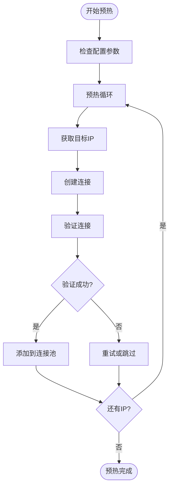
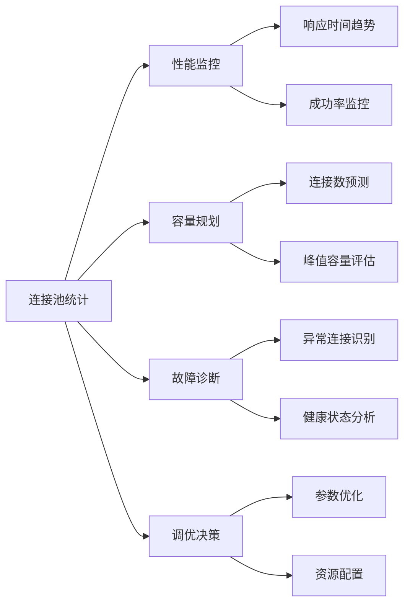
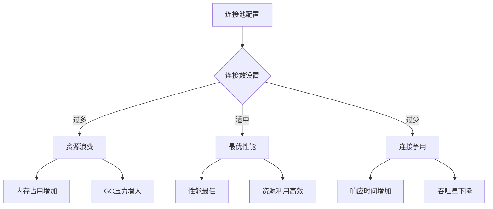
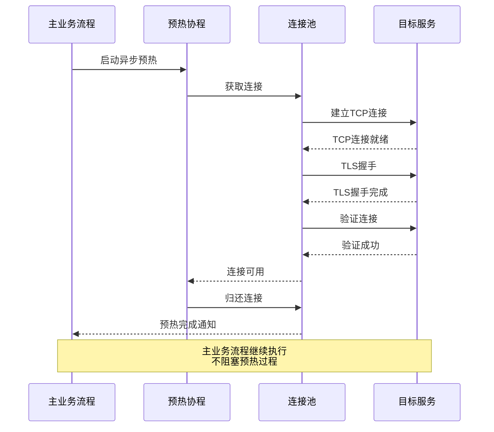
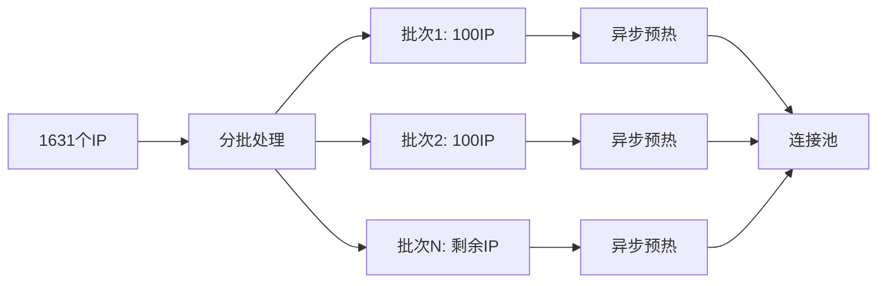
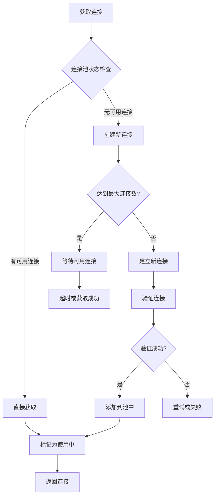
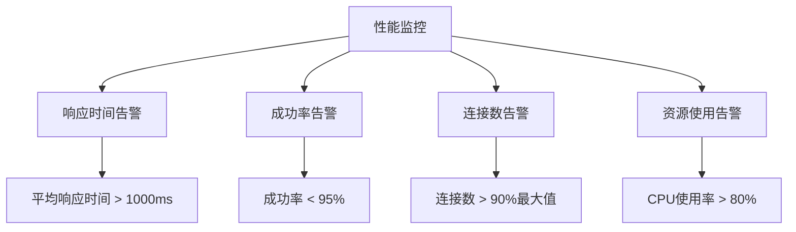
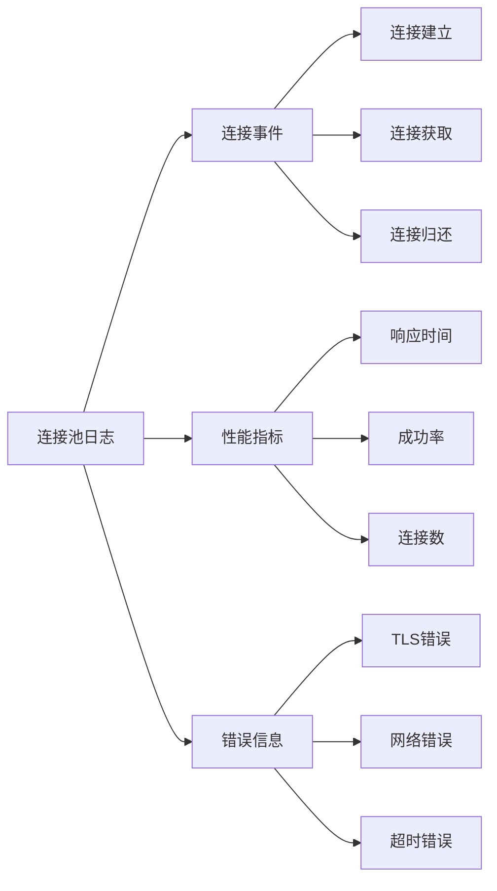

# 连接池调优指南

<cite>
**本文档引用的文件**
- [test/test_ip_pool_performance.go](file://test/test_ip_pool_performance.go)
- [utlsclient/utlshotconnpool.go](file://utlsclient/utlshotconnpool.go)
- [examples/utlsclient/example_hotconnpool_usage.go](file://examples/utlsclient/example_hotconnpool_usage.go)
- [test/reports/热连接池性能测试报告.md](file://test/reports/热连接池性能测试报告.md)
- [utlsclient/connection_manager.go](file://utlsclient/connection_manager.go)
- [config/config.go](file://config/config.go)
</cite>

## 目录
1. [概述](#概述)
2. [连接池核心配置参数](#连接池核心配置参数)
3. [连接池统计信息详解](#连接池统计信息详解)
4. [连接池调优策略](#连接池调优策略)
5. [异步预热机制](#异步预热机制)
6. [性能监控与最佳实践](#性能监控与最佳实践)
7. [故障排除指南](#故障排除指南)
8. [总结](#总结)

## 概述

连接池是现代网络应用中提升性能的关键技术，特别是在需要频繁建立和断开TCP连接的场景下。本文档基于crawler-platform项目的热连接池实现，提供详细的调优指导和最佳实践。

### 核心优势

- **性能提升**：通过连接复用，减少TLS握手开销，性能提升3-6倍
- **资源管理**：智能管理连接生命周期，避免资源浪费
- **高可用性**：自动健康检查和故障转移机制
- **并发友好**：支持高并发场景下的连接管理

## 连接池核心配置参数

### 最大连接数（MaxConnections）

| 参数 | 默认值 | 取值范围 | 说明 |
|------|--------|----------|------|
| MaxConnections | 100 | 1-1000+ | 连接池的最大连接总数限制 |

**调优建议**：
- **小规模应用**：50-100个连接
- **中等规模应用**：100-500个连接  
- **大规模应用**：500-1000+个连接

**计算公式**：
```
推荐MaxConnections = 并发用户数 × 1.5-2.0
```

### 空闲超时时间（IdleTimeout）

| 参数 | 默认值 | 取值范围 | 说明 |
|------|--------|----------|------|
| IdleTimeout | 60秒 | 10-300秒 | 连接空闲超过此时间后被回收 |

**调优策略**：
- **快速响应场景**：30-60秒
- **批量处理场景**：120-300秒
- **长连接场景**：600-1800秒

### 连接预热策略



**图表来源**
- [test/test_ip_pool_performance.go](file://test/test_ip_pool_performance.go#L60-L150)

**Section sources**
- [utlsclient/utlshotconnpool.go](file://utlsclient/utlshotconnpool.go#L170-L184)

## 连接池统计信息详解

### GetStats接口返回的统计指标

连接池提供了丰富的统计信息，通过`GetStats()`接口获取：

| 统计指标 | 类型 | 说明 | 监控意义 |
|----------|------|------|----------|
| TotalConnections | int | 总连接数 | 资源使用情况 |
| ActiveConnections | int | 活跃连接数 | 并发负载 |
| IdleConnections | int | 空闲连接数 | 资源利用率 |
| HealthyConnections | int | 健康连接数 | 连接质量 |
| TotalRequests | int64 | 总请求数 | 业务负载 |
| SuccessfulRequests | int64 | 成功请求数 | 服务质量 |
| FailedRequests | int64 | 失败请求数 | 故障诊断 |
| SuccessRate | float64 | 成功率 | 整体健康度 |
| AvgResponseTime | time.Duration | 平均响应时间 | 性能指标 |
| ConnReuseRate | float64 | 连接复用率 | 性能优化效果 |

### 统计信息的应用场景



**Section sources**
- [utlsclient/utlshotconnpool.go](file://utlsclient/utlshotconnpool.go#L261-L277)

## 连接池调优策略

### 基于响应特性的调优

#### 1. 网络延迟敏感型应用

**配置示例**：
```go
config := &PoolConfig{
    MaxConnections:    50,
    MaxConnsPerHost:   5,
    MaxIdleConns:      10,
    ConnTimeout:       5 * time.Second,
    IdleTimeout:       30 * time.Second,
    MaxLifetime:       120 * time.Second,
}
```

**适用场景**：
- 实时通信应用
- 在线游戏
- 视频会议系统

#### 2. 批量处理型应用

**配置示例**：
```go
config := &PoolConfig{
    MaxConnections:    200,
    MaxConnsPerHost:   20,
    MaxIdleConns:      50,
    ConnTimeout:       15 * time.Second,
    IdleTimeout:       120 * time.Second,
    MaxLifetime:       600 * time.Second,
}
```

**适用场景**：
- 数据导入导出
- 批量API调用
- 定时任务处理

### 资源浪费与连接争用的平衡



**调优原则**：
1. **预留缓冲**：连接数设置为实际需求的1.5-2.0倍
2. **动态调整**：根据监控数据动态调整连接池大小
3. **分层配置**：不同服务使用不同的连接池配置

**Section sources**
- [test/test_ip_pool_performance.go](file://test/test_ip_pool_performance.go#L385-L394)

## 异步预热机制

### 预热耗时分析

基于测试报告显示，1631个IP的预热耗时为21.5秒，平均每个连接13.3ms。这个数据对于设计异步预热策略至关重要。

### 异步预热实现策略



**图表来源**
- [test/test_ip_pool_performance.go](file://test/test_ip_pool_performance.go#L60-L150)

### 异步预热的最佳实践

#### 1. 并发控制逻辑

测试代码展示了有效的并发控制策略：

```go
// 控制并发数
if (ipIdx+1)%100 == 0 {
    time.Sleep(100 * time.Millisecond)
}
```

**建议的并发控制参数**：
- **IPv4预热**：每100个IP休眠100ms
- **IPv6预热**：每100个IP休眠200ms（IPv6更慢）
- **混合预热**：每100个IP休眠150ms

#### 2. 分批预热策略



#### 3. 预热优先级策略

**高优先级IP**：
- 低延迟的IP地址
- 高成功率的IP地址
- 业务关键路径上的IP

**低优先级IP**：
- 高延迟的IP地址
- 低成功率的IP地址
- 备用IP地址

**Section sources**
- [test/test_ip_pool_performance.go](file://test/test_ip_pool_performance.go#L143-L147)

## 性能监控与最佳实践

### 连接获取与归还的最佳实践

#### 1. 获取连接的最佳实践



#### 2. 归还连接的最佳实践

**关键要点**：
- **及时归还**：使用完成后立即归还连接
- **健康检查**：归还前检查连接状态
- **异常处理**：遇到错误时标记连接为不健康

#### 3. 并发控制逻辑

测试代码展示了有效的并发控制：

```go
// 业务请求阶段的并发控制
if (ipIdx+1)%50 == 0 {
    time.Sleep(50 * time.Millisecond)
}
```

**建议的并发控制策略**：
- **IPv4请求**：每50个IP休眠50ms
- **IPv6请求**：每50个IP休眠100ms
- **混合请求**：每50个IP休眠75ms

### 性能监控指标

#### 1. 关键性能指标（KPI）

| 指标类别 | 具体指标 | 目标值 | 监控频率 |
|----------|----------|--------|----------|
| 响应性能 | 平均响应时间 | < 500ms | 实时 |
| 响应性能 | P95响应时间 | < 1000ms | 实时 |
| 可用性 | 连接成功率 | > 99% | 实时 |
| 可用性 | 连接池健康度 | > 95% | 实时 |
| 资源效率 | 连接复用率 | > 80% | 实时 |
| 资源效率 | 平均活跃连接数 | < 70% | 实时 |

#### 2. 监控告警设置



**Section sources**
- [test/test_ip_pool_performance.go](file://test/test_ip_pool_performance.go#L285-L289)

## 故障排除指南

### 常见问题及解决方案

#### 1. 连接池性能问题

**症状**：响应时间过长，吞吐量下降

**排查步骤**：
1. 检查连接池统计信息
2. 分析连接复用率
3. 检查连接健康状态
4. 监控资源使用情况

**解决方案**：
- 增加最大连接数
- 调整空闲超时时间
- 优化预热策略
- 检查网络延迟

#### 2. 连接泄漏问题

**症状**：连接数持续增长，最终耗尽资源

**排查方法**：
- 监控活跃连接数
- 检查连接归还逻辑
- 分析连接使用模式

**解决方案**：
- 实现连接超时机制
- 添加连接泄漏检测
- 优化连接生命周期管理

#### 3. 预热失败问题

**症状**：预热阶段大量连接失败

**常见原因**：
- 网络不稳定
- 目标服务限制
- TLS配置问题

**解决方案**：
- 增加重试机制
- 实现降级策略
- 优化TLS配置

### 调试工具和技巧

#### 1. 日志分析



#### 2. 性能分析工具

**推荐工具**：
- Go pprof：分析CPU和内存使用
- Prometheus：监控指标收集
- Grafana：可视化监控面板

**Section sources**
- [test/reports/热连接池性能测试报告.md](file://test/reports/热连接池性能测试报告.md#L340-L389)

## 总结

连接池调优是一个需要综合考虑性能、资源和稳定性因素的复杂过程。通过本文档提供的指导，可以实现：

### 核心收益

1. **显著性能提升**：通过连接复用，性能提升3-6倍
2. **资源高效利用**：避免连接争用和资源浪费
3. **高可用保障**：完善的健康检查和故障处理机制
4. **灵活配置**：支持动态调整和监控

### 最佳实践总结

1. **合理配置参数**：根据业务特点调整连接池参数
2. **实施异步预热**：避免阻塞主业务流程
3. **持续监控**：建立完善的监控和告警体系
4. **动态调优**：基于监控数据持续优化配置

### 未来发展方向

随着业务的发展和技术的进步，连接池技术将继续演进，重点关注：
- **智能化调优**：基于机器学习的自动调优
- **云原生支持**：更好的容器化和微服务集成
- **边缘计算**：适应分布式和边缘部署场景
- **安全增强**：更强的安全防护和隐私保护

通过遵循本文档的指导原则和最佳实践，可以构建高性能、高可用的连接池系统，为业务发展提供坚实的技术支撑。