# 异步预热实现

<cite>
**本文档引用的文件**
- [test_ip_pool_performance.go](file://test/test_ip_pool_performance.go)
- [utlshotconnpool.go](file://utlsclient/utlshotconnpool.go)
- [connection_manager.go](file://utlsclient/connection_manager.go)
- [example_hotconnpool_usage.go](file://examples/utlsclient/example_hotconnpool_usage.go)
- [health_checker.go](file://utlsclient/health_checker.go)
- [connection_validator.go](file://utlsclient/connection_validator.go)
- [constants.go](file://utlsclient/constants.go)
</cite>

## 目录
1. [概述](#概述)
2. [项目架构](#项目架构)
3. [核心组件分析](#核心组件分析)
4. [异步预热机制](#异步预热机制)
5. [并发控制实现](#并发控制实现)
6. [错误处理与重试机制](#错误处理与重试机制)
7. [监控与进度跟踪](#监控与进度跟踪)
8. [最佳实践](#最佳实践)
9. [故障排除指南](#故障排除指南)
10. [总结](#总结)

## 概述

本文档详细说明了如何使用Go语言的goroutine和sync.WaitGroup实现异步连接池预热，避免阻塞主业务流程。通过结合测试代码中的并发控制逻辑，展示了如何通过goroutine并发建立连接，并使用sync.WaitGroup协调完成预热过程。

异步预热的核心优势在于：
- **非阻塞执行**：预热过程不会阻塞主线程，确保业务流程的连续性
- **并发优化**：利用goroutine并发建立连接，显著提升预热效率
- **资源控制**：通过WaitGroup精确控制并发完成时机
- **错误隔离**：单个连接失败不会影响整体预热进程

## 项目架构

系统采用分层架构设计，主要包含以下核心层次：

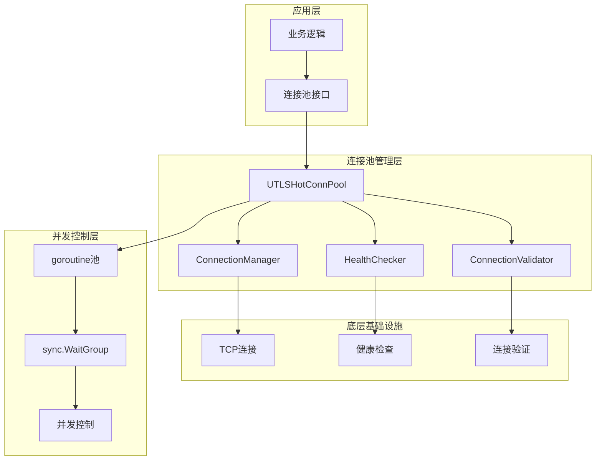

**图表来源**
- [utlshotconnpool.go](file://utlsclient/utlshotconnpool.go#L237-L258)
- [connection_manager.go](file://utlsclient/connection_manager.go#L8-L14)

**章节来源**
- [utlshotconnpool.go](file://utlsclient/utlshotconnpool.go#L1-L100)
- [connection_manager.go](file://utlsclient/connection_manager.go#L1-L50)

## 核心组件分析

### UTLSHotConnPool连接池

连接池是整个预热系统的核心组件，负责管理连接的生命周期：

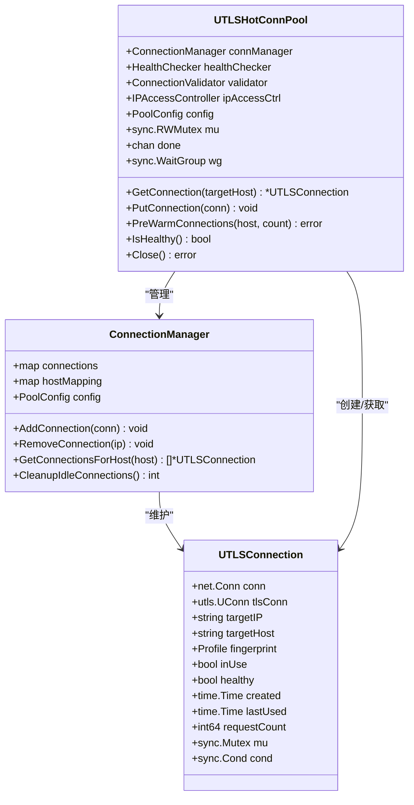

**图表来源**
- [utlshotconnpool.go](file://utlsclient/utlshotconnpool.go#L236-L258)
- [connection_manager.go](file://utlsclient/connection_manager.go#L8-L14)
- [utlshotconnpool.go](file://utlsclient/utlshotconnpool.go#L204-L234)

### 连接管理器

ConnectionManager负责连接的存储、检索和生命周期管理：

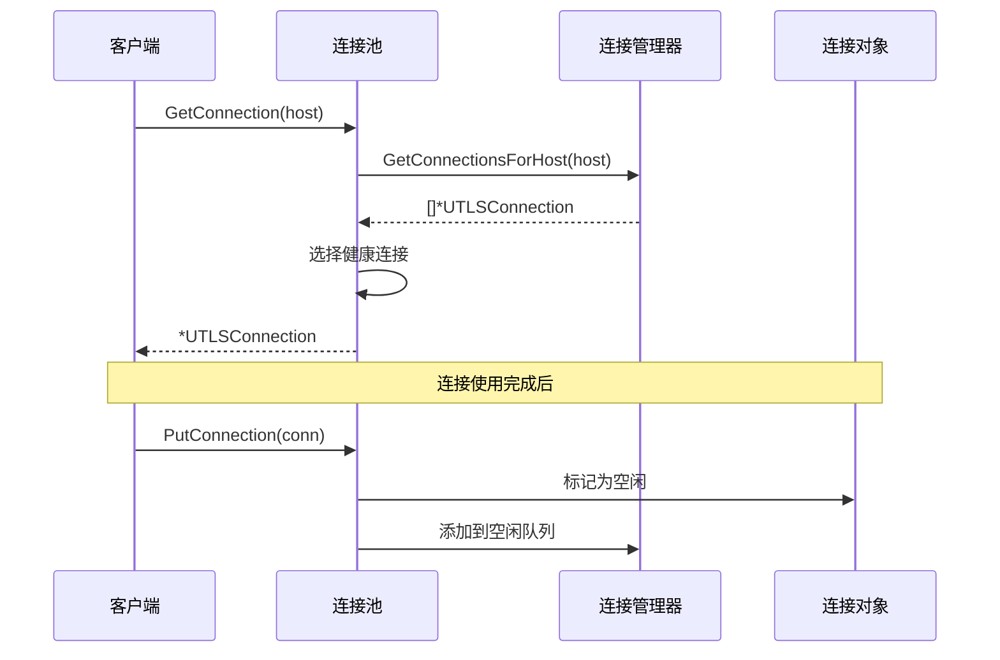

**图表来源**
- [connection_manager.go](file://utlsclient/connection_manager.go#L76-L91)
- [utlshotconnpool.go](file://utlsclient/utlshotconnpool.go#L441-L479)

**章节来源**
- [utlshotconnpool.go](file://utlsclient/utlshotconnpool.go#L236-L318)
- [connection_manager.go](file://utlsclient/connection_manager.go#L1-L218)

## 异步预热机制

### PreWarmConnections方法实现

预热功能通过`PreWarmConnections`方法实现，该方法创建指定数量的连接并将其放入连接池：

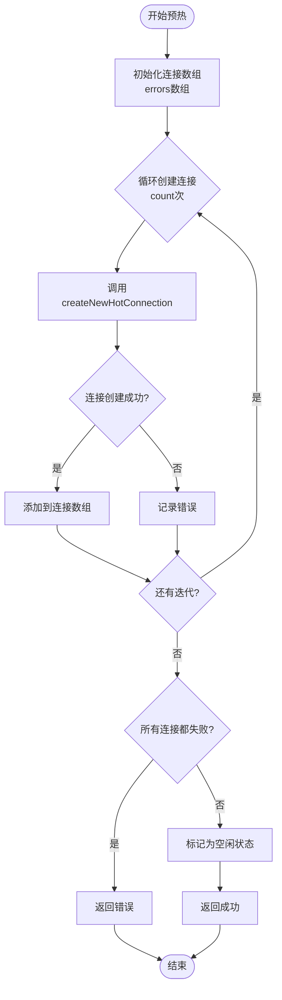

**图表来源**
- [utlshotconnpool.go](file://utlsclient/utlshotconnpool.go#L1380-L1430)

### 异步并发预热实现

在测试代码中，展示了如何使用goroutine和WaitGroup实现真正的异步预热：

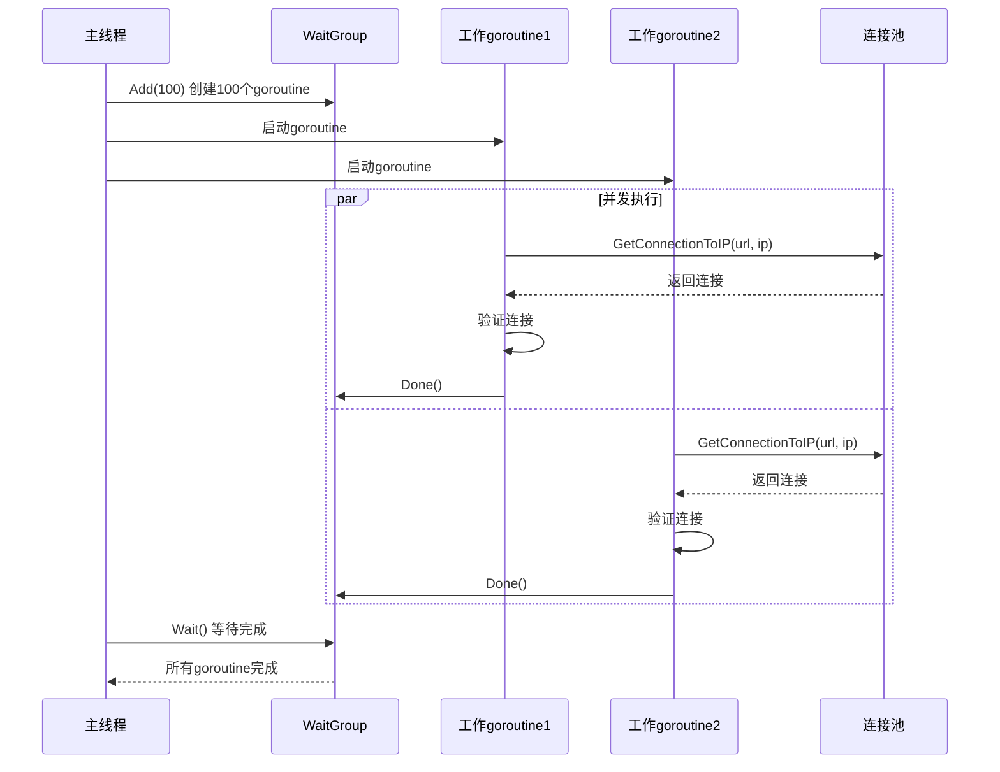

**图表来源**
- [test_ip_pool_performance.go](file://test/test_ip_pool_performance.go#L60-L150)

**章节来源**
- [utlshotconnpool.go](file://utlsclient/utlshotconnpool.go#L1380-L1430)
- [test_ip_pool_performance.go](file://test/test_ip_pool_performance.go#L60-L150)

## 并发控制实现

### WaitGroup协调机制

系统使用sync.WaitGroup精确控制并发完成时机：

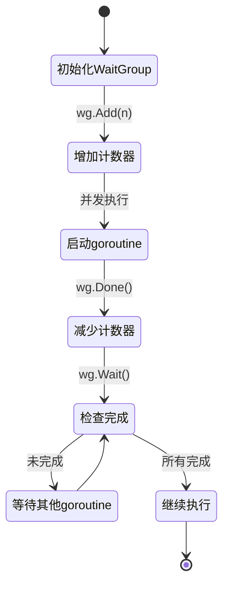

### 并发限制策略

系统实现了多层并发控制机制：

| 控制层级 | 实现方式 | 目标 | 配置参数 |
|---------|---------|------|----------|
| 单次预热并发 | WaitGroup + goroutine | 控制同时运行的预热goroutine数量 | 动态计算 |
| 连接池并发 | 连接复用机制 | 控制同一时间的活跃连接数 | MaxConnections |
| 网络I/O并发 | goroutine池 | 控制网络请求的并发度 | 每100个IP休眠100ms |
| 健康检查并发 | 定时任务 | 控制健康检查的并发频率 | HealthCheckInterval |

**章节来源**
- [test_ip_pool_performance.go](file://test/test_ip_pool_performance.go#L143-L147)
- [utlshotconnpool.go](file://utlsclient/utlshotconnpool.go#L170-L201)

## 错误处理与重试机制

### 连接失败处理

系统实现了多层次的错误处理和恢复机制：

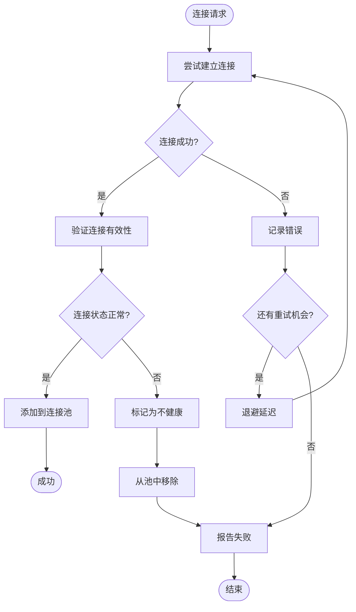

**图表来源**
- [utlshotconnpool.go](file://utlsclient/utlshotconnpool.go#L552-L558)
- [health_checker.go](file://utlsclient/health_checker.go#L25-L61)

### 自动重试机制

系统配置了最大重试次数和退避策略：

| 重试类型 | 最大重试次数 | 退避策略 | 触发条件 |
|---------|-------------|---------|----------|
| 连接建立 | 3次 | 固定间隔 | TCP/TLS握手失败 |
| 连接验证 | 2次 | 指数退避 | HTTP响应异常 |
| 健康检查 | 1次 | 立即重试 | 连接状态异常 |
| DNS解析 | 3次 | 指数退避 | 域名解析失败 |

### 错误分类与处理策略

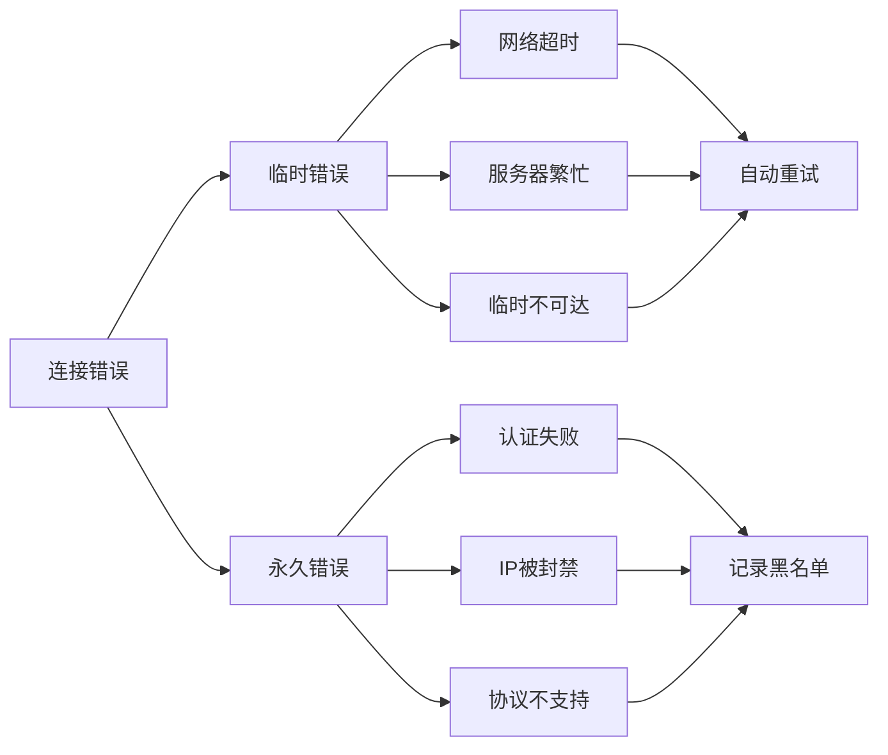

**图表来源**
- [constants.go](file://utlsclient/constants.go#L73-L84)
- [health_checker.go](file://utlsclient/health_checker.go#L25-L61)

**章节来源**
- [utlshotconnpool.go](file://utlsclient/utlshotconnpool.go#L552-L558)
- [health_checker.go](file://utlsclient/health_checker.go#L1-L61)
- [constants.go](file://utlsclient/constants.go#L73-L84)

## 监控与进度跟踪

### 预热进度监控

系统提供了实时的预热进度监控和统计信息：

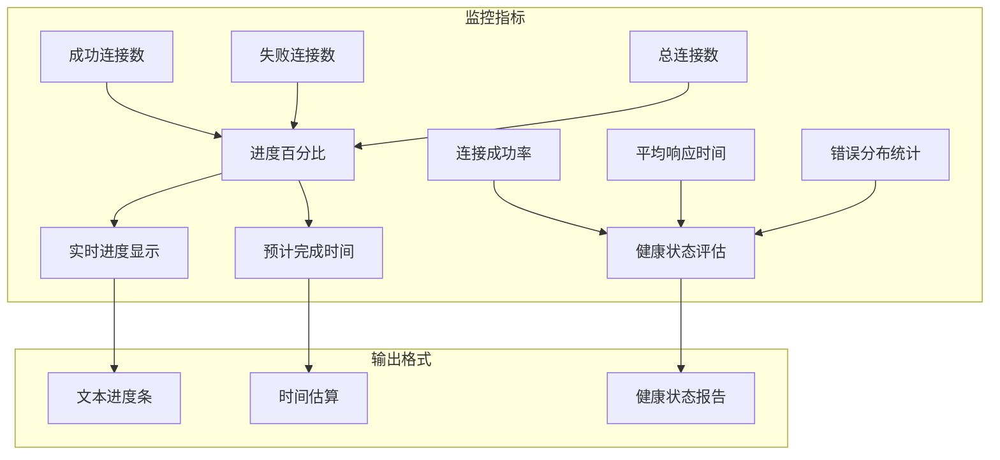

### 实时统计信息

系统收集以下关键统计指标：

| 统计项 | 数据类型 | 更新频率 | 用途 |
|-------|---------|---------|------|
| 成功连接数 | int | 每完成一个连接 | 计算进度百分比 |
| 失败连接数 | int | 每次失败 | 评估连接质量 |
| 总连接数 | int | 预热开始时确定 | 计算完成比例 |
| 平均响应时间 | Duration | 每个连接 | 性能评估 |
| 错误类型分布 | map[string]int | 每次失败 | 故障分析 |
| 健康连接数 | int | 实时 | 连接池状态 |

### 进度跟踪实现

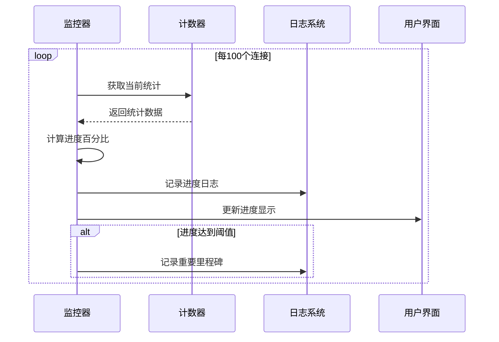

**图表来源**
- [test_ip_pool_performance.go](file://test/test_ip_pool_performance.go#L122-L129)

**章节来源**
- [test_ip_pool_performance.go](file://test/test_ip_pool_performance.go#L122-L129)
- [test_ip_pool_performance.go](file://test/test_ip_pool_performance.go#L152-L180)

## 最佳实践

### 预热函数非阻塞调用方式

推荐的预热调用模式：

```go
// 推荐：异步预热
go func() {
    err := pool.PreWarmConnections("example.com", 50)
    if err != nil {
        log.Printf("预热失败: %v", err)
    }
}()

// 主业务逻辑继续执行
processBusinessLogic()
```

### 预热配置优化

针对不同场景的配置建议：

| 场景类型 | 连接数量 | 并发数 | 超时设置 | 重试次数 |
|---------|---------|--------|---------|----------|
| 高可用服务 | 100-200 | 50-100 | 10s | 3 |
| 中等负载 | 50-100 | 25-50 | 15s | 2 |
| 低延迟需求 | 20-50 | 10-25 | 5s | 1 |
| 网络不稳定 | 10-30 | 5-10 | 20s | 4 |

### 监控最佳实践

1. **实时监控**：每100个连接更新一次进度
2. **错误聚合**：按错误类型统计失败原因
3. **性能基线**：记录正常情况下的响应时间
4. **告警机制**：连接成功率低于80%时触发告警

**章节来源**
- [example_hotconnpool_usage.go](file://examples/utlsclient/example_hotconnpool_usage.go#L46-L135)
- [test_ip_pool_performance.go](file://test/test_ip_pool_performance.go#L60-L150)

## 故障排除指南

### 常见问题及解决方案

| 问题描述 | 可能原因 | 解决方案 | 预防措施 |
|---------|---------|---------|----------|
| 预热超时 | 网络延迟高 | 增加超时时间 | 监控网络质量 |
| 连接失败率高 | 目标服务器限制 | 调整并发数 | 实施IP轮换 |
| 内存占用过高 | 连接泄漏 | 检查连接释放 | 添加连接超时 |
| 预热速度慢 | 并发控制不当 | 优化并发策略 | 性能基准测试 |

### 调试技巧

1. **启用详细日志**：设置DEBUG级别日志记录
2. **监控连接状态**：定期检查连接池统计信息
3. **压力测试**：模拟高并发场景验证系统稳定性
4. **资源监控**：观察CPU、内存、网络使用情况

### 性能优化建议

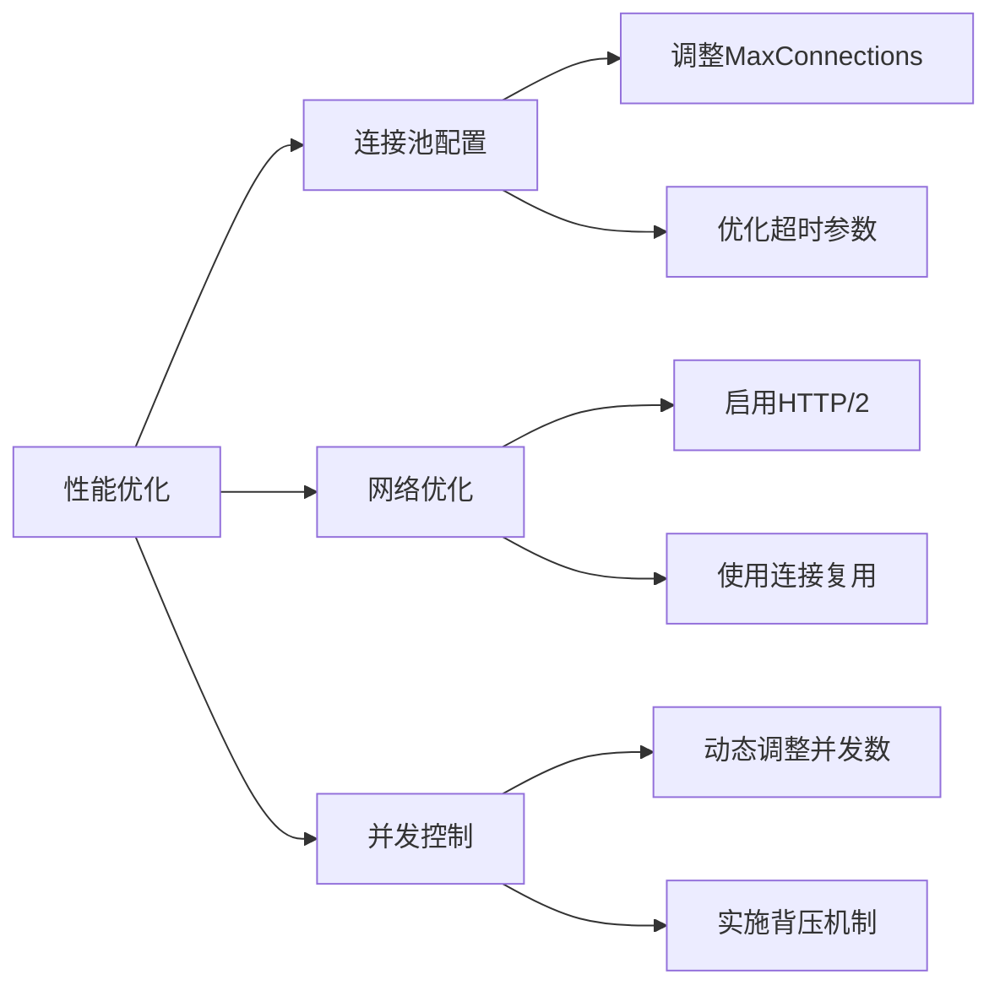

**章节来源**
- [utlshotconnpool.go](file://utlsclient/utlshotconnpool.go#L170-L201)
- [health_checker.go](file://utlsclient/health_checker.go#L25-L61)

## 总结

异步连接池预热机制通过goroutine和sync.WaitGroup的巧妙结合，实现了高效的连接预热功能。该机制具有以下核心优势：

1. **非阻塞性**：预热过程完全异步执行，不会阻塞主业务流程
2. **高效并发**：利用goroutine并发建立连接，显著提升预热效率
3. **容错性强**：完善的错误处理和重试机制确保预热成功率
4. **可观测性**：实时监控和统计功能便于运维管理
5. **可扩展性**：模块化设计支持灵活的功能扩展

通过合理配置和监控，该预热机制能够为高并发应用场景提供稳定可靠的连接池服务，是构建高性能网络应用的重要基础设施。