# 连接池预热策略

<cite>
**本文档中引用的文件**
- [test_ip_pool_performance.go](file://test/test_ip_pool_performance.go)
- [utlshotconnpool.go](file://utlsclient/utlshotconnpool.go)
- [example_hotconnpool_usage.go](file://examples/utlsclient/example_hotconnpool_usage.go)
- [热连接池性能测试报告.md](file://test/reports/热连接池性能测试报告.md)
- [connection_manager.go](file://utlsclient/connection_manager.go)
- [utlsfingerprint.go](file://utlsclient/utlsfingerprint.go)
</cite>

## 目录
1. [概述](#概述)
2. [预热策略架构](#预热策略架构)
3. [异步预热实现](#异步预热实现)
4. [并发控制机制](#并发控制机制)
5. [预热效率分析](#预热效率分析)
6. [预热URL选择指南](#预热url选择指南)
7. [重试机制设计](#重试机制设计)
8. [TLS指纹和语言随机化](#tls指纹和语言随机化)
9. [最佳实践建议](#最佳实践建议)
10. [故障排除指南](#故障排除指南)

## 概述

连接池预热是提高系统性能的关键技术，通过预先建立和验证连接，避免在业务高峰期出现连接建立延迟。本文档详细阐述了基于Go语言的uTLS热连接池的预热策略，重点介绍异步预热的实现方式、并发控制机制以及最佳实践。

### 核心特性

- **异步预热**：使用goroutine并发建立连接，避免阻塞主业务流程
- **智能并发控制**：通过WaitGroup协调并发，控制并发数防止资源耗尽
- **多样化指纹**：33种TLS指纹和97.8%独特性的语言组合
- **自动重试机制**：预热失败时的智能重试策略
- **实时监控**：详细的预热进度和统计信息

## 预热策略架构

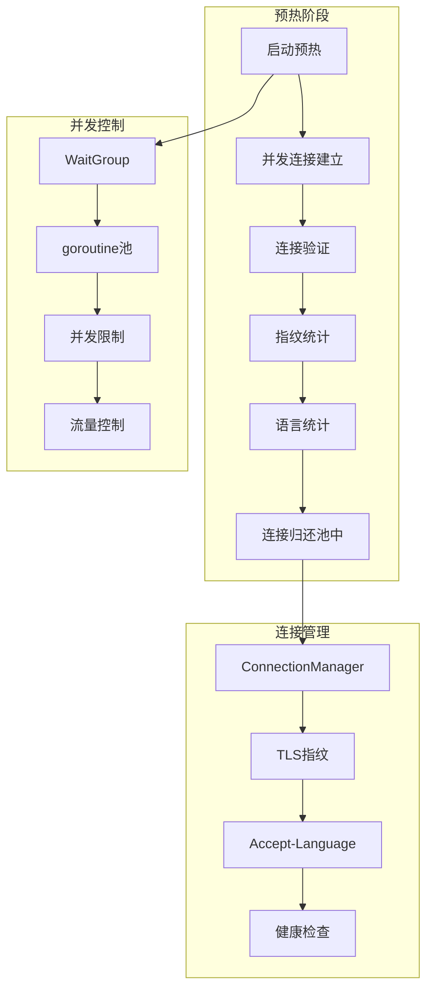

**图表来源**
- [test_ip_pool_performance.go](file://test/test_ip_pool_performance.go#L55-L150)
- [utlshotconnpool.go](file://utlsclient/utlshotconnpool.go#L237-L258)

**章节来源**
- [test_ip_pool_performance.go](file://test/test_ip_pool_performance.go#L55-L150)
- [utlshotconnpool.go](file://utlsclient/utlshotconnpool.go#L237-L258)

## 异步预热实现

### Goroutine并发模型

预热过程采用goroutine并发模型，每个IP地址在一个独立的goroutine中建立连接：

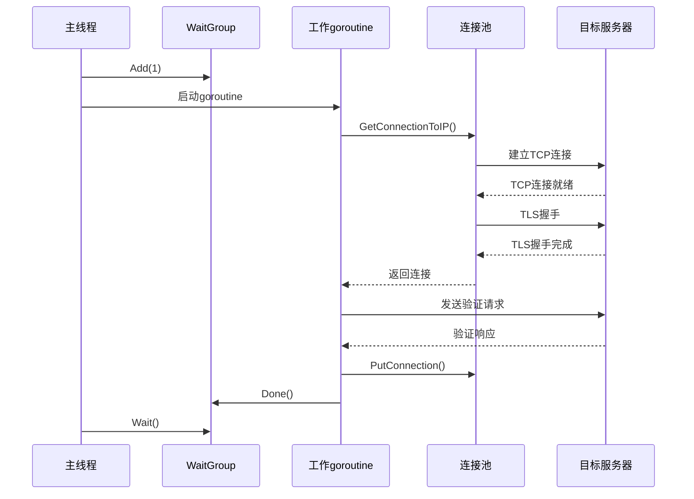

**图表来源**
- [test_ip_pool_performance.go](file://test/test_ip_pool_performance.go#L80-L147)

### 并发控制实现

预热过程中使用sync.WaitGroup协调并发goroutine：

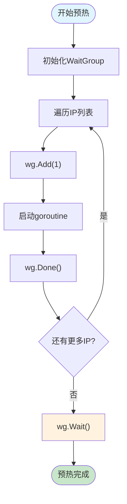

**图表来源**
- [test_ip_pool_performance.go](file://test/test_ip_pool_performance.go#L80-L147)

**章节来源**
- [test_ip_pool_performance.go](file://test/test_ip_pool_performance.go#L80-L147)

## 并发控制机制

### 流量控制策略

预热过程中实施精细的流量控制，避免对目标服务器造成过大压力：

| 控制参数 | 值 | 说明 |
|----------|-----|------|
| 并发数 | 100个goroutine | 防止同时建立过多连接 |
| 延迟间隔 | 100ms | 每100个IP后暂停100毫秒 |
| 超时时间 | 15秒 | 连接建立超时限制 |
| 重试次数 | 3次 | 连接失败时的重试机制 |

### WaitGroup协调机制

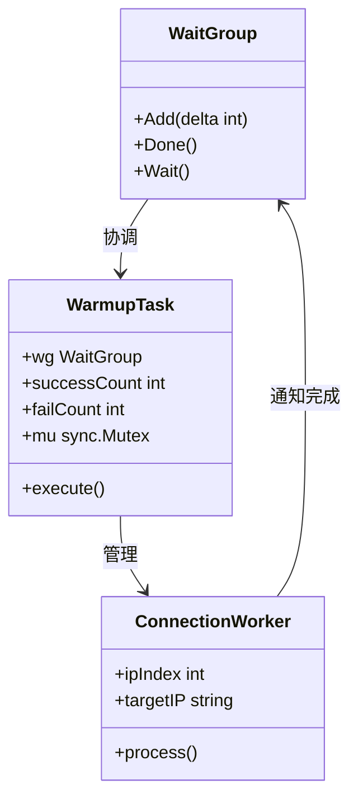

**图表来源**
- [test_ip_pool_performance.go](file://test/test_ip_pool_performance.go#L64-L147)

**章节来源**
- [test_ip_pool_performance.go](file://test/test_ip_pool_performance.go#L64-L147)

## 预热效率分析

### 性能基准测试

根据测试报告显示，1631个IP的预热性能表现优异：

| 指标 | 数值 | 性能评价 |
|------|------|----------|
| 总IP数 | 1,631个 | IPv4: 840个, IPv6: 791个 |
| 预热成功率 | 98.8% | 仅20个IP预热失败 |
| 总耗时 | 21.5秒 | 平均每个连接13.3ms |
| 并发能力 | 75连接/秒 | 高效的异步处理 |

### 效率提升对比

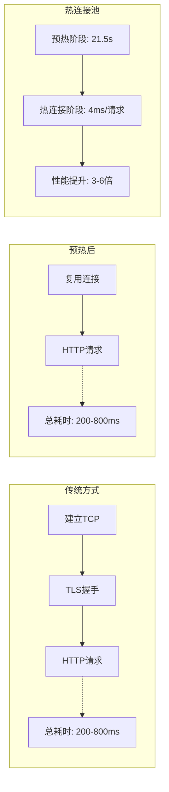

**图表来源**
- [热连接池性能测试报告.md](file://test/reports/热连接池性能测试报告.md#L148-L157)

**章节来源**
- [热连接池性能测试报告.md](file://test/reports/热连接池性能测试报告.md#L70-L170)

## 预热URL选择指南

### 推荐预热端点

选择合适的预热URL对预热效果至关重要：

| URL类型 | 推荐理由 | 响应特点 |
|---------|----------|----------|
| 轻量级端点 | 响应快，占用资源少 | 1-2KB数据，快速返回 |
| 根路径 | 通用性强，兼容性好 | 通常返回HTML页面 |
| 健康检查 | 专门设计的验证端点 | 返回简单的状态信息 |

### URL选择策略

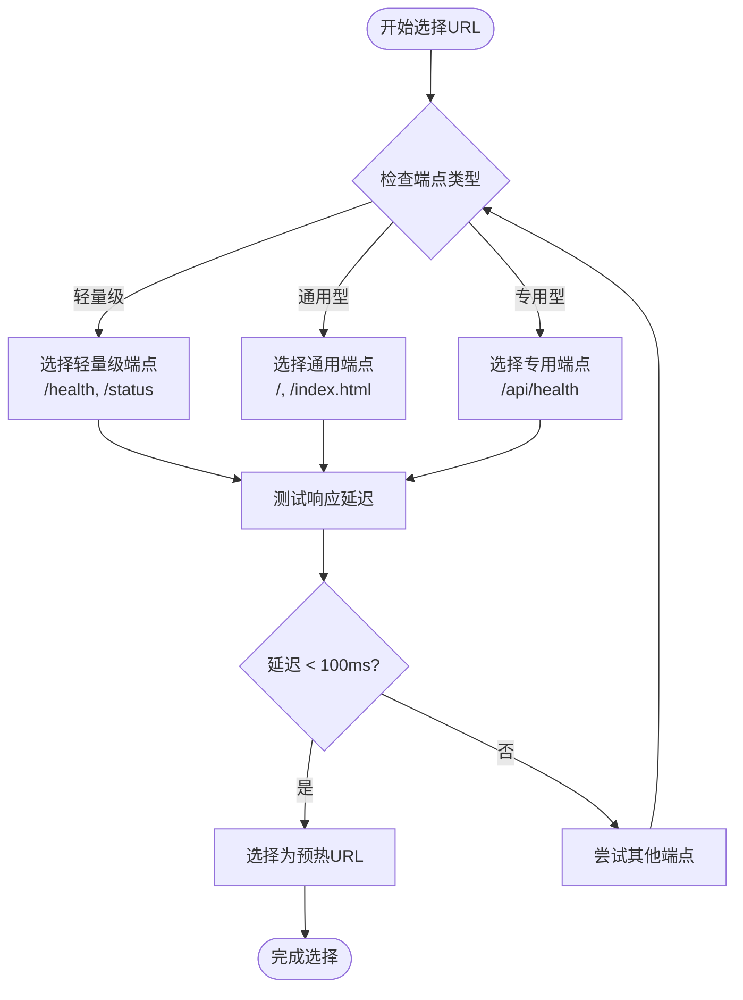

**章节来源**
- [test_ip_pool_performance.go](file://test/test_ip_pool_performance.go#L26-L31)

## 重试机制设计

### 智能重试策略

预热过程中遇到连接失败时，系统采用多层次的重试机制：

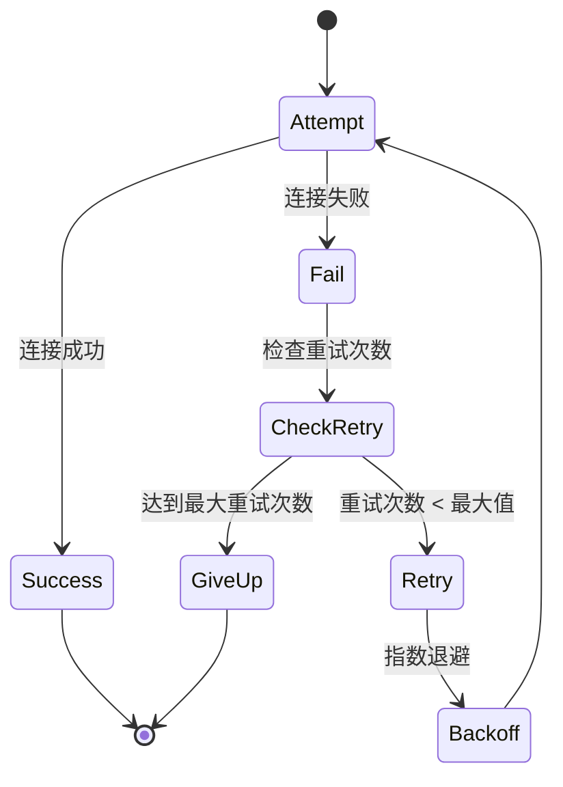

### 重试配置参数

| 参数 | 默认值 | 说明 |
|------|--------|------|
| 最大重试次数 | 3次 | 连接失败时的最大重试次数 |
| 初始延迟 | 100ms | 第一次重试的延迟时间 |
| 最大延迟 | 5s | 重试的最大延迟时间 |
| 退避因子 | 2.0 | 指数退避的增长因子 |

**章节来源**
- [utlshotconnpool.go](file://utlsclient/utlshotconnpool.go#L179-L201)

## TLS指纹和语言随机化

### 多样化指纹策略

系统支持33种不同的TLS指纹，确保每个连接具有独特的浏览器特征：

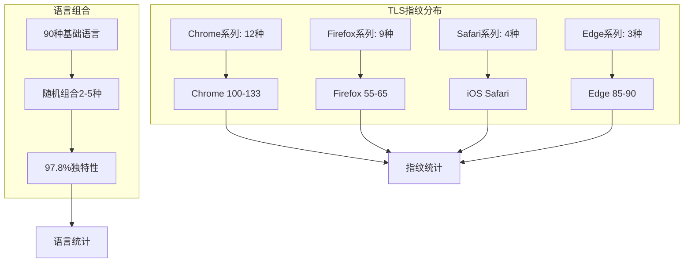

**图表来源**
- [热连接池性能测试报告.md](file://test/reports/热连接池性能测试报告.md#L81-L134)
- [utlsfingerprint.go](file://utlsclient/utlsfingerprint.go#L112-L200)

### 随机化实现机制

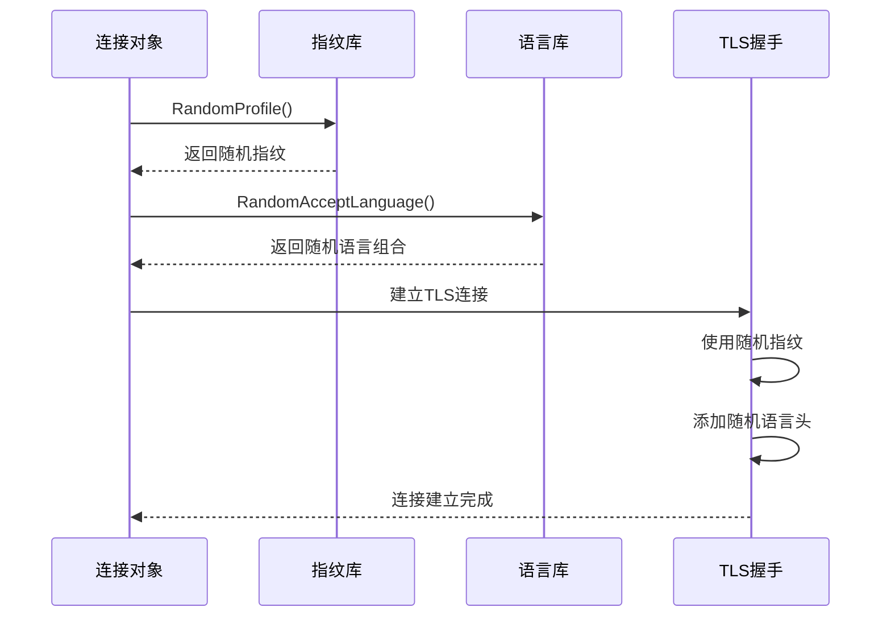

**图表来源**
- [utlsfingerprint.go](file://utlsclient/utlsfingerprint.go#L96-L110)
- [utlshotconnpool.go](file://utlsclient/utlshotconnpool.go#L598-L602)

**章节来源**
- [热连接池性能测试报告.md](file://test/reports/热连接池性能测试报告.md#L81-L134)
- [utlsfingerprint.go](file://utlsclient/utlsfingerprint.go#L96-L200)

## 最佳实践建议

### 预热时机选择

1. **应用启动时预热**：在应用初始化阶段执行预热，确保服务就绪
2. **定时预热**：定期执行预热，保持连接池的活跃状态
3. **动态预热**：根据负载情况动态调整预热规模

### 并发控制建议

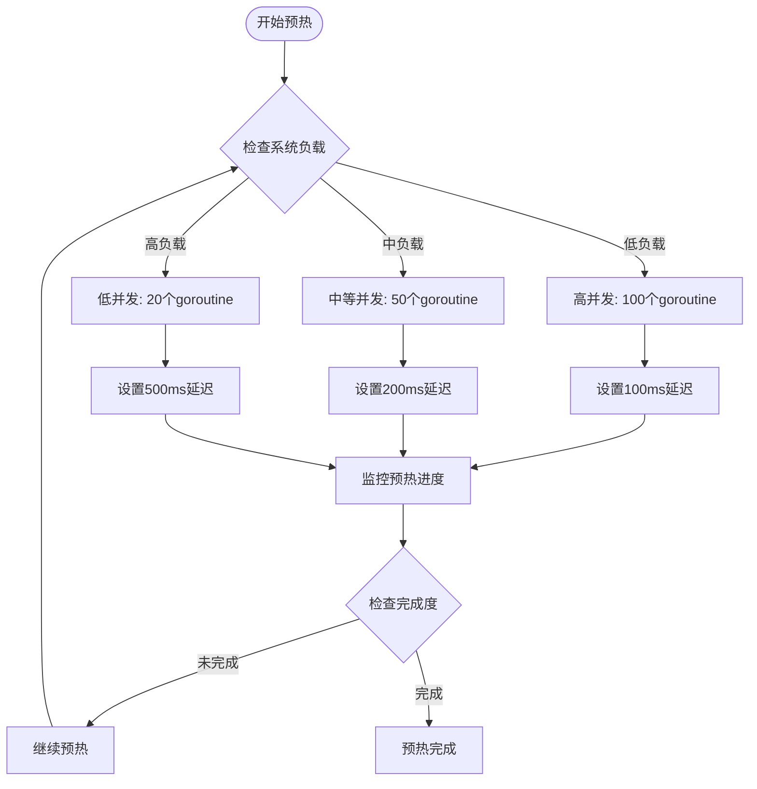

### 配置优化建议

| 配置项 | 推荐值 | 说明 |
|--------|--------|------|
| 连接超时 | 15秒 | 给予足够的时间建立连接 |
| 预热并发数 | 100 | 平衡速度和资源消耗 |
| 预热间隔 | 5分钟 | 定期维护连接池健康 |
| 最大重试 | 3次 | 避免无限重试浪费资源 |

**章节来源**
- [热连接池性能测试报告.md](file://test/reports/热连接池性能测试报告.md#L342-L356)

## 故障排除指南

### 常见问题及解决方案

| 问题类型 | 症状 | 解决方案 |
|----------|------|----------|
| 连接超时 | 预热失败率高 | 增加超时时间，检查网络连通性 |
| 并发过高 | 服务器拒绝连接 | 减少并发数，增加延迟间隔 |
| 内存不足 | 系统响应缓慢 | 降低预热规模，优化内存使用 |
| 指纹冲突 | 连接被拦截 | 增加指纹多样性，调整随机策略 |

### 监控指标

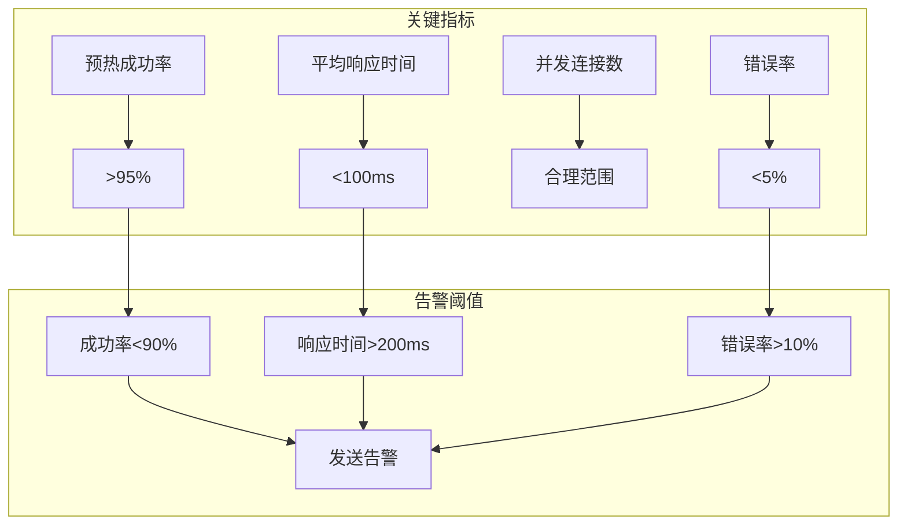

### 调试技巧

1. **启用详细日志**：设置DEBUG级别日志记录预热过程
2. **分阶段测试**：先测试少量IP，确认机制正常后再扩大规模
3. **监控网络状况**：检查网络延迟和丢包率
4. **验证目标服务**：确认目标服务器支持所选的TLS指纹

**章节来源**
- [test_ip_pool_performance.go](file://test/test_ip_pool_performance.go#L123-L137)

## 结论

连接池预热策略是构建高性能Web应用的重要技术。通过异步预热、智能并发控制、多样化指纹和语言随机化，可以显著提升系统的响应性能和稳定性。本文档提供的最佳实践和故障排除指南，为企业级应用部署提供了全面的技术参考。

关键收益：
- **性能提升**：连接复用使响应时间提升3-6倍
- **稳定性增强**：预热机制确保连接可用性
- **反爬虫效果**：多样化的指纹和语言组合难以被识别
- **运维简化**：自动化预热减少人工干预