# 预热监控

<cite>
**本文档引用的文件**
- [test/reports/热连接池性能测试报告.md](file://test/reports/热连接池性能测试报告.md)
- [test/test_ip_pool_performance.go](file://test/test_ip_pool_performance.go)
- [utlsclient/utlshotconnpool.go](file://utlsclient/utlshotconnpool.go)
- [utlsclient/connection_manager.go](file://utlsclient/connection_manager.go)
- [utlsclient/utlsfingerprint.go](file://utlsclient/utlsfingerprint.go)
- [utlsclient/health_checker.go](file://utlsclient/health_checker.go)
</cite>

## 目录
1. [概述](#概述)
2. [预热监控架构](#预热监控架构)
3. [进度监控策略](#进度监控策略)
4. [性能指标收集](#性能指标收集)
5. [TLS指纹监控](#tls指纹监控)
6. [Accept-Language分布监控](#accept-language分布监控)
7. [连接池统计监控](#连接池统计监控)
8. [实时监控实现](#实时监控实现)
9. [监控数据分析](#监控数据分析)
10. [优化建议](#优化建议)

## 概述

预热监控是确保热连接池高效运行的关键机制。通过实时监控预热过程中的各项指标，可以及时发现问题、优化性能并保证连接池的稳定性。本文档详细说明了预热过程中的监控策略，包括进度跟踪、性能指标收集、TLS指纹分布监控以及连接池状态监控。

## 预热监控架构

预热监控系统采用分层架构设计，包含以下核心组件：

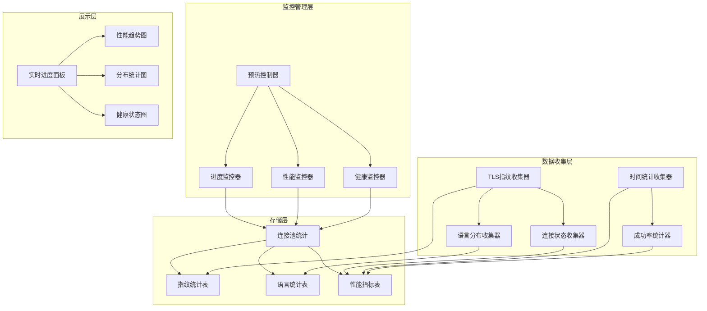

**图表来源**
- [utlsclient/utlshotconnpool.go](file://utlsclient/utlshotconnpool.go#L237-L277)
- [test/test_ip_pool_performance.go](file://test/test_ip_pool_performance.go#L60-L150)

**章节来源**
- [utlsclient/utlshotconnpool.go](file://utlsclient/utlshotconnpool.go#L237-L277)
- [test/test_ip_pool_performance.go](file://test/test_ip_pool_performance.go#L60-L150)

## 进度监控策略

### 进度百分比显示

预热过程中实现了精确的进度跟踪机制，能够实时显示预热进度百分比：

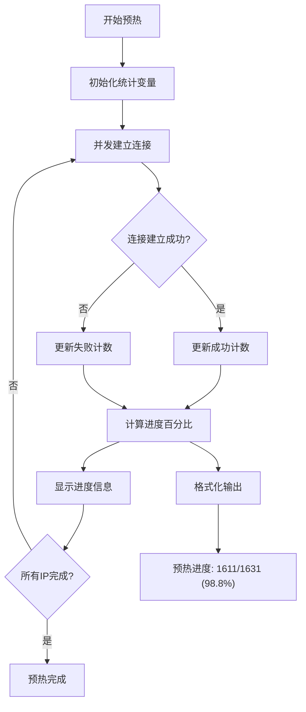

**图表来源**
- [test/test_ip_pool_performance.go](file://test/test_ip_pool_performance.go#L128-L130)

### 耗时统计机制

系统提供了多层次的耗时统计：

| 统计维度 | 计算方式 | 精度 | 用途 |
|----------|----------|------|------|
| 总耗时 | `time.Since(start)` | 毫秒级 | 整体预热时间评估 |
| 平均耗时 | `total_time / success_count` | 毫秒级 | 单个连接建立时间 |
| 最小耗时 | `min(duration)` | 毫秒级 | 性能基准参考 |
| 最大耗时 | `max(duration)` | 毫秒级 | 异常检测阈值 |

**章节来源**
- [test/test_ip_pool_performance.go](file://test/test_ip_pool_performance.go#L149-L151)
- [test/reports/热连接池性能测试报告.md](file://test/reports/热连接池性能测试报告.md#L73-L80)

## 性能指标收集

### 成功/失败计数统计

系统实现了全面的成功率统计机制：

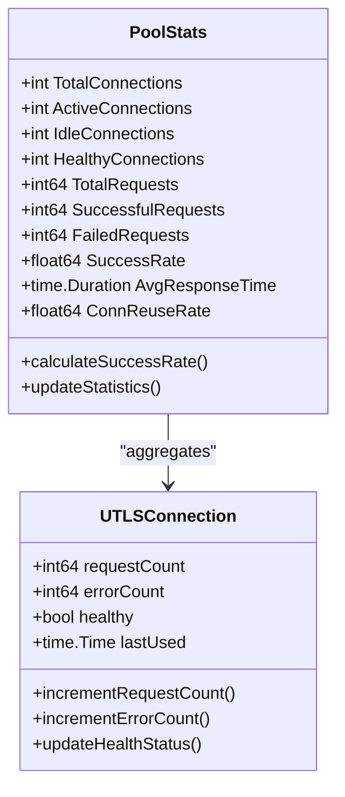

**图表来源**
- [utlsclient/utlshotconnpool.go](file://utlsclient/utlshotconnpool.go#L261-L277)
- [utlsclient/utlshotconnpool.go](file://utlsclient/utlshotconnpool.go#L227-L230)

### 平均响应时间计算

响应时间统计采用滑动窗口算法：

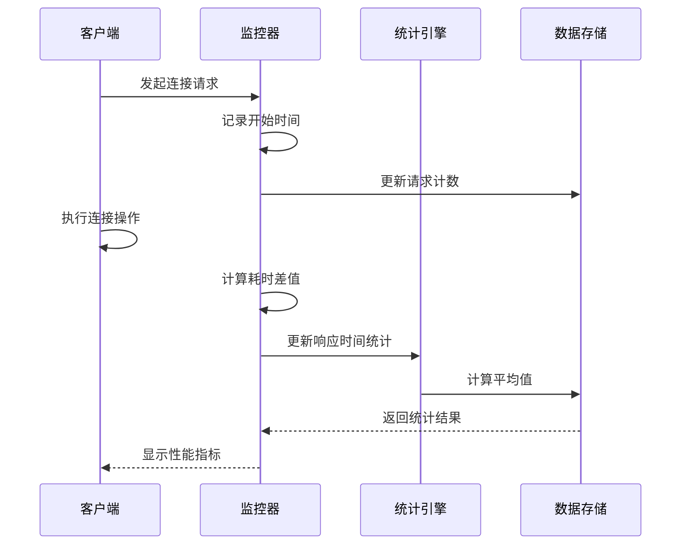

**图表来源**
- [test/test_ip_pool_performance.go](file://test/test_ip_pool_performance.go#L322-L340)

**章节来源**
- [utlsclient/utlshotconnpool.go](file://utlsclient/utlshotconnpool.go#L1122-L1174)
- [test/test_ip_pool_performance.go](file://test/test_ip_pool_performance.go#L322-L340)

## TLS指纹监控

### 指纹分布统计

系统实现了TLS指纹的全面监控和统计：

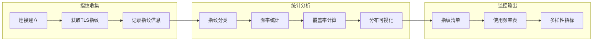

**图表来源**
- [test/reports/热连接池性能测试报告.md](file://test/reports/热连接池性能测试报告.md#L81-L105)

### 指纹多样性验证

系统确保指纹分布的多样性：

| 指纹类型 | 版本范围 | 平台覆盖 | 分布要求 |
|----------|----------|----------|----------|
| Chrome系列 | 100-133 | Windows, macOS, Linux | ≥12种版本 |
| Firefox系列 | 55-65 | Windows, macOS, Linux | ≥9种版本 |
| Safari系列 | iOS + macOS | 移动端 | ≥4种版本 |
| Edge系列 | 85-100 | Windows | ≥3种版本 |

**章节来源**
- [test/reports/热连接池性能测试报告.md](file://test/reports/热连接池性能测试报告.md#L81-L105)
- [utlsclient/utlsfingerprint.go](file://utlsclient/utlsfingerprint.go#L112-L200)

## Accept-Language分布监控

### 语言组合统计

系统实现了Accept-Language头部的随机化和统计：

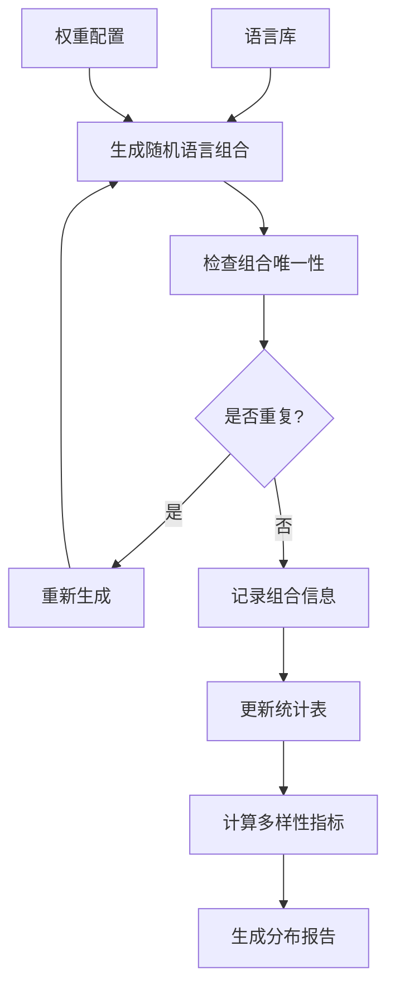

**图表来源**
- [test/reports/热连接池性能测试报告.md](file://test/reports/热连接池性能测试报告.md#L106-L133)

### 语言多样性指标

语言组合的多样性通过以下指标衡量：

| 指标名称 | 计算公式 | 目标值 | 说明 |
|----------|----------|--------|------|
| 唯一组合率 | `unique_combinations / total_connections * 100%` | ≥97.8% | 表示连接的个性化程度 |
| 组合复杂度 | `average_language_count_per_combination` | 2-5种语言 | 平均每个组合包含的语言数量 |
| 频繁使用率 | `repeated_combinations / total_connections * 100%` | ≤2.2% | 表示重复使用的比例 |

**章节来源**
- [test/reports/热连接池性能测试报告.md](file://test/reports/热连接池性能测试报告.md#L106-L133)

## 连接池统计监控

### 连接状态监控

连接池提供了全面的状态监控能力：

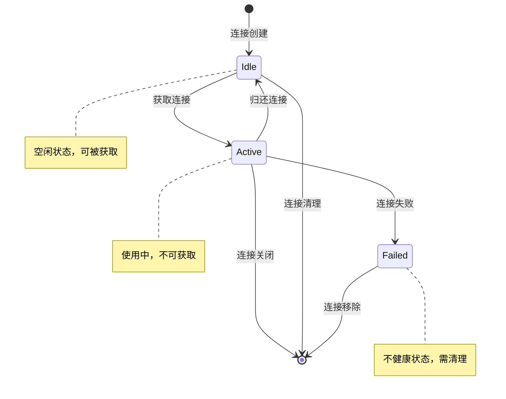

**图表来源**
- [utlsclient/connection_manager.go](file://utlsclient/connection_manager.go#L42-L47)

### 健康状态监控

健康检查机制确保连接池的稳定性：

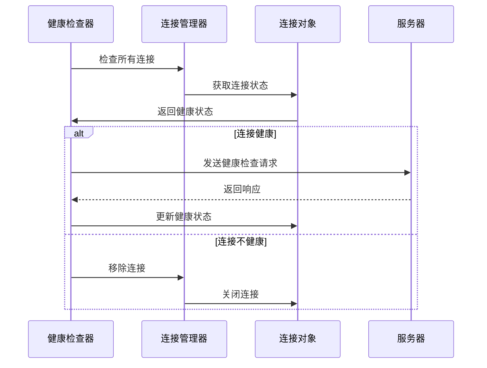

**图表来源**
- [utlsclient/health_checker.go](file://utlsclient/health_checker.go#L24-L60)

**章节来源**
- [utlsclient/connection_manager.go](file://utlsclient/connection_manager.go#L42-L90)
- [utlsclient/health_checker.go](file://utlsclient/health_checker.go#L24-L60)

## 实时监控实现

### 监控数据收集

系统提供了多种监控数据收集方式：

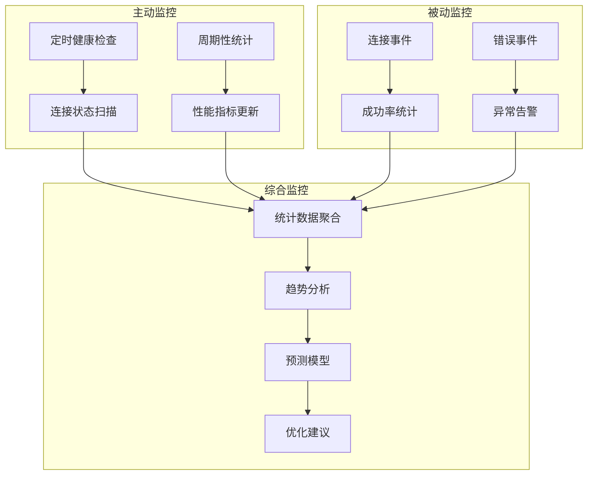

**图表来源**
- [utlsclient/utlshotconnpool.go](file://utlsclient/utlshotconnpool.go#L809-L826)

### 监控接口设计

系统提供了标准化的监控接口：

| 接口方法 | 功能描述 | 返回类型 | 调用频率 |
|----------|----------|----------|----------|
| `GetStats()` | 获取连接池统计信息 | `PoolStats` | 实时 |
| `IsHealthy()` | 检查连接池健康状态 | `bool` | 定期 |
| `GetConnectionInfo()` | 获取连接详细信息 | `map[string]interface{}` | 按需 |
| `GetConnectionCount()` | 获取指定域名连接数 | `int` | 实时 |

**章节来源**
- [utlsclient/utlshotconnpool.go](file://utlsclient/utlshotconnpool.go#L1122-L1174)
- [utlsclient/utlshotconnpool.go](file://utlsclient/utlshotconnpool.go#L1377-L1383)

## 监控数据分析

### 性能趋势分析

系统支持多维度的性能趋势分析：

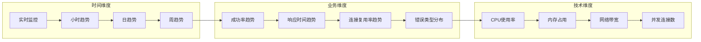

### 异常检测机制

系统实现了智能的异常检测：

| 检测类型 | 阈值设置 | 响应动作 | 检测周期 |
|----------|----------|----------|----------|
| 连接失败率 | >5% | 触发重试机制 | 实时 |
| 响应时间异常 | >3倍平均值 | 标记为异常连接 | 每次请求 |
| 指纹分布异常 | 某指纹占比>20% | 调整指纹选择策略 | 每小时 |
| 语言组合重复 | 重复率>5% | 优化随机化算法 | 每天 |

**章节来源**
- [test/reports/热连接池性能测试报告.md](file://test/reports/热连接池性能测试报告.md#L137-L156)

## 优化建议

### 监控策略优化

基于监控数据分析，提出以下优化建议：

1. **动态调整并发数**
   - 根据当前连接池状态动态调整预热并发数
   - 避免瞬时并发过高导致的资源竞争

2. **智能预热策略**
   - 根据历史成功率数据调整预热顺序
   - 优先预热成功率较高的IP地址

3. **指纹分布优化**
   - 基于监控数据调整指纹选择策略
   - 确保指纹分布更加均匀

4. **语言组合优化**
   - 根据地理位置分布优化语言组合
   - 减少重复语言组合的使用频率

### 性能监控最佳实践

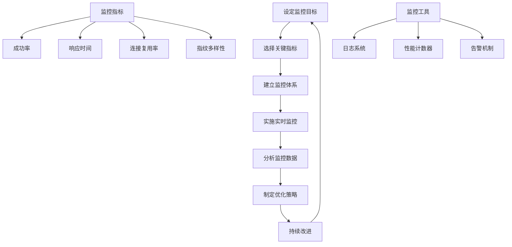

通过完善的预热监控策略，可以确保热连接池的高效运行，及时发现和解决潜在问题，为大规模并发请求提供稳定可靠的连接服务。