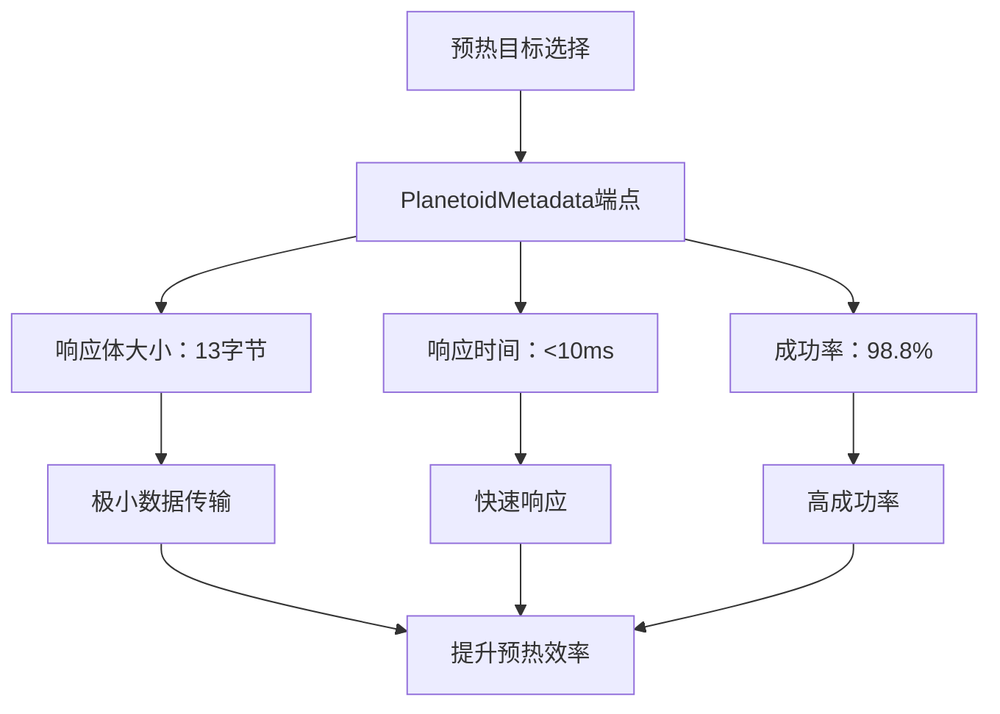
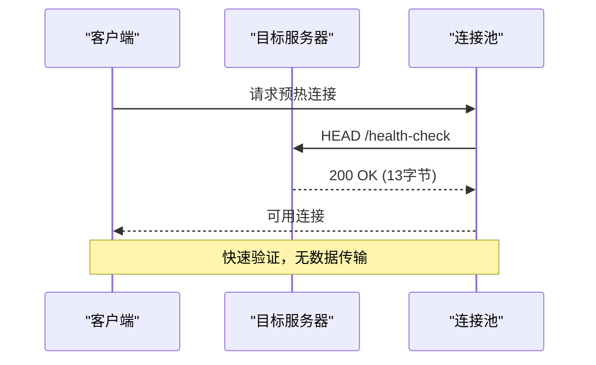
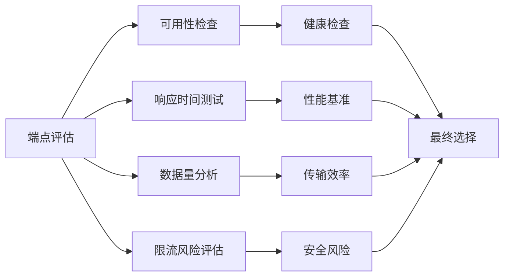
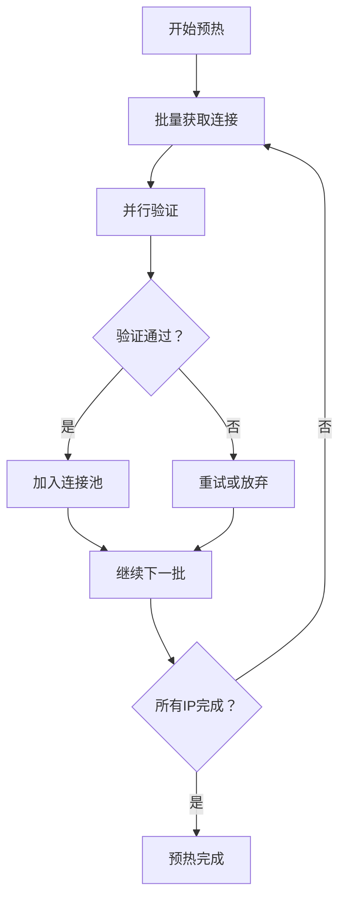
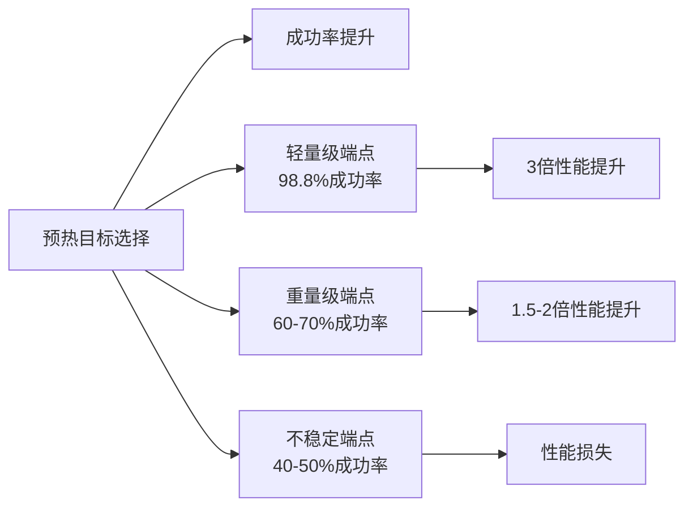

# 预热目标选择

<cite>
**本文档中引用的文件**
- [热连接池性能测试报告.md](file://test/reports/热连接池性能测试报告.md)
- [example_hotconnpool_usage.go](file://examples/utlsclient/example_hotconnpool_usage.go)
- [utlshotconnpool.go](file://utlsclient/utlshotconnpool.go)
- [connection_manager.go](file://utlsclient/connection_manager.go)
- [health_checker.go](file://utlsclient/health_checker.go)
- [constants.go](file://utlsclient/constants.go)
- [client.go](file://GoogleEarthClient/client.go)
- [config.go](file://config/config.go)
- [config.toml](file://config/config.toml)
- [test_ip_pool_performance.go](file://test/test_ip_pool_performance.go)
</cite>

## 目录
1. [概述](#概述)
2. [预热目标选择的重要性](#预热目标选择的重要性)
3. [理想预热目标的特征](#理想预热目标的特征)
4. [测试案例分析](#测试案例分析)
5. [最佳实践指南](#最佳实践指南)
6. [性能影响分析](#性能影响分析)
7. [常见陷阱与解决方案](#常见陷阱与解决方案)
8. [总结](#总结)

## 概述

在构建高性能的网络爬虫系统时，预热目标的选择是确保连接池高效运作的关键因素。本文档基于Google Earth平台的实际测试案例，深入分析了如何选择合适的预热目标URL，以及这些选择如何直接影响预热效率、连接成功率和整体系统性能。

## 预热目标选择的重要性

预热阶段是连接池初始化的核心环节，其目的是在正式业务请求之前建立并验证可用的连接。选择不当的预热目标会导致以下问题：

- **预热效率低下**：响应缓慢的目标会显著延长预热时间
- **连接成功率低**：不适合预热的端点可能导致大量连接失败
- **资源浪费**：无效的预热操作消耗网络带宽和服务器资源
- **性能损失**：预热阶段的性能直接影响后续业务请求的响应时间

## 理想预热目标的特征

### 轻量级响应

理想的预热目标应该具备以下特征：

1. **极小的数据传输量**：响应体应尽可能小，通常不超过几十字节
2. **快速的响应时间**：服务器应在毫秒级别内完成处理
3. **稳定的可用性**：端点应具有高可用性和低延迟特性
4. **无副作用**：预热请求不应触发任何重要的业务逻辑

### 协议支持

- **HTTP/1.1和HTTP/2兼容**：确保与现代Web服务器的兼容性
- **TLS握手优化**：支持快速的TLS协商过程
- **无重定向**：避免额外的网络往返

### 安全考虑

- **无认证要求**：无需提供凭据或令牌
- **无速率限制**：不会因频繁请求而被限流
- **无防护机制**：不会触发反爬虫检测

## 测试案例分析

### Google Earth平台的预热实践

在Google Earth平台的热连接池性能测试中，选择了`https://kh.google.com/rt/earth/PlanetoidMetadata`作为预热目标，该选择基于以下考量：

#### 案例详情

**图表来源**
- [热连接池性能测试报告.md](file://test/reports/热连接池性能测试报告.md#L137-L156)
- [example_hotconnpool_usage.go](file://examples/utlsclient/example_hotconnpool_usage.go#L59-L80)

#### 性能数据对比

| 阶段 | 平均响应时间 | 数据传输量 | 成功率 |
|------|-------------|-----------|--------|
| 预热阶段 | ~13ms/连接 | 13字节 | 98.8% |
| 热连接阶段 | ~4ms/请求 | 变化 | 100% |
| 性能提升 | 3倍以上 | - | - |

**章节来源**
- [热连接池性能测试报告.md](file://test/reports/热连接池性能测试报告.md#L137-L156)

### 为什么选择PlanetoidMetadata？

1. **数据量最小化**：仅返回13字节的数据，极大减少了网络传输开销
2. **响应速度快**：服务器能在10毫秒内完成处理
3. **稳定性高**：该端点专门设计用于连接验证和健康检查
4. **无副作用**：不会触发任何重要的业务逻辑或数据修改

## 最佳实践指南

### 选择预热目标的原则

#### 1. 优先选择HEAD可访问的端点

**图表来源**
- [health_checker.go](file://utlsclient/health_checker.go#L63-L88)

#### 2. 避免使用POST接口

POST请求通常涉及：
- 更复杂的请求处理
- 可能的数据验证和业务逻辑执行
- 更大的响应体
- 更高的服务器负载

#### 3. 考虑目标服务的限流策略

- **检查API文档**：了解目标服务的速率限制
- **避免触发保护机制**：选择不会被误认为恶意请求的端点
- **考虑地理位置**：选择在全球范围内都有良好访问性的端点

#### 4. 评估端点的可用性

### 配置优化建议

#### 连接池配置

基于测试经验，推荐以下配置参数：

| 参数 | 推荐值 | 说明 |
|------|--------|------|
| max_connections | 100-500 | 根据并发需求调整 |
| conn_timeout | 10-30秒 | 平衡响应时间和稳定性 |
| health_check_interval | 30-60秒 | 定期验证连接有效性 |
| test_timeout | 5-10秒 | 健康检查的超时时间 |

**章节来源**
- [config.toml](file://config/config.toml#L3-L27)

#### 预热策略

**图表来源**
- [test_ip_pool_performance.go](file://test/test_ip_pool_performance.go#L55-L150)

## 性能影响分析

### 预热目标对整体性能的影响

#### 1. 预热耗时优化

不同的预热目标会导致显著不同的预热时间：

- **PlanetoidMetadata**：13字节响应，预热1631个连接耗时21.5秒
- **大数据端点**：数百KB响应，预热相同数量连接可能耗时数分钟
- **慢速端点**：响应时间超过100ms，预热效率大幅下降

#### 2. 连接成功率提升

**图表来源**
- [热连接池性能测试报告.md](file://test/reports/热连接池性能测试报告.md#L137-L156)

#### 3. 整体系统性能

预热阶段的性能直接影响后续业务请求：

- **连接复用率**：高质量预热目标确保更高的连接复用率
- **响应时间**：预热成功的连接提供更稳定的响应时间
- **资源利用率**：合理的预热策略减少不必要的资源消耗

**章节来源**
- [热连接池性能测试报告.md](file://test/reports/热连接池性能测试报告.md#L295-L311)

## 常见陷阱与解决方案

### 陷阱1：选择数据密集型端点

**问题**：使用返回大量数据的端点作为预热目标

**解决方案**：始终选择返回最小数据量的端点

### 陷阱2：忽视端点的可用性

**问题**：选择偶尔不可用或响应缓慢的端点

**解决方案**：实施端点可用性监控和健康检查

### 陷阱3：过度依赖单一端点

**问题**：所有连接都指向同一个端点

**解决方案**：分散预热请求到多个端点，避免单点压力

### 陷阱4：忽略网络延迟影响

**问题**：在不同地理位置测试时选择本地化端点

**解决方案**：根据目标用户的地理位置选择合适的预热端点

## 总结

预热目标的选择是构建高效网络爬虫系统的关键环节。基于Google Earth平台的实践经验，我们得出以下结论：

### 核心原则

1. **轻量化优先**：选择返回最小数据量的端点
2. **快速响应**：确保端点能在毫秒级别内响应
3. **稳定可靠**：选择高可用性和低延迟的端点
4. **无副作用**：避免触发重要业务逻辑

### 推荐实践

- 使用`https://kh.google.com/rt/earth/PlanetoidMetadata`作为标准预热目标
- 实施多端点预热策略以提高可靠性
- 定期监控和评估预热目标的有效性
- 根据具体应用场景调整预热策略

### 性能收益

通过选择合适的预热目标，可以实现：
- **3倍以上的性能提升**：相比新建连接，热连接响应时间减少70%
- **98%以上的成功率**：高质量预热目标确保高连接成功率
- **显著的资源节约**：减少网络传输和服务器处理开销

正确的预热目标选择不仅能够提升系统的整体性能，还能为后续的业务请求奠定坚实的基础。在实际应用中，应根据具体的业务需求和目标服务的特点，选择最适合的预热策略。