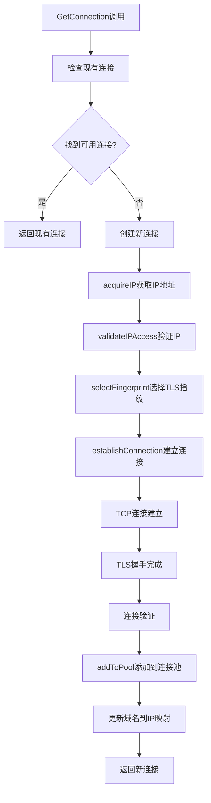
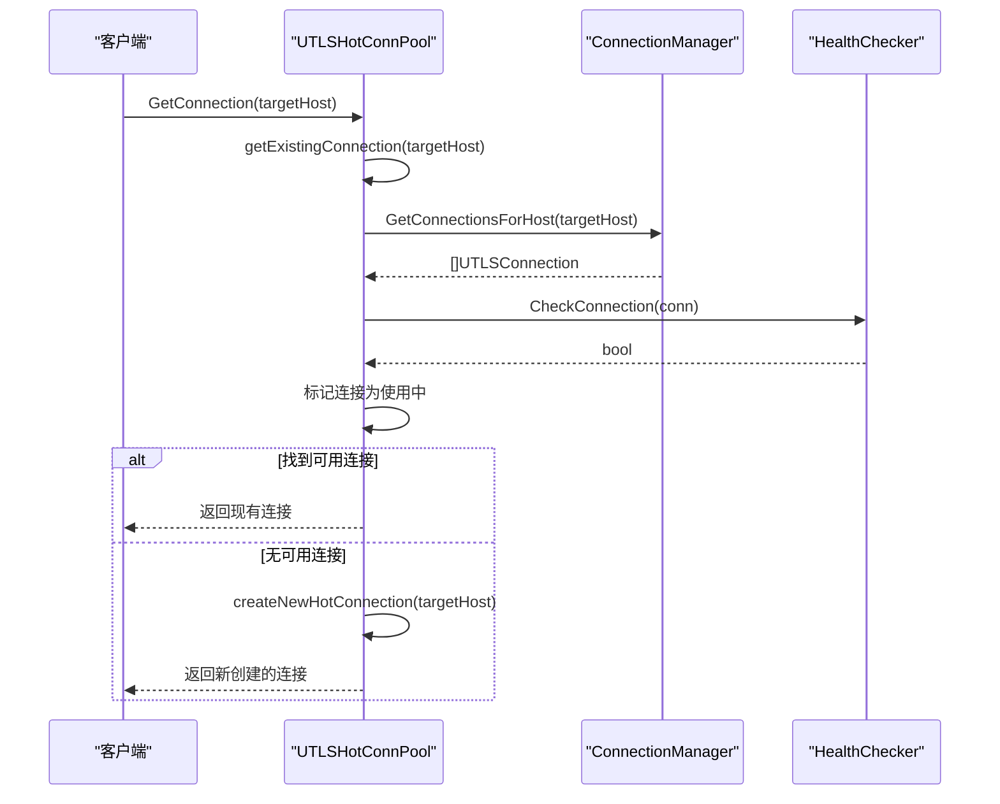
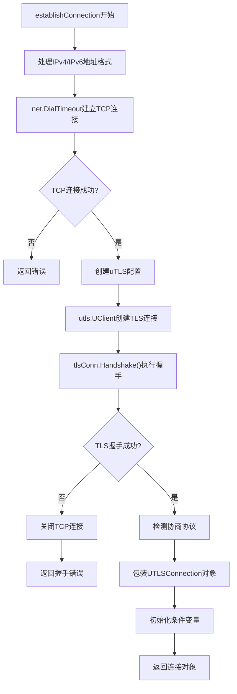
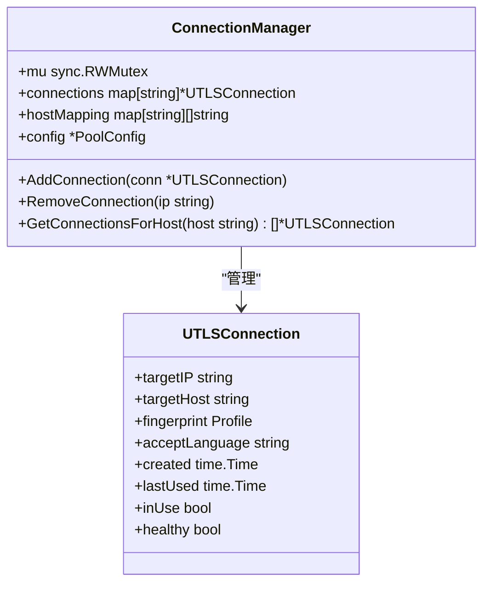
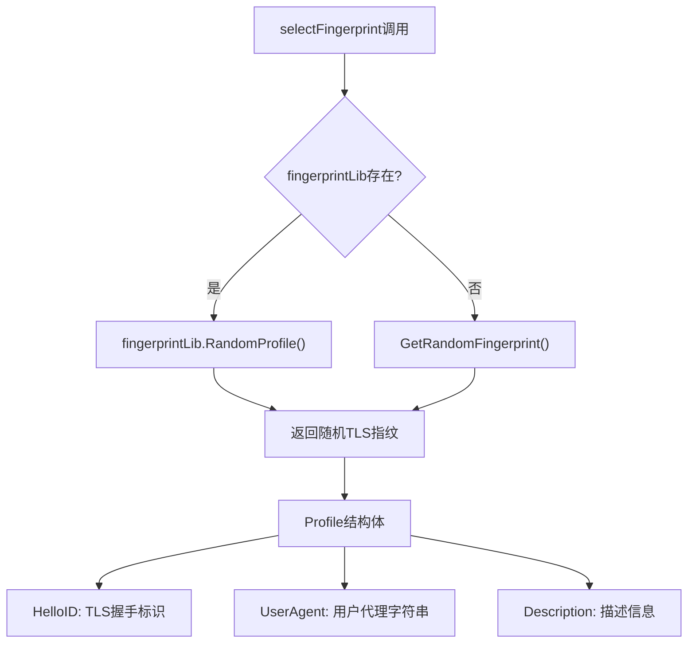
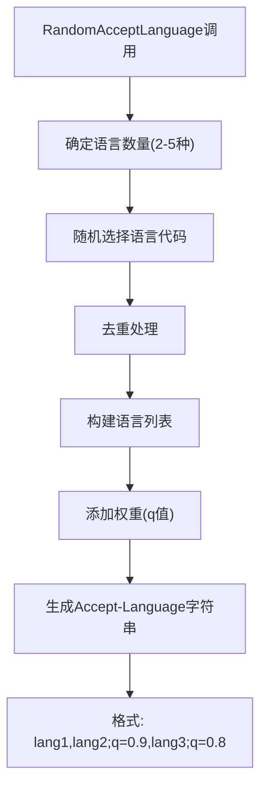
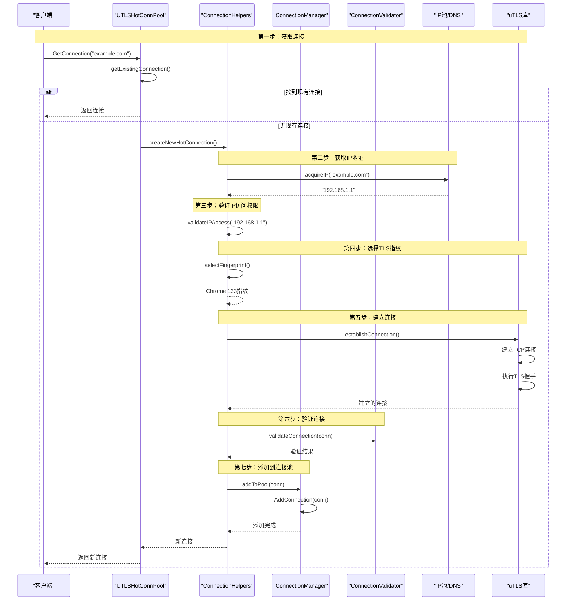

# 连接创建流程详细说明

<cite>
**本文档中引用的文件**
- [utlshotconnpool.go](file://utlsclient/utlshotconnpool.go)
- [connection_manager.go](file://utlsclient/connection_manager.go)
- [utlsclient.go](file://utlsclient/utlsclient.go)
- [connection_helpers.go](file://utlsclient/connection_helpers.go)
- [utlsfingerprint.go](file://utlsclient/utlsfingerprint.go)
- [example_hotconnpool_usage.go](file://examples/utlsclient/example_hotconnpool_usage.go)
</cite>

## 目录
1. [概述](#概述)
2. [连接创建流程架构](#连接创建流程架构)
3. [NewUTLSHotConnPool初始化过程](#newutlshotconnpool初始化过程)
4. [GetConnection方法详解](#getconnection方法详解)
5. [establishConnection函数实现](#establishconnection函数实现)
6. [连接管理器AddConnection方法](#连接管理器addconnection方法)
7. [TLS指纹选择机制](#tls指纹选择机制)
8. [Accept-Language随机化实现](#accept-language随机化实现)
9. [完整连接创建流程图](#完整连接创建流程图)
10. [配置示例](#配置示例)

## 概述

连接创建是热连接池系统的核心功能，从调用`GetConnection`开始，经过多个步骤最终建立一个完整的uTLS连接。整个流程包括连接池管理、IP获取、TLS握手、连接验证等多个环节，确保能够高效、稳定地建立与目标服务器的安全连接。

## 连接创建流程架构



**图表来源**
- [utlshotconnpool.go](file://utlsclient/utlshotconnpool.go#L351-L360)
- [connection_helpers.go](file://utlsclient/connection_helpers.go#L14-L43)
- [utlshotconnpool.go](file://utlsclient/utlshotconnpool.go#L560-L616)

## NewUTLSHotConnPool初始化过程

`NewUTLSHotConnPool`函数是连接池的入口点，负责初始化整个连接池系统：

```mermaid
classDiagram
class UTLSHotConnPool {
+connManager *ConnectionManager
+healthChecker *HealthChecker
+validator *ConnectionValidator
+ipAccessCtrl *IPAccessController
+config PoolConfig
+fingerprintLib *Library
+ipPool IPPoolProvider
+stats PoolStats
+mu sync.RWMutex
+done chan struct{}
+wg sync.WaitGroup
}
class ConnectionManager {
+connections map[string]*UTLSConnection
+hostMapping map[string][]string
+config *PoolConfig
+AddConnection(conn *UTLSConnection)
+GetConnectionsForHost(host string) []*UTLSConnection
}
class HealthChecker {
+connManager *ConnectionManager
+config *PoolConfig
+CheckConnection(conn *UTLSConnection) bool
}
UTLSHotConnPool --> ConnectionManager : "管理"
UTLSHotConnPool --> HealthChecker : "使用"
```

**图表来源**
- [utlshotconnpool.go](file://utlsclient/utlshotconnpool.go#L236-L258)
- [connection_manager.go](file://utlsclient/connection_manager.go#L8-L15)

### 初始化步骤详解

1. **配置验证与设置**：检查传入的配置参数，如果为nil则使用默认配置
2. **全局日志初始化**：确保全局日志系统已正确初始化
3. **核心组件创建**：
   - `ConnectionManager`：负责连接的生命周期管理
   - `HealthChecker`：定期检查连接健康状态
   - `ConnectionValidator`：验证连接的有效性
   - `IPAccessController`：管理IP访问权限
4. **后台任务启动**：启动健康检查、清理等维护任务

**章节来源**
- [utlshotconnpool.go](file://utlsclient/utlshotconnpool.go#L291-L319)

## GetConnection方法详解

`GetConnection`方法是连接池的主要入口，实现了连接复用和新连接创建的逻辑：



**图表来源**
- [utlshotconnpool.go](file://utlsclient/utlshotconnpool.go#L351-L360)
- [utlshotconnpool.go](file://utlsclient/utlshotconnpool.go#L441-L481)

### 连接查找策略

1. **随机选择健康连接**：从相同域名的所有连接中随机选择一个健康的连接
2. **双重检查机制**：在锁定状态下进行健康检查，避免竞态条件
3. **并发安全**：使用互斥锁确保线程安全

**章节来源**
- [utlshotconnpool.go](file://utlsclient/utlshotconnpool.go#L441-L481)

## establishConnection函数实现

`establishConnection`函数是建立TCP连接和TLS握手的核心方法：



**图表来源**
- [utlshotconnpool.go](file://utlsclient/utlshotconnpool.go#L560-L616)

### IPv4/IPv6地址处理

函数根据IP地址格式自动选择正确的地址封装方式：

- **IPv4地址**：直接使用`{IP}:{PORT}`格式
- **IPv6地址**：使用`[{IP}]:{PORT}`格式，方括号包裹IPv6地址

### TLS握手配置

创建的TLS连接配置包括：
- `ServerName`：目标主机名
- `InsecureSkipVerify`：是否跳过证书验证
- `NextProtos`：支持的协议（HTTP/2和HTTP/1.1）
- `OmitEmptyPsk`：避免空PSK问题

**章节来源**
- [utlshotconnpool.go](file://utlsclient/utlshotconnpool.go#L560-L616)

## 连接管理器AddConnection方法

`AddConnection`方法负责将新创建的连接注册到连接管理系统中：



**图表来源**
- [connection_manager.go](file://utlsclient/connection_manager.go#L8-L15)
- [utlshotconnpool.go](file://utlsclient/utlshotconnpool.go#L204-L234)

### 注册过程

1. **IP到连接映射**：将连接添加到IP到连接的映射表
2. **域名到IP映射**：更新域名到IP地址的映射关系
3. **并发控制**：使用读写锁确保数据一致性

**章节来源**
- [connection_manager.go](file://utlsclient/connection_manager.go#L25-L39)

## TLS指纹选择机制

TLS指纹选择是实现浏览器伪装的关键技术：



**图表来源**
- [connection_helpers.go](file://utlsclient/connection_helpers.go#L55-L62)
- [utlsfingerprint.go](file://utlsclient/utlsfingerprint.go#L13-L22)

### 支持的浏览器指纹

系统支持多种浏览器和版本的TLS指纹，包括：
- **Chrome系列**：从83到133版本
- **Firefox系列**：从55到120版本  
- **Edge系列**：从85到120版本
- **Safari系列**：macOS和iOS版本
- **随机化选项**：提供多种随机化变体

**章节来源**
- [utlsfingerprint.go](file://utlsclient/utlsfingerprint.go#L112-L400)

## Accept-Language随机化实现

Accept-Language头部的随机化确保每次连接都有不同的语言偏好设置：



**图表来源**
- [utlsfingerprint.go](file://utlsclient/utlsfingerprint.go#L589-L630)

### 随机化算法特点

1. **语言数量随机**：每次选择2-5种语言
2. **权重递减**：靠前的语言权重更高，使用0.9、0.8等递减权重
3. **去重保证**：确保选择的语言不重复
4. **全面覆盖**：支持全球主要语言和地区变体

**章节来源**
- [utlsfingerprint.go](file://utlsclient/utlsfingerprint.go#L589-L630)

## 完整连接创建流程

以下是连接创建的完整流程图：



**图表来源**
- [utlshotconnpool.go](file://utlsclient/utlshotconnpool.go#L351-L360)
- [connection_helpers.go](file://utlsclient/connection_helpers.go#L14-L43)
- [utlshotconnpool.go](file://utlsclient/utlshotconnpool.go#L560-L616)

## 配置示例

### 基本配置示例

```go
// 创建连接池配置
config := &utlsclient.PoolConfig{
    MaxConnections:         100,
    MaxConnsPerHost:        10,
    MaxIdleConns:           20,
    ConnTimeout:            30 * time.Second,
    IdleTimeout:            60 * time.Second,
    MaxLifetime:            300 * time.Second,
    TestTimeout:            10 * time.Second,
    HealthCheckInterval:    30 * time.Second,
    CleanupInterval:        60 * time.Second,
    BlacklistCheckInterval: 300 * time.Second,
    DNSUpdateInterval:      1800 * time.Second,
    MaxRetries:             3,
}

// 创建连接池
pool := utlsclient.NewUTLSHotConnPool(config)
```

### 自定义TLS指纹配置

```go
// 设置自定义指纹库
library := utlsclient.NewLibrary()
pool.SetDependencies(library, ipPool, accessCtrl, logger)

// 获取特定浏览器的指纹
chromeFingerprint := utlsclient.Profile{
    Name:      "Custom Chrome 133",
    HelloID:   utls.HelloChrome_133,
    UserAgent: "Mozilla/5.0 (Windows NT 10.0; Win64; x64) AppleWebKit/537.36 (KHTML, like Gecko) Chrome/133.0.0.0 Safari/537.36",
}
```

### 连接验证示例

```go
// 获取连接并验证特定路径
conn, err := pool.GetConnectionWithValidation("https://api.example.com/health")
if err != nil {
    log.Fatalf("连接验证失败: %v", err)
}

// 使用连接进行请求
client := utlsclient.NewUTLSClient(conn)
resp, err := client.Get("https://api.example.com/health")
// 处理响应...
```

**章节来源**
- [example_hotconnpool_usage.go](file://examples/utlsclient/example_hotconnpool_usage.go#L18-L135)
- [utlshotconnpool.go](file://utlsclient/utlshotconnpool.go#L291-L319)