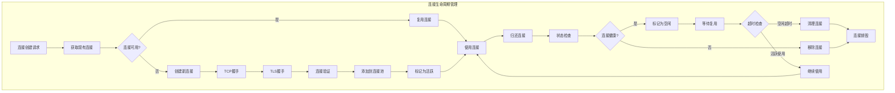
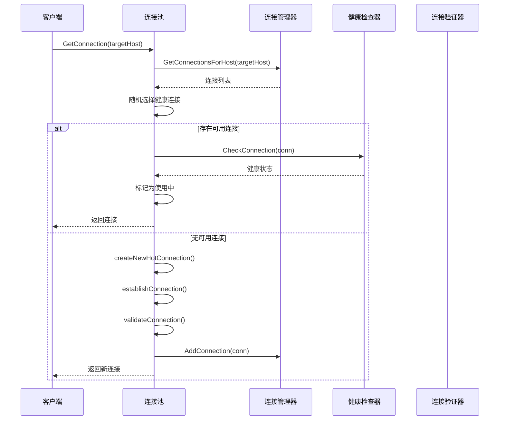
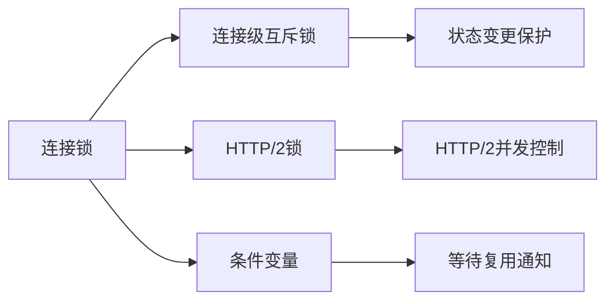
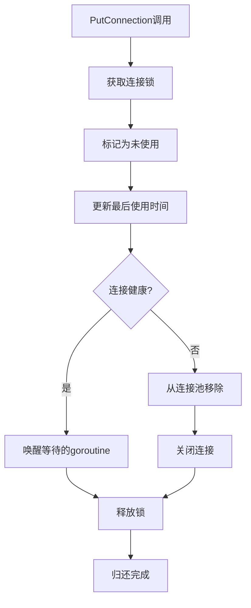
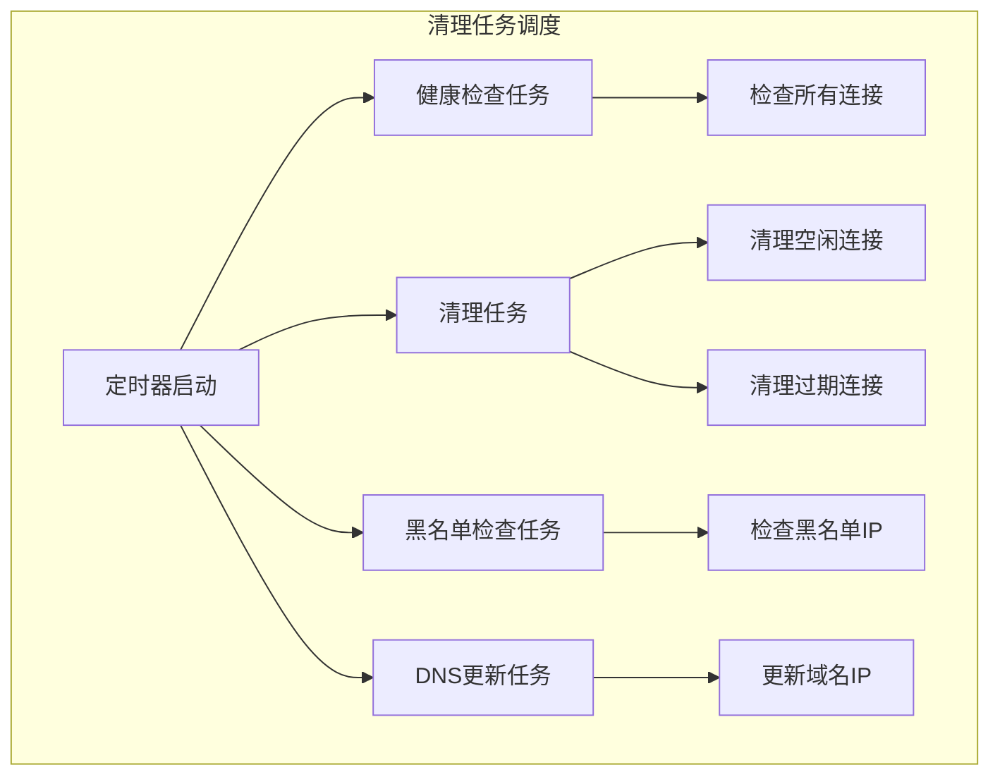
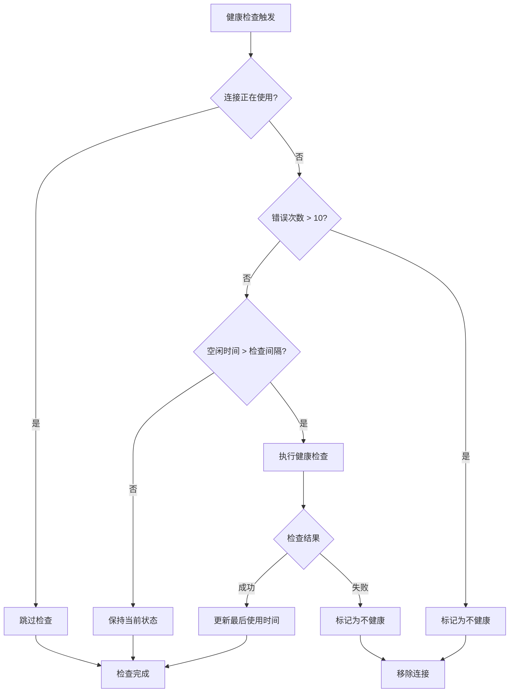
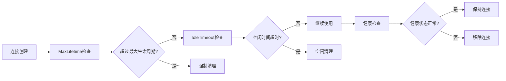
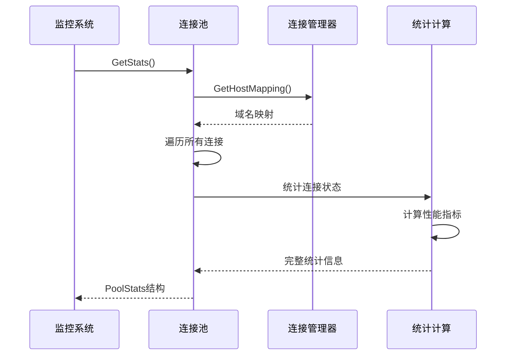
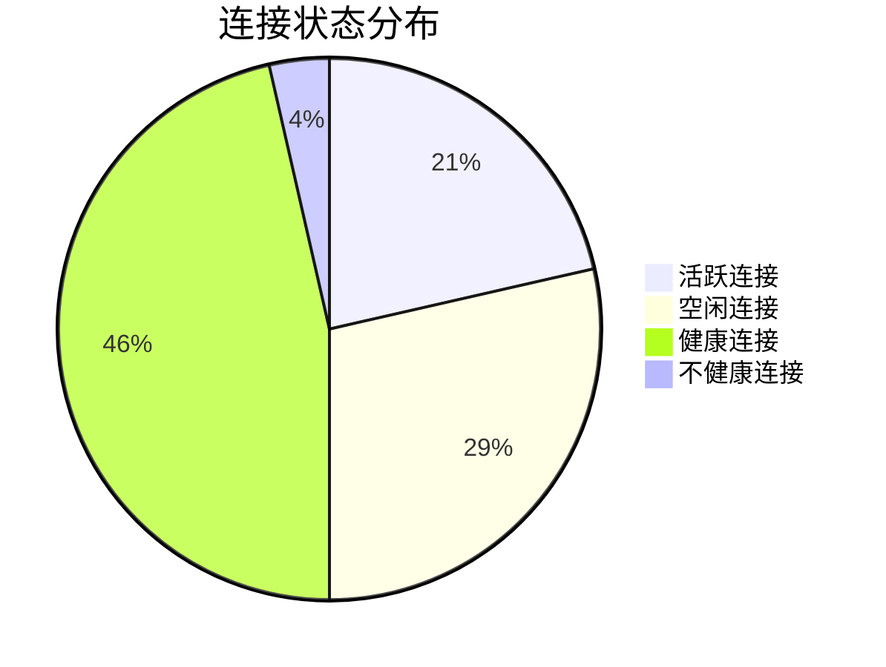

# 连接生命周期管理

<cite>
**本文档引用的文件**
- [utlshotconnpool.go](file://utlsclient/utlshotconnpool.go)
- [health_checker.go](file://utlsclient/health_checker.go)
- [connection_manager.go](file://utlsclient/connection_manager.go)
- [interfaces.go](file://utlsclient/interfaces.go)
- [example_hotconnpool_usage.go](file://examples/utlsclient/example_hotconnpool_usage.go)
- [utlshotconnpool_test.go](file://test/utlsclient/utlshotconnpool_test.go)
- [connection_manager_test.go](file://test/utlsclient/connection_manager_test.go)
</cite>

## 目录
1. [概述](#概述)
2. [连接生命周期架构](#连接生命周期架构)
3. [连接创建过程](#连接创建过程)
4. [连接使用与管理](#连接使用与管理)
5. [连接归还与回收](#连接归还与回收)
6. [连接销毁与清理](#连接销毁与清理)
7. [健康检查机制](#健康检查机制)
8. [超时参数配置](#超时参数配置)
9. [连接状态监控](#连接状态监控)
10. [最佳实践建议](#最佳实践建议)

## 概述

连接生命周期管理是热连接池的核心功能，负责从连接创建到销毁的完整过程。系统通过严格的生命周期管理确保连接的可用性、性能和资源效率。连接池采用主动管理和被动监控相结合的方式，通过多种超时参数和健康检查机制来维护连接质量。

## 连接生命周期架构



**图表来源**
- [utlshotconnpool.go](file://utlsclient/utlshotconnpool.go#L351-L480)
- [utlshotconnpool.go](file://utlsclient/utlshotconnpool.go#L560-L616)

## 连接创建过程

### GetConnection方法流程

连接创建过程通过`GetConnection`方法实现，该方法遵循以下步骤：



**图表来源**
- [utlshotconnpool.go](file://utlsclient/utlshotconnpool.go#L351-L480)
- [utlshotconnpool.go](file://utlsclient/utlshotconnpool.go#L560-L616)

### establishConnection方法详解

`establishConnection`方法负责建立TCP和TLS连接，这是连接创建的核心步骤：

#### TCP连接建立
- **地址格式处理**：自动识别IPv4和IPv6地址格式
- **超时控制**：使用配置的连接超时时间
- **错误处理**：连接失败时立即关闭TCP连接

#### TLS握手流程
- **指纹选择**：使用随机TLS指纹模拟真实浏览器
- **协议协商**：支持HTTP/2和HTTP/1.1协议
- **握手验证**：确保TLS握手成功完成

**章节来源**
- [utlshotconnpool.go](file://utlsclient/utlshotconnpool.go#L560-L616)

## 连接使用与管理

### 连接状态管理

连接对象包含完整的生命周期状态信息：

| 状态字段 | 类型 | 描述 | 默认值 |
|---------|------|------|--------|
| `inUse` | bool | 连接当前是否正在使用 | false |
| `healthy` | bool | 连接健康状态 | true |
| `created` | time.Time | 连接创建时间 | 当前时间 |
| `lastUsed` | time.Time | 最后使用时间 | 当前时间 |
| `lastChecked` | time.Time | 最后健康检查时间 | 当前时间 |
| `requestCount` | int64 | 总请求数 | 0 |
| `errorCount` | int64 | 错误次数 | 0 |

### 并发控制机制

连接池采用细粒度的锁机制确保并发安全：



**图表来源**
- [utlshotconnpool.go](file://utlsclient/utlshotconnpool.go#L231-L234)

**章节来源**
- [utlshotconnpool.go](file://utlsclient/utlshotconnpool.go#L204-L234)

## 连接归还与回收

### PutConnection方法流程

连接归还通过`PutConnection`方法实现，该方法执行以下操作：



**图表来源**
- [utlshotconnpool.go](file://utlsclient/utlshotconnpool.go#L760-L785)

### 条件变量机制

连接池使用条件变量实现高效的连接复用：

- **等待机制**：当连接被占用时，等待者会阻塞
- **广播通知**：连接归还时广播唤醒所有等待者
- **双重检查**：唤醒后再次检查连接状态

**章节来源**
- [utlshotconnpool.go](file://utlsclient/utlshotconnpool.go#L760-L785)

## 连接销毁与清理

### 自动清理机制

连接池实现了多层次的自动清理机制：

#### 空闲连接清理
- **触发时机**：定期执行（默认60秒）
- **清理条件**：连接空闲时间超过IdleTimeout
- **清理范围**：所有空闲连接

#### 过期连接清理
- **触发时机**：定期执行（默认60秒）
- **清理条件**：连接创建时间超过MaxLifetime
- **清理范围**：所有过期连接

#### 健康检查清理
- **触发时机**：定期执行（默认30秒）
- **清理条件**：连接健康状态异常
- **清理范围**：所有不健康连接



**图表来源**
- [utlshotconnpool.go](file://utlsclient/utlshotconnpool.go#L809-L826)
- [connection_manager.go](file://utlsclient/connection_manager.go#L141-L218)

**章节来源**
- [utlshotconnpool.go](file://utlsclient/utlshotconnpool.go#L809-L890)
- [connection_manager.go](file://utlsclient/connection_manager.go#L141-L218)

## 健康检查机制

### 健康检查策略

健康检查是连接池质量保证的核心机制：

#### 检查频率控制
- **健康检查间隔**：默认30秒检查一次
- **错误阈值**：连续错误超过10次标记为不健康
- **主动检查**：空闲时间超过检查间隔时主动验证

#### 检查方法
- **HTTP/1.1检查**：发送HEAD请求验证连通性
- **HTTP/2检查**：检测协议协商状态
- **错误处理**：连接错误时自动标记为不健康



**图表来源**
- [health_checker.go](file://utlsclient/health_checker.go#L23-L61)

### 健康检查实现

健康检查器通过以下步骤验证连接：

1. **状态检查**：验证连接的基本状态
2. **错误计数**：检查连续错误次数
3. **空闲验证**：对空闲连接执行实际检查
4. **协议验证**：验证TLS协议协商状态

**章节来源**
- [health_checker.go](file://utlsclient/health_checker.go#L23-L89)

## 超时参数配置

### 核心超时参数

连接池通过多个超时参数控制连接生命周期：

| 参数名称 | 默认值 | 描述 | 影响范围 |
|---------|--------|------|----------|
| `ConnTimeout` | 30秒 | TCP连接超时 | 新建连接 |
| `IdleTimeout` | 60秒 | 空闲连接超时 | 空闲连接回收 |
| `MaxLifetime` | 300秒 | 连接最大生命周期 | 连接过期清理 |
| `TestTimeout` | 10秒 | 连接测试超时 | 健康检查 |
| `HealthCheckInterval` | 30秒 | 健康检查间隔 | 健康状态监控 |
| `CleanupInterval` | 60秒 | 清理任务间隔 | 自动清理 |

### 超时参数对连接存活的影响



**图表来源**
- [utlshotconnpool.go](file://utlsclient/utlshotconnpool.go#L793-L807)

### 参数调优指南

#### 高并发场景
- **增加MaxConnections**：支持更多并发连接
- **缩短IdleTimeout**：快速回收空闲连接
- **优化HealthCheckInterval**：及时发现不健康连接

#### 低延迟要求
- **减少ConnTimeout**：快速建立连接
- **降低TestTimeout**：加快健康检查速度
- **调整CleanupInterval**：更频繁的清理操作

**章节来源**
- [utlshotconnpool.go](file://utlsclient/utlshotconnpool.go#L170-L201)

## 连接状态监控

### GetStats接口

`GetStats`方法提供全面的连接池状态监控：

#### 统计指标分类

| 指标类别 | 具体指标 | 描述 |
|---------|----------|------|
| **连接总数** | TotalConnections | 当前连接池中的总连接数 |
| **连接状态** | ActiveConnections | 正在使用的活跃连接数 |
| **连接状态** | IdleConnections | 空闲等待复用的连接数 |
| **健康状态** | HealthyConnections | 健康状态正常的连接数 |
| **性能指标** | TotalRequests | 总请求数量 |
| **性能指标** | SuccessfulRequests | 成功请求数量 |
| **性能指标** | FailedRequests | 失败请求数量 |
| **性能指标** | SuccessRate | 连接成功率 |
| **网络状态** | WhitelistIPs | 白名单IP数量 |
| **网络状态** | BlacklistIPs | 黑名单IP数量 |

#### 实时监控流程



**图表来源**
- [utlshotconnpool.go](file://utlsclient/utlshotconnpool.go#L1122-L1173)

### 连接状态分布图

连接池中的连接按状态分布如下：



**图表来源**
- [utlshotconnpool.go](file://utlsclient/utlshotconnpool.go#L1143-L1173)

**章节来源**
- [utlshotconnpool.go](file://utlsclient/utlshotconnpool.go#L1122-L1173)

## 最佳实践建议

### 连接池配置优化

#### 生产环境推荐配置
```go
config := &PoolConfig{
    MaxConnections:         200,        // 根据并发需求调整
    MaxConnsPerHost:        20,         // 每主机最大连接数
    MaxIdleConns:           50,         // 最大空闲连接数
    ConnTimeout:            15 * time.Second,  // 连接超时
    IdleTimeout:            120 * time.Second, // 空闲超时
    MaxLifetime:            600 * time.Second, // 最大生命周期
    HealthCheckInterval:    30 * time.Second,  // 健康检查
    CleanupInterval:        60 * time.Second,  // 清理间隔
}
```

#### 业务场景适配

**高并发Web爬虫**
- 增加MaxConnections到500+
- 缩短IdleTimeout到30秒
- 提高HealthCheckInterval到15秒

**API调用服务**
- 控制MaxConnsPerHost在5-10之间
- 延长MaxLifetime到600秒以上
- 优化TestTimeout到5秒

**移动应用后端**
- 保守配置MaxConnections到50
- 增加ConnTimeout到60秒
- 适当延长IdleTimeout到180秒

### 监控告警设置

#### 关键指标监控
- **连接池使用率**：ActiveConnections/MaxConnections > 80%
- **连接失败率**：FailedRequests/TotalRequests > 5%
- **平均响应时间**：超过业务SLA阈值
- **健康连接比例**：HealthyConnections/TotalConnections < 90%

#### 告警阈值建议
- 连接池使用率超过80%时预警
- 连接失败率超过3%时告警
- 健康连接比例低于95%时严重告警
- 平均响应时间超过2秒时关注

### 故障排查指南

#### 常见问题诊断

| 问题现象 | 可能原因 | 解决方案 |
|---------|----------|----------|
| 连接池满 | MaxConnections限制 | 增加MaxConnections或优化并发 |
| 连接频繁重建 | IdleTimeout设置过小 | 调整IdleTimeout参数 |
| 连接失败率高 | 目标服务器不稳定 | 检查目标服务器状态 |
| 响应时间慢 | 网络延迟或服务器负载 | 优化网络配置或增加连接数 |

#### 性能调优步骤
1. **监控当前状态**：使用GetStats获取实时数据
2. **分析瓶颈点**：识别连接池使用率、失败率等关键指标
3. **调整参数**：根据业务需求微调超时参数
4. **验证效果**：持续监控调整后的性能表现
5. **迭代优化**：根据长期运行情况持续优化

通过合理的连接生命周期管理，可以显著提升系统的并发处理能力和稳定性，同时有效控制资源消耗。建议根据具体的业务场景和性能要求，制定相应的配置策略和监控方案。