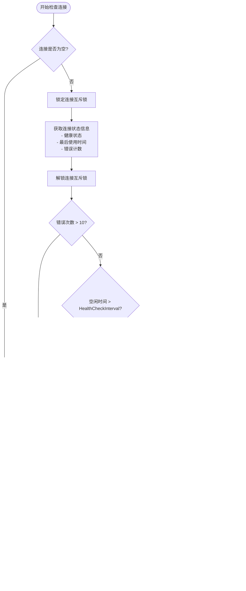
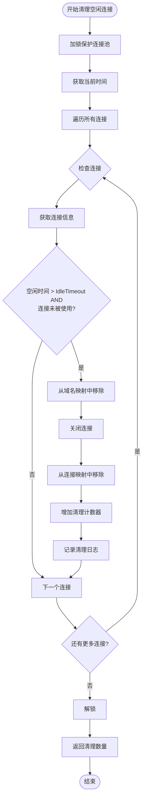

# 连接维护机制详解

<cite>
**本文档引用的文件**
- [health_checker.go](file://utlsclient/health_checker.go)
- [connection_manager.go](file://utlsclient/connection_manager.go)
- [constants.go](file://utlsclient/constants.go)
- [interfaces.go](file://utlsclient/interfaces.go)
- [utlshotconnpool.go](file://utlsclient/utlshotconnpool.go)
- [connection_validator.go](file://utlsclient/connection_validator.go)
- [connection_manager_test.go](file://test/utlsclient/connection_manager_test.go)
</cite>

## 目录
1. [概述](#概述)
2. [系统架构](#系统架构)
3. [健康检查机制](#健康检查机制)
4. [连接清理机制](#连接清理机制)
5. [配置参数详解](#配置参数详解)
6. [维护任务协调](#维护任务协调)
7. [错误处理与恢复](#错误处理与恢复)
8. [性能优化策略](#性能优化策略)
9. [故障排除指南](#故障排除指南)
10. [总结](#总结)

## 概述

连接维护机制是热连接池（UTLSHotConnPool）的核心功能之一，负责确保连接池中所有连接的健康状态和有效性。该机制通过健康检查器（HealthChecker）和连接管理器（ConnectionManager）协同工作，实现了对连接状态的实时监控、定期检查和自动清理。

主要功能包括：
- **健康状态监控**：实时跟踪连接的健康状态
- **定期健康检查**：基于时间间隔的主动检查机制
- **错误次数限制**：防止频繁错误导致的资源浪费
- **空闲连接清理**：释放长时间未使用的连接
- **过期连接清理**：移除超出生命周期的连接
- **黑名单过滤**：自动移除被标记为不可用的IP

## 系统架构

连接维护机制采用分层架构设计，包含以下核心组件：

**图表来源**
- [utlshotconnpool.go](file://utlsclient/utlshotconnpool.go#L237-L258)
- [health_checker.go](file://utlsclient/health_checker.go#L10-L13)
- [connection_manager.go](file://utlsclient/connection_manager.go#L8-L14)

**章节来源**
- [utlshotconnpool.go](file://utlsclient/utlshotconnpool.go#L237-L318)
- [health_checker.go](file://utlsclient/health_checker.go#L10-L21)
- [connection_manager.go](file://utlsclient/connection_manager.go#L8-L22)

## 健康检查机制

### 健康检查器核心功能

健康检查器（HealthChecker）是连接维护系统的核心组件，负责定期检测和验证连接的健康状态。

#### CheckConnection 方法详解

`CheckConnection` 方法是健康检查的核心入口，实现了多层次的健康状态验证：

**图表来源**
- [health_checker.go](file://utlsclient/health_checker.go#L24-L60)

#### 健康检查策略

健康检查采用多层策略确保连接的有效性：

1. **错误次数阈值检查**
   - 最大错误次数：10次
   - 超过阈值立即标记为不健康
   - 自动移除错误累积过多的连接

2. **时间间隔检查**
   - 基于 `HealthCheckInterval` 配置的时间间隔
   - 空闲时间超过设定值才执行健康检查
   - 避免频繁检查造成的性能开销

3. **HEAD请求验证**
   - 发送简单的HEAD请求进行连通性测试
   - 使用较短的超时时间（5秒）
   - 验证目标服务器的基本响应能力

#### performHealthCheck 方法实现

健康检查的具体实现通过 `performHealthCheck` 方法完成：

**图表来源**
- [health_checker.go](file://utlsclient/health_checker.go#L64-L88)

**章节来源**
- [health_checker.go](file://utlsclient/health_checker.go#L24-L88)

### 健康检查任务调度

健康检查任务通过独立的 goroutine 实现周期性执行：

**图表来源**
- [utlshotconnpool.go](file://utlsclient/utlshotconnpool.go#L828-L842)

**章节来源**
- [utlshotconnpool.go](file://utlsclient/utlshotconnpool.go#L828-L866)

## 连接清理机制

### 空闲连接清理

空闲连接清理机制负责移除长时间未使用的连接，释放系统资源：

#### CleanupIdleConnections 方法

空闲连接清理通过以下步骤实现：

**图表来源**
- [connection_manager.go](file://utlsclient/connection_manager.go#L141-L177)

### 过期连接清理

过期连接清理机制移除超出生命周期的连接：

#### CleanupExpiredConnections 方法

**图表来源**
- [connection_manager.go](file://utlsclient/connection_manager.go#L180-L217)

### 不健康连接清理

健康检查器提供了专门的不健康连接清理功能：

#### CleanupUnhealthyConnections 方法

**图表来源**
- [health_checker.go](file://utlsclient/health_checker.go#L154-L164)

**章节来源**
- [connection_manager.go](file://utlsclient/connection_manager.go#L141-L217)
- [health_checker.go](file://utlsclient/health_checker.go#L154-L164)

## 配置参数详解

连接维护机制依赖多个配置参数来控制不同的行为：

### 核心配置参数表

| 参数名称 | 类型 | 默认值 | 描述 | 影响范围 |
|---------|------|--------|------|----------|
| HealthCheckInterval | time.Duration | 30秒 | 健康检查时间间隔 | 健康检查频率 |
| IdleTimeout | time.Duration | 60秒 | 连接空闲超时时间 | 空闲连接清理 |
| MaxLifetime | time.Duration | 300秒 | 连接最大生命周期 | 过期连接清理 |
| CleanupInterval | time.Duration | 60秒 | 清理任务执行间隔 | 清理任务频率 |
| BlacklistCheckInterval | time.Duration | 300秒 | 黑名单检查间隔 | 黑名单过滤频率 |
| DNSUpdateInterval | time.Duration | 1800秒 | DNS更新间隔 | DNS缓存刷新 |

### 配置参数的作用机制

**图表来源**
- [utlshotconnpool.go](file://utlsclient/utlshotconnpool.go#L186-L201)

**章节来源**
- [utlshotconnpool.go](file://utlsclient/utlshotconnpool.go#L186-L201)

## 维护任务协调

### 后台维护任务架构

连接池启动时会创建多个后台维护任务，各司其职：

**图表来源**
- [utlshotconnpool.go](file://utlsclient/utlshotconnpool.go#L809-L826)

### 任务间协作机制

维护任务之间通过以下方式协作：

1. **独立执行**：每个任务运行在独立的 goroutine 中
2. **定时触发**：通过 time.Ticker 实现周期性执行
3. **优雅退出**：通过 done 通道实现任务终止
4. **资源同步**：使用 WaitGroup 确保所有任务正确退出

**章节来源**
- [utlshotconnpool.go](file://utlsclient/utlshotconnpool.go#L809-L866)

## 错误处理与恢复

### 错误处理策略

连接维护机制实现了多层次的错误处理策略：

#### 连接错误分类

**图表来源**
- [constants.go](file://utlsclient/constants.go#L48-L56)

#### 错误次数阈值处理

当连接错误次数超过阈值（10次）时，系统采取以下措施：

1. **立即标记为不健康**：停止对该连接的使用
2. **移除连接**：从连接池中彻底移除
3. **记录错误日志**：便于问题诊断
4. **触发重建**：尝试建立新的连接

**章节来源**
- [health_checker.go](file://utlsclient/health_checker.go#L36-L44)
- [constants.go](file://utlsclient/constants.go#L48-L56)

## 性能优化策略

### 连接维护性能优化

连接维护机制采用了多种性能优化策略：

#### 1. 分层检查机制

**图表来源**
- [health_checker.go](file://utlsclient/health_checker.go#L24-L60)

#### 2. 并发控制优化

- **读写锁**：ConnectionManager 使用读写锁提高并发性能
- **连接级锁**：每个连接使用独立的互斥锁避免全局阻塞
- **非阻塞检查**：健康检查不会阻塞主线程操作

#### 3. 缓存机制

- **连接状态缓存**：避免重复的健康检查
- **域名映射缓存**：减少查找开销
- **统计信息缓存**：提供快速的状态查询

**章节来源**
- [connection_manager.go](file://utlsclient/connection_manager.go#L10-L14)
- [health_checker.go](file://utlsclient/health_checker.go#L24-L60)

## 故障排除指南

### 常见问题诊断

#### 1. 连接频繁被移除

**症状**：连接池中的连接频繁被清理

**可能原因**：
- 健康检查间隔设置过短
- 目标服务器响应不稳定
- 网络环境较差

**解决方案**：
- 调整 `HealthCheckInterval` 参数
- 增加 `MaxErrorCount` 阈值
- 检查网络连接质量

#### 2. 连接池容量不足

**症状**：无法获取新的连接

**可能原因**：
- 连接数达到上限
- 连接泄漏导致资源耗尽

**解决方案**：
- 增加 `MaxConnections` 配置
- 检查连接使用情况
- 实施连接泄漏检测

#### 3. 健康检查失败

**症状**：所有连接都被标记为不健康

**可能原因**：
- 目标服务器不可达
- 防火墙阻止健康检查请求
- TLS握手失败

**解决方案**：
- 检查目标服务器状态
- 验证防火墙规则
- 调整健康检查配置

### 监控指标

建议监控以下关键指标：

| 指标名称 | 描述 | 正常范围 |
|---------|------|----------|
| 健康连接数 | 当前健康的连接数量 | > 0 |
| 空闲连接数 | 当前空闲的连接数量 | 0 - MaxIdleConns |
| 连接错误率 | 连接错误占总连接的比例 | < 5% |
| 健康检查频率 | 健康检查的执行频率 | 按配置执行 |
| 清理频率 | 连接清理的执行频率 | 按配置执行 |

**章节来源**
- [connection_manager_test.go](file://test/utlsclient/connection_manager_test.go#L143-L187)

## 总结

连接维护机制是热连接池稳定运行的重要保障，通过健康检查器和连接管理器的协同工作，实现了对连接状态的全面监控和管理。

### 核心优势

1. **自动化维护**：无需人工干预，系统自动维护连接健康
2. **多层次保护**：通过错误计数、时间检查、健康验证等多重机制确保可靠性
3. **高性能设计**：采用分层检查、并发控制等技术保证系统性能
4. **灵活配置**：提供丰富的配置选项适应不同场景需求

### 最佳实践建议

1. **合理配置参数**：根据实际使用场景调整各项配置参数
2. **监控关键指标**：持续监控连接池状态，及时发现潜在问题
3. **定期维护检查**：定期审查连接维护策略的有效性
4. **应急预案准备**：制定连接池故障的应急处理方案

通过深入理解和正确使用连接维护机制，可以显著提升系统的稳定性和性能表现。