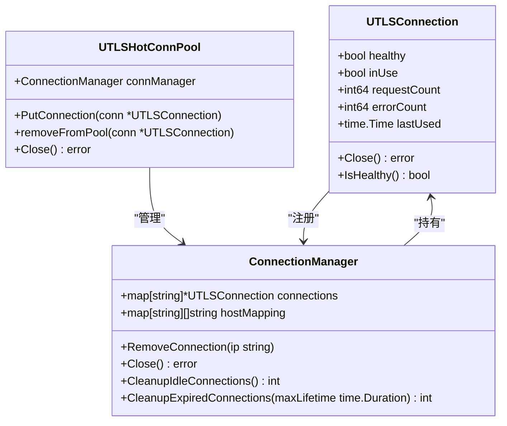
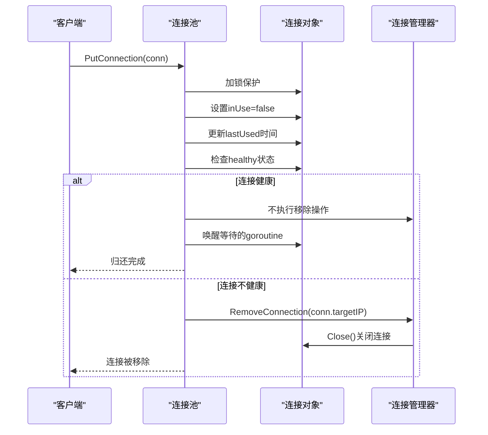
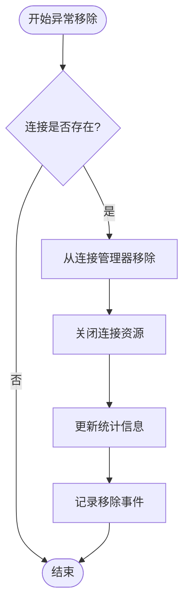
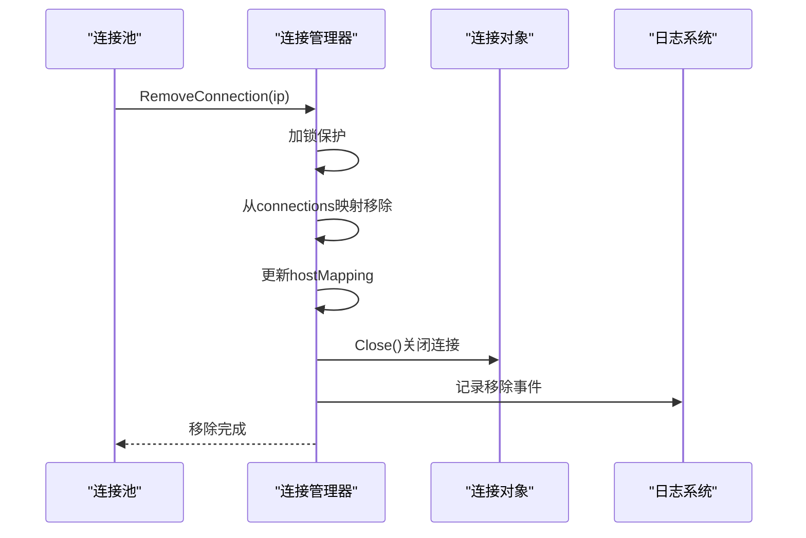
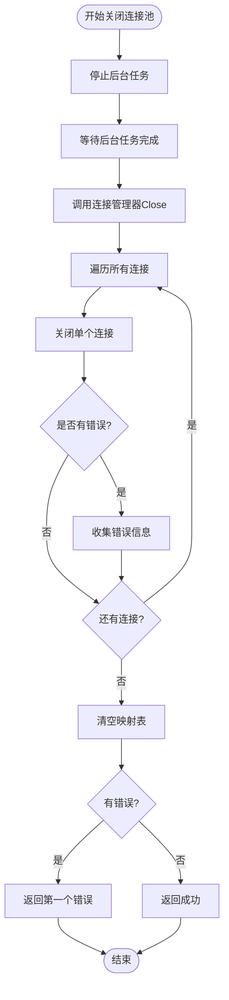
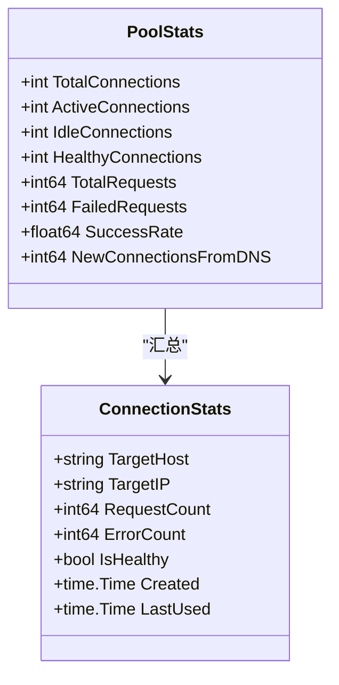

# 连接销毁

<cite>
**本文档引用的文件**
- [utlshotconnpool.go](file://utlsclient/utlshotconnpool.go)
- [connection_manager.go](file://utlsclient/connection_manager.go)
- [connection_helpers.go](file://utlsclient/connection_helpers.go)
- [connection_validator.go](file://utlsclient/connection_validator.go)
- [health_checker.go](file://utlsclient/health_checker.go)
- [connection_manager_test.go](file://test/utlsclient/connection_manager_test.go)
</cite>

## 目录
1. [概述](#概述)
2. [连接销毁的核心机制](#连接销毁的核心机制)
3. [正常归还连接流程](#正常归还连接流程)
4. [异常移除连接流程](#异常移除连接流程)
5. [连接池关闭时的资源清理](#连接池关闭时的资源清理)
6. [统计信息更新机制](#统计信息更新机制)
7. [故障排除指南](#故障排除指南)
8. [总结](#总结)

## 概述

连接销毁是连接池管理系统中的关键环节，负责安全地释放不再使用的连接资源。在热连接池系统中，连接销毁分为两种主要场景：正常归还连接和异常移除连接。每种场景都有不同的处理流程和安全考虑。

## 连接销毁的核心机制

### 连接状态管理架构



**图表来源**
- [utlshotconnpool.go](file://utlsclient/utlshotconnpool.go#L204-L233)
- [connection_manager.go](file://utlsclient/connection_manager.go#L8-L13)

### 连接销毁的关键方法

连接销毁涉及以下核心方法：

| 方法 | 用途 | 触发条件 |
|------|------|----------|
| `PutConnection()` | 正常归还连接到池中 | 连接使用完毕后 |
| `removeFromPool()` | 从连接池移除连接 | 连接不健康或验证失败 |
| `RemoveConnection()` | 从管理器移除连接 | 连接被标记为无效 |
| `Close()` | 关闭单个连接 | 连接池关闭或强制清理 |

**章节来源**
- [utlshotconnpool.go](file://utlsclient/utlshotconnpool.go#L760-L790)
- [connection_manager.go](file://utlsclient/connection_manager.go#L49-L73)

## 正常归还连接流程

### PutConnection 方法详解

正常归还连接是连接池中最常见的销毁场景，当连接使用完毕后，会调用 `PutConnection` 方法将其归还到连接池中。



**图表来源**
- [utlshotconnpool.go](file://utlsclient/utlshotconnpool.go#L760-L784)
- [connection_manager.go](file://utlsclient/connection_manager.go#L49-L73)

### 归还流程的详细步骤

1. **参数验证**：检查传入的连接对象是否为nil
2. **加锁保护**：使用连接级锁确保线程安全
3. **状态更新**：
   - 设置 `inUse = false`
   - 更新 `lastUsed` 时间戳
4. **健康检查**：检查连接的健康状态
5. **异常处理**：如果连接不健康，调用移除流程
6. **唤醒机制**：通知等待的goroutine连接可用

**章节来源**
- [utlshotconnpool.go](file://utlsclient/utlshotconnpool.go#L760-L784)

## 异常移除连接流程

### RemoveFromPool 方法实现

异常移除连接发生在连接出现严重问题时，例如连接验证失败、网络错误或健康检查失败。



**图表来源**
- [utlshotconnpool.go](file://utlsclient/utlshotconnpool.go#L787-L790)
- [connection_manager.go](file://utlsclient/connection_manager.go#L49-L73)

### 移除触发场景

异常移除连接的主要触发场景包括：

| 场景 | 触发条件 | 处理方式 |
|------|----------|----------|
| 连接验证失败 | HTTP状态码非200 | 调用 `removeFromPool()` |
| 健康检查失败 | 连接无法正常通信 | 自动移除 |
| 黑名单命中 | IP被列入黑名单 | 强制移除 |
| 连接超时 | 连接超过最大生命周期 | 清理过期连接 |
| 网络错误 | 连接出现不可恢复的错误 | 立即移除 |

### 连接移除的具体实现



**图表来源**
- [connection_manager.go](file://utlsclient/connection_manager.go#L49-L73)

**章节来源**
- [utlshotconnpool.go](file://utlsclient/utlshotconnpool.go#L787-L790)
- [connection_manager.go](file://utlsclient/connection_manager.go#L49-L73)

## 连接池关闭时的资源清理

### Close 方法的完整流程

当连接池需要关闭时，会调用 `Close` 方法安全地释放所有连接资源。



**图表来源**
- [utlshotconnpool.go](file://utlsclient/utlshotconnpool.go#L1176-L1185)
- [connection_manager.go](file://utlsclient/connection_manager.go#L115-L138)

### 后台任务清理机制

连接池启动时会创建多个后台任务，这些任务会在连接池关闭时自动停止：

| 任务类型 | 清理时机 | 清理内容 |
|----------|----------|----------|
| 健康检查任务 | 连接池关闭时 | 停止健康检查循环 |
| 清理任务 | 连接池关闭时 | 停止定期清理循环 |
| 黑名单检查任务 | 连接池关闭时 | 停止黑名单检查循环 |
| DNS更新任务 | 连接池关闭时 | 停止DNS更新循环 |

**章节来源**
- [utlshotconnpool.go](file://utlsclient/utlshotconnpool.go#L1176-L1185)
- [connection_manager.go](file://utlsclient/connection_manager.go#L115-L138)

## 统计信息更新机制

### 连接销毁过程中的统计更新

在连接销毁过程中，系统会自动更新相关的统计信息，以便监控连接池的运行状态。



**图表来源**
- [utlshotconnpool.go](file://utlsclient/utlshotconnpool.go#L261-L277)
- [utlshotconnpool.go](file://utlsclient/utlshotconnpool.go#L279-L289)

### 统计信息更新规则

| 统计项 | 更新时机 | 更新逻辑 |
|--------|----------|----------|
| `TotalConnections` | 连接添加/移除时 | 增加/减少计数 |
| `ActiveConnections` | 连接使用状态变化时 | 根据inUse状态调整 |
| `HealthyConnections` | 连接健康状态变化时 | 根据healthy状态调整 |
| `TotalRequests` | 连接发送请求时 | 原子递增requestCount |
| `FailedRequests` | 连接发生错误时 | 原子递增errorCount |
| `SuccessRate` | 定期计算 | 成功请求/总请求 |

### 错误计数的特殊处理

在连接销毁过程中，错误计数的更新遵循以下规则：

1. **连接验证失败**：连接对象的 `errorCount` 增加
2. **网络错误**：在 `RoundTripRaw` 方法中自动增加错误计数
3. **关闭失败**：记录错误但不影响统计
4. **并发访问**：使用原子操作确保计数准确性

**章节来源**
- [utlshotconnpool.go](file://utlsclient/utlshotconnpool.go#L1217-L1225)
- [utlshotconnpool.go](file://utlsclient/utlshotconnpool.go#L1279-L1283)

## 故障排除指南

### 常见连接销毁问题

#### 1. 连接泄漏问题

**症状**：连接池中的连接数量持续增长，最终耗尽资源

**排查步骤**：
- 检查 `PutConnection` 调用是否正确执行
- 验证连接使用完成后是否及时归还
- 检查是否有长时间占用连接的情况

**解决方案**：
```go
// 确保使用defer保证连接归还
func processRequest(conn *UTLSConnection) error {
    defer pool.PutConnection(conn)
    // 处理请求...
    return nil
}
```

#### 2. 连接移除过于频繁

**症状**：连接池频繁移除连接，影响性能

**排查步骤**：
- 检查健康检查配置是否过于严格
- 验证网络环境是否稳定
- 分析错误日志中的错误类型

**解决方案**：
- 调整健康检查间隔
- 增加重试次数
- 优化连接验证逻辑

#### 3. 统计信息不准确

**症状**：连接池统计信息与实际不符

**排查步骤**：
- 检查并发访问的锁机制
- 验证原子操作的使用
- 确认统计更新的时机

**解决方案**：
- 使用适当的同步机制
- 确保统计更新的原子性
- 定期验证统计数据

### 性能优化建议

#### 1. 连接销毁性能优化

- 使用批量清理机制减少锁竞争
- 实现异步关闭避免阻塞主线程
- 优化统计更新频率

#### 2. 内存使用优化

- 及时清理无用的连接映射
- 使用对象池减少GC压力
- 控制连接池大小避免内存溢出

#### 3. 并发安全性优化

- 使用读写锁分离读写操作
- 实现细粒度锁减少竞争
- 避免死锁的设计模式

## 总结

连接销毁是连接池管理系统中的重要组成部分，涉及多种场景和复杂的处理逻辑。通过合理的设计和实现，可以确保连接资源得到安全、高效的管理。

### 关键要点

1. **区分正常归还和异常移除**：根据连接状态采用不同的处理策略
2. **确保线程安全**：使用适当的锁机制保护共享资源
3. **维护统计信息**：实时更新连接池状态以便监控和优化
4. **优雅关闭**：在连接池关闭时正确释放所有资源
5. **故障处理**：提供完善的错误处理和恢复机制

### 最佳实践

- 始终使用 `defer` 确保连接归还
- 定期监控连接池状态和统计信息
- 合理配置健康检查和清理策略
- 实现完善的日志记录便于问题排查
- 在高并发场景下注意锁的竞争和性能

通过深入理解连接销毁的机制和实现，开发者可以更好地利用热连接池系统，构建高性能、稳定的网络应用。