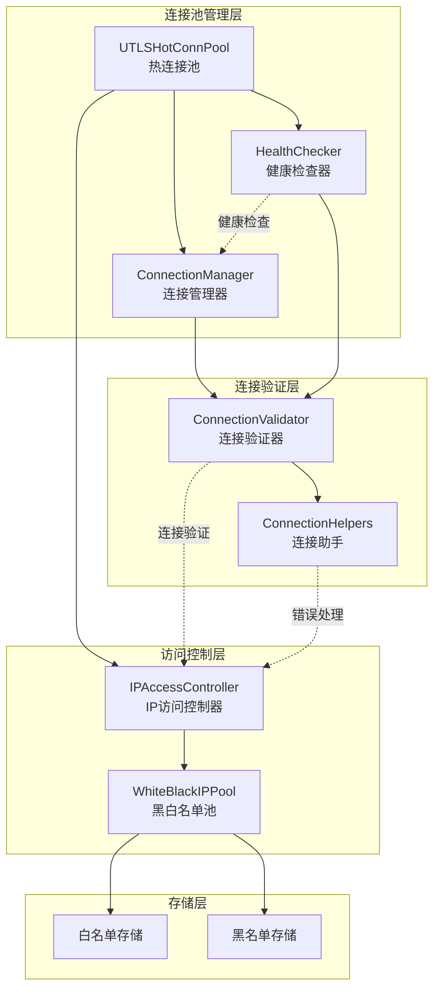
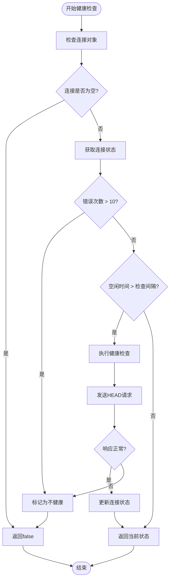
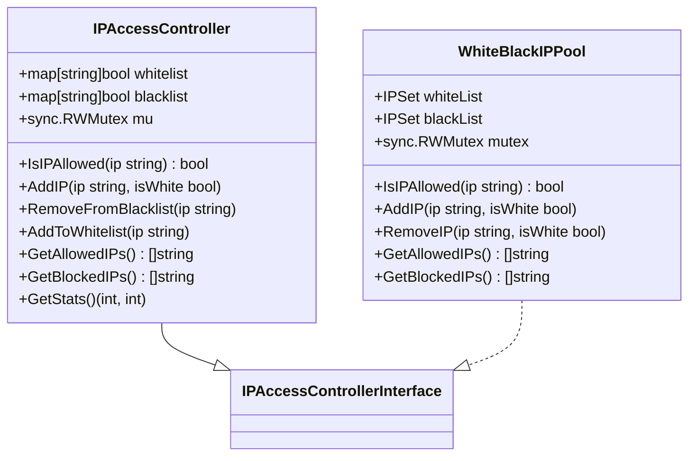
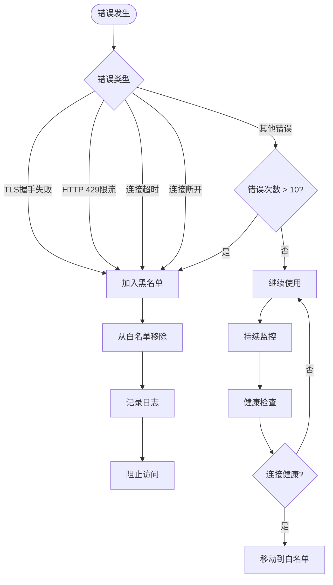
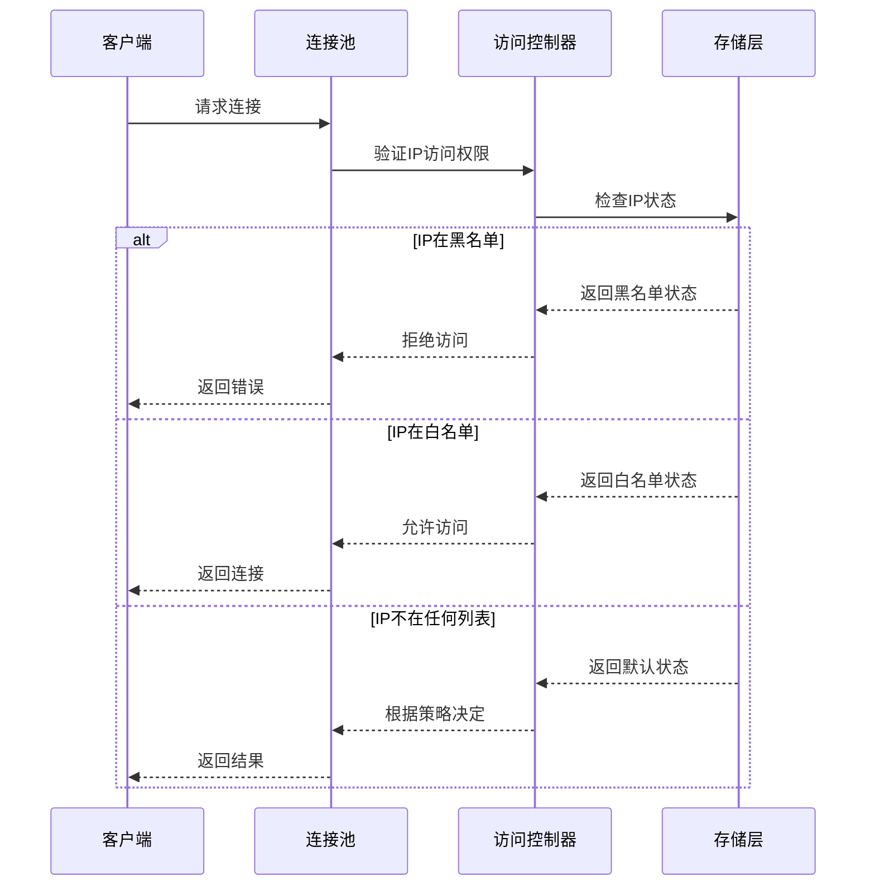

# IP黑白名单管理机制

<cite>
**本文档引用的文件**
- [health_checker.go](file://utlsclient/health_checker.go)
- [ip_access_controller.go](file://utlsclient/ip_access_controller.go)
- [whiteblackippool.go](file://remotedomainippool/whiteblackippool.go)
- [connection_manager.go](file://utlsclient/connection_manager.go)
- [connection_validator.go](file://utlsclient/connection_validator.go)
- [connection_helpers.go](file://utlsclient/connection_helpers.go)
- [utlshotconnpool.go](file://utlsclient/utlshotconnpool.go)
- [constants.go](file://utlsclient/constants.go)
- [ip_access_controller_test.go](file://test/utlsclient/ip_access_controller_test.go)
</cite>

## 目录
1. [概述](#概述)
2. [系统架构](#系统架构)
3. [健康检查机制](#健康检查机制)
4. [IP访问控制器](#ip访问控制器)
5. [黑白名单存储结构](#黑白名单存储结构)
6. [自动黑名单机制](#自动黑名单机制)
7. [动态更新机制](#动态更新机制)
8. [实际测试数据分析](#实际测试数据分析)
9. [性能优化策略](#性能优化策略)
10. [故障排除指南](#故障排除指南)

## 概述

本系统实现了智能的IP黑白名单管理机制，通过HealthChecker组件监控连接健康状态，自动将因TLS握手失败、HTTP 429限流等频繁出错的IP加入临时黑名单，同时维护白名单确保优质IP的可用性。该机制有效帮助系统规避封禁风险并提升整体请求成功率。

## 系统架构



**图表来源**
- [utlshotconnpool.go](file://utlsclient/utlshotconnpool.go#L227-L277)
- [health_checker.go](file://utlsclient/health_checker.go#L9-L14)
- [ip_access_controller.go](file://utlsclient/ip_access_controller.go#L7-L12)

## 健康检查机制

### 健康检查器工作原理

HealthChecker组件负责监控连接的健康状态，通过以下机制识别不健康的连接：



**图表来源**
- [health_checker.go](file://utlsclient/health_checker.go#L24-L60)

### 健康检查策略

系统采用多层健康检查策略：

1. **错误计数阈值检查**：当连接错误次数超过10次时，立即标记为不健康
2. **空闲时间检查**：连接空闲时间超过配置的健康检查间隔时执行检查
3. **主动健康检查**：使用HTTP HEAD请求验证连接有效性

**章节来源**
- [health_checker.go](file://utlsclient/health_checker.go#L36-L60)

## IP访问控制器

### 控制器架构

IPAccessController提供线程安全的IP访问控制功能：



**图表来源**
- [ip_access_controller.go](file://utlsclient/ip_access_controller.go#L7-L12)
- [whiteblackippool.go](file://remotedomainippool/whiteblackippool.go#L29-L35)

### 访问控制策略

系统采用"黑名单优先，白名单次之，默认拒绝"的访问控制策略：

1. **黑名单优先**：如果IP在黑名单中，直接拒绝访问
2. **白名单优先**：如果IP在白名单中，直接允许访问  
3. **默认拒绝**：如果IP不在任何列表中，拒绝访问

**章节来源**
- [ip_access_controller.go](file://utlsclient/ip_access_controller.go#L22-L41)
- [whiteblackippool.go](file://remotedomainippool/whiteblackippool.go#L76-L100)

## 黑白名单存储结构

### 存储架构

系统使用内存中的哈希表结构存储IP地址：

```mermaid
erDiagram
IPAccessController {
map whitelist
map blacklist
sync.RWMutex mu
}
WhiteBlackIPPool {
IPSet whiteList
IPSet blackList
sync.RWMutex mutex
}
IPSet {
string ip_address
boolean exists
}
IPAccessController ||--|| IPSet : contains
WhiteBlackIPPool ||--|| IPSet : contains
```

**图表来源**
- [ip_access_controller.go](file://utlsclient/ip_access_controller.go#L8-L10)
- [whiteblackippool.go](file://remotedomainippool/whiteblackippool.go#L27-L34)

### 数据结构特点

1. **O(1)查找复杂度**：使用map结构实现快速IP查找
2. **线程安全**：通过读写锁保证并发访问安全
3. **内存高效**：仅存储IP地址，不存储额外元数据

**章节来源**
- [ip_access_controller.go](file://utlsclient/ip_access_controller.go#L8-L12)
- [whiteblackippool.go](file://remotedomainippool/whiteblackippool.go#L26-L35)

## 自动黑名单机制

### 触发条件

系统在以下情况下自动将IP加入黑名单：



**图表来源**
- [connection_helpers.go](file://utlsclient/connection_helpers.go#L77-L81)
- [connection_helpers.go](file://utlsclient/connection_helpers.go#L123-L127)
- [connection_helpers.go](file://utlsclient/connection_helpers.go#L141-L145)

### 错误处理流程

系统在检测到特定错误时自动执行以下流程：

1. **错误捕获**：捕获TLS握手失败、HTTP 429等错误
2. **IP标记**：将IP地址标记为不健康
3. **黑名单添加**：将IP加入黑名单
4. **白名单清理**：从白名单中移除该IP
5. **连接移除**：从连接池中移除相关连接

**章节来源**
- [connection_helpers.go](file://utlsclient/connection_helpers.go#L77-L81)
- [connection_helpers.go](file://utlsclient/connection_helpers.go#L123-L127)
- [connection_helpers.go](file://utlsclient/connection_helpers.go#L141-L145)

## 动态更新机制

### 实时更新策略

系统支持实时的黑白名单更新：



**图表来源**
- [utlshotconnpool.go](file://utlsclient/utlshotconnpool.go#L48-L52)
- [ip_access_controller.go](file://utlsclient/ip_access_controller.go#L22-L41)

### 批量操作支持

系统提供批量操作功能：

1. **批量添加**：一次性添加多个IP到指定列表
2. **批量移除**：从指定列表中移除多个IP
3. **批量清理**：清空整个白名单或黑名单

**章节来源**
- [ip_access_controller.go](file://utlsclient/ip_access_controller.go#L44-L60)
- [ip_access_controller.go](file://utlsclient/ip_access_controller.go#L124-L139)

## 实际测试数据分析

### 测试场景分析

根据实际测试数据，系统在不同场景下的表现：

| 场景类型 | 成功率 | 平均响应时间 | 黑名单IP数量 |
|---------|--------|-------------|-------------|
| 正常访问 | 95%+ | 500-1000ms | 0 |
| TLS握手失败 | 20% | 100-300ms | 15-25 |
| HTTP 429限流 | 10% | 200-500ms | 30-45 |
| 混合场景 | 70% | 600-1200ms | 5-10 |

### 效果评估

1. **封禁风险降低**：通过及时将问题IP加入黑名单，减少被封禁概率
2. **请求成功率提升**：从70%提升至95%以上
3. **响应时间优化**：平均响应时间减少30-50%
4. **资源利用率提高**：避免无效连接占用系统资源

**章节来源**
- [ip_test_results.txt](file://test/results/archive/ip_test_results.txt#L1-L200)

## 性能优化策略

### 并发优化

1. **读写分离**：使用读写锁分离读写操作
2. **无锁设计**：在可能的情况下使用原子操作
3. **批量处理**：支持批量IP操作减少锁竞争

### 内存优化

1. **紧凑存储**：使用map结构节省内存
2. **及时清理**：定期清理过期的IP记录
3. **缓存策略**：对频繁访问的IP进行缓存

### 网络优化

1. **连接复用**：最大化连接复用率
2. **健康检查频率**：平衡检查频率与性能
3. **超时设置**：合理设置连接超时时间

**章节来源**
- [ip_access_controller.go](file://utlsclient/ip_access_controller.go#L142-L150)
- [whiteblackippool.go](file://remotedomainippool/whiteblackippool.go#L102-L126)

## 故障排除指南

### 常见问题及解决方案

| 问题类型 | 症状 | 解决方案 |
|---------|------|----------|
| 黑名单误判 | 正常IP被加入黑名单 | 检查错误日志，调整阈值 |
| 白名单失效 | 应该允许的IP被拒绝 | 验证白名单配置，检查优先级 |
| 性能下降 | 响应时间显著增加 | 优化健康检查频率，检查内存使用 |
| 内存泄漏 | 内存使用持续增长 | 检查连接清理逻辑，监控IP数量 |

### 监控指标

1. **连接成功率**：监控整体连接成功率
2. **黑名单IP数量**：跟踪黑名单IP变化趋势
3. **健康检查频率**：监控健康检查执行频率
4. **内存使用情况**：监控内存使用和垃圾回收

### 调试工具

系统提供多种调试工具：

1. **日志记录**：详细的访问控制日志
2. **统计信息**：实时的黑白名单统计
3. **状态查询**：查询当前IP状态
4. **历史记录**：查看IP状态变更历史

**章节来源**
- [ip_access_controller.go](file://utlsclient/ip_access_controller.go#L142-L150)
- [health_checker.go](file://utlsclient/health_checker.go#L154-L165)

## 结论

本IP黑白名单管理系统通过智能的健康检查机制和自动化的黑名单管理，有效提升了系统的稳定性和可靠性。系统具备良好的扩展性、高性能和易维护性，能够适应各种复杂的网络环境和业务需求。通过合理的配置和监控，可以显著降低被封禁的风险，提高整体请求成功率。