# 白名单管理

<cite>
**本文档中引用的文件**
- [whiteblackippool.go](file://remotedomainippool/whiteblackippool.go)
- [ip_access_controller.go](file://utlsclient/ip_access_controller.go)
- [utlshotconnpool.go](file://utlsclient/utlshotconnpool.go)
- [connection_manager.go](file://utlsclient/connection_manager.go)
- [localippool.go](file://localippool/localippool.go)
- [example_hotconnpool_usage.go](file://examples/utlsclient/example_hotconnpool_usage.go)
- [ip_access_controller_test.go](file://test/utlsclient/ip_access_controller_test.go)
</cite>

## 目录
1. [概述](#概述)
2. [白名单架构设计](#白名单架构设计)
3. [核心组件分析](#核心组件分析)
4. [白名单管理机制](#白名单管理机制)
5. [互斥关系处理](#互斥关系处理)
6. [线程安全保护](#线程安全保护)
7. [实际使用场景](#实际使用场景)
8. [核心方法详解](#核心方法详解)
9. [监控与统计](#监控与统计)
10. [最佳实践](#最佳实践)

## 概述

白名单管理是爬虫平台连接池系统中的重要安全机制，通过精确控制IP访问权限来确保关键目标的稳定连接。系统采用双层架构设计，结合IP访问控制器和连接管理器，实现了高效的白名单管理功能。

白名单机制的核心价值在于：
- **优先级保障**：确保高优先级IP获得优先访问权限
- **安全性控制**：限制恶意IP的访问范围
- **性能优化**：通过白名单减少不必要的连接尝试
- **动态管理**：支持运行时的白名单增删改操作

## 白名单架构设计

系统采用分层架构设计，将白名单管理功能抽象为独立的接口和实现：

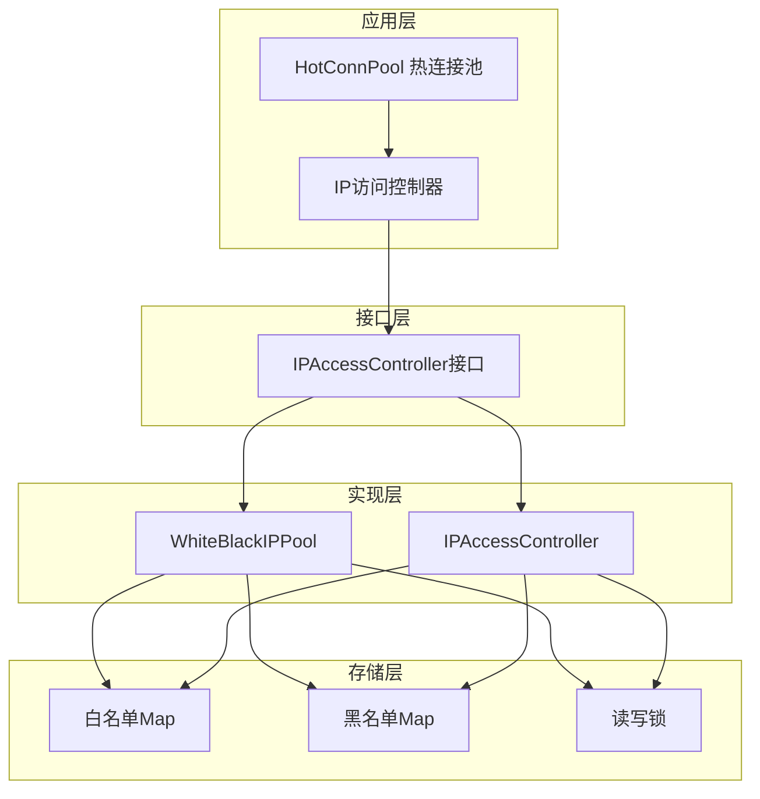

**图表来源**
- [utlshotconnpool.go](file://utlsclient/utlshotconnpool.go#L236-L258)
- [whiteblackippool.go](file://remotedomainippool/whiteblackippool.go#L7-L24)

**章节来源**
- [utlshotconnpool.go](file://utlsclient/utlshotconnpool.go#L236-L258)
- [whiteblackippool.go](file://remotedomainippool/whiteblackippool.go#L26-L59)

## 核心组件分析

### IP访问控制器接口

系统定义了统一的IP访问控制器接口，支持多种实现方式：

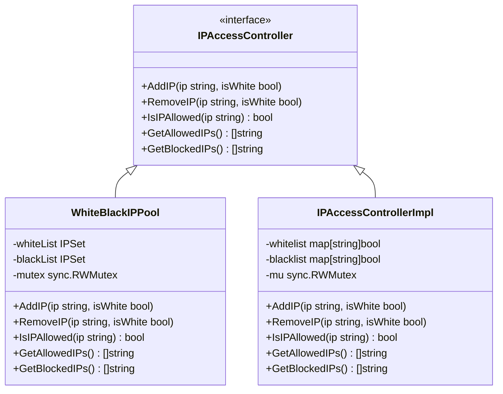

**图表来源**
- [whiteblackippool.go](file://remotedomainippool/whiteblackippool.go#L7-L24)
- [ip_access_controller.go](file://utlsclient/ip_access_controller.go#L8-L12)

### 存储结构设计

白名单和黑名单采用简洁高效的存储结构：

| 组件 | 数据结构 | 特点 | 用途 |
|------|----------|------|------|
| 白名单 | `map[string]bool` | IP地址到布尔值映射 | 快速查找和去重 |
| 黑名单 | `map[string]bool` | IP地址到布尔值映射 | 快速查找和去重 |
| 键值对 | `IP -> true` | 布尔值固定为true | 简化存储，节省内存 |

**章节来源**
- [whiteblackippool.go](file://remotedomainippool/whiteblackippool.go#L26-L27)
- [ip_access_controller.go](file://utlsclient/ip_access_controller.go#L8-L12)

## 白名单管理机制

### AddToWhitelist方法实现

`AddToWhitelist`方法是白名单管理的核心入口，负责将关键IP添加到白名单并确保互斥关系：

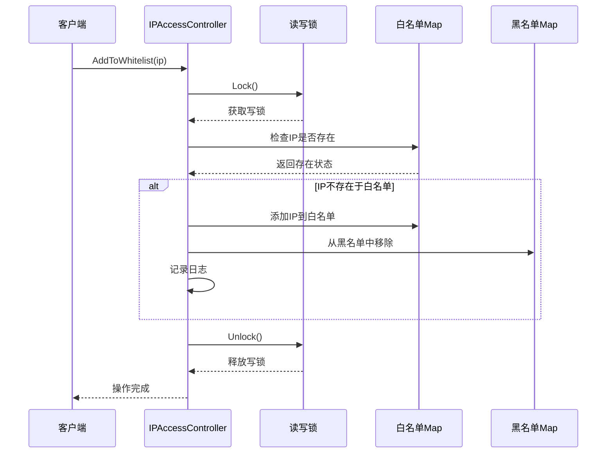

**图表来源**
- [ip_access_controller.go](file://utlsclient/ip_access_controller.go#L100-L109)

### IP访问控制策略

系统采用"黑名单优先，白名单次之，默认拒绝"的访问控制策略：

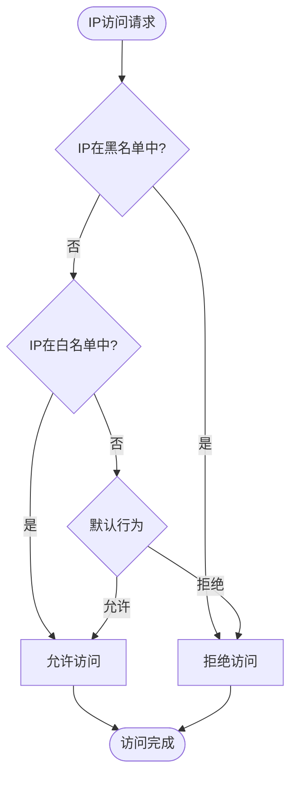

**图表来源**
- [whiteblackippool.go](file://remotedomainippool.go#L76-L100)

**章节来源**
- [ip_access_controller.go](file://utlsclient/ip_access_controller.go#L100-L109)
- [whiteblackippool.go](file://remotedomainippool/whiteblackippool.go#L76-L100)

## 互斥关系处理

### 白名单与黑名单的互斥机制

系统确保IP在同一时间只能存在于白名单或黑名单中，不会同时出现在两个列表中：

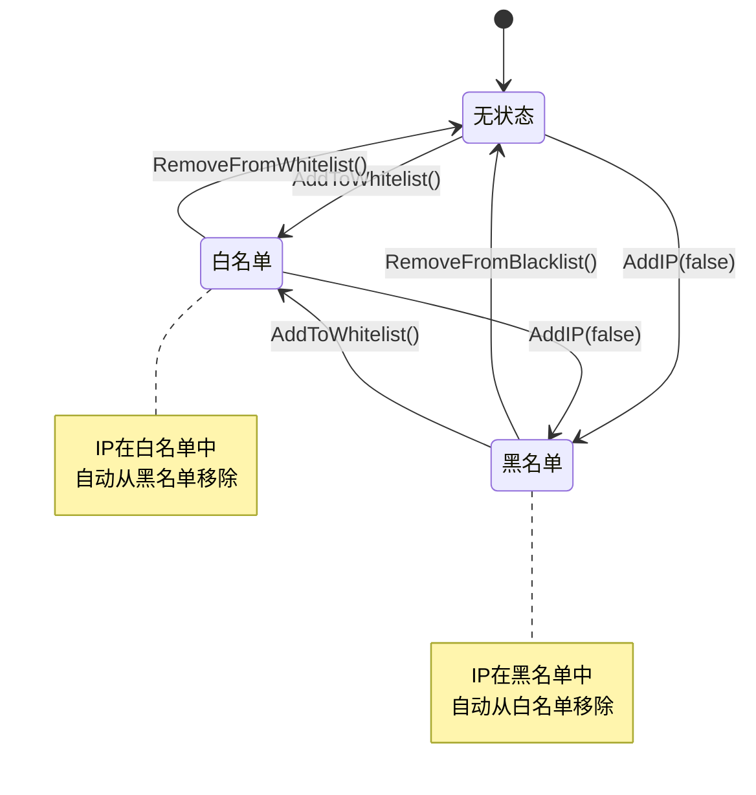

**图表来源**
- [ip_access_controller.go](file://utlsclient/ip_access_controller.go#L44-L60)

### 互斥关系的实现原理

系统通过原子操作确保互斥关系的正确性：

| 操作类型 | 白名单操作 | 黑名单操作 | 互斥处理 |
|----------|------------|------------|----------|
| 添加到白名单 | `whitelist[ip] = true` | `delete(blacklist, ip)` | 自动移除黑名单 |
| 添加到黑名单 | `blacklist[ip] = true` | `delete(whitelist, ip)` | 自动移除白名单 |
| 移除操作 | `delete(whitelist, ip)` | `delete(blacklist, ip)` | 保持一致性 |

**章节来源**
- [ip_access_controller.go](file://utlsclient/ip_access_controller.go#L44-L60)
- [whiteblackippool.go](file://remotedomainippool.go#L51-L58)

## 线程安全保护

### 读写锁机制

系统采用读写锁（`sync.RWMutex`）提供高效的并发控制：

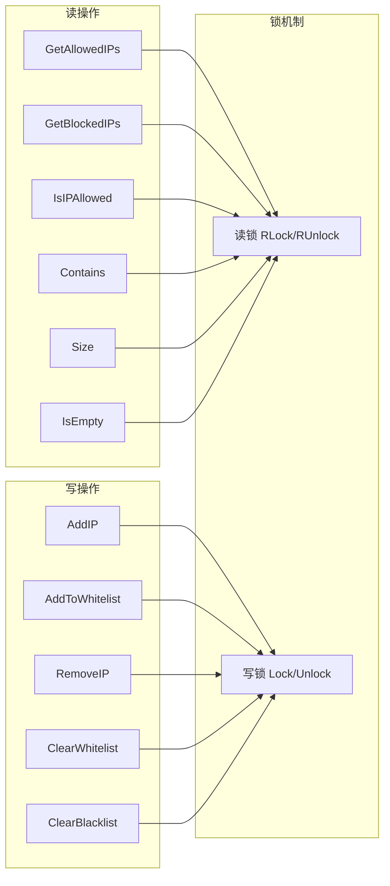

**图表来源**
- [ip_access_controller.go](file://utlsclient/ip_access_controller.go#L11)
- [whiteblackippool.go](file://remotedomainippool.go#L34)

### 并发安全保障

系统通过以下机制确保线程安全：

| 操作类型 | 锁策略 | 性能影响 | 适用场景 |
|----------|--------|----------|----------|
| 读取操作 | 读锁（RLock） | 低冲突，高并发 | IP查询、统计获取 |
| 写入操作 | 写锁（Lock） | 独占，单线程 | IP添加、删除、清空 |
| 批量操作 | 写锁 | 临时阻塞，批量处理 | 配置更新、批量导入 |

**章节来源**
- [ip_access_controller.go](file://utlsclient/ip_access_controller.go#L11)
- [whiteblackippool.go](file://remotedomainippool/whiteblackippool.go#L34)

## 实际使用场景

### IP池预热场景

在IP池预热过程中，系统自动将成功建立连接的IP添加到白名单：

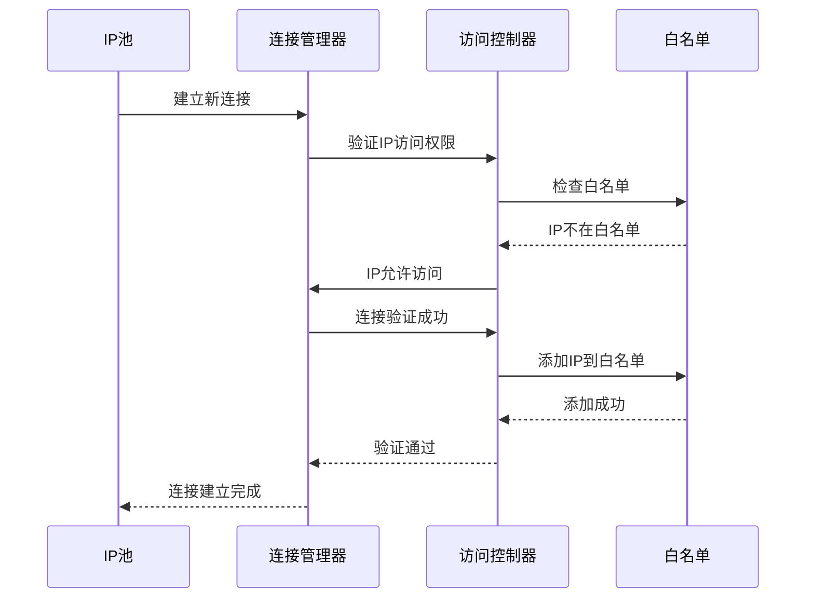

**图表来源**
- [utlshotconnpool.go](file://utlsclient/utlshotconnpool.go#L746-L755)

### 高优先级目标访问场景

对于高优先级的目标网站，系统确保其IP始终在白名单中：

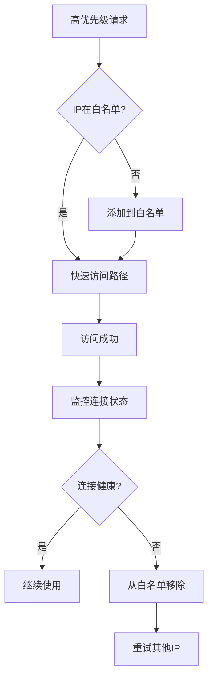

**图表来源**
- [utlshotconnpool.go](file://utlsclient/utlshotconnpool.go#L746-L755)

**章节来源**
- [utlshotconnpool.go](file://utlsclient/utlshotconnpool.go#L746-L755)

## 核心方法详解

### ClearWhitelist方法

清空白名单的实现确保系统状态的一致性：

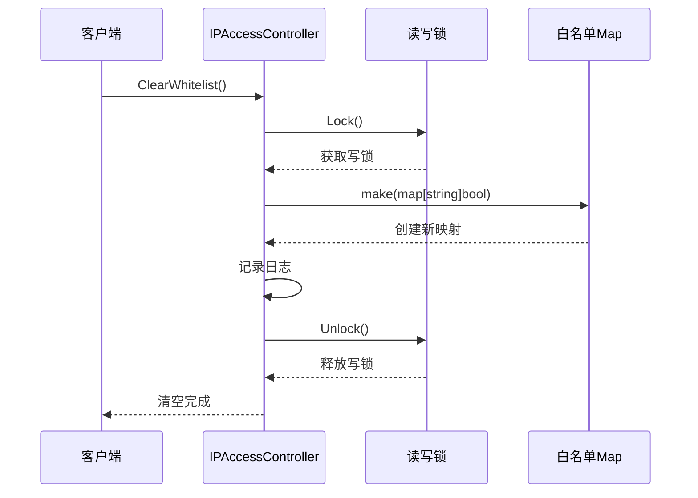

**图表来源**
- [ip_access_controller.go](file://utlsclient/ip_access_controller.go#L123-L130)

### GetAllowedIPs方法

获取白名单IP列表的实现支持快照功能：

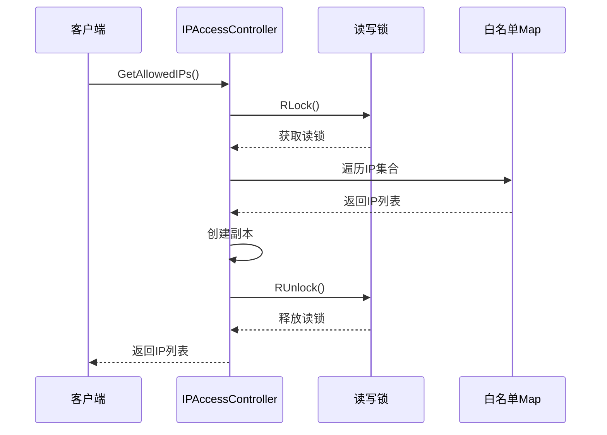

**图表来源**
- [ip_access_controller.go](file://utlsclient/ip_access_controller.go#L62-L73)

### Size和IsEmpty方法

这两个方法提供白名单状态的快速查询：

| 方法 | 功能 | 实现方式 | 性能特点 |
|------|------|----------|----------|
| `Size(isWhite bool)` | 获取列表大小 | `len(map)` | O(1)复杂度 |
| `IsEmpty(isWhite bool)` | 检查是否为空 | `len(map) == 0` | O(1)复杂度 |

**章节来源**
- [ip_access_controller.go](file://utlsclient/ip_access_controller.go#L123-L130)
- [ip_access_controller.go](file://utlsclient/ip_access_controller.go#L62-L73)
- [ip_access_controller.go](file://utlsclient/ip_access_controller.go#L163-L184)

## 监控与统计

### 白名单状态监控

系统提供多种监控手段跟踪白名单状态：

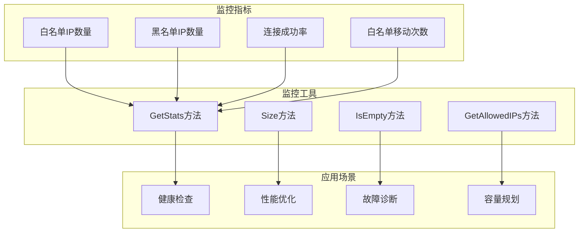

**图表来源**
- [ip_access_controller.go](file://utlsclient/ip_access_controller.go#L141-L151)

### 统计信息收集

系统通过原子操作收集详细的白名单统计数据：

| 统计项 | 数据类型 | 更新时机 | 用途 |
|--------|----------|----------|------|
| 白名单IP数量 | int | 添加/移除时 | 容量监控 |
| 黑名单IP数量 | int | 添加/移除时 | 安全监控 |
| 白名单移动次数 | int64 | 从黑名单移到白名单 | 行为分析 |
| 新增连接数 | int64 | DNS更新时 | 动态监控 |

**章节来源**
- [ip_access_controller.go](file://utlsclient/ip_access_controller.go#L141-L151)

## 最佳实践

### 白名单配置建议

1. **合理设置白名单大小**
   - 根据业务需求确定白名单容量
   - 避免过大导致内存浪费
   - 避过小影响正常业务

2. **定期清理无用IP**
   - 定期检查白名单有效性
   - 移除长期未使用的IP
   - 保持白名单的时效性

3. **监控白名单状态**
   - 实时监控白名单变化
   - 设置告警阈值
   - 记录重要变更事件

### 性能优化建议

1. **批量操作优化**
   ```go
   // 推荐：批量添加IP
   ips := []string{"1.1.1.1", "2.2.2.2", "3.3.3.3"}
   for _, ip := range ips {
       pool.AddIP(ip, true)
   }
   
   // 避免：逐个添加IP
   ```

2. **读写分离优化**
   - 读取操作使用读锁
   - 写入操作使用写锁
   - 减少锁竞争

3. **内存管理优化**
   - 及时清理不再需要的IP
   - 使用合适的缓存策略
   - 监控内存使用情况

### 安全考虑

1. **访问控制**
   - 限制白名单操作权限
   - 记录所有变更日志
   - 实施审计机制

2. **异常处理**
   - 处理并发访问异常
   - 实施重试机制
   - 提供降级方案

3. **数据备份**
   - 定期备份白名单配置
   - 实施灾难恢复计划
   - 验证备份完整性

通过以上最佳实践，可以确保白名单管理系统的稳定性、安全性和高性能，为爬虫平台的可靠运行提供坚实保障。