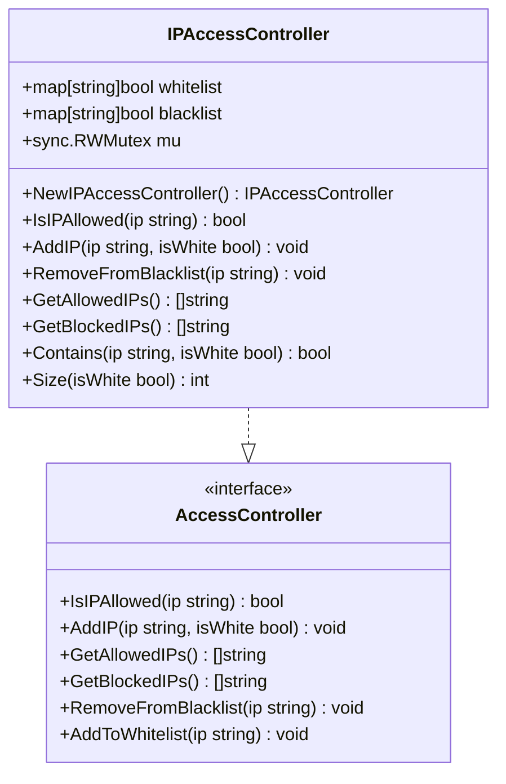
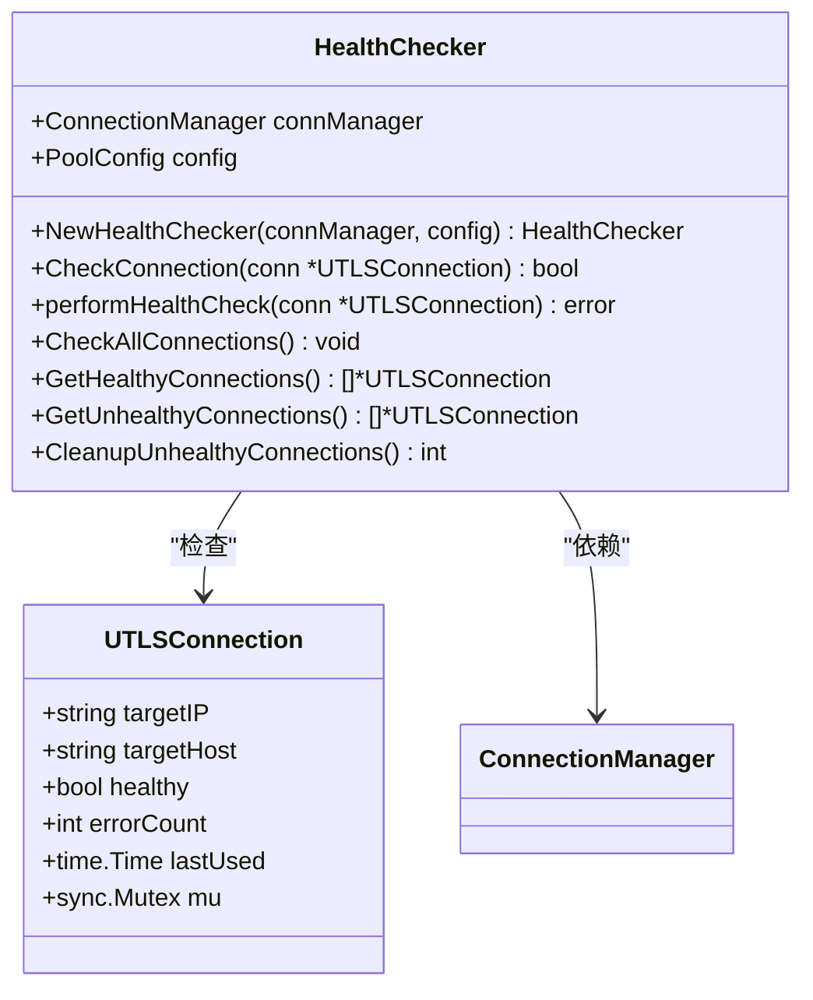
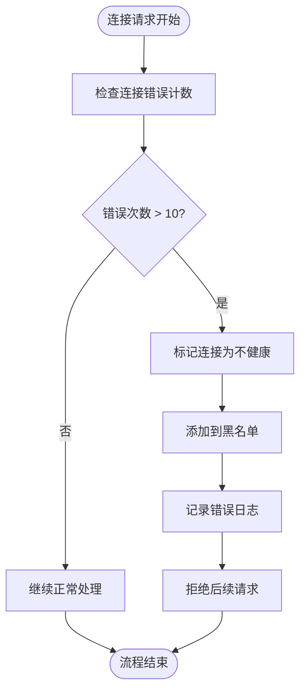
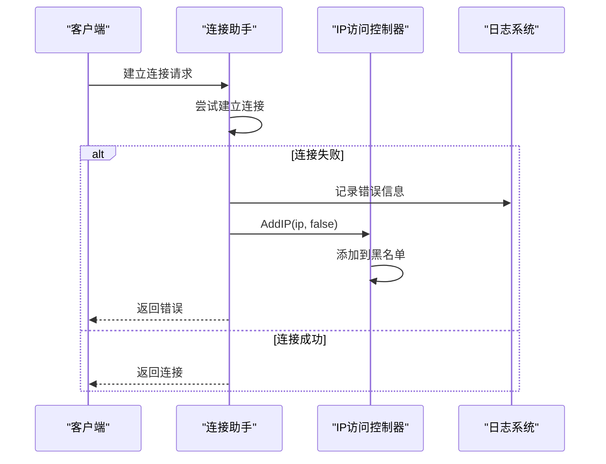
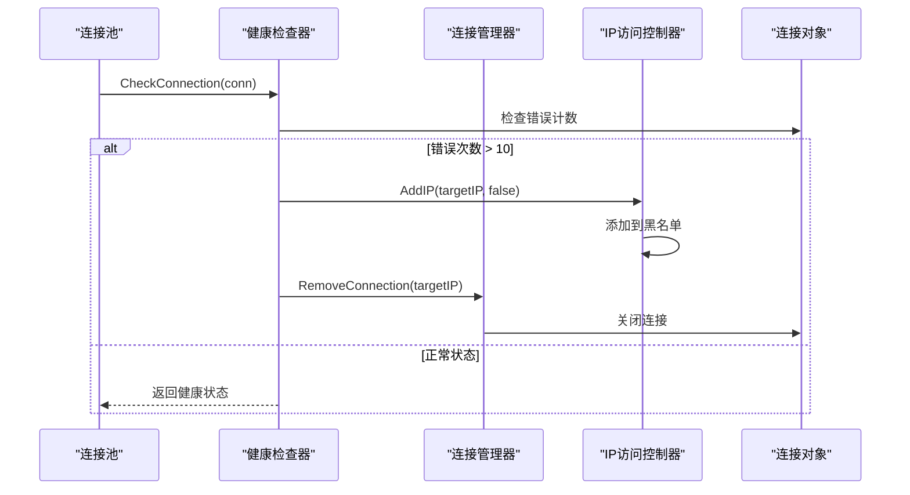
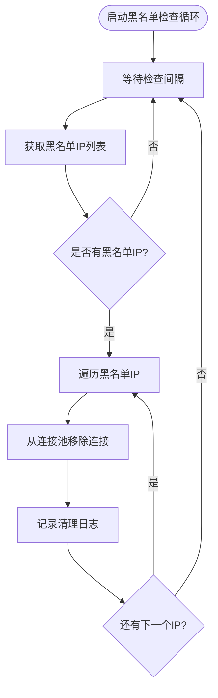
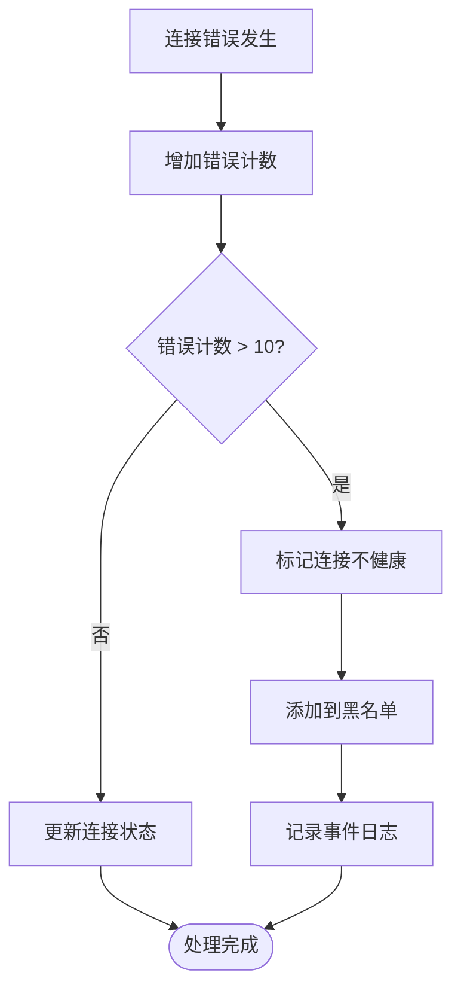
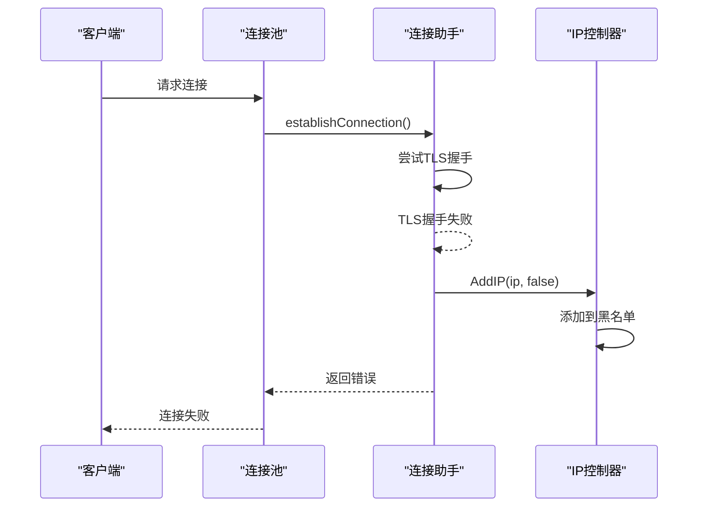
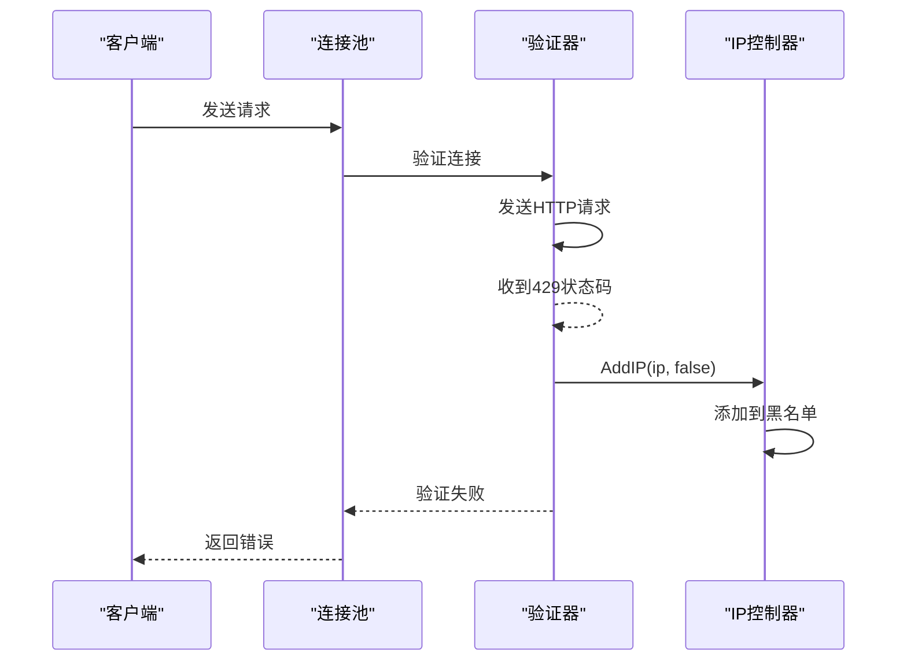
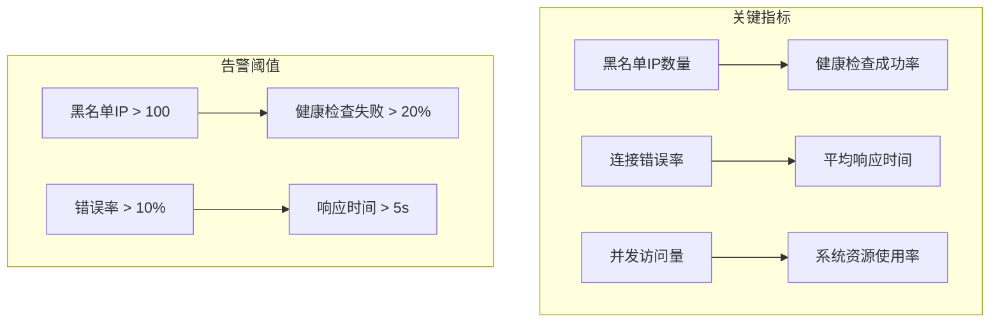

# 黑名单机制

<cite>
**本文档中引用的文件**
- [health_checker.go](file://utlsclient/health_checker.go)
- [ip_access_controller.go](file://utlsclient/ip_access_controller.go)
- [connection_manager.go](file://utlsclient/connection_manager.go)
- [connection_helpers.go](file://utlsclient/connection_helpers.go)
- [connection_validator.go](file://utlsclient/connection_validator.go)
- [utlshotconnpool.go](file://utlsclient/utlshotconnpool.go)
- [interfaces.go](file://utlsclient/interfaces.go)
- [ip_access_controller_test.go](file://test/utlsclient/ip_access_controller_test.go)
</cite>

## 目录
1. [概述](#概述)
2. [系统架构](#系统架构)
3. [核心组件分析](#核心组件分析)
4. [黑名单机制流程](#黑名单机制流程)
5. [健康检查器与IP访问控制器协作](#健康检查器与ip访问控制器协作)
6. [并发安全机制](#并发安全机制)
7. [错误处理与阈值控制](#错误处理与阈值控制)
8. [实际应用场景](#实际应用场景)
9. [性能优化策略](#性能优化策略)
10. [故障排除指南](#故障排除指南)

## 概述

UTLS客户端框架实现了一套完整的IP黑名单管理系统，用于在TLS握手失败、HTTP 429限流等错误频繁发生时，自动将目标IP地址加入临时黑名单，从而降低对不可靠IP的访问频率，提高系统的整体稳定性和可靠性。

该机制的核心特点包括：
- **自动封禁**：当连接错误次数超过阈值时自动触发
- **临时性**：黑名单具有时效性，支持动态更新
- **并发安全**：采用读写锁机制确保多线程环境下的数据一致性
- **智能检测**：结合健康检查和错误统计进行精准判断

## 系统架构

```mermaid
graph TB
subgraph "连接层"
ConnMgr[ConnectionManager<br/>连接管理器]
Conn[UTLSConnection<br/>连接对象]
end
subgraph "健康监控层"
HC[HealthChecker<br/>健康检查器]
CV[ConnectionValidator<br/>连接验证器]
end
subgraph "访问控制层"
IPAC[IPAccessController<br/>IP访问控制器]
Blacklist[黑名单存储<br/>map[string]bool]
Whitelist[白名单存储<br/>map[string]bool]
end
subgraph "连接池层"
UTHCP[UTLSHotConnPool<br/>热连接池]
PoolConfig[PoolConfig<br/>连接池配置]
end
ConnMgr --> Conn
HC --> ConnMgr
CV --> HC
UTHCP --> ConnMgr
UTHCP --> IPAC
IPAC --> Blacklist
IPAC --> Whitelist
UTHCP --> PoolConfig
```

**图表来源**
- [connection_manager.go](file://utlsclient/connection_manager.go#L8-L14)
- [health_checker.go](file://utlsclient/health_checker.go#L9-L13)
- [ip_access_controller.go](file://utlsclient/ip_access_controller.go#L7-L12)
- [utlshotconnpool.go](file://utlsclient/utlshotconnpool.go#L24-L51)

## 核心组件分析

### IP访问控制器

IP访问控制器是黑名单机制的核心组件，负责维护IP地址的白名单和黑名单状态。



**图表来源**
- [ip_access_controller.go](file://utlsclient/ip_access_controller.go#L7-L12)
- [interfaces.go](file://utlsclient/interfaces.go#L22-L48)

**节来源**
- [ip_access_controller.go](file://utlsclient/ip_access_controller.go#L1-L184)
- [interfaces.go](file://utlsclient/interfaces.go#L22-L48)

### 健康检查器

健康检查器负责监控连接的健康状态，当检测到连接异常时触发相应的处理逻辑。



**图表来源**
- [health_checker.go](file://utlsclient/health_checker.go#L9-L13)
- [connection_manager.go](file://utlsclient/connection_manager.go#L8-L14)

**节来源**
- [health_checker.go](file://utlsclient/health_checker.go#L1-L165)

### 连接管理器

连接管理器负责维护连接的生命周期，包括连接的创建、管理和销毁。

**节来源**
- [connection_manager.go](file://utlsclient/connection_manager.go#L1-L218)

## 黑名单机制流程

### 自动封禁触发机制

当连接错误次数超过10次时，系统会自动触发封禁机制：



**图表来源**
- [health_checker.go](file://utlsclient/health_checker.go#L36-L44)

### 错误检测与处理

系统通过多种方式检测连接错误并触发黑名单添加：



**图表来源**
- [connection_helpers.go](file://utlsclient/connection_helpers.go#L77-L164)

**节来源**
- [connection_helpers.go](file://utlsclient/connection_helpers.go#L70-L182)

## 健康检查器与IP访问控制器协作

### 协作关系图



**图表来源**
- [health_checker.go](file://utlsclient/health_checker.go#L24-L61)
- [utlshotconnpool.go](file://utlsclient/utlshotconnpool.go#L849-L919)

### 黑名单检查循环

连接池定期执行黑名单检查，清理黑名单中的连接：



**图表来源**
- [utlshotconnpool.go](file://utlsclient/utlshotconnpool.go#L895-L920)

**节来源**
- [utlshotconnpool.go](file://utlsclient/utlshotconnpool.go#L895-L970)

## 并发安全机制

### 读写锁机制

IP访问控制器使用读写锁确保并发安全：

| 操作类型 | 锁类型 | 用途 |
|---------|--------|------|
| 读取IP状态 | RWMutex.RLock/RUnlock | 多个goroutine同时读取IP状态 |
| 添加IP到黑名单 | Mutex.Lock/Unlock | 独占写入，防止竞态条件 |
| 添加IP到白名单 | Mutex.Lock/Unlock | 独占写入，确保原子性 |
| 移除IP | Mutex.Lock/Unlock | 独占写入，避免数据竞争 |

### 数据结构设计

```mermaid
erDiagram
IPAccessController {
map whitelist
map blacklist
sync.RWMutex mu
}
IPAccessController {
+string ip_address
+bool is_allowed
} ||--|| IPAccessController : "stores"
```

**图表来源**
- [ip_access_controller.go](file://utlsclient/ip_access_controller.go#L7-L12)

**节来源**
- [ip_access_controller.go](file://utlsclient/ip_access_controller.go#L44-L102)

## 错误处理与阈值控制

### 错误分类与处理策略

| 错误类型 | 触发条件 | 处理动作 | 黑名单有效期 |
|---------|----------|----------|-------------|
| TLS握手失败 | 连接建立阶段失败 | 立即加入黑名单 | 临时（可配置） |
| HTTP 429限流 | 服务器返回429状态码 | 增加错误计数 | 临时（可配置） |
| 连接超时 | 请求响应超时 | 增加错误计数 | 临时（可配置） |
| 连接断开 | 网络连接中断 | 增加错误计数 | 临时（可配置） |

### 错误计数机制



**图表来源**
- [health_checker.go](file://utlsclient/health_checker.go#L36-L44)

**节来源**
- [health_checker.go](file://utlsclient/health_checker.go#L36-L44)

## 实际应用场景

### TLS握手失败场景

当遇到TLS握手失败时，系统会自动将IP加入黑名单：



**图表来源**
- [connection_helpers.go](file://utlsclient/connection_helpers.go#L77-L80)

### HTTP 429限流场景

服务器返回429状态码时的处理流程：



**图表来源**
- [connection_validator.go](file://utlsclient/connection_validator.go#L84-L95)

**节来源**
- [connection_helpers.go](file://utlsclient/connection_helpers.go#L124-L164)
- [connection_validator.go](file://utlsclient/connection_validator.go#L84-L95)

## 性能优化策略

### 批量处理机制

系统采用批量处理方式提高效率：

| 优化策略 | 实现方式 | 性能提升 |
|---------|----------|----------|
| 批量黑名单检查 | 定期扫描黑名单IP列表 | 减少I/O操作 |
| 连接池预热 | 提前建立常用IP连接 | 降低延迟 |
| 健康检查去重 | 避免重复检查相同连接 | 减少CPU消耗 |
| 缓存IP状态 | 缓存频繁访问的IP状态 | 提高查询速度 |

### 内存优化

```mermaid
graph LR
subgraph "内存优化策略"
A[使用map[string]bool] --> B[节省内存空间]
C[及时清理过期连接] --> D[防止内存泄漏]
E[批量操作] --> F[减少内存分配]
end
```

**节来源**
- [connection_manager.go](file://utlsclient/connection_manager.go#L142-L218)

## 故障排除指南

### 常见问题诊断

| 问题症状 | 可能原因 | 解决方案 |
|---------|----------|----------|
| IP频繁被加入黑名单 | 服务器配置问题 | 检查服务器设置 |
| 黑名单无法生效 | 配置错误 | 验证配置参数 |
| 性能下降 | 黑名单过大 | 清理过期IP |
| 并发冲突 | 锁竞争 | 优化锁粒度 |

### 监控指标



### 调试技巧

1. **启用详细日志**：设置DEBUG级别日志输出
2. **监控连接状态**：定期检查连接池状态
3. **分析错误模式**：识别重复出现的错误类型
4. **压力测试**：模拟高并发场景验证系统稳定性

**节来源**
- [ip_access_controller_test.go](file://test/utlsclient/ip_access_controller_test.go#L170-L198)

## 结论

UTLS客户端框架的黑名单机制通过多层次的设计实现了高效的IP访问控制。该机制不仅能够自动识别和隔离有问题的IP地址，还能通过合理的配置和监控确保系统的稳定运行。通过健康检查器与IP访问控制器的紧密协作，系统能够在保证服务质量的同时，最大限度地减少无效连接的尝试，从而提高整体的性能和可靠性。

该机制的并发安全性设计确保了在高负载环境下的一致性，而灵活的配置选项则使其能够适应不同的应用场景需求。通过持续的监控和优化，这一机制能够为分布式系统提供可靠的IP访问控制保障。