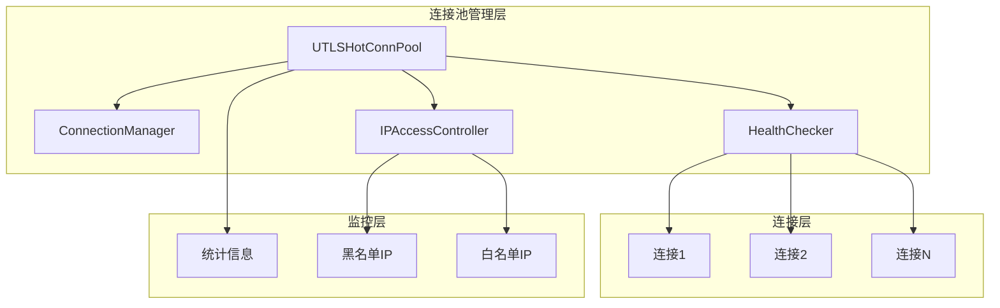
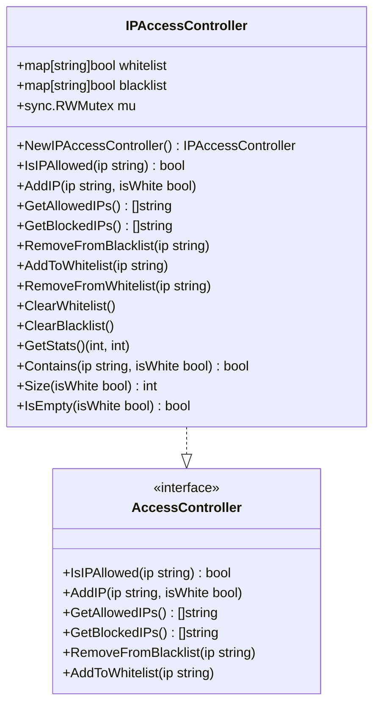
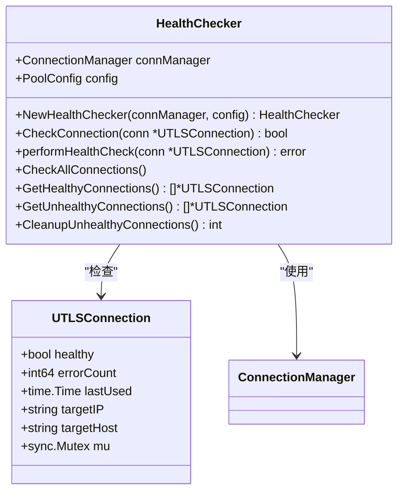
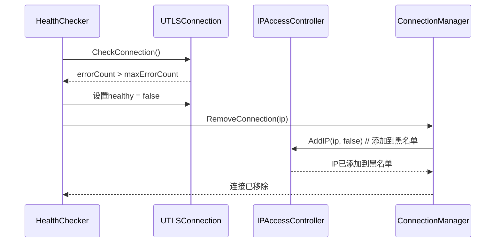
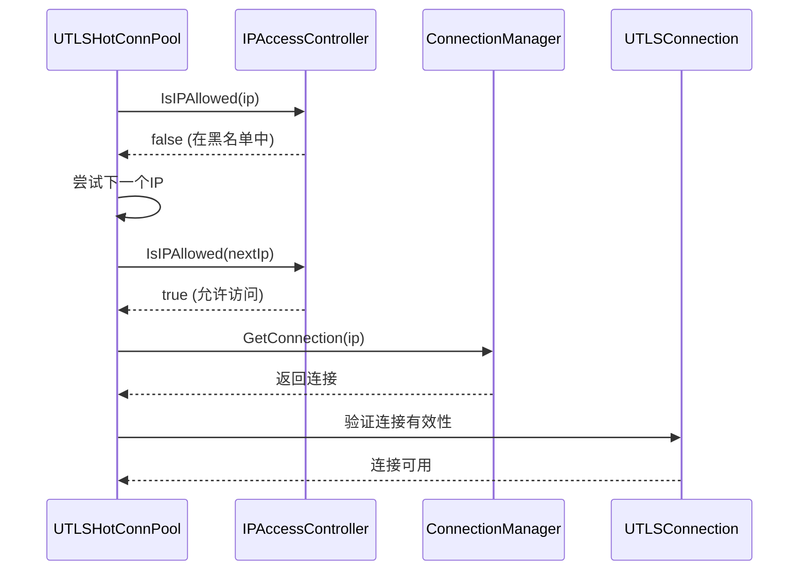
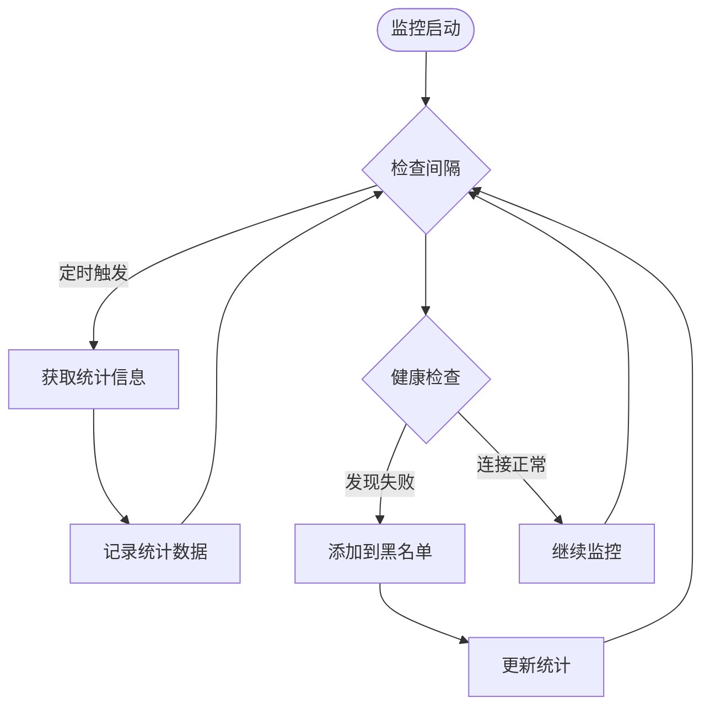
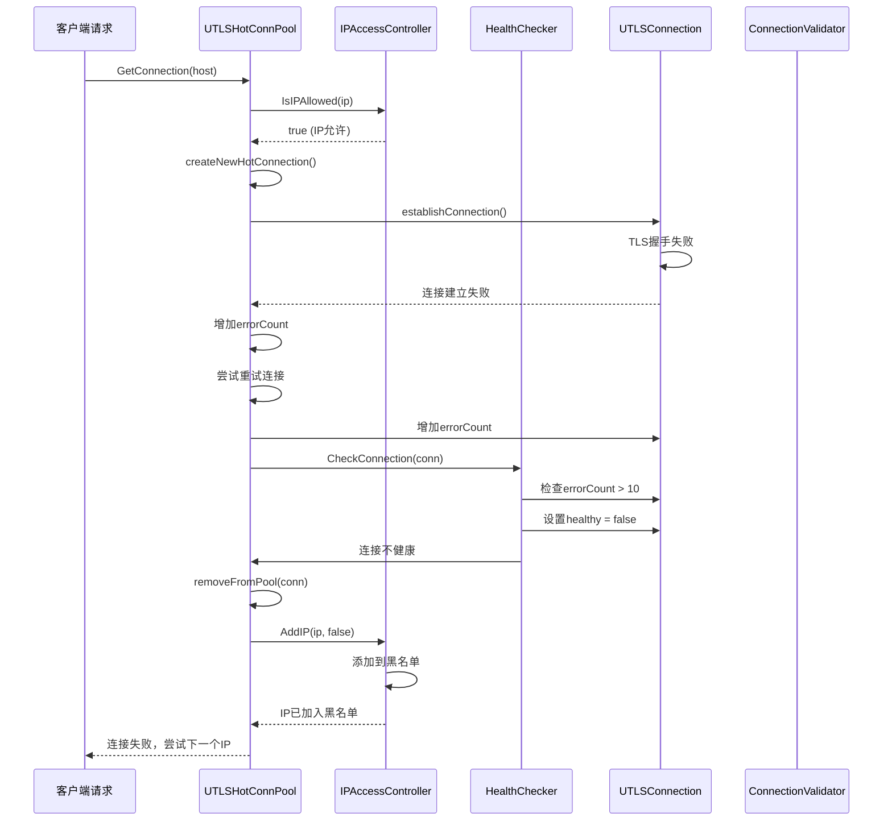
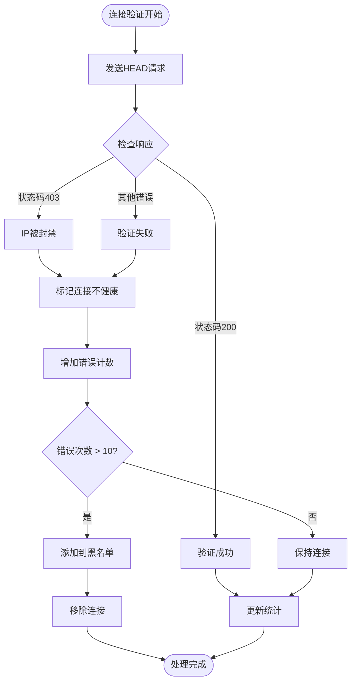
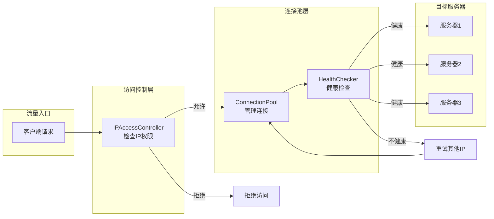

# 黑白名单协同工作机制

<cite>
**本文档引用的文件**
- [ip_access_controller.go](file://utlsclient/ip_access_controller.go)
- [health_checker.go](file://utlsclient/health_checker.go)
- [utlshotconnpool.go](file://utlsclient/utlshotconnpool.go)
- [connection_manager.go](file://utlsclient/connection_manager.go)
- [interfaces.go](file://utlsclient/interfaces.go)
- [connection_validator.go](file://utlsclient/connection_validator.go)
- [ip_access_controller_test.go](file://test/utlsclient/ip_access_controller_test.go)
</cite>

## 目录
1. [概述](#概述)
2. [系统架构](#系统架构)
3. [核心组件分析](#核心组件分析)
4. [协同工作机制](#协同工作机制)
5. [监控与统计](#监控与统计)
6. [调用链路示例](#调用链路示例)
7. [故障隔离与流量调度](#故障隔离与流量调度)
8. [总结](#总结)

## 概述

在UTLS热连接池系统中，IPAccessController与HealthChecker通过紧密协作实现了自动化的故障隔离与流量调度机制。当HealthChecker检测到连接频繁失败时，会触发IPAccessController将问题IP加入黑名单；同时，UTLSHotConnPool在获取连接前通过IsIPAllowed方法检查IP访问权限，从而实现智能的流量分发和故障转移。

## 系统架构

**图表来源**
- [utlshotconnpool.go](file://utlsclient/utlshotconnpool.go#L236-L258)
- [connection_manager.go](file://utlsclient/connection_manager.go#L8-L14)
- [health_checker.go](file://utlsclient/health_checker.go#L9-L13)
- [ip_access_controller.go](file://utlsclient/ip_access_controller.go#L7-L12)

## 核心组件分析

### IPAccessController - IP访问控制器

IPAccessController负责维护IP白名单和黑名单，提供访问控制功能：

**图表来源**
- [ip_access_controller.go](file://utlsclient/ip_access_controller.go#L7-L12)
- [interfaces.go](file://utlsclient/interfaces.go#L22-L49)

### HealthChecker - 健康检查器

HealthChecker负责监控连接健康状态，检测连接失败情况：

**图表来源**
- [health_checker.go](file://utlsclient/health_checker.go#L9-L13)
- [connection_manager.go](file://utlsclient/connection_manager.go#L8-L14)

**章节来源**
- [ip_access_controller.go](file://utlsclient/ip_access_controller.go#L1-L184)
- [health_checker.go](file://utlsclient/health_checker.go#L1-L165)

## 协同工作机制

### 健康检查与黑名单联动

HealthChecker通过以下机制检测连接失败并触发黑名单添加：

**图表来源**
- [health_checker.go](file://utlsclient/health_checker.go#L36-L44)
- [utlshotconnpool.go](file://utlsclient/utlshotconnpool.go#L774-L776)

### 连接获取时的访问控制

UTLSHotConnPool在获取连接时通过IP访问控制确保流量正确路由：

**图表来源**
- [utlshotconnpool.go](file://utlsclient/utlshotconnpool.go#L432-L445)
- [ip_access_controller.go](file://utlsclient/ip_access_controller.go#L22-L41)

**章节来源**
- [health_checker.go](file://utlsclient/health_checker.go#L24-L61)
- [utlshotconnpool.go](file://utlsclient/utlshotconnpool.go#L432-L445)

## 监控与统计

系统提供了完整的监控接口来跟踪黑白名单状态变化：

### 统计信息接口

| 方法 | 功能 | 返回值 |
|------|------|--------|
| `GetStats()` | 获取黑白名单统计信息 | 白名单数量, 黑名单数量 |
| `GetAllowedIPs()` | 获取白名单IP列表 | 白名单IP数组 |
| `GetBlockedIPs()` | 获取黑名单IP列表 | 黑名单IP数组 |
| `Contains(ip, isWhite)` | 检查IP是否在指定列表 | 布尔值 |
| `Size(isWhite)` | 获取指定列表大小 | 整数值 |
| `IsEmpty(isWhite)` | 检查指定列表是否为空 | 布尔值 |

### 实时监控流程

**图表来源**
- [ip_access_controller.go](file://utlsclient/ip_access_controller.go#L141-L161)
- [health_checker.go](file://utlsclient/health_checker.go#L91-L112)

**章节来源**
- [ip_access_controller.go](file://utlsclient/ip_access_controller.go#L141-L184)
- [health_checker.go](file://utlsclient/health_checker.go#L91-L165)

## 调用链路示例

### 完整的故障处理链路

以下是一个完整的调用链路示例，展示从连接错误累积到黑名单添加的全过程：

**图表来源**
- [utlshotconnpool.go](file://utlsclient/utlshotconnpool.go#L530-L553)
- [health_checker.go](file://utlsclient/health_checker.go#L36-L44)
- [ip_access_controller.go](file://utlsclient/ip_access_controller.go#L44-L60)

### 连接验证失败处理

当连接验证失败时，系统会执行以下处理流程：

**图表来源**
- [connection_validator.go](file://utlsclient/connection_validator.go#L41-L96)
- [health_checker.go](file://utlsclient/health_checker.go#L36-L44)

**章节来源**
- [utlshotconnpool.go](file://utlsclient/utlshotconnpool.go#L530-L553)
- [connection_validator.go](file://utlsclient/connection_validator.go#L41-L96)

## 故障隔离与流量调度

### 自动化故障隔离机制

系统通过多层次的防护机制实现自动化故障隔离：

1. **连接级别隔离**：单个连接失败时，仅移除该连接而不影响其他连接
2. **IP级别隔离**：连续失败达到阈值时，将整个IP加入黑名单
3. **域名级别隔离**：同一域名下的所有IP都受影响，防止集中式攻击
4. **动态恢复**：支持手动或自动从黑名单移除IP

### 流量调度策略

**图表来源**
- [utlshotconnpool.go](file://utlsclient/utlshotconnpool.go#L432-L445)
- [ip_access_controller.go](file://utlsclient/ip_access_controller.go#L22-L41)

### 配置参数优化

| 参数 | 默认值 | 说明 |
|------|--------|------|
| `maxErrorCount` | 10 | 连接失败阈值，超过此值将IP加入黑名单 |
| `healthCheckInterval` | 30秒 | 健康检查间隔时间 |
| `blacklistCheckInterval` | 5分钟 | 黑名单检查间隔时间 |
| `maxConnections` | 100 | 最大连接数限制 |
| `maxConnsPerHost` | 10 | 每个主机最大连接数 |

**章节来源**
- [health_checker.go](file://utlsclient/health_checker.go#L36-L44)
- [utlshotconnpool.go](file://utlsclient/utlshotconnpool.go#L186-L201)

## 总结

IPAccessController与HealthChecker的协同工作机制构成了UTLS热连接池系统的核心防护体系。通过健康检查检测连接失败，通过IP访问控制实现故障隔离，系统能够自动识别和处理网络异常，确保服务的稳定性和可靠性。

这种设计的优势包括：

1. **自动化程度高**：无需人工干预即可自动识别和处理故障
2. **响应速度快**：通过实时监控和快速决策机制，迅速隔离问题IP
3. **可扩展性强**：支持动态调整配置参数，适应不同的业务需求
4. **监控完善**：提供丰富的监控接口，便于运维人员掌握系统状态

通过这种协同工作机制，系统能够在保证服务质量的同时，有效抵御各种网络威胁和异常情况，为上层应用提供稳定可靠的连接服务。