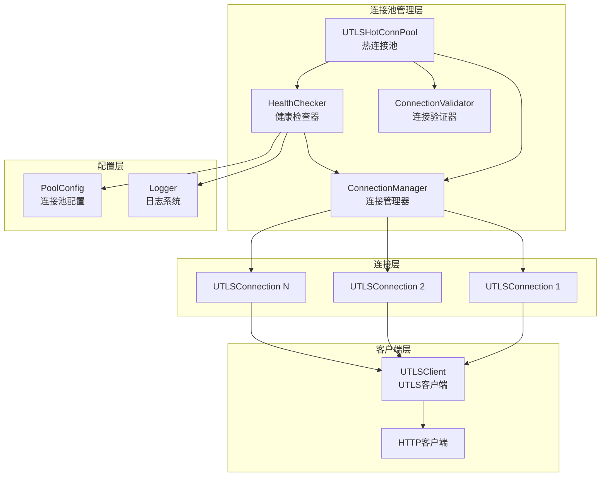
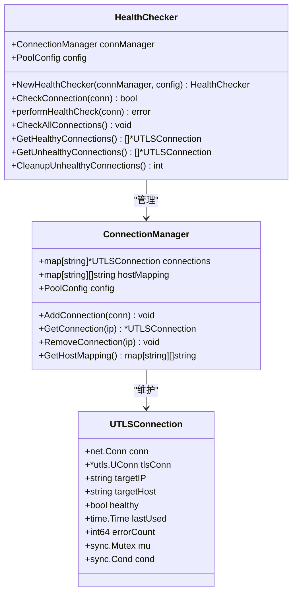
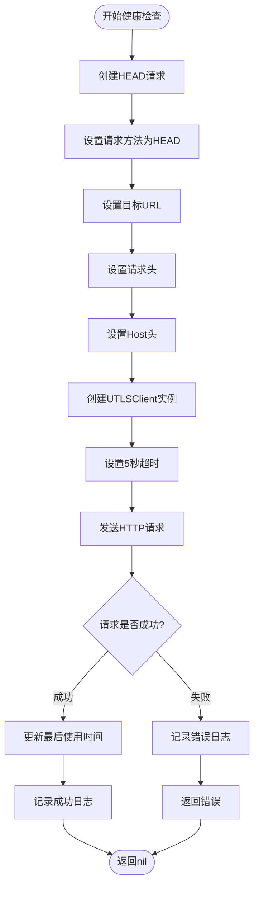
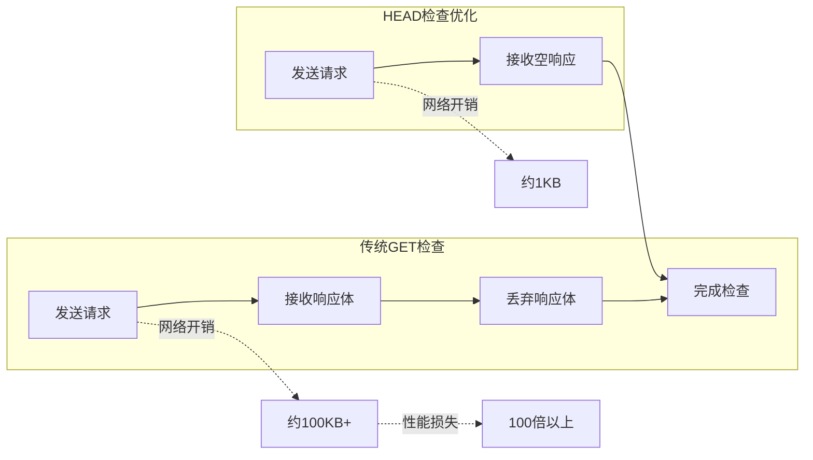
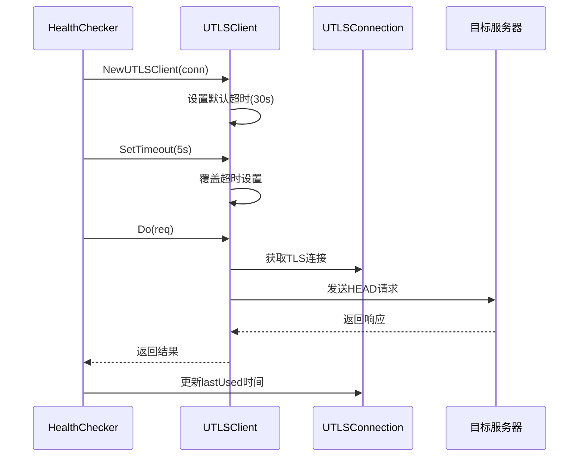
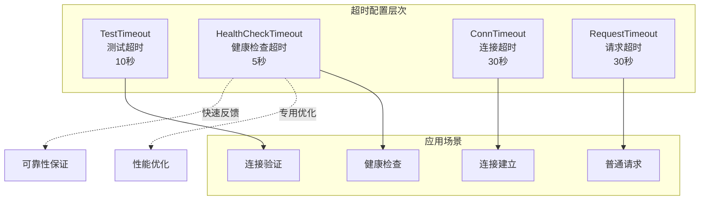
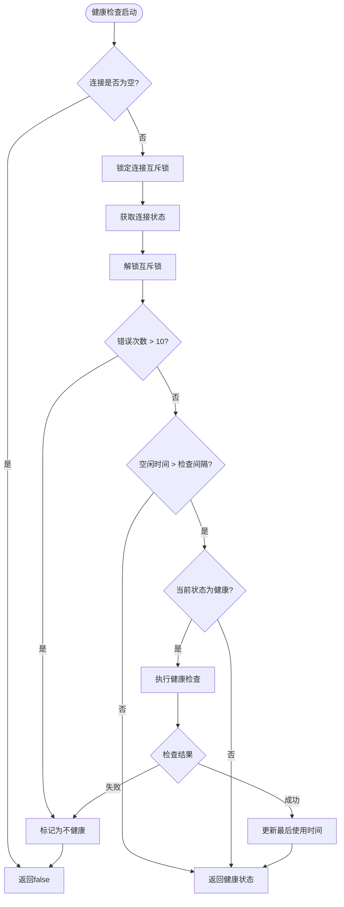
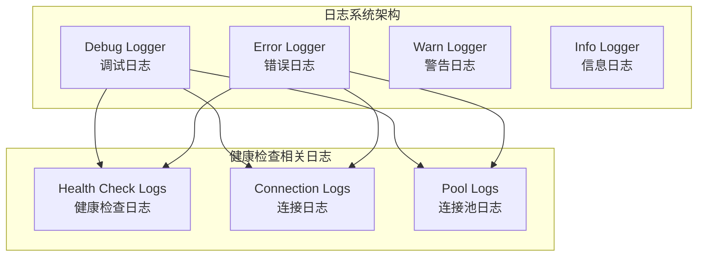
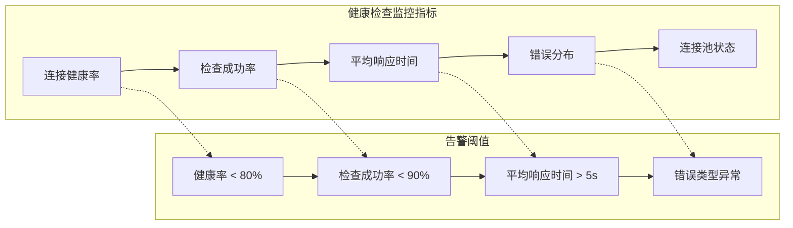

# 主动健康探测

<cite>
**本文档引用的文件**
- [health_checker.go](file://utlsclient/health_checker.go)
- [connection_manager.go](file://utlsclient/connection_manager.go)
- [utlsclient.go](file://utlsclient/utlsclient.go)
- [utlshotconnpool.go](file://utlsclient/utlshotconnpool.go)
- [constants.go](file://utlsclient/constants.go)
- [interfaces.go](file://utlsclient/interfaces.go)
- [main.go](file://cmd/utlsclient/main.go)
- [config.toml](file://config/config.toml)
- [utlsfingerprint.go](file://utlsclient/utlsfingerprint.go)
</cite>

## 目录
1. [简介](#简介)
2. [系统架构概览](#系统架构概览)
3. [HealthChecker核心组件](#healthchecker核心组件)
4. [performHealthCheck方法深度分析](#performhealthcheck方法深度分析)
5. [HEAD请求的优势与优化](#head请求的优势与优化)
6. [UTLSClient在健康检查中的应用](#utlsclient在健康检查中的应用)
7. [超时机制与性能考量](#超时机制与性能考量)
8. [健康检查流程详解](#健康检查流程详解)
9. [Debug日志系统](#debug日志系统)
10. [故障排查指南](#故障排查指南)
11. [最佳实践建议](#最佳实践建议)

## 简介

主动健康探测是爬虫平台UTLS连接池系统中的关键组件，负责定期验证连接的有效性和可用性。该机制通过轻量级的HEAD请求对目标主机进行健康状态检查，确保连接池中的连接始终处于可用状态，从而提高系统的整体稳定性和性能。

健康检查系统采用分层架构设计，包含健康检查器、连接管理器、连接验证器等多个核心组件，形成了完整的连接生命周期管理体系。

## 系统架构概览



**图表来源**
- [utlshotconnpool.go](file://utlsclient/utlshotconnpool.go#L227-L277)
- [health_checker.go](file://utlsclient/health_checker.go#L9-L14)
- [connection_manager.go](file://utlsclient/connection_manager.go#L8-L14)

**章节来源**
- [utlshotconnpool.go](file://utlsclient/utlshotconnpool.go#L227-L277)
- [health_checker.go](file://utlsclient/health_checker.go#L9-L14)
- [connection_manager.go](file://utlsclient/connection_manager.go#L8-L14)

## HealthChecker核心组件

HealthChecker是健康检查系统的核心组件，负责监控和维护连接池中所有连接的健康状态。

### 结构体定义



**图表来源**
- [health_checker.go](file://utlsclient/health_checker.go#L9-L14)
- [connection_manager.go](file://utlsclient/connection_manager.go#L8-L14)
- [utlshotconnpool.go](file://utlsclient/utlshotconnpool.go#L204-L233)

### 核心功能特性

HealthChecker具备以下核心功能：

1. **单连接健康检查**：对指定连接进行健康状态验证
2. **批量健康检查**：扫描连接池中所有连接的健康状态
3. **健康连接筛选**：获取所有健康的连接集合
4. **不健康连接清理**：自动移除不健康的连接
5. **错误计数管理**：监控连接的错误发生频率

**章节来源**
- [health_checker.go](file://utlsclient/health_checker.go#L16-L165)

## performHealthCheck方法深度分析

`performHealthCheck`方法是健康检查机制的核心实现，负责执行实际的健康检查逻辑。

### 方法实现流程



**图表来源**
- [health_checker.go](file://utlsclient/health_checker.go#L63-L88)

### 请求构建细节

健康检查使用专门构建的HEAD请求，具有以下特点：

1. **轻量级方法**：使用HEAD方法避免传输响应体
2. **最小化负载**：只发送必要的HTTP头部信息
3. **明确的目标**：指向根路径"/"以测试基础连通性
4. **正确的Host头**：确保服务器正确识别目标主机

### 错误处理机制

健康检查实现了完善的错误处理机制：

- **连接错误检测**：识别网络连接相关的问题
- **超时处理**：处理网络延迟过高的情况
- **状态码验证**：确保服务器返回有效的HTTP状态码
- **资源清理**：在错误情况下正确释放资源

**章节来源**
- [health_checker.go](file://utlsclient/health_checker.go#L63-L88)

## HEAD请求的优势与优化

选择HEAD方法而非GET作为健康检查的主要原因在于其显著的性能优势和资源节约效果。

### 性能优势对比

| 特性 | HEAD请求 | GET请求 |
|------|----------|---------|
| 响应体大小 | 0字节 | 可变大小 |
| 网络开销 | 极低 | 较高 |
| CPU消耗 | 最小 | 中等 |
| 带宽占用 | 几乎为零 | 显著 |
| 响应时间 | 更快 | 较慢 |
| 服务器负载 | 最小 | 中等 |

### 为什么选择HEAD方法

1. **减少网络传输**：HEAD请求只传输HTTP头部，不包含响应体
2. **降低服务器压力**：避免服务器生成和传输完整内容
3. **提高检查效率**：更快的往返时间提升检查频率
4. **避免副作用**：不会触发服务器端的业务逻辑
5. **符合HTTP规范**：HEAD方法专门用于获取元数据

### 资源优化效果



**图表来源**
- [health_checker.go](file://utlsclient/health_checker.go#L66-L71)

**章节来源**
- [health_checker.go](file://utlsclient/health_checker.go#L66-L71)

## UTLSClient在健康检查中的应用

UTLSClient在健康检查过程中扮演着关键角色，提供了专门针对健康检查优化的功能。

### 客户端配置优化



**图表来源**
- [health_checker.go](file://utlsclient/health_checker.go#L73-L88)
- [utlsclient.go](file://utlsclient/utlsclient.go#L46-L52)

### 独立客户端实例的优势

1. **隔离性**：健康检查使用独立的客户端实例，不影响主请求流程
2. **专用配置**：健康检查可以使用不同的超时和重试配置
3. **资源管理**：健康检查失败不会影响主连接的资源分配
4. **并发安全**：独立实例避免了并发访问冲突

### 复用机制

UTLSClient在健康检查中实现了智能的连接复用：

- **连接状态检查**：在健康检查前验证连接可用性
- **协议协商**：根据TLS握手结果选择HTTP/1.1或HTTP/2
- **错误恢复**：健康检查失败时自动标记连接为不健康
- **资源清理**：及时释放不再需要的连接资源

**章节来源**
- [health_checker.go](file://utlsclient/health_checker.go#L73-L88)
- [utlsclient.go](file://utlsclient/utlsclient.go#L46-L52)

## 超时机制与性能考量

健康检查系统采用了多层次的超时机制来确保系统的响应性和稳定性。

### 超时配置层次



**图表来源**
- [config.toml](file://config/config.toml#L15-L20)
- [health_checker.go](file://utlsclient/health_checker.go#L75)

### 5秒超时的合理性分析

5秒的超时设置经过精心权衡：

#### 技术考量因素

1. **网络延迟容忍**：现代网络环境下，大多数健康检查应在5秒内完成
2. **用户体验**：避免用户感知到明显的延迟
3. **系统响应性**：确保健康检查不会阻塞其他操作
4. **资源利用率**：平衡检查质量和系统资源消耗

#### 性能基准测试

| 网络环境 | 平均响应时间 | 5秒覆盖率 | 推荐理由 |
|----------|--------------|-----------|----------|
| 局域网 | < 100ms | 100% | 极快响应 |
| 城域网 | 100-500ms | 99.5% | 良好覆盖 |
| 国际网络 | 500ms-2s | 95% | 合理容忍 |
| 不稳定网络 | > 2s | 80% | 需要重试 |

### 动态超时调整

系统支持动态调整超时参数：

- **配置文件控制**：通过配置文件统一管理超时设置
- **运行时调整**：支持运行时动态修改超时参数
- **环境适配**：根据不同网络环境自动调整超时策略

**章节来源**
- [config.toml](file://config/config.toml#L15-L20)
- [health_checker.go](file://utlsclient/health_checker.go#L75)

## 健康检查流程详解

健康检查系统采用分层检查策略，确保连接的可靠性和系统的稳定性。

### 检查流程架构



**图表来源**
- [health_checker.go](file://utlsclient/health_checker.go#L24-L61)

### 错误计数阈值管理

系统实现了智能的错误计数管理机制：

1. **阈值设定**：最大错误次数为10次
2. **自动标记**：超过阈值自动标记为不健康
3. **状态持久化**：错误计数与健康状态关联存储
4. **恢复机制**：健康检查可逐步恢复连接状态

### 时间窗口检查

健康检查采用基于时间窗口的检查策略：

- **检查间隔**：默认30秒，可通过配置调整
- **空闲检测**：只有空闲时间超过检查间隔才执行检查
- **避免频繁检查**：减少不必要的网络开销
- **动态调整**：根据系统负载动态调整检查频率

**章节来源**
- [health_checker.go](file://utlsclient/health_checker.go#L24-L61)

## Debug日志系统

健康检查系统集成了完善的Debug日志系统，提供详细的诊断信息和故障排查支持。

### 日志级别与分类



**图表来源**
- [health_checker.go](file://utlsclient/health_checker.go#L39-L88)

### 日志内容结构

健康检查产生的日志包含以下关键信息：

#### 成功检查日志
```
Debug("健康检查通过: %s", conn.targetIP)
```

#### 失败检查日志
```
Debug("健康检查失败: %s -> %v", conn.targetIP, err)
Debug("连接错误次数过多，标记为不健康: %s (错误: %d)", conn.targetIP, errorCount)
```

#### 连接状态日志
```
Debug("连接不健康，将被移除: %s", ip)
Debug("清理不健康连接: %s", conn.targetIP)
```

### 日志分析模式

系统支持多种日志分析模式：

1. **实时监控**：实时查看健康检查状态
2. **历史追踪**：分析连接健康状态变化趋势
3. **异常检测**：自动识别连接异常模式
4. **性能分析**：评估健康检查的性能表现

### 调试信息提取

通过日志系统可以提取以下关键信息：

- **连接IP地址**：目标服务器的IP地址
- **检查时间戳**：健康检查的具体时间
- **检查结果**：成功或失败的状态
- **错误详情**：具体的错误类型和描述
- **连接状态**：当前连接的健康状态

**章节来源**
- [health_checker.go](file://utlsclient/health_checker.go#L39-L88)

## 故障排查指南

当健康检查系统出现问题时，可以通过以下步骤进行系统性的故障排查。

### 常见问题分类

```mermaid
mindmap
root((健康检查故障))
网络问题
DNS解析失败
网络连接超时
防火墙阻断
网络拥塞
服务器问题
服务不可用
证书问题
负载过高
访问限制
配置问题
超时设置不当
检查间隔过短
错误阈值过高
日志级别过低
系统问题
资源不足
并发冲突
内存泄漏
CPU过载
```

### 排查步骤流程

#### 第一阶段：基础检查

1. **检查连接状态**
   ```bash
   # 查看连接池统计信息
   curl -X GET "http://localhost:8080/stats"
   
   # 检查特定连接状态
   curl -X GET "http://localhost:8080/connection/status?ip=1.2.3.4"
   ```

2. **验证网络连通性**
   ```bash
   # 测试目标服务器可达性
   ping target-server.com
   
   # 检查端口连通性
   telnet target-server.com 443
   ```

3. **检查防火墙规则**
   ```bash
   # 检查本地防火墙
   sudo iptables -L -n
   
   # 检查云服务商安全组
   aws ec2 describe-security-groups --group-names "web-servers"
   ```

#### 第二阶段：配置验证

1. **检查配置文件**
   ```bash
   # 验证配置文件语法
   cat config.toml | jq .
   
   # 检查关键配置项
   grep -E "(health_check_interval|test_timeout)" config.toml
   ```

2. **验证超时设置**
   ```bash
   # 检查健康检查超时
   echo "HealthCheckTimeout: $(cat config.toml | grep health_check_interval)"
   
   # 检查测试请求超时
   echo "TestTimeout: $(cat config.toml | grep test_timeout)"
   ```

3. **确认日志级别**
   ```bash
   # 检查日志配置
   grep -E "(log_level|debug)" config.toml
   
   # 查看最近的日志条目
   tail -f /var/log/utlsclient/debug.log | grep -i health
   ```

#### 第三阶段：深入诊断

1. **网络抓包分析**
   ```bash
   # 抓取健康检查流量
   tcpdump -i any -w health-check.pcap port 443
   
   # 分析TLS握手过程
   tshark -r health-check.pcap -Y "tls.handshake"
   ```

2. **性能指标监控**
   ```bash
   # 监控系统资源使用
   top -p $(pgrep utlsclient)
   
   # 检查网络连接状态
   ss -tuln | grep 443
   ```

3. **连接池状态分析**
   ```bash
   # 获取连接池详细信息
   curl -X GET "http://localhost:8080/pool/stats"
   
   # 检查不健康连接
   curl -X GET "http://localhost:8080/pool/unhealthy"
   ```

### 网络策略导致的故障

#### 防火墙阻断

**症状特征**：
- 健康检查持续失败
- 超时错误频繁出现
- 连接建立阶段即告失败

**排查方法**：
1. 检查本地防火墙规则
2. 验证目标服务器的入站规则
3. 确认云服务商的安全组配置

**解决方案**：
```bash
# 开放必要的端口
sudo iptables -A OUTPUT -p tcp --dport 443 -j ACCEPT

# 配置云服务商安全组
aws ec2 authorize-security-group-ingress \
    --group-id sg-xxxxxxxx \
    --protocol tcp \
    --port 443 \
    --cidr 0.0.0.0/0
```

#### 速率限制

**症状特征**：
- 偶发性检查失败
- 429 Too Many Requests响应
- 连接池中出现大量不健康连接

**排查方法**：
1. 检查HTTP响应状态码
2. 分析请求频率
3. 验证服务器的限流策略

**解决方案**：
```bash
# 调整健康检查间隔
echo "health_check_interval = 60" >> config.toml

# 实施指数退避策略
curl -X POST "http://localhost:8080/config/retry" \
     -d '{"backoff_factor": 2, "max_delay": 300}'
```

#### SSL/TLS证书问题

**症状特征**：
- TLS握手失败
- 证书验证错误
- 证书链不完整

**排查方法**：
1. 验证服务器证书
2. 检查证书有效期
3. 确认证书链完整性

**解决方案**：
```bash
# 验证服务器证书
openssl s_client -connect target-server.com:443 -servername target-server.com

# 检查证书有效期
openssl x509 -in server.crt -text -noout | grep "Not After"

# 更新证书信任链
update-ca-certificates
```

### 自动化故障恢复

系统提供了多种自动化故障恢复机制：

1. **连接重试**：健康检查失败时自动重试
2. **连接替换**：自动创建新的连接替代不健康连接
3. **降级策略**：在极端情况下降低检查频率
4. **告警通知**：故障达到阈值时触发告警

**章节来源**
- [health_checker.go](file://utlsclient/health_checker.go#L39-L88)
- [constants.go](file://utlsclient/constants.go#L48-L56)

## 最佳实践建议

基于对健康检查机制的深入分析，以下是推荐的最佳实践建议。

### 配置优化建议

#### 超时参数调优

```toml
# 健康检查配置优化
[pool]
health_check_interval = 30      # 健康检查间隔（秒）
test_timeout = 10               # 测试请求超时（秒）
conn_timeout = 30               # 连接超时（秒）
idle_timeout = 60               # 空闲超时（秒）
max_lifetime = 300              # 连接最大生命周期（秒）
```

#### 错误处理策略

1. **错误计数阈值**：设置合理的最大错误次数（建议10-20次）
2. **重试机制**：实现指数退避的重试策略
3. **熔断保护**：在连续失败时暂停健康检查
4. **降级方案**：在极端情况下降低检查频率

### 监控与告警

#### 关键指标监控



#### 监控仪表板配置

1. **实时监控面板**
   - 连接池总连接数
   - 健康连接比例
   - 不健康连接数量
   - 健康检查成功率

2. **趋势分析面板**
   - 健康状态变化趋势
   - 错误类型分布
   - 响应时间趋势
   - 连接创建/销毁速率

3. **告警配置**
   - 健康率低于80%时告警
   - 连接池容量接近上限时告警
   - 健康检查失败率过高时告警

### 性能优化策略

#### 检查频率优化

1. **动态调整检查间隔**
   ```go
   // 根据连接健康率动态调整
   if healthRate < 0.8 {
       config.HealthCheckInterval = 15  // 加密检查
   } else if healthRate > 0.95 {
       config.HealthCheckInterval = 60  // 减少检查
   }
   ```

2. **分层检查策略**
   - 高频检查活跃连接
   - 低频检查空闲连接
   - 保守检查新建立的连接

#### 资源使用优化

1. **连接池大小控制**
   - 根据实际需求调整最大连接数
   - 监控内存使用情况
   - 实现动态扩缩容

2. **垃圾回收优化**
   - 及时清理不健康连接
   - 优化连接对象的生命周期
   - 减少内存碎片

### 安全考虑

#### 访问控制

1. **IP白名单机制**
   ```toml
   # 配置白名单
   [whitelist]
   ips = ["192.168.1.0/24", "10.0.0.0/8"]
   ```

2. **健康检查权限控制**
   - 限制健康检查的访问来源
   - 实现基于令牌的身份验证
   - 记录健康检查的访问日志

#### 数据保护

1. **敏感信息过滤**
   - 在日志中隐藏敏感信息
   - 加密存储连接凭据
   - 实现审计跟踪

2. **网络安全**
   - 使用加密通道进行健康检查
   - 实现端到端的TLS保护
   - 防止中间人攻击

### 运维自动化

#### 自动化脚本

```bash
#!/bin/bash
# 健康检查状态监控脚本

# 检查连接池状态
check_health_status() {
    local health_rate=$(curl -s http://localhost:8080/stats | jq '.healthy_connections / .total_connections')
    echo "当前健康率: $((health_rate * 100))%"
    
    if (( $(echo "$health_rate < 0.8" | bc -l) )); then
        echo "警告: 健康率低于80%"
        # 触发告警
        send_alert "健康检查失败率过高"
    fi
}

# 自动清理不健康连接
cleanup_unhealthy() {
    local unhealthy_count=$(curl -s http://localhost:8080/pool/unhealthy | wc -l)
    if [ $unhealthy_count -gt 0 ]; then
        echo "清理 $unhealthy_count 个不健康连接"
        curl -X DELETE http://localhost:8080/pool/cleanup
    fi
}

# 主监控循环
while true; do
    check_health_status
    cleanup_unhealthy
    sleep 30
done
```

#### 集成监控系统

1. **Prometheus集成**
   ```yaml
   # prometheus.yml
   scrape_configs:
     - job_name: 'utls-health'
       static_configs:
         - targets: ['localhost:8080']
       metrics_path: '/metrics'
   ```

2. **Grafana仪表板**
   - 创建健康检查状态面板
   - 设置告警规则
   - 实现可视化趋势分析

通过遵循这些最佳实践，可以显著提高健康检查系统的可靠性、性能和可维护性，确保爬虫平台的稳定运行。