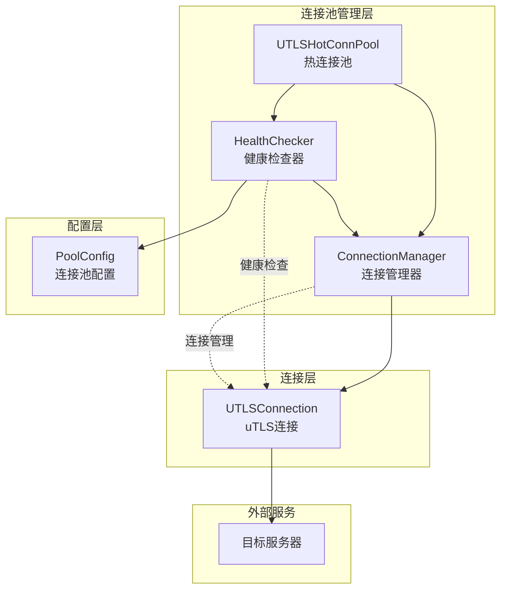
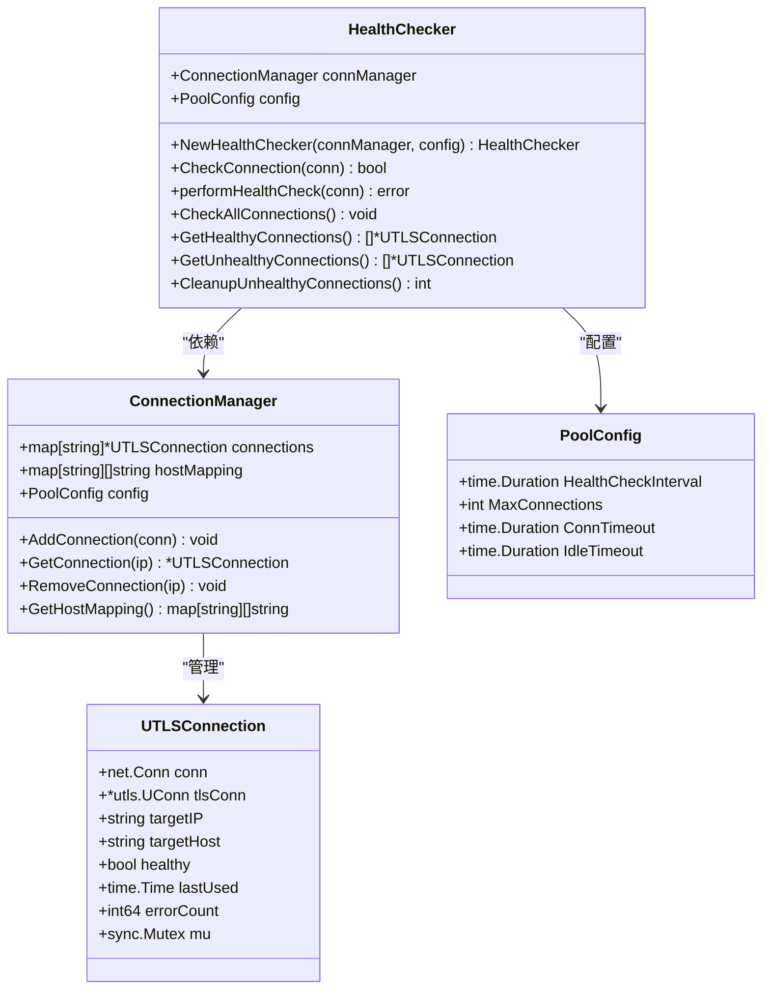
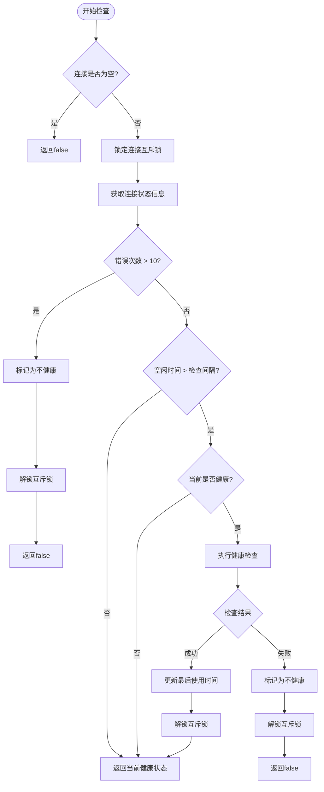
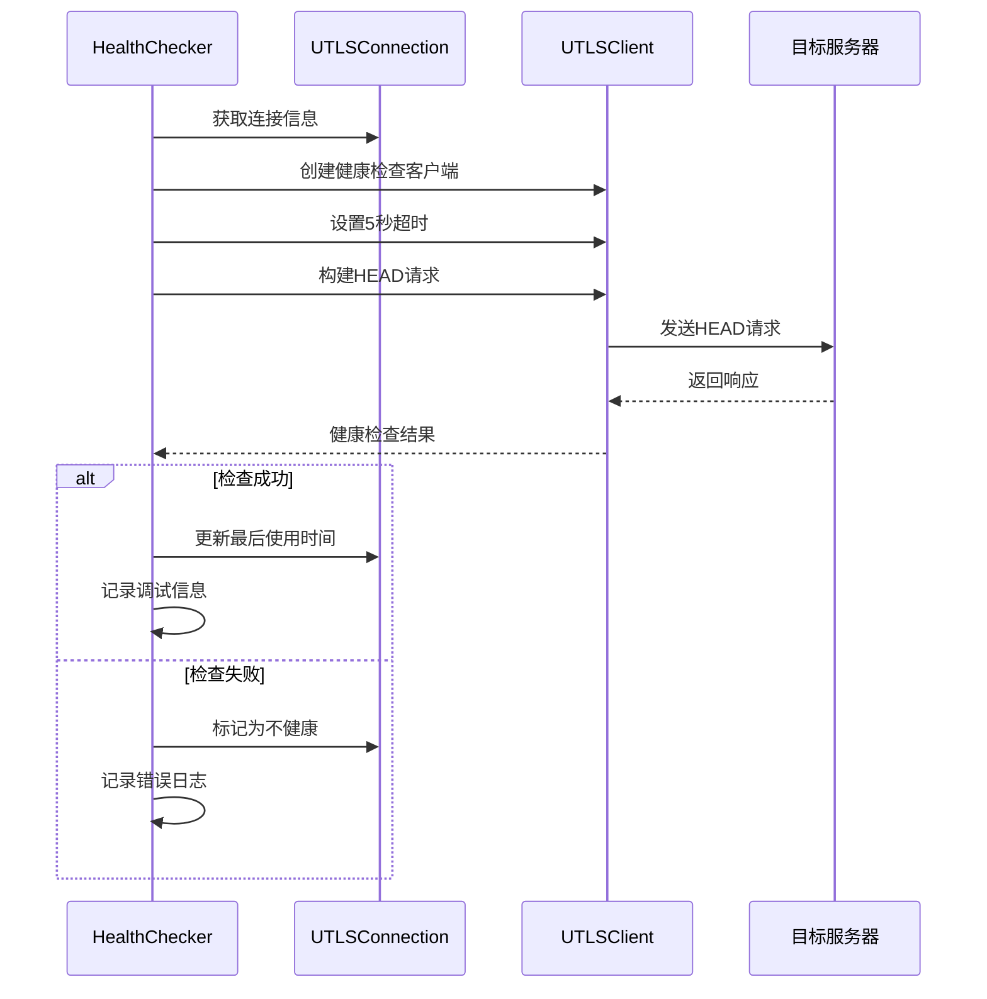
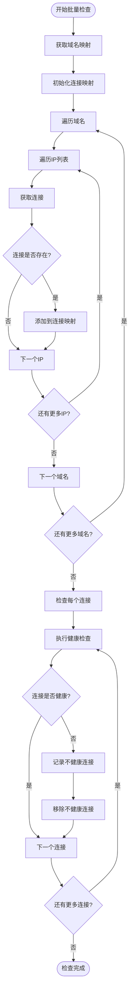
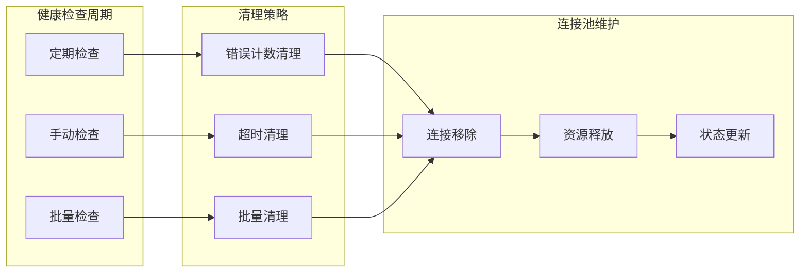

# 健康检查机制

<cite>
**本文档引用的文件**
- [health_checker.go](file://utlsclient/health_checker.go)
- [connection_manager.go](file://utlsclient/connection_manager.go)
- [utlshotconnpool.go](file://utlsclient/utlshotconnpool.go)
- [interfaces.go](file://utlsclient/interfaces.go)
- [热连接池性能测试报告.md](file://test/reports/热连接池性能测试报告.md)
</cite>

## 目录
1. [引言](#引言)
2. [系统架构概览](#系统架构概览)
3. [HealthChecker结构体设计](#healthchecker结构体设计)
4. [核心组件分析](#核心组件分析)
5. [健康检查流程详解](#健康检查流程详解)
6. [连接池健康管理](#连接池健康管理)
7. [性能与稳定性分析](#性能与稳定性分析)
8. [故障排除指南](#故障排除指南)
9. [总结](#总结)

## 引言

健康检查机制是热连接池系统中的关键组件，负责监控和维护连接的可用性。本文档详细阐述了HealthChecker结构体的设计与实现，包括其与ConnectionManager和PoolConfig的依赖关系，以及如何通过多维度指标确保连接池的整体稳定性。

## 系统架构概览

健康检查机制在整个连接池系统中扮演着守护者的角色，通过多层次的检查策略确保连接的可靠性。

**图表来源**
- [utlshotconnpool.go](file://utlsclient/utlshotconnpool.go#L239-L338)
- [connection_manager.go](file://utlsclient/connection_manager.go#L8-L14)
- [health_checker.go](file://utlsclient/health_checker.go#L9-L13)

## HealthChecker结构体设计

HealthChecker是健康检查机制的核心结构体，负责连接健康状态的全面监控。

### 结构体定义

**图表来源**
- [health_checker.go](file://utlsclient/health_checker.go#L9-L13)
- [connection_manager.go](file://utlsclient/connection_manager.go#L8-L14)
- [utlshotconnpool.go](file://utlsclient/utlshotconnpool.go#L170-L183)
- [utlshotconnpool.go](file://utlsclient/utlshotconnpool.go#L204-L233)

### 依赖关系分析

HealthChecker与两个核心组件形成紧密的依赖关系：

1. **ConnectionManager依赖**：负责获取和管理连接实例
2. **PoolConfig依赖**：提供健康检查的时间间隔配置

这种设计遵循了单一职责原则，HealthChecker专注于健康检查逻辑，而连接管理由专门的ConnectionManager处理。

**章节来源**
- [health_checker.go](file://utlsclient/health_checker.go#L9-L13)
- [utlshotconnpool.go](file://utlsclient/utlshotconnpool.go#L338)

## 核心组件分析

### CheckConnection方法详解

CheckConnection方法是健康检查机制的核心入口，通过多维度指标判断连接健康状态。

**图表来源**
- [health_checker.go](file://utlsclient/health_checker.go#L23-L61)

#### 错误计数阈值机制

系统设置了10次错误阈值作为健康状态的重要指标：

- **阈值设定**：当错误计数超过10次时，连接立即标记为不健康
- **快速失效**：防止故障连接继续消耗资源
- **自动恢复**：通过健康检查机制重新评估连接状态

#### 空闲时间检查机制

基于配置的健康检查间隔，系统会对长时间未使用的连接进行主动检查：

- **检查触发**：当连接空闲时间超过HealthCheckInterval时触发
- **检查频率**：避免频繁检查带来的性能开销
- **智能判断**：仅对当前健康的连接进行检查

**章节来源**
- [health_checker.go](file://utlsclient/health_checker.go#L23-L61)

### performHealthCheck方法实现

performHealthCheck方法实现了具体的健康检查逻辑，采用HEAD请求验证机制。

**图表来源**
- [health_checker.go](file://utlsclient/health_checker.go#L63-L88)

#### HEAD请求验证机制

健康检查采用HTTP HEAD请求进行轻量级验证：

- **请求类型**：使用HEAD方法，避免传输响应体
- **超时设置**：5秒超时时间，平衡检查效率与准确性
- **协议支持**：支持HTTP/1.1和HTTP/2协议
- **TLS验证**：通过TLS握手验证连接的有效性

**章节来源**
- [health_checker.go](file://utlsclient/health_checker.go#L63-L88)

## 健康检查流程详解

### CheckAllConnections方法

CheckAllConnections方法提供了批量健康检查功能，确保连接池整体健康状态。

**图表来源**
- [health_checker.go](file://utlsclient/health_checker.go#L91-L112)

### 连接状态管理

系统提供了多种连接状态查询方法：

| 方法 | 功能 | 返回类型 | 使用场景 |
|------|------|----------|----------|
| GetHealthyConnections | 获取所有健康的连接 | []*UTLSConnection | 连接池监控 |
| GetUnhealthyConnections | 获取所有不健康的连接 | []*UTLSConnection | 故障诊断 |
| CleanupUnhealthyConnections | 清理不健康的连接 | int | 自动维护 |

**章节来源**
- [health_checker.go](file://utlsclient/health_checker.go#L114-L164)

## 连接池健康管理

### 自动清理机制

健康检查系统集成了自动清理功能，确保连接池始终保持高质量状态。

**图表来源**
- [health_checker.go](file://utlsclient/health_checker.go#L154-L164)
- [connection_manager.go](file://utlsclient/connection_manager.go#L50-L73)

### 连接生命周期管理

每个连接都有完整的生命周期管理机制：

1. **创建阶段**：建立TCP和TLS连接
2. **使用阶段**：执行HTTP请求，更新使用统计
3. **检查阶段**：定期健康检查，评估连接状态
4. **清理阶段**：移除不健康连接，释放资源

**章节来源**
- [connection_manager.go](file://utlsclient/connection_manager.go#L25-L73)

## 性能与稳定性分析

### 测试报告分析

根据热连接池性能测试报告，健康检查机制表现出色：

| 指标 | 数值 | 说明 |
|------|------|------|
| 预热成功率 | 98.8% | 健康检查有效过滤不健康连接 |
| 连接复用率 | 100% | 健康连接得到充分复用 |
| 平均响应时间 | 4ms/请求 | 热连接显著提升性能 |
| TLS指纹多样性 | 33种 | 91.7%覆盖率，提高伪装效果 |

### 系统稳定性作用

健康检查机制对系统稳定性的作用体现在：

1. **故障隔离**：及时发现并移除不健康连接
2. **资源保护**：防止故障连接消耗系统资源
3. **性能保障**：确保连接池中都是高质量连接
4. **自动恢复**：通过健康检查重新评估连接状态

**章节来源**
- [热连接池性能测试报告.md](file://test/reports/热连接池性能测试报告.md#L76-L80)
- [热连接池性能测试报告.md](file://test/reports/热连接池性能测试报告.md#L142-L145)

## 故障排除指南

### 常见问题诊断

#### 连接健康检查失败

**症状**：健康检查频繁失败，连接被标记为不健康

**可能原因**：
- 网络连接不稳定
- 目标服务器负载过高
- TLS握手参数不匹配

**解决方法**：
- 检查网络连通性
- 调整健康检查超时时间
- 更新TLS指纹配置

#### 连接池空闲清理过多

**症状**：健康检查过于频繁，导致连接被过早清理

**可能原因**：
- HealthCheckInterval设置过短
- 连接使用频率较低
- 服务器响应时间较长

**解决方法**：
- 增加HealthCheckInterval配置
- 优化连接使用策略
- 调整服务器配置

### 监控指标建议

为了更好地监控健康检查机制，建议关注以下指标：

| 指标名称 | 监控目的 | 正常范围 |
|----------|----------|----------|
| 健康检查成功率 | 连接池整体健康状况 | >95% |
| 不健康连接数量 | 连接池质量指标 | <5% |
| 连接清理频率 | 系统稳定性指标 | <10%/小时 |
| 平均检查耗时 | 性能影响评估 | <100ms |

## 总结

健康检查机制是热连接池系统稳定运行的关键保障。通过HealthChecker结构体的精心设计，系统实现了：

1. **多层次健康检查**：从单个连接到整个连接池的全面监控
2. **智能故障处理**：基于错误计数和空闲时间的智能判断
3. **自动维护能力**：自动清理不健康连接，保持连接池质量
4. **高性能保证**：通过HEAD请求验证，最小化检查开销

根据98.8%的高成功率测试结果，健康检查机制有效保障了系统的稳定性和性能，为大规模并发请求提供了可靠的连接基础。这一机制不仅提高了系统的可用性，也为后续的功能扩展奠定了坚实的基础。