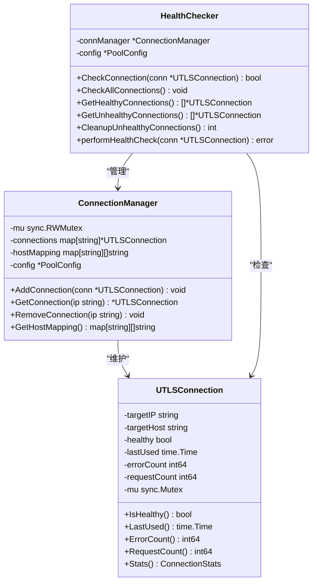
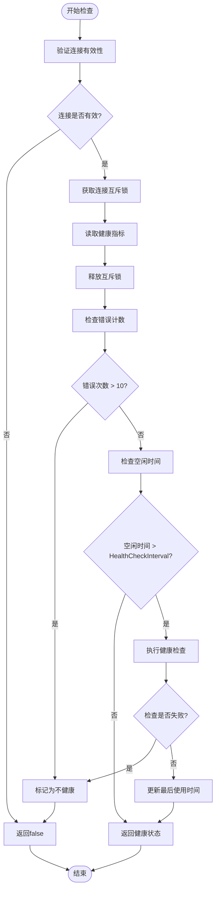
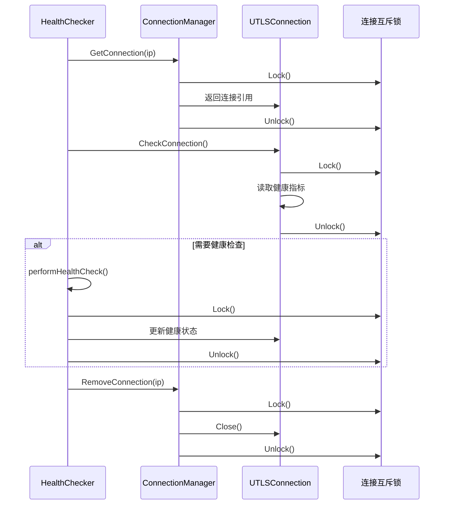
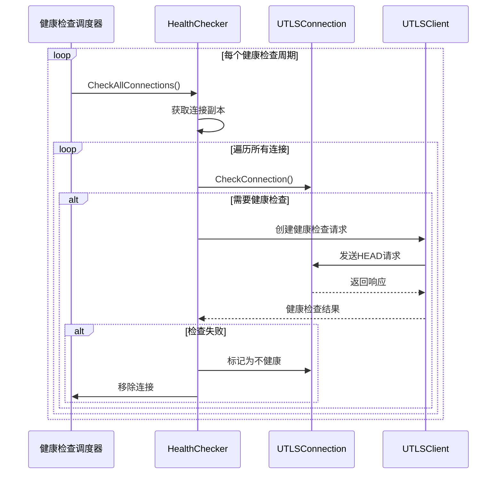

# 健康检查策略

<cite>
**本文档引用的文件**
- [health_checker.go](file://utlsclient/health_checker.go)
- [connection_manager.go](file://utlsclient/connection_manager.go)
- [utlshotconnpool.go](file://utlsclient/utlshotconnpool.go)
- [constants.go](file://utlsclient/constants.go)
- [interfaces.go](file://utlsclient/interfaces.go)
- [test_helpers.go](file://utlsclient/test_helpers.go)
- [config.toml](file://config/config.toml)
</cite>

## 目录
1. [概述](#概述)
2. [健康检查核心机制](#健康检查核心机制)
3. [CheckConnection方法详解](#checkconnection方法详解)
4. [健康检查配置](#健康检查配置)
5. [并发安全保障](#并发安全保障)
6. [健康检查调度机制](#健康检查调度机制)
7. [性能优化与调优](#性能优化与调优)
8. [故障排除指南](#故障排除指南)
9. [最佳实践建议](#最佳实践建议)

## 概述

健康检查策略是UTLS热连接池系统的核心组件，负责监控和维护连接的健康状态。该系统通过多维度指标评估连接质量，包括错误计数、空闲时间和最后使用时间，确保连接池始终维持高质量的连接资源。

健康检查系统采用主动检测与被动监控相结合的方式，在保证性能的同时提供可靠的连接质量保障。系统支持多种健康检查模式，包括单连接检查、批量检查和定期清理等。

## 健康检查核心机制

### 健康检查器架构



**图表来源**
- [health_checker.go](file://utlsclient/health_checker.go#L10-L13)
- [connection_manager.go](file://utlsclient/connection_manager.go#L9-L13)
- [utlshotconnpool.go](file://utlsclient/utlshotconnpool.go#L204-L233)

### 健康状态评估指标

健康检查系统基于以下关键指标评估连接健康状态：

| 指标名称 | 类型 | 作用 | 默认阈值 |
|---------|------|------|----------|
| 错误计数 | int64 | 记录连接失败次数 | 超过10次标记为不健康 |
| 最后使用时间 | time.Time | 连接空闲状态判断 | 超过健康检查间隔 |
| 健康状态标志 | bool | 连接整体健康状况 | true/false |
| 请求计数 | int64 | 连接活跃度统计 | 历史使用情况 |

**章节来源**
- [health_checker.go](file://utlsclient/health_checker.go#L24-L61)
- [utlshotconnpool.go](file://utlsclient/utlshotconnpool.go#L204-L233)

## CheckConnection方法详解

### 方法执行流程

CheckConnection方法是健康检查的核心入口，采用三阶段检查策略：



**图表来源**
- [health_checker.go](file://utlsclient/health_checker.go#L24-L61)

### 错误计数阈值机制

系统采用固定阈值10作为错误计数的健康边界：

```go
const maxErrorCount = 10
if errorCount > maxErrorCount {
    Debug("连接错误次数过多，标记为不健康: %s (错误: %d)", conn.targetIP, errorCount)
    conn.mu.Lock()
    conn.healthy = false
    conn.mu.Unlock()
    return false
}
```

这种设计考虑了以下因素：
- **稳定性保证**：10次错误后才标记为不健康，避免误判
- **性能平衡**：不过度频繁的健康检查
- **历史数据**：基于实际使用经验确定的合理阈值

**章节来源**
- [health_checker.go](file://utlsclient/health_checker.go#L37-L44)

### 空闲时间检查逻辑

系统通过比较连接最后使用时间与健康检查间隔来判断是否需要执行健康检查：

```go
if time.Since(lastUsed) > hc.config.HealthCheckInterval {
    if isHealthy {
        if err := hc.performHealthCheck(conn); err != nil {
            Debug("健康检查失败: %s -> %v", conn.targetIP, err)
            conn.mu.Lock()
            conn.healthy = false
            conn.mu.Unlock()
            return false
        }
    }
}
```

这种设计实现了：
- **按需检查**：只有空闲时间超过配置间隔时才执行检查
- **状态保护**：仅对当前健康的连接执行检查
- **及时反馈**：发现异常立即更新健康状态

**章节来源**
- [health_checker.go](file://utlsclient/health_checker.go#L46-L58)

## 健康检查配置

### HealthCheckInterval配置项

HealthCheckInterval是健康检查系统的关键配置参数，控制连接健康检查的频率。

#### 默认值设定

系统默认健康检查间隔为30秒：

```go
// 在PoolConfig中定义
HealthCheckInterval time.Duration `json:"health_check_interval"`

// 默认配置中的值
HealthCheckInterval: 30 * time.Second,
```

#### 设定依据分析

30秒的默认间隔经过以下考量：

| 因素 | 分析 | 结果 |
|------|------|------|
| 网络延迟 | 全球平均网络延迟范围 | 30秒足够覆盖大部分网络环境 |
| 资源消耗 | 频繁检查增加CPU和网络负载 | 30秒平衡性能与可靠性 |
| 故障检测 | 快速发现问题但避免过度检查 | 适中的检测周期 |
| 系统特性 | 结合其他清理机制 | 与其他定时器协调工作 |

**章节来源**
- [utlshotconnpool.go](file://utlsclient/utlshotconnpool.go#L179-L179)
- [config/config.toml](file://config/config.toml#L17-L17)

### 配置文件中的健康检查设置

在配置文件中，健康检查间隔以秒为单位定义：

```toml
# 健康检查间隔 (秒)
health_check_interval = 30
```

完整的配置结构包含多个相关参数：

| 参数名称 | 默认值 | 说明 |
|---------|--------|------|
| health_check_interval | 30秒 | 连接健康检查间隔 |
| cleanup_interval | 60秒 | 连接池清理间隔 |
| idle_timeout | 60秒 | 连接空闲超时时间 |
| max_lifetime | 300秒 | 连接最大生命周期 |

**章节来源**
- [config/config.toml](file://config/config.toml#L17-L17)

## 并发安全保障

### 连接互斥锁机制

健康检查系统采用细粒度的互斥锁策略确保并发安全性：



**图表来源**
- [health_checker.go](file://utlsclient/health_checker.go#L29-L34)
- [connection_manager.go](file://utlsclient/connection_manager.go#L42-L47)

### 原子操作保护

对于计数器类字段，系统采用原子操作确保线程安全：

```go
// 原子读取操作
func (conn *UTLSConnection) RequestCount() int64 {
    return atomic.LoadInt64(&conn.requestCount)
}

func (conn *UTLSConnection) ErrorCount() int64 {
    return atomic.LoadInt64(&conn.errorCount)
}
```

这种设计的优势：
- **高性能**：原子操作比互斥锁更高效
- **简洁性**：减少锁管理复杂度
- **可靠性**：确保计数准确性

**章节来源**
- [utlshotconnpool.go](file://utlsclient/utlshotconnpool.go#L1217-L1224)

### 状态一致性保障

系统通过以下机制确保状态一致性：

1. **读写分离**：使用RWMutex区分读写操作
2. **锁顺序**：统一的锁获取顺序避免死锁
3. **状态同步**：健康状态变更时的同步机制
4. **条件变量**：连接复用时的状态通知

**章节来源**
- [connection_manager.go](file://utlsclient/connection_manager.go#L10-L10)
- [utlshotconnpool.go](file://utlsclient/utlshotconnpool.go#L225-L226)

## 健康检查调度机制

### 定期健康检查

系统提供多种健康检查调度方式：

#### 单连接检查
```go
func (hc *HealthChecker) CheckConnection(conn *UTLSConnection) bool {
    // 实现三阶段检查逻辑
}
```

#### 批量连接检查
```go
func (hc *HealthChecker) CheckAllConnections() {
    // 获取所有连接副本
    connections := make(map[string]*UTLSConnection)
    hostMapping := hc.connManager.GetHostMapping()
    
    // 检查每个连接
    for ip, conn := range connections {
        if !hc.CheckConnection(conn) {
            hc.connManager.RemoveConnection(ip)
        }
    }
}
```

#### 健康连接筛选
```go
func (hc *HealthChecker) GetHealthyConnections() []*UTLSConnection {
    var healthyConnections []*UTLSConnection
    // 遍历所有连接并检查健康状态
    return healthyConnections
}
```

**章节来源**
- [health_checker.go](file://utlsclient/health_checker.go#L24-L61)
- [health_checker.go](file://utlsclient/health_checker.go#L91-L112)
- [health_checker.go](file://utlsclient/health_checker.go#L114-L130)

### 健康检查执行流程



**图表来源**
- [health_checker.go](file://utlsclient/health_checker.go#L91-L112)

### 健康检查请求处理

健康检查使用简化的HEAD请求：

```go
func (hc *HealthChecker) performHealthCheck(conn *UTLSConnection) error {
    req := &http.Request{
        Method: "HEAD",
        URL:    &url.URL{Scheme: HTTPSProtocol, Host: conn.targetHost, Path: "/"},
        Header: make(http.Header),
        Host:   conn.targetHost,
    }
    
    client := NewUTLSClient(conn)
    client.SetTimeout(5 * time.Second)
    
    _, err := client.Do(req)
    if err != nil {
        return err
    }
    
    // 更新最后使用时间
    conn.mu.Lock()
    conn.lastUsed = time.Now()
    conn.mu.Unlock()
    
    return nil
}
```

这种设计特点：
- **轻量级**：使用HEAD请求最小化网络开销
- **快速响应**：5秒超时避免长时间等待
- **状态更新**：检查成功后更新使用时间

**章节来源**
- [health_checker.go](file://utlsclient/health_checker.go#L63-L88)

## 性能优化与调优

### 高延迟环境调优

在高延迟网络环境中，健康检查策略需要相应调整：

#### 调整健康检查间隔

```go
// 高延迟环境配置示例
config := &PoolConfig{
    HealthCheckInterval: 60 * time.Second,  // 增加到60秒
    TestTimeout:         10 * time.Second,  // 保持较短超时
    CleanupInterval:     120 * time.Second, // 增加清理间隔
}
```

#### 调整超时设置

```go
// 健康检查超时调整
client.SetTimeout(10 * time.Second)  // 增加超时时间
```

### 性能监控指标

建议监控以下关键指标：

| 指标类别 | 监控项目 | 正常范围 | 异常阈值 |
|---------|---------|---------|---------|
| 连接健康率 | 健康连接比例 | >95% | <90% |
| 检查成功率 | 健康检查通过率 | >98% | <95% |
| 检查耗时 | 单次检查平均时间 | <2秒 | >5秒 |
| 错误频率 | 连接错误发生率 | <1% | >5% |

### 负载均衡优化

健康检查系统支持动态负载均衡：

```go
// 获取健康连接池
healthyConns := healthChecker.GetHealthyConnections()
// 优先使用健康连接
selectedConn := selectBestConnection(healthyConns)
```

**章节来源**
- [health_checker.go](file://utlsclient/health_checker.go#L114-L130)

## 故障排除指南

### 常见问题诊断

#### 连接频繁被标记为不健康

**症状**：连接经常被健康检查标记为不健康

**可能原因**：
1. 网络不稳定
2. 目标服务器负载过高
3. 健康检查间隔过短

**解决方案**：
```go
// 调整健康检查配置
config.HealthCheckInterval = 60 * time.Second
config.TestTimeout = 10 * time.Second
```

#### 健康检查性能问题

**症状**：健康检查占用过多CPU或网络资源

**诊断步骤**：
1. 检查健康检查频率
2. 分析检查成功率
3. 监控网络延迟

**优化措施**：
```go
// 减少检查频率
config.HealthCheckInterval = 60 * time.Second
// 增加超时时间
config.TestTimeout = 15 * time.Second
```

### 调试工具

系统提供详细的调试日志：

```go
// 启用调试模式
client.SetDebug(true)
// 查看连接统计
stats := conn.Stats()
```

**章节来源**
- [health_checker.go](file://utlsclient/health_checker.go#L39-L40)
- [health_checker.go](file://utlsclient/health_checker.go#L51-L52)

## 最佳实践建议

### 配置优化建议

1. **根据网络环境调整间隔**
   - 内网环境：15-30秒
   - 局域网环境：30-60秒
   - 广域网环境：60-120秒

2. **平衡检查频率与资源消耗**
   ```go
   // 推荐配置组合
   HealthCheckInterval: 30 * time.Second,
   CleanupInterval:     60 * time.Second,
   TestTimeout:         5 * time.Second,
   ```

3. **监控关键指标**
   - 连接健康率
   - 检查成功率
   - 平均检查时间
   - 错误发生频率

### 运维建议

1. **定期健康检查**
   - 每小时检查连接池健康状态
   - 监控异常连接数量
   - 及时清理不健康连接

2. **容量规划**
   - 根据业务需求调整最大连接数
   - 考虑峰值时期的连接需求
   - 预留足够的缓冲空间

3. **故障恢复**
   - 建立自动恢复机制
   - 设置人工干预接口
   - 制定应急预案

### 开发建议

1. **优雅降级**
   ```go
   // 健康检查失败时的处理
   if !conn.IsHealthy() {
       // 使用备用连接或等待重建
       continue
   }
   ```

2. **资源清理**
   ```go
   // 及时清理不健康连接
   unhealthyCount := healthChecker.CleanupUnhealthyConnections()
   log.Printf("清理了 %d 个不健康连接", unhealthyCount)
   ```

3. **监控集成**
   ```go
   // 集成监控系统
   stats := pool.GetStats()
   metrics.Gauge("healthy_connections").Set(float64(stats.HealthyConnections))
   ```

通过遵循这些最佳实践，可以构建稳定、高效的健康检查系统，确保连接池始终保持高质量的连接资源。