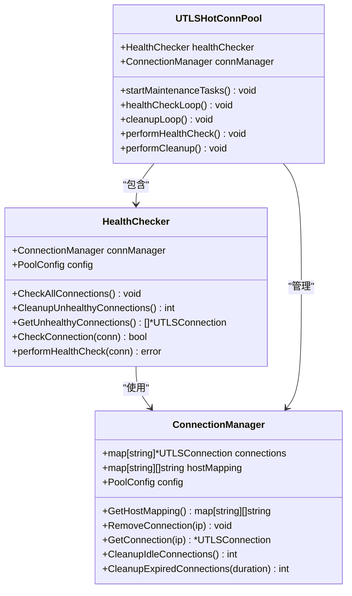
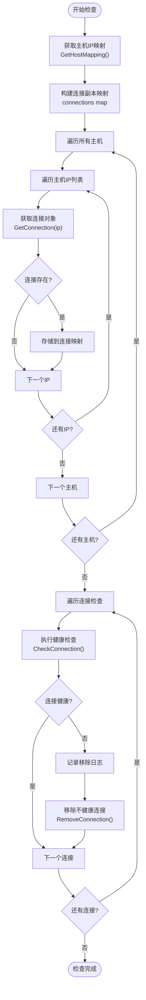
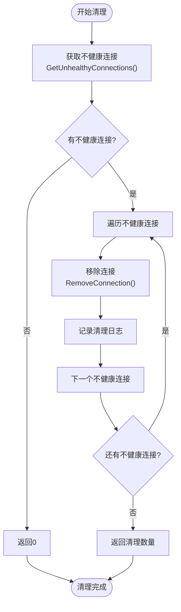
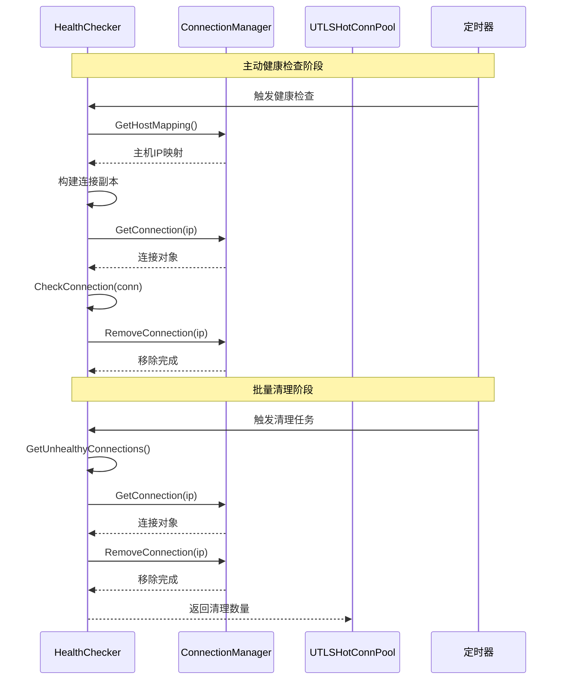
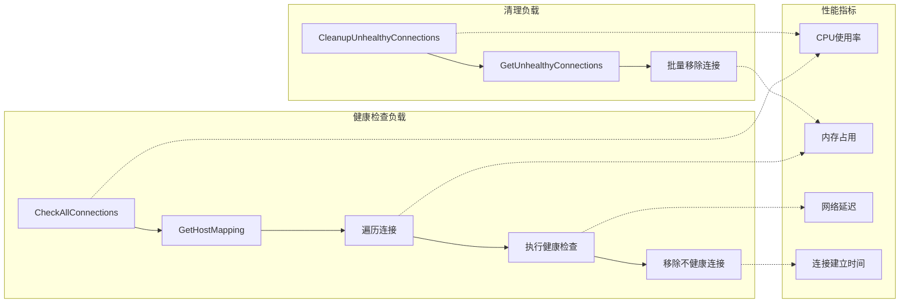
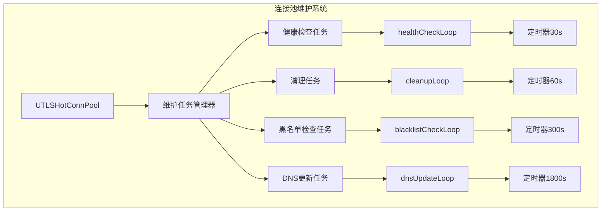
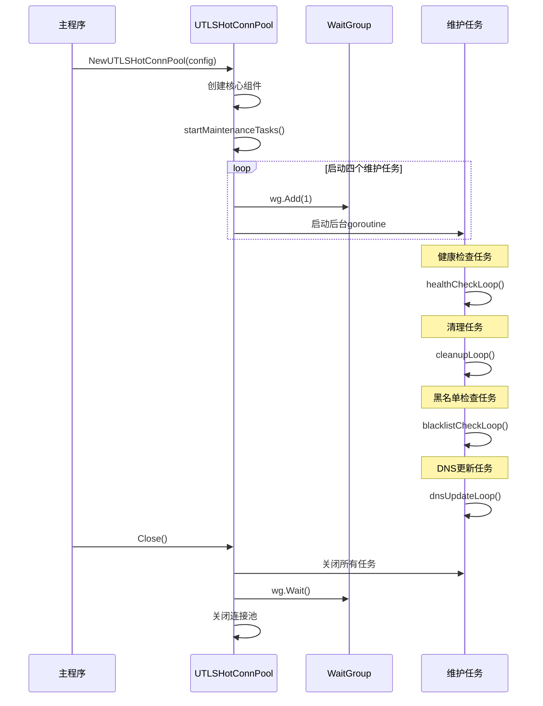
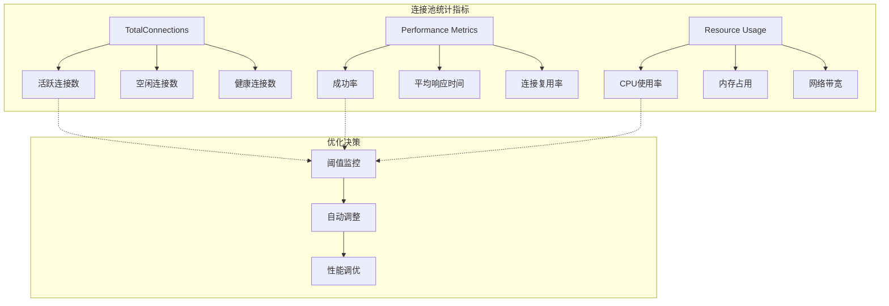
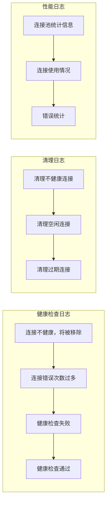

# 批量健康状态管理

<cite>
**本文档引用的文件**
- [health_checker.go](file://utlsclient/health_checker.go)
- [connection_manager.go](file://utlsclient/connection_manager.go)
- [utlshotconnpool.go](file://utlsclient/utlshotconnpool.go)
- [connection_manager_test.go](file://test/utlsclient/connection_manager_test.go)
- [utlshotconnpool_test.go](file://test/utlsclient/utlshotconnpool_test.go)
</cite>

## 目录
1. [概述](#概述)
2. [核心架构](#核心架构)
3. [CheckAllConnections方法详解](#checkallconnections方法详解)
4. [CleanupUnhealthyConnections方法详解](#cleanupunhealthyconnections方法详解)
5. [协同工作机制](#协同工作机制)
6. [周期性调度与性能影响](#周期性调度与性能影响)
7. [连接池维护任务](#连接池维护任务)
8. [性能优化策略](#性能优化策略)
9. [故障排除指南](#故障排除指南)
10. [总结](#总结)

## 概述

在热连接池系统中，CheckAllConnections和CleanupUnhealthyConnections是两个关键的健康状态管理方法，它们协同工作确保连接池的稳定性和性能。这两个方法分别负责主动检查所有连接的健康状态和批量清理异常连接，通过合理的调度机制避免频繁清理导致的连接震荡。

## 核心架构

**图表来源**
- [health_checker.go](file://utlsclient/health_checker.go#L9-L21)
- [connection_manager.go](file://utlsclient/connection_manager.go#L8-L15)
- [utlshotconnpool.go](file://utlsclient/utlshotconnpool.go#L233-L245)

## CheckAllConnections方法详解

CheckAllConnections方法实现了主动的全量健康检查机制，通过以下步骤确保连接池的健康状态：

### 方法执行流程

**图表来源**
- [health_checker.go](file://utlsclient/health_checker.go#L91-L111)

### 核心实现特点

1. **连接副本构建**：方法首先创建连接的副本映射，避免在检查过程中出现竞态条件
2. **分层遍历策略**：通过主机映射逐层遍历，确保覆盖所有连接
3. **即时移除机制**：发现不健康连接后立即移除，防止影响后续操作
4. **详细日志记录**：对每个移除的连接进行详细日志记录，便于问题追踪

**节来源**
- [health_checker.go](file://utlsclient/health_checker.go#L91-L111)

## CleanupUnhealthyConnections方法详解

CleanupUnhealthyConnections方法实现了批量清理异常连接的功能，采用被动扫描的方式识别和清理不健康的连接：

### 方法执行流程

**图表来源**
- [health_checker.go](file://utlsclient/health_checker.go#L154-L163)

### 批量清理优势

1. **减少锁竞争**：相比CheckAllConnections的即时移除，批量清理减少了锁的竞争
2. **统一处理**：可以对多个不健康连接进行统一处理，提高效率
3. **日志聚合**：可以聚合多个清理事件的日志，便于监控和分析
4. **资源释放**：批量释放资源，避免频繁的资源分配和回收

**节来源**
- [health_checker.go](file://utlsclient/health_checker.go#L154-L163)

## 协同工作机制

CheckAllConnections和CleanupUnhealthyConnections通过以下协同机制实现高效的连接池维护：

### 协同工作流程

**图表来源**
- [health_checker.go](file://utlsclient/health_checker.go#L91-L111)
- [health_checker.go](file://utlsclient/health_checker.go#L154-L163)

### 协同机制特点

1. **互补检查策略**：
   - CheckAllConnections：主动检查，及时发现问题
   - CleanupUnhealthyConnections：批量清理，高效处理问题

2. **分层维护策略**：
   - 主动预防：通过定期检查防止问题积累
   - 被动修复：通过批量清理解决已存在的问题

3. **资源优化**：
   - 减少重复检查：避免对同一连接进行多次不必要的检查
   - 统一资源管理：批量操作减少系统调用开销

**节来源**
- [health_checker.go](file://utlsclient/health_checker.go#L91-L163)

## 周期性调度与性能影响

连接池通过后台维护任务实现周期性的健康检查和清理操作，合理设置调度间隔是避免性能问题的关键。

### 调度配置参数

| 参数名称 | 默认值 | 作用描述 |
|---------|--------|----------|
| HealthCheckInterval | 30秒 | 健康检查间隔时间 |
| CleanupInterval | 60秒 | 清理任务间隔时间 |
| BlacklistCheckInterval | 300秒 | 黑名单检查间隔 |
| DNSUpdateInterval | 1800秒 | DNS更新间隔 |

### 性能影响分析

**图表来源**
- [utlshotconnpool.go](file://utlsclient/utlshotconnpool.go#L186-L200)

### 性能优化建议

1. **合理设置检查间隔**：
   - HealthCheckInterval：根据业务需求调整，通常30-60秒
   - CleanupInterval：可以设置为HealthCheckInterval的倍数

2. **避免过于频繁的检查**：
   - 频繁检查会增加CPU和内存开销
   - 过长的间隔可能导致问题积累

3. **监控系统资源使用**：
   - 监控健康检查对系统性能的影响
   - 根据实际负载调整检查频率

**节来源**
- [utlshotconnpool.go](file://utlsclient/utlshotconnpool.go#L186-L200)

## 连接池维护任务

连接池通过多个后台维护任务协同工作，确保系统的长期稳定运行：

### 后台维护任务架构

**图表来源**
- [utlshotconnpool.go](file://utlsclient/utlshotconnpool.go#L795-L820)

### 维护任务职责分工

| 维护任务 | 执行频率 | 主要职责 | 性能影响 |
|---------|----------|----------|----------|
| 健康检查 | 30秒 | 检查连接健康状态 | 中等 |
| 清理任务 | 60秒 | 清理过期和异常连接 | 较低 |
| 黑名单检查 | 5分钟 | 检查IP黑名单状态 | 很低 |
| DNS更新 | 30分钟 | 更新域名解析结果 | 很低 |

### 任务启动机制

**图表来源**
- [utlshotconnpool.go](file://utlsclient/utlshotconnpool.go#L795-L820)

**节来源**
- [utlshotconnpool.go](file://utlsclient/utlshotconnpool.go#L795-L820)

## 性能优化策略

为了最大化CheckAllConnections和CleanupUnhealthyConnections的效能，需要实施以下优化策略：

### 连接池统计监控

**图表来源**
- [utlshotconnpool.go](file://utlsclient/utlshotconnpool.go#L247-L277)

### 优化策略实施

1. **动态调整检查频率**：
   - 根据连接池负载动态调整健康检查频率
   - 在高负载时期降低检查频率，在低负载时期增加检查频率

2. **智能清理策略**：
   - 优先清理最长时间未使用的连接
   - 对于频繁出错的连接进行特殊处理

3. **资源预分配**：
   - 预留一定比例的连接作为备用
   - 避免因清理导致的连接不足

4. **异步处理**：
   - 将清理操作放在单独的goroutine中执行
   - 避免阻塞主要业务逻辑

**节来源**
- [utlshotconnpool.go](file://utlsclient/utlshotconnpool.go#L1122-L1174)

## 故障排除指南

### 常见问题诊断

| 问题症状 | 可能原因 | 排查方法 | 解决方案 |
|---------|----------|----------|----------|
| 连接频繁断开 | 健康检查过于严格 | 检查HealthCheckInterval配置 | 调整检查间隔或放宽检查标准 |
| 清理过于频繁 | 不健康连接过多 | 查看GetUnhealthyConnections结果 | 检查网络环境和服务器状态 |
| 性能下降 | 检查频率过高 | 监控系统资源使用情况 | 降低检查频率或优化检查逻辑 |
| 内存泄漏 | 连接未正确释放 | 检查RemoveConnection调用 | 确保连接池正常关闭 |

### 日志分析要点

**图表来源**
- [health_checker.go](file://utlsclient/health_checker.go#L96-L111)
- [health_checker.go](file://utlsclient/health_checker.go#L156-L163)

### 监控指标建议

1. **健康检查指标**：
   - 健康检查成功率
   - 平均检查时间
   - 不健康连接发现率

2. **清理效果指标**：
   - 清理频率
   - 清理效果（清理前后连接质量对比）
   - 清理对性能的影响

3. **系统整体指标**：
   - 连接池命中率
   - 平均响应时间
   - 错误率趋势

**节来源**
- [health_checker.go](file://utlsclient/health_checker.go#L96-L163)

## 总结

CheckAllConnections和CleanupUnhealthyConnections方法的协同工作机制是热连接池健康管理系统的核心。通过主动检查和批量清理的有机结合，这两个方法能够：

1. **及时发现问题**：CheckAllConnections通过定期主动检查，能够及时发现连接异常
2. **高效处理问题**：CleanupUnhealthyConnections通过批量清理，能够高效处理已存在的问题
3. **保持系统稳定**：通过合理的调度机制，避免频繁清理导致的连接震荡
4. **优化系统性能**：通过智能的检查策略和资源管理，最大化系统性能

这种协同工作机制不仅确保了连接池的稳定运行，还为系统的长期维护提供了可靠的基础。通过合理的配置和监控，可以进一步提升系统的整体性能和可靠性。