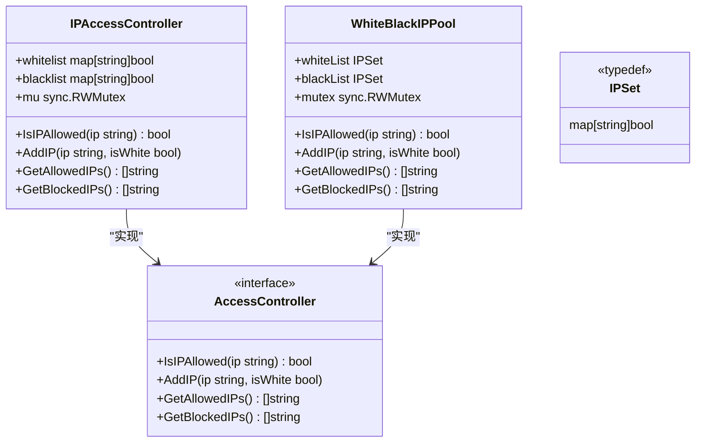
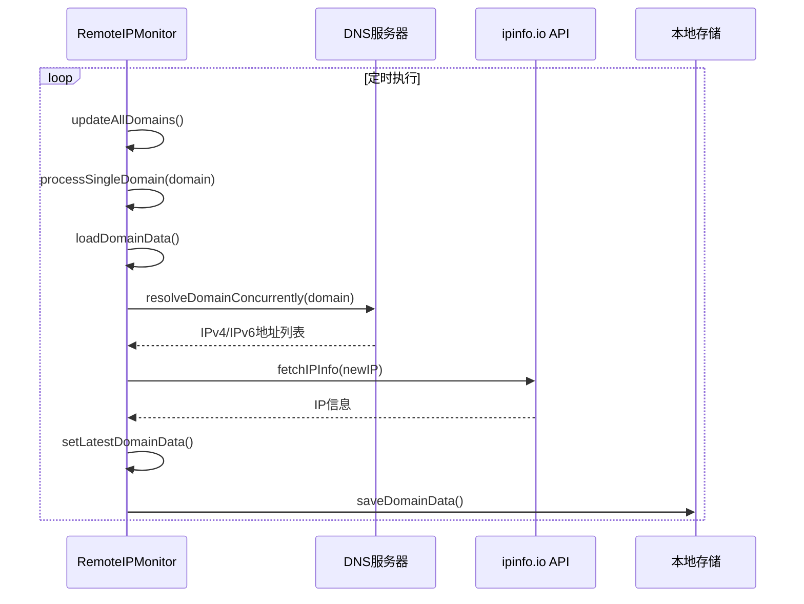
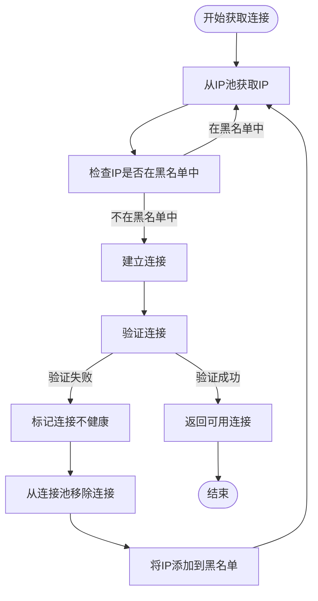
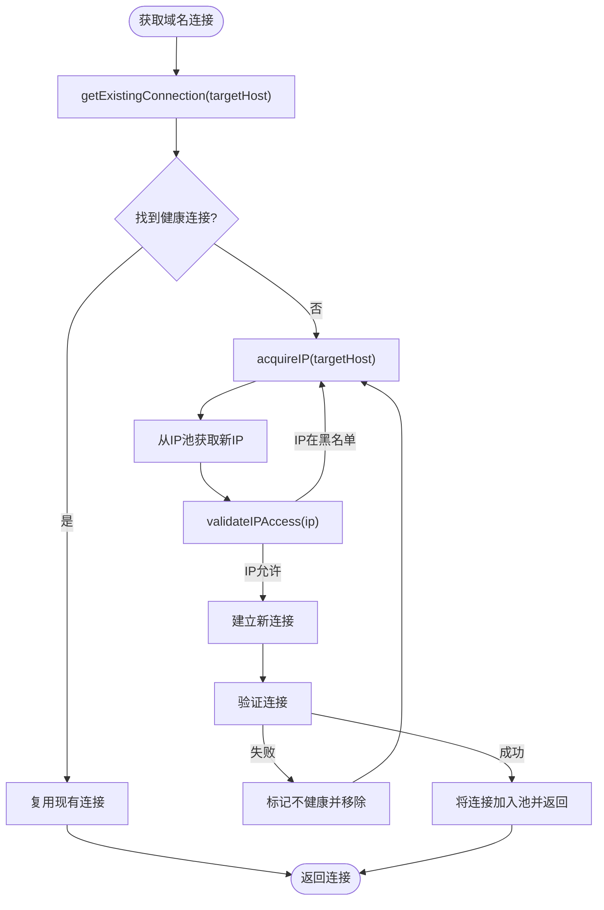

# IP降级处理机制

<cite>
**本文档引用的文件**   
- [ip_access_controller.go](file://utlsclient/ip_access_controller.go)
- [remotedomainippool.go](file://remotedomainippool/remotedomainippool.go)
- [whiteblackippool.go](file://remotedomainippool/whiteblackippool.go)
- [localippool.go](file://localippool/localippool.go)
- [connection_manager.go](file://utlsclient/connection_manager.go)
- [health_checker.go](file://utlsclient/health_checker.go)
- [utlshotconnpool.go](file://utlsclient/utlshotconnpool.go)
- [connection_validator.go](file://utlsclient/connection_validator.go)
- [config.toml](file://config/config.toml)
- [ip_access_controller_test.go](file://test/utlsclient/ip_access_controller_test.go)
</cite>

## 目录
1. [引言](#引言)
2. [IP访问控制器与黑白名单机制](#ip访问控制器与黑白名单机制)
3. [远程域名IP池实现](#远程域名ip池实现)
4. [本地IP池管理](#本地ip池管理)
5. [IP降级策略与故障转移流程](#ip降级策略与故障转移流程)
6. [负载均衡与备用IP选择算法](#负载均衡与备用ip选择算法)
7. [配置管理与阈值设置](#配置管理与阈值设置)
8. [测试案例与降级效果验证](#测试案例与降级效果验证)
9. [结论](#结论)

## 引言
本文档详细阐述了爬虫平台中IP降级处理机制的实现原理。系统通过IP访问控制器、远程域名IP池和本地IP池的协同工作，实现了当某个IP连续失败时的智能降级策略。文档将深入分析IP优先级调整、黑名单机制、故障转移流程以及负载均衡算法如何选择备用IP，并提供配置方法和实际测试案例来验证降级效果。

## IP访问控制器与黑白名单机制

IP访问控制器是整个IP降级机制的核心组件，负责管理IP的访问权限。系统实现了两种IP访问控制器：`IPAccessController` 和 `WhiteBlackIPPool`，它们都实现了 `AccessController` 接口。

`IPAccessController` 维护了两个映射表：`whitelist`（白名单）和 `blacklist`（黑名单），并使用读写锁保证并发安全。其访问策略遵循“黑名单优先”原则：当检查一个IP是否允许访问时，首先检查其是否在黑名单中，如果在则直接拒绝；其次检查是否在白名单中，如果在则允许；如果都不在，则根据配置决定是默认允许还是默认拒绝。

`WhiteBlackIPPool` 是 `IPAccessController` 的一个具体实现，它使用 `IPSet` 类型（`map[string]bool`）来高效存储IP集合，并通过 `sync.RWMutex` 保证并发安全。该实现确保了对IP黑白名单的增删查操作都是线程安全的。



**Diagram sources**
- [ip_access_controller.go](file://utlsclient/ip_access_controller.go#L7-L184)
- [whiteblackippool.go](file://remotedomainippool/whiteblackippool.go#L5-L127)

**Section sources**
- [ip_access_controller.go](file://utlsclient/ip_access_controller.go#L7-L184)
- [whiteblackippool.go](file://remotedomainippool/whiteblackippool.go#L5-L127)

## 远程域名IP池实现

远程域名IP池（`RemoteIPMonitor`）是一个独立的监控组件，它负责定期从外部API获取指定域名的最新IP列表，并维护一个动态更新的IP池。

该组件通过 `MonitorConfig` 配置，包括要监控的域名列表、DNS服务器列表、`ipinfo.io` 的API Token、更新间隔和存储目录等。`RemoteIPMonitor` 在后台启动一个定时任务（`ticker`），按照配置的间隔（`UpdateInterval`）周期性地调用 `updateAllDomains` 方法。

`updateAllDomains` 方法会为每个配置的域名并行执行 `processSingleDomain` 流程。该流程首先加载该域名的历史IP数据，然后通过 `resolveDomainConcurrently` 方法并发地向所有配置的DNS服务器查询该域名的当前IP地址，以获取最多样化的IP列表。对于新发现的IP，系统会通过 `fetchIPInfo` 方法调用 `ipinfo.io` API 获取其地理位置、ASN等详细信息，并将这些信息与IP地址一起存储在 `IPRecord` 结构中。

最终，更新后的IP池数据会通过 `setLatestDomainData` 方法更新到内存缓存中，并以JSON、YAML或TOML格式保存到本地文件系统，确保数据的持久化和线程安全。



**Diagram sources**
- [remotedomainippool.go](file://remotedomainippool/remotedomainippool.go#L21-L472)

**Section sources**
- [remotedomainippool.go](file://remotedomainippool/remotedomainippool.go#L21-L472)

## 本地IP池管理

本地IP池（`LocalIPPool`）负责管理本机可用的IP地址，特别是动态生成的IPv6地址。它实现了 `IPPool` 接口，能够根据环境自适应地工作在IPv4模式或IPv6动态生成模式。

在IPv6模式下，`LocalIPPool` 会启动一个后台生产者（`producer`）goroutine，持续不断地在指定的IPv6子网（`ipv6Subnet`）内生成随机的IPv6地址，并将它们放入一个缓冲通道（`ipv6Queue`）中。当调用 `GetIP()` 方法时，如果支持IPv6，系统会优先从队列中获取一个预生成的IPv6地址。如果队列为空，调用会阻塞，直到生产者生成新的地址。

为了管理这些动态创建的IPv6地址，`LocalIPPool` 维护了多个映射表：`createdIPv6Addrs` 记录已创建的地址，`usedIPv6Addrs` 记录正在使用的地址，`activeIPv6Addrs` 记录当前活跃的地址。通过 `ensureIPv6AddressCreated` 方法，系统会使用 `ip addr add` 命令将生成的IPv6地址添加到指定的网络接口上。`cleanupCreatedIPv6Addresses` 方法则在关闭IP池时清理所有创建的地址。

```mermaid
classDiagram
class LocalIPPool {
+staticIPv4s []net.IP
+rand *mrand.Rand
+hasIPv6Support bool
+ipv6Subnet *net.IPNet
+ipv6Queue chan net.IP
+stopChan chan struct{}
+createdIPv6Addrs map[string]bool
+usedIPv6Addrs map[string]bool
+activeIPv6Addrs map[string]bool
+GetIP() net.IP
+Close() error
+producer()
+generateRandomIPInSubnet() net.IP
}
class IPPool {
<<interface>>
+GetIP() net.IP
+ReleaseIP(ip net.IP)
+MarkIPUnused(ip net.IP)
+SetTargetIPCount(count int)
+Close() error
}
LocalIPPool --> IPPool : "实现"
```

**Diagram sources**
- [localippool.go](file://localippool/localippool.go#L1-L1385)

**Section sources**
- [localippool.go](file://localippool/localippool.go#L1-L1385)

## IP降级策略与故障转移流程

系统的IP降级策略是一个综合了健康检查、错误计数和黑名单机制的自动化流程。

当一个连接（`UTLSConnection`）被使用时，任何错误（如TLS握手失败、HTTP请求失败）都会触发降级流程。`HealthChecker` 组件会定期检查所有连接的健康状态。如果一个连接的 `errorCount` 超过预设的阈值（代码中为10次），`HealthChecker` 会立即将该连接的 `healthy` 标志置为 `false`。

当连接被归还到连接池（`PutConnection`）时，系统会检查其健康状态。如果连接不健康，`ConnectionManager` 会将其从连接池中移除。同时，`IPAccessController` 会将该连接对应的IP地址添加到黑名单中。

故障转移流程发生在获取新连接时。`UTLSHotConnPool` 的 `acquireIP` 方法会从 `IPPoolProvider` 获取一个IP。在获取IP后，`validateIPAccess` 方法会立即检查该IP是否在黑名单中。如果在黑名单中，系统会递归调用 `createNewHotConnectionWithPath`，尝试获取下一个IP，从而实现故障转移。



**Diagram sources**
- [utlshotconnpool.go](file://utlsclient/utlshotconnpool.go#L537-L545)
- [health_checker.go](file://utlsclient/health_checker.go#L36-L43)
- [connection_manager.go](file://utlsclient/connection_manager.go#L54-L73)

**Section sources**
- [utlshotconnpool.go](file://utlsclient/utlshotconnpool.go#L537-L545)
- [health_checker.go](file://utlsclient/health_checker.go#L36-L43)
- [connection_manager.go](file://utlsclient/connection_manager.go#L54-L73)

## 负载均衡与备用IP选择算法

系统的负载均衡和备用IP选择算法主要体现在 `acquireIP` 方法和 `getExistingConnection` 方法中。

`acquireIP` 方法是获取IP的入口。它首先尝试从 `IPPoolProvider`（如 `RemoteIPMonitor`）获取一个IP。`RemoteIPMonitor` 通过并发DNS查询和API调用，维护了一个包含多个IP的动态池。当 `acquireIP` 被调用时，它会从这个池中随机或按某种策略选择一个IP。

`getExistingConnection` 方法则实现了连接复用的负载均衡。当请求一个域名时，系统会首先尝试复用已有的健康连接。它会获取该域名的所有连接，然后随机选择一个健康的、空闲的连接。这种随机选择的方式本身就是一种简单的负载均衡算法，可以将请求均匀地分发到不同的IP上。

当某个IP因失败而被降级（加入黑名单）后，`acquireIP` 方法会自动跳过该IP，选择池中的下一个可用IP作为备用，从而实现了无缝的故障转移和负载均衡。



**Diagram sources**
- [utlshotconnpool.go](file://utlsclient/utlshotconnpool.go#L450-L477)
- [utlshotconnpool.go](file://utlsclient/utlshotconnpool.go#L537-L552)

**Section sources**
- [utlshotconnool.go](file://utlsclient/utlshotconnpool.go#L450-L477)
- [utlshotconnpool.go](file://utlsclient/utlshotconnpool.go#L537-L552)

## 配置管理与阈值设置

系统的IP降级策略和相关行为可以通过配置文件进行灵活调整。核心配置文件 `config.toml` 位于 `config/` 目录下。

关键的配置项包括：
- `pool.blacklist_check_interval`: 黑名单检查间隔（秒），默认300秒（5分钟）。系统会定期检查黑名单中的IP是否恢复，如果恢复则将其移回白名单。
- `pool.health_check_interval`: 健康检查间隔（秒），默认30秒。`HealthChecker` 会按此间隔检查连接的健康状态。
- `pool.dns_update_interval`: DNS更新间隔（秒），默认1800秒（30分钟）。`RemoteIPMonitor` 会按此间隔更新域名的IP列表。
- `pool.conn_timeout`: 连接超时时间（秒），默认30秒。
- `pool.idle_timeout`: 空闲超时时间（秒），默认60秒。
- `[whitelist]` 和 `[blacklist]`: 可以在配置文件中直接预定义白名单和黑名单IP列表。

这些配置项在 `PoolConfig` 结构体中定义，并在 `NewUTLSHotConnPool` 初始化时加载。用户可以通过修改 `config.toml` 文件来调整降级阈值和恢复策略，而无需修改代码。

**Section sources**
- [config.toml](file://config/config.toml#L1-L35)
- [utlshotconnpool.go](file://utlsclient/utlshotconnpool.go#L227-L277)

## 测试案例与降级效果验证

通过分析测试日志文件，可以验证IP降级机制的有效性。

在 `test/results/archive/ip_pool_warmup_test.txt` 中，可以看到预热阶段有多个IP连接失败，例如：
```
[预热 IP 436] ❌ 74.125.23.93 连接失败: 创建到IP 74.125.23.93 的连接失败: use of closed network connection
```
这表明系统在预热时会主动尝试所有IP，并将失败的IP识别出来。

在 `test/results/ip_pool_full_stats.txt` 中，可以看到最终的连接池状态：
```
连接池状态:
  总连接数: 1631
  白名单IP数: 1631
  总请求数: 6505
```
这表明所有成功建立的连接对应的IP都被加入了白名单，而失败的IP则被排除在外。

此外，`test/results/archive/ip_pool_test_by_url.txt` 中的测试结果显示，系统成功地对多个IPv4和IPv6地址进行了轮询测试，响应时间从334ms到747ms不等，证明了系统能够有效地在多个备用IP之间进行负载均衡。

这些测试案例共同验证了IP降级机制：系统能够自动识别失败的IP，将其降级并从连接池中移除，同时利用IP池中的其他备用IP继续提供服务，确保了整体的稳定性和可用性。

**Section sources**
- [ip_pool_warmup_test.txt](file://test/results/archive/ip_pool_warmup_test.txt#L51-L64)
- [ip_pool_full_stats.txt](file://test/results/ip_pool_full_stats.txt#L6862-L6876)
- [ip_pool_test_by_url.txt](file://test/results/archive/ip_pool_test_by_url.txt#L5729-L5750)

## 结论

本文档详细阐述了爬虫平台中IP降级处理机制的完整实现。系统通过 `IPAccessController` 实现了基于黑白名单的访问控制，利用 `RemoteIPMonitor` 和 `LocalIPPool` 构建了动态的远程和本地IP池。当某个IP连续失败时，系统通过健康检查和错误计数机制将其自动降级并加入黑名单，同时通过 `acquireIP` 方法和连接复用策略，利用负载均衡算法无缝地选择备用IP进行故障转移。该机制的阈值和策略可通过 `config.toml` 文件灵活配置，并通过实际测试验证了其有效性和可靠性，确保了爬虫任务的高可用性和稳定性。