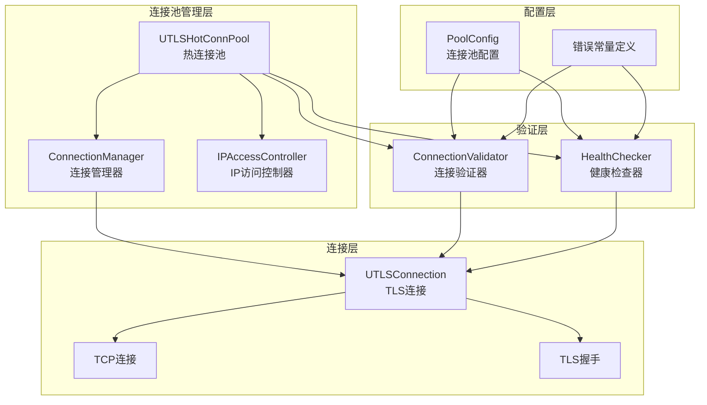
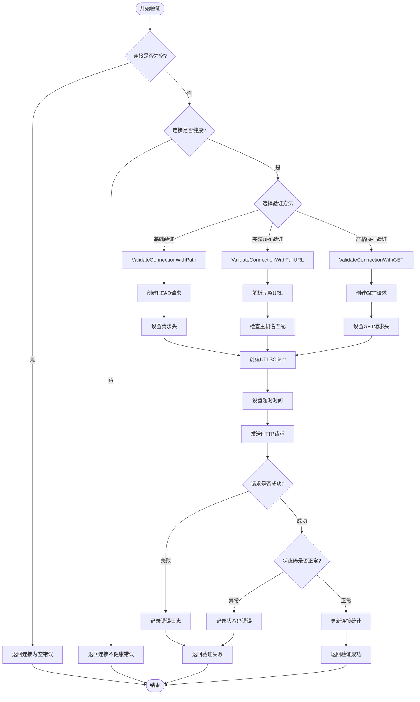
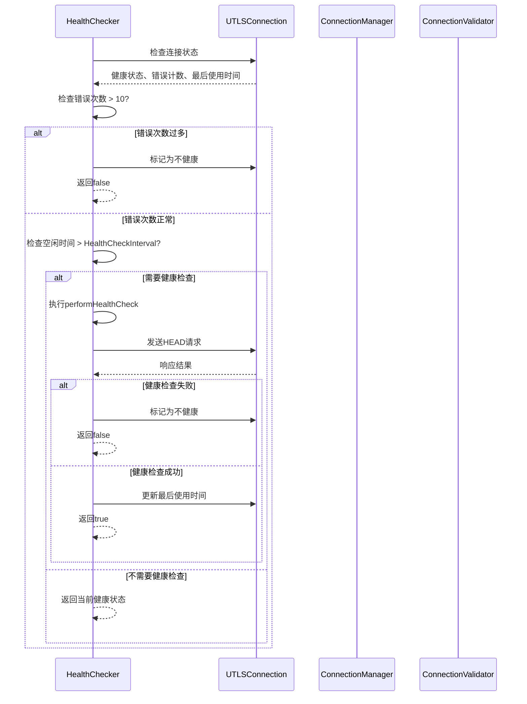
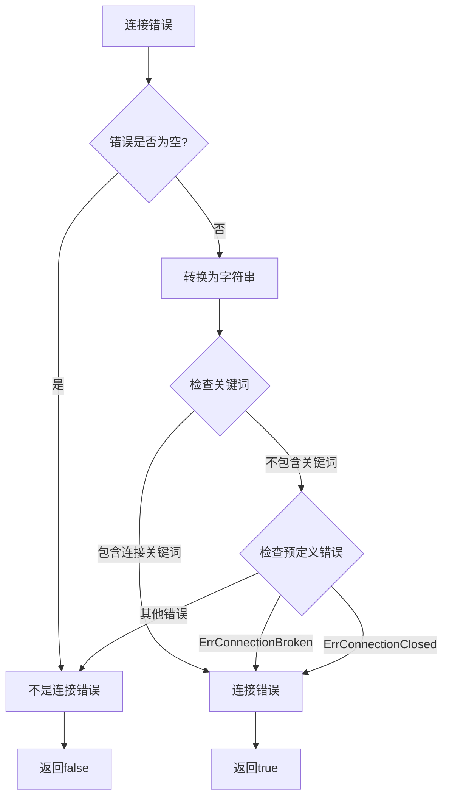
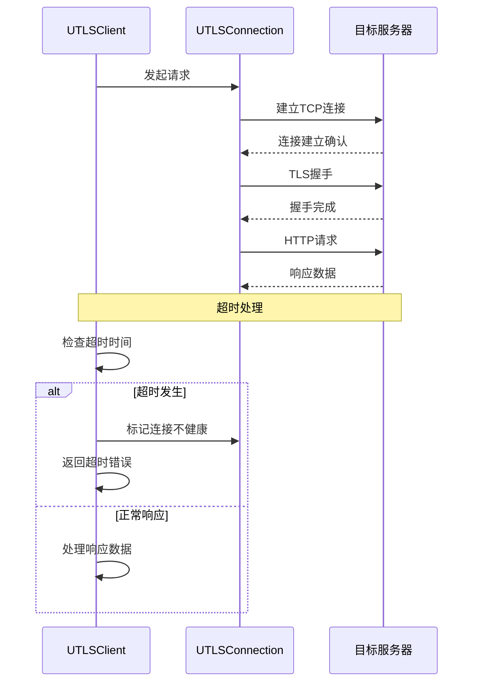
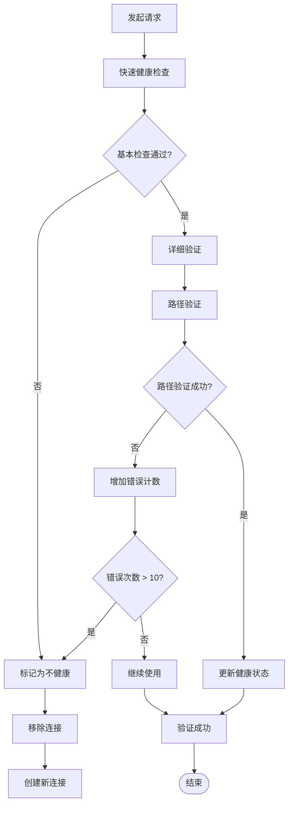
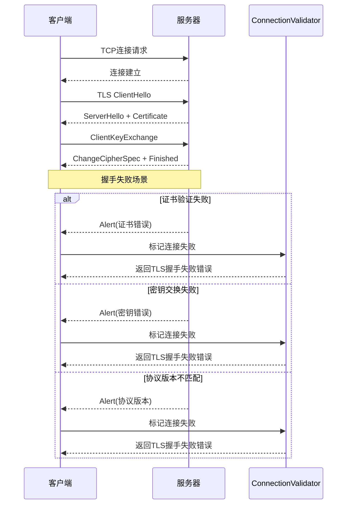
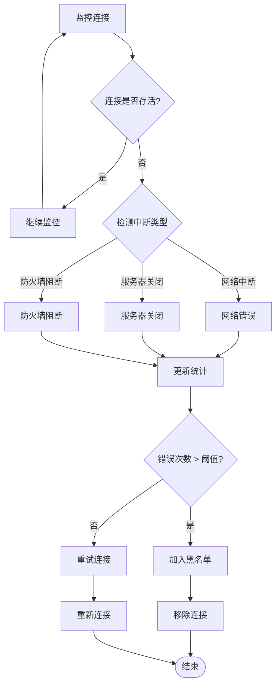
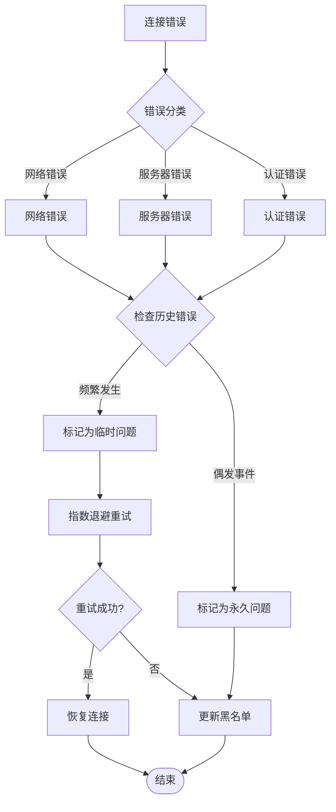

# 失败判定机制

<cite>
**本文档引用的文件**
- [connection_validator.go](file://utlsclient/connection_validator.go)
- [health_checker.go](file://utlsclient/health_checker.go)
- [constants.go](file://utlsclient/constants.go)
- [utlsclient.go](file://utlsclient/utlsclient.go)
- [utlshotconnpool.go](file://utlsclient/utlshotconnpool.go)
- [connection_manager.go](file://utlsclient/connection_manager.go)
- [ip_access_controller.go](file://utlsclient/ip_access_controller.go)
- [interfaces.go](file://utlsclient/interfaces.go)
</cite>

## 目录
1. [概述](#概述)
2. [系统架构](#系统架构)
3. [ConnectionValidator 验证器](#connectionvalidator-验证器)
4. [HealthChecker 健康检查器](#healthchecker-健康检查器)
5. [错误类型识别](#错误类型识别)
6. [超时设置与阈值配置](#超时设置与阈值配置)
7. [失败判定流程](#失败判定流程)
8. [常见场景分析](#常见场景分析)
9. [业务需求调整指南](#业务需求调整指南)
10. [误判解决方案](#误判解决方案)
11. [总结](#总结)

## 概述

本文档详细说明了基于连接验证器（ConnectionValidator）和健康检查器（HealthChecker）的失败判定机制。该系统通过多层次的验证策略，能够准确识别连接失败的各种场景，包括TLS握手失败、HTTP请求超时、网络连接中断等，并提供灵活的配置选项以适应不同的业务需求。

系统的核心设计理念是：
- **多层验证**：结合主动验证和被动监控
- **智能判定**：基于多种指标综合判断连接健康状态
- **灵活配置**：支持动态调整失败判定阈值
- **快速响应**：及时发现并处理连接问题

## 系统架构



**图表来源**
- [utlshotconnpool.go](file://utlsclient/utlshotconnpool.go#L237-L258)
- [connection_manager.go](file://utlsclient/connection_manager.go#L8-L14)
- [health_checker.go](file://utlsclient/health_checker.go#L9-L13)

## ConnectionValidator 验证器

ConnectionValidator负责连接的基本健康状态验证，提供多种验证策略以适应不同的业务场景。

### 验证流程



**图表来源**
- [connection_validator.go](file://utlsclient/connection_validator.go#L22-L96)
- [connection_validator.go](file://utlsclient/connection_validator.go#L99-L158)
- [connection_validator.go](file://utlsclient/connection_validator.go#L161-L222)

### 验证方法详解

#### 1. 基础路径验证（ValidateConnectionWithPath）

这是最常用的验证方法，通过发送HEAD请求到指定路径来检查连接的可用性。

**关键特性：**
- 使用HEAD请求减少数据传输
- 支持自定义验证路径
- 记录响应时间和状态码
- 更新连接最后使用时间

#### 2. 完整URL验证（ValidateConnectionWithFullURL）

验证指定完整URL的连接有效性，确保主机名匹配且路径可访问。

**验证步骤：**
1. 解析URL并提取主机名
2. 检查主机名与连接目标是否匹配
3. 发送HEAD请求验证路径可用性

#### 3. 严格GET验证（ValidateConnectionWithGET）

最严格的验证方法，使用GET请求并限制响应体大小。

**额外验证：**
- 检查响应状态码范围
- 限制响应体大小防止内存溢出
- 提供更精确的连接质量评估

**节来源**
- [connection_validator.go](file://utlsclient/connection_validator.go#L22-L263)

## HealthChecker 健康检查器

HealthChecker负责定期监控连接的健康状态，通过主动检查和统计分析来识别潜在问题。

### 健康检查策略



**图表来源**
- [health_checker.go](file://utlsclient/health_checker.go#L24-L60)
- [health_checker.go](file://utlsclient/health_checker.go#L63-L88)

### 健康检查算法

HealthChecker采用以下策略进行健康状态判断：

#### 1. 错误计数阈值检查
- **阈值**：最多允许10次连续错误
- **触发条件**：连接错误次数超过阈值
- **处理动作**：立即标记连接为不健康

#### 2. 空闲时间检查
- **检查间隔**：由`HealthCheckInterval`配置决定
- **触发条件**：连接空闲时间超过检查间隔
- **检查内容**：发送简单的HEAD请求验证连接

#### 3. 协议协商检查
对于HTTP/2连接，HealthChecker会检查协商的协议版本：
- 如果协商成功，连接被视为健康
- 如果协商失败，标记为不健康

**节来源**
- [health_checker.go](file://utlsclient/health_checker.go#L24-L165)

## 错误类型识别

系统通过多种机制识别不同类型的连接错误，以便采取相应的处理措施。

### 连接错误关键词识别



**图表来源**
- [utlsclient.go](file://utlsclient/utlsclient.go#L22-L35)

### 预定义错误类型

系统定义了以下关键错误类型：

| 错误类型 | 描述 | 触发条件 |
|---------|------|----------|
| `ErrConnectionTimeout` | 连接超时 | TCP连接或TLS握手超时 |
| `ErrConnectionBroken` | 连接断开 | 连接意外中断 |
| `ErrConnectionClosed` | 连接关闭 | 连接被主动关闭 |
| `ErrIPBlocked` | IP被封禁 | 服务器返回403状态码 |
| `ErrMaxRetriesExceeded` | 达到最大重试次数 | 连续多次请求失败 |

### 错误分类表

| 错误类别 | 包含错误类型 | 处理策略 |
|---------|-------------|----------|
| **网络错误** | ConnectionTimeout, ConnectionBroken, ConnectionClosed | 重新建立连接 |
| **认证错误** | IPBlocked | 更新IP访问控制 |
| **协议错误** | MaxRetriesExceeded | 标记连接不健康 |
| **配置错误** | InvalidURL, InvalidHost | 记录错误并跳过 |

**节来源**
- [constants.go](file://utlsclient/constants.go#L48-L84)
- [utlsclient.go](file://utlsclient/utlsclient.go#L22-L35)

## 超时设置与阈值配置

系统提供了灵活的超时和阈值配置机制，支持根据不同场景调整失败判定标准。

### 配置参数表

| 配置项 | 默认值 | 描述 | 调整建议 |
|-------|--------|------|----------|
| `ConnTimeout` | 30秒 | 连接建立超时时间 | 根据网络环境调整 |
| `TestTimeout` | 10秒 | 连接测试超时时间 | 保持较短以提高效率 |
| `IdleTimeout` | 60秒 | 连接空闲超时时间 | 根据业务特点调整 |
| `HealthCheckInterval` | 30秒 | 健康检查间隔 | 平衡检查频率与性能 |
| `MaxLifetime` | 300秒 | 连接最大生命周期 | 避免长时间使用过期连接 |
| `MaxRetries` | 3次 | 最大重试次数 | 根据稳定性要求调整 |

### 超时处理流程



**图表来源**
- [utlsclient.go](file://utlsclient/utlsclient.go#L122-L141)
- [utlshotconnpool.go](file://utlsclient/utlshotconnpool.go#L561-L595)

### 动态超时调整

系统支持运行时动态调整超时参数：

```go
// 设置请求超时
client.SetTimeout(15 * time.Second)

// 设置最大重试次数
client.SetMaxRetries(5)

// 设置用户代理
client.SetUserAgent("Custom-Agent/1.0")
```

**节来源**
- [utlsclient.go](file://utlsclient/utlsclient.go#L56-L78)
- [utlshotconnpool.go](file://utlsclient/utlshotconnpool.go#L170-L201)

## 失败判定流程

系统采用分层的失败判定机制，结合主动验证和被动监控来全面评估连接状态。

### 多层次判定流程



**图表来源**
- [connection_validator.go](file://utlsclient/connection_validator.go#L241-L263)
- [health_checker.go](file://utlsclient/health_checker.go#L24-L60)

### 判定决策树

系统的失败判定遵循以下决策逻辑：

1. **快速检查阶段**
   - 检查连接是否为空
   - 验证连接基本健康状态
   - 检查连接是否超时

2. **详细验证阶段**
   - 执行HTTP请求验证
   - 分析响应状态码
   - 检查响应内容完整性

3. **统计分析阶段**
   - 累计错误次数
   - 更新连接统计数据
   - 调整健康状态

**节来源**
- [connection_validator.go](file://utlsclient/connection_validator.go#L241-L263)
- [health_checker.go](file://utlsclient/health_checker.go#L24-L60)

## 常见场景分析

### TLS握手失败场景

当TLS握手过程中出现错误时，系统会进行以下判定：



**图表来源**
- [utlshotconnpool.go](file://utlsclient/utlshotconnpool.go#L586-L590)

### HTTP请求超时场景

HTTP请求超时的判定过程：

1. **请求发送阶段**
   - 设置请求超时时间为`ConnTimeout`
   - 发送HTTP请求到目标服务器

2. **响应接收阶段**
   - 监听服务器响应
   - 如果在超时时间内未收到响应，触发超时

3. **错误处理阶段**
   - 标记连接为不健康
   - 增加错误计数
   - 记录详细的错误日志

### 网络连接中断场景

网络连接中断的检测和处理：



**图表来源**
- [connection_manager.go](file://utlsclient/connection_manager.go#L141-L218)

**节来源**
- [utlshotconnpool.go](file://utlsclient/utlshotconnpool.go#L586-L595)
- [connection_validator.go](file://utlsclient/connection_validator.go#L78-L87)

## 业务需求调整指南

### 高可用性场景

适用于对连接稳定性要求极高的场景：

```go
// 推荐配置
config := &PoolConfig{
    ConnTimeout:            10 * time.Second,    // 缩短连接超时
    TestTimeout:            5 * time.Second,     // 缩短测试超时
    IdleTimeout:            30 * time.Second,    // 减少空闲超时
    HealthCheckInterval:    10 * time.Second,    // 增加健康检查频率
    MaxLifetime:            120 * time.Second,   // 缩短连接生命周期
    MaxRetries:             5,                   // 增加重试次数
}
```

### 高吞吐量场景

适用于追求高并发处理能力的场景：

```go
// 推荐配置
config := &PoolConfig{
    ConnTimeout:            60 * time.Second,    // 延长连接超时
    TestTimeout:            20 * time.Second,    // 延长测试超时
    IdleTimeout:            120 * time.Second,   // 增加空闲超时
    HealthCheckInterval:    60 * time.Second,    // 减少健康检查频率
    MaxLifetime:            600 * time.Second,   // 延长连接生命周期
    MaxRetries:             2,                   // 减少重试次数
}
```

### 混合场景配置

平衡稳定性和性能的折中方案：

| 场景特征 | ConnTimeout | TestTimeout | IdleTimeout | HealthCheckInterval | MaxLifetime | MaxRetries |
|---------|------------|------------|------------|-------------------|------------|-----------|
| **开发环境** | 15s | 8s | 90s | 45s | 300s | 4 |
| **测试环境** | 20s | 10s | 60s | 30s | 300s | 3 |
| **生产环境** | 30s | 10s | 60s | 30s | 300s | 3 |
| **高负载环境** | 45s | 15s | 30s | 15s | 180s | 2 |

### 配置调整最佳实践

1. **渐进式调整**：每次只调整一个参数，观察效果
2. **监控关键指标**：关注连接成功率、平均响应时间等
3. **压力测试**：在调整后进行充分的压力测试
4. **日志分析**：定期分析错误日志，优化配置参数

**节来源**
- [utlshotconnpool.go](file://utlsclient/utlshotconnpool.go#L186-L201)

## 误判解决方案

### 常见误判场景

#### 1. 网络抖动导致的误判

**现象**：短暂的网络波动导致连接被标记为不健康

**解决方案**：
```go
// 增加重试机制
client.SetMaxRetries(5)

// 使用指数退避算法
func exponentialBackoff(retry int) time.Duration {
    return time.Duration(1<<retry) * time.Second
}
```

#### 2. 服务器负载过高

**现象**：服务器繁忙时响应缓慢，被误判为连接失败

**解决方案**：
```go
// 增加超时时间
config.ConnTimeout = 60 * time.Second
config.TestTimeout = 30 * time.Second

// 实现智能超时调整
func adaptiveTimeout(baseTimeout time.Duration, errorRate float64) time.Duration {
    if errorRate > 0.8 {
        return baseTimeout * 2
    } else if errorRate < 0.2 {
        return baseTimeout / 2
    }
    return baseTimeout
}
```

#### 3. IP被临时封禁

**现象**：IP被临时封禁后，后续请求全部失败

**解决方案**：
```go
// 实现IP黑名单管理
func handleIPBlocking(err error, ip string) {
    if strings.Contains(err.Error(), "403 Forbidden") {
        ipAccessCtrl.AddIP(ip, false) // 加入黑名单
        // 或者加入临时白名单
        go func() {
            time.Sleep(5 * time.Minute)
            ipAccessCtrl.RemoveFromBlacklist(ip)
        }()
    }
}
```

### 误判检测机制



**图表来源**
- [ip_access_controller.go](file://utlsclient/ip_access_controller.go#L22-L60)

### 自动恢复机制

系统提供多种自动恢复策略：

1. **连接重建**：自动创建新的连接替换失败的连接
2. **IP轮换**：在多个可用IP之间切换
3. **降级处理**：在部分功能不可用时提供基础服务
4. **缓存策略**：缓存验证结果避免重复验证

### 监控和告警

```go
// 实现监控指标收集
type FailureMetrics struct {
    TotalFailures      int64
    NetworkErrors      int64
    TimeoutErrors      int64
    AuthErrors         int64
    RecoveryAttempts   int64
    SuccessRate        float64
}

// 定期报告失败统计
func reportFailureMetrics(metrics FailureMetrics) {
    log.Printf("失败统计 - 总失败: %d, 网络错误: %d, 超时: %d, 认证: %d",
        metrics.TotalFailures, metrics.NetworkErrors, 
        metrics.TimeoutErrors, metrics.AuthErrors)
    
    if metrics.SuccessRate < 0.9 {
        sendAlert("连接成功率低于90%")
    }
}
```

**节来源**
- [ip_access_controller.go](file://utlsclient/ip_access_controller.go#L22-L184)
- [connection_manager.go](file://utlsclient/connection_manager.go#L141-L218)

## 总结

本文档详细阐述了基于ConnectionValidator和HealthChecker的失败判定机制，涵盖了以下核心内容：

### 核心优势

1. **多层次验证**：结合主动验证和被动监控，提供全面的连接健康评估
2. **智能判定**：基于多种指标综合判断，减少误判率
3. **灵活配置**：支持动态调整失败判定阈值，适应不同业务需求
4. **快速响应**：及时发现并处理连接问题，保障系统稳定性

### 关键技术要点

- **ConnectionValidator**：提供多种验证策略，支持不同精度级别的连接检查
- **HealthChecker**：通过定期健康检查和统计分析，智能判断连接状态
- **错误识别**：基于关键词和预定义错误类型，准确定位问题根源
- **超时管理**：灵活的超时配置和动态调整机制

### 应用建议

1. **根据业务特点选择合适的配置参数**
2. **建立完善的监控和告警机制**
3. **定期分析错误日志，持续优化判定策略**
4. **实施自动化恢复机制，提高系统韧性**

通过合理配置和使用这套失败判定机制，可以显著提升系统的稳定性和可靠性，为业务提供高质量的连接服务。