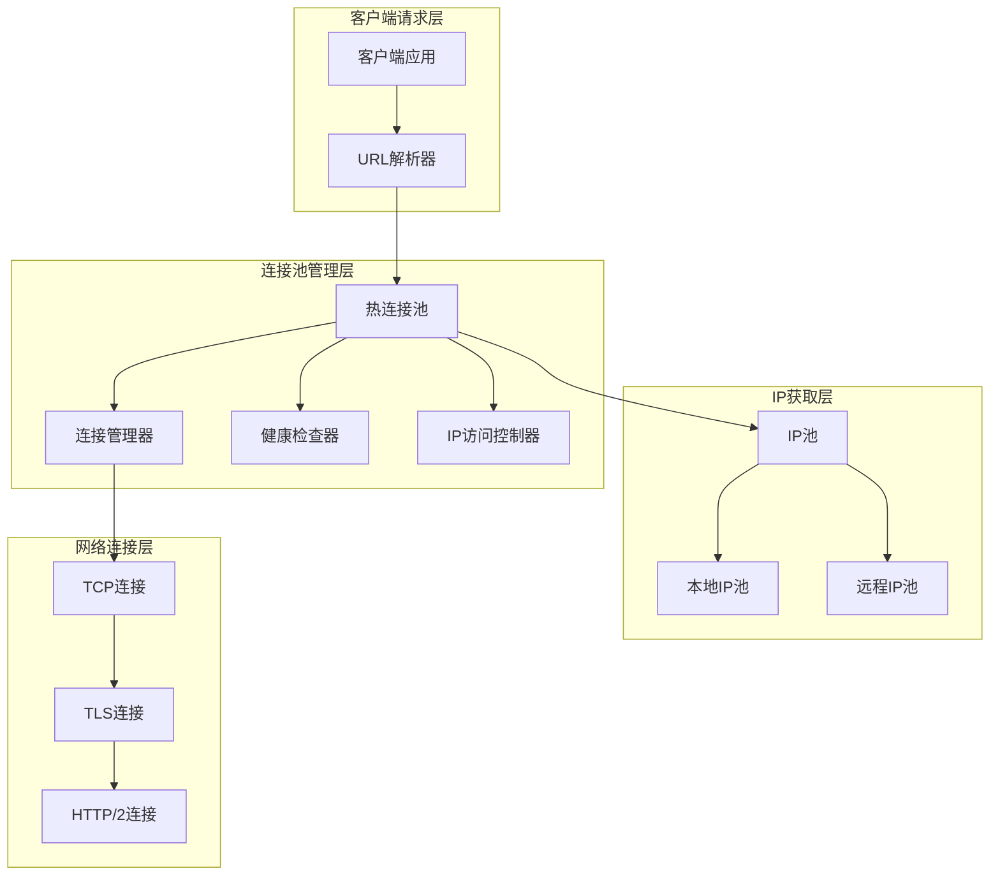
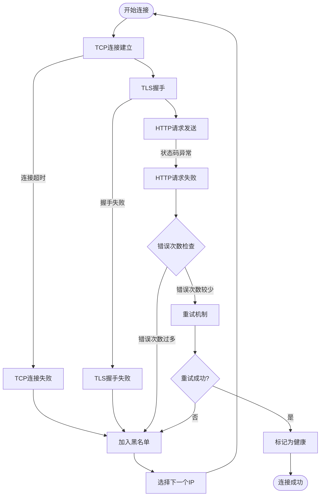
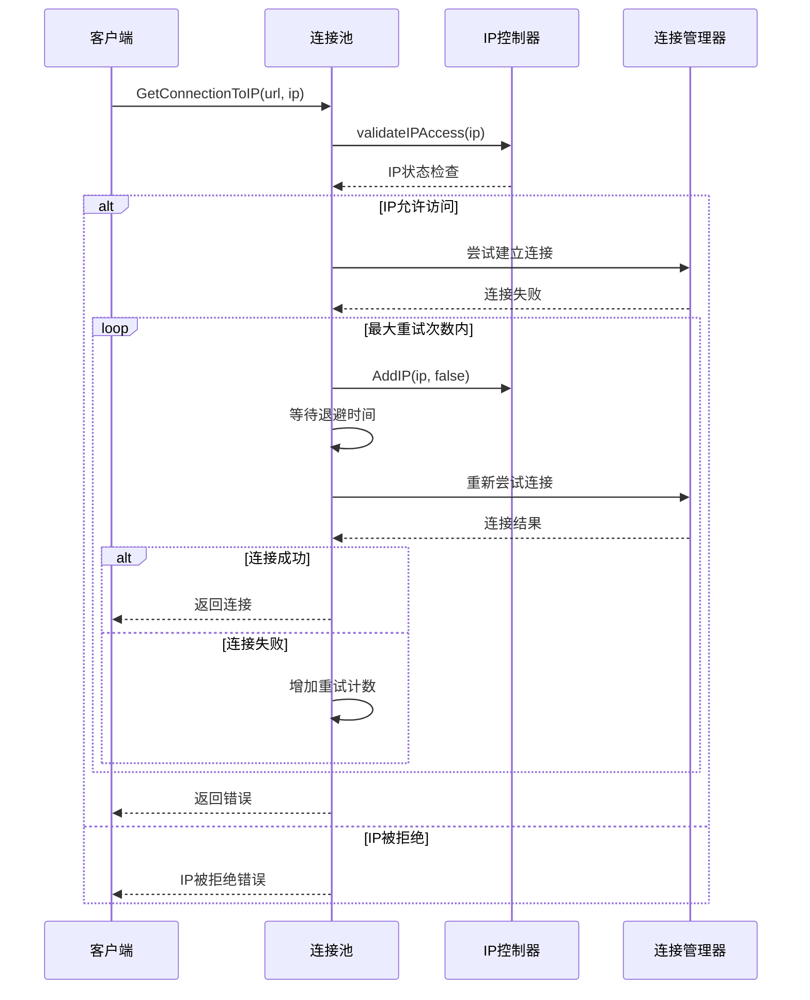
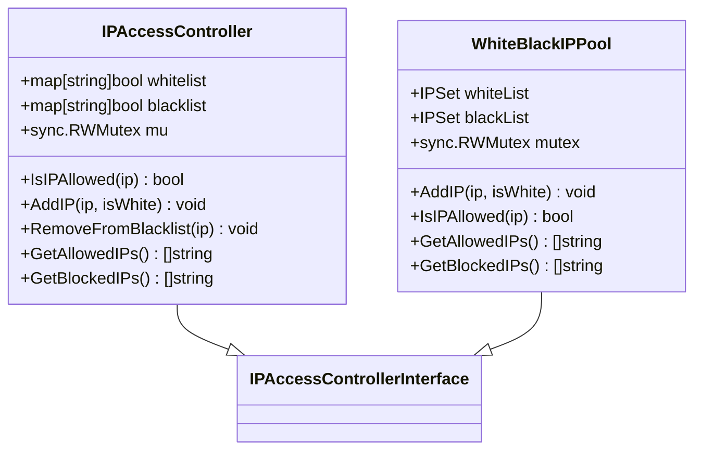
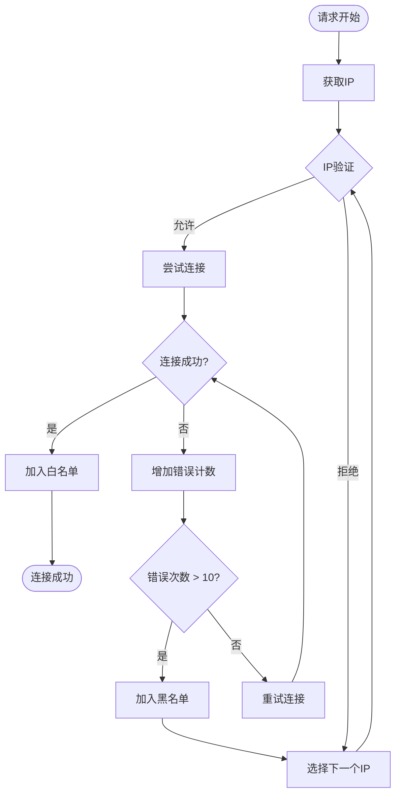
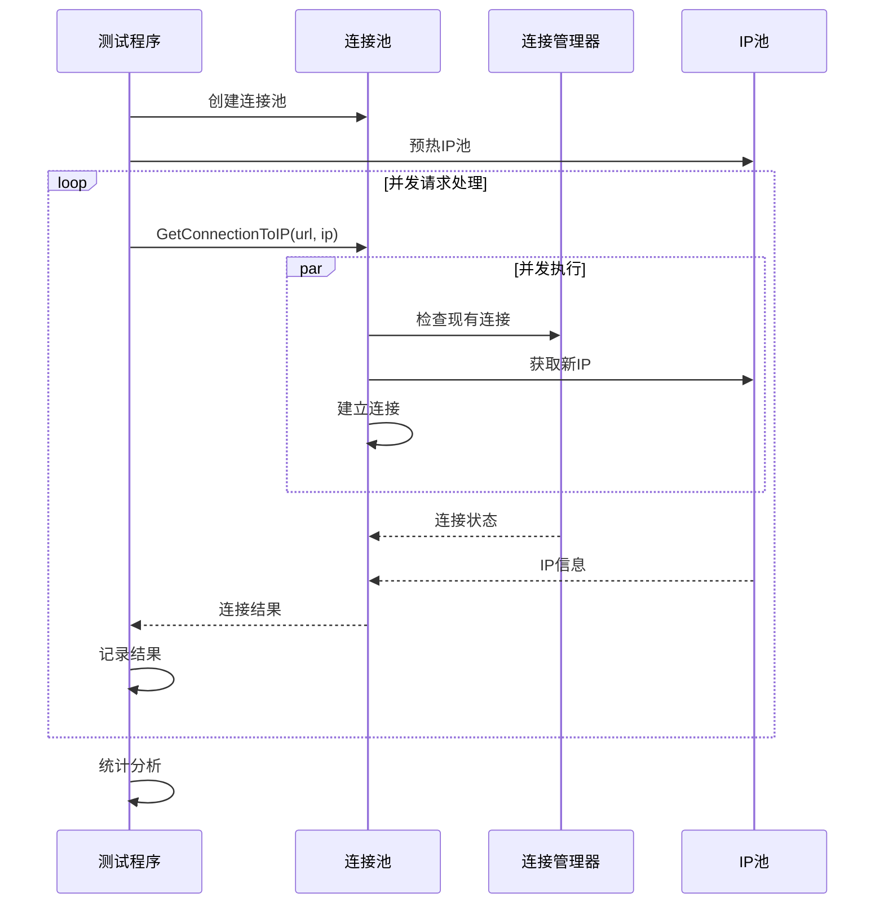

# 自动重试与IP降级策略

<cite>
**本文档引用的文件**
- [test_ip_pool_performance.go](file://test/test_ip_pool_performance.go)
- [utlshotconnpool.go](file://utlsclient/utlshotconnpool.go)
- [connection_manager.go](file://utlsclient/connection_manager.go)
- [connection_helpers.go](file://utlsclient/connection_helpers.go)
- [ip_access_controller.go](file://utlsclient/ip_access_controller.go)
- [health_checker.go](file://utlsclient/health_checker.go)
- [localippool.go](file://localippool/localippool.go)
- [whiteblackippool.go](file://remotedomainippool/whiteblackippool.go)
</cite>

## 目录
1. [概述](#概述)
2. [系统架构](#系统架构)
3. [连接失败检测机制](#连接失败检测机制)
4. [自动重试逻辑](#自动重试逻辑)
5. [IP降级与负载均衡](#ip降级与负载均衡)
6. [并发获取连接实现](#并发获取连接实现)
7. [配置参数优化](#配置参数优化)
8. [故障排除指南](#故障排除指南)
9. [最佳实践建议](#最佳实践建议)

## 概述

本系统实现了智能的自动重试与IP降级策略，能够在连接失败时自动切换到其他可用IP，确保请求的成功率。系统通过多层次的健康检查、IP访问控制和连接池管理机制，实现了高可靠性的网络通信能力。

### 核心特性

- **智能重试机制**：基于连接失败类型和频率的自适应重试策略
- **动态IP降级**：自动识别不可用IP并将其移至黑名单
- **负载均衡**：在可用IP间智能分配请求，避免热点
- **并发安全**：完整的并发控制和线程安全保障
- **实时监控**：持续的健康检查和状态监控

## 系统架构



**架构图来源**
- [utlshotconnpool.go](file://utlsclient/utlshotconnpool.go#L236-L258)
- [connection_manager.go](file://utlsclient/connection_manager.go#L8-L14)

## 连接失败检测机制

### 失败类型识别

系统能够识别多种类型的连接失败，并采取相应的处理策略：



**流程图来源**
- [connection_helpers.go](file://utlsclient/connection_helpers.go#L66-L180)
- [health_checker.go](file://utlsclient/health_checker.go#L23-L61)

### 健康检查机制

健康检查器定期验证连接的有效性，确保连接池中始终包含可用连接：

| 检查项目 | 检查频率 | 失效标准 | 处理动作 |
|---------|---------|---------|---------|
| 连接超时 | 空闲时间 > 配置值 | 超过健康检查间隔 | 标记为不健康 |
| 错误次数 | 每次请求失败 | 错误次数 > 10次 | 加入黑名单 |
| 状态码验证 | HTTP请求后 | 非200状态码 | 标记为不健康 |
| 协议协商 | TLS握手后 | 协商失败 | 重新建立连接 |

**节来源**
- [health_checker.go](file://utlsclient/health_checker.go#L23-L61)

## 自动重试逻辑

### 重试策略实现

系统采用指数退避算法和最大重试次数限制的混合策略：



**序列图来源**
- [connection_helpers.go](file://utlsclient/connection_helpers.go#L66-L180)
- [ip_access_controller.go](file://utlsclient/ip_access_controller.go#L44-L60)

### 重试配置参数

| 参数名称 | 默认值 | 说明 | 优化建议 |
|---------|--------|------|---------|
| MaxRetries | 3 | 最大重试次数 | 根据网络稳定性调整 |
| ConnTimeout | 30s | 连接超时时间 | 平衡响应时间和成功率 |
| TestTimeout | 10s | 测试请求超时 | 确保健康检查及时性 |
| HealthCheckInterval | 30s | 健康检查间隔 | 频繁检查提高可靠性 |
| IdleTimeout | 60s | 空闲连接超时 | 平衡资源使用和性能 |

**节来源**
- [utlshotconnpool.go](file://utlsclient/utlshotconnpool.go#L170-L202)

## IP降级与负载均衡

### IP访问控制机制

系统实现了基于白名单和黑名单的IP访问控制：



**类图来源**
- [ip_access_controller.go](file://utlsclient/ip_access_controller.go#L8-L184)
- [whiteblackippool.go](file://remotedomainippool/whiteblackippool.go#L26-L126)

### 动态IP选择策略

当某个IP连续失败时，系统会自动将其移至黑名单，并从可用IP列表中选择其他IP：



**流程图来源**
- [connection_helpers.go](file://utlsclient/connection_helpers.go#L47-L52)
- [ip_access_controller.go](file://utlsclient/ip_access_controller.go#L22-L42)

**节来源**
- [ip_access_controller.go](file://utlsclient/ip_access_controller.go#L22-L60)

## 并发获取连接实现

### 测试程序中的并发处理

在测试程序中，系统展示了如何在高并发场景下安全地获取和管理连接：



**序列图来源**
- [test_ip_pool_performance.go](file://test/test_ip_pool_performance.go#L203-L290)

### 并发控制机制

系统通过多种机制确保并发安全性：

| 控制机制 | 实现位置 | 作用范围 | 效果 |
|---------|---------|---------|------|
| 读写锁 | ConnectionManager | 连接映射表 | 高并发读取性能 |
| 互斥锁 | IPAccessController | IP黑白名单 | 防止数据竞争 |
| 条件变量 | UTLSConnection | 连接复用 | 等待可用连接 |
| 原子操作 | PoolStats | 统计计数 | 无锁更新 |

**节来源**
- [connection_manager.go](file://utlsclient/connection_manager.go#L8-L14)
- [ip_access_controller.go](file://utlsclient/ip_access_controller.go#L8-L12)

## 配置参数优化

### 性能与可靠性平衡

根据不同的使用场景，推荐以下配置参数：

#### 高可靠性场景（金融、支付系统）
```go
config := &PoolConfig{
    MaxConnections:         50,
    MaxConnsPerHost:        5,
    MaxIdleConns:           10,
    ConnTimeout:            60 * time.Second,
    IdleTimeout:            120 * time.Second,
    MaxLifetime:            600 * time.Second,
    TestTimeout:            30 * time.Second,
    HealthCheckInterval:    10 * time.Second,
    MaxRetries:             5,
}
```

#### 高性能场景（爬虫、数据采集）
```go
config := &PoolConfig{
    MaxConnections:         200,
    MaxConnsPerHost:        20,
    MaxIdleConns:           50,
    ConnTimeout:            10 * time.Second,
    IdleTimeout:            30 * time.Second,
    MaxLifetime:            300 * time.Second,
    TestTimeout:            15 * time.Second,
    HealthCheckInterval:    60 * time.Second,
    MaxRetries:             2,
}
```

#### 平衡场景（通用Web应用）
```go
config := &PoolConfig{
    MaxConnections:         100,
    MaxConnsPerHost:        10,
    MaxIdleConns:           20,
    ConnTimeout:            30 * time.Second,
    IdleTimeout:            60 * time.Second,
    MaxLifetime:            300 * time.Second,
    TestTimeout:            10 * time.Second,
    HealthCheckInterval:    30 * time.Second,
    MaxRetries:             3,
}
```

**节来源**
- [utlshotconnpool.go](file://utlsclient/utlshotconnpool.go#L170-L202)

## 故障排除指南

### 常见问题诊断

#### 连接失败率过高
**症状**：大量连接建立失败或超时
**排查步骤**：
1. 检查网络连通性
2. 验证目标服务器状态
3. 查看连接池统计信息
4. 分析错误日志模式

**解决方案**：
- 调整连接超时时间
- 增加最大重试次数
- 扩大连接池容量
- 检查防火墙设置

#### IP池耗尽
**症状**：无法获取新的IP地址
**排查步骤**：
1. 检查IP池配置
2. 验证IP获取逻辑
3. 查看IP使用统计

**解决方案**：
- 增加IP池大小
- 优化IP回收机制
- 调整IP获取频率

#### 性能下降
**症状**：响应时间增加，吞吐量降低
**排查步骤**：
1. 监控连接池利用率
2. 检查健康检查频率
3. 分析错误分布

**解决方案**：
- 调整健康检查间隔
- 优化连接复用策略
- 平衡并发连接数

### 监控指标

关键监控指标包括：

| 指标名称 | 计算方式 | 正常范围 | 告警阈值 |
|---------|---------|---------|---------|
| 连接成功率 | 成功连接数/总请求数 | >95% | <90% |
| 平均响应时间 | 总响应时间/请求数 | <100ms | >500ms |
| 连接池利用率 | 活跃连接数/最大连接数 | 60-80% | >90% |
| IP可用率 | 可用IP数/总IP数 | >90% | <80% |

## 最佳实践建议

### 开发阶段

1. **合理配置连接池参数**
   - 根据预期并发量设置最大连接数
   - 平衡连接超时时间和重试次数
   - 考虑网络环境特点调整参数

2. **实现优雅降级**
   - 在连接失败时提供备用方案
   - 记录详细的错误信息便于调试
   - 实现熔断机制防止雪崩

3. **监控和日志**
   - 记录连接建立和失败的详细信息
   - 监控关键指标的变化趋势
   - 设置合理的告警阈值

### 生产环境

1. **动态调整策略**
   - 根据实时监控数据调整参数
   - 实现自适应的重试策略
   - 定期评估IP池的有效性

2. **故障恢复机制**
   - 实现自动化的故障检测
   - 建立快速的故障恢复流程
   - 准备人工干预的手段

3. **性能优化**
   - 优化连接复用策略
   - 减少不必要的健康检查
   - 实现智能的IP选择算法

通过以上策略和最佳实践，系统能够在各种网络环境下保持高可用性和高性能，为应用程序提供稳定的网络连接服务。