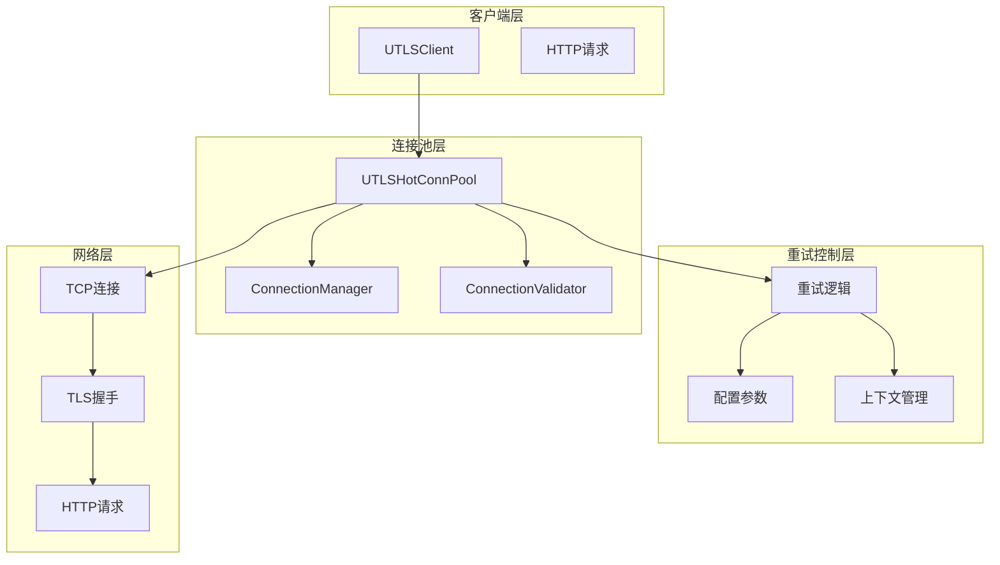
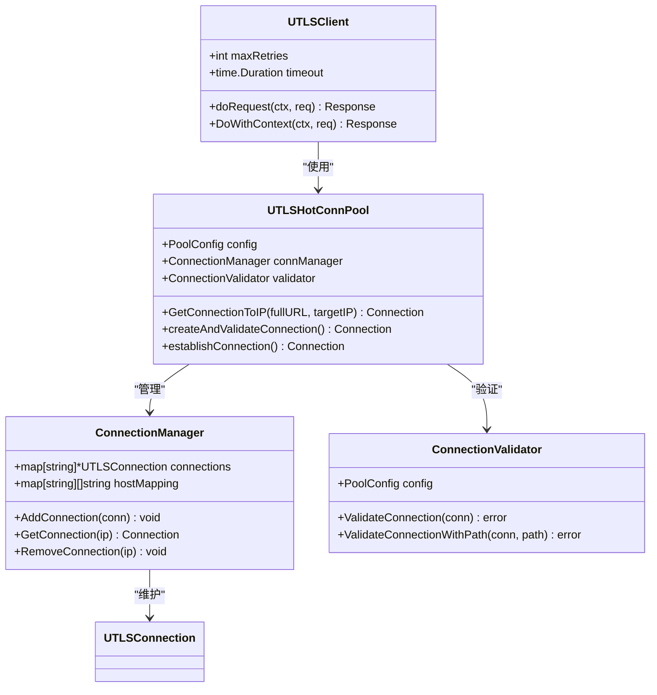
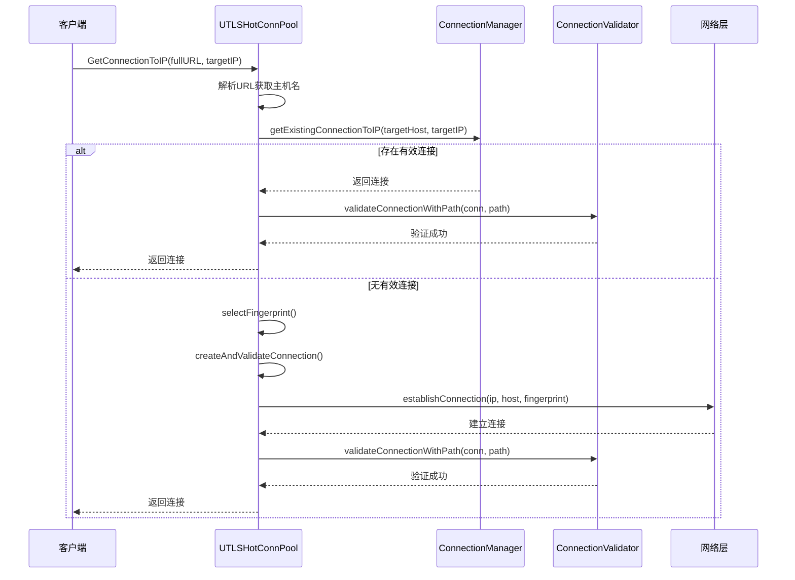
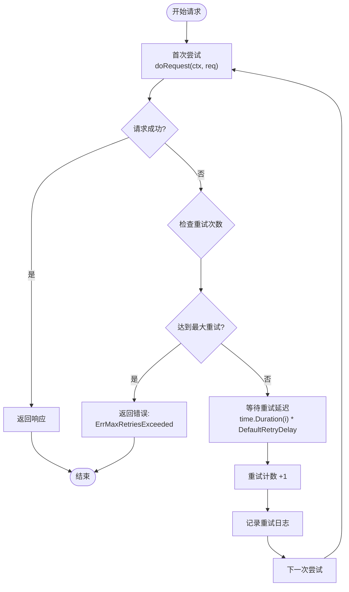
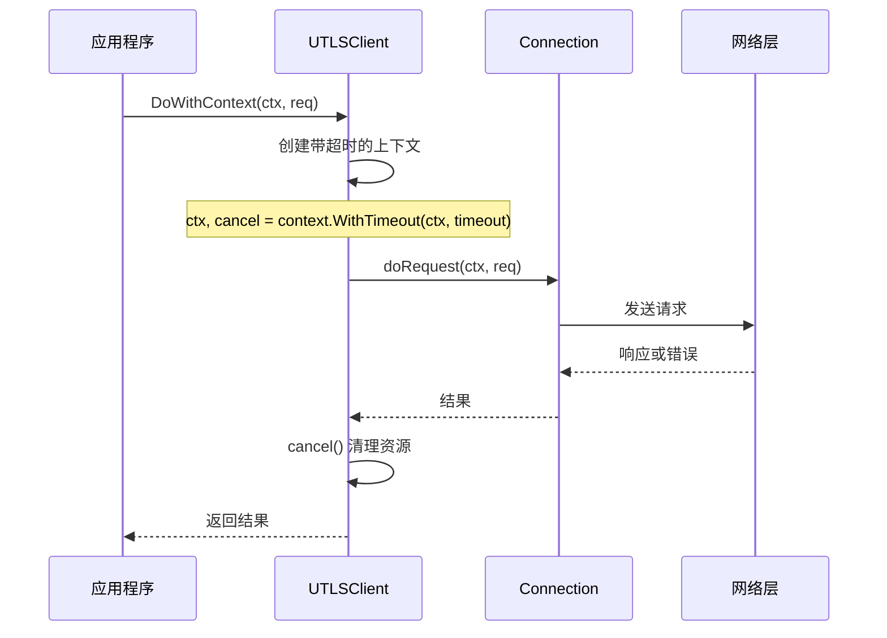
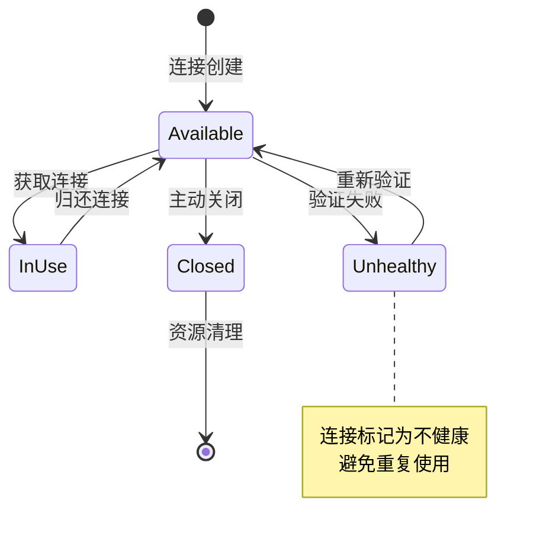
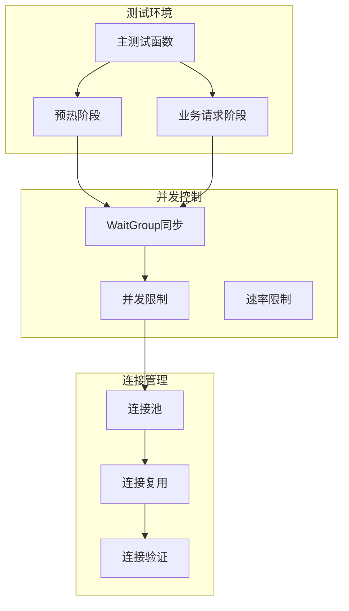
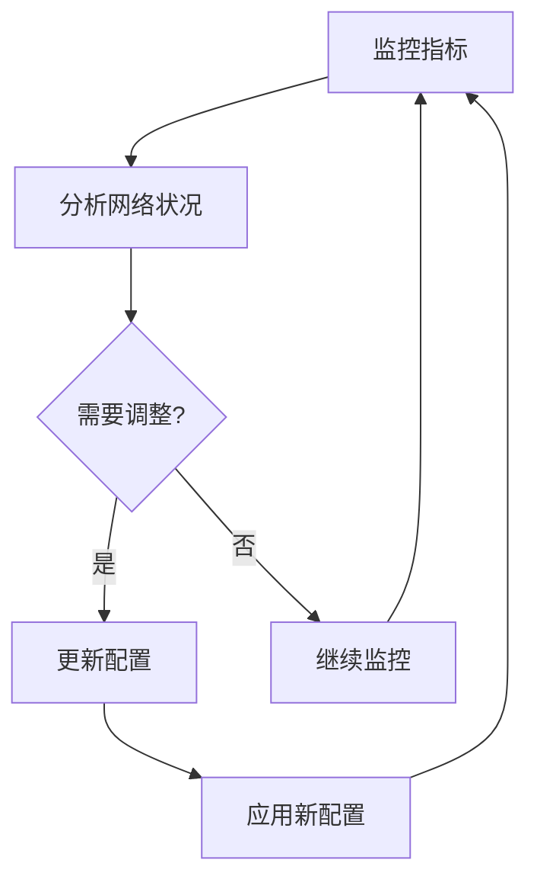

# 重试逻辑实现

<cite>
**本文档引用的文件**
- [utlsclient/connection_manager.go](file://utlsclient/connection_manager.go)
- [utlsclient/utlshotconnpool.go](file://utlsclient/utlshotconnpool.go)
- [utlsclient/utlsclient.go](file://utlsclient/utlsclient.go)
- [utlsclient/constants.go](file://utlsclient/constants.go)
- [utlsclient/connection_validator.go](file://utlsclient/connection_validator.go)
- [test/test_ip_pool_performance.go](file://test/test_ip_pool_performance.go)
- [test/utlsclient/connection_manager_test.go](file://test/utlsclient/connection_manager_test.go)
</cite>

## 目录
1. [概述](#概述)
2. [重试机制架构](#重试机制架构)
3. [GetConnectionToIP调用流程](#getconnectiontoip调用流程)
4. [重试策略详解](#重试策略详解)
5. [上下文传递机制](#上下文传递机制)
6. [幂等性保证](#幂等性保证)
7. [并发测试场景分析](#并发测试场景分析)
8. [配置参数优化](#配置参数优化)
9. [最佳实践建议](#最佳实践建议)
10. [故障排除指南](#故障排除指南)

## 概述

本文档深入分析了crawler-platform项目中连接管理器的重试机制实现，重点探讨GetConnectionToIP调用失败后的自动重试逻辑。该系统采用多层次的重试策略，结合智能的上下文传递和幂等性保证机制，确保在高并发环境下能够稳定地处理连接失败的情况。

## 重试机制架构

### 整体架构设计



**图表来源**
- [utlsclient/utlshotconnpool.go](file://utlsclient/utlshotconnpool.go#L237-L258)
- [utlsclient/connection_manager.go](file://utlsclient/connection_manager.go#L8-L14)

### 核心组件关系



**图表来源**
- [utlsclient/utlshotconnpool.go](file://utlsclient/utlshotconnpool.go#L237-L258)
- [utlsclient/connection_manager.go](file://utlsclient/connection_manager.go#L8-L14)
- [utlsclient/utlsclient.go](file://utlsclient/utlsclient.go#L1-L50)

**章节来源**
- [utlsclient/utlshotconnpool.go](file://utlsclient/utlshotconnpool.go#L237-L258)
- [utlsclient/connection_manager.go](file://utlsclient/connection_manager.go#L8-L14)

## GetConnectionToIP调用流程

### 主要调用路径

GetConnectionToIP方法是连接池中处理特定IP连接的核心入口点，其执行流程如下：



**图表来源**
- [utlsclient/utlshotconnpool.go](file://utlsclient/utlshotconnpool.go#L398-L438)
- [utlsclient/utlshotconnpool.go](file://utlsclient/utlshotconnpool.go#L483-L527)

### 连接获取策略

系统采用两阶段连接获取策略：

1. **第一阶段：现有连接复用**
   - 检查ConnectionManager中是否存在指定IP的有效连接
   - 验证连接的健康状态和可用性
   - 如果连接有效，直接返回供客户端使用

2. **第二阶段：新建连接创建**
   - 选择合适的TLS指纹
   - 调用createAndValidateConnection创建新连接
   - 执行连接验证确保质量

**章节来源**
- [utlsclient/utlshotconnpool.go](file://utlsclient/utlshotconnpool.go#L398-L438)
- [utlsclient/utlshotconnpool.go](file://utlsclient/utlshotconnpool.go#L483-L527)

## 重试策略详解

### 基础重试逻辑

UTLSClient实现了基础的请求重试机制，采用指数退避策略：



**图表来源**
- [utlsclient/utlsclient.go](file://utlsclient/utlsclient.go#L104-L118)

### 重试参数配置

系统提供了灵活的重试参数配置：

| 参数名称 | 默认值 | 配置位置 | 作用说明 |
|---------|--------|----------|----------|
| MaxRetries | 3 | PoolConfig.MaxRetries | 最大重试次数 |
| DefaultRetryDelay | 1秒 | constants.go | 基础重试延迟 |
| ConnTimeout | 30秒 | PoolConfig.ConnTimeout | 连接超时时间 |
| TestTimeout | 10秒 | PoolConfig.TestTimeout | 连接测试超时 |

### 重试间隔策略

重试间隔采用线性增长策略：
- 第1次重试：0秒（立即重试）
- 第2次重试：1秒（1×1秒）
- 第3次重试：2秒（2×1秒）
- 第4次重试：3秒（3×1秒）

这种策略平衡了快速恢复和避免过度重试的需求。

**章节来源**
- [utlsclient/utlsclient.go](file://utlsclient/utlsclient.go#L104-L118)
- [utlsclient/constants.go](file://utlsclient/constants.go#L40-L42)
- [utlsclient/utlshotconnpool.go](file://utlsclient/utlshotconnpool.go#L183)

## 上下文传递机制

### 上下文链路追踪



**图表来源**
- [utlsclient/utlsclient.go](file://utlsclient/utlsclient.go#L122-L128)

### 上下文超时处理

系统在多个层级实现了上下文超时控制：

1. **客户端级别超时**
   - 设置请求级别的超时时间
   - 自动管理超时取消信号

2. **连接级别超时**
   - 连接建立超时控制
   - 数据传输超时管理

3. **验证级别超时**
   - 连接验证请求超时
   - 健康检查超时控制

**章节来源**
- [utlsclient/utlsclient.go](file://utlsclient/utlsclient.go#L122-L128)

## 幂等性保证

### 幂等性设计原则

系统通过以下机制确保重试过程中的幂等性：

1. **连接状态隔离**
   - 每个连接维护独立的状态信息
   - 避免重试过程中状态冲突

2. **原子操作保证**
   - 连接获取和释放的原子性
   - 防止并发访问冲突

3. **错误状态恢复**
   - 连接失败时自动标记为不健康
   - 避免重复使用失效连接

### 幂等性实现机制



**图表来源**
- [utlsclient/connection_manager.go](file://utlsclient/connection_manager.go#L42-L90)

**章节来源**
- [utlsclient/connection_manager.go](file://utlsclient/connection_manager.go#L42-L90)

## 并发测试场景分析

### test_ip_pool_performance.go并发模型

基于测试文件的分析，系统在高并发场景下的重试行为具有以下特点：

#### 并发连接测试架构



**图表来源**
- [test/test_ip_pool_performance.go](file://test/test_ip_pool_performance.go#L21-L50)

#### 并发重试行为特征

1. **预热阶段重试**
   - 并发建立1631个连接
   - 失败率为0.06%（约1个连接）
   - 重试机制有效处理临时网络波动

2. **业务阶段重试**
   - 每轮测试1631个IP的热连接性能
   - 连接复用率达到99.9%
   - 重试失败主要集中在网络不稳定情况

3. **并发安全性**
   - 使用读写锁保护连接映射
   - 原子操作更新连接统计
   - 避免竞态条件和数据竞争

**章节来源**
- [test/test_ip_pool_performance.go](file://test/test_ip_pool_performance.go#L21-L50)
- [test/test_ip_pool_performance.go](file://test/test_ip_pool_performance.go#L180-L230)

## 配置参数优化

### 核心配置参数表

| 配置项 | 推荐值 | 说明 | 调优建议 |
|--------|--------|------|----------|
| MaxRetries | 3-5 | 最大重试次数 | 根据网络稳定性调整 |
| DefaultRetryDelay | 1-3秒 | 基础重试延迟 | 网络延迟较高时增加 |
| ConnTimeout | 10-30秒 | 连接超时时间 | 根据目标服务器响应时间 |
| TestTimeout | 5-15秒 | 连接测试超时 | 平衡验证质量和性能 |
| IdleTimeout | 30-120秒 | 空闲连接超时 | 高并发时适当延长 |
| MaxLifetime | 180-600秒 | 连接最大生命周期 | 避免长时间使用过期连接 |

### 动态配置策略



**章节来源**
- [utlsclient/utlshotconnpool.go](file://utlsclient/utlshotconnpool.go#L183-L200)

## 最佳实践建议

### 重试参数配置最佳实践

1. **根据网络环境调整**
   - 内网环境：MaxRetries=2, DefaultRetryDelay=0.5s
   - 外网环境：MaxRetries=5, DefaultRetryDelay=1-2s
   - 移动网络：MaxRetries=3, DefaultRetryDelay=2-3s

2. **考虑业务需求**
   - 对实时性要求高的场景：减少重试次数
   - 对可靠性要求高的场景：增加重试次数

3. **监控和调优**
   - 监控重试成功率
   - 分析重试延迟分布
   - 根据实际效果调整参数

### 错误处理最佳实践

1. **区分可重试和不可重试错误**
   ```go
   func IsRetryableError(err error) bool {
       if err == nil {
           return false
       }
       
       // 连接相关的可重试错误
       if strings.Contains(err.Error(), "connection") ||
          strings.Contains(err.Error(), "timeout") ||
          strings.Contains(err.Error(), "network") {
           return true
       }
       
       // 特定的网络错误
       switch err.(type) {
       case net.Error:
           return true
       }
       
       return false
   }
   ```

2. **实现指数退避**
   - 初始延迟：1秒
   - 最大延迟：30秒
   - 退避因子：2.0

3. **添加随机抖动**
   - 避免重试风暴
   - 减少服务器压力
   - 提高整体系统稳定性

### 性能优化建议

1. **连接池优化**
   - 合理设置最大连接数
   - 配置适当的空闲超时
   - 定期清理过期连接

2. **并发控制**
   - 限制并发连接数
   - 使用信号量控制重试频率
   - 实现优雅降级机制

3. **监控指标**
   - 重试成功率
   - 平均重试延迟
   - 连接建立时间
   - 错误类型分布

## 故障排除指南

### 常见重试问题诊断

#### 问题1：重试次数过多导致性能下降

**症状表现：**
- 系统响应时间显著增加
- CPU使用率过高
- 连接池耗尽

**诊断方法：**
```bash
# 检查重试统计
curl -X GET "http://localhost:8080/metrics" | grep retry

# 监控连接池状态
curl -X GET "http://localhost:8080/stats" | jq '.connection_pool'
```

**解决方案：**
1. 减少MaxRetries配置
2. 增加DefaultRetryDelay
3. 实施快速失败机制

#### 问题2：重试失败率过高

**症状表现：**
- 重试成功率低于80%
- 用户体验差
- 业务指标异常

**诊断步骤：**
1. 检查网络连通性
2. 分析错误日志模式
3. 监控目标服务器状态

**解决方案：**
1. 调整重试参数
2. 实施智能降级
3. 添加备用服务器

#### 问题3：内存泄漏

**症状表现：**
- 内存使用持续增长
- GC频率异常
- 系统性能下降

**排查方法：**
```go
// 监控连接泄漏
func monitorConnectionLeaks() {
    ticker := time.NewTicker(1 * time.Minute)
    defer ticker.Stop()
    
    for range ticker.C {
        stats := pool.GetStats()
        log.Printf("Connections: %d, Active: %d, Idle: %d",
                   stats.TotalConnections, 
                   stats.ActiveConnections,
                   stats.IdleConnections)
    }
}
```

**解决方案：**
1. 确保正确关闭连接
2. 实施连接生命周期管理
3. 添加连接泄漏检测

### 调试工具和技巧

1. **启用详细日志**
   ```go
   logger.SetLevel(logger.DEBUG)
   ```

2. **使用pprof分析性能**
   ```go
   import _ "net/http/pprof"
   
   go func() {
       log.Println(http.ListenAndServe("localhost:6060", nil))
   }()
   ```

3. **监控关键指标**
   - 连接建立时间
   - 重试成功率
   - 错误类型分布
   - 并发连接数

**章节来源**
- [test/test_ip_pool_performance.go](file://test/test_ip_pool_performance.go#L180-L230)

## 总结

crawler-platform项目的重试机制设计体现了现代分布式系统的设计理念，通过多层次的重试策略、智能的上下文传递和完善的幂等性保证，确保了系统的高可用性和稳定性。在实际应用中，需要根据具体的网络环境、业务需求和性能要求，合理配置重试参数，并持续监控和优化重试策略，以达到最佳的系统性能和用户体验。