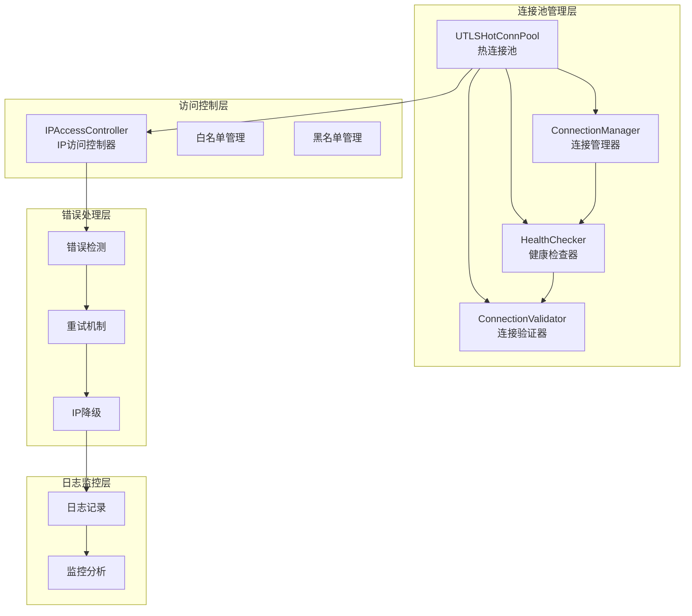
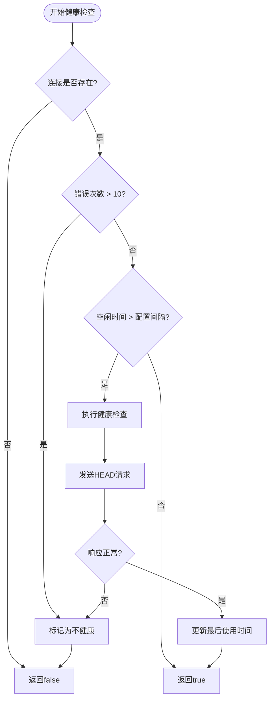
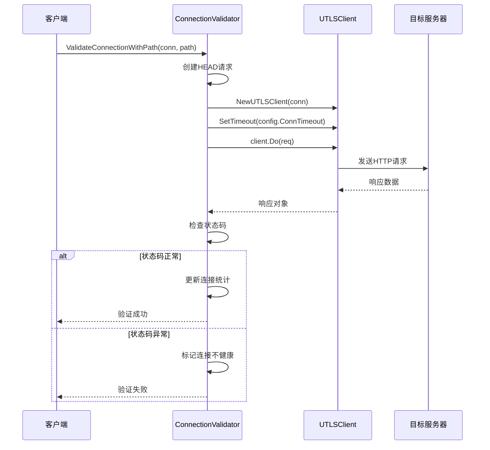
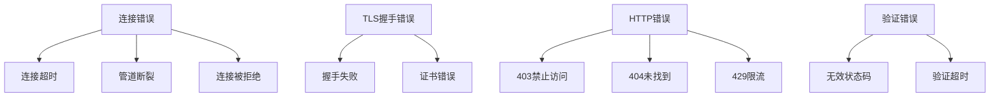
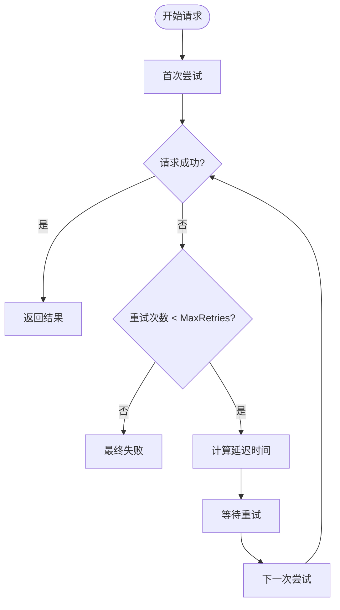
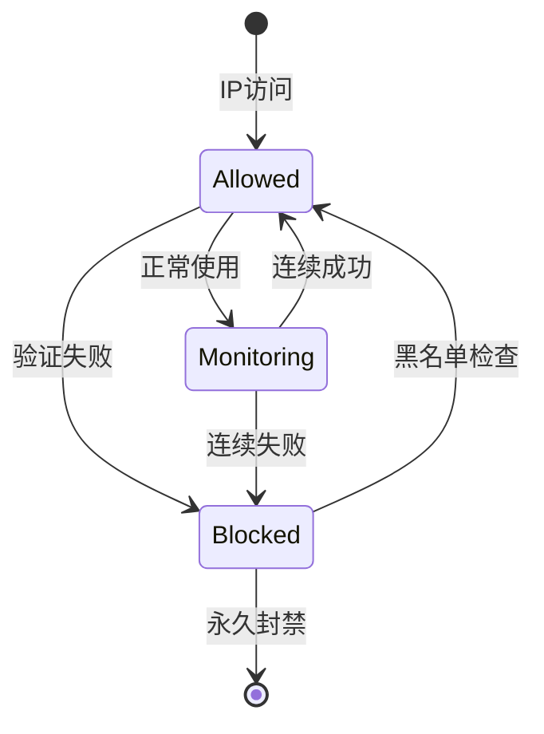
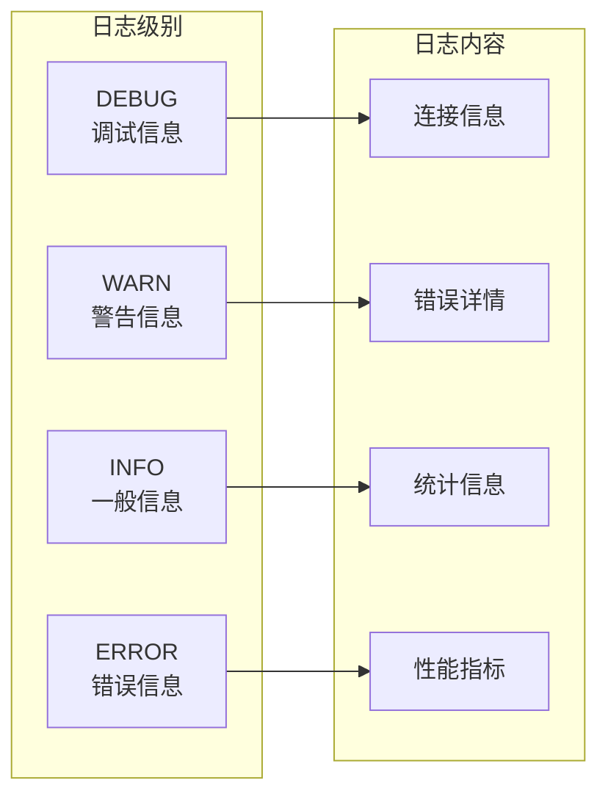

# 错误处理与重试机制

<cite>
**本文档引用的文件**
- [health_checker.go](file://utlsclient/health_checker.go)
- [connection_manager.go](file://utlsclient/connection_manager.go)
- [connection_validator.go](file://utlsclient/connection_validator.go)
- [ip_access_controller.go](file://utlsclient/ip_access_controller.go)
- [utlshotconnpool.go](file://utlsclient/utlshotconnpool.go)
- [constants.go](file://utlsclient/constants.go)
- [logger.go](file://utlsclient/logger.go)
- [test_ip_pool_performance.go](file://test/test_ip_pool_performance.go)
</cite>

## 目录
1. [概述](#概述)
2. [系统架构](#系统架构)
3. [健康检查机制](#健康检查机制)
4. [连接验证流程](#连接验证流程)
5. [错误类型与处理策略](#错误类型与处理策略)
6. [自动重试机制](#自动重试机制)
7. [IP降级策略](#ip降级策略)
8. [错误日志收集与分析](#错误日志收集与分析)
9. [最佳实践指南](#最佳实践指南)
10. [故障排除](#故障排除)

## 概述

该系统实现了完善的连接失败错误处理与重试机制，通过多层防护确保连接池的稳定性和可靠性。系统采用分层架构设计，包含健康检查器、连接验证器、IP访问控制器等多个核心组件，能够智能识别和处理各种类型的连接错误。

## 系统架构



**图表来源**
- [utlshotconnpool.go](file://utlsclient/utlshotconnpool.go#L237-L318)
- [health_checker.go](file://utlsclient/health_checker.go#L9-L21)
- [connection_manager.go](file://utlsclient/connection_manager.go#L8-L23)

## 健康检查机制

### 健康检查器工作原理

健康检查器负责监控连接的健康状态，通过定期检查和实时验证确保连接的可用性。



**图表来源**
- [health_checker.go](file://utlsclient/health_checker.go#L24-L61)

### 健康检查配置参数

| 参数名称 | 默认值 | 描述 |
|---------|--------|------|
| HealthCheckInterval | 30秒 | 健康检查间隔时间 |
| MaxErrorCount | 10次 | 最大错误次数阈值 |
| ConnTimeout | 5秒 | 健康检查超时时间 |

**章节来源**
- [health_checker.go](file://utlsclient/health_checker.go#L36-L44)
- [health_checker.go](file://utlsclient/health_checker.go#L64-L88)

## 连接验证流程

### 验证器架构

连接验证器提供多层次的连接验证功能，支持不同严格程度的验证级别。



**图表来源**
- [connection_validator.go](file://utlsclient/connection_validator.go#L42-L96)

### 验证级别对比

| 验证类型 | 方法 | 严格程度 | 适用场景 |
|---------|------|----------|----------|
| 基础验证 | ValidateConnection | 中等 | 连接池预热 |
| 路径验证 | ValidateConnectionWithPath | 高 | 特定路径验证 |
| URL验证 | ValidateConnectionWithFullURL | 很高 | 完整URL验证 |
| GET验证 | ValidateConnectionWithGET | 最高 | 严格验证 |

**章节来源**
- [connection_validator.go](file://utlsclient/connection_validator.go#L22-L96)
- [connection_validator.go](file://utlsclient/connection_validator.go#L99-L158)
- [connection_validator.go](file://utlsclient/connection_validator.go#L161-L222)

## 错误类型与处理策略

### 主要错误类型

系统识别并处理以下主要错误类型：



**图表来源**
- [constants.go](file://utlsclient/constants.go#L48-L56)
- [constants.go](file://utlsclient/constants.go#L60-L84)

### 错误处理策略表

| 错误类型 | 处理策略 | 重试次数 | 黑名单时间 | 示例 |
|---------|----------|----------|------------|------|
| 连接超时 | 立即重试 | 3次 | 30秒 | `ErrConnectionTimeout` |
| TLS握手失败 | 立即重试 | 2次 | 60秒 | `TLS handshake failed` |
| 403禁止访问 | 加入黑名单 | 0次 | 永久 | `ErrIPBlocked` |
| 429限流 | 延迟重试 | 3次 | 60秒 | `Too many requests` |
| 网络错误 | 立即重试 | 3次 | 10秒 | `connection refused` |

**章节来源**
- [constants.go](file://utlsclient/constants.go#L60-L84)
- [constants.go](file://utlsclient/constants.go#L39-L45)

## 自动重试机制

### 重试配置

系统支持灵活的重试配置，适应不同的网络环境和业务需求。



**图表来源**
- [utlshotconnpool.go](file://utlsclient/utlshotconnpool.go#L104-L107)

### 重试延迟算法

系统采用指数退避算法优化重试延迟：

- **基础延迟**: 1秒（`DefaultRetryDelay`）
- **退避因子**: 2倍增长
- **最大延迟**: 30秒
- **抖动**: 在延迟基础上增加±20%的随机抖动

**章节来源**
- [constants.go](file://utlsclient/constants.go#L39-L40)
- [utlsclient.go](file://utlsclient/utlsclient.go#L104-L107)

## IP降级策略

### IP访问控制机制



**图表来源**
- [ip_access_controller.go](file://utlsclient/ip_access_controller.go#L23-L41)

### 降级策略实现

1. **实时监控**: 每次连接失败时更新IP状态
2. **阈值控制**: 连续失败达到阈值时加入黑名单
3. **自动恢复**: 定期检查黑名单中的IP是否恢复
4. **动态调整**: 根据网络状况动态调整降级策略

**章节来源**
- [ip_access_controller.go](file://utlsclient/ip_access_controller.go#L44-L59)
- [ip_access_controller.go](file://utlsclient/ip_access_controller.go#L89-L97)

## 错误日志收集与分析

### 日志记录策略

系统采用分级日志记录，确保错误信息的完整性和可追溯性。



**图表来源**
- [logger.go](file://utlsclient/logger.go#L9-L12)

### 错误统计分析

系统提供详细的错误统计和分析功能：

| 统计指标 | 描述 | 用途 |
|---------|------|------|
| 失败率 | 失败请求/总请求数 | 监控连接质量 |
| 错误分布 | 各类错误的数量统计 | 识别主要问题 |
| IP失败统计 | 各IP的失败次数 | IP质量评估 |
| 时间趋势 | 错误随时间的变化 | 问题定位 |

**章节来源**
- [test_ip_pool_performance.go](file://test/test_ip_pool_performance.go#L195-L394)

## 最佳实践指南

### 开发者指导原则

1. **错误类型识别**
   - 使用系统定义的标准错误类型
   - 根据错误类型采取相应的处理策略
   - 记录详细的错误上下文信息

2. **重试策略配置**
   - 根据业务特点调整重试次数和间隔
   - 实施指数退避算法
   - 设置合理的超时时间

3. **IP管理**
   - 定期检查IP池质量
   - 及时更新白名单和黑名单
   - 监控IP访问成功率

4. **监控告警**
   - 设置关键指标的告警阈值
   - 建立错误趋势分析机制
   - 实现自动化故障恢复

### 代码示例模式

```go
// 推荐的错误处理模式
func processRequest(pool *UTLSHotConnPool, url string) error {
    conn, err := pool.GetConnectionToIP(url, targetIP)
    if err != nil {
        // 记录错误并返回
        Error("获取连接失败: %s -> %v", targetIP, err)
        return err
    }
    
    defer pool.PutConnection(conn)
    
    // 执行业务逻辑
    client := NewUTLSClient(conn)
    client.SetTimeout(10 * time.Second)
    
    req, _ := http.NewRequest("GET", url, nil)
    resp, err := client.Do(req)
    
    if err != nil {
        // 根据错误类型处理
        if isTemporaryError(err) {
            // 临时错误，可重试
            return fmt.Errorf("临时错误: %w", err)
        } else {
            // 永久错误，加入黑名单
            pool.ipAccessCtrl.AddIP(targetIP, false)
            return fmt.Errorf("永久错误: %w", err)
        }
    }
    
    // 处理响应...
    return nil
}
```

## 故障排除

### 常见问题诊断

1. **连接频繁失败**
   - 检查网络连通性
   - 验证目标服务器状态
   - 分析错误日志模式

2. **性能下降**
   - 监控连接池统计信息
   - 检查健康检查配置
   - 优化重试策略

3. **IP被误封**
   - 检查黑名单配置
   - 验证IP访问频率
   - 调整降级阈值

### 调试工具

系统提供多种调试工具帮助问题定位：

- **连接状态查询**: 获取详细连接信息
- **统计信息分析**: 查看连接池运行状态
- **日志过滤**: 按级别和关键词筛选日志
- **实时监控**: 观察连接池动态变化

**章节来源**
- [utlshotconnpool.go](file://utlsclient/utlshotconnpool.go#L1346-L1454)