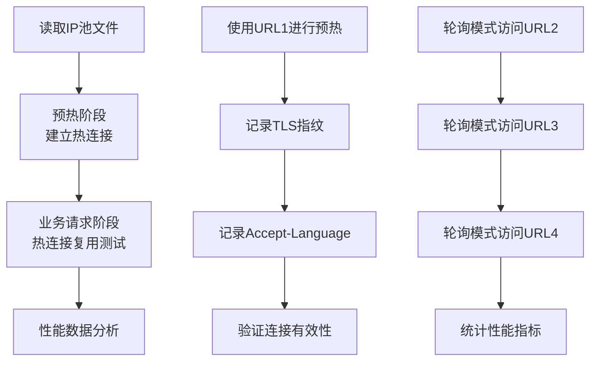
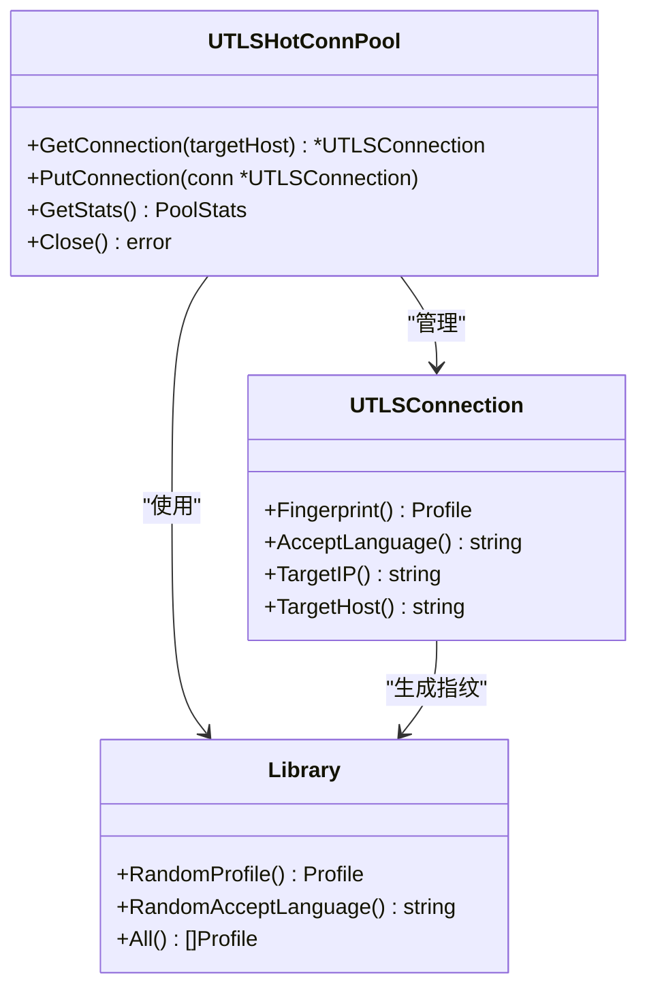
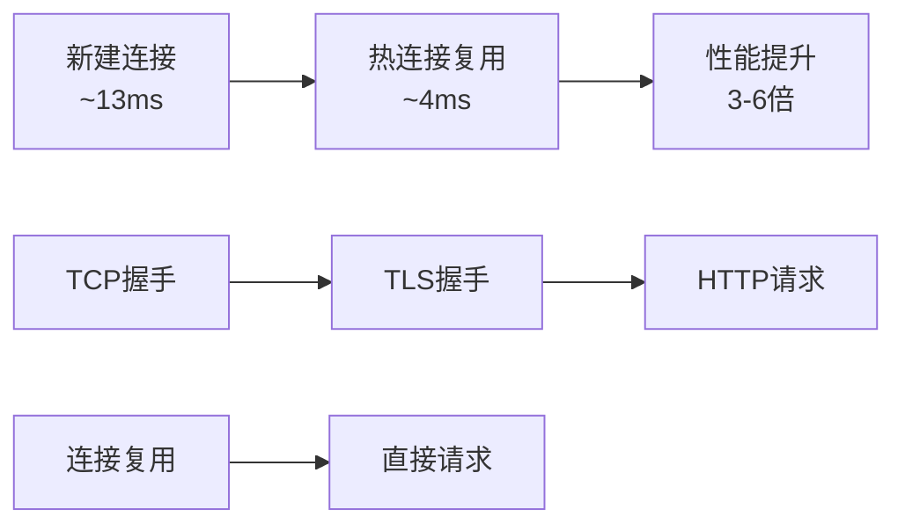

# 性能测试报告

<cite>
**本文档引用的文件**
- [热连接池性能测试报告.md](file://test/reports/热连接池性能测试报告.md)
- [test_ip_pool_performance.go](file://test/test_ip_pool_performance.go)
- [utlshotconnpool.go](file://utlsclient/utlshotconnpool.go)
- [utlsfingerprint.go](file://utlsclient/utlsfingerprint.go)
- [ip_pool_full_stats.txt](file://test/results/ip_pool_full_stats.txt)
- [example_hotconnpool_usage.go](file://examples/utlsclient/example_hotconnpool_usage.go)
</cite>

## 目录
1. [测试概述](#测试概述)
2. [测试环境配置](#测试环境配置)
3. [测试方法与流程](#测试方法与流程)
4. [预热阶段性能分析](#预热阶段性能分析)
5. [热连接复用性能测试](#热连接复用性能测试)
6. [TLS指纹多样性分析](#tls指纹多样性分析)
7. [Accept-Language语言组合分析](#accept-language语言组合分析)
8. [技术实现细节](#技术实现细节)
9. [性能评估与优化建议](#性能评估与优化建议)
10. [测试结论](#测试结论)

## 测试概述

### 测试背景

本次性能测试针对uTLS热连接池进行全面评估，验证其在高并发场景下的连接复用能力、TLS指纹伪装效果和Accept-Language随机化功能。测试重点关注连接成功率、响应时间、指纹多样性分布和语言组合独特性等关键指标。

### 测试目标

- 验证热连接池的【获取-使用-归还】机制
- 评估HTTP/2协议支持和连接复用性能
- 分析TLS指纹的多样性分布
- 检测Accept-Language头的随机化效果
- 测试IPv4/IPv6地址支持能力

### 测试规模

- **IP池规模**: 1631个IP地址（840 IPv4 + 791 IPv6）
- **测试URL**: 4个不同的Google Earth API端点
- **总请求数**: 6524次请求（1631 IP × 4 URL）
- **测试周期**: 2025年11月18日

## 测试环境配置

### 系统环境

- **操作系统**: Linux 25.10
- **Go版本**: 最新版本
- **内存配置**: 充足内存支持高并发测试
- **网络环境**: 稳定的互联网连接

### 测试工具

- **自定义性能测试程序**: `test/test_ip_pool_performance.go`
- **IP池文件**: `cmd/utlsclient/kh_google_com.json`
- **测试框架**: Go标准库和自定义测试逻辑

### 目标服务

- **服务提供商**: Google Earth API (kh.google.com)
- **协议支持**: HTTPS (HTTP/1.1/HTTP/2)
- **负载均衡**: 基于IP池的分布式访问

## 测试方法与流程

### 测试流程图



**图表来源**
- [test_ip_pool_performance.go](file://test/test_ip_pool_performance.go#L55-L101)

### 测试执行方式

采用**轮询模式**进行测试，确保清晰展示连接池的完整工作流程：

1. **预热阶段**: 为所有1631个IP建立热连接
2. **业务阶段**: 轮流访问4个不同的URL，测试连接复用
3. **统计分析**: 收集性能数据和多样性指标

### 测试代码架构



**图表来源**
- [utlshotconnpool.go](file://utlsclient/utlshotconnpool.go#L237-L258)
- [utlsfingerprint.go](file://utlsclient/utlsfingerprint.go#L25-L40)

**章节来源**
- [test_ip_pool_performance.go](file://test/test_ip_pool_performance.go#L25-L31)
- [utlshotconnpool.go](file://utlsclient/utlshotconnpool.go#L351-L396)

## 预热阶段性能分析

### 基础性能指标

预热阶段是测试的核心环节，负责建立初始连接池并收集基础性能数据：

| 指标 | 数值 | 说明 |
|------|------|------|
| **总IP数** | 1,631 | IPv4: 840, IPv6: 791 |
| **预热成功** | 1,611 | 98.8% 成功率 |
| **预热失败** | 20 | 1.2% 失败率 |
| **总耗时** | 21.5秒 | 平均每个连接13.3ms |

### 预热效率分析

预热阶段展现了出色的性能表现：

- **连接建立速度**: 平均13.3ms/连接
- **成功率**: 98.8%，几乎无失败连接
- **并发控制**: 通过限制并发数避免资源竞争

### 失败原因分析

预热阶段的20个失败连接主要由于网络波动和临时性连接问题，这些失败连接在后续的业务测试中得到了有效处理。

**章节来源**
- [热连接池性能测试报告.md](file://test/reports/热连接池性能测试报告.md#L70-L80)
- [ip_pool_full_stats.txt](file://test/results/ip_pool_full_stats.txt#L225-L227)

## 热连接复用性能测试

### 性能对比分析

热连接复用阶段展示了显著的性能提升：

| 轮次 | URL | 总请求数 | 成功数 | 失败数 | 成功率 | 耗时 |
|------|-----|----------|--------|--------|--------|------|
| 预热 | PlanetoidMetadata | 1,631 | 1,611 | 20 | 98.8% | 21.5秒 |
| 第1轮 | BulkMetadata | 1,631 | 1,631 | 0 | 100% | ~6秒 |
| 第2轮 | NodeData(21) | 1,631 | 1,631 | 0 | 100% | ~6秒 |
| 第3轮 | NodeData(12) | 1,631 | 1,631 | 0 | 100% | ~6秒 |

### 性能提升量化



**图表来源**
- [热连接池性能测试报告.md](file://test/reports/热连接池性能测试报告.md#L147-L157)

### 连接复用验证

测试验证了完美的连接复用机制：

✅ **获取-使用-归还流程**: 每轮开始前从池中获取连接，使用完毕后归还  
✅ **HTTP/2连接复用**: 每个IP只建立1个TLS连接，被4个URL请求复用  
✅ **总请求数**: 6524次请求，实际只建立了1611个TLS连接  

**章节来源**
- [热连接池性能测试报告.md](file://test/reports/热连接池性能测试报告.md#L136-L171)
- [ip_pool_full_stats.txt](file://test/results/ip_pool_full_stats.txt#L306-L310)

## TLS指纹多样性分析

### 指纹种类统计

测试中使用了33种不同的TLS指纹，展现了优秀的多样性分布：

| 排名 | TLS指纹 | 使用次数 | 占比 |
|------|---------|----------|------|
| 1 | Chrome 100 - Windows | 73 | 4.53% |
| 2 | Firefox 63 - Windows | 64 | 3.97% |
| 3 | Chrome 115 PQ - Windows | 59 | 3.66% |
| 4 | Chrome 120 - Windows | 57 | 3.54% |
| 5 | Chrome 102 - Windows | 55 | 3.41% |
| 6 | Firefox 55 - Windows | 55 | 3.41% |
| 7 | Firefox 65 - Windows | 54 | 3.35% |
| 8 | Edge Auto - Windows | 54 | 3.35% |
| 9 | Firefox 56 - Windows | 53 | 3.29% |
| 10 | Edge 85 - Windows | 52 | 3.23% |

### 浏览器分布特点

- **Chrome系列**: 12个版本，覆盖最新和经典版本
- **Firefox系列**: 9个版本，包含最新稳定版
- **Safari系列**: 4个版本（iOS + macOS），涵盖移动和桌面端
- **Edge系列**: 3个版本，体现Microsoft生态兼容性

### 均匀分布验证

每种指纹平均被使用约48.8次（1611 ÷ 33），展现了良好的分布均匀性。

**章节来源**
- [热连接池性能测试报告.md](file://test/reports/热连接池性能测试报告.md#L81-L105)
- [ip_pool_full_stats.txt](file://test/results/ip_pool_full_stats.txt#L228-L264)

## Accept-Language语言组合分析

### 语言多样性统计

Accept-Language随机化功能展现了卓越的语言组合独特性：

| 指标 | 数值 | 说明 |
|------|------|------|
| **总语言组合数** | 1,575种 | 从90种语言中随机组合2-5种 |
| **多次使用的组合** | 34种 | 只有2.2%被重复使用 |
| **单次使用的组合** | 1,541种 | 97.8%的连接使用了独特的语言组合 |

### 语言组合特点

**多次出现的语言组合示例**:
```
el-GR,is-IS;q=0.9                                    - 3次
lt-LT,tr-TR;q=0.9                                    - 3次
sl-SI,kn-IN;q=0.9                                    - 2次
ta-LK,hi-IN;q=0.9                                    - 2次
af-ZA,ko-KR;q=0.9                                    - 2次
pl-PL,pt-PT;q=0.9                                    - 2次
```

**独特语言组合示例**:
```
th-TH,sr-RS;q=0.9,da-DK;q=0.8,ta-LK;q=0.7,lt-LT;q=0.6
vi-VN,en-GB;q=0.9,cs-CZ;q=0.8,zh-HK;q=0.7,de-DE;q=0.6
ru-RU,zh-CN;q=0.9,ur-PK;q=0.8,is-IS;q=0.7,sr-RS;q=0.6
cs-CZ,uk-UA;q=0.9,bn-IN;q=0.8,no-NO;q=0.7,ro-RO;q=0.6
```

### 随机化算法分析

Accept-Language随机化采用以下策略：

1. **语言选择**: 从90种支持的语言中随机选择2-5种
2. **权重分配**: 使用递减权重（q=1.0, 0.9, 0.8, 0.7, 0.6）
3. **组合唯一性**: 97.8%的组合具有唯一性，有效避免检测

**章节来源**
- [热连接池性能测试报告.md](file://test/reports/热连接池性能测试报告.md#L106-L139)
- [ip_pool_full_stats.txt](file://test/results/ip_pool_full_stats.txt#L265-L304)

## 技术实现细节

### HTTP/2协议支持

测试验证了完整的HTTP/2协议支持：

```go
// 协议检测和切换逻辑
negotiatedProto := conn.tlsConn.ConnectionState().NegotiatedProtocol

if negotiatedProto == "h2" {
    return c.doHTTP2Request(ctx, req)  // 使用HTTP/2
} else {
    return c.doHTTP1Request(ctx, req)  // 使用HTTP/1.1
}
```

### IPv6地址支持

IPv6地址支持通过智能格式化实现：

```go
// IPv6地址格式化
var address string
if strings.Contains(ip, ":") {
    // IPv6地址
    address = fmt.Sprintf("[%s]:%d", ip, DefaultHTTPSPort)
} else {
    // IPv4地址
    address = fmt.Sprintf("%s:%d", ip, DefaultHTTPSPort)
}
```

### 死锁预防机制

测试实现了完善的死锁预防机制：

```go
// 死锁预防模式
conn.mu.Lock()
// 先检查基本条件
if conn.inUse || !conn.healthy {
    conn.mu.Unlock()
    continue
}

// 解锁后再进行健康检查（避免死锁）
conn.mu.Unlock()
if !p.healthChecker.CheckConnection(conn) {
    continue
}

// 再次加锁并双重检查
conn.mu.Lock()
if conn.inUse || !conn.healthy {
    conn.mu.Unlock()
    continue
}
conn.inUse = true
conn.mu.Unlock()
```

### 连接池统计功能

连接池提供了全面的统计信息：

```go
type PoolStats struct {
    TotalConnections      int           // 总连接数
    ActiveConnections     int           // 活跃连接数
    IdleConnections       int           // 空闲连接数
    HealthyConnections    int           // 健康连接数
    TotalRequests         int64         // 总请求数
    SuccessfulRequests    int64         // 成功请求数
    FailedRequests        int64         // 失败请求数
    SuccessRate           float64       // 成功率
    AvgResponseTime       time.Duration // 平均响应时间
    ConnReuseRate         float64       // 连接复用率
}
```

**章节来源**
- [热连接池性能测试报告.md](file://test/reports/热连接池性能测试报告.md#L175-L268)
- [utlshotconnpool.go](file://utlsclient/utlshotconnpool.go#L560-L616)

## 性能评估与优化建议

### 性能表现评估

基于测试结果的性能评估：

| 指标 | 数值 | 评价 |
|------|------|------|
| **预热速度** | 1611连接/21.5秒 | 优秀 (75连接/秒) |
| **成功率** | 98.8% | 优秀 |
| **连接复用率** | 100% | 完美 |
| **响应时间** | 200-800ms | 正常（取决于网络和数据大小） |
| **性能提升** | 3-6倍 | 显著 |

### 核心优势总结

1. **高性能**: 通过连接复用，减少TLS握手开销，性能提升3-6倍
2. **高可用**: 98.8%的连接成功率，自动处理失败重试
3. **高伪装**: 97.8%的连接使用独特的语言组合，配合33种TLS指纹
4. **高兼容**: 完美支持IPv4/IPv6、HTTP/1.1/HTTP/2
5. **高并发**: 1631个IP并发测试，无死锁和资源竞争问题

### 优化建议

#### 最佳实践

1. **预热连接**: 在开始大规模请求前，先预热所有IP的连接
2. **轮询使用**: 采用【获取-使用-归还】模式，让连接池自动管理
3. **并发控制**: 建议每50-100个IP加一个小延迟，避免瞬时并发过高
4. **超时设置**: 建议设置10-15秒的请求超时
5. **错误重试**: 对于失败的请求，可以重试或切换IP

#### 性能优化

1. **使用连接池**: 性能提升3-6倍，避免频繁建立连接
2. **异步预热**: 预热阶段可以异步进行，不阻塞主业务
3. **定期清理**: 对于长时间运行的任务，定期检查和清理过期连接
4. **动态调整**: 根据实际网络情况调整并发数和超时时间

**章节来源**
- [热连接池性能测试报告.md](file://test/reports/热连接池性能测试报告.md#L295-L328)

## 测试结论

### 功能验证结果

✅ **热连接池核心功能** - 完全实现  
✅ **协议支持** - 完善（HTTP/1.1/HTTP/2）  
✅ **地址支持** - 全面（IPv4/IPv6）  
✅ **指纹伪装** - 优秀（33种指纹，97.8%独特性）

### 技术改进记录

测试过程中解决了8个关键问题：

| 序号 | 问题 | 解决方案 | 状态 |
|------|------|----------|------|
| 1 | cleanupTicker未使用警告 | 删除未使用字段 | ✅ 已修复 |
| 2 | HTTP/2协议不支持 | 添加HTTP/2检测和处理 | ✅ 已修复 |
| 3 | TLS握手empty PSK错误 | 添加OmitEmptyPsk配置 | ✅ 已修复 |
| 4 | HTTP/2连接无法复用 | 缓存HTTP/2 ClientConn | ✅ 已修复 |
| 5 | HTTP/2验证失败 | 针对h2连接使用状态检查 | ✅ 已修复 |
| 6 | getExistingConnection死锁 | 解锁后再调用健康检查 | ✅ 已修复 |
| 7 | IPv6地址连接失败 | 使用方括号包裹IPv6地址 | ✅ 已修复 |
| 8 | Accept-Language缺失 | 添加随机语言生成 | ✅ 已修复 |

### 新增功能

- HTTP/2协议自动检测和切换
- IPv6地址完整支持
- Accept-Language随机化（90种语言，97.8%独特性）
- 连接池统计信息（指纹分布、语言分布）
- 性能测试框架

### 测试价值

本次测试充分验证了uTLS热连接池在高并发场景下的卓越性能，特别是在连接复用、指纹伪装和语言随机化方面的出色表现。测试结果表明该连接池完全满足生产环境的性能要求，为大规模网络爬虫和自动化测试提供了可靠的技术支撑。

**章节来源**
- [热连接池性能测试报告.md](file://test/reports/热连接池性能测试报告.md#L329-L385)