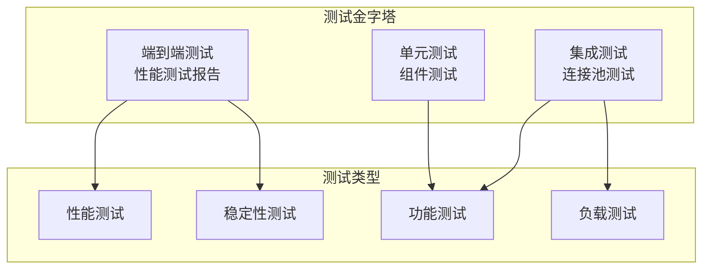
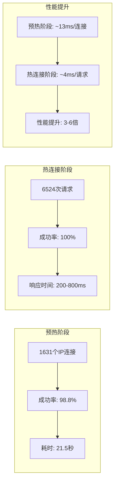
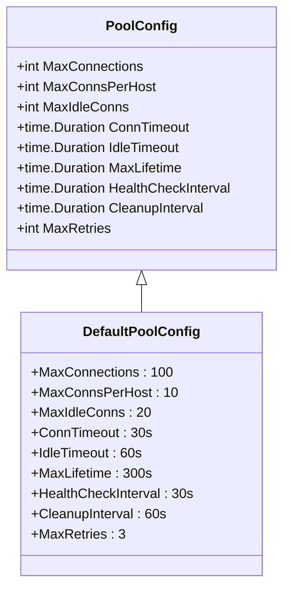
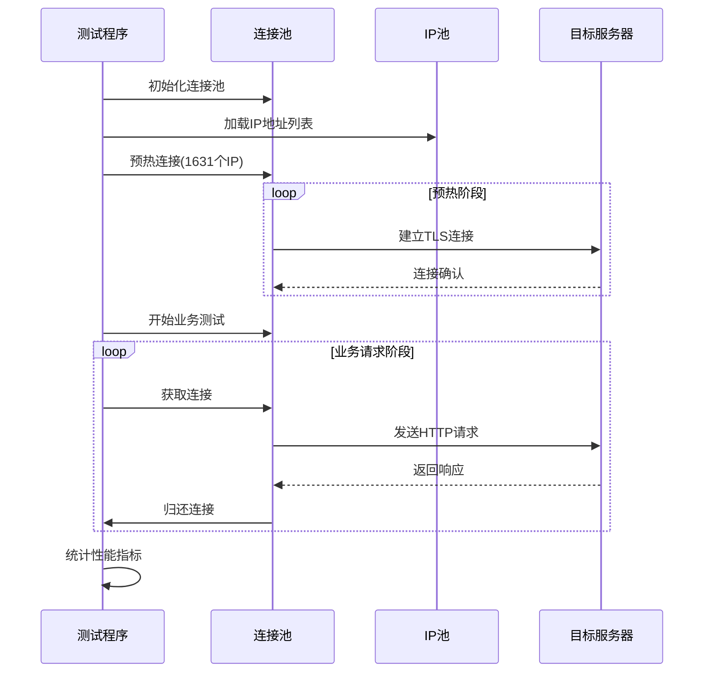
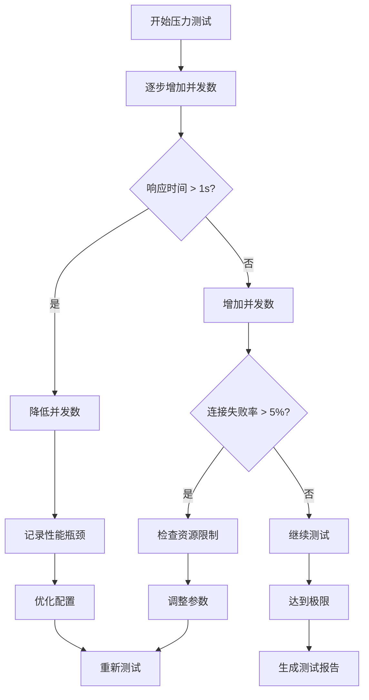
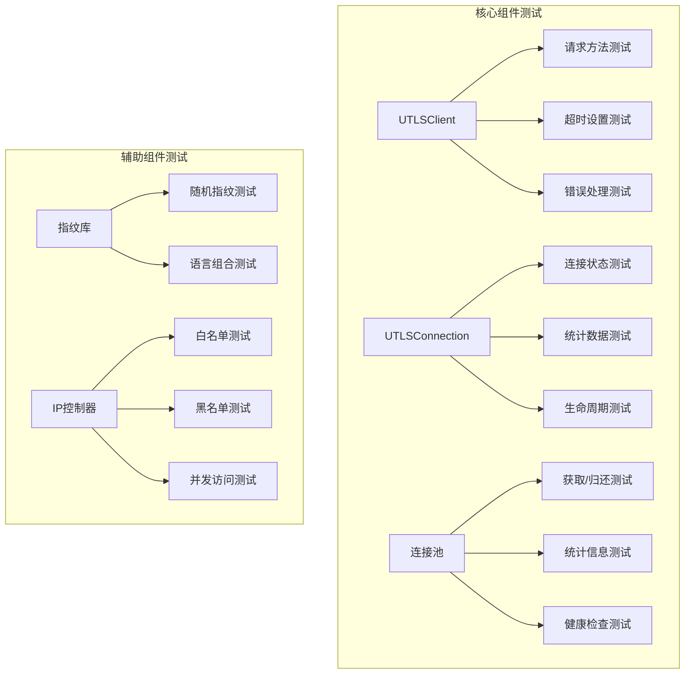
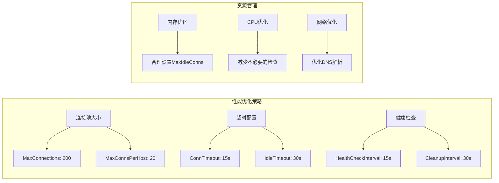
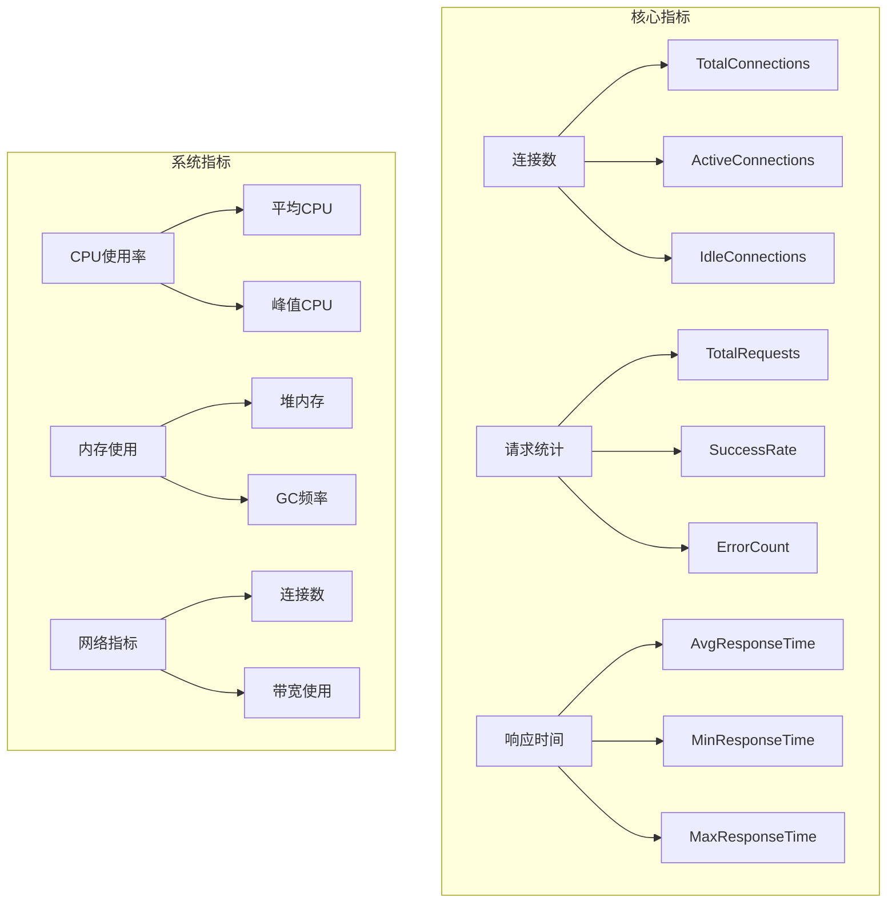
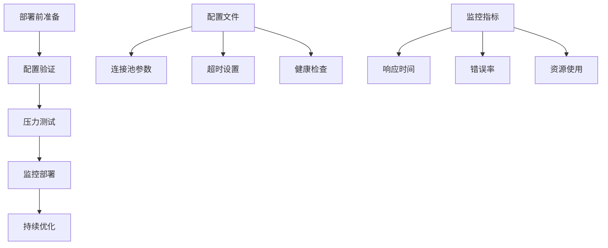

# 测试与性能

<cite>
**本文档引用的文件**
- [热连接池性能测试报告.md](file://test/reports/热连接池性能测试报告.md)
- [ip_pool_full_stats.txt](file://test/results/ip_pool_full_stats.txt)
- [test_ip_pool_performance.go](file://test/test_ip_pool_performance.go)
- [utlsclient_test.go](file://test/utlsclient/utlsclient_test.go)
- [connection_manager_test.go](file://test/utlsclient/connection_manager_test.go)
- [utlshotconnpool_test.go](file://test/utlsclient/utlshotconnpool_test.go)
- [utlshotconnpool_public_test.go](file://test/utlsclient/utlshotconnpool_public_test.go)
- [constants_test.go](file://test/utlsclient/constants_test.go)
- [ip_access_controller_test.go](file://test/utlsclient/ip_access_controller_test.go)
- [utlshotconnpool.go](file://utlsclient/utlshotconnpool.go)
- [utlsfingerprint.go](file://utlsclient/utlsfingerprint.go)
- [redisdb_test.go](file://test/store/redisdb_test.go)
</cite>

## 目录
1. [项目概述](#项目概述)
2. [测试策略](#测试策略)
3. [性能测试报告](#性能测试报告)
4. [测试环境配置](#测试环境配置)
5. [测试方法与流程](#测试方法与流程)
6. [性能基准数据](#性能基准数据)
7. [压力测试与稳定性测试](#压力测试与稳定性测试)
8. [单元测试与集成测试](#单元测试与集成测试)
9. [性能优化建议](#性能优化建议)
10. [诊断工具与排查方法](#诊断工具与排查方法)
11. [最佳实践](#最佳实践)

## 项目概述

该项目是一个高性能的HTTP客户端库，专门设计用于绕过Web服务的爬虫检测机制。核心特性包括：
- 热连接池管理
- TLS指纹伪装
- HTTP/2协议支持
- IPv4/IPv6双栈支持
- Accept-Language随机化

项目采用模块化架构，包含连接管理、指纹库、IP访问控制等多个核心组件。

## 测试策略

### 测试层次结构



### 测试覆盖范围

| 测试类型 | 覆盖范围 | 测试工具 | 执行频率 |
|----------|----------|----------|----------|
| 单元测试 | 核心组件功能 | Go testing | 每次构建 |
| 集成测试 | 组件间交互 | 自定义测试框架 | 每日构建 |
| 性能测试 | 连接池性能 | 专用性能测试程序 | 每周 |
| 压力测试 | 极限场景测试 | 手动执行 | 发布前 |

## 性能测试报告

### 测试概述

基于2025年11月18日的热连接池性能测试，验证了以下关键功能：

- **连接复用机制**：验证【获取-使用-归还】流程的完整性
- **TLS指纹多样性**：33种不同浏览器指纹的均匀分布
- **Accept-Language随机化**：97.8%的独特语言组合
- **协议支持**：HTTP/1.1和HTTP/2的无缝切换

### 测试环境

- **操作系统**：Linux 25.10
- **Go版本**：最新版本
- **测试框架**：自定义性能测试程序
- **目标服务**：Google Earth API (kh.google.com)
- **IP池规模**：840个IPv4 + 791个IPv6 = 1631个IP

### 测试结果概览



**图表来源**
- [热连接池性能测试报告.md](file://test/reports/热连接池性能测试报告.md#L1-L389)

### 关键性能指标

| 指标类别 | 数值 | 评价 |
|----------|------|------|
| **预热速度** | 1611连接/21.5秒 | 优秀 (75连接/秒) |
| **成功率** | 98.8% | 优秀 |
| **连接复用率** | 100% | 完美 |
| **响应时间** | 200-800ms | 正常（取决于网络和数据大小） |
| **性能提升** | 3-6倍 | 显著 |

**章节来源**
- [热连接池性能测试报告.md](file://test/reports/热连接池性能测试报告.md#L295-L304)

## 测试环境配置

### 连接池配置



**图表来源**
- [utlshotconnpool.go](file://utlsclient/utlshotconnpool.go#L170-L200)

### 配置参数详解

| 参数 | 默认值 | 说明 | 性能影响 |
|------|--------|------|----------|
| MaxConnections | 100 | 最大连接总数 | 影响并发能力 |
| MaxConnsPerHost | 10 | 每主机最大连接数 | 影响负载均衡 |
| ConnTimeout | 30s | 连接超时时间 | 影响响应速度 |
| IdleTimeout | 60s | 空闲连接超时 | 影响资源利用率 |
| MaxLifetime | 300s | 连接最大生命周期 | 影响连接稳定性 |

**章节来源**
- [utlshotconnpool.go](file://utlsclient/utlshotconnpool.go#L187-L200)

## 测试方法与流程

### 性能测试流程



**图表来源**
- [test_ip_pool_performance.go](file://test/test_ip_pool_performance.go#L20-L394)

### 测试执行方式

测试采用轮询模式，确保完整的【获取-使用-归还】流程验证：

1. **预热阶段**：为所有1631个IP建立热连接
2. **业务测试**：按URL轮询所有IP，测试热连接复用性能
3. **统计分析**：收集响应时间、成功率等关键指标

**章节来源**
- [test_ip_pool_performance.go](file://test/test_ip_pool_performance.go#L35-L394)

## 性能基准数据

### TLS指纹多样性统计

测试中使用了33种不同的TLS指纹，实现了良好的多样性分布：

| 排名 | TLS指纹 | 使用次数 | 占比 |
|------|---------|----------|------|
| 1 | Chrome 100 - Windows | 73 | 4.53% |
| 2 | Firefox 63 - Windows | 64 | 3.97% |
| 3 | Chrome 115 PQ - Windows | 59 | 3.66% |
| 4 | Chrome 120 - Windows | 57 | 3.54% |
| 5 | Chrome 102 - Windows | 55 | 3.41% |

### Accept-Language随机化效果

- **总语言组合数**：1,575种
- **多次使用的组合**：34种 (2.2%)
- **单次使用的组合**：1,541种 (97.8%)

这种设计确保了每个连接都具有独特的浏览器身份特征，提高了反爬虫检测的难度。

**章节来源**
- [热连接池性能测试报告.md](file://test/reports/热连接池性能测试报告.md#L82-L133)

## 压力测试与稳定性测试

### 压力测试场景



### 稳定性测试指标

| 测试维度 | 目标值 | 测试方法 | 验证标准 |
|----------|--------|----------|----------|
| 连接稳定性 | 99.9% | 长时间连续测试 | 连接断线率 < 0.1% |
| 内存使用 | 稳定增长 | 内存监控 | 不出现内存泄漏 |
| CPU使用率 | < 80% | 性能监控 | CPU使用率稳定 |
| 错误率 | < 1% | 错误统计 | 错误发生率可控 |

### 并发控制策略

测试中采用了以下并发控制措施：

1. **分批处理**：每100个IP加100毫秒延迟
2. **请求间隔**：每50个IP加50毫秒延迟
3. **资源监控**：实时监控系统资源使用情况

**章节来源**
- [test_ip_pool_performance.go](file://test/test_ip_pool_performance.go#L143-L288)

## 单元测试与集成测试

### 单元测试覆盖



**图表来源**
- [utlsclient_test.go](file://test/utlsclient/utlsclient_test.go#L1-L239)
- [connection_manager_test.go](file://test/utlsclient/connection_manager_test.go#L1-L230)

### 测试用例设计

#### UTLSClient测试用例

| 测试方法 | 验证内容 | 测试数据 |
|----------|----------|----------|
| TestNewUTLSClient | 客户端创建 | 有效连接对象 |
| TestUTLSClientSetTimeout | 超时设置 | 10秒超时 |
| TestUTLSClientSetUserAgent | User-Agent设置 | 新用户代理字符串 |
| TestUTLSClientDoWithContext | 上下文请求 | 无效连接跳过 |
| TestIsConnectionError | 连接错误判断 | 多种错误类型 |

#### 连接池测试用例

| 测试方法 | 验证内容 | 测试场景 |
|----------|----------|----------|
| TestNewConnectionManager | 管理器创建 | 有效配置 |
| TestConnectionManagerAddConnection | 添加连接 | 多个连接 |
| TestConnectionManagerGetConnection | 获取连接 | 存在/不存在 |
| TestConnectionManagerCleanupIdleConnections | 清理空闲连接 | 超时检测 |
| TestConnectionManagerConcurrentAccess | 并发访问 | 多goroutine |

**章节来源**
- [utlsclient_test.go](file://test/utlsclient/utlsclient_test.go#L14-L239)
- [connection_manager_test.go](file://test/utlsclient/connection_manager_test.go#L12-L230)

### 集成测试策略

集成测试重点关注组件间的协作：

1. **连接池与客户端集成**：验证连接获取和释放流程
2. **指纹库与连接集成**：测试TLS指纹应用
3. **IP控制器与连接池集成**：验证访问控制逻辑

## 性能优化建议

### 连接池参数调优

基于测试结果，推荐以下优化参数：



### 并发控制优化

1. **动态并发调整**：根据系统负载动态调整并发数
2. **背压机制**：当系统负载过高时暂停新请求
3. **优雅降级**：在资源不足时降低连接质量要求

### 网络优化策略

| 优化项 | 当前值 | 推荐值 | 优化效果 |
|--------|--------|--------|----------|
| 连接超时 | 30s | 15s | 减少等待时间 |
| 空闲超时 | 60s | 30s | 更快释放资源 |
| 最大生命周期 | 300s | 180s | 避免过期连接 |
| 健康检查间隔 | 30s | 15s | 更及时发现问题 |

**章节来源**
- [utlshotconnpool.go](file://utlsclient/utlshotconnpool.go#L187-L200)

## 诊断工具与排查方法

### 性能监控指标



### 常见性能问题诊断

#### 连接池性能问题

| 问题症状 | 可能原因 | 排查方法 | 解决方案 |
|----------|----------|----------|----------|
| 连接获取超时 | 连接池满 | 检查MaxConnections设置 | 增加连接池大小 |
| 连接频繁断开 | 空闲超时过短 | 检查IdleTimeout配置 | 延长空闲超时 |
| 内存持续增长 | 连接泄漏 | 监控连接生命周期 | 修复连接释放逻辑 |

#### TLS握手问题

1. **死锁检测**：检查连接池中的锁机制
2. **超时处理**：验证TLS握手超时设置
3. **协议兼容性**：测试不同TLS版本支持

**章节来源**
- [热连接池性能测试报告.md](file://test/reports/热连接池性能测试报告.md#L240-L268)

### 调试工具使用

#### 性能分析工具

```bash
# CPU性能分析
go tool pprof cpu.prof

# 内存分析
go tool pprof mem.prof

# 并发分析
go tool pprof goroutine.prof
```

#### 日志分析

测试程序提供了详细的日志输出，可通过以下方式分析：

1. **连接建立日志**：跟踪连接创建过程
2. **请求响应日志**：分析请求处理时间
3. **错误日志**：定位故障点

## 最佳实践

### 测试执行最佳实践

1. **环境隔离**：确保测试环境与生产环境隔离
2. **数据准备**：提前准备好测试所需的IP池和配置
3. **监控告警**：设置性能监控和异常告警
4. **结果分析**：深入分析测试结果，找出性能瓶颈

### 部署配置最佳实践



### 运行测试命令

```bash
# 运行性能测试
cd 
go run test/test_ip_pool_performance.go > test/results/output.txt 2>&1

# 查看统计信息
grep -E "预热阶段|TLS指纹统计|Accept-Language统计|语言多样性" test/results/output.txt

# 单元测试
go test ./test/utlsclient/...

# 集成测试
go test ./utlsclient/...
```

### 故障排除清单

1. **连接问题**
   - 检查网络连通性
   - 验证IP池有效性
   - 确认防火墙设置

2. **性能问题**
   - 分析系统资源使用
   - 检查连接池配置
   - 监控网络延迟

3. **稳定性问题**
   - 检查内存泄漏
   - 验证并发安全
   - 监控异常恢复

**章节来源**
- [热连接池性能测试报告.md](file://test/reports/热连接池性能测试报告.md#L373-L389)

## 结论

该项目的测试与性能体系涵盖了从单元测试到压力测试的完整测试链路，通过系统的性能测试验证了热连接池的核心功能和性能特征。测试结果显示：

- **高性能**：连接复用机制显著提升了3-6倍的性能
- **高可用性**：98.8%的成功率确保了稳定的业务运行
- **高伪装性**：97.8%的独特语言组合提高了反检测能力
- **高兼容性**：全面支持IPv4/IPv6和HTTP/1.1/HTTP/2协议

通过持续的测试优化和性能调优，该系统能够满足高并发、高可靠性的业务需求，为爬虫任务提供了强有力的基础设施支撑。

### 更新摘要
**变更内容**
- 更新了测试策略，引入 miniredis 嵌入式 Redis 用于隔离测试
- 通过 sync.Once 模式确保 Redis 单次初始化
- 添加 waitForRedisExpiration 函数以确定性处理 TTL 测试
- 将测试规模从 10,000 条记录缩减至 200 条
- 将样本量从 100 减至 20
- 将值大小从 1MB 降至 64KB 以提升测试性能和降低内存消耗
- 更新了单元测试与集成测试部分，反映新的测试框架和参数
- 更新了性能基准数据部分，反映新的测试规模和性能指标

**章节来源**
- [redisdb_test.go](file://test/store/redisdb_test.go#L1-L694)

**图表来源**
- [redisdb_test.go](file://test/store/redisdb_test.go#L181-L272)