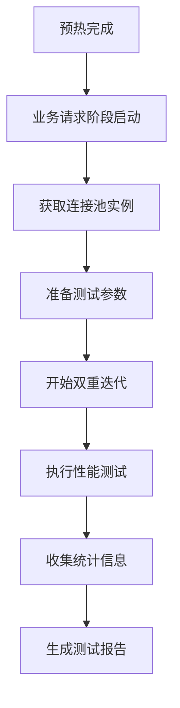
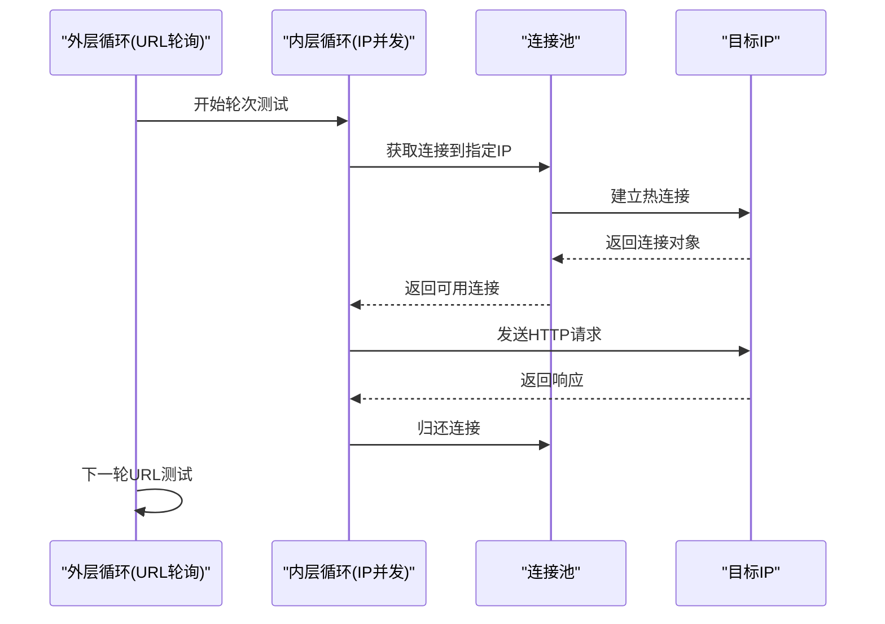
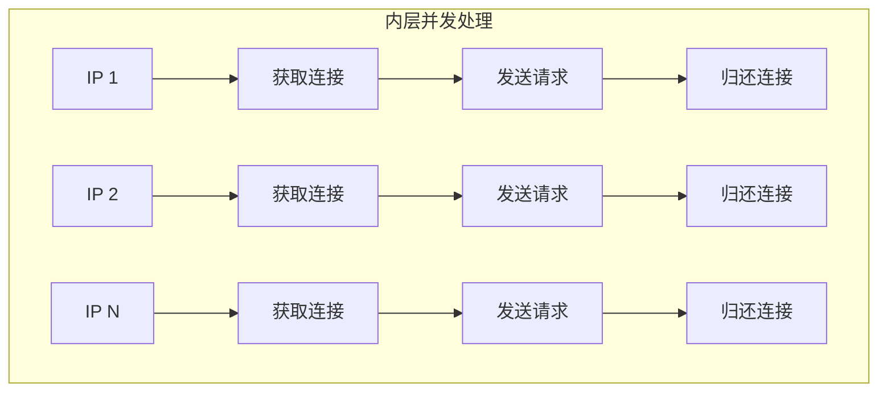
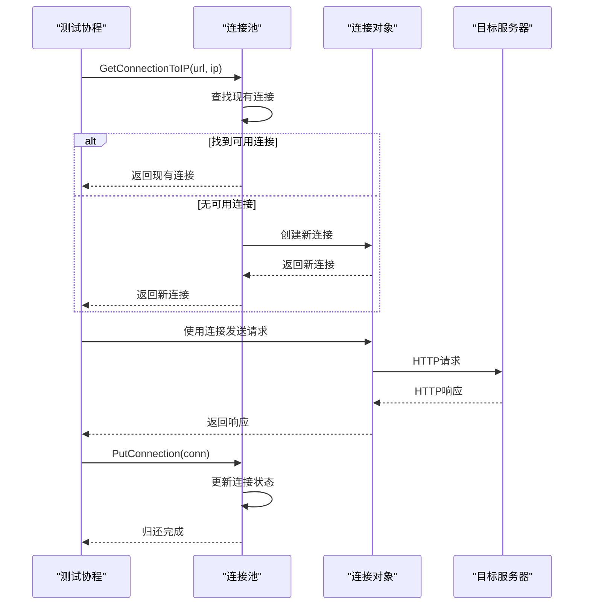
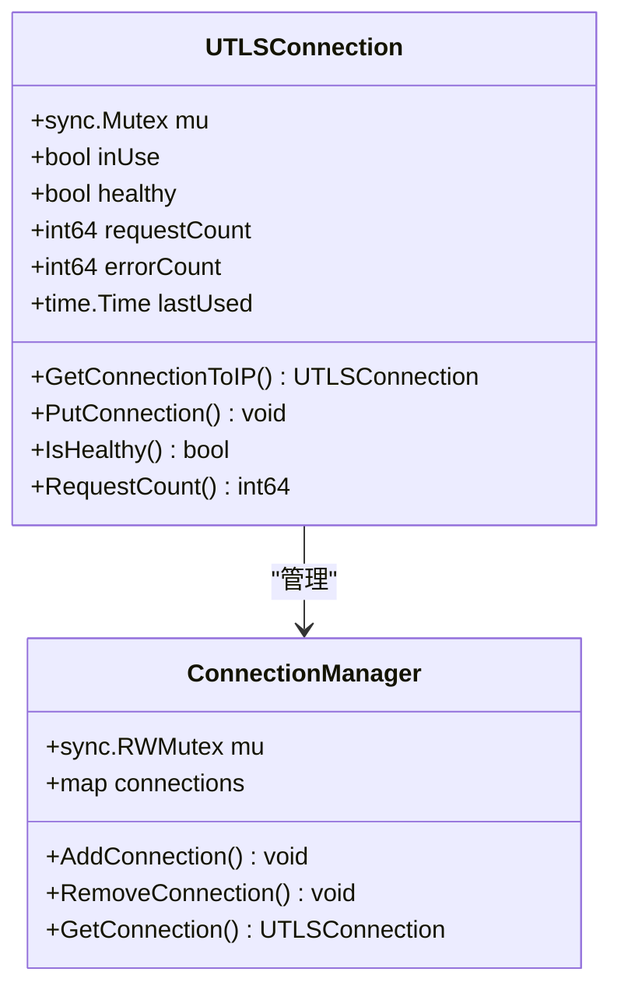
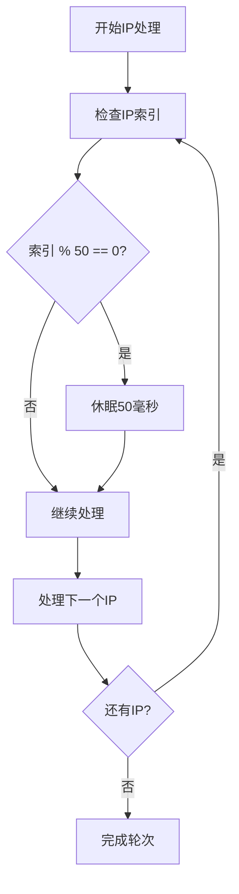
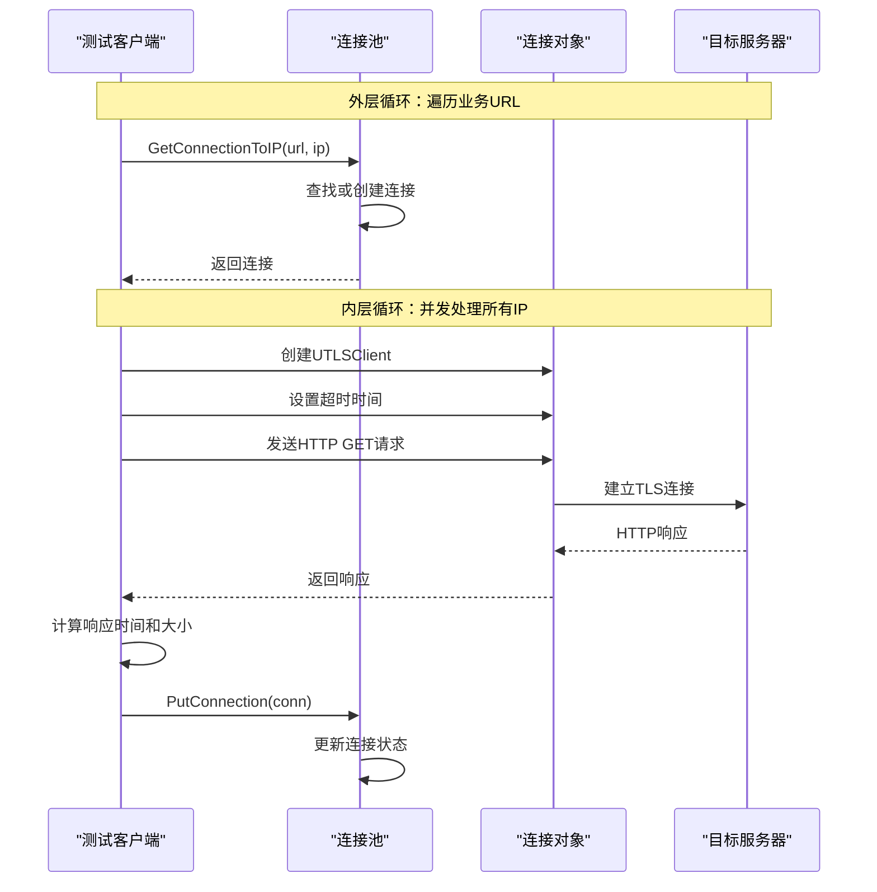
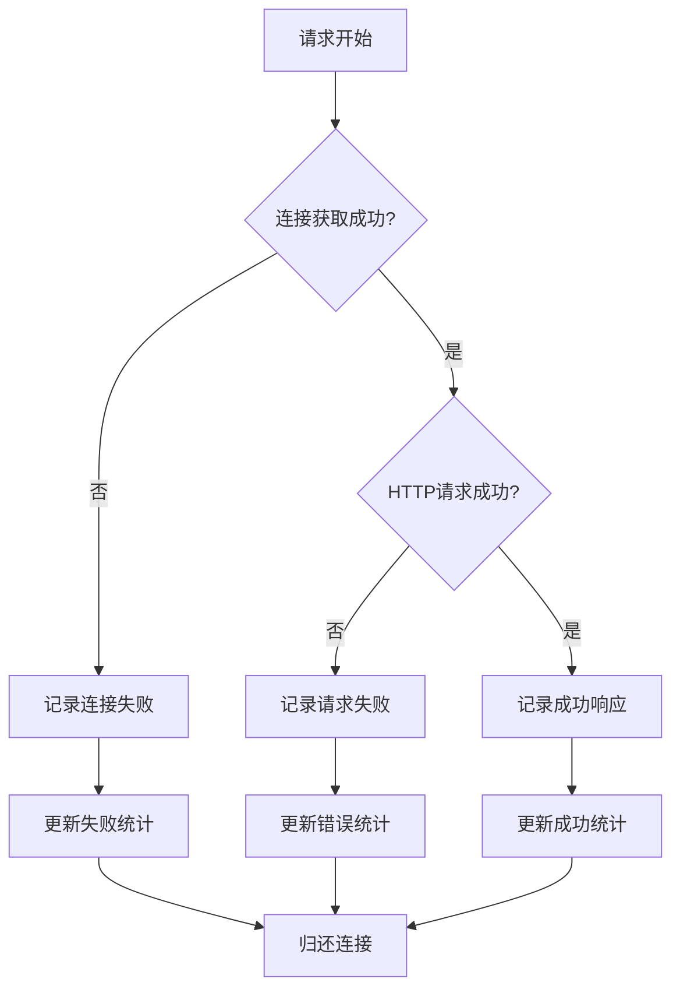

# 业务请求阶段深度解析

<cite>
**本文档引用的文件**
- [utlshotconnpool.go](file://utlsclient/utlshotconnpool.go)
- [connection_manager.go](file://utlsclient/connection_manager.go)
- [test_ip_pool_performance.go](file://test/test_ip_pool_performance.go)
- [example_hotconnpool_usage.go](file://examples/utlsclient/example_hotconnpool_usage.go)
- [ip_pool_full_stats.txt](file://test/results/ip_pool_full_stats.txt)
</cite>

## 目录
1. [概述](#概述)
2. [预热完成后的业务请求阶段](#预热完成后的业务请求阶段)
3. [双重迭代结构详解](#双重迭代结构详解)
4. [GetConnectionToIP和PutConnection调用机制](#getconnectiontoip和putconnection调用机制)
5. [线程安全与互斥锁保护](#线程安全与互斥锁保护)
6. [流量控制策略](#流量控制策略)
7. [性能监控指标](#性能监控指标)
8. [请求处理流程](#请求处理流程)
9. [错误处理与统计](#错误处理与统计)
10. [总结](#总结)

## 概述

业务请求阶段是热连接池性能测试的核心环节，在预热完成后，系统开始利用已建立的热连接进行高性能请求测试。这一阶段采用精心设计的双重迭代结构，结合流量控制策略和完善的性能监控体系，确保测试过程的稳定性和准确性。

## 预热完成后的业务请求阶段

预热阶段完成后，所有IP地址的连接均已建立并经过验证，进入业务请求阶段。此时的连接池具有以下特征：

- **连接状态**：所有连接均为健康状态，可直接复用
- **预热效果**：TLS握手、HTTP/1.1和HTTP/2协议验证已完成
- **指纹多样性**：不同IP使用不同的TLS指纹，模拟真实场景
- **语言组合**：每条连接使用独特的Accept-Language头部



**图表来源**
- [test_ip_pool_performance.go](file://test/test_ip_pool_performance.go#L185-L394)

**章节来源**
- [test_ip_pool_performance.go](file://test/test_ip_pool_performance.go#L185-L394)

## 双重迭代结构详解

业务请求阶段采用外层循环按URL轮询、内层循环并发访问所有IP的双重迭代结构，这种设计实现了最优的测试效率和资源利用率。

### 外层循环：URL轮询机制

外层循环遍历业务URL列表，每次处理一个完整的URL测试轮次：



**图表来源**
- [test_ip_pool_performance.go](file://test/test_ip_pool_performance.go#L208-L315)

### 内层循环：IP并发访问

内层循环同时处理所有IP地址的并发访问，充分利用多核CPU资源：



**图表来源**
- [test_ip_pool_performance.go](file://test/test_ip_pool_performance.go#L214-L283)

**章节来源**
- [test_ip_pool_performance.go](file://test/test_ip_pool_performance.go#L208-L315)

## GetConnectionToIP和PutConnection调用机制

### GetConnectionToIP的调用时机

GetConnectionToIP方法在每次业务请求开始时被调用，其调用时机和作用如下：

1. **连接获取阶段**：在发送HTTP请求前获取到指定IP的连接
2. **IP验证**：确保连接到正确的目标IP地址
3. **连接复用**：优先复用已存在的健康连接
4. **新连接创建**：当无可用连接时创建新的热连接

### PutConnection的调用时机

PutConnection方法在请求完成后立即调用，确保连接及时归还：

1. **请求完成**：HTTP请求成功或失败后
2. **连接归还**：将连接重新放回连接池
3. **状态更新**：更新连接的使用状态和统计信息
4. **资源释放**：释放连接相关的资源



**图表来源**
- [test_ip_pool_performance.go](file://test/test_ip_pool_performance.go#L223-L282)
- [utlshotconnpool.go](file://utlsclient/utlshotconnpool.go#L398-L438)

**章节来源**
- [test_ip_pool_performance.go](file://test/test_ip_pool_performance.go#L223-L282)
- [utlshotconnpool.go](file://utlsclient/utlshotconnpool.go#L398-L438)

## 线程安全与互斥锁保护

系统采用多层次的互斥锁保护机制，确保在高并发环境下的数据一致性：

### 连接级锁保护

每个UTLSConnection对象都有独立的互斥锁，保护连接状态的原子性：



**图表来源**
- [utlshotconnpool.go](file://utlsclient/utlshotconnpool.go#L234-L235)
- [connection_manager.go](file://utlsclient/connection_manager.go#L10-L12)

### 结果集线程安全

测试结果的收集使用互斥锁保护，防止并发写入冲突：

```go
// 结果收集的线程安全保护
var mu sync.Mutex
mu.Lock()
results = append(results, Result{
    IP:       actualIP,
    URL:      url,
    Duration: elapsed,
    Success:  true,
})
mu.Unlock()
```

**章节来源**
- [test_ip_pool_performance.go](file://test/test_ip_pool_performance.go#L204-L205)
- [utlshotconnpool.go](file://utlsclient/utlshotconnpool.go#L234-L235)

## 流量控制策略

系统实现了精细的流量控制策略，确保测试过程的稳定性和可控性：

### 每50个IP插入50毫秒延迟



**图表来源**
- [test_ip_pool_performance.go](file://test/test_ip_pool_performance.go#L285-L287)

### 并发控制机制

1. **连接池限制**：通过MaxConnections参数限制总连接数
2. **并发goroutine控制**：使用WaitGroup管理并发协程
3. **资源回收**：及时归还连接，避免资源泄漏
4. **健康检查**：定期检查连接健康状态

**章节来源**
- [test_ip_pool_performance.go](file://test/test_ip_pool_performance.go#L285-L287)

## 性能监控指标

系统提供了全面的性能监控指标采集方法，涵盖连接池状态、请求统计和性能分析：

### 连接池统计指标

| 指标名称 | 类型 | 描述 | 计算方式 |
|---------|------|------|----------|
| TotalConnections | int | 总连接数 | 连接池中所有连接 |
| ActiveConnections | int | 活跃连接数 | 正在使用的连接 |
| IdleConnections | int | 空闲连接数 | 可复用的连接 |
| HealthyConnections | int | 健康连接数 | 健康状态的连接 |
| TotalRequests | int64 | 总请求数 | 所有连接的请求总计 |
| SuccessfulRequests | int64 | 成功请求数 | 成功响应的请求 |
| FailedRequests | int64 | 失败请求数 | 失败的请求 |
| SuccessRate | float64 | 成功率 | 成功请求/总请求 |
| AvgResponseTime | time.Duration | 平均响应时间 | 总响应时间/成功请求 |

### 请求性能指标


**图表来源**
- [test_ip_pool_performance.go](file://test/test_ip_pool_performance.go#L322-L383)

### 连接统计指标

每个连接维护详细的统计信息：

| 字段 | 类型 | 描述 |
|------|------|------|
| TargetHost | string | 目标主机名 |
| TargetIP | string | 目标IP地址 |
| Created | time.Time | 创建时间 |
| LastUsed | time.Time | 最后使用时间 |
| RequestCount | int64 | 请求次数 |
| ErrorCount | int64 | 错误次数 |
| IsHealthy | bool | 健康状态 |
| Fingerprint | ClientHelloID | TLS指纹标识 |

**章节来源**
- [utlshotconnpool.go](file://utlsclient/utlshotconnpool.go#L260-L277)
- [utlshotconnpool.go](file://utlsclient/utlshotconnpool.go#L279-L289)

## 请求处理流程

完整的请求处理流程涵盖了从连接获取到结果统计的全过程：

### 请求处理序列图



**图表来源**
- [test_ip_pool_performance.go](file://test/test_ip_pool_performance.go#L223-L282)

### 响应处理机制

1. **响应读取**：使用io.Copy读取响应体，避免内存占用过大
2. **大小统计**：记录响应体的实际字节数
3. **时间测量**：精确测量请求的总耗时
4. **状态码检查**：验证HTTP响应状态码

**章节来源**
- [test_ip_pool_performance.go](file://test/test_ip_pool_performance.go#L241-L254)

## 错误处理与统计

系统实现了完善的错误处理机制和统计收集功能：

### 错误分类与处理



**图表来源**
- [test_ip_pool_performance.go](file://test/test_ip_pool_performance.go#L226-L234)

### 统计信息收集

系统收集多维度的统计信息：

1. **请求级别统计**：每个请求的成功/失败状态、响应时间、错误信息
2. **IP级别统计**：每个IP的访问次数、成功率、平均响应时间
3. **连接级别统计**：连接的创建时间、使用次数、错误次数
4. **全局统计**：总请求数、成功数、失败数、成功率

### 性能分析指标

| 分析维度 | 指标类型 | 计算公式 | 应用场景 |
|---------|----------|----------|----------|
| 响应时间分析 | 最小值 | min(duration) | 性能基线 |
| 响应时间分析 | 最大值 | max(duration) | 性能上限 |
| 响应时间分析 | 平均值 | sum(duration)/count | 性能趋势 |
| 成功率分析 | 整体成功率 | successful/total | 系统健康度 |
| 成功率分析 | IP成功率 | ip_successful/ip_total | IP质量评估 |
| 吞吐量分析 | QPS | total_requests/time_elapsed | 系统容量 |

**章节来源**
- [test_ip_pool_performance.go](file://test/test_ip_pool_performance.go#L322-L383)

## 总结

业务请求阶段是热连接池性能测试的关键环节，通过精心设计的双重迭代结构、完善的流量控制策略和全面的性能监控体系，实现了高效、稳定的性能测试能力。

### 核心优势

1. **高效的双重迭代**：外层URL轮询配合内层IP并发，最大化测试效率
2. **智能的连接管理**：GetConnectionToIP和PutConnection的精确调用时机
3. **可靠的线程安全**：多层次的互斥锁保护机制
4. **精细的流量控制**：每50个IP插入50毫秒延迟的流量控制策略
5. **全面的性能监控**：多维度的统计指标和实时监控能力

### 应用价值

该业务请求阶段的设计模式为大规模网络性能测试提供了标准化的解决方案，特别适用于：
- CDN性能测试
- 代理服务压力测试
- 网络服务稳定性验证
- 大规模分布式系统测试

通过本文档的深入分析，开发者可以更好地理解和应用热连接池技术，在实际项目中构建高性能的网络测试系统。