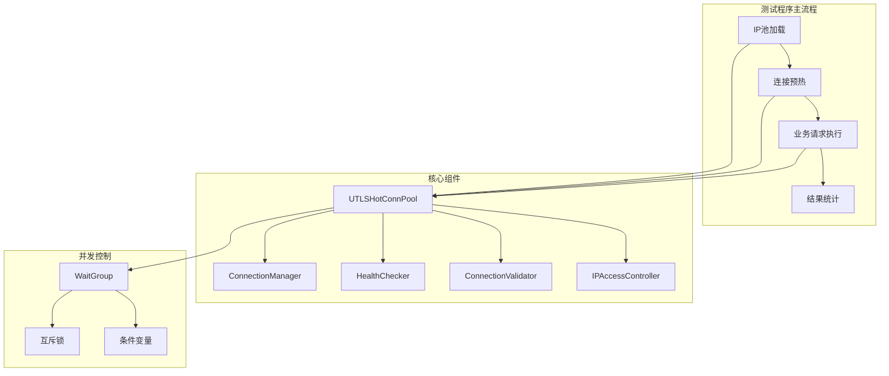
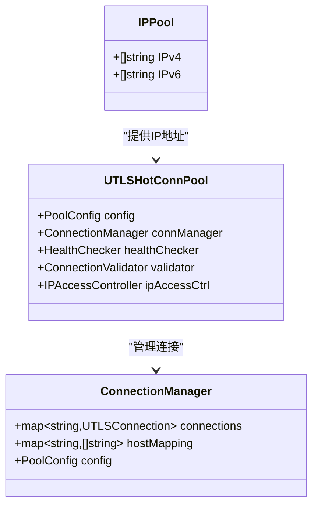
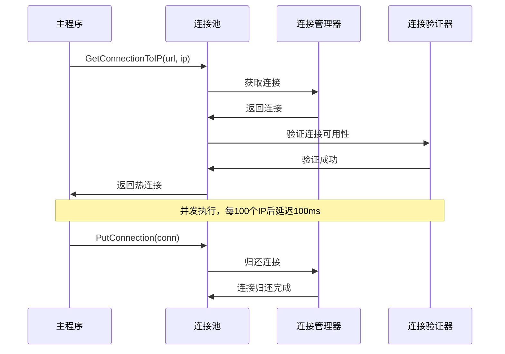
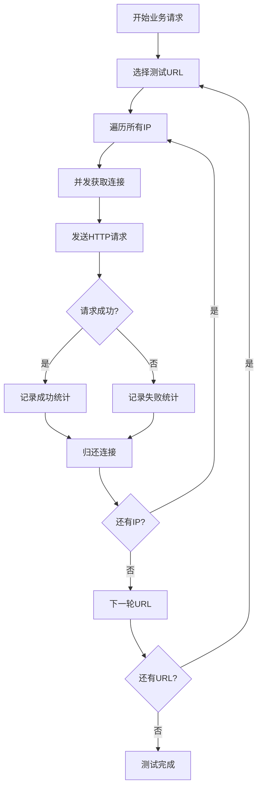
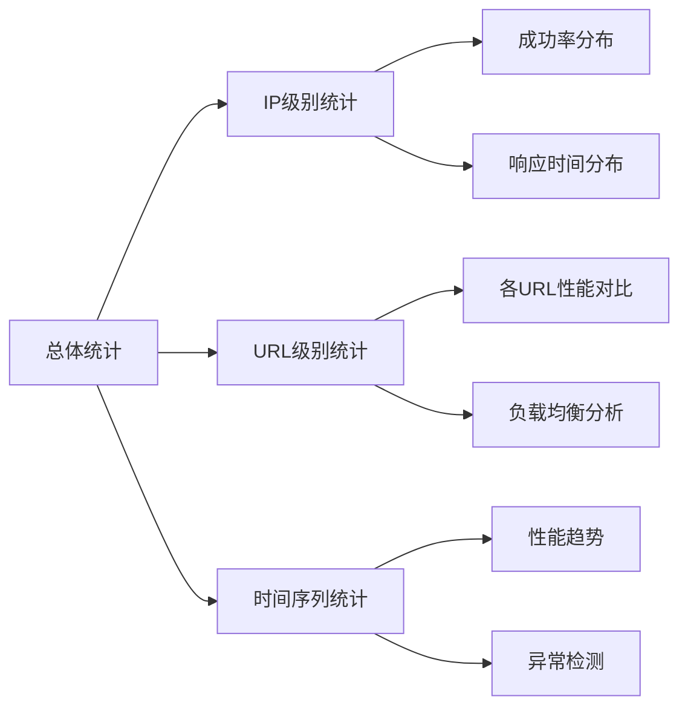
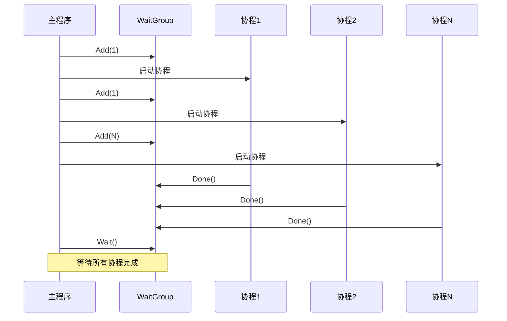
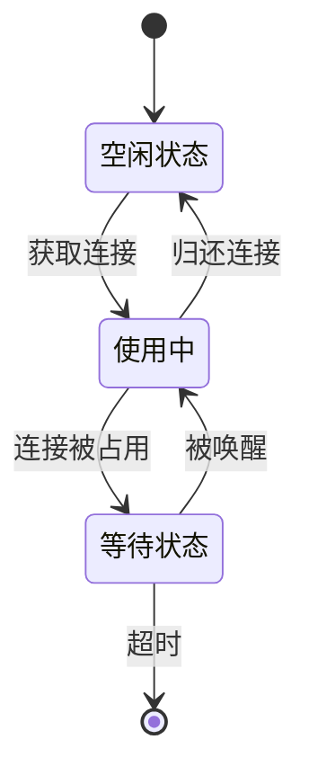
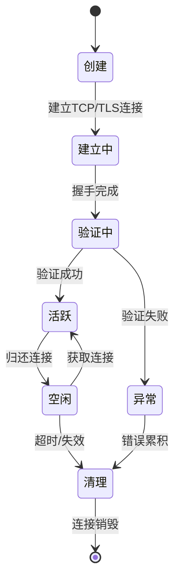
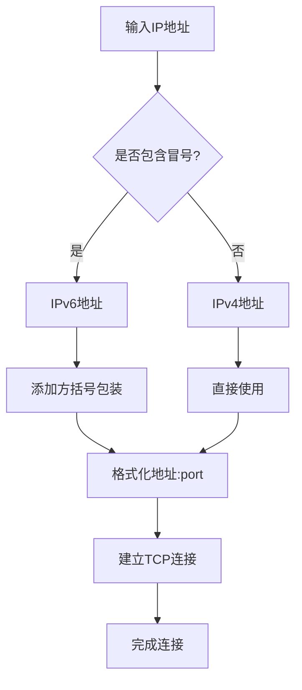
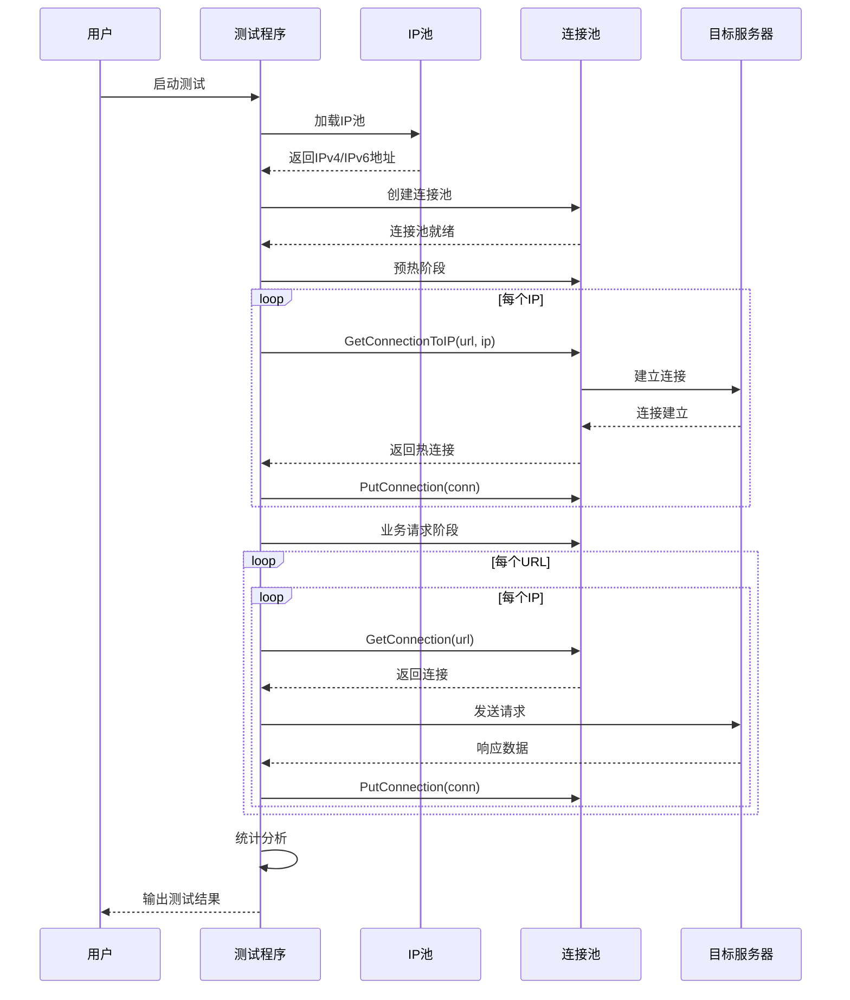

# 测试方法与流程

<cite>
**本文档引用的文件**
- [test_ip_pool_performance.go](file://test/test_ip_pool_performance.go)
- [utlshotconnpool.go](file://utlsclient/utlshotconnpool.go)
- [connection_manager.go](file://utlsclient/connection_manager.go)
- [utlshotconnpool_test.go](file://test/utlsclient/utlshotconnpool_test.go)
- [connection_manager_test.go](file://test/utlsclient/connection_manager_test.go)
- [ip_access_controller.go](file://utlsclient/ip_access_controller.go)
- [localippool.go](file://localippool/localippool.go)
- [main.go](file://cmd/utlsclient/main.go)
- [README.md](file://test/README.md)
</cite>

## 目录
1. [概述](#概述)
2. [测试程序架构](#测试程序架构)
3. [IP池加载机制](#ip池加载机制)
4. [连接预热阶段](#连接预热阶段)
5. [业务请求执行阶段](#业务请求执行阶段)
6. [结果统计与分析](#结果统计与分析)
7. [并发控制机制](#并发控制机制)
8. [连接池管理](#连接池管理)
9. [IPv4与IPv6统一处理](#ipv4与ipv6统一处理)
10. [测试流程时序图](#测试流程时序图)
11. [性能优化策略](#性能优化策略)

## 概述

本文档详细说明了爬虫平台的性能测试方法和实现流程。测试程序采用四阶段架构，通过IP池加载、连接预热、业务请求执行和结果统计四个核心阶段，全面评估热连接池的性能表现。

测试程序的核心目标包括：
- 验证热连接池的并发性能
- 分析TLS指纹多样性分布
- 测量Accept-Language随机化效果
- 评估连接复用效率
- 检查IPv4和IPv6地址的统一处理能力

## 测试程序架构

测试程序采用模块化设计，主要由以下核心组件构成：

**图表来源**
- [test_ip_pool_performance.go](file://test/test_ip_pool_performance.go#L21-L394)
- [utlshotconnpool.go](file://utlsclient/utlshotconnpool.go#L237-L318)

**章节来源**
- [test_ip_pool_performance.go](file://test/test_ip_pool_performance.go#L21-L394)
- [utlshotconnpool.go](file://utlsclient/utlshotconnpool.go#L237-L318)

## IP池加载机制

### IP池数据结构

测试程序使用统一的IP池数据结构来管理IPv4和IPv6地址：

**图表来源**
- [test_ip_pool_performance.go](file://test/test_ip_pool_performance.go#L16-L19)
- [utlshotconnpool.go](file://utlsclient/utlshotconnpool.go#L237-L258)
- [connection_manager.go](file://utlsclient/connection_manager.go#L8-L14)

### IP池加载流程

IP池加载过程包含以下关键步骤：

1. **文件读取与解析**：从JSON文件读取IP池数据
2. **地址分类**：将IPv4和IPv6地址分别存储
3. **统计分析**：计算各类地址的数量和比例
4. **预处理验证**：验证地址格式的有效性

**章节来源**
- [test_ip_pool_performance.go](file://test/test_ip_pool_performance.go#L35-L52)

## 连接预热阶段

### 预热目标

连接预热阶段的主要目标是为所有IP地址建立热连接，确保后续业务请求能够充分利用连接复用机制：

- 建立到每个IP的持久连接
- 收集TLS指纹和语言组合统计
- 验证连接的可用性和稳定性
- 为后续测试提供稳定的基线

### 预热执行流程

**图表来源**
- [test_ip_pool_performance.go](file://test/test_ip_pool_performance.go#L80-L141)
- [utlshotconnpool.go](file://utlsclient/utlshotconnpool.go#L398-L438)

### 并发控制策略

预热阶段采用分批并发控制策略：

- **批次大小**：每100个IP为一批
- **延迟间隔**：每批完成后等待100毫秒
- **并发限制**：避免瞬时高并发导致连接失败
- **资源保护**：使用互斥锁保护共享统计数据

**章节来源**
- [test_ip_pool_performance.go](file://test/test_ip_pool_performance.go#L143-L147)

### 统计信息收集

预热阶段收集以下统计信息：

- **TLS指纹分布**：记录每种TLS指纹的使用频率
- **语言组合统计**：分析Accept-Language的多样性
- **连接成功率**：统计预热阶段的成功率
- **性能指标**：记录连接建立时间和成功率

**章节来源**
- [test_ip_pool_performance.go](file://test/test_ip_pool_performance.go#L70-L80)

## 业务请求执行阶段

### 测试策略

业务请求阶段采用轮询测试策略，确保每个IP都能充分测试：

- **轮询访问**：按URL顺序轮询所有IP
- **并发执行**：每个URL的请求并发执行
- **连接复用**：充分利用预热阶段建立的热连接
- **性能监控**：实时监控请求响应时间和成功率

### 请求执行流程

**图表来源**
- [test_ip_pool_performance.go](file://test/test_ip_pool_performance.go#L185-L315)

### 并发控制机制

业务请求阶段采用更精细的并发控制：

- **内层并发**：每个URL的请求并发执行
- **外层轮次**：按URL顺序进行多轮测试
- **延迟控制**：每50个IP后等待50毫秒
- **资源同步**：使用WaitGroup确保所有请求完成

**章节来源**
- [test_ip_pool_performance.go](file://test/test_ip_pool_performance.go#L214-L288)

## 结果统计与分析

### 统计指标体系

测试程序收集全面的性能统计指标：

| 指标类别 | 具体指标 | 计算方式 |
|---------|---------|---------|
| 连接统计 | 总连接数、活跃连接数、空闲连接数 | 实时监控 |
| 请求统计 | 总请求数、成功数、失败数、成功率 | 累计计数 |
| 时间统计 | 平均响应时间、最快响应、最慢响应 | 时间测量 |
| 性能指标 | 连接复用率、吞吐量、并发度 | 比率计算 |

### 数据分析维度

**图表来源**
- [test_ip_pool_performance.go](file://test/test_ip_pool_performance.go#L318-L391)

**章节来源**
- [test_ip_pool_performance.go](file://test/test_ip_pool_performance.go#L318-L391)

## 并发控制机制

### WaitGroup同步机制

测试程序广泛使用WaitGroup实现并发协程的同步：

**图表来源**
- [test_ip_pool_performance.go](file://test/test_ip_pool_performance.go#L64-L148)
- [test_ip_pool_performance.go](file://test/test_ip_pool_performance.go#L214-L292)

### 互斥锁保护机制

测试程序使用多种互斥锁保护共享资源：

- **预热阶段锁**：保护连接统计和错误计数
- **业务请求锁**：保护结果数组和统计数据
- **连接池锁**：保护连接池状态和配置

**章节来源**
- [test_ip_pool_performance.go](file://test/test_ip_pool_performance.go#L68-L91)
- [test_ip_pool_performance.go](file://test/test_ip_pool_performance.go#L204-L235)

### 条件变量同步

连接池实现中使用条件变量实现高级同步：

**图表来源**
- [utlshotconnpool.go](file://utlsclient/utlshotconnpool.go#L1300-L1324)

**章节来源**
- [utlshotconnpool.go](file://utlsclient/utlshotconnpool.go#L1300-L1324)

## 连接池管理

### 连接生命周期管理

连接池采用精细化的生命周期管理模式：

**图表来源**
- [connection_manager.go](file://utlsclient/connection_manager.go#L26-L73)
- [utlshotconnpool.go](file://utlsclient/utlshotconnpool.go#L746-L791)

### 连接获取与归还验证

测试程序实现了严格的连接获取与归还验证机制：

- **GetConnectionToIP**：精确到指定IP的连接获取
- **PutConnection**：连接归还时的健康状态检查
- **连接验证**：归还前的连通性验证
- **资源清理**：失效连接的自动清理

**章节来源**
- [utlshotconnpool.go](file://utlsclient/utlshotconnpool.go#L398-L438)
- [utlshotconnpool.go](file://utlsclient/utlshotconnpool.go#L760-L784)

## IPv4与IPv6统一处理

### 地址格式处理

测试程序实现了IPv4和IPv6地址的统一处理：

**图表来源**
- [utlshotconnpool.go](file://utlsclient/utlshotconnpool.go#L563-L571)

### 地址池管理策略

- **混合存储**：IPv4和IPv6地址统一存储在IP池中
- **动态选择**：根据目标地址类型自动选择合适的地址
- **负载均衡**：在IPv4和IPv6之间实现负载均衡
- **故障转移**：IPv6不可用时自动降级到IPv4

**章节来源**
- [test_ip_pool_performance.go](file://test/test_ip_pool_performance.go#L47-L49)
- [localippool.go](file://localippool/localippool.go#L94-L161)

## 测试流程时序图

### 完整测试流程

**图表来源**
- [test_ip_pool_performance.go](file://test/test_ip_pool_performance.go#L21-L394)

### 关键代码片段分析

#### IP池加载与验证
测试程序首先加载IP池并进行基础验证：

**章节来源**
- [test_ip_pool_performance.go](file://test/test_ip_pool_performance.go#L35-L52)

#### 连接预热实现
预热阶段使用WaitGroup和互斥锁确保并发安全：

**章节来源**
- [test_ip_pool_performance.go](file://test/test_ip_pool_performance.go#L60-L148)

#### 业务请求执行
业务请求阶段实现轮询测试和并发控制：

**章节来源**
- [test_ip_pool_performance.go](file://test/test_ip_pool_performance.go#L185-L315)

## 性能优化策略

### 并发优化

测试程序采用多层次的并发优化策略：

- **分层并发**：预热阶段和业务请求阶段采用不同的并发策略
- **流量控制**：通过延迟机制避免瞬时高并发
- **资源隔离**：不同阶段使用独立的资源池
- **异步处理**：大量I/O操作采用异步处理模式

### 内存优化

- **连接复用**：最大化连接复用率减少内存分配
- **批量操作**：采用批量处理减少系统调用开销
- **及时清理**：定期清理无用连接释放内存
- **缓存策略**：合理使用缓存减少重复计算

### 网络优化

- **连接池化**：使用连接池减少TCP握手开销
- **HTTP/2支持**：利用HTTP/2的多路复用特性
- **TLS优化**：选择高效的TLS指纹配置
- **DNS缓存**：缓存DNS解析结果减少查询延迟

**章节来源**
- [test_ip_pool_performance.go](file://test/test_ip_pool_performance.go#L143-L147)
- [test_ip_pool_performance.go](file://test/test_ip_pool_performance.go#L285-L288)

## 总结

爬虫平台的性能测试方法通过精心设计的四阶段架构，实现了全面而深入的性能评估。测试程序不仅验证了热连接池的基本功能，还深入分析了TLS指纹多样性、语言组合随机化、连接复用效率等多个关键指标。

通过WaitGroup、互斥锁、条件变量等并发控制机制，测试程序确保了在高并发场景下的稳定性和可靠性。IPv4和IPv6的统一处理机制保证了跨协议的兼容性，而完善的统计分析体系为性能优化提供了有力支撑。

这套测试方法为爬虫平台的性能调优和故障排查提供了重要参考，是构建高性能网络应用的重要工具。