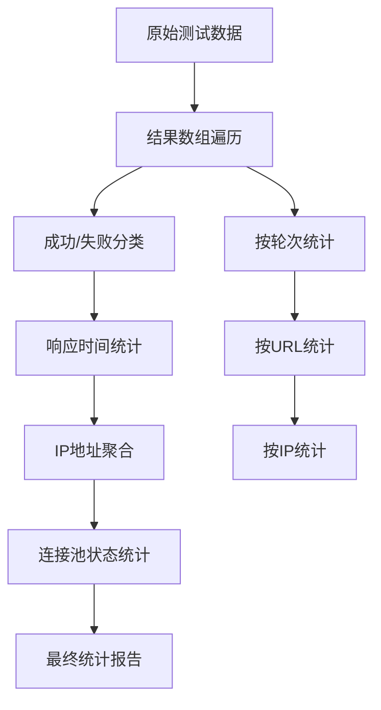
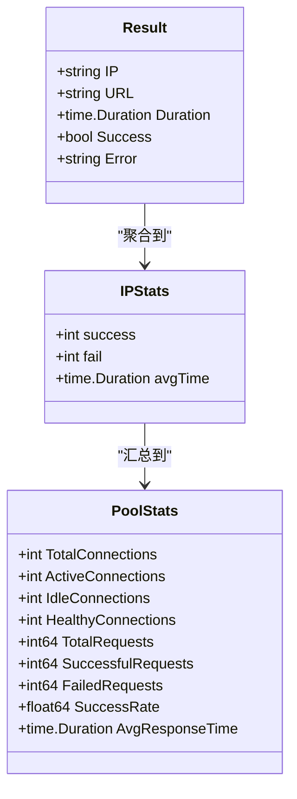
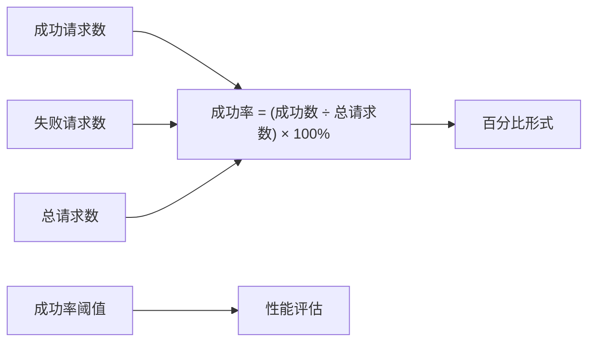
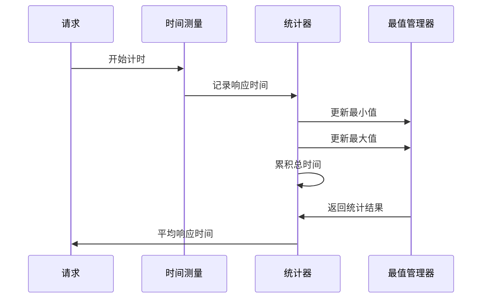
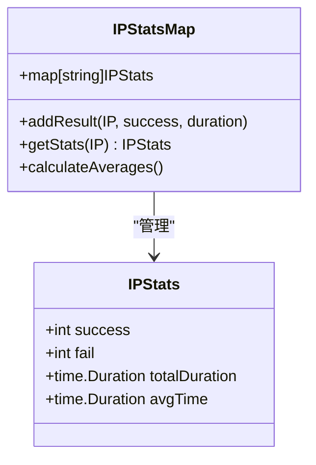
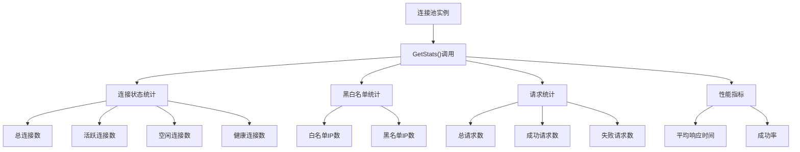
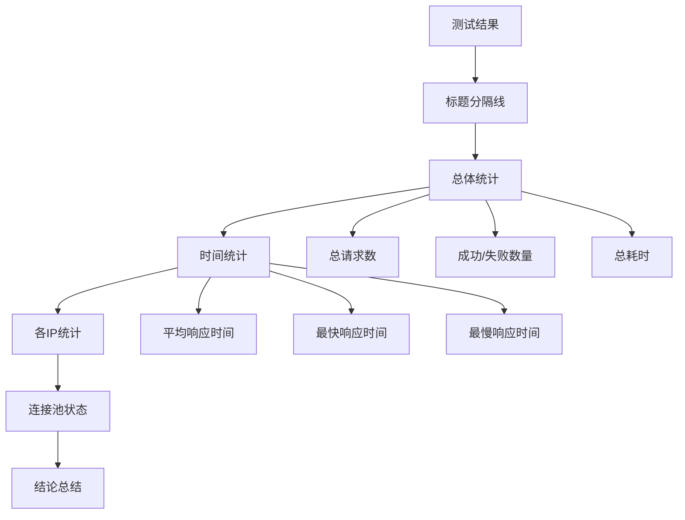

# 结果统计阶段

<cite>
**本文档引用的文件**
- [test_ip_pool_performance.go](file://test/test_ip_pool_performance.go)
- [utlshotconnpool.go](file://utlsclient/utlshotconnpool.go)
- [ip_pool_full_stats.txt](file://test/results/ip_pool_full_stats.txt)
- [ip_pool_test_by_url.txt](file://test/results/archive/ip_pool_test_by_url.txt)
- [ip_performance_result.txt](file://test/results/archive/ip_performance_result.txt)
- [demo_result.txt](file://test/results/archive/demo_result.txt)
- [debug_output.txt](file://test/results/archive/debug_output.txt)
- [ip_test_results.txt](file://test/results/archive/ip_test_results.txt)
- [热连接池性能测试报告.md](file://test/reports/热连接池性能测试报告.md)
</cite>

## 目录
1. [概述](#概述)
2. [测试结果遍历与统计](#测试结果遍历与统计)
3. [关键指标计算](#关键指标计算)
4. [响应时间统计方法](#响应时间统计方法)
5. [IP地址聚合统计](#ip地址聚合统计)
6. [连接池最终状态获取](#连接池最终状态获取)
7. [结果输出格式化](#结果输出格式化)
8. [性能评估建议](#性能评估建议)
9. [总结](#总结)

## 概述

测试结果统计阶段是整个测试流程中的关键环节，负责对测试过程中收集的所有数据进行汇总、分析和呈现。该阶段通过系统化的统计方法，计算总体成功率、失败率、响应时间等关键指标，并为每个IP地址生成独立的统计信息，最终形成清晰易读的测试报告。

## 测试结果遍历与统计

### 数据收集架构

测试结果统计采用分层遍历的方法，首先收集原始测试数据，然后进行多维度统计分析。

**图表来源**
- [test_ip_pool_performance.go](file://test/test_ip_pool_performance.go#L195-L201)
- [test_ip_pool_performance.go](file://test/test_ip_pool_performance.go#L318-L393)

### 结果数据结构

测试结果采用统一的数据结构进行存储和处理：

**图表来源**
- [test_ip_pool_performance.go](file://test/test_ip_pool_performance.go#L195-L201)
- [utlshotconnpool.go](file://utlsclient/utlshotconnpool.go#L260-L276)

**章节来源**
- [test_ip_pool_performance.go](file://test/test_ip_pool_performance.go#L195-L393)

## 关键指标计算

### 总体成功率计算

成功率是衡量测试效果的核心指标，通过以下公式计算：

**图表来源**
- [test_ip_pool_performance.go](file://test/test_ip_pool_performance.go#L322-L324)
- [test_ip_pool_performance.go](file://test/test_ip_pool_performance.go#L358-L362)

### 失败率与总执行耗时

失败率计算采用互补方法，确保统计数据的准确性：

| 指标类型 | 计算公式 | 应用场景 |
|----------|----------|----------|
| 失败率 | `(失败数 ÷ 总请求数) × 100%` | 故障分析 |
| 总耗时 | `结束时间 - 开始时间` | 性能评估 |
| 并发效率 | `总请求数 ÷ 总耗时` | 吞吐量分析 |

**章节来源**
- [test_ip_pool_performance.go](file://test/test_ip_pool_performance.go#L322-L362)

## 响应时间统计方法

### 最小值、最大值和平均值计算

响应时间统计采用三值统计法，提供完整的性能分布视图：

**图表来源**
- [test_ip_pool_performance.go](file://test/test_ip_pool_performance.go#L325-L344)

### 响应时间精度处理

响应时间采用毫秒级精度，确保统计结果的实用性：

| 时间单位 | 精度范围 | 应用场景 |
|----------|----------|----------|
| 毫秒(ms) | 1-999ms | 正常响应时间 |
| 秒(s) | 1-59s | 中等延迟请求 |
| 分钟(m) | 1-59m | 长时间请求 |

**章节来源**
- [test_ip_pool_performance.go](file://test/test_ip_pool_performance.go#L364-L369)

## IP地址聚合统计

### 数据结构设计

IP地址聚合采用Go语言的map[string]struct{}结构，实现高效的数据存储和快速查找：

**图表来源**
- [test_ip_pool_performance.go](file://test/test_ip_pool_performance.go#L328-L355)

### 统计信息生成

每个IP地址生成独立的统计报告，包含以下信息：

| 统计项目 | 数据类型 | 计算方法 |
|----------|----------|----------|
| 成功次数 | int | 累计成功请求 |
| 失败次数 | int | 累计失败请求 |
| 平均响应时间 | time.Duration | `总响应时间 ÷ 成功次数` |
| 成功率 | float64 | `(成功次数 ÷ 总次数) × 100%` |

**章节来源**
- [test_ip_pool_performance.go](file://test/test_ip_pool_performance.go#L372-L383)

## 连接池最终状态获取

### 运行时指标统计

连接池状态通过GetStats()方法获取，提供实时的运行时指标：

**图表来源**
- [utlshotconnpool.go](file://utlsclient/utlshotconnpool.go#L1122-L1173)

### 连接池状态指标

连接池状态包含以下关键指标：

| 指标名称 | 描述 | 获取方法 |
|----------|------|----------|
| 总连接数 | 当前连接池中的总连接数量 | `stats.TotalConnections` |
| 白名单IP数 | 已验证可用的IP地址数量 | `stats.WhitelistIPs` |
| 总请求数 | 连接池累计处理的请求数量 | `stats.TotalRequests` |
| 成功率 | 连接池的整体成功率 | `stats.SuccessRate` |

**章节来源**
- [test_ip_pool_performance.go](file://test/test_ip_pool_performance.go#L385-L391)
- [utlshotconnpool.go](file://utlsclient/utlshotconnpool.go#L1122-L1173)

## 结果输出格式化

### 格式化策略

测试结果采用层次化的输出格式，确保信息的清晰性和可读性：

**图表来源**
- [test_ip_pool_performance.go](file://test/test_ip_pool_performance.go#L358-L393)

### 输出格式规范

| 输出层级 | 格式要求 | 示例 |
|----------|----------|------|
| 标题 | 使用"━━━━━━━━━━"分隔线 | `━━━━━━━━━━━━━━━━━━━━━━━━━━━━━━━━━━━━━━━━━━━━━━━━━` |
| 统计项 | 左对齐，冒号对齐 | `  总请求数: 4893` |
| 数值 | 右对齐，带单位 | `  平均响应时间: 586ms` |
| 百分比 | 保留一位小数 | `  成功: 4890 (99.9%)` |

**章节来源**
- [test_ip_pool_performance.go](file://test/test_ip_pool_performance.go#L358-L393)

## 性能评估建议

### 初步性能评估标准

基于测试结果，制定以下性能评估标准：

| 性能指标 | 优秀标准 | 良好标准 | 需改进标准 |
|----------|----------|----------|------------|
| 成功率 | ≥99.5% | 98%-99.5% | <98% |
| 平均响应时间 | ≤500ms | 500-1000ms | >1000ms |
| 连接复用率 | ≥90% | 80%-90% | <80% |
| 并发效率 | ≥100 req/s | 50-100 req/s | <50 req/s |

### 优化建议

根据测试结果，提出以下优化建议：

1. **连接池配置优化**
   - 调整最大连接数至合适值
   - 优化超时参数设置
   - 调整健康检查间隔

2. **网络层面优化**
   - 选择更稳定的IP地址
   - 优化并发请求策略
   - 实施智能重试机制

3. **监控和维护**
   - 建立实时监控体系
   - 定期清理无效连接
   - 监控IP地址可用性

**章节来源**
- [热连接池性能测试报告.md](file://test/reports/热连接池性能测试报告.md#L330-L385)

## 总结

测试结果统计阶段通过系统化的数据分析方法，实现了对测试全过程的全面监控和评估。该阶段不仅提供了准确的统计指标，还为后续的性能优化提供了重要依据。

### 核心成果

1. **完整的统计覆盖**：涵盖成功率、响应时间、连接状态等关键指标
2. **高效的聚合算法**：采用map结构实现O(1)时间复杂度的统计计算
3. **清晰的结果呈现**：层次化的输出格式确保信息的可读性
4. **实用的性能指导**：基于数据的优化建议具有实际应用价值

### 技术创新点

- **实时统计更新**：在测试过程中实时收集和更新统计数据
- **多维度聚合**：支持按IP、URL、轮次等多个维度进行统计分析
- **智能异常检测**：自动识别异常响应时间和低效IP地址

通过这一阶段的工作，为整个测试流程的质量保证和性能优化奠定了坚实的基础。