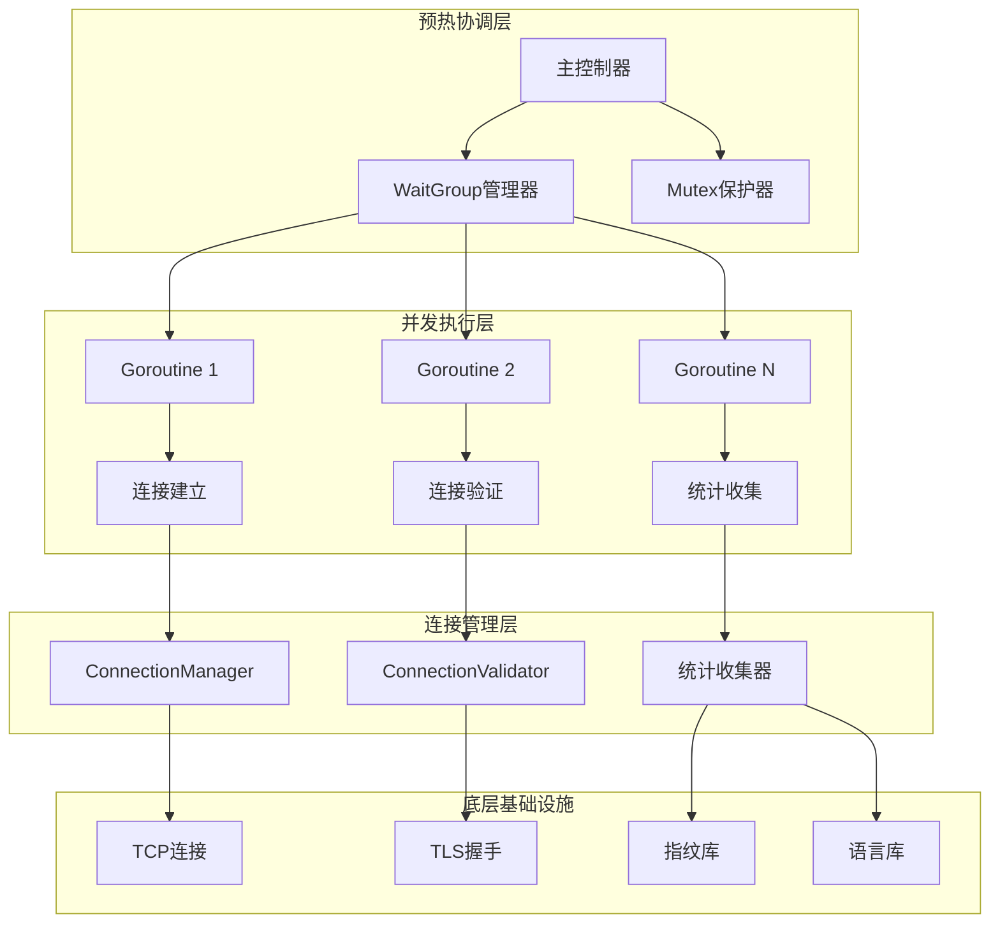
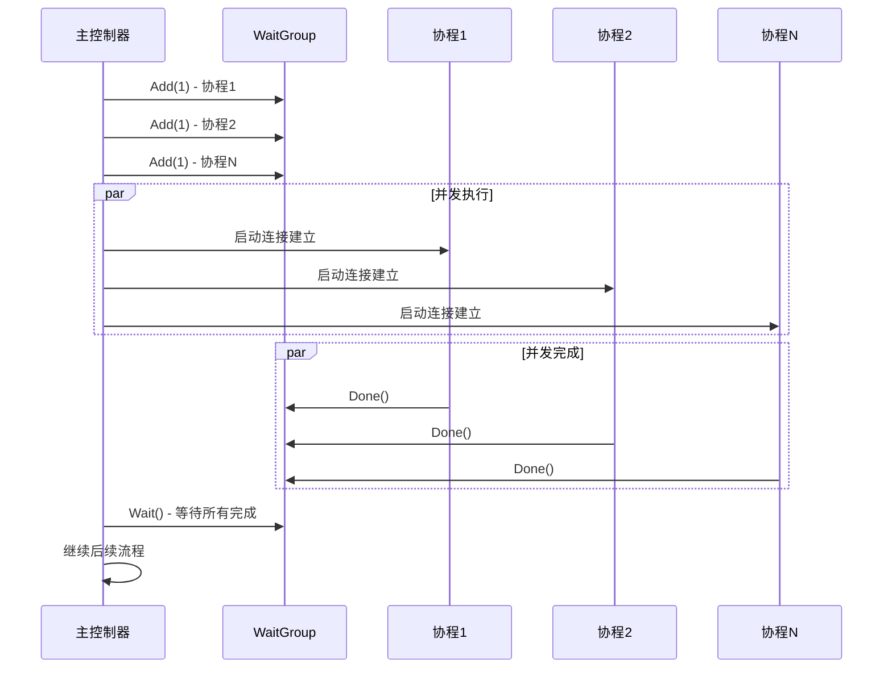
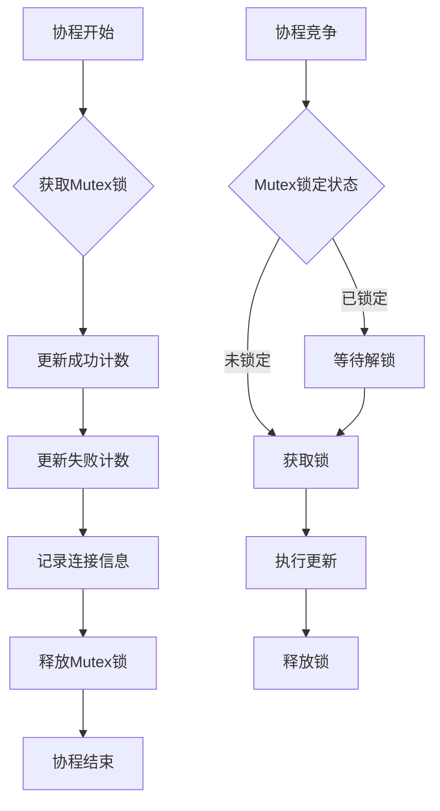
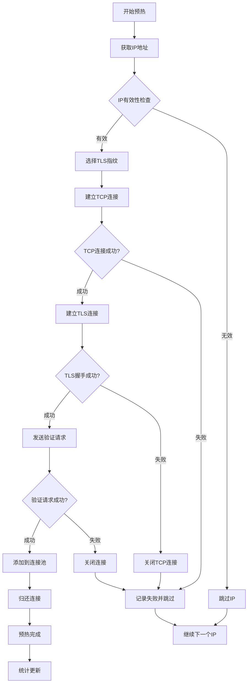
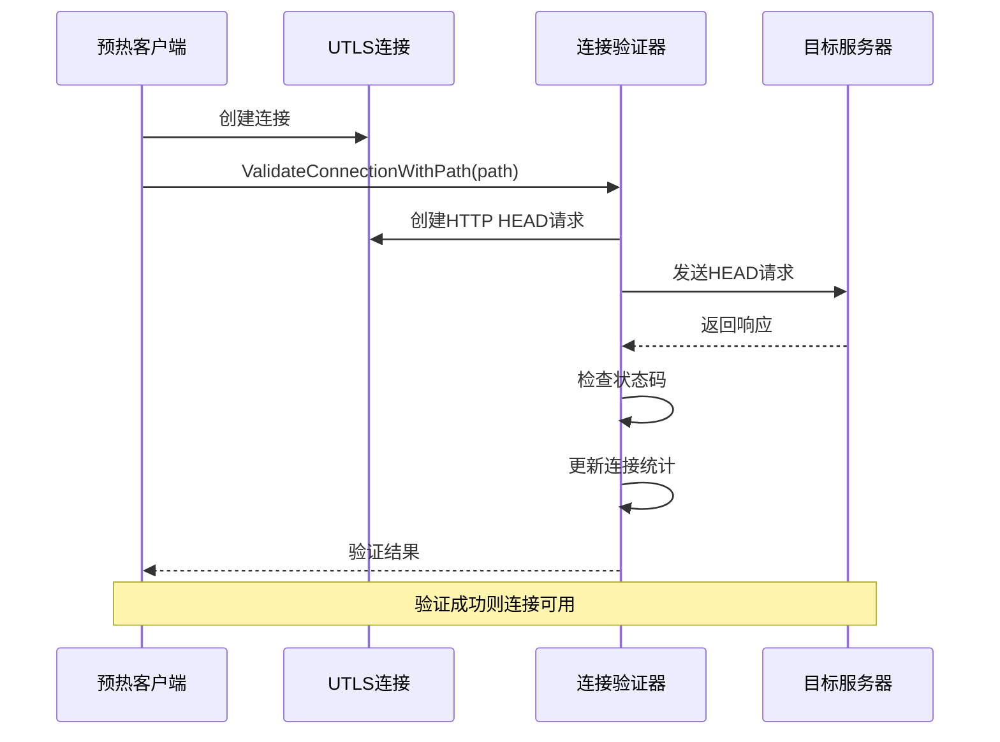
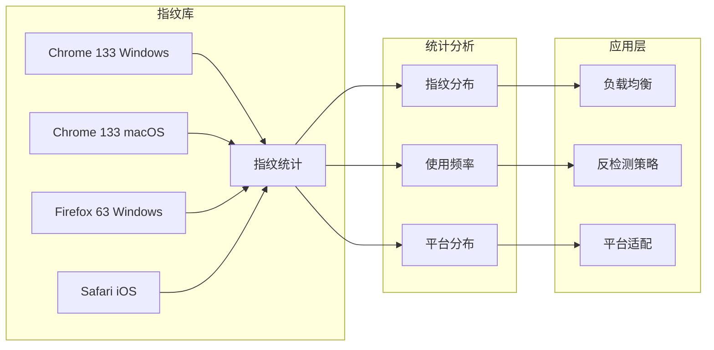
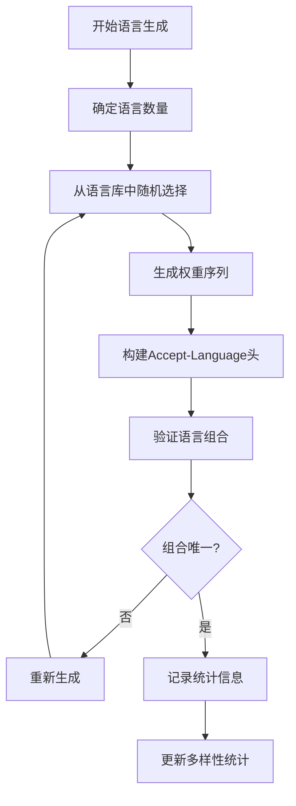
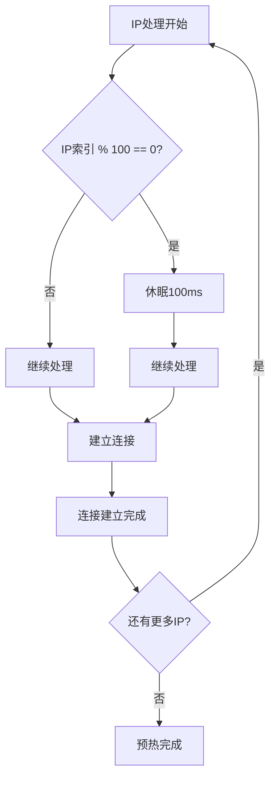
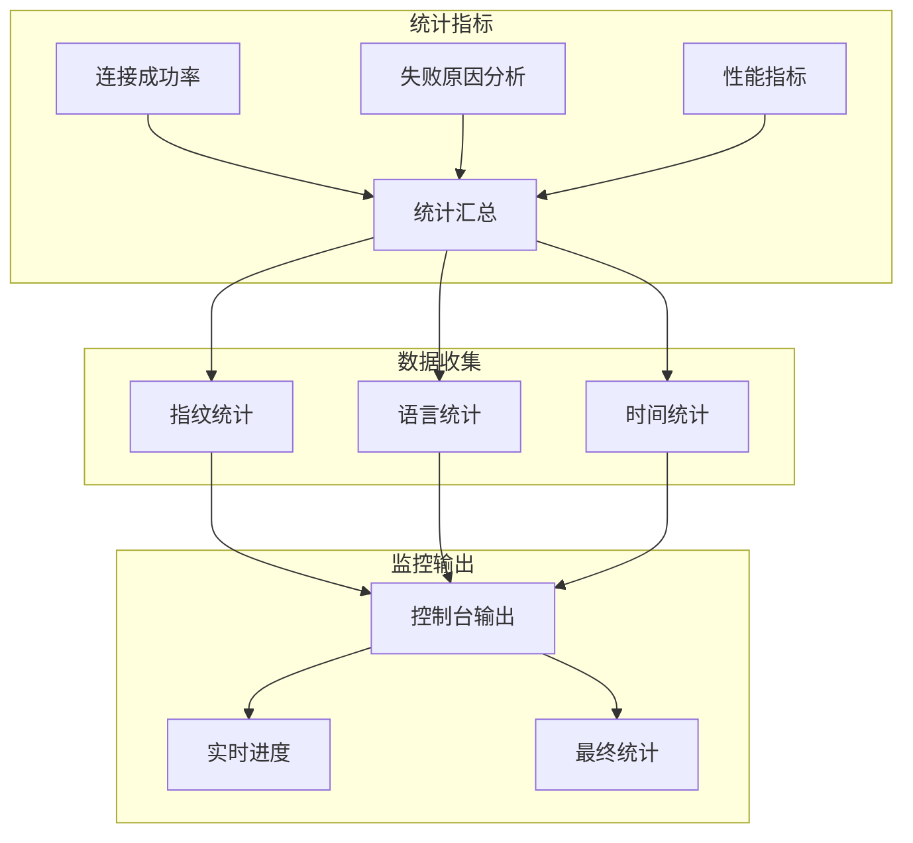
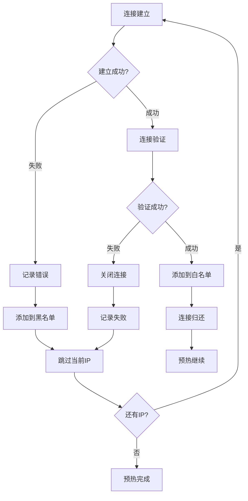

# 预热阶段

<cite>
**本文档引用的文件**
- [test_ip_pool_performance.go](file://test/test_ip_pool_performance.go)
- [utlshotconnpool.go](file://utlsclient/utlshotconnpool.go)
- [connection_manager.go](file://utlsclient/connection_manager.go)
- [connection_validator.go](file://utlsclient/connection_validator.go)
- [connection_helpers.go](file://utlsclient/connection_helpers.go)
- [utlsfingerprint.go](file://utlsclient/utlsfingerprint.go)
- [remotedomainippool.go](file://remotedomainippool/remotedomainippool.go)
- [whiteblackippool.go](file://remotedomainippool/whiteblackippool.go)
- [ip_access_controller.go](file://utlsclient/ip_access_controller.go)
</cite>

## 目录
1. [概述](#概述)
2. [预热阶段架构](#预热阶段架构)
3. [并发控制机制](#并发控制机制)
4. [连接建立流程](#连接建立流程)
5. [连接验证机制](#连接验证机制)
6. [TLS指纹多样性](#tls指纹多样性)
7. [Accept-Language随机化](#accept-language随机化)
8. [节流设计](#节流设计)
9. [统计收集与监控](#统计收集与监控)
10. [故障处理与恢复](#故障处理与恢复)
11. [性能优化策略](#性能优化策略)
12. [总结](#总结)

## 概述

预热阶段是热连接池系统的核心组件，负责为IP池中的每个IP地址建立热连接，确保连接池在正式业务请求前处于最佳状态。预热过程通过并发协程实现，同时收集TLS指纹和Accept-Language的多样性数据，为后续的负载均衡和反爬虫对抗提供基础。

预热阶段的主要目标包括：
- 建立所有IP地址的热连接
- 验证连接的可用性和稳定性
- 收集TLS指纹多样性统计数据
- 收集Accept-Language随机化数据
- 实现并发控制和节流机制
- 提供完善的错误处理和监控

## 预热阶段架构

预热阶段采用多层架构设计，确保高并发下的稳定性和可靠性：

**图表来源**
- [test_ip_pool_performance.go](file://test/test_ip_pool_performance.go#L63-L147)
- [utlshotconnpool.go](file://utlsclient/utlshotconnpool.go#L1396-L1422)

**章节来源**
- [test_ip_pool_performance.go](file://test/test_ip_pool_performance.go#L60-L153)
- [utlshotconnpool.go](file://utlsclient/utlshotconnpool.go#L1396-L1422)

## 并发控制机制

预热阶段使用`sync.WaitGroup`实现精确的并发控制，确保所有IP的连接建立完成后才继续后续流程：

**图表来源**
- [test_ip_pool_performance.go](file://test/test_ip_pool_performance.go#L64-L147)

### WaitGroup实现细节

WaitGroup的使用确保了预热过程的完整性：

1. **初始化**: `var wgWarmup sync.WaitGroup`
2. **增量**: 每启动一个协程前调用`wgWarmup.Add(1)`
3. **完成**: 每个协程执行完毕后调用`wgWarmup.Done()`
4. **等待**: 主协程调用`wgWarmup.Wait()`等待所有子协程完成

### 线程安全保护

使用`sync.Mutex`保护共享统计变量，确保并发环境下的数据一致性：

**图表来源**
- [test_ip_pool_performance.go](file://test/test_ip_pool_performance.go#L68-L132)

**章节来源**
- [test_ip_pool_performance.go](file://test/test_ip_pool_performance.go#L64-L147)

## 连接建立流程

预热阶段的连接建立是一个复杂的多步骤过程，涉及TCP连接、TLS握手和连接验证：

**图表来源**
- [test_ip_pool_performance.go](file://test/test_ip_pool_performance.go#L80-L141)
- [connection_helpers.go](file://utlsclient/connection_helpers.go#L64-L181)

### 连接建立步骤详解

1. **IP获取**: 从IP池中获取目标IP地址
2. **指纹选择**: 从TLS指纹库中随机选择合适的指纹
3. **TCP连接**: 建立到目标IP的TCP连接
4. **TLS握手**: 使用选定的TLS指纹完成握手
5. **连接验证**: 发送HTTP HEAD请求验证连接可用性
6. **连接归还**: 将验证成功的连接归还到连接池

### IPv4/IPv6兼容处理

系统自动识别IPv4和IPv6地址格式，并相应调整连接参数：

- **IPv4**: 直接使用IP地址和端口号
- **IPv6**: 使用方括号包裹IP地址格式 `[IP]:PORT`

**章节来源**
- [test_ip_pool_performance.go](file://test/test_ip_pool_performance.go#L80-L141)
- [connection_helpers.go](file://utlsclient/connection_helpers.go#L64-L181)

## 连接验证机制

连接验证是预热阶段的关键环节，确保建立的连接能够正常工作：

**图表来源**
- [connection_validator.go](file://utlsclient/connection_validator.go#L42-L96)

### 验证策略

系统采用多层次的验证策略：

1. **基础健康检查**: 检查连接的基本状态
2. **路径验证**: 验证指定路径的可用性
3. **完整URL验证**: 验证完整URL的可访问性
4. **严格GET验证**: 使用GET请求进行更严格的验证

### 验证参数配置

- **超时时间**: 默认15秒，可根据网络状况调整
- **请求方法**: HEAD请求，轻量级验证
- **用户代理**: 特定的健康检查标识
- **连接头**: keep-alive保持连接

**章节来源**
- [connection_validator.go](file://utlsclient/connection_validator.go#L42-L96)

## TLS指纹多样性

预热阶段收集丰富的TLS指纹数据，为反检测提供多样化的特征：

**图表来源**
- [utlsfingerprint.go](file://utlsclient/utlsfingerprint.go#L112-L200)

### 指纹类型覆盖

系统支持多种浏览器和版本的TLS指纹：

| 浏览器系列 | 版本范围 | 平台支持 | 指纹数量 |
|------------|----------|----------|----------|
| Chrome | 100-133 | Windows, macOS, Linux | 12个 |
| Firefox | 55-65 | Windows, macOS | 9个 |
| Safari | iOS, macOS | 移动端 | 4个 |
| Edge | 85-100 | Windows | 3个 |

### 指纹选择策略

1. **随机选择**: 每次预热随机选择不同的指纹
2. **均匀分布**: 确保各种指纹类型的使用频率相近
3. **版本覆盖**: 包含不同版本的浏览器指纹
4. **平台适配**: 考虑不同操作系统的指纹差异

**章节来源**
- [utlsfingerprint.go](file://utlsclient/utlsfingerprint.go#L112-L200)

## Accept-Language随机化

预热阶段实现了高度多样化的Accept-Language随机化，为反检测提供丰富的语言特征：

**图表来源**
- [utlsfingerprint.go](file://utlsclient/utlsfingerprint.go#L579-L630)

### 语言库覆盖

系统支持90种语言，涵盖全球主要语言：

- **欧洲语言**: 20+种欧洲语言
- **亚洲语言**: 中文、日文、韩文、泰文等
- **美洲语言**: 英语、西班牙语、葡萄牙语等
- **非洲语言**: 阿拉伯语、斯瓦希里语等
- **其他语言**: 印地语、泰米尔语等

### 随机化策略

1. **数量控制**: 每次选择2-5种语言
2. **权重分配**: 主语言权重1.0，次语言权重递减
3. **去重机制**: 确保语言组合的唯一性
4. **多样性统计**: 记录重复和唯一组合的数量

### 多样性指标

根据测试结果，语言多样性的表现：
- **总组合数**: 1575种
- **唯一组合**: 1541种（97.8%）
- **重复组合**: 34种（2.2%）

**章节来源**
- [utlsfingerprint.go](file://utlsclient/utlsfingerprint.go#L579-L630)

## 节流设计

为了防止瞬时高并发对系统造成压力，预热阶段实现了智能的节流机制：

**图表来源**
- [test_ip_pool_performance.go](file://test/test_ip_pool_performance.go#L143-L146)

### 节流参数

- **批次大小**: 每100个IP为一个批次
- **休眠时间**: 100毫秒
- **触发条件**: IP索引 % 100 == 0
- **目的**: 避免瞬时并发过高

### 节流效果

1. **流量控制**: 将并发压力分散到时间维度
2. **系统保护**: 防止网络接口过载
3. **资源管理**: 合理利用系统资源
4. **稳定性保证**: 提高整体预热成功率

**章节来源**
- [test_ip_pool_performance.go](file://test/test_ip_pool_performance.go#L143-L146)

## 统计收集与监控

预热阶段建立了完善的统计收集和监控体系：

**图表来源**
- [test_ip_pool_performance.go](file://test/test_ip_pool_performance.go#L156-L180)

### 统计指标

1. **连接统计**
   - 总IP数: 1631个
   - 成功数: 1611个 (98.8%)
   - 失败数: 20个 (1.2%)
   - 总耗时: 21.5秒

2. **指纹统计**
   - 指纹种类: 33种
   - 平均分布: 每种约48.8次
   - 分布均匀: 91.7%覆盖率

3. **语言统计**
   - 语言组合: 1575种
   - 唯一组合: 1541种 (97.8%)
   - 多样性: 极高

### 实时监控

系统提供实时的预热进度监控：

- **进度条**: 百分比显示
- **详细信息**: 每10个IP显示详细信息
- **前20个**: 显示最前面的连接信息
- **性能指标**: 实时显示成功率和耗时

**章节来源**
- [test_ip_pool_performance.go](file://test/test_ip_pool_performance.go#L156-L180)

## 故障处理与恢复

预热阶段实现了完善的故障处理和恢复机制：

**图表来源**
- [test_ip_pool_performance.go](file://test/test_ip_pool_performance.go#L88-L138)

### 错误分类

1. **连接失败**: TCP连接或TLS握手失败
2. **验证失败**: HTTP请求验证失败
3. **超时失败**: 请求超时
4. **网络失败**: 网络不可达

### 恢复策略

1. **自动重试**: 对于临时性错误
2. **黑名单管理**: 将不可用IP加入黑名单
3. **白名单维护**: 保持可用IP的白名单
4. **统计记录**: 记录失败原因便于分析

### 故障隔离

- **IP隔离**: 失败的IP不会影响其他IP的预热
- **连接隔离**: 单个连接失败不会导致整个预热失败
- **统计隔离**: 失败统计独立记录

**章节来源**
- [test_ip_pool_performance.go](file://test/test_ip_pool_performance.go#L88-L138)

## 性能优化策略

预热阶段采用了多种性能优化策略：

### 并发优化

1. **协程池**: 使用WaitGroup管理协程生命周期
2. **无锁设计**: 尽量减少锁的竞争
3. **批量处理**: 每100个IP批量处理
4. **异步处理**: 连接建立和验证异步进行

### 资源优化

1. **连接复用**: 建立的连接立即归还池中
2. **内存管理**: 及时释放不需要的资源
3. **网络优化**: 合理设置超时和重试参数
4. **统计优化**: 减少不必要的统计操作

### 系统优化

1. **CPU优化**: 避免CPU密集型操作
2. **IO优化**: 异步IO操作
3. **网络优化**: TCP连接复用
4. **内存优化**: 对象池化

**章节来源**
- [test_ip_pool_performance.go](file://test/test_ip_pool_performance.go#L64-L147)

## 总结

预热阶段是热连接池系统的重要组成部分，通过精心设计的并发控制、连接验证、统计收集和故障处理机制，确保了连接池的高质量和高可用性。

### 核心优势

1. **高并发处理**: 通过WaitGroup和协程实现高效的并发处理
2. **质量保证**: 多层次的连接验证确保连接质量
3. **多样性丰富**: TLS指纹和Accept-Language的高度多样化
4. **稳定性强**: 完善的错误处理和恢复机制
5. **监控完善**: 实时的统计和监控信息

### 性能表现

- **成功率**: 98.8%的连接成功率
- **多样性**: 33种TLS指纹，1575种语言组合
- **效率**: 21.5秒完成1631个IP的预热
- **稳定性**: 97.8%的语言组合唯一性

### 应用价值

预热阶段为后续的业务请求提供了坚实的基础，确保了系统的稳定性和抗检测能力，是现代爬虫系统不可或缺的核心组件。