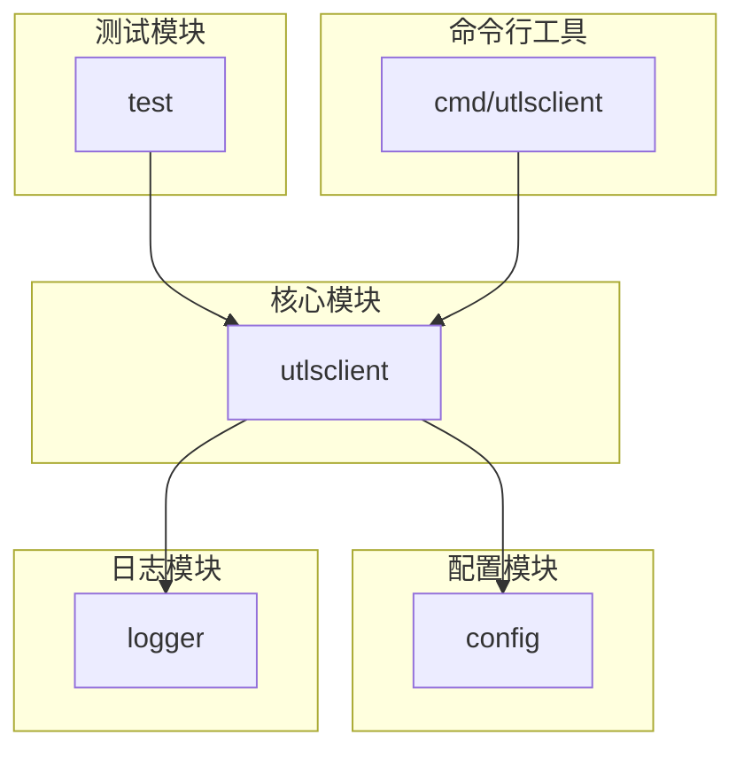
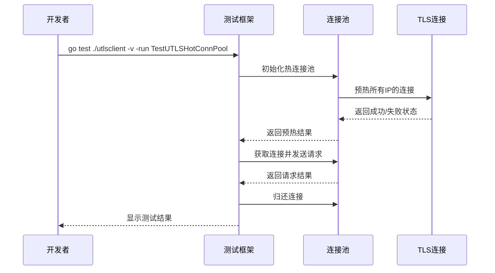
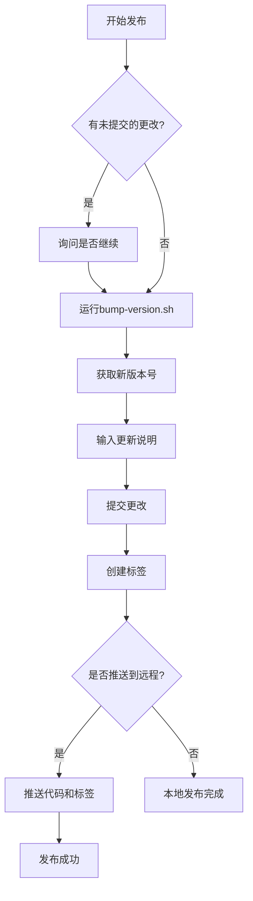

# 贡献指南

<cite>
**本文档引用的文件**
- [README.md](file://README.md)
- [go.mod](file://go.mod)
- [version.go](file://version.go)
- [cmd/utlsclient/main.go](file://cmd/utlsclient/main.go)
- [utlsclient/utlsclient.go](file://utlsclient/utlsclient.go)
- [utlsclient/utlshotconnpool.go](file://utlsclient/utlshotconnpool.go)
- [test/utlsclient/utlsclient_test.go](file://test/utlsclient/utlsclient_test.go)
- [config/config.go](file://config/config.go)
- [config/config.toml](file://config/config.toml)
- [scripts/bump-version.sh](file://scripts/bump-version.sh)
- [scripts/release.sh](file://scripts/release.sh)
- [scripts/VERSION_MANAGEMENT.md](file://scripts/VERSION_MANAGEMENT.md)
- [test/README.md](file://test/README.md)
</cite>

## 目录
1. [简介](#简介)
2. [代码规范与风格要求](#代码规范与风格要求)
3. [代码提交流程](#代码提交流程)
4. [测试要求](#测试要求)
5. [构建与测试运行](#构建与测试运行)
6. [文档更新要求](#文档更新要求)
7. [版本管理与发布流程](#版本管理与发布流程)
8. [新贡献者入门](#新贡献者入门)
9. [常见问题解答](#常见问题解答)

## 简介

本贡献指南旨在为开发者提供参与爬虫平台项目开发的完整指导。项目是一个基于uTLS的高性能爬虫平台，支持TLS指纹伪装、热连接池和IP池管理。通过本指南，您将了解如何遵循代码规范、提交代码、编写测试、更新文档以及参与版本发布流程。

**Section sources**
- [README.md](file://README.md#L1-L357)

## 代码规范与风格要求

### 命名约定

项目遵循Go语言的标准命名约定：

- **包名**：使用小写字母，简洁明了，如 `utlsclient`、`logger`、`config`
- **类型名**：采用驼峰命名法（CamelCase），首字母大写表示导出类型，如 `UTLSClient`、`UTLSConnection`、`PoolConfig`
- **函数名**：采用驼峰命名法，首字母大写表示导出函数，如 `NewUTLSClient`、`GetConnection`、`SetTimeout`
- **变量名**：采用驼峰命名法，局部变量使用小写字母开头，如 `conn`、`client`、`poolConfig`
- **常量名**：全部大写，单词间用下划线分隔，如 `DefaultHTTPSPort`、`Version`

### 注释标准

项目采用Go语言的注释规范，确保代码的可读性和可维护性：

- **包注释**：每个包的主文件开头包含包的总体描述，说明包的用途和主要功能
- **类型注释**：每个导出类型前都有注释，描述其用途和主要字段，如 `// UTLSClient 是一个基于 uTLS 的 HTTP 客户端，用于模拟真实浏览器`
- **函数注释**：每个导出函数前都有注释，描述其功能、参数和返回值，如 `// NewUTLSClient 创建新的 UTLS 客户端`
- **内联注释**：在复杂逻辑或关键步骤处添加内联注释，解释代码的意图和实现细节

### 代码组织

项目采用模块化设计，代码组织清晰，便于维护和扩展：

- **核心模块**：`utlsclient` 目录包含uTLS客户端核心库，包括热连接池、HTTP客户端和TLS指纹库
- **配置模块**：`config` 目录包含配置文件解析和管理功能
- **日志模块**：`logger` 目录包含日志接口和实现
- **测试模块**：`test` 目录包含性能测试和单元测试
- **命令行工具**：`cmd/utlsclient` 目录包含命令行客户端



**Diagram sources**
- [README.md](file://README.md#L72-L90)
- [utlsclient/utlsclient.go](file://utlsclient/utlsclient.go#L1-L200)
- [utlsclient/utlshotconnpool.go](file://utlsclient/utlshotconnpool.go#L1-L200)

**Section sources**
- [README.md](file://README.md#L72-L90)
- [utlsclient/utlsclient.go](file://utlsclient/utlsclient.go#L1-L200)
- [utlsclient/utlshotconnpool.go](file://utlsclient/utlshotconnpool.go#L1-L200)

## 代码提交流程

### 分支管理

项目采用基于主干的开发模式，分支管理遵循以下规则：

- **主分支**：`main` 分支是项目的稳定版本，所有生产代码都来自此分支
- **功能分支**：开发新功能时，从 `main` 分支创建功能分支，命名格式为 `feature/功能描述`，如 `feature/http2-support`
- **修复分支**：修复bug时，从 `main` 分支创建修复分支，命名格式为 `fix/问题描述`，如 `fix/connection-leak`
- **发布分支**：发布新版本时，从 `main` 分支创建发布分支，命名格式为 `release/版本号`，如 `release/v0.0.13`

### Pull Request流程

提交代码的流程如下：

1. **创建分支**：从 `main` 分支创建新的功能或修复分支
2. **开发代码**：在分支上进行开发，确保代码符合规范和测试要求
3. **提交更改**：将更改提交到分支，提交信息遵循约定格式
4. **创建Pull Request**：在GitHub上创建Pull Request，目标分支为 `main`
5. **代码审查**：其他开发者进行代码审查，提出修改建议
6. **修改代码**：根据审查意见修改代码，重新提交
7. **合并代码**：审查通过后，将代码合并到 `main` 分支

### 代码审查标准

代码审查是确保代码质量的重要环节，审查标准包括：

- **代码规范**：检查代码是否符合命名约定、注释标准和代码组织要求
- **功能正确性**：验证代码是否正确实现了预期功能，没有逻辑错误
- **性能优化**：评估代码的性能表现，避免不必要的资源消耗
- **安全性**：检查代码是否存在安全漏洞，如SQL注入、XSS等
- **测试覆盖**：确保新增代码有足够的单元测试和集成测试覆盖

**Section sources**
- [README.md](file://README.md#L342-L345)
- [scripts/VERSION_MANAGEMENT.md](file://scripts/VERSION_MANAGEMENT.md#L21-L57)

## 测试要求

### 单元测试覆盖率

项目要求所有新增代码必须有相应的单元测试，确保代码的正确性和稳定性。单元测试覆盖率应达到80%以上。

- **测试文件**：测试文件命名格式为 `*_test.go`，与被测试文件在同一目录下
- **测试函数**：测试函数命名格式为 `Test函数名`，如 `TestNewUTLSClient`、`TestGetConnection`
- **测试覆盖率**：使用 `go test -cover` 命令检查测试覆盖率，确保关键路径都有测试覆盖

### 集成测试标准

集成测试用于验证多个模块协同工作的正确性，标准包括：

- **测试场景**：覆盖主要使用场景，如热连接池的预热、获取和归还连接
- **边界条件**：测试边界条件和异常情况，如连接超时、网络中断等
- **性能测试**：验证性能指标，如连接建立速度、请求成功率等



**Diagram sources**
- [test/README.md](file://test/README.md#L16-L43)
- [test/utlsclient/utlsclient_test.go](file://test/utlsclient/utlsclient_test.go#L1-L200)

**Section sources**
- [test/README.md](file://test/README.md#L16-L43)
- [test/utlsclient/utlsclient_test.go](file://test/utlsclient/utlsclient_test.go#L1-L200)

## 构建与测试运行

### 构建步骤

构建项目的基本步骤如下：

1. **安装依赖**：
   ```bash
   go mod download
   ```

2. **编译项目**：
   ```bash
   go build -o crawler-platform cmd/utlsclient/main.go
   ```

3. **运行可执行文件**：
   ```bash
   ./crawler-platform --url https://example.com
   ```

### 运行测试

运行测试的步骤如下：

1. **运行性能测试**：
   ```bash
   go run test/test_ip_pool_performance.go
   ```

2. **运行单元测试**：
   ```bash
   # 测试热连接池
   go test ./utlsclient -v -run TestUTLSHotConnPool
   
   # 测试TLS指纹
   go test ./utlsclient -v -run TestFingerprint
   
   # 运行所有测试
   go test ./... -v
   ```

3. **查看测试报告**：
   ```bash
   cat test/reports/热连接池性能测试报告.md
   ```

**Section sources**
- [README.md](file://README.md#L294-L330)
- [test/README.md](file://test/README.md#L26-L35)

## 文档更新要求

### 文档位置

项目文档分布在多个位置，更新时需确保一致性：

- **README.md**：项目根目录的README文件，包含项目简介、快速开始、项目结构等
- **docs目录**：包含详细的模块文档，如 `utlsclient/README.md`、`utlshotconnpool.md` 等
- **代码注释**：代码中的注释是文档的重要组成部分，需保持同步更新

### 更新内容

文档更新需包含以下内容：

- **功能描述**：新增功能的详细描述，包括使用方法和示例
- **配置说明**：配置文件的格式和参数说明
- **API文档**：导出函数和类型的使用说明
- **常见问题**：用户常见问题和解决方案

**Section sources**
- [README.md](file://README.md#L1-L357)
- [docs/utlsclient/README.md](file://docs/utlsclient/README.md)
- [docs/utlshotconnpool.md](file://docs/utlshotconnpool.md)

## 版本管理与发布流程

### 版本号格式

项目采用语义化版本（Semantic Versioning）：`major.minor.patch`

- **主版本号（major）**：重大更新，不兼容的API修改
- **次版本号（minor）**：新增功能，向后兼容
- **修订号（patch）**：bug修复，向后兼容

### 发布流程

版本发布流程如下：

1. **递增版本号**：使用 `bump-version.sh` 脚本自动递增版本号
2. **提交更改**：提交版本号更改和更新说明
3. **创建标签**：创建git标签
4. **推送到远程仓库**：推送代码和标签到GitHub



**Diagram sources**
- [scripts/VERSION_MANAGEMENT.md](file://scripts/VERSION_MANAGEMENT.md#L21-L57)
- [scripts/bump-version.sh](file://scripts/bump-version.sh#L1-L45)
- [scripts/release.sh](file://scripts/release.sh#L1-L56)

**Section sources**
- [scripts/VERSION_MANAGEMENT.md](file://scripts/VERSION_MANAGEMENT.md#L1-L94)
- [scripts/bump-version.sh](file://scripts/bump-version.sh#L1-L45)
- [scripts/release.sh](file://scripts/release.sh#L1-L56)

## 新贡献者入门

### 入门步骤

新贡献者可以按照以下步骤快速上手：

1. **克隆项目**：
   ```bash
   git clone https://github.com/your-repo/crawler-platform.git
   cd crawler-platform
   ```

2. **安装依赖**：
   ```bash
   go mod download
   ```

3. **运行示例**：
   ```bash
   go run examples/utlsclient/example_basic_usage.go
   ```

4. **阅读文档**：
   - `README.md`：项目概述和快速开始
   - `docs/` 目录：详细模块文档
   - `test/README.md`：测试说明

5. **运行测试**：
   ```bash
   go test ./... -v
   ```

### 开发建议

- **从小处着手**：从修复小bug或添加小功能开始，逐步熟悉代码库
- **参与讨论**：在Issue中参与讨论，了解项目需求和设计思路
- **编写测试**：为新增代码编写充分的测试，确保代码质量
- **遵循规范**：严格遵守代码规范和提交流程

**Section sources**
- [README.md](file://README.md#L29-L70)
- [examples/utlsclient/README.md](file://examples/utlsclient/README.md#L1-L54)
- [test/README.md](file://test/README.md#L1-L90)

## 常见问题解答

### 如何解决连接超时问题？

- **增加超时时间**：在 `config.toml` 中增加 `conn_timeout` 和 `test_timeout` 的值
- **检查网络环境**：确保网络连接稳定，防火墙没有阻止连接
- **使用代理**：在网络受限的环境中，可以配置代理服务器

### 如何添加新的TLS指纹？

1. 在 `utlsfingerprint.go` 中定义新的指纹配置
2. 在指纹库中注册新的指纹
3. 更新测试用例，确保新指纹正常工作

### 如何优化性能？

- **预热连接**：在大规模请求前，先预热所有IP的连接
- **调整并发数**：根据网络情况调整并发数，避免过度消耗资源
- **使用HTTP/2**：优先使用HTTP/2协议，充分利用连接复用

**Section sources**
- [README.md](file://README.md#L249-L293)
- [config/config.toml](file://config/config.toml#L1-L38)
- [utlsclient/utlsfingerprint.go](file://utlsclient/utlsfingerprint.go)