# 配置加载机制

<cite>
**本文档引用的文件**
- [config/config.go](file://config/config.go)
- [config/config.toml](file://config/config.toml)
- [GoogleEarthClient/config/config.toml](file://GoogleEarthClient/config/config.toml)
- [utlsclient/utlshotconnpool.go](file://utlsclient/utlshotconnpool.go)
- [cmd/utlsclient/main.go](file://cmd/utlsclient/main.go)
- [examples/utlsclient/example_utlsclient_usage.go](file://examples/utlsclient/example_utlsclient_usage.go)
- [examples/utlsclient/example_hotconnpool_usage.go](file://examples/utlsclient/example_hotconnpool_usage.go)
</cite>

## 目录
1. [概述](#概述)
2. [配置架构设计](#配置架构设计)
3. [核心配置加载函数](#核心配置加载函数)
4. [单例加载模式](#单例加载模式)
5. [路径处理机制](#路径处理机制)
6. [配置合并策略](#配置合并策略)
7. [实际应用示例](#实际应用示例)
8. [配置热更新可行性分析](#配置热更新可行性分析)
9. [最佳实践建议](#最佳实践建议)
10. [总结](#总结)

## 概述

爬虫平台采用分层配置加载机制，通过`LoadMergedInto`函数实现"默认配置+覆盖配置"的设计理念。该机制支持两种配置文件的合并加载：项目根目录的`config.toml`作为用户覆盖配置，以及`config/config.toml`作为框架默认配置。系统还提供了线程安全的单例加载模式和灵活的路径处理功能。

## 配置架构设计

### 配置文件层次结构

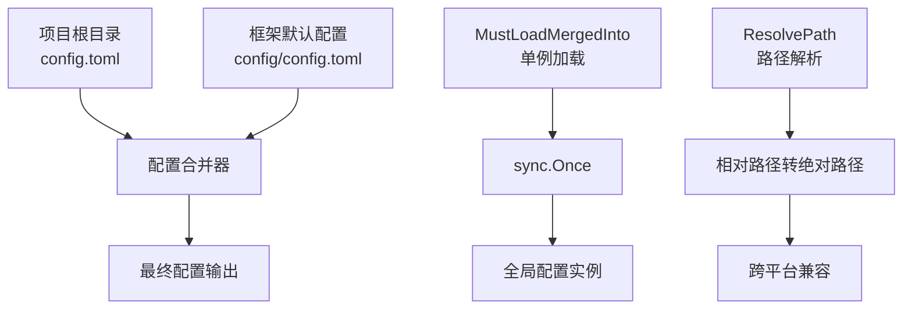

**图表来源**
- [config/config.go](file://config/config.go#L12-L16)
- [config/config.go](file://config/config.go#L33-L38)

### 配置结构定义

系统定义了清晰的配置结构层次：

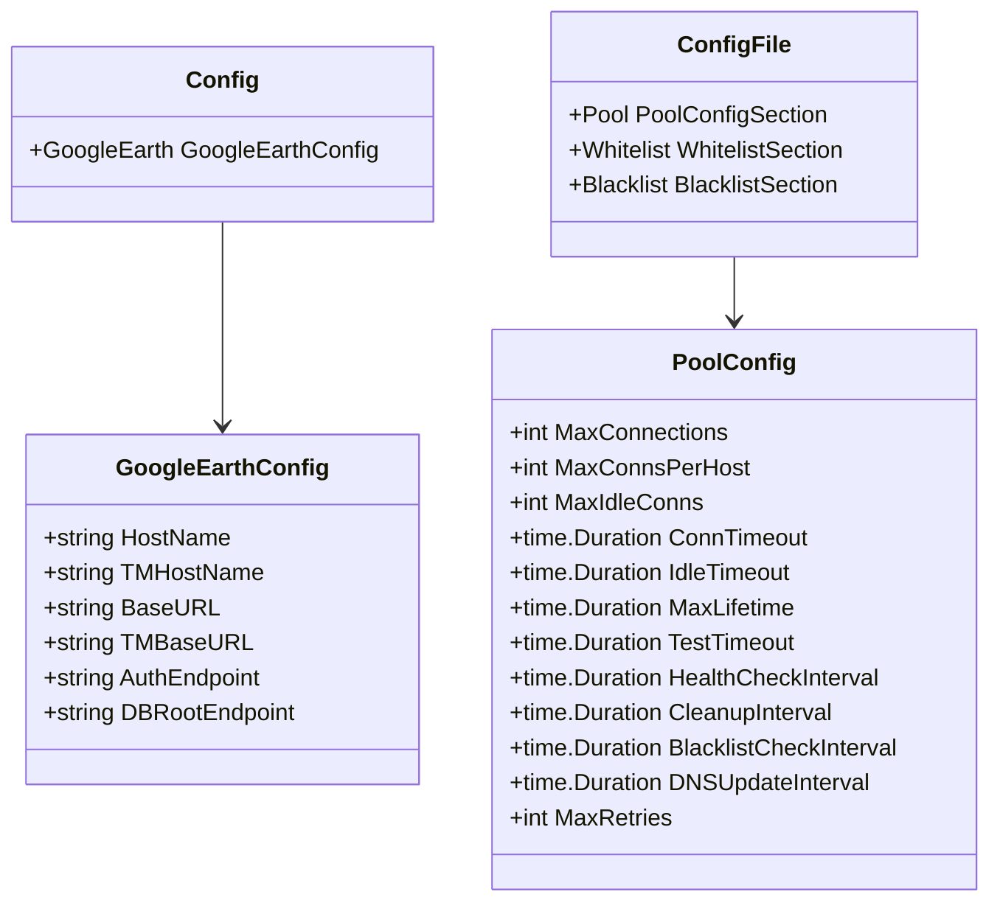

**图表来源**
- [config/config.go](file://config/config.go#L18-L31)
- [utlsclient/utlshotconnpool.go](file://utlsclient/utlshotconnpool.go#L53-L84)

**章节来源**
- [config/config.go](file://config/config.go#L18-L31)
- [utlsclient/utlshotconnpool.go](file://utlsclient/utlshotconnpool.go#L53-L84)

## 核心配置加载函数

### LoadMergedInto函数实现

`LoadMergedInto`函数是配置加载的核心，实现了"默认配置优先，用户配置覆盖"的合并策略：

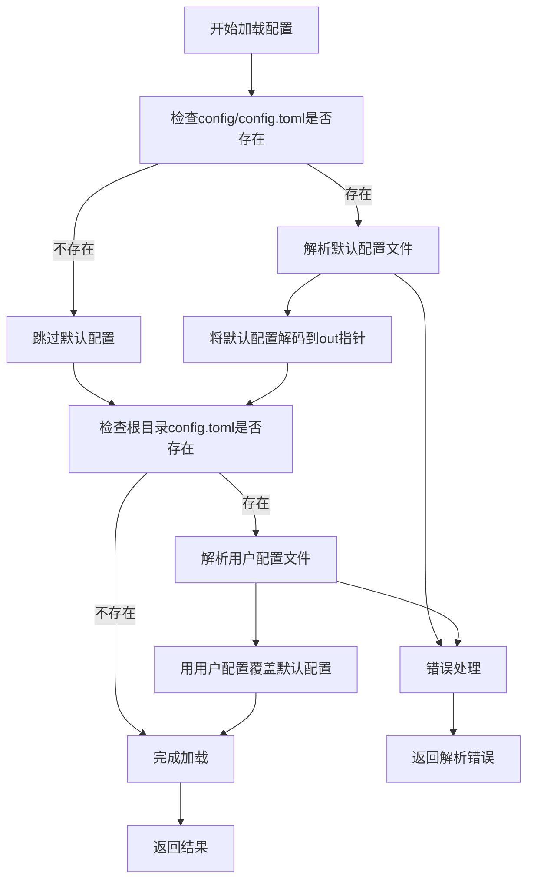

**图表来源**
- [config/config.go](file://config/config.go#L40-L56)

该函数的关键特性包括：

1. **顺序加载策略**：先加载默认配置，后加载用户配置
2. **容错处理**：文件不存在时跳过，不会中断整个加载过程
3. **类型安全**：通过interface{}参数支持任意结构体解码
4. **错误传播**：提供详细的错误信息，包含文件路径和具体错误原因

### 配置结构映射

LoadMergedInto函数支持多种配置结构的解码：

| 配置类型 | 结构体 | TOML路径 | 用途 |
|---------|--------|----------|------|
| Google Earth配置 | `GoogleEarthConfig` | `[GoogleEarth]` | 地球服务相关配置 |
| 连接池配置 | `PoolConfigSection` | `[pool]` | 热连接池参数 |
| 白名单配置 | `WhitelistSection` | `[whitelist]` | IP白名单列表 |
| 黑名单配置 | `BlacklistSection` | `[blacklist]` | IP黑名单列表 |

**章节来源**
- [config/config.go](file://config/config.go#L40-L56)

## 单例加载模式

### MustLoadMergedInto实现

`MustLoadMergedInto`函数提供了线程安全的单例加载模式，确保配置在整个应用程序生命周期内只加载一次：

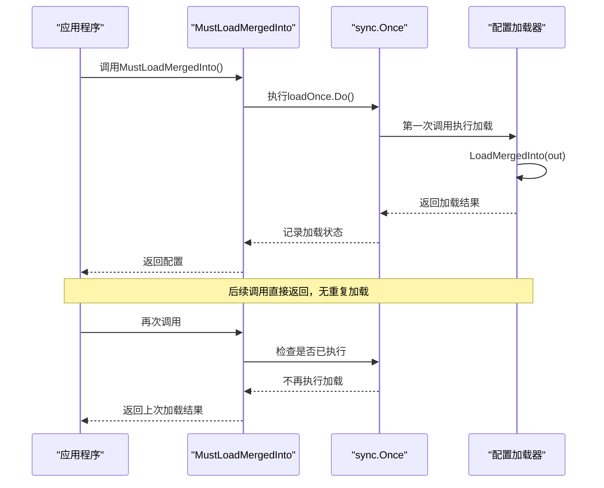

**图表来源**
- [config/config.go](file://config/config.go#L59-L67)

### 线程安全机制

系统使用Go标准库的`sync.Once`实现线程安全：

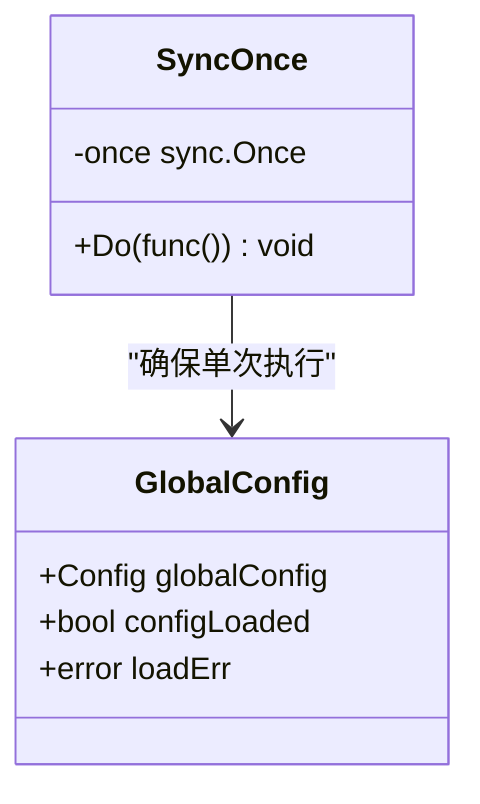

**图表来源**
- [config/config.go](file://config/config.go#L34-L38)

这种设计的优势：

1. **内存效率**：配置只加载一次，节省内存资源
2. **性能优化**：避免重复解析和验证配置文件
3. **线程安全**：多个goroutine同时访问时保证一致性
4. **错误处理**：首次加载失败会记录错误，后续调用直接panic

**章节来源**
- [config/config.go](file://config/config.go#L59-L67)

## 路径处理机制

### ResolvePath函数

`ResolvePath`函数提供了跨平台的路径解析功能：

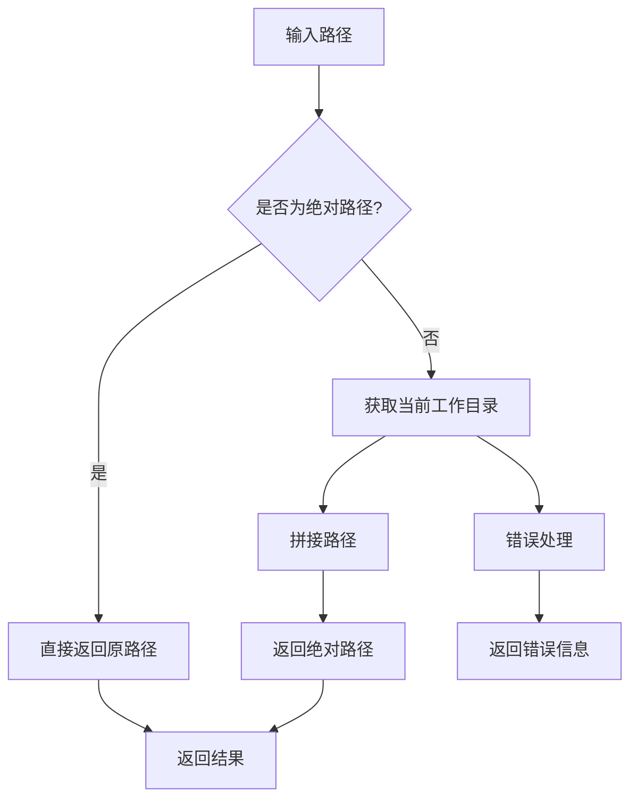

**图表来源**
- [config/config.go](file://config/config.go#L69-L79)

### fileExists函数

辅助函数用于检查文件是否存在：

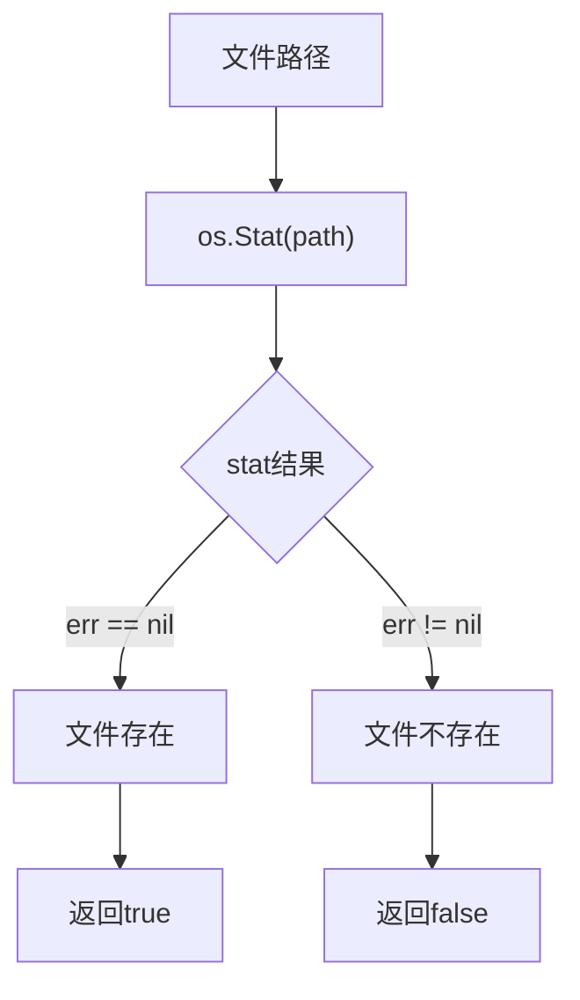

**图表来源**
- [config/config.go](file://config/config.go#L80-L84)

这两个函数共同构成了可靠的文件系统操作基础：

1. **跨平台兼容**：自动处理不同操作系统的路径分隔符
2. **错误隔离**：将文件系统错误与业务逻辑分离
3. **性能优化**：避免重复的文件存在性检查

**章节来源**
- [config/config.go](file://config/config.go#L69-L84)

## 配置合并策略

### 默认配置vs覆盖配置

系统采用"默认配置优先，用户配置覆盖"的合并策略：

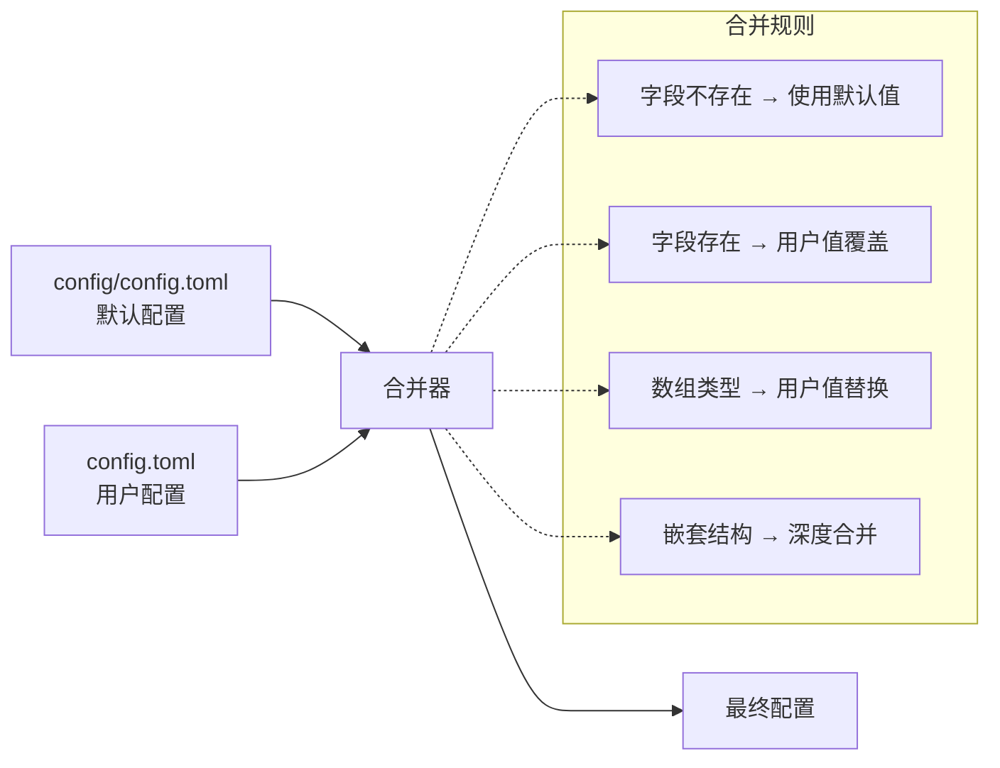

**图表来源**
- [config/config.go](file://config/config.go#L40-L56)

### 实际合并效果

以连接池配置为例，展示合并前后的差异：

| 配置项 | 默认值 (config/config.toml) | 用户值 (config.toml) | 最终值 | 合并策略 |
|--------|---------------------------|-------------------|--------|----------|
| max_connections | 100 | 200 | 200 | 覆盖 |
| max_conns_per_host | 10 | 5 | 5 | 覆盖 |
| max_idle_conns | 20 | 30 | 30 | 覆盖 |
| conn_timeout | 30s | 15s | 15s | 覆盖 |
| health_check_interval | 30s | 60s | 60s | 覆盖 |

**章节来源**
- [config/config.go](file://config/config.go#L40-L56)
- [config/config.toml](file://config/config.toml#L3-L27)

## 实际应用示例

### 基础配置加载

在`utlsclient`模块中，展示了如何使用配置加载功能：

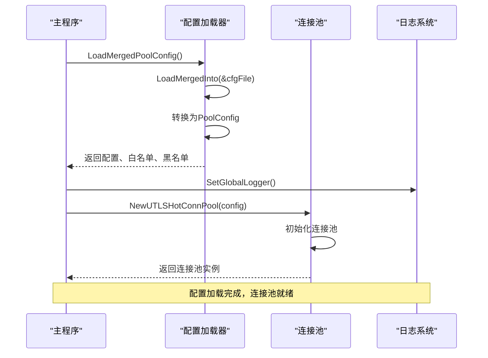

**图表来源**
- [utlsclient/utlshotconnpool.go](file://utlsclient/utlshotconnpool.go#L137-L168)
- [cmd/utlsclient/main.go](file://cmd/utlsclient/main.go#L43-L44)

### 高级配置使用模式

系统支持多种配置使用模式：

1. **完整配置加载**：`LoadMergedPoolConfig()` - 加载所有配置和黑白名单
2. **简化配置加载**：`LoadPoolConfigFromFile()` - 只加载连接池配置
3. **直接配置解析**：`LoadConfigFromTOML()` - 从指定文件解析配置

### 配置验证和错误处理

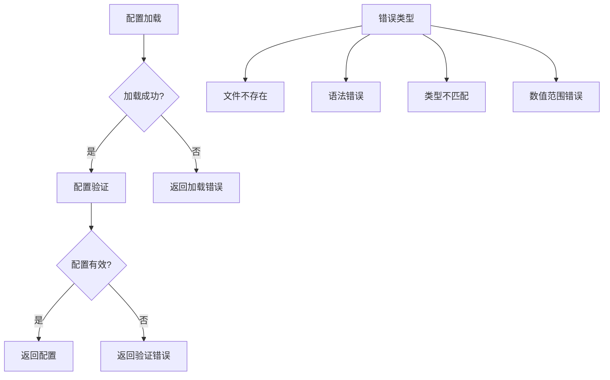

**图表来源**
- [utlsclient/utlshotconnpool.go](file://utlsclient/utlshotconnpool.go#L117-L127)

**章节来源**
- [utlsclient/utlshotconnpool.go](file://utlsclient/utlshotconnpool.go#L137-L168)
- [cmd/utlsclient/main.go](file://cmd/utlsclient/main.go#L43-L44)

## 配置热更新可行性分析

### 技术可行性评估

配置热更新在当前架构下具有一定的技术挑战：

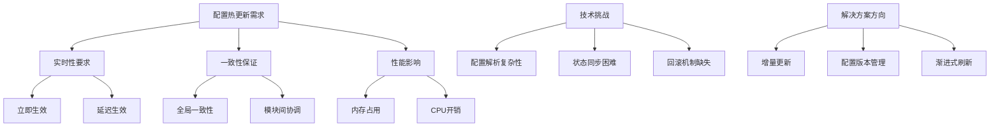

### 扩展建议

如果需要实现配置热更新，可以考虑以下扩展方案：

1. **配置监听机制**：使用文件系统监控或配置中心
2. **增量更新策略**：只更新变更的配置项
3. **优雅降级**：配置更新失败时保持原有配置
4. **版本控制**：支持配置版本管理和回滚

### 当前替代方案

目前系统提供了有效的配置管理模式：

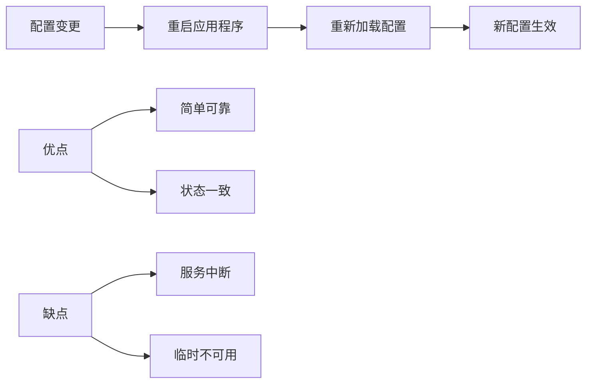

## 最佳实践建议

### 配置文件组织

1. **分离关注点**：将不同模块的配置分离到独立文件
2. **层次化设计**：使用嵌套结构表示复杂的配置关系
3. **注释规范**：为每个配置项添加详细的说明注释
4. **默认值合理**：提供有意义的默认配置值

### 错误处理策略

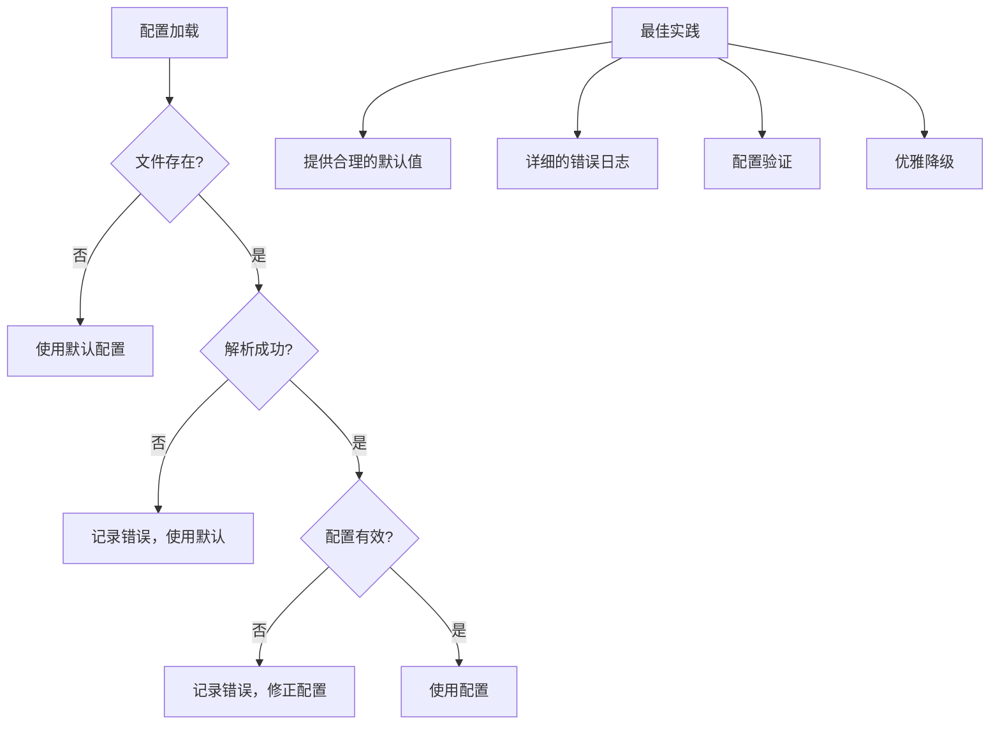

### 性能优化建议

1. **缓存配置**：使用单例模式避免重复加载
2. **异步加载**：在应用启动时预先加载配置
3. **懒加载**：按需加载特定模块的配置
4. **内存优化**：及时释放不再使用的配置对象

### 安全考虑

1. **敏感信息保护**：避免在配置文件中存储敏感信息
2. **权限控制**：限制配置文件的读写权限
3. **审计日志**：记录配置变更的历史记录
4. **备份恢复**：定期备份配置文件

## 总结

爬虫平台的配置加载机制体现了现代软件设计的最佳实践：

1. **分层架构**：通过默认配置和用户配置的分离，实现了灵活的配置管理
2. **线程安全**：使用`sync.Once`确保配置加载的线程安全性
3. **容错设计**：完善的错误处理和降级机制
4. **跨平台兼容**：统一的路径处理和文件操作接口
5. **易于扩展**：清晰的接口设计支持未来的功能扩展

该配置机制不仅满足了当前的功能需求，还为未来的功能扩展和性能优化奠定了良好的基础。通过合理的配置管理和加载策略，系统能够稳定、高效地运行在各种环境和负载条件下。