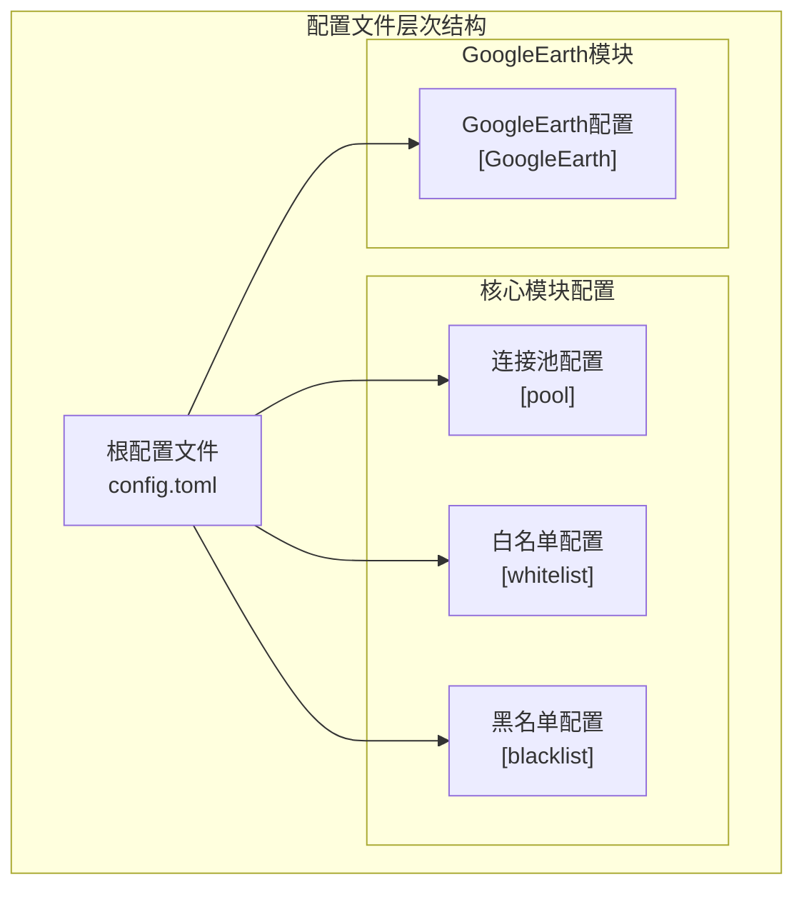
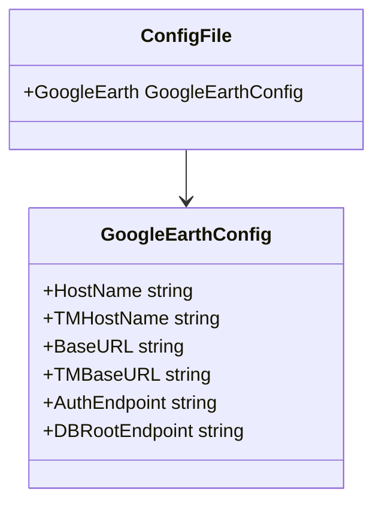
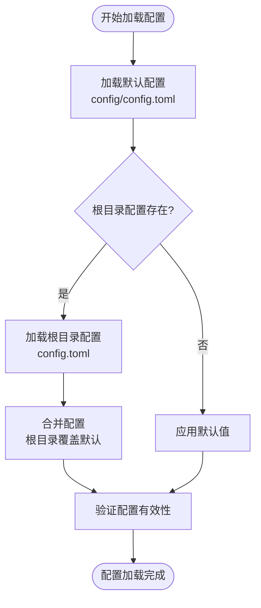
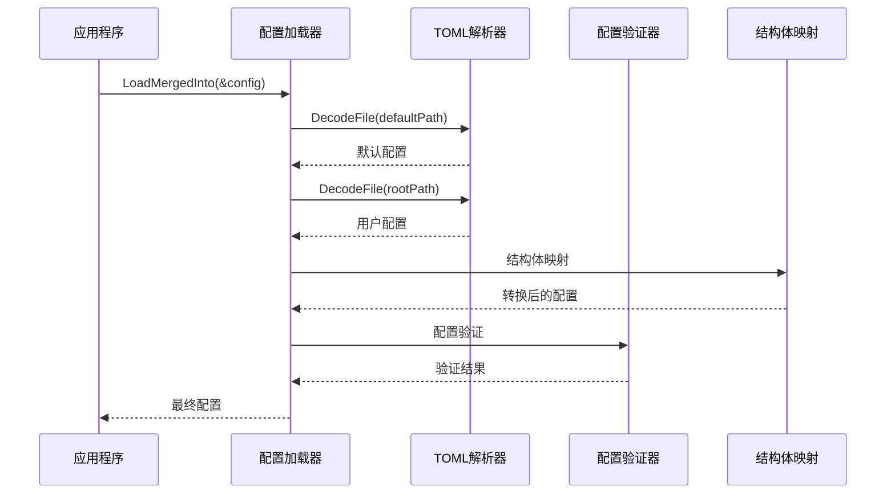

# 配置文件结构

<cite>
**本文档中引用的文件**
- [config/config.toml](file://config/config.toml)
- [config/config.go](file://config/config.go)
- [GoogleEarth/constants.go](file://GoogleEarth/constants.go)
</cite>

## 更新摘要
**变更内容**
- 新增了GoogleEarth配置部分，详细介绍了GoogleEarthConfig结构体及其配置项
- 更新了配置文件层次结构图，增加了GoogleEarth模块的配置层级
- 扩展了核心配置Section详解，增加了GoogleEarth主配置的详细说明
- 更新了结构体映射机制，展示了GoogleEarthConfig与TOML配置的映射关系
- 增加了GoogleEarth模块的常量配置说明

## 目录
1. [简介](#简介)
2. [TOML配置格式概述](#toml配置格式概述)
3. [配置文件层次结构](#配置文件层次结构)
4. [核心配置Section详解](#核心配置section详解)
5. [结构体映射机制](#结构体映射机制)
6. [配置合并策略](#配置合并策略)
7. [完整配置示例](#完整配置示例)
8. [配置解析流程](#配置解析流程)
9. [最佳实践指南](#最佳实践指南)
10. [故障排除](#故障排除)

## 简介

本文档详细介绍了Crawler Platform项目的配置文件结构和层次设计。项目采用TOML（Tom's Obvious, Minimal Language）格式作为主要配置文件格式，通过分层的配置Section组织不同功能模块的配置参数，实现了清晰的配置域划分和灵活的配置管理机制。特别地，本文档重点介绍了新增的GoogleEarth模块配置，该模块为Google Earth相关功能提供了专门的配置支持。

## TOML配置格式概述

TOML是一种简洁而强大的配置文件格式，具有以下特点：

- **人类可读**：语法直观，易于编辑和维护
- **类型安全**：支持字符串、整数、浮点数、布尔值等基本类型
- **层次结构**：通过方括号定义嵌套的配置Section
- **注释支持**：使用`#`符号添加注释
- **数组和表**：支持复杂数据结构的表示

### TOML语法基础

```toml
# 单行注释

# 基本键值对
key = "value"

# 数组
array = [1, 2, 3]

# 表（对象）
[table]
key = "value"

# 嵌套表
[nested.table]
key = "value"
```

## 配置文件层次结构

项目采用分层的配置架构，将不同功能模块的配置分离到独立的Section中：



**图表来源**
- [config/config.toml](file://config/config.toml)
- [config/config.go](file://config/config.go)

### 配置域划分原则

1. **功能分离**：每个模块拥有独立的配置域
2. **层次清晰**：支持嵌套配置以表达复杂关系
3. **命名规范**：使用描述性的Section名称
4. **类型安全**：通过结构体标签确保类型正确映射

## 核心配置Section详解

### 连接池配置 ([pool])

连接池配置是系统的核心组件，控制HTTP连接的生命周期管理：

| 配置项 | 类型 | 默认值 | 描述 |
|--------|------|--------|------|
| max_connections | int | 100 | 最大连接总数限制 |
| max_conns_per_host | int | 10 | 每个主机的最大连接数 |
| max_idle_conns | int | 20 | 最大空闲连接数 |
| conn_timeout | int | 30 | 连接超时时间（秒） |
| idle_timeout | int | 60 | 空闲连接超时时间（秒） |
| max_lifetime | int | 300 | 连接最大生命周期（秒） |
| test_timeout | int | 10 | 测试请求超时时间（秒） |
| health_check_interval | int | 30 | 健康检查间隔（秒） |
| cleanup_interval | int | 60 | 清理任务执行间隔（秒） |
| blacklist_check_interval | int | 300 | 黑名单检查间隔（秒） |
| dns_update_interval | int | 1800 | DNS缓存更新间隔（秒） |
| max_retries | int | 3 | 最大重试次数 |

**节来源**
- [config/config.toml](file://config/config.toml#L3-L27)

### 白名单配置 ([whitelist])

白名单配置用于限制允许访问的IP地址范围：

```toml
[whitelist]
ips = ["1.1.1.1", "8.8.8.8", "114.114.114.114"]
```

- **ips**: IP地址数组，支持IPv4和IPv6格式
- **作用**: 仅允许白名单中的IP地址进行连接
- **优先级**: 白名单优先于黑名单生效

**节来源**
- [config/config.toml](file://config/config.toml#L29-L32)

### 黑名单配置 ([blacklist])

黑名单配置用于阻止特定的IP地址访问：

```toml
[blacklist]
ips = ["192.168.1.1", "10.0.0.1"]
```

- **ips**: IP地址数组，支持CIDR格式
- **作用**: 阻止黑名单中的IP地址建立连接
- **优先级**: 黑名单优先于白名单生效

**节来源**
- [config/config.toml](file://config/config.toml#L33-L36)

### GoogleEarth模块配置

GoogleEarth模块包含专门的配置Section，用于管理Google Earth相关服务的连接和端点配置。

#### GoogleEarth主配置 ([GoogleEarth])

| 配置项 | 类型 | 默认值 | 描述 |
|--------|------|--------|------|
| host_name | string | "kh.google.com" | 主机名配置 |
| tm_host_name | string | "khmdb.google.com" | Time Machine主机名 |
| base_url | string | "https://kh.google.com" | API基础URL |
| tm_base_url | string | "https://khmdb.google.com" | TM API基础URL |
| auth_endpoint | string | "/geauth" | 认证端点 |
| dbroot_endpoint | string | "/dbRoot.v5" | dbRoot端点 |

**节来源**
- [config/config.go](file://config/config.go#L18-L25)
- [GoogleEarth/constants.go](file://GoogleEarth/constants.go#L21-L25)

## 结构体映射机制

项目通过Go语言的结构体标签实现TOML配置的自动解析和映射：

### 核心结构体设计



**图表来源**
- [config/config.go](file://config/config.go#L18-L25)

### 结构体标签映射

每个结构体字段都使用`toml:"字段名"`标签来指定对应的TOML键名：

```go
type GoogleEarthConfig struct {
	HostName       string `toml:"host_name"`
	TMHostName     string `toml:"tm_host_name"`
	BaseURL        string `toml:"base_url"`
	TMBaseURL      string `toml:"tm_base_url"`
	AuthEndpoint   string `toml:"auth_endpoint"`
	DBRootEndpoint string `toml:"dbroot_endpoint"`
}
```

### 类型转换机制

配置解析过程中会自动进行类型转换：

1. **基础类型转换**：字符串到整数、布尔值等
2. **时间单位转换**：秒到time.Duration
3. **数组处理**：字符串数组的解析
4. **嵌套结构**：多层配置的递归解析

**节来源**
- [config/config.go](file://config/config.go#L28-L30)

## 配置合并策略

项目实现了智能的配置合并机制，支持多层次的配置覆盖：

### 合并顺序



**图表来源**
- [config/config.go](file://config/config.go#L40-L55)

### 合并规则

1. **默认值优先**：首先加载默认配置文件
2. **覆盖机制**：根目录配置文件覆盖默认配置
3. **部分覆盖**：只覆盖指定的配置项
4. **类型安全**：确保类型兼容性

### 配置验证

加载完成后会进行配置验证：

```go
// 验证示例
if poolConfig.MaxConnections <= 0 {
    return nil, fmt.Errorf("max_connections 必须大于0")
}
```

**节来源**
- [config/config.go](file://config/config.go#L117-L126)
- [utlsclient/utlshotconnpool.go](file://utlsclient/utlshotconnpool.go#L117-L135)

## 完整配置示例

以下是完整的配置文件示例，展示了所有配置Section的使用：

```toml
# UTLSHotConnPool 连接池配置

[pool]
# 最大连接数
max_connections = 100
# 每个主机最大连接数  
max_conns_per_host = 10
# 最大空闲连接数
max_idle_conns = 20
# 连接超时时间 (秒)
conn_timeout = 30
# 空闲超时时间 (秒) 
idle_timeout = 60
# 连接最大生命周期 (秒)
max_lifetime = 300
# 测试请求超时时间 (秒)
test_timeout = 10
# 健康检查间隔 (秒)
health_check_interval = 30
# 清理间隔 (秒)
cleanup_interval = 60
# 黑名单检查间隔 (秒)
blacklist_check_interval = 300
# DNS更新间隔 (秒)
dns_update_interval = 1800
# 最大重试次数
max_retries = 3

# 可选：白名单IP列表
[whitelist]
# ips = ["1.1.1.1", "8.8.8.8", "114.114.114.114"]

# 可选：黑名单IP列表  
[blacklist]
# ips = ["192.168.1.1", "10.0.0.1"]

# GoogleEarth 相关配置
[GoogleEarth]
# 主机名配置
host_name = "kh.google.com"
# Time Machine 主机名
tm_host_name = "khmdb.google.com"
# API 基础URL
base_url = "https://kh.google.com"
# TM API 基础URL
tm_base_url = "https://khmdb.google.com"
# 认证端点
auth_endpoint = "/geauth"
# dbRoot 端点
dbroot_endpoint = "/dbRoot.v5"
```

**节来源**
- [config/config.toml](file://config/config.toml)
- [config/config.go](file://config/config.go)

## 配置解析流程

### 解析步骤



**图表来源**
- [config/config.go](file://config/config.go#L40-L55)

### 错误处理机制

配置解析过程中的错误处理：

1. **文件不存在**：静默跳过缺失的配置文件
2. **语法错误**：返回详细的解析错误信息
3. **类型错误**：类型不匹配时给出具体提示
4. **验证失败**：配置值无效时抛出明确的错误

**节来源**
- [config/config.go](file://config/config.go#L46-L54)

## 最佳实践指南

### 配置文件组织

1. **模块化设计**：每个功能模块使用独立的配置Section
2. **层次清晰**：合理使用嵌套结构表达配置关系
3. **命名规范**：使用描述性的Section和字段名称
4. **注释完整**：为每个配置项添加必要的注释

### 性能优化建议

1. **合理设置超时**：根据网络环境调整超时参数
2. **连接池优化**：平衡连接数和资源消耗
3. **缓存策略**：合理配置缓存大小和过期时间
4. **监控指标**：启用适当的日志级别进行监控

### 安全考虑

1. **敏感信息保护**：避免在配置文件中直接存储敏感信息
2. **权限控制**：确保配置文件的适当访问权限
3. **证书验证**：生产环境中启用TLS证书验证
4. **IP限制**：使用白名单/黑名单控制访问

### 部署建议

1. **环境隔离**：为不同环境准备不同的配置文件
2. **配置验证**：部署前验证配置文件的有效性
3. **备份策略**：定期备份配置文件
4. **版本控制**：将配置文件纳入版本控制系统

## 故障排除

### 常见问题及解决方案

#### 配置文件解析失败

**症状**：应用程序启动时提示配置解析错误

**可能原因**：
- TOML语法错误
- 字段类型不匹配
- 文件编码问题

**解决方案**：
1. 检查TOML语法是否正确
2. 验证字段类型与实际值匹配
3. 确保文件使用UTF-8编码

#### 配置值无效

**症状**：应用程序运行时出现配置相关的错误

**可能原因**：
- 配置值超出有效范围
- 必需字段缺失
- 依赖关系不满足

**解决方案**：
1. 检查配置值是否在有效范围内
2. 确认必需字段已正确设置
3. 验证配置项之间的依赖关系

#### 配置合并冲突

**症状**：期望的配置值被意外覆盖

**可能原因**：
- 默认配置与用户配置冲突
- 配置文件加载顺序问题

**解决方案**：
1. 检查配置文件的加载顺序
2. 理解配置合并规则
3. 使用调试模式查看最终配置

### 调试技巧

1. **启用调试模式**：设置`debug = true`获取详细日志
2. **检查配置加载**：确认配置文件路径正确
3. **验证配置结构**：使用配置验证功能
4. **对比配置差异**：比较默认配置与用户配置

**节来源**
- [config/config.go](file://config/config.go#L60-L66)
- [utlsclient/utlshotconnpool.go](file://utlsclient/utlshotconnpool.go#L117-L126)

通过本文档的详细介绍，开发者可以全面理解Crawler Platform项目的配置文件结构和使用方法，掌握配置的最佳实践，并能够有效地进行配置管理和故障排除。特别地，新增的GoogleEarth模块配置为Google Earth相关功能提供了灵活的配置选项，使系统能够更好地适应不同的部署环境和需求。