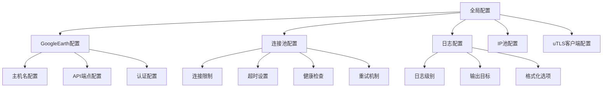
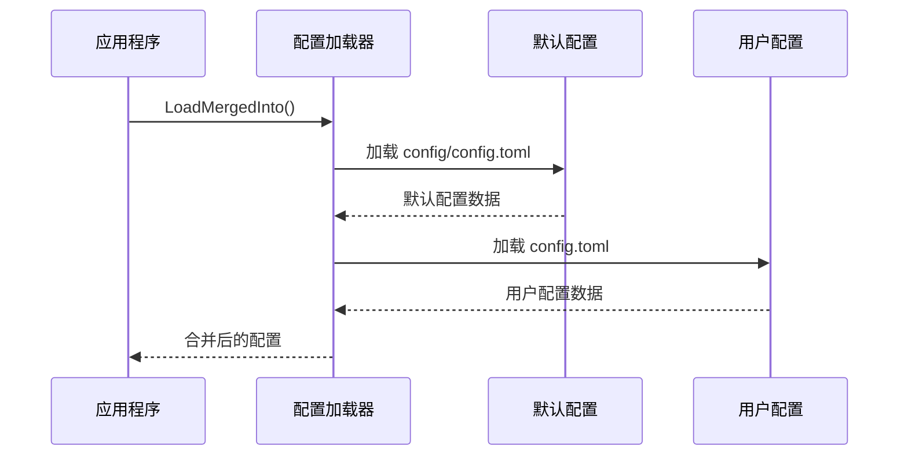
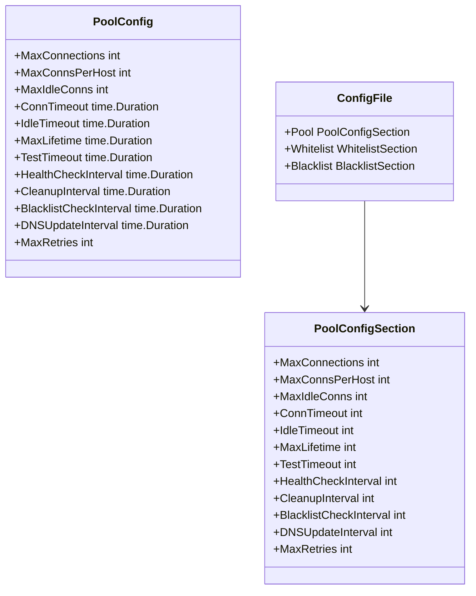

# 配置管理

<cite>
**本文档引用的文件**
- [config/config.go](file://config/config.go)
- [config/config.toml](file://config/config.toml)
- [GoogleEarthClient/config/config.toml](file://GoogleEarthClient/config/config.toml)
- [logger/logger.go](file://logger/logger.go)
- [logger/interfaces.go](file://logger/interfaces.go)
- [utlsclient/utlshotconnpool.go](file://utlsclient/utlshotconnpool.go)
- [cmd/utlsclient/main.go](file://cmd/utlsclient/main.go)
- [examples/utlsclient/example_hotconnpool_usage.go](file://examples/utlsclient/example_hotconnpool_usage.go)
- [README.md](file://README.md)
</cite>

## 目录
1. [简介](#简介)
2. [配置文件结构](#配置文件结构)
3. [配置加载机制](#配置加载机制)
4. [核心配置项详解](#核心配置项详解)
5. [日志配置系统](#日志配置系统)
6. [连接池配置](#连接池配置)
7. [配置文件示例](#配置文件示例)
8. [配置访问和使用](#配置访问和使用)
9. [配置最佳实践](#配置最佳实践)
10. [常见配置错误排查](#常见配置错误排查)

## 简介

本项目采用分层配置管理架构，支持多种配置文件格式和加载策略。配置系统主要包含以下特点：

- **多层次配置**：支持全局配置、连接池配置、日志配置等
- **灵活加载**：支持合并加载和独立加载两种模式
- **类型安全**：使用Go结构体和TOML标签确保配置类型安全
- **环境适应**：支持不同环境下的配置定制

## 配置文件结构

### 配置层次架构



**图表来源**
- [config/config.go](file://config/config.go#L18-L31)
- [GoogleEarthClient/config/config.toml](file://GoogleEarthClient/config/config.toml#L3-L108)

### 配置文件位置

项目支持两种配置文件位置，按优先级顺序加载：

1. **项目根目录**：`config.toml`（高优先级）
2. **配置文件夹**：`config/config.toml`（低优先级）

**章节来源**
- [config/config.go](file://config/config.go#L14-L16)

## 配置加载机制

### 加载策略

配置加载采用合并策略，先加载默认配置，再加载用户自定义配置：



**图表来源**
- [config/config.go](file://config/config.go#L41-L56)

### 配置解析过程

配置解析使用BurntSushi/toml库，支持以下特性：

- **类型映射**：自动将TOML值映射到Go结构体字段
- **标签验证**：通过TOML标签确保字段名称匹配
- **错误处理**：提供详细的解析错误信息

**章节来源**
- [config/config.go](file://config/config.go#L41-L56)

## 核心配置项详解

### GoogleEarth配置

GoogleEarth相关配置包含以下核心字段：

| 配置项 | 类型 | 默认值 | 说明 |
|--------|------|--------|------|
| host_name | string | "kh.google.com" | 主机名配置 |
| tm_host_name | string | "khmdb.google.com" | TM主机名配置 |
| base_url | string | "https://kh.google.com" | API基础URL |
| tm_base_url | string | "https://khmdb.google.com" | TM API基础URL |
| auth_endpoint | string | "/geauth" | 认证端点路径 |
| dbroot_endpoint | string | "/dbRoot.v5" | 数据库根端点 |

**章节来源**
- [config/config.go](file://config/config.go#L19-L26)

### 连接池配置详解

连接池配置是系统性能的关键参数：

| 配置项 | 类型 | 默认值 | 取值范围 | 说明 |
|--------|------|--------|----------|------|
| max_connections | int | 100 | >0 | 最大连接总数 |
| max_conns_per_host | int | 10 | >0 | 每个主机最大连接数 |
| max_idle_conns | int | 20 | ≥0 | 最大空闲连接数 |
| conn_timeout | int | 30 | >0 | 连接超时时间（秒） |
| idle_timeout | int | 60 | ≥0 | 空闲连接超时时间（秒） |
| max_lifetime | int | 300 | ≥0 | 连接最大生命周期（秒） |
| test_timeout | int | 10 | >0 | 测试请求超时时间（秒） |
| health_check_interval | int | 30 | >0 | 健康检查间隔（秒） |
| cleanup_interval | int | 60 | >0 | 清理间隔（秒） |
| blacklist_check_interval | int | 300 | >0 | 黑名单检查间隔（秒） |
| dns_update_interval | int | 1800 | >0 | DNS更新间隔（秒） |
| max_retries | int | 3 | ≥0 | 最大重试次数 |

**章节来源**
- [config/config.toml](file://config/config.toml#L3-L36)
- [utlsclient/utlshotconnpool.go](file://utlsclient/utlshotconnpool.go#L170-L184)

## 日志配置系统

### 日志接口设计

项目采用接口驱动的日志系统，支持多种日志实现：

```mermaid
classDiagram
class Logger {
<<interface>>
+Debug(format string, args ...interface{})
+Info(format string, args ...interface{})
+Warn(format string, args ...interface{})
+Error(format string, args ...interface{})
}
class DefaultLogger {
+Debug(format string, args ...interface{})
+Info(format string, args ...interface{})
+Warn(format string, args ...interface{})
+Error(format string, args ...interface{})
}
class ConsoleLogger {
-debug bool
-info bool
-warn bool
-error bool
+Debug(format string, args ...interface{})
+Info(format string, args ...interface{})
+Warn(format string, args ...interface{})
+Error(format string, args ...interface{})
}
class FileLogger {
-file *os.File
-logger *log.Logger
-debug bool
-info bool
-warn bool
-error bool
+Debug(format string, args ...interface{})
+Info(format string, args ...interface{})
+Warn(format string, args ...interface{})
+Error(format string, args ...interface{})
+Close() error
}
class MultiLogger {
-loggers []Logger
+Debug(format string, args ...interface{})
+Info(format string, args ...interface{})
+Warn(format string, args ...interface{})
+Error(format string, args ...interface{})
}
Logger <|.. DefaultLogger
Logger <|.. ConsoleLogger
Logger <|.. FileLogger
Logger <|.. MultiLogger
```

**图表来源**
- [logger/interfaces.go](file://logger/interfaces.go#L5-L32)
- [logger/logger.go](file://logger/logger.go#L44-L133)

### 日志级别配置

| 级别 | 用途 | 输出内容 |
|------|------|----------|
| DEBUG | 调试信息 | 详细的执行流程和变量值 |
| INFO | 一般信息 | 关键操作和状态变化 |
| WARN | 警告信息 | 潜在问题但不影响运行 |
| ERROR | 错误信息 | 发生错误但可恢复 |

**章节来源**
- [logger/logger.go](file://logger/logger.go#L39-L42)

## 连接池配置

### 配置结构体

连接池配置通过专门的结构体管理：



**图表来源**
- [utlsclient/utlshotconnpool.go](file://utlsclient/utlshotconnpool.go#L53-L84)
- [utlsclient/utlshotconnpool.go](file://utlsclient/utlshotconnpool.go#L170-L184)

### 默认配置

系统提供合理的默认配置：

```go
func DefaultPoolConfig() *PoolConfig {
    return &PoolConfig{
        MaxConnections:         100,
        MaxConnsPerHost:        10,
        MaxIdleConns:           20,
        ConnTimeout:            30 * time.Second,
        IdleTimeout:            60 * time.Second,
        MaxLifetime:            300 * time.Second,
        TestTimeout:            10 * time.Second,
        HealthCheckInterval:    30 * time.Second,
        CleanupInterval:        60 * time.Second,
        BlacklistCheckInterval: 300 * time.Second,
        DNSUpdateInterval:      1800 * time.Second,
        MaxRetries:             3,
    }
}
```

**章节来源**
- [utlsclient/utlshotconnpool.go](file://utlsclient/utlshotconnpool.go#L187-L202)

## 配置文件示例

### 完整配置示例

以下是完整的配置文件示例，包含所有主要配置项：

```toml
# GoogleEarth 相关配置
[GoogleEarth]
host_name = "kh.google.com"
tm_host_name = "khmdb.google.com"
base_url = "https://kh.google.com"
tm_base_url = "https://khmdb.google.com"
auth_endpoint = "/geauth"
dbroot_endpoint = "/dbRoot.v5"

# 连接池配置
[pool]
max_connections = 100
max_conns_per_host = 10
max_idle_conns = 20
conn_timeout = 30
idle_timeout = 60
max_lifetime = 300
test_timeout = 10
health_check_interval = 30
cleanup_interval = 60
blacklist_check_interval = 300
dns_update_interval = 1800
max_retries = 3

# 白名单配置（可选）
[whitelist]
ips = ["1.1.1.1", "8.8.8.8", "114.114.114.114"]

# 黑名单配置（可选）
[blacklist]
ips = ["192.168.1.1", "10.0.0.1"]

# IP池配置
[IPPool]
base_url = "http://tile0.zeromaps.cn:9005"
data_dir = "./IPPoolData"
sync_interval_seconds = 300
client_timeout_seconds = 60

# uTLS客户端配置
[UtlsClient]
default_timeout_seconds = 30
insecure_skip_verify = false
default_server_name = ""
proxy = ""
local_ip = ""

# 连接池配置
[UtlsClient.connection_pool]
max_connections = 100
connection_timeout_seconds = 10
idle_timeout_seconds = 90

# 全局配置
[Global]
project_name = "ZeroMaps"
debug = false
log_level = "info"
```

**章节来源**
- [GoogleEarthClient/config/config.toml](file://GoogleEarthClient/config/config.toml#L1-L108)

### 生产环境配置示例

针对生产环境的优化配置：

```toml
# 生产环境配置
[pool]
max_connections = 500
max_conns_per_host = 20
max_idle_conns = 50
conn_timeout = 15
idle_timeout = 120
max_lifetime = 600
test_timeout = 5
health_check_interval = 15
cleanup_interval = 30
blacklist_check_interval = 600
dns_update_interval = 3600
max_retries = 5

# 日志配置
[Global]
log_level = "warn"
debug = false

# IP池配置
[IPPool]
sync_interval_seconds = 600
client_timeout_seconds = 30
```

## 配置访问和使用

### 配置加载示例

#### 基本配置加载

```go
// 加载合并配置
var config Config
err := projconfig.LoadMergedInto(&config)
if err != nil {
    log.Fatalf("加载配置失败: %v", err)
}

// 使用配置
fmt.Printf("GoogleEarth主机名: %s\n", config.GoogleEarth.HostName)
```

**章节来源**
- [config/config.go](file://config/config.go#L41-L56)

#### 连接池配置加载

```go
// 从文件加载连接池配置
config, err := utlsclient.LoadPoolConfigFromFile("config.toml")
if err != nil {
    log.Fatalf("加载连接池配置失败: %v", err)
}

// 创建连接池
pool := utlsclient.NewUTLSHotConnPool(config)
defer pool.Close()
```

**章节来源**
- [examples/utlsclient/example_hotconnpool_usage.go](file://examples/utlsclient/example_hotconnpool_usage.go#L18-L23)

### 配置验证

系统提供配置验证机制，确保配置的有效性：

```go
// 配置验证示例
if poolConfig.MaxConnections <= 0 {
    return nil, fmt.Errorf("max_connections 必须大于0")
}
if poolConfig.ConnTimeout <= 0 {
    return nil, fmt.Errorf("conn_timeout 必须大于0")
}
```

**章节来源**
- [utlsclient/utlshotconnpool.go](file://utlsclient/utlshotconnpool.go#L117-L135)

## 配置最佳实践

### 环境配置策略

#### 1. 开发环境配置

```toml
[Global]
debug = true
log_level = "debug"

[pool]
max_connections = 20
max_conns_per_host = 5
health_check_interval = 10
```

#### 2. 测试环境配置

```toml
[Global]
debug = false
log_level = "info"

[pool]
max_connections = 50
max_conns_per_host = 10
health_check_interval = 30
```

#### 3. 生产环境配置

```toml
[Global]
debug = false
log_level = "warn"

[pool]
max_connections = 200
max_conns_per_host = 20
health_check_interval = 60
cleanup_interval = 120
```

### 敏感信息处理

#### 环境变量替代

对于敏感配置，建议使用环境变量：

```go
// 从环境变量读取敏感配置
googleEarthConfig := config.GoogleEarthConfig{
    BaseURL: os.Getenv("GOOGLE_EARTH_BASE_URL"),
    AuthEndpoint: os.Getenv("GOOGLE_EARTH_AUTH_ENDPOINT"),
}
```

#### 配置文件权限

确保配置文件权限设置正确：

```bash
# 设置配置文件权限
chmod 600 config.toml
chmod 600 config/config.toml
```

### 性能调优建议

#### 1. 连接池大小优化

根据实际负载调整连接池大小：

```go
// 根据CPU核心数和预期并发调整
cpuCores := runtime.NumCPU()
optimalConnections := cpuCores * 10

config := &PoolConfig{
    MaxConnections: optimalConnections,
    MaxConnsPerHost: optimalConnections / 5,
}
```

#### 2. 超时时间设置

根据网络状况调整超时时间：

```go
// 根据网络延迟调整
networkLatency := measureNetworkLatency()
config.ConnTimeout = time.Duration(networkLatency * 1.5) * time.Second
```

#### 3. 健康检查频率

平衡健康检查精度和性能：

```go
// 高负载环境：减少检查频率
config.HealthCheckInterval = 60 * time.Second

// 低负载环境：增加检查频率
config.HealthCheckInterval = 15 * time.Second
```

## 常见配置错误排查

### 配置文件解析错误

#### 错误现象
```
解析 config.toml 失败: toml: line 15: unexpected character: '!'
```

#### 排查步骤
1. 检查TOML语法是否正确
2. 确认引号使用是否匹配
3. 验证数值类型是否正确

#### 解决方案
```toml
# 错误：特殊字符未转义
description = "This is a test! Important."

# 正确：使用双引号
description = "This is a test! Important."
```

### 配置项类型错误

#### 错误现象
```
解析失败: cannot unmarshal string into Go struct field PoolConfigSection.max_connections of type int
```

#### 排查步骤
1. 检查配置项的数据类型
2. 确认TOML值格式正确
3. 验证结构体标签匹配

#### 解决方案
```toml
# 错误：字符串格式的整数
max_connections = "100"

# 正确：纯数字
max_connections = 100
```

### 配置验证失败

#### 错误现象
```
max_connections 必须大于0
```

#### 排查步骤
1. 检查配置值是否符合约束条件
2. 确认配置项是否有默认值
3. 验证配置加载顺序

#### 解决方案
```go
// 确保配置值有效
if config.MaxConnections <= 0 {
    config.MaxConnections = 100 // 设置合理默认值
}
```

### 连接池配置冲突

#### 错误现象
```
max_conns_per_host 必须小于等于 max_connections
```

#### 排查步骤
1. 检查连接池配置的逻辑关系
2. 确认各配置项之间的约束条件
3. 验证配置的合理性

#### 解决方案
```go
// 确保配置逻辑一致
if config.MaxConnsPerHost > config.MaxConnections {
    config.MaxConnsPerHost = config.MaxConnections / 2
}
```

### 日志配置问题

#### 错误现象
```
无法打开日志文件: permission denied
```

#### 排查步骤
1. 检查文件权限设置
2. 确认目录存在且可写
3. 验证路径格式正确

#### 解决方案
```go
// 设置正确的文件权限
logger, err := NewFileLogger("./logs/app.log", true, true, true, true)
if err != nil {
    log.Fatalf("创建日志文件失败: %v", err)
}
```

### 配置加载失败

#### 错误现象
```
加载配置失败: open config.toml: no such file or directory
```

#### 排查步骤
1. 检查配置文件是否存在
2. 确认文件路径是否正确
3. 验证文件读取权限

#### 解决方案
```go
// 检查文件存在性
if !fileExists("config.toml") {
    fmt.Println("警告：配置文件不存在，使用默认配置")
    config = DefaultConfig()
}
```

通过遵循这些最佳实践和排查指南，可以确保配置系统的稳定性和可靠性，为应用程序提供良好的运行环境。